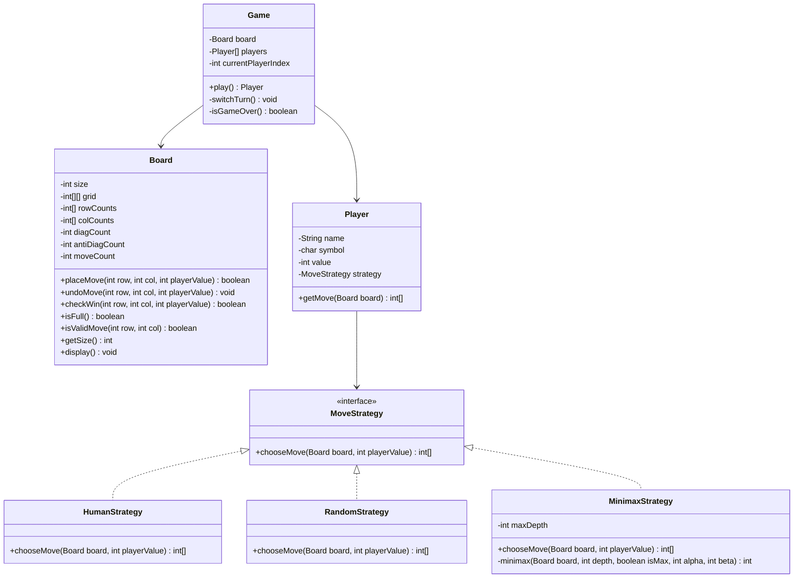

# Machine Coding: Design Tic-Tac-Toe (LLD)

## Quick Summary (TL;DR)
* **Goal**: Build an NxN extensible Tic-Tac-Toe game with clean OOP modeling, O(1) win detection, turn management, and pluggable AI strategies.
* **Design Patterns Used**:
  - **Strategy Pattern**: Pluggable move strategies for AI players (random, minimax with alpha-beta pruning).
  - **Template Method**: Game loop follows a fixed sequence (display board, get move, validate, apply, check outcome) while individual steps are customizable.
* **Core Principle**: Separate concerns -- the `Board` manages grid state and win detection, `Player` encapsulates identity and move strategy, and `Game` orchestrates the loop and enforces rules.

---

## Noob Jargon Buster

* **O(1) Win Detection**: Instead of scanning the entire board after every move (O(n) for an NxN board), we maintain running counters for each row, column, and both diagonals. Each move increments/decrements the relevant counters, and a win is detected when any counter reaches +N or -N.
* **Strategy Pattern**: Define a family of algorithms (e.g., random move, minimax), encapsulate each one, and make them interchangeable. The `Player` doesn't care *how* the move is chosen -- it delegates to a `MoveStrategy`.
* **Minimax Algorithm**: A recursive algorithm for two-player zero-sum games. It explores all possible future game states, assuming the opponent plays optimally, and picks the move that maximizes the current player's advantage.
* **Alpha-Beta Pruning**: An optimization on top of minimax that skips branches of the game tree that can't possibly influence the final decision, reducing the search space dramatically.
* **Command Pattern (Undo/Redo)**: Each move is encapsulated as a command object that knows how to execute itself *and* reverse itself, enabling full undo/redo history.

---

## 1. Problem Statement & Requirements

Design a Tic-Tac-Toe game that supports:
1. **NxN Board**: Configurable board size (classic 3x3 is the default).
2. **Two Players**: Each player has a unique symbol (X, O). Players can be human or AI.
3. **Turn Management**: Players alternate turns. The game enforces valid moves (no overwriting occupied cells).
4. **Win Detection**: Detect a win when a player fills an entire row, column, or diagonal. Must be O(1) per move.
5. **Draw Detection**: Detect a draw when all cells are filled with no winner.
6. **AI Players**: At least one AI strategy (random), with the architecture supporting smarter strategies (minimax).
7. **Extensibility**: The design should make it easy to add undo/redo, game replay, or new board shapes.

---

## 2. O(1) Win Detection Algorithm

The key insight: instead of scanning the board after every move, maintain **counter arrays** and check them in O(1).

### Data Structures

For an NxN board with two players (represented as +1 and -1):

```
rowCounts[N]      -- one counter per row
colCounts[N]      -- one counter per column
diagCount         -- main diagonal (top-left to bottom-right)
antiDiagCount     -- anti-diagonal (top-right to bottom-left)
```

### How It Works

When player +1 places at (row, col):
```
rowCounts[row]     += 1
colCounts[col]     += 1
if (row == col)        diagCount     += 1
if (row + col == N-1)  antiDiagCount += 1
```

When player -1 places at (row, col), subtract 1 instead.

**Win condition**: Any counter reaches `+N` (player +1 wins) or `-N` (player -1 wins).

### ASCII Diagram (3x3 Example)

```
Board State:           Counter State:
  X | O | X            rowCounts = [+1, -1, +1]
 ---+---+---           colCounts = [+1, -1, +1]
  O | O | O            diagCount = 0
 ---+---+---           antiDiagCount = 0
  X |   |   
                       Player O placed at (1,0), (1,1), (1,2)
                       rowCounts[1] = -1 + -1 + -1 = -3
                       |rowCounts[1]| == 3 == N --> O WINS!
```

### Why Not Scan the Board?

| Approach | Time per move | Total for full game |
|----------|--------------|---------------------|
| Board scan | O(N) | O(N^2 * N) = O(N^3) |
| Counter-based | O(1) | O(N^2) |

For large N (e.g., 15x15 Gomoku variant), the difference is significant.

---

## 3. Class Design & Architecture



### Relationships

- **Game** owns a `Board` and an array of `Player`s. It runs the game loop.
- **Player** delegates move selection to a `MoveStrategy` (Strategy Pattern).
- **Board** encapsulates the grid, move validation, and O(1) win detection via counters.
- **MoveStrategy** is the strategy interface -- swap `RandomStrategy` for `MinimaxStrategy` without changing `Player` or `Game`.

---

## 4. Key Java Implementation

### O(1) Win Detection (Board)

```java
boolean placeMove(int row, int col, int playerValue) {
    if (!isValidMove(row, col)) return false;
    grid[row][col] = playerValue;
    rowCounts[row] += playerValue;
    colCounts[col] += playerValue;
    if (row == col) diagCount += playerValue;
    if (row + col == size - 1) antiDiagCount += playerValue;
    moveCount++;
    return true;
}

boolean checkWin(int row, int col, int playerValue) {
    int target = playerValue * size;  // +N or -N
    return rowCounts[row] == target
        || colCounts[col] == target
        || (row == col && diagCount == target)
        || (row + col == size - 1 && antiDiagCount == target);
}
```

### Undo Support (Board)

```java
void undoMove(int row, int col, int playerValue) {
    grid[row][col] = 0;
    rowCounts[row] -= playerValue;
    colCounts[col] -= playerValue;
    if (row == col) diagCount -= playerValue;
    if (row + col == size - 1) antiDiagCount -= playerValue;
    moveCount--;
}
```

### Minimax with Alpha-Beta Pruning

```java
int minimax(Board board, int depth, boolean isMaximizing,
            int alpha, int beta, int aiValue) {
    // Base cases: check terminal states
    // Recursive case: try all empty cells
    for (int r = 0; r < board.getSize(); r++) {
        for (int c = 0; c < board.getSize(); c++) {
            if (!board.isValidMove(r, c)) continue;
            int currentPlayer = isMaximizing ? aiValue : -aiValue;
            board.placeMove(r, c, currentPlayer);
            if (board.checkWin(r, c, currentPlayer)) {
                board.undoMove(r, c, currentPlayer);
                return isMaximizing ? 10 - depth : depth - 10;
            }
            int score = minimax(board, depth + 1, !isMaximizing,
                                alpha, beta, aiValue);
            board.undoMove(r, c, currentPlayer);
            if (isMaximizing) {
                alpha = Math.max(alpha, score);
            } else {
                beta = Math.min(beta, score);
            }
            if (beta <= alpha) return isMaximizing ? alpha : beta;
        }
    }
    return 0; // draw
}
```

### Game Loop

```java
Player play() {
    while (true) {
        Player current = players[currentPlayerIndex];
        board.display();
        int[] move = current.getMove(board);
        board.placeMove(move[0], move[1], current.value);
        if (board.checkWin(move[0], move[1], current.value)) {
            board.display();
            return current;  // winner
        }
        if (board.isFull()) {
            board.display();
            return null;  // draw
        }
        switchTurn();
    }
}
```

---

## 5. SDE-2 Interview Angles

### Q1: Why O(1) win detection instead of scanning the board after each move?

**Answer**: Scanning the board is O(N) per move (check the row, column, and both diagonals the move touches). With the counter approach, each `placeMove` updates at most 4 counters and `checkWin` compares at most 4 values -- both O(1). Over a full game of up to N^2 moves, this saves O(N^3) vs O(N^2) total work. For large boards (Gomoku at 15x15 or 19x19), this matters. The counter approach also naturally supports undo -- just subtract the player value.

### Q2: How would you extend this to NxN or a Connect-K variant (e.g., Connect-4)?

**Answer**: For pure NxN Tic-Tac-Toe (need all N in a row), the counter approach works as-is -- just change the board size. For Connect-K (need K consecutive marks in a row of N, where K < N), the counter approach breaks down because it tracks total marks per row, not *consecutive* marks. You'd need a different approach:
- Use a sliding window of size K along each row, column, and diagonal.
- Or maintain a run-length tracking structure.
- The time per move goes from O(1) to O(K), which is still better than a full board scan.

### Q3: How would you implement undo/redo using the Command Pattern?

**Answer**: Each move becomes a `MoveCommand` object storing `{row, col, playerValue}`. Maintain two stacks: `undoStack` and `redoStack`. When a move is made, push it onto `undoStack` and clear `redoStack`. For undo: pop from `undoStack`, call `board.undoMove(...)`, push onto `redoStack`. For redo: pop from `redoStack`, call `board.placeMove(...)`, push onto `undoStack`. The board's `undoMove` method reverses the counter updates, keeping O(1) detection intact. Also switch the current player back. This pairs well with game replay -- just iterate through the undo stack.

### Q4: How would you make this thread-safe for online multiplayer?

**Answer**: The key shared mutable state is the `Board` (grid and counters) and the turn indicator. Options:
- **Synchronized Game**: Wrap `placeMove` + `checkWin` + `switchTurn` in a `synchronized` block on the `Game` object. Simple but coarse-grained.
- **ReentrantLock with Condition**: Use a lock with a `Condition` per player. Each player's thread waits on its condition; after a move, signal the other player's condition. This prevents busy-waiting.
- **Event-driven (better for network)**: Players submit moves via a thread-safe queue. A single game thread processes moves sequentially -- no locking needed on the board. This is the standard approach for online games (message passing over shared state).
- Validate that it's actually the submitting player's turn (prevent out-of-turn moves in all approaches).

### Q5: Explain minimax with alpha-beta pruning for Tic-Tac-Toe AI.

**Answer**: Minimax models the game as a tree where each node is a board state. The maximizing player (AI) picks the child with the highest score; the minimizing player (opponent) picks the lowest. For 3x3 Tic-Tac-Toe, the tree has at most 9! = 362,880 leaves (much less with pruning).

**Alpha-beta pruning** maintains two values:
- **Alpha**: best score the maximizer can guarantee (starts at -inf).
- **Beta**: best score the minimizer can guarantee (starts at +inf).

If at any node `beta <= alpha`, we prune the remaining children -- they can't affect the outcome. This typically reduces the effective branching factor from ~b to ~sqrt(b), making 3x3 trivially fast and even 4x4 feasible.

For larger boards, add:
- **Depth limiting** with a heuristic evaluation function.
- **Move ordering** (try center and corners first) to maximize pruning.
- **Transposition table** (cache evaluated board states by hash) to avoid re-computation.

### Q6: How would you support more than 2 players or different board shapes?

**Answer**: The counter-based win detection assumes exactly 2 players (mapped to +1 and -1). For 3+ players, counters can't detect wins by cancellation. Options:
- Use separate counter arrays per player (memory: O(P * N) where P = players).
- Or fall back to O(K) consecutive-mark checking.

For non-square boards (hexagonal, toroidal), the `Board` abstraction needs to define its own adjacency/line structure. Extract a `WinDetector` interface so different board shapes can plug in different detection logic without changing `Game` or `Player`.
