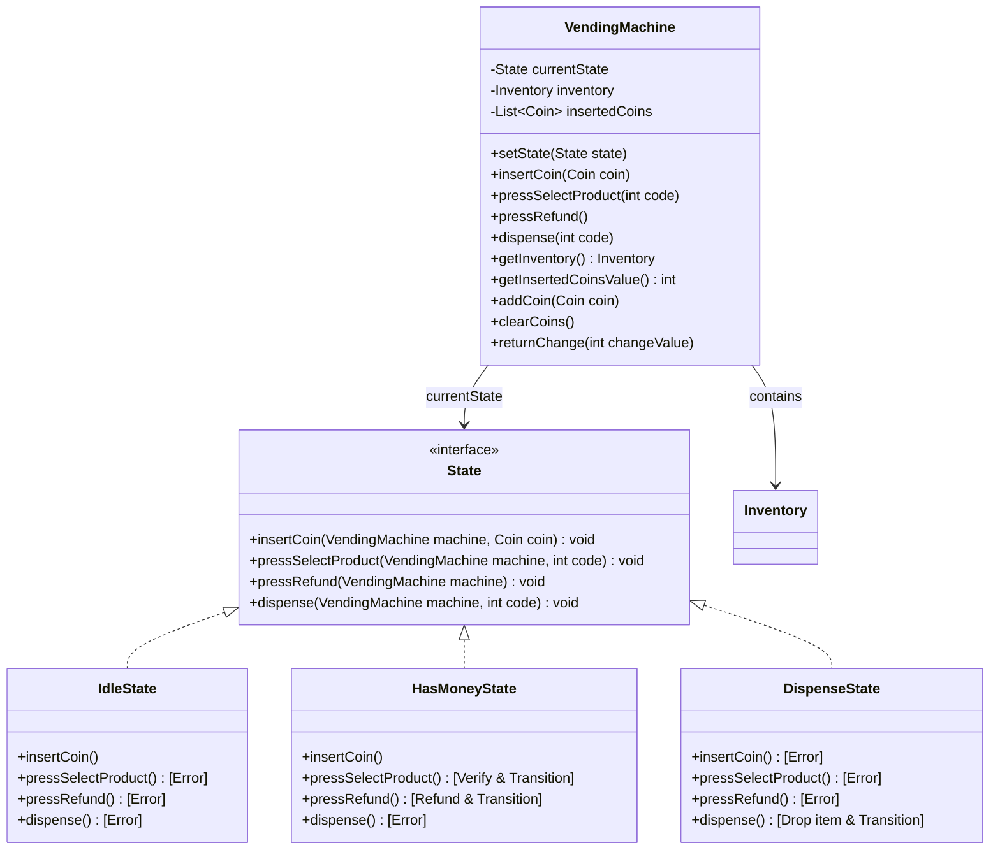

# Machine Coding: Design a Vending Machine (LLD)

## Quick Summary (TL;DR)
* **Goal**: Build a self-contained Vending Machine system that manages inventory, accepts coins, validates transactions, returns change, and handles out-of-stock items.
* **Design Patterns Used**: 
  - **State Pattern**: To encapsulate state-specific behavior and cleanly manage transitions (`Idle` -> `HasMoney` -> `Dispense`).
  - **Factory Pattern**: (Optional) For creating products or states.
* **Core Principle**: Avoid a giant `switch-case` statement by delegating state operations to dedicated state classes.

---

## 🤓 Noob Jargon Buster

* **State Pattern**: Think of the vending machine like a person. If they are in a "sleeping" mood (Idle), they react differently to a push than if they are "hungry" (HasMoney). Instead of writing one giant `if/else` block checking the mood for every action, we create separate classes for each mood (`IdleState`, `HasMoneyState`, `DispenseState`) and let them decide how to react.
* **Context Class (`VendingMachine`)**: The main controller class. It doesn't actually know how to handle coin insertion or item dispensing; it just holds a reference to the current State object and says: "Hey state, handle this for me!"
* **State Transition**: Switching from one state class to another (e.g., changing the active state reference from `IdleState` to `HasMoneyState` when a coin is accepted).
* **Coin Reservoir**: The bucket of money inside the machine used to give change back. If a customer inserts a dollar for an 85¢ soda, and the reservoir is out of nickels/dimes, the machine should refuse the transaction early instead of stealing their money.

---

## 1. Problem Statement & Requirements

You need to design a system for a smart Vending Machine that supports the following operations:
1. **Accept Coins**: Supports coins of denominations `PENNY(1)`, `NICKEL(5)`, `DIME(10)`, and `QUARTER(25)`.
2. **Product Inventory**: Tracks items (e.g., COKE, PEPSI, SODA) in slots identified by codes (e.g., `101`, `102`, `103`).
3. **Purchasing Flow**:
   - Customer inserts coins. The balance increases.
   - Customer enters a product code.
   - If balance is sufficient and item is in stock, the machine dispenses the item and returns change.
   - If balance is insufficient, the machine asks for more money.
   - If the item is out of stock, the machine throws an error and refunds the coins.
4. **Refund**: Customer can press a "Refund" button at any time before dispensing to cancel the transaction and get all money back.

---

## 2. State Machine Transitions

Using a state-based approach simplifies the logic. We define three main states:

```mermaid
stateDiagram-v2
    [*] --> IdleState : Initialize Vending Machine
    
    state IdleState {
        Note left of IdleState : Waiting for coin insertion
    }
    
    state HasMoneyState {
        Note left of HasMoneyState : Money inserted, waiting for product selection or refund
    }
    
    state DispenseState {
        Note left of DispenseState : Sufficient money, dispensing item & change
    }
    
    IdleState --> HasMoneyState : insertCoin()
    
    HasMoneyState --> HasMoneyState : insertCoin() [Add balance]
    HasMoneyState --> IdleState : refund() [Returns all coins]
    HasMoneyState --> DispenseState : selectProduct() [If balance >= price && in stock]
    HasMoneyState --> HasMoneyState : selectProduct() [If balance < price (error)]
    HasMoneyState --> IdleState : selectProduct() [If out of stock (refunds all)]
    
    DispenseState --> IdleState : dispense() [Drops item, returns change]
```

---

## 3. Class Design & Architecture



---

## 4. Key Java Implementation Classes

The runnable code is implemented in [VendingMachineDemo.java](file:///Users/rohit.kumar.4/Documents/interview-prep/lld/problems/vending_machine/VendingMachineDemo.java).

### 1. Coin Denominations
An enum representing valid coins and their face values:
```java
public enum Coin {
    PENNY(1), NICKEL(5), DIME(10), QUARTER(25);
    
    private final int value;
    Coin(int value) { this.value = value; }
    public int getValue() { return value; }
}
```

### 2. Product and Inventory
Tracks items and slot allocations:
```java
public class Product {
    private final String name;
    private final int price;
    // Constructor, getters...
}

public class Inventory {
    private final Map<Integer, Product> slots = new HashMap<>();
    private final Map<Integer, Integer> stock = new HashMap<>();
    // Methods: addItem, getItem, isAvailable, decreaseStock...
}
```

### 3. The State Interface
Acts as the polymorphic contract for all states:
```java
public interface State {
    void insertCoin(VendingMachine machine, Coin coin);
    void pressSelectProduct(VendingMachine machine, int code);
    void pressRefund(VendingMachine machine);
    void dispense(VendingMachine machine, int code);
}
```

---

## 5. SDE-2 Interview Angles (Concurrency & Scalability)

### Question 1: "How would you make this Vending Machine thread-safe?"
* **Problem**: In a real system, multiple users or hardware sensors might trigger commands concurrently. If two threads decrement stock at the same time, we get race conditions.
* **Fix**: 
  1. Use `ConcurrentHashMap` inside `Inventory` to store slot information.
  2. Use Java's `synchronized` blocks inside the context `VendingMachine` methods (like `insertCoin()`, `pressSelectProduct()`) to ensure only one state transition command executes at a time.
  3. Ensure state modifications are atomic.

### Question 2: "What happens if the machine runs out of change to return to the customer?"
* **Problem**: A customer inserts \$1.00 (4 Quarters) for a \$0.85 item. The machine owes \$0.15 change, but has no Nickels or Dimes left.
* **Fix**: 
  1. **Coin Inventory**: Keep a secondary inventory representing the physical coin dispenser container (`Map<Coin, Integer> coinReservoir`).
  2. **Change Validation**: Before transitioning to `DispenseState`, calculate if a combination of coins in `coinReservoir` can sum up to the required change value. If it cannot, reject the transaction, refund the client's coins immediately, and stay in `HasMoneyState` (or go to `IdleState`).

### Question 3: "How does the State Pattern compare to a simple Switch-Case?"
* **Switch-Case**: 
  - Easy for 2 states.
  - Becomes unmaintainable if you have 10 states and 8 actions. Adding a new state requires changing code in every single method action.
* **State Pattern**: 
  - Open/Closed Principle compliant. Adding a new state (e.g. `MaintenanceState`) just requires writing a new class implementing the `State` interface, with zero changes to existing state files.
