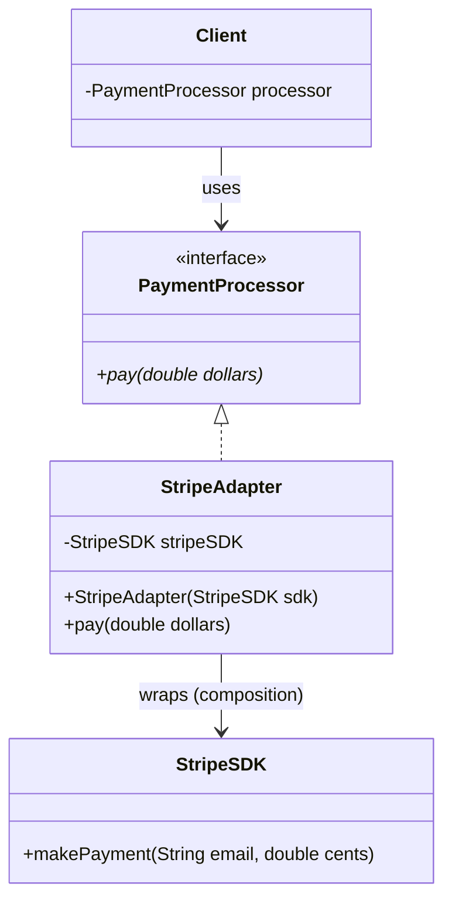

# Adapter Design Pattern (LLD)

## Quick Summary (TL;DR)
- **Goal**: Allow classes with incompatible interfaces to work together by wrapping the incompatible interface in a new class (an Adapter).
- **Key Problem Solved**: You want to use an existing class (e.g., a third-party SDK), but its interface does not match the interface your client code expects.
- **Core Principle**: **Object Adapter (Composition)**. The adapter implements the target interface expected by the client and wraps the incompatible object (Adaptee).
- **Signs you need it**:
  - You are integrating a third-party API or legacy system whose method names, parameter structures, or data formats don't match your code's standards.

---

## 1. What is the Adapter Pattern?
The Adapter pattern is a **Structural Design Pattern** that acts as a translator between two incompatible interfaces. It's like a plug adapter that lets you plug a UK-style electrical cord into a US-style wall outlet.

---

## 2. Why to Use It (Incompatible Payment APIs)

### The Problem: Unified Payment System
Imagine your app expects all payment processors to implement a clean `PaymentProcessor` interface with a `pay(double dollars)` method. You now want to integrate a third-party Stripe SDK, but the Stripe SDK has an incompatible interface: it requires a `makePayment(String email, double cents)` method.

Without Adapter:
You would have to write custom `if-else` blocks in your client code to check whether you are using Stripe or another gateway, violating the Open/Closed Principle.

---

## 3. How It Works (The Adapter Solution)

We create a `StripeAdapter` class that implements our `PaymentProcessor` interface. Inside, it wraps the Stripe SDK and handles the translation (converting dollars to cents, providing a dummy email, and calling Stripe's method).

### Class Diagram (Object Adapter)


---

## 4. Code Example (Java)

Implemented in [AdapterPatternDemo.java](file:///Users/rohit.kumar.4/Documents/interview-prep/lld/structural/adapter/AdapterPatternDemo.java).

### Target Interface (What our client expects)
```java
public interface PaymentProcessor {
    void pay(double dollars);
}
```

### Adaptee (The incompatible third-party SDK)
```java
public class StripeSDK {
    public void makePayment(String email, double cents) {
        System.out.println("Stripe processed payment of " + cents + " cents for " + email);
    }
}
```

### The Adapter (Translates between them)
```java
public class StripeAdapter implements PaymentProcessor {
    private final StripeSDK stripeSDK; // Composition

    public StripeAdapter(StripeSDK stripeSDK) {
        this.stripeSDK = stripeSDK;
    }

    @Override
    public void pay(double dollars) {
        double cents = dollars * 100.0; // Translation logic
        String dummyEmail = "user@app.com"; // Format mapping
        stripeSDK.makePayment(dummyEmail, cents); // Delegation
    }
}
```

---

## 5. Interview Angles (How to handle SDE-2 discussions)

### Question 1: "What is the difference between Object Adapter and Class Adapter?"
- **Object Adapter (Recommended)**: Relies on **composition** (has-a). The Adapter implements the Target interface and wraps the Adaptee instance. It can adapt the Adaptee and any of its subclasses.
- **Class Adapter**: Relies on **inheritance** (is-a). The Adapter inherits from both the Target interface and the Adaptee class (requires multiple inheritance, which Java doesn't support directly, so it requires implementing the Target interface and extending the Adaptee class). It is less flexible because it cannot adapt subclasses of the Adaptee.

### Question 2: "How does Adapter compare to Proxy and Facade?"
- **Adapter**: Translates one interface to a *different* interface to make incompatible systems compatible.
- **Proxy**: Implements the *same* interface as the real subject to control access, log calls, or add caching.
- **Facade**: Simplifies a *complex subsystem* of many classes into a single, unified high-level interface.

### Question 3: "Is there any drawback to the Adapter Pattern?"
- **Complexity**: It adds extra classes and indirection levels. Sometimes, if you own the Adaptee code, it is better to refactor the Adaptee itself to match the interface, rather than writing adapters. Use Adapter primarily when you *cannot* modify the target API (e.g. third-party SDKs).
