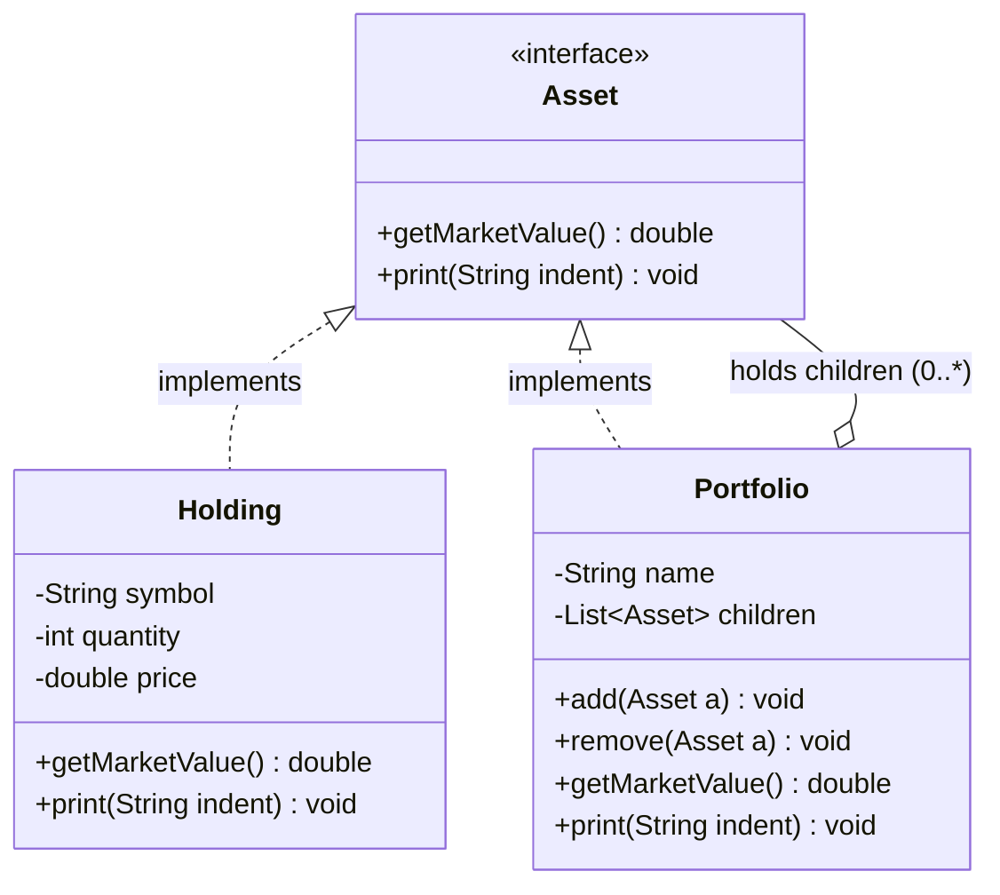

# Composite Design Pattern (LLD)

## Quick Summary (TL;DR)
* **Goal**: Treat **individual objects** and **compositions of objects** uniformly. Model **part-whole hierarchies** as a tree, so the client calls the same method on a single leaf or a whole branch and doesn't care which it's holding.
* **Key Principle**: A `Composite` (container) implements the **same interface** as a `Leaf`. So `composite.getValue()` and `leaf.getValue()` look identical to the client — the composite just **recurses** into its children and aggregates.
* **Signs you need it**: You have a **tree structure** (portfolios inside portfolios, folders inside folders, menus inside menus), and your client code is littered with `if (node instanceof Group) { loop over children } else { handle single }` branching.
* **Core components**:
  1. **Component** — common interface for both leaves and containers (e.g. `getMarketValue()`, `print()`).
  2. **Leaf** — a single, indivisible object (a `Holding`, i.e. one stock position). No children.
  3. **Composite** — a node that **holds children** (which are themselves `Component`s) and implements operations by delegating to them recursively.
  4. **Client** — talks only to the `Component` interface, blissfully unaware whether it's holding one stock or a 10,000-position fund-of-funds.

---

## 1. What is the Composite Pattern?

The Composite pattern lets you build objects into **tree structures** and then work with those trees **as if each node were a single object**.

Think of a brokerage account on Zerodha. You don't just hold a flat list of stocks. You might have:
* A **"Long-Term Equity"** portfolio containing INFY, TCS, and HDFC.
* A **"Trading"** portfolio containing RELIANCE and a nested **"F&O Hedge"** sub-portfolio.

The whole thing is a tree. A `Portfolio` is a **container** node. A single `Holding` (one stock position) is a **leaf** node. Crucially, both answer the same question — *"what's your market value?"* — and the client never has to ask *"are you a single stock or a whole basket?"* before asking.

---

## 2. Why to Use It

**The pain point: client code must treat leaves and containers differently.**

Imagine computing the total market value of an account *without* Composite. Your client code looks like this:

```java
double total = 0;
for (Object node : account) {
    if (node instanceof Holding) {
        total += ((Holding) node).getValue();
    } else if (node instanceof Portfolio) {
        // ...now manually recurse into THIS portfolio's children
        // ...and remember each of those could ALSO be a portfolio
        // ...so you need a helper method, a stack, or recursion anyway
    }
}
```

Every time someone adds a new kind of node, every one of these `if/else instanceof` chains across the codebase has to be hunted down and updated. Recursive structures make this exponentially messy — the nesting logic leaks into every caller.

**The Composite fix:** push the recursion *into the structure itself*. The client just calls `account.getMarketValue()`. If `account` is a portfolio, it internally loops over its children and adds up *their* `getMarketValue()` — and each child does the same. The branching disappears because **leaf and container share one type**.

---

## 3. How It Works



**The mechanics:**

1. **One interface for everyone.** `Asset` is the `Component`. Both `Holding` (leaf) and `Portfolio` (composite) implement it. The client only ever holds an `Asset` reference.

2. **The Composite delegates to children recursively.** `Portfolio.getMarketValue()` doesn't know its own value — it loops over its `children` (each an `Asset`), calls `child.getMarketValue()` on each, and sums them. Since a child might itself be a `Portfolio`, the recursion naturally walks the entire subtree. A `Holding` is the base case: it just returns `quantity * price` and stops.

3. **The transparency-vs-safety tradeoff for `add()` / `remove()`.** These child-management methods only make sense on a `Portfolio`, not on a single `Holding`. Where do you declare them?
   * **Transparent design** — put `add()`/`remove()` on the `Component` interface itself. Now *everything* looks identical (max uniformity), but calling `holding.add(...)` is nonsensical and you must throw `UnsupportedOperationException`. You traded compile-time safety for uniformity.
   * **Safe design** — keep `add()`/`remove()` *only* on `Composite`. Now you can never call `add()` on a leaf (the compiler stops you), but the client must sometimes downcast/check the type to manage children — losing some transparency.
   * The GoF book leans **transparent**; most production code (and this demo) leans **safe**, declaring child-management only on `Portfolio` and keeping `getMarketValue()`/`print()` on the shared `Asset` interface.

---

## 4. Code walkthrough

See [CompositePatternDemo.java](file:///Users/rohit.kumar.4/Documents/interview-prep/lld/structural/composite/CompositePatternDemo.java).

We build this tree:

```
Rohit's Account (Portfolio)
├── INFY     x100 @ 1500   (Holding / leaf)
├── TCS      x50  @ 3800   (Holding / leaf)
└── Trading  (sub-Portfolio)
    ├── RELIANCE x20 @ 2900 (Holding / leaf)
    └── HDFCBANK x30 @ 1600 (Holding / leaf)
```

```java
// 1. Build the leaves (single stock positions)
Asset infy = new Holding("INFY", 100, 1500.0);
Asset tcs  = new Holding("TCS",  50,  3800.0);

// 2. Build a nested sub-portfolio (a composite that will live inside another composite)
Portfolio trading = new Portfolio("Trading");
trading.add(new Holding("RELIANCE", 20, 2900.0));
trading.add(new Holding("HDFCBANK", 30, 1600.0));

// 3. Build the root portfolio, mixing leaves AND a sub-portfolio freely
Portfolio account = new Portfolio("Rohit's Account");
account.add(infy);
account.add(tcs);
account.add(trading);   // <-- a Portfolio added as if it were just another Asset

// 4. The client treats the whole tree UNIFORMLY.
//    It calls getMarketValue() on the root and the recursion walks everything.
System.out.println("Total = " + account.getMarketValue());
// account.getMarketValue()
//   = infy(150000) + tcs(190000) + trading.getMarketValue()
//                                   = reliance(58000) + hdfc(48000)
//   = 150000 + 190000 + 106000 = 446000.0
```

Notice step 4: the client calls **the exact same method** whether `account` is a single holding or a deeply nested fund-of-funds. The aggregation logic lives inside `Portfolio`, not in the caller. Adding a brand-new sub-portfolio tomorrow changes **zero** lines of client code.

---

## 5. Interview Angles

### Q1: "Composite vs Decorator — both wrap a Component recursively. What's the difference?"
* **Decorator**: **one wrapper, one wrapped** (1:1). The recursion is a straight *chain/onion* — each decorator holds exactly one inner `Component` and **adds behavior** (extra cost, logging) as the call passes through.
* **Composite**: **one container, many children** (1:N). The recursion is a *tree*, and the intent is **aggregation/uniformity**, not adding behavior. A Composite collects results from N children and combines them.
* One-liner: *Decorator changes what a single object does; Composite represents a group of objects as one.*

### Q2: "Transparency vs Safety — where do `add()`/`remove()` go and why?"
* **Transparent**: declare them on the **Component interface** → every node has the same type, maximum uniformity, but a leaf must throw `UnsupportedOperationException` on `add()` (runtime-unsafe).
* **Safe**: declare them **only on the Composite** → compiler prevents `leaf.add(...)`, but the client must type-check/downcast to manage children (less transparent).
* The honest answer: *"It's a tradeoff between uniformity and type safety. I default to the safe approach — `getMarketValue()`/`print()` on the shared interface, but `add()`/`remove()` only on `Portfolio` — because a leaf having a no-op `add()` is a lie that hides bugs."*

### Q3: "How do you avoid infinite recursion / handle cycles in the tree?"
* A proper Composite must be a **DAG, ideally a strict tree** — a node must never (transitively) contain itself, or `getMarketValue()` recurses forever and you get a `StackOverflowError`.
* **Guards**: (1) on `add()`, reject adding a node that is the current node or one of its ancestors; (2) keep a `visited` set during traversal to break cycles defensively; (3) optionally store a `parent` back-reference so each node has exactly one parent (enforcing tree-ness). Also watch for **deep recursion** on huge trees — convert to an explicit stack/iterative traversal if depth could blow the call stack.

### Q4: "Where does Composite show up in real-world Java / frameworks?"
* **Java AWT / Swing**: `Container` *is-a* `Component` and holds child `Component`s. `repaint()` on a panel recurses to every child widget — textbook Composite (and the GoF's original motivating example).
* **The DOM**: an `Element` node contains child nodes; operations cascade down the tree.
* **Spring**: `CompositeXxx` classes everywhere — e.g. `CompositeHealthContributor`, `CompositeMeterRegistry`, `CompositePropertySource` — each delegates one call across a list of children.
* **Files/IO**: a directory (folder) contains files *and* sub-directories; `getSize()` recurses. Also React component trees, GUI scene graphs, and org-hierarchy cost-center rollups.

---

## Recall Cards (one-liners)
* **Composite** = *treat a single object and a tree of objects through the same interface.*
* **Leaf vs Composite** = *Leaf is the base case (no children); Composite recurses over children and aggregates.*
* **Decorator is 1:1 (adds behavior); Composite is 1:N (aggregates a group).*
* **Transparency vs Safety** = *`add()`/`remove()` on the interface (uniform, unsafe) vs only on Composite (safe, less uniform).*
* **Real-world**: *Swing `Container`, the DOM, Spring `CompositeXxx`, file systems.*
