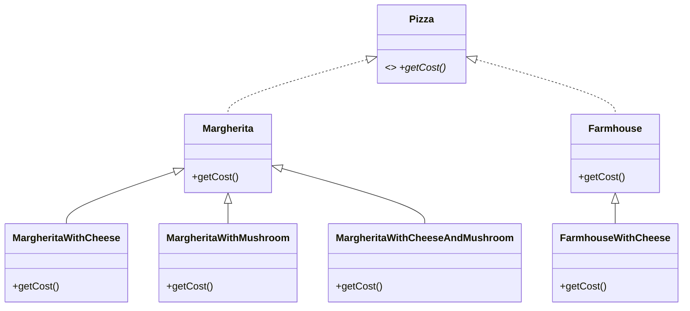
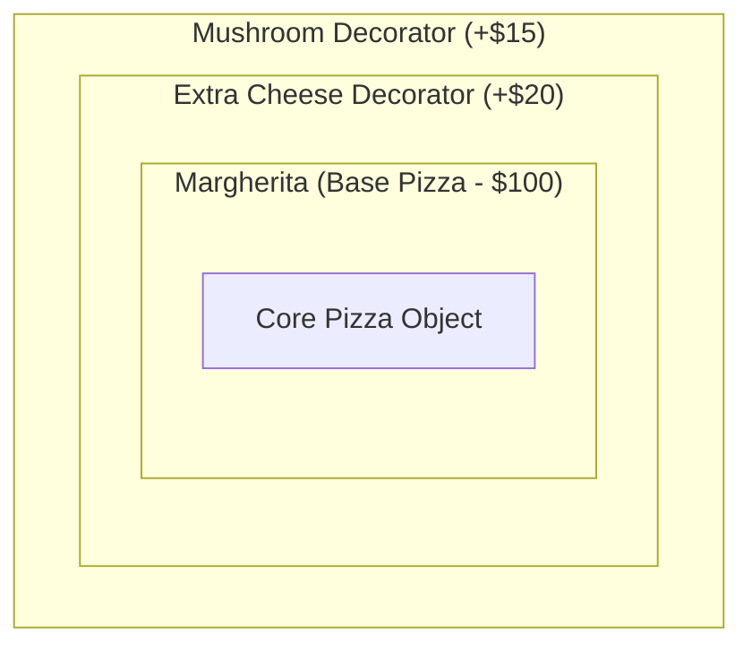
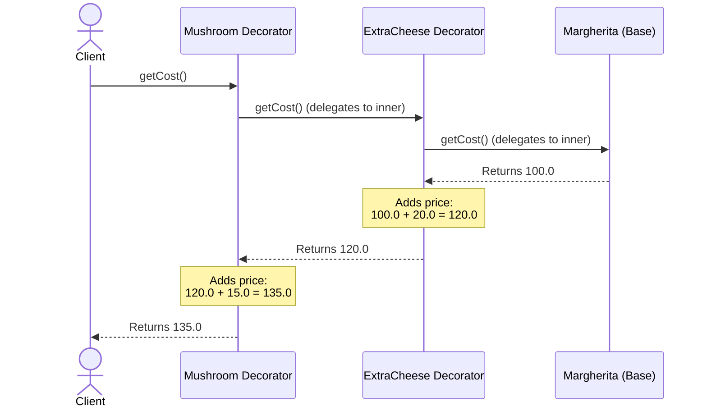

# Decorator Design Pattern (LLD for Noobs)

## Quick Summary (TL;DR)
* **Goal**: Add new behaviors or features to an object **dynamically** at runtime without changing the original class code.
* **The Magic Trick**: A decorator **is-a** Component (implements the same interface) and **has-a** Component (holds a reference to the object it wraps).
* **The Core Rule**: **Open for extension, closed for modification (OCP)**. We extend functionality by wrapping, not by rewriting.
* **Signs you need it**: "Class Explosion" (e.g., trying to write separate classes for every possible combination of pizza toppings, coffee ingredients, or UI borders).

---

## 1. The Phone Case & Accessories Analogy 📱

Imagine you buy a brand new, basic phone.
1. You want to protect the screen, so you add a **Screen Protector** wrapper.
2. You want it to look cool, so you put it inside a **Rugged Case** wrapper.
3. You want a better grip, so you stick a **PopSocket** onto the case.

Notice two key things:
* At every step, **it is still a Phone**. You can still make calls, take photos, and run apps. The phone's interface hasn't changed.
* You didn't have to go back to the phone factory and ask them to manufacture a new type of phone with a built-in PopSocket and case. You **decorated** the phone dynamically on your desk.

---

## 2. Why Subclassing Fails (The "Class Explosion" Nightmare)

Imagine you are coding a Pizza Ordering system:
* **Base Pizzas**: Margherita ($100), Farmhouse ($150)
* **Toppings**: Extra Cheese (+$20), Mushroom (+$15), Jalapeno (+$10)

If we try to support every single combination of toppings using standard subclassing (inheritance), we have to write a separate class for every combination:



### Noob Math:
If you have $N$ base pizzas and $M$ toppings:
$$\text{Number of classes needed} = N \times 2^M$$
* For 2 pizzas and 3 toppings: $2 \times 8 = 16$ classes.
* For 5 pizzas and 10 toppings: $5 \times 1024 = 5,120$ classes! 😱
Writing and maintaining 5,000+ classes is a coding disaster.

---

## 3. The Decorator Solution (Russian Nesting Dolls) 🪆

Instead of creating subclass combinations, we use **Composition**. We wrap the base pizza with toppings. Each topping acts like a Russian Nesting Doll, wrapping the inner pizza.

### Visualizing the Wrapper Onion 🧅
If a user orders a **Margherita** with **Extra Cheese** and **Mushroom**, the memory layout looks like this:




### How the Call Propagates (Recursion in Action)
When you call `myPizza.getCost()`, the call starts from the outermost wrapper and flows inwards:



---

## 4. The 3 Main Components You Need to Code

To implement this pattern, you must write three things:

### 1. The Component Interface
This is the contract that both the basic objects and the decorators must implement.
```java
interface Pizza {
    String getDescription();
    double getCost();
}
```

### 2. The Abstract Decorator (The Wrapper)
This is the magic link. It implements `Pizza` (so it matches the type) **AND** it holds a reference to a `Pizza` object inside it (Composition).
```java
abstract class ToppingDecorator implements Pizza {
    protected Pizza pizza; // The wrapped object

    public ToppingDecorator(Pizza pizza) {
        this.pizza = pizza; // Dependency injection
    }
}
```

### 3. Concrete Decorators
These extend the abstract decorator and add their own cost and description.
```java
class ExtraCheese extends ToppingDecorator {
    public ExtraCheese(Pizza pizza) { super(pizza); }

    public String getDescription() {
        return pizza.getDescription() + " + Extra Cheese";
    }

    public double getCost() {
        return pizza.getCost() + 20.0; // Inner price + my price
    }
}
```

---

## 5. Tracing the Code Step-by-Step

Let's look at the client execution in [DecoratorPatternDemo.java](file:///Users/rohit.kumar.4/Documents/interview-prep/lld/structural/decorator/DecoratorPatternDemo.java):

```java
// 1. Create a base Margherita pizza
Pizza myPizza = new Margherita(); 
// myPizza.getCost() => 100.0
// myPizza.getDescription() => "Margherita"

// 2. Wrap it with Extra Cheese
myPizza = new ExtraCheese(myPizza); 
// myPizza.getCost() => (Margherita's cost 100.0) + 20.0 = 120.0
// myPizza.getDescription() => "Margherita + Extra Cheese"

// 3. Wrap it with Mushroom
myPizza = new Mushroom(myPizza); 
// myPizza.getCost() => (Cheese-wrapped Margherita's cost 120.0) + 15.0 = 135.0
// myPizza.getDescription() => "Margherita + Extra Cheese + Mushroom"
```

---

## 6. Interview Trap Alerts! ⚠️

### Trap 1: "Why does the abstract decorator implement the component interface?"
* **Noob Answer**: To inherit its methods. (Wrong!)
* **SDE Answer**: For **type matching, not inheritance**. By implementing the component interface, the decorator takes on the exact same type as the object it is wrapping. This allows decorators to wrap other decorators indefinitely.

### Trap 2: "What is the limitation of the Decorator Pattern?"
* **Type Loss**: Once you wrap a `Margherita` in a decorator, the client only holds a reference of type `Pizza`. You can no longer access subclass-specific methods of the base class (e.g., if `Margherita` had a special method `isGlutenFree()`, you cannot call it on the wrapped decorator without unsafe casting).
* **Order Dependence**: If you have decorators where order matters (e.g., `EncryptDataDecorator` must run *before* `CompressDataDecorator`), configuration errors can break functionality.

### Trap 3: "How does Decorator compare to Strategy?"
* **Decorator**: Changes the object's behavior from the **outside** (skin) by wrapping it in an onion structure.
* **Strategy**: Changes the object's behavior from the **inside** (guts) by injecting an algorithm reference into a context field.
