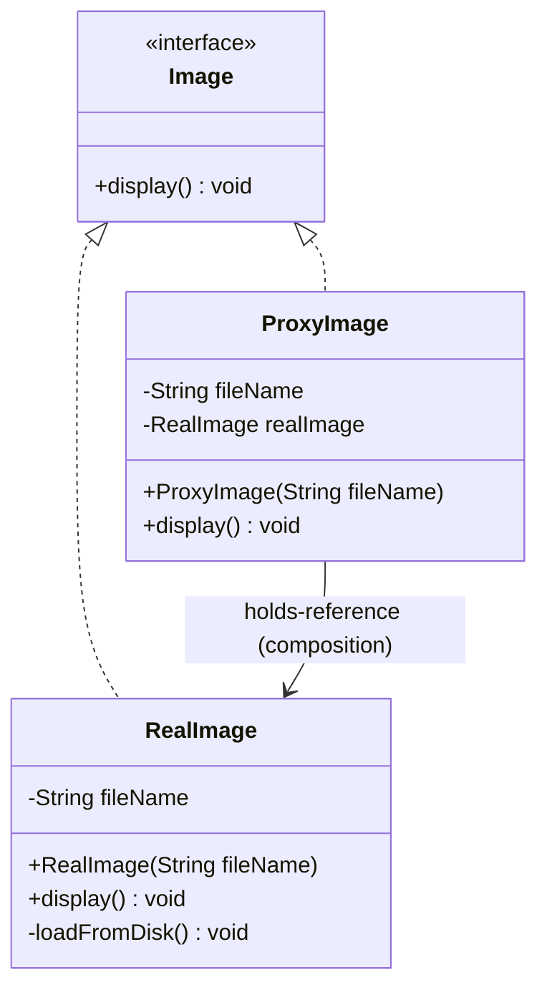
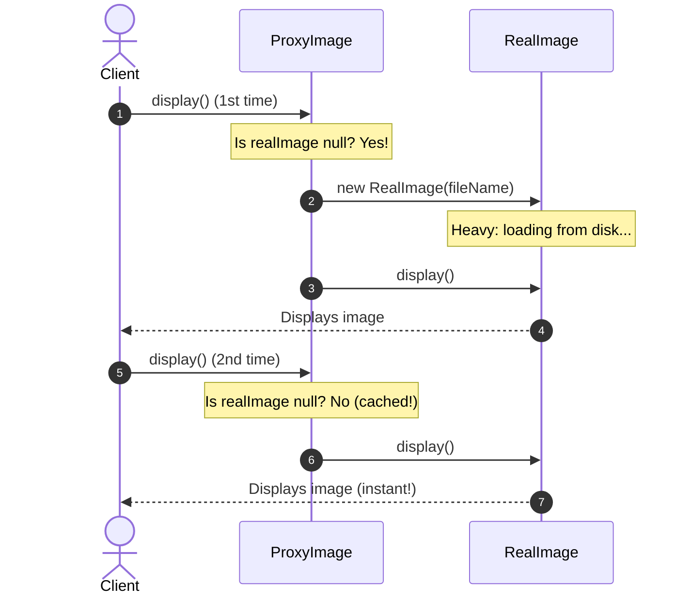

# Proxy Design Pattern (LLD for Noobs)

## Quick Summary (TL;DR)
* **Goal**: Provide a surrogate, placeholder, or security guard object for another object to **control access** to it.
* **The Magic Trick**: The Proxy implements the same interface as the Real Subject, so the client doesn't know it's talking to a middleman.
* **Core Types**:
  1. **Virtual Proxy**: Lazily loads heavy objects (like a database connection or high-res image) only when they are actually needed.
  2. **Protection Proxy**: Checks authorization/permissions before forwarding requests to the real object.
  3. **Caching Proxy**: Stores results of expensive network/DB operations to return them instantly on subsequent calls.

---

## 1. The Credit Card Analogy 💳

Imagine you go to a store to buy a new laptop.
* **Without a Proxy**: You would carry a massive box containing \$1,500 in physical cash bills (the "Real Subject"). Carrying this is heavy, unsafe, and stressful.
* **With a Proxy**: You carry a small plastic **Credit Card** (the "Proxy"). The card implements the same interface as cash: it lets you pay. When you tap the card, it checks your PIN (validation), verifies your credit limit (access control), and eventually charges the real bank account.

The store merchant doesn't care if you paid with cash or a card, as long as they get the money. The card acts as a placeholder that controls access to the actual cash.

---

## 2. Structure (Mermaid Diagrams)

### Class Diagram
The `ProxyImage` implements the `Image` interface and maintains a reference to the `RealImage` (Subject).



### Sequence Diagram (Virtual / Caching Proxy)
Watch how the Proxy delays the heavy disk load until the very first time `display()` is called:



---

## 3. How to Implement It (Image Viewer Example)

Here is a step-by-step implementation in Java.

### Step 1: The Subject Interface
This defines the common contract that the client expects.

```java
public interface Image {
    void display();
}
```

### Step 2: The Real Subject (Heavy Class)
This class does the heavy lifting, like reading database rows or loading images from disk.

```java
public class RealImage implements Image {
    private final String fileName;

    public RealImage(String fileName) {
        this.fileName = fileName;
        loadFromDisk(); // Executed on creation
    }

    private void loadFromDisk() {
        System.out.println("Loading heavy image from disk: " + fileName + "...");
        try {
            Thread.sleep(1500); // Simulate network/disk delay
        } catch (InterruptedException e) {
            e.printStackTrace();
        }
    }

    @Override
    public void display() {
        System.out.println("Displaying " + fileName);
    }
}
```

### Step 3: The Proxy Class (The Middleman)
The Proxy acts as a gatekeeper. It holds a reference to the `RealImage` but doesn't load it until `display()` is actually called.

```java
public class ProxyImage implements Image {
    private final String fileName;
    private RealImage realImage; // Lazy-loaded reference

    public ProxyImage(String fileName) {
        this.fileName = fileName;
    }

    @Override
    public void display() {
        // Virtual & Caching Proxy: Lazy initialize and cache
        if (realImage == null) {
            realImage = new RealImage(fileName);
        }
        realImage.display();
    }
}
```

### Step 4: The Client Program
The client interacts with the `Image` interface without knowing it is talking to a proxy.

```java
public class ProxyPatternDemo {
    public static void main(String[] args) {
        Image image = new ProxyImage("high_res_universe.jpg");

        // 1st display: Image will be loaded from disk (Heavy loading + Display)
        System.out.println("--- 1st Display Call ---");
        image.display();

        // 2nd display: Image will be loaded from cache (Display only)
        System.out.println("\n--- 2nd Display Call ---");
        image.display();
    }
}
```

---

## 4. Pros and Cons

### Pros
* **Lazy Loading Optimization**: You don't waste memory or startup time loading resources that might never be used.
* **Separation of Concerns**: The Real Subject doesn't need to know about access control rules or caching logic. The proxy handles that.
* **Remote Support**: Proxies can represent objects located on other servers (Remote Proxy).

### Cons
* **Extra Indirection**: Introduces another layer of class hierarchy, which can increase complexity.
* **Delayed Response (Virtual Proxy)**: If the heavy object creation takes too long, the client will experience a delay on the *first* execution.
* **Complex Multi-Threading**: If multiple threads call the proxy, lazy instantiation logic needs to be thread-safe (just like in Singletons).

---

## 5. Interview Trap Alerts! ⚠️

### Trap 1: "Proxy vs Decorator vs Adapter: What's the difference?"
This is a standard SDE-2 interview question.
* **Adapter**: Converts one interface to a *different* interface so two incompatible classes can work together.
* **Decorator**: Wraps an object to add *new features* (changes skin/behavior) dynamically.
* **Proxy**: Wraps an object to *control access* or *optimize performance*. It maintains the *same* interface and doesn't add features.

### Trap 2: "How does Spring Boot / Hibernate use Proxies?"
* **Hibernate Lazy Loading**: When you load a parent entity from the database, Hibernate doesn't load its children collections immediately. Instead, it injects a **Hibernate Proxy** class. When you call `parent.getChildren()`, the proxy intercepts it and executes the SQL query to fetch the children.
* **Spring AOP / `@Transactional`**: When you annotate a class with `@Transactional`, Spring doesn't execute your class directly. It creates a **Dynamic Proxy** wrapper. The proxy starts a database transaction, calls your method, and commits/rolls back the transaction.

### Trap 3: "Is there a performance drawback to the Proxy pattern?"
* Yes, the extra layer of indirection adds a tiny stack overhead. More importantly, in a **Virtual Proxy**, if object creation is slow, it blocks the client thread during the first call. You must be careful about thread locks if you synchronize the creation block.
