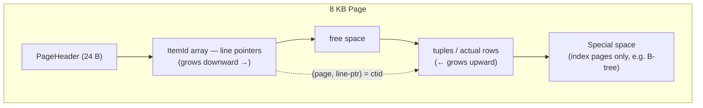
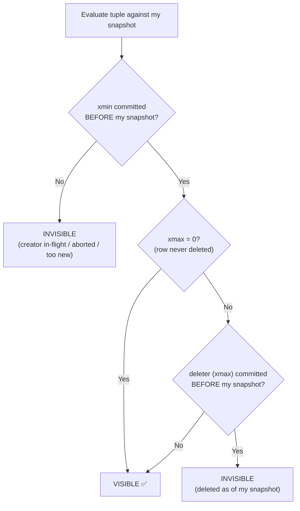
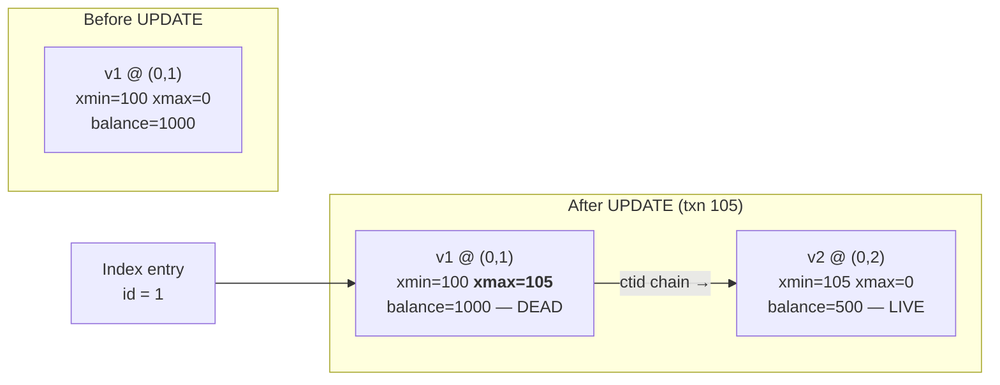
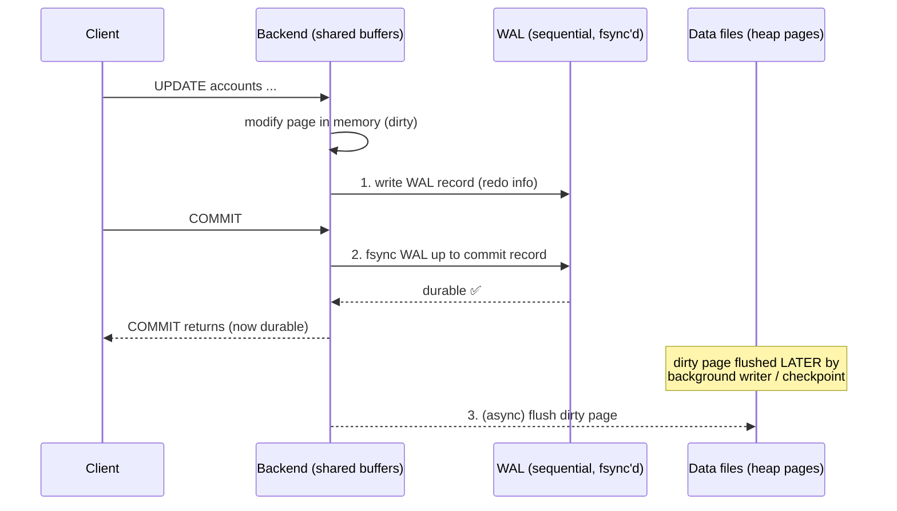

# 01 — Storage & MVCC Internals

> **Why this is Topic 1:** Every other Postgres deep-dive — isolation levels, locking, vacuum,
> index-only scans, replication — is downstream of *how Postgres physically stores rows and how
> MVCC versions them*. Get this right and the rest falls out. Zerodha-style interviews push here
> hard ("what's in the tuple header?", "why did my UPDATE bloat the table?").

---

## 1. WHAT

PostgreSQL stores table data in a **heap** (unordered collection of fixed-size **8 KB pages**) and
manages concurrency with **MVCC (Multi-Version Concurrency Control)**: every row mutation creates a
**new physical version** of the row instead of overwriting it. Readers never block writers and
writers never block readers, because each transaction sees a consistent **snapshot** of the data.

The slogan to memorize:

> **In Postgres, `UPDATE` = `DELETE` (mark old) + `INSERT` (new version). Nothing is overwritten in place.**

---

## 2. WHY (the problem MVCC solves)

The naive alternative is **lock-based concurrency**: a writer takes an exclusive lock on a row, and
readers must wait until the write commits. That serializes access and kills read throughput — fatal
for an exchange where thousands of clients read the same instrument/price/balance rows.

**MVCC's deal:** trade *disk space* and a *background cleanup cost* (vacuum) for *non-blocking reads*.

- A reader sees the version of the row that was committed **as of the moment its snapshot was taken**.
- A concurrent writer creates a *new* version; the reader keeps seeing the old one.
- Result: **readers don't block writers, writers don't block readers.** (Two writers to the *same row*
  still conflict — that's where row locks come in, Topic 3.)

This is the bank-ledger guarantee: a `SELECT SUM(balance)` running for 2 seconds sees a single
point-in-time snapshot even while deposits are committing.

---

## 3. HOW (the internals — this is what gets you the offer)

### 3.1 Page (block) layout — the 8 KB unit

A table is a file split into 8 KB pages. Each page:



- **Line pointers (ItemId)** are a level of indirection: an index points to `(page, line-pointer-#)`,
  *not* directly to the tuple's byte offset. This indirection is what makes **HOT updates** possible
  (§3.4) — the tuple can move within the page without the index needing to change.
- A row's physical address is its **CTID** = `(block_number, line_pointer)`. Try it:
  `SELECT ctid, * FROM accounts;`

### 3.1.1 Step-by-Step Example: Line Pointer Indirection under the Hood

Let's look at a single empty 8 KB page (Page 0) as we insert, update, and defragment data.

#### Step 1: Insert Row A (`id=1, name='Alice'`)
1. Postgres writes the actual data for **Alice** at the very bottom of the page (offset 8100).
2. Postgres writes **Line Pointer #1** at the top of the page. It says: *"Go to offset 8100 to find Alice"*.
3. Any index pointing to Alice stores the address `(Page 0, Line Pointer 1)`.

```
[Page 0]
+-------------------------------------------------------------+
| [Header]                                                    |
| [Line Pointer #1] (Offset: 8100, Len: 80B) -----------------+
|                                                             |
|                         < FREE SPACE >                      |
|                                                             |
|                                       [Tuple A (Alice)] <---+ (Byte 8100)
+-------------------------------------------------------------+
```

#### Step 2: Insert Row B (`id=2, name='Bob'`)
1. Postgres writes **Bob's** data just above Alice's data (offset 8000).
2. Postgres writes **Line Pointer #2** at the top. It says: *"Go to offset 8000 to find Bob"*.
3. The index pointing to Bob stores the address `(Page 0, Line Pointer 2)`.

```
[Page 0]
+-------------------------------------------------------------+
| [Header]                                                    |
| [Line Pointer #1] (Offset: 8100, Len: 80B) -----------------+
| [Line Pointer #2] (Offset: 8000, Len: 80B) ---------+       |
|                                                     |       |
|                         < FREE SPACE >              |       |
|                                                     |       |
|                                       [Tuple B (Bob)] <-----+ (Byte 8000)
|                                       [Tuple A (Alice)] <---+ (Byte 8100)
+-------------------------------------------------------------+
```

#### Step 3: Defragmentation / Row Compaction (VACUUM)
Suppose Alice's row (Tuple A) gets updated or deleted, leaving a gap of dead space. To clean up, Postgres slides Tuple B down to utilize the space.
1. Tuple B is physically moved from byte 8000 to byte 8080.
2. Postgres updates **Line Pointer #2**'s offset from `8000` to `8080`.
3. **The Index does NOT change!** It still points to `(Page 0, Line Pointer 2)`. The index remains completely untouched.

```
[Page 0]
+-------------------------------------------------------------+
| [Header]                                                    |
| [Line Pointer #1] (Offset: DEAD/UNUSED)                     |
| [Line Pointer #2] (Offset: 8080, Len: 80B) ---------+       |
|                                                     |       |
|                         < FREE SPACE >              |       |
|                                                     |       |
|                                       [Tuple B (Bob)] <-----+ (Byte 8080)
|                                       [Dead Space]          | (Byte 8160)
+-------------------------------------------------------------+
```


### 3.2 The tuple header — where MVCC lives

Every row version (tuple) carries a ~23-byte header. The fields that matter for interviews:

| Field | Meaning |
|-------|---------|
| **`xmin`** | Transaction ID (XID) that **created** this version (inserted it). |
| **`xmax`** | XID that **deleted/superseded** this version. `0` if the row is still live. |
| `cmin/cmax` | Command IDs — distinguish statements *within* the same transaction. |
| `ctid` | Pointer to a **newer** version of this row (used to walk the update chain). |
| `t_infomask` | Hint bits: is xmin committed? is xmax committed? frozen? locked? |

Inspect them with the `pageinspect` extension or the cheap version:

```sql
CREATE EXTENSION IF NOT EXISTS pageinspect;
SELECT xmin, xmax, ctid, * FROM accounts WHERE id = 1;
```

### 3.3 Visibility: how a row is decided "visible to me"

When a transaction reads, it carries a **snapshot**. A snapshot is essentially:
`(xmin_snapshot, xmax_snapshot, [list of in-progress XIDs])` — captured at snapshot time.

For each tuple, Postgres asks: **is this version visible to my snapshot?**

A version is visible roughly when:
1. Its **`xmin` is committed** *and* was committed **before** my snapshot, **AND**
2. Its **`xmax` is 0**, *or* `xmax` is a transaction that is **still running / aborted / committed after my snapshot**.

In words: *"the transaction that created this row had already committed when I started, and the
transaction that deleted it (if any) had not yet committed when I started."*



This is why two transactions can see two **different live versions of the same logical row** at the
same wall-clock time — they have different snapshots. That single sentence is the heart of isolation
levels (Topic 2): **Read Committed takes a fresh snapshot per statement; Repeatable Read takes one
snapshot per transaction.**

### 3.4 UPDATE in slow motion (and why bloat happens)

```sql
-- Initial: row v1 lives at ctid (0,1), xmin=100, xmax=0
UPDATE accounts SET balance = balance - 500 WHERE id = 1;  -- runs in txn 105
```

Internally:
1. The new version **v2** is inserted (e.g. at ctid `(0,2)`), with `xmin = 105, xmax = 0`.
2. The old version **v1** is *not deleted* — its `xmax` is set to `105`, and its `ctid` is pointed at v2.
3. Indexes may now point at v1; following v1's ctid chain reaches v2.



The dead `v1` lingers (bloat) until VACUUM reclaims it. Readers with an old snapshot still see `v1`;
readers with a new snapshot follow the chain to `v2`.

**Consequence — table bloat:** v1 is now a **dead tuple** occupying space. Run 1M updates and you
have ~1M dead tuples. They are only reclaimed by **VACUUM** (Topic 6). This is *the* answer to
"why did my table double in size when I only ran UPDATEs?"

**HOT (Heap-Only Tuple) optimization:** if (a) the new version fits **on the same page** and (b) the
update does **not** change any **indexed** column, Postgres skips creating new index entries — v1's
line pointer is redirected to v2 within the page. This dramatically reduces index bloat and write
amplification. Practical takeaway: **don't put frequently-updated columns in indexes** if you can
avoid it. Check effectiveness via `n_tup_hot_upd` in `pg_stat_user_tables`.

#### Walkthrough: Non-HOT vs. HOT Updates
Imagine a table `users` with columns: `id`, `email`, and `status`. There is an index on `id` and an index on `email`. The row is physically located on **Page 1, Slot 1** of your disk.

* **Scenario A: Non-HOT Update (Updating `email`)**
  ```sql
  UPDATE users SET email = 'bob_new@gmail.com' WHERE id = 5;
  ```
  1. *Before Update:*
     * **Heap (Page 1, Slot 1):** `[id: 5 | email: 'bob@gmail.com' | status: 'active']`
     * **Index on `id`:** Points to **Page 1, Slot 1**
     * **Index on `email`:** Points to **Page 1, Slot 1**
  2. *After Update (Non-HOT):* Because `email` is indexed, the row must be written to a new location (e.g. **Page 2, Slot 4**). 
     * **Heap (Page 1, Slot 1):** `[id: 5 | email: 'bob@gmail.com' | status: 'active']` (DEAD row version)
     * **Heap (Page 2, Slot 4):** `[id: 5 | email: 'bob_new@gmail.com' | status: 'active']` (NEW live row version)
     * **Index on `id`:** Now has **two** entries (one to Page 1, Slot 1 [dead] and a new one to Page 2, Slot 4) -> **Index Bloated!**
     * **Index on `email`:** Now has **two** entries -> **Index Bloated!**
     * *Requires a background `VACUUM` to scan both indexes and clean up the dead pointers.*

* **Scenario B: HOT Update (Updating `status`)**
  ```sql
  UPDATE users SET status = 'inactive' WHERE id = 5;
  ```
  1. *Before Update:* (Same as above, pointing to Page 1, Slot 1).
  2. *After Update (HOT):* Since `status` is **not** indexed, and there is free space on Page 1, Postgres performs a HOT update by writing the new version to **Page 1, Slot 2**.
     * **Heap (Page 1, Slot 1):** `[DEAD row] --(redirects to)--> Slot 2`
     * **Heap (Page 1, Slot 2):** `[id: 5 | email: 'bob@gmail.com' | status: 'inactive']` (NEW live row version)
     * **Index on `id`:** Still has only **one** entry pointing to **Page 1, Slot 1**. -> **No index bloat!**
     * **Index on `email`:** Still has only **one** entry pointing to **Page 1, Slot 1**. -> **No index bloat!**
  3. *Instant Page Pruning:* The next transaction that reads this page (even a simple `SELECT`) follows the link from Slot 1 to Slot 2. Seeing that Slot 1 is dead and no active transaction needs it, it **instantly deletes Slot 1** and reclaims its space inside the page dynamically without waiting for `autovacuum`.


### 3.5 DELETE and INSERT

- **DELETE**: doesn't remove the tuple — just stamps `xmax` = deleting XID. Space reclaimed by vacuum.
- **INSERT**: writes a fresh tuple with `xmin` = inserting XID, `xmax = 0`.

So in MVCC, *all* DML is fundamentally append-flavored. This is also why **`COUNT(*)` has no shortcut**
in Postgres — it can't trust a stored counter, because visibility is per-snapshot; it must check
tuple visibility. (Contrast with MySQL/InnoDB's clustered-index world.)

### 3.6 WAL — durability for all of the above

Before any page change hits the data files, the change is written to the **Write-Ahead Log (WAL)** —
a sequential, append-only log. Rule: **log first, then modify the page** ("write-ahead").

- Sequential WAL writes are fast (one fsync, sequential I/O) vs. scattered random data-file writes.
- On crash, Postgres **replays WAL** from the last **checkpoint** to recover committed changes (redo).
- A `COMMIT` is durable once its WAL record is fsync'd — *not* when the data page is written. The dirty
  data page is flushed lazily by the background writer / checkpointer.
- WAL is also the substrate for **replication** (stream WAL to replicas) and **PITR** (point-in-time
  recovery). → Topic 7.



**Crash recovery:** on restart, Postgres replays WAL from the last checkpoint (redo) — committed
changes that never reached the data files are reconstructed; uncommitted ones are discarded.

`synchronous_commit = on` (default) makes COMMIT wait for WAL fsync — the safe choice for a ledger.
Turning it off trades durability for throughput (you can lose the last few ms of commits on crash).

### 3.7 TOAST (oversized values) — quick mention

A tuple must fit in a page (8 KB). Large values (big `text`/`bytea`/`jsonb`) are compressed and/or
stored out-of-line in a **TOAST** table, with a pointer left in the row. Relevant when someone asks
"how does Postgres store a 1 MB JSON column?" Answer: TOAST — compressed, chunked, fetched on demand.

---

## 4. CODE / SQL — see it yourself

```sql
-- Watch a version get superseded (run in psql)
CREATE TABLE accounts (id int PRIMARY KEY, balance numeric);
INSERT INTO accounts VALUES (1, 1000);

SELECT ctid, xmin, xmax, * FROM accounts WHERE id = 1;
--   ctid  | xmin | xmax | id | balance
--  (0,1)  | 100  |  0   | 1  |  1000

UPDATE accounts SET balance = 500 WHERE id = 1;

SELECT ctid, xmin, xmax, * FROM accounts WHERE id = 1;
--   ctid  | xmin | xmax | id | balance
--  (0,2)  | 101  |  0   | 1  |  500       <-- new version, new ctid, new xmin

-- The dead tuple (0,1) still occupies space until VACUUM runs.
-- Confirm dead tuples are accumulating:
SELECT relname, n_live_tup, n_dead_tup, n_tup_hot_upd
FROM pg_stat_user_tables WHERE relname = 'accounts';
```

```mermaid
sequenceDiagram
    participant A as Session A (REPEATABLE READ)
    participant DB as accounts row id=1
    participant B as Session B
    A->>DB: BEGIN; SELECT balance → 500
    Note over A: snapshot frozen at this point
    B->>DB: UPDATE balance = 999; COMMIT
    A->>DB: SELECT balance → STILL 500
    Note over A: sees its frozen snapshot,<br/>not B's committed version
    A->>DB: COMMIT
    A->>DB: SELECT balance → now 999
```

```sql
-- Snapshot demonstration (two psql sessions)
-- Session A:
BEGIN;  -- (under REPEATABLE READ to make it obvious)
SET TRANSACTION ISOLATION LEVEL REPEATABLE READ;
SELECT balance FROM accounts WHERE id = 1;   -- sees 500

-- Session B (separate connection):
UPDATE accounts SET balance = 999 WHERE id = 1;  -- commits

-- Session A (same open txn):
SELECT balance FROM accounts WHERE id = 1;   -- STILL sees 500 (its snapshot is frozen)
COMMIT;
SELECT balance FROM accounts WHERE id = 1;   -- now sees 999
```

---

## 5. INTERVIEW ANGLES

**Q: What does `UPDATE` physically do in Postgres?**
A: Creates a new tuple version (new `xmin`), stamps the old version's `xmax`, and chains old→new via
`ctid`. Nothing is overwritten in place. The old version becomes a dead tuple reclaimed later by vacuum.

**Q: How do readers not block writers?**
A: Each reader uses a snapshot and a tuple's `xmin`/`xmax` to decide visibility, so it reads the
version that was committed as of its snapshot — independent of any concurrent writer creating a newer
version. Only two writers to the *same row* conflict (row lock).

**Q: What's in a tuple header?**
A: `xmin` (creator XID), `xmax` (deleter/superseder XID), `cmin/cmax`, `ctid` (pointer to newer
version), and `t_infomask` hint bits. `xmin`/`xmax` + the snapshot drive visibility.

**Q: Why did my table get huge after a batch of UPDATEs even though row count is unchanged?**
A: Bloat. Each UPDATE left a dead tuple. Without (auto)vacuum keeping up, dead tuples accumulate.
Fix: tune autovacuum, or `VACUUM (FULL)` to rewrite (FULL takes an exclusive lock — avoid in prod hot path).

**Q: What is a HOT update and why does it matter?**
A: If the new version fits on the same page and no *indexed* column changed, Postgres avoids new index
entries by redirecting the line pointer in-page. Reduces index bloat + write amplification. Lesson:
avoid indexing hot-mutated columns.

**Q: When is a COMMIT durable?**
A: When its WAL record is fsync'd to disk (with `synchronous_commit = on`) — not when the data page is
written. Recovery replays WAL from the last checkpoint.

**Q: Why is `SELECT COUNT(*)` slow / not O(1) in Postgres?**
A: Visibility is per-snapshot, so there's no single trustworthy stored count; Postgres must check tuple
visibility (an index-only scan can help if the visibility map says the page is all-visible). Many shops
keep an approximate count via `pg_class.reltuples` or a maintained summary table.

**Q (fintech twist): Why is MVCC a good fit for a ledger/exchange?**
A: Long analytical reads (EOD reconciliation, balance sums) get a stable point-in-time snapshot with
zero blocking of the high-frequency write path, while row locks + serializable isolation protect the
money-mutating transactions. Durability is guaranteed by WAL fsync on commit.

---

## 6. ONE-LINE RECALL CARDS

- Heap = unordered 8 KB pages; row address = `ctid (page, line-pointer)`.
- `xmin` = born, `xmax` = died. Snapshot + these = visibility.
- UPDATE = new version + old version's `xmax` stamped → **bloat** until vacuum.
- Line-pointer indirection enables **HOT updates** (no index churn if non-indexed col changes in-page).
- WAL: log-before-write; COMMIT durable on WAL fsync; basis for replication + PITR.
- TOAST stores oversized column values out-of-line, compressed.

→ **Next:** [02 — Transaction Isolation Levels](02-isolation-levels.md) (how snapshots define RC vs RR vs Serializable, and the anomalies each prevents).
