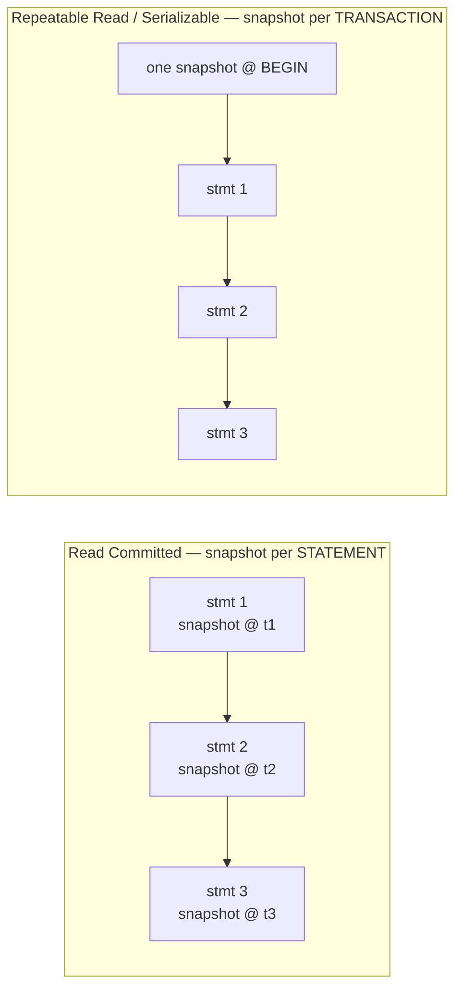
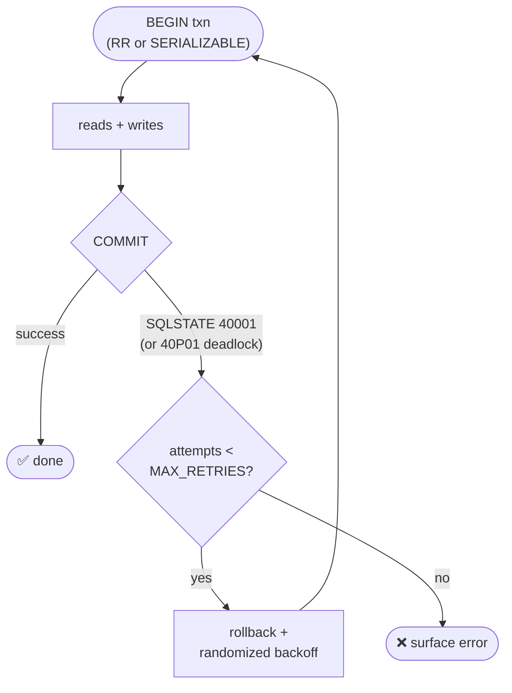
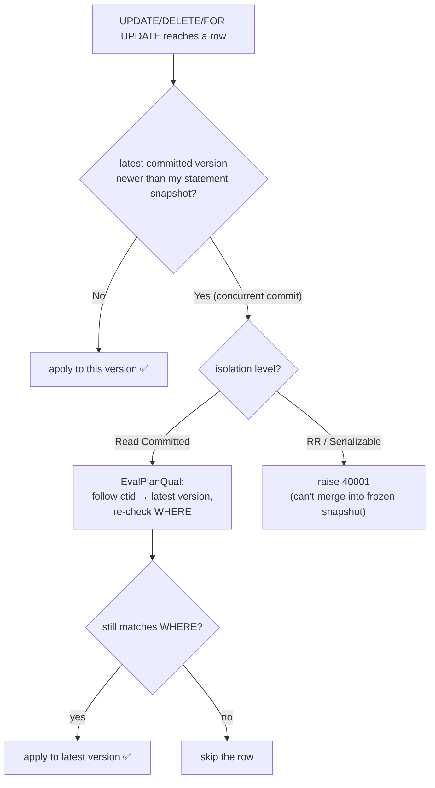
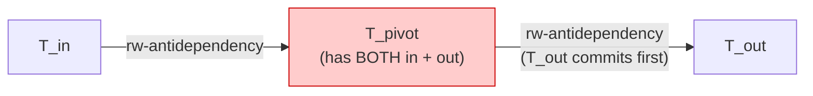
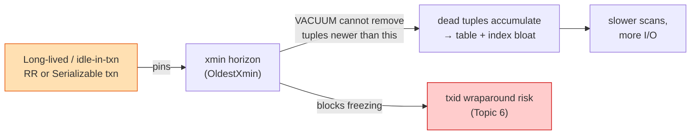

# 02 — Transaction Isolation Levels

> **Builds directly on Topic 1.** An isolation level is, mechanically, just a policy for *when
> Postgres takes a snapshot* and *what conflicts it refuses to allow*. Once you internalize
> "snapshot = set of visible row versions," the levels stop being memorized definitions and become
> obvious consequences. This is the single highest-yield Postgres topic for a fintech interview,
> because money correctness = concurrency correctness.

---

## 1. WHAT

Isolation is the **I in ACID**: to what degree is one transaction allowed to see the in-flight or
recently-committed effects of others? The SQL standard defines 4 levels by which **anomalies** they
permit. Postgres implements them with **MVCC snapshots** (Read Committed, Repeatable Read) and
**SSI — Serializable Snapshot Isolation** (Serializable).

```sql
BEGIN;
SET TRANSACTION ISOLATION LEVEL { READ COMMITTED | REPEATABLE READ | SERIALIZABLE };
-- ... statements ...
COMMIT;
```

---

## 2. WHY — the anomalies (know these cold)

| Anomaly | What happens | Money example |
|---------|--------------|---------------|
| **Dirty read** | Read another txn's **uncommitted** write | See a deposit that later rolls back |
| **Non-repeatable read** | Re-read the **same row**, get a different committed value | Balance changes mid-transaction |
| **Phantom read** | Re-run the **same query**, new rows appear/disappear | A new order matching your `WHERE` shows up |
| **Lost update** | Two txns read→modify→write the same row; one overwrite is lost | Two withdrawals both read 1000, both write 900 → 100 lost |
| **Read skew** | Read related rows at inconsistent points in time | Move ₹500 A→B; reader sees the debit but not the credit |
| **Write skew** | Two txns read an overlapping set, each writes a *different* row, both valid alone but jointly violate an invariant | Two withdrawals each check *total* balance ≥ 0, each passes, together overdraw |
| **Serialization anomaly** | Result couldn't occur in *any* serial order of the txns | general form of write skew |

**Lost update vs write skew is the classic trap** — see §3.5. Get it right and you sound senior.

---

## 3. HOW — the levels in Postgres (with the implementation reality)

### 3.0 The big surprise: Postgres has only **3** distinct levels

The SQL standard lists 4. In Postgres, **Read Uncommitted behaves exactly like Read Committed** —
**dirty reads are never possible**, because MVCC visibility only ever shows *committed* versions
(an uncommitted tuple's `xmin` is an in-progress XID → not visible). So:

| SQL level | Postgres actual behavior | Snapshot strategy |
|-----------|--------------------------|-------------------|
| Read Uncommitted | == Read Committed (no dirty reads ever) | per-statement |
| **Read Committed** (default) | no dirty reads; allows non-repeatable, phantom, write skew | **new snapshot per statement** |
| **Repeatable Read** | Snapshot Isolation; no non-repeatable/phantom reads; **still allows write skew** | **one snapshot per transaction** |
| **Serializable** | true serializability via SSI; no anomalies | per-txn snapshot + conflict detection |



### 3.1 Read Committed (the default)

- **Each statement** gets a fresh snapshot taken at statement start.
- So within one transaction, two `SELECT`s can see different data if something committed in between
  → **non-repeatable reads and phantoms are allowed.**
- **The subtle bit — write conflicts:** if your `UPDATE ... WHERE` matches a row that a concurrent
  txn updated and committed *after* your statement started, Postgres does **not** silently use your
  stale snapshot. It **re-fetches the latest committed version and re-evaluates your `WHERE`**
  (called **EvalPlanQual**). If it still matches, your update applies to the new version; if not, the
  row is skipped. This quietly prevents *some* lost updates for blind `SET x = x - 1` style updates,
  but **not** read-then-write-in-app-code patterns.

```sql
-- READ COMMITTED: this is SAFE against lost update because the decrement is atomic in one statement.
UPDATE accounts SET balance = balance - 500 WHERE id = 1 AND balance >= 500;
-- Concurrent identical txn re-reads the latest balance via EvalPlanQual; no lost update.
```

```sql
-- READ COMMITTED: this is UNSAFE — the read and write are separate statements (read-modify-write in app):
SELECT balance FROM accounts WHERE id = 1;          -- app reads 1000
-- (another txn withdraws 600, commits → balance 400)
UPDATE accounts SET balance = 1000 - 500 WHERE id=1; -- app writes 500, the 600 withdrawal is LOST
```

```mermaid
sequenceDiagram
    participant A as Txn A (app code)
    participant DB as balance = 1000
    participant B as Txn B
    A->>DB: SELECT balance → 1000
    B->>DB: SELECT balance → 1000
    B->>DB: UPDATE balance = 1000-600 = 400; COMMIT
    A->>DB: UPDATE balance = 1000-500 = 500; COMMIT
    Note over DB: final = 500 ❌<br/>B's 600 withdrawal LOST<br/>(should be 1000-600-500 = -100 → rejected)
```

### 3.2 Repeatable Read (= Snapshot Isolation)

- **One snapshot taken at the first statement**, reused for the whole transaction.
- Therefore: **no non-repeatable reads, no phantom reads** — you see a frozen point-in-time view.
  (Postgres RR is *stronger* than the SQL standard's RR, which only had to prevent non-repeatable
  reads; Postgres also kills phantoms.)
- **Write conflicts are not silently merged.** If you try to UPDATE/DELETE a row that another txn
  modified and committed after your snapshot, Postgres raises:
  `ERROR: could not serialize access due to concurrent update (SQLSTATE 40001)`.
  → **You must catch 40001 and retry the whole transaction.**
- **What RR does NOT prevent: write skew** (and read-only "phantom"-via-invariant anomalies),
  because each txn reads a consistent snapshot but they write *different* rows, so there's no direct
  update conflict to detect.

### 3.3 Serializable (SSI — Serializable Snapshot Isolation)

- Starts as Repeatable Read (a per-txn snapshot) **plus** Postgres tracks **read/write dependencies**
  between concurrent transactions using lightweight **predicate locks** (`SIReadLock` — they lock
  *the rows/pages you read*, not block anyone).
- It watches for a **"dangerous structure"**: a pattern of rw-conflicts (two consecutive
  read-write anti-dependencies forming a cycle) that could produce a non-serializable outcome.
- When detected, it aborts one txn with **40001** (`could not serialize access due to read/write
  dependencies among transactions`). **This is the only level that prevents write skew.**
- **Cost:** extra tracking memory + more aborts under contention → mandatory retry logic. No extra
  blocking though (it's optimistic, not lock-based blocking).
- **Gotcha:** Serializable guarantees only hold if **every** participating transaction runs at
  Serializable. One Read Committed transaction in the mix can break the guarantee.

### 3.4 Quick decision guide

| Need | Use |
|------|-----|
| Normal CRUD, high throughput, atomic single-statement updates | **Read Committed** (default) |
| A report/batch that must see one consistent point-in-time across many queries | **Repeatable Read** |
| Multi-row invariant that read-modify-write can violate (balances, inventory, double-booking) | **Serializable** *or* explicit locking (Topic 3) |

### 3.5 The write-skew example you'll be asked

**Invariant:** an account may have multiple sub-balances, total must stay ≥ 0. Two concurrent
withdrawals, each checking the *total*:

```sql
-- Both txns at REPEATABLE READ. Total across rows is 100. Each withdraws 100 from a different row.
-- Txn A:                                  -- Txn B (concurrent):
BEGIN ISOLATION LEVEL REPEATABLE READ;     BEGIN ISOLATION LEVEL REPEATABLE READ;
SELECT sum(balance) FROM acct WHERE uid=1; -- 100   SELECT sum(balance) FROM acct WHERE uid=1; -- 100 (same snapshot value)
-- check passes (100 - 100 >= 0)                    -- check passes (100 - 100 >= 0)
UPDATE acct SET balance=balance-100 WHERE id=10;    UPDATE acct SET balance=balance-100 WHERE id=11;
COMMIT;  -- ok                                       COMMIT;  -- ok
-- Final total = -100. Invariant VIOLATED, yet no update conflict (different rows).
```

```mermaid
sequenceDiagram
    participant A as Txn A (REPEATABLE READ)
    participant DB as acct rows {id10, id11}<br/>total = 100
    participant B as Txn B (REPEATABLE READ)
    A->>DB: SELECT sum(balance) → 100
    B->>DB: SELECT sum(balance) → 100
    Note over A: check 100-100 ≥ 0 ✅
    Note over B: check 100-100 ≥ 0 ✅
    A->>DB: UPDATE id10 balance -= 100; COMMIT
    B->>DB: UPDATE id11 balance -= 100; COMMIT
    Note over DB: total = -100 ❌ invariant broken<br/>RR: no conflict (different rows!)<br/>Serializable: detects rw-cycle → 40001 on one
```

- **Read Committed:** broken (each saw 100).
- **Repeatable Read:** still broken — no row conflict to detect. ← *the trap*
- **Serializable:** Postgres sees the rw-dependency cycle (each read the set the other wrote) and
  aborts one with 40001. Safe.
- **Or** force it with explicit locking even at RC: `SELECT ... FOR UPDATE` on the rows, or a
  materialized "account" row you lock, or `pg_advisory_xact_lock(uid)` (Topic 3).

---

## 4. CODE — the retry loop you must show

Any RR/Serializable code **must** handle 40001. Interviewers love to see this:

```java
// Pseudocode — retry the WHOLE transaction on serialization failure (SQLSTATE 40001)
int attempts = 0;
while (true) {
    try (var tx = db.begin(IsolationLevel.SERIALIZABLE)) {
        // ... do reads + writes ...
        tx.commit();
        break;                                  // success
    } catch (SQLException e) {
        if ("40001".equals(e.getSQLState()) && ++attempts < MAX_RETRIES) {
            backoffJitter(attempts);            // small randomized sleep
            continue;                           // re-run from scratch — snapshot is reset
        }
        throw e;
    }
}
```



Key point: **you cannot "fix up" mid-transaction** — once 40001 fires, the transaction is aborted;
you re-run it entirely. Make transactions short and idempotent so retries are cheap.

```sql
-- Reproduce a serialization failure yourself (two psql sessions, both SERIALIZABLE).
-- Session A and B each read a row the other will write; on the second COMMIT one gets 40001.
```

---

## 5. INTERVIEW ANGLES

**Q: What's the default isolation level in Postgres, and what anomalies does it allow?**
A: Read Committed. Allows non-repeatable reads, phantoms, and write skew; never allows dirty reads.
Each statement takes a fresh snapshot.

**Q: Does Postgres have Read Uncommitted?**
A: You can request it, but it behaves as Read Committed — MVCC never exposes uncommitted versions, so
dirty reads are impossible.

**Q: Difference between Read Committed and Repeatable Read mechanically?**
A: Snapshot timing. RC = new snapshot per *statement*; RR = one snapshot per *transaction*. RR
eliminates non-repeatable + phantom reads and, on write conflict, raises 40001 instead of merging.

**Q: Does Repeatable Read prevent write skew?**
A: **No.** RR is Snapshot Isolation; it prevents non-repeatable/phantom reads but not write skew,
because the conflicting writes touch different rows (no direct conflict). Only **Serializable** (SSI)
prevents it, by detecting rw-dependency cycles.

**Q: How does Serializable work without heavy locking?**
A: It's optimistic — runs like RR but tracks read/write dependencies via predicate (SIRead) locks,
detects dangerous rw-anti-dependency structures, and aborts a txn with 40001. No reader/writer
blocking; you pay in aborts + retries under contention.

**Q: A read-modify-write balance update — is Read Committed safe?**
A: Only if it's a *single atomic statement* (`UPDATE ... SET balance = balance - x WHERE balance >= x`)
— EvalPlanQual re-checks the latest version. If the read and write are *separate* statements in app
code, RC permits a lost update; use a single statement, `SELECT ... FOR UPDATE`, or Serializable.

**Q: What's SQLSTATE 40001 and how do you handle it?**
A: `serialization_failure`. Catch it and **retry the entire transaction** with backoff. RR/Serializable
code is incomplete without this loop.

**Q (fintech): How would you guarantee a multi-row balance invariant under concurrency?**
A: Either (1) Serializable isolation + retry loop, or (2) explicit pessimistic locking
(`SELECT ... FOR UPDATE` on the controlling row, or `pg_advisory_xact_lock`). Choose Serializable for
correctness-by-default and low contention; choose explicit locks for predictable high-contention hot
rows where you'd rather block than abort/retry.

**Q: Why must *all* transactions be Serializable for the guarantee to hold?**
A: SSI reasons about dependencies among Serializable txns; a Read Committed txn isn't tracked the same
way and can introduce an anomaly the system won't catch.

---

## 6. ONE-LINE RECALL CARDS

- 3 real levels in PG: **RC** (snapshot/statement), **RR** = Snapshot Isolation (snapshot/txn),
  **Serializable** = SSI.
- **No dirty reads ever** (MVCC). Read Uncommitted ≡ Read Committed.
- RC: non-repeatable + phantom + write skew allowed. Atomic single-statement updates are safe (EvalPlanQual).
- RR: kills non-repeatable + phantom; **write skew survives**; write conflict → **40001**.
- Serializable: only level that kills **write skew**; optimistic, predicate locks, aborts with 40001.
- 40001 ⇒ **retry the whole transaction**. Keep txns short + idempotent.
- Lost update (same row) vs write skew (different rows, shared invariant) — don't confuse them.

---

## 7. ADVANCED INTERNALS (staff-level depth)

This is the layer that separates "I read a blog" from "I've operated this." Zerodha-style follow-ups
live here.

### 7.1 What a snapshot physically *is*

A snapshot is not a copy of data — it's a tiny descriptor of *which transactions had committed* at
the instant it was taken:

```
snapshot = (xmin, xmax, xip[])
   xmin  = lowest still-running XID  → anything < xmin is "definitely decided" (committed or aborted)
   xmax  = first not-yet-assigned XID → anything >= xmax started after me, invisible
   xip[] = list of XIDs that were IN PROGRESS at snapshot time (the "in-flight" set)
```

Visibility test for a tuple created by `xmin_tuple`:
- if `xmin_tuple >= xmax_snapshot` → invisible (created after my snapshot).
- if `xmin_tuple` is in `xip[]` → invisible (creator was still in flight when I started).
- else if creator committed → visible. (Then the same logic applies to `xmax_tuple` to decide if it
  was *deleted* visibly.)

Inspect it live:
```sql
SELECT pg_current_snapshot();      -- e.g. 100:104:100,102   => xmin:xmax:xip
SELECT txid_current();             -- this backend's XID (assigns one if not yet)
```

This is *why* Read Committed re-derives a new `(xmin,xmax,xip[])` each statement, while RR/Serializable
freeze it once. There's nothing more to it — the "level" is just the snapshot-refresh policy plus the
conflict-detection policy.

### 7.2 EvalPlanQual — Read Committed's secret weapon, in detail

Under Read Committed, when an `UPDATE`/`DELETE`/`SELECT FOR UPDATE` reaches a row whose latest version
was committed by another txn *after* this statement's snapshot, Postgres does **not** raise 40001 (that's
RR/Serializable behavior). Instead it runs **EvalPlanQual (EPQ)**:

1. Follow the `ctid` chain to the **latest committed version** of that row.
2. **Re-evaluate the statement's `WHERE`/qualifier** against that new version.
3. If it still qualifies → apply the modification to the new version.
4. If it no longer qualifies (e.g. `WHERE balance >= 500` but the row is now 300) → **skip the row.**



Consequences worth stating in an interview:
- `UPDATE accounts SET balance = balance - 500 WHERE id=1 AND balance >= 500` is **lost-update-safe**
  under RC, because the decrement is recomputed against the *fresh* version, not the stale snapshot.
- But EPQ can produce surprising results: a single statement may operate on rows from *different*
  effective points in time (the matched set from your snapshot, but values from the latest version).
  This is the documented "Read Committed can see a mix" behavior. RR/Serializable avoid it by aborting.

### 7.3 SSI internals — predicate locks, pivots, and dangerous structures

Serializable = Snapshot Isolation + a runtime detector for the *one* class of anomaly SI allows
(the serialization anomaly / write skew). Mechanics:

**Predicate locks (`SIReadLock`)** — these are *not* blocking locks. They record "this transaction
*read* this {tuple | index range | page | relation}." Granularity escalates to save memory:
tuple → page → relation as a txn reads more. Visible in `pg_locks` with `mode = SIReadLock`.

**rw-antidependency:** T1 reads data that T2 then writes (T1 → T2). It means T1 must logically come
*before* T2 in any equivalent serial order.

**The dangerous structure (pivot):** theory (Cahill/Fekete) proves a non-serializable execution
*always* contains a transaction Tpivot with **both** an incoming and an outgoing rw-antidependency to
distinct transactions, and the "out" one commits first:



*Reading it:* `T_in` read something `T_pivot` later wrote; `T_pivot` read something `T_out` later
wrote; `T_out` committed first. This shape is *necessary* for any non-serializable execution — so
detecting it (and aborting `T_pivot`) is sufficient to guarantee serializability.

When Postgres detects this structure forming, it aborts one of the three with **40001**. It does
*not* check full cycles (too expensive) — detecting the pivot is a sufficient, conservative trigger.

**Conservative ⇒ false positives:** because it triggers on the structure (not a proven cycle), SSI can
abort a transaction that *would* have been serializable. This is by design — correctness over
precision. So **40001 does not mean you have a bug**; it means "retry." Under high contention,
serialization-failure rate is a real throughput tax → measure it.

**Read-only optimizations:**
- A truly read-only Serializable txn can sometimes be proven *safe* immediately and skip tracking.
- `BEGIN TRANSACTION ISOLATION LEVEL SERIALIZABLE READ ONLY DEFERRABLE;` will **wait** until it can
  obtain a guaranteed-consistent snapshot that *cannot* cause or suffer a serialization failure —
  perfect for long reporting/reconciliation reads and consistent backups, with zero 40001 risk and
  zero impact on writers. This is a great fintech answer for "consistent end-of-day report."

**Tuning:** predicate-lock memory is bounded by `max_pred_locks_per_transaction` (×
`max_connections`). Exhaustion forces coarser locks → more false-positive aborts. `pg_locks` +
`max_pred_locks_per_relation` / `..._per_page` tune escalation thresholds.

**Cross-level caveat (restate):** SSI's guarantee only holds among transactions that are *all*
Serializable. A concurrent Read Committed writer is invisible to the dependency graph and can create
an anomaly SSI won't catch.

### 7.4 Full taxonomy of what raises 40001

`serialization_failure` (40001) has several distinct triggers — name them precisely:
- **RR/Serializable:** `could not serialize access due to concurrent update` — you tried to write a row
  another txn updated/deleted after your snapshot.
- **Serializable only:** `could not serialize access due to read/write dependencies among transactions`
  — the SSI pivot was detected.
- Plus `40P01` = **deadlock_detected** (different family — that's lock-cycle, Topic 3, not a snapshot
  conflict, but your retry harness should treat it similarly: roll back and retry).

### 7.5 Subtransactions / SAVEPOINT and snapshots

Each `SAVEPOINT` opens a **subtransaction** with its own subtransaction XID. Rolling back to a savepoint
makes that subtree's writes invisible (their XIDs are marked aborted), but **does not change the
top-level transaction's snapshot** under RR/Serializable. Heavy savepoint use (e.g. per-row exception
handling in PL/pgSQL loops, or ORMs that wrap each statement) inflates the `pg_subtrans` structures and
can hurt performance — a known gotcha.

### 7.6 The `xmin horizon` — why a long RR/Serializable txn is dangerous

A transaction's snapshot pins the **oldest XID still needed** (`xmin horizon` / `OldestXmin`). VACUUM
**cannot remove dead tuples newer than the oldest active snapshot**, because that old transaction might
still need to see them. So:

- A forgotten `BEGIN; SELECT ...` left open under RR/Serializable (or an idle-in-transaction connection)
  **freezes the xmin horizon**, dead tuples pile up, tables bloat, indexes bloat, and in the extreme it
  blocks the freezing that prevents **transaction-ID wraparound** (Topic 6).
- Monitor: `SELECT * FROM pg_stat_activity WHERE state = 'idle in transaction';` and
  `SELECT age(backend_xmin), * FROM pg_stat_activity ORDER BY age(backend_xmin) DESC;`
- Mitigate: `idle_in_transaction_session_timeout`, keep transactions short, use `READ ONLY DEFERRABLE`
  for long reports.



This is the single most important *operational* link between isolation and the rest of Postgres:
**isolation choice + transaction duration directly drives bloat and vacuum behavior.**

### 7.7 `FOR UPDATE` interaction with isolation (bridge to Topic 3)

- Under **Read Committed**, `SELECT ... FOR UPDATE` locks the row and, via EPQ, re-reads the latest
  committed version — so it's the standard tool for safe app-level read-modify-write.
- Under **Repeatable Read / Serializable**, if the row was modified after your snapshot, `FOR UPDATE`
  raises **40001** instead of waiting+re-reading — because returning the new value would violate your
  frozen snapshot. So your locking strategy must match your isolation level (covered in Topic 3).

---

## 8. ADVANCED RECALL CARDS

- Snapshot = `(xmin, xmax, xip[])`; the "level" is just *when you refresh it* + *what conflicts you detect*.
- EPQ (Read Committed): on write conflict, follow `ctid` to latest version, re-check `WHERE`, apply or skip
  → atomic single-statement updates are lost-update-safe; can yield mixed-point-in-time results.
- SSI: predicate `SIReadLock`s (tuple→page→relation), detect the **pivot** (in+out rw-antidependency),
  abort with 40001. Conservative ⇒ false-positive aborts are expected.
- `SERIALIZABLE READ ONLY DEFERRABLE` = block until a 40001-proof snapshot → ideal consistent report/backup.
- Tuning: `max_pred_locks_per_transaction`; escalation → coarser locks → more false aborts.
- Long-lived RR/Serializable txn (or idle-in-transaction) pins **xmin horizon** → blocks vacuum → bloat
  → wraparound risk. Use `idle_in_transaction_session_timeout`.
- 40001 family: concurrent-update (RR/Ser), rw-dependency (Ser); 40P01 = deadlock (separate, same retry).

→ **Next:** [03 — Locking Strategies](03-locking.md) (row locks, `FOR UPDATE/SHARE`, advisory locks, deadlocks, `SKIP LOCKED`) — the pessimistic counterpart to this optimistic chapter.
