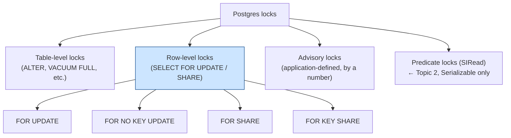
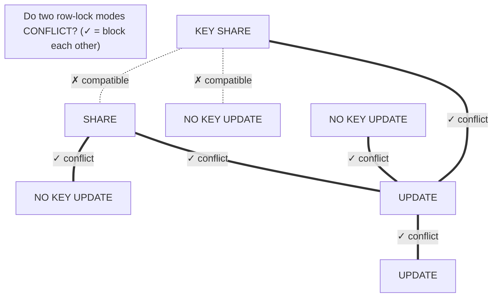
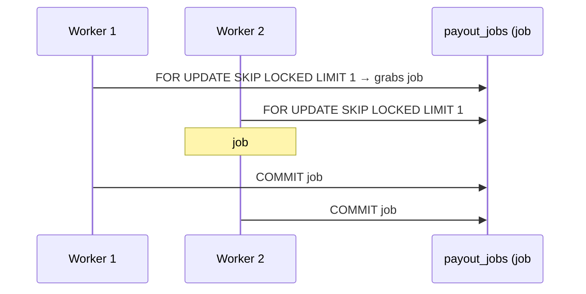
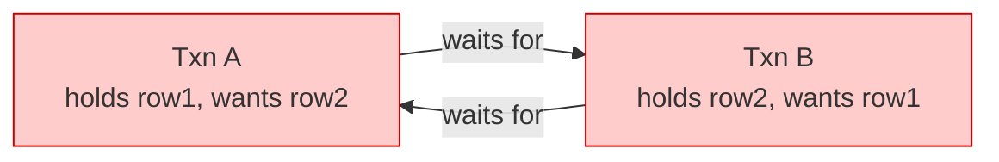
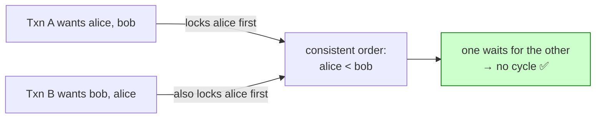
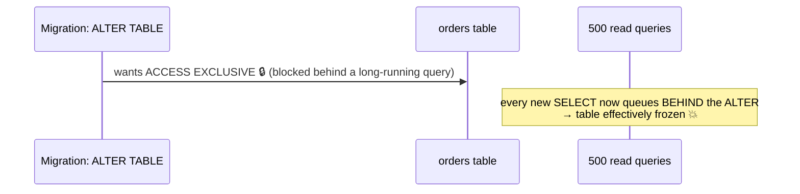
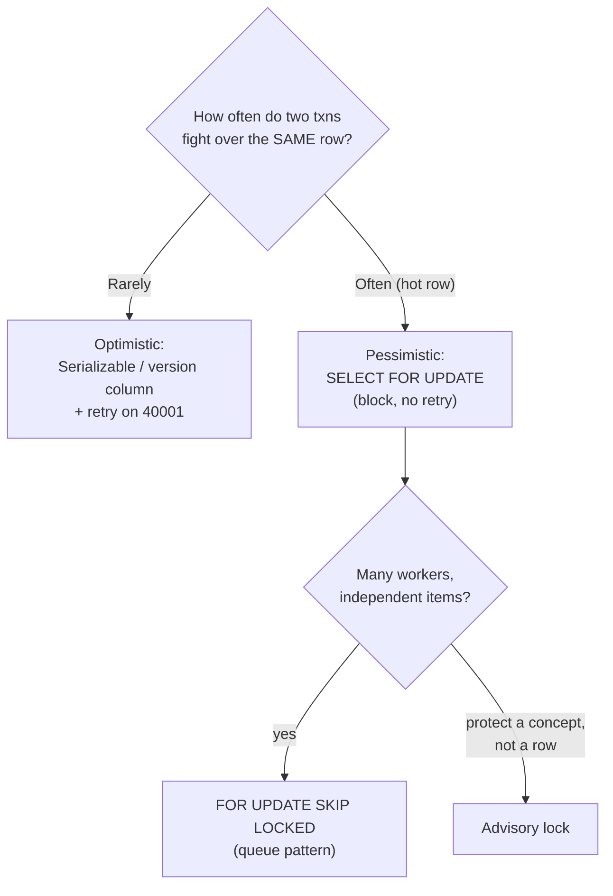

# 03 — Locking Strategies

> **Where this fits:** Topic 2 was the *optimistic* world — let everyone run on snapshots, detect
> conflicts, abort + retry (40001). This chapter is the *pessimistic* world — "I'm about to touch
> this money row, **block** anyone else who wants it until I'm done." In a real exchange/ledger you
> use **both**, and knowing *when to block vs when to retry* is exactly the senior judgment Zerodha
> is screening for.

---

## 0. The mental model (read this first)

Think of a row as a **single-occupancy meeting room**.

- A **shared lock (FOR SHARE)** = "I'm reading the whiteboard, others may read too, but **nobody is
  allowed to erase it** while I'm here." Many readers, no writer.
- An **exclusive lock (FOR UPDATE)** = "I've locked the door to *edit* the whiteboard. Everyone else
  waits outside — readers-who-just-look are fine, but anyone who wants to edit waits."
- A **deadlock** = Alice locked Room 1 and is waiting for Room 2; Bob locked Room 2 and is waiting
  for Room 1. Both wait forever — until a referee (Postgres) shoots one of them.

That's the whole chapter. Now the precise version.



---

## 1. WHAT

A **lock** is a reservation on a resource (a row, a table, or an arbitrary number) that controls who
else may use it concurrently. Postgres has three families that matter for backend interviews:

1. **Row-level locks** — taken by `SELECT ... FOR UPDATE/SHARE` and automatically by `UPDATE`/`DELETE`.
   This is 90% of what you'll discuss.
2. **Table-level locks** — taken automatically by DDL (`ALTER TABLE`), `VACUUM FULL`, etc. You mostly
   care about *avoiding* the heavy ones in production.
3. **Advisory locks** — application-defined locks keyed by an integer; Postgres doesn't attach them to
   any row, *you* decide what they mean ("only one worker may run the EOD settlement job").

> **Crucial:** plain `SELECT` takes **no row lock** at all (MVCC handles it). You only get a row lock
> when you *ask* (`FOR UPDATE`/`FOR SHARE`) or when you `UPDATE`/`DELETE`.

### 1.1 Default Postgres behavior (if you don't write any lock keyword)
If you don't specify any locking keywords in your query, Postgres uses these defaults:
* **Plain `SELECT` (Read)**: **No row locks**. Reads a consistent snapshot using **MVCC** (readers don't block writers, writers don't block readers). It takes only a weak `ACCESS SHARE` table lock to prevent structure modifications.
* **`UPDATE` (Write)**: Automatically acquires **`FOR NO KEY UPDATE`** on the row (if modifying non-key columns) or **`FOR UPDATE`** (if modifying unique/primary keys).
* **`DELETE` (Write)**: Automatically acquires **`FOR UPDATE`** on the row.
* **`INSERT` (Write)**: No locks on the new row, but automatically acquires **`FOR KEY SHARE`** on any referenced parent table row to validate foreign keys.

---

## 2. WHY — the problem locks solve that MVCC alone can't

Recall the lost-update from Topic 2: two app transactions read a balance of ₹1000, each subtracts,
each writes — one withdrawal vanishes. MVCC didn't stop it because both *reads* were happy on their
own snapshots.

The pessimistic fix: **the first reader locks the row**, so the second reader **waits** until the
first commits, then reads the *fresh* value. No lost update, no retry needed.

```mermaid
sequenceDiagram
    participant A as Alice (txn A)
    participant Row as wallet row (balance 1000)
    participant B as Bob (txn B)
    A->>Row: SELECT balance FOR UPDATE → 1000 🔒 (locked)
    B->>Row: SELECT balance FOR UPDATE ...
    Note over B: ⏳ BLOCKED — waits for Alice
    A->>Row: UPDATE balance = 500; COMMIT 🔓
    Note over B: lock released → Bob proceeds
    B->>Row: SELECT returns 500 (fresh!) 🔒
    B->>Row: UPDATE balance = 0; COMMIT
    Note over Row: final = 0 ✅ no lost update
```

**The trade-off vs Serializable (Topic 2):**
- **Serializable** = optimistic. No blocking, but aborts under contention → you *must* retry. Great
  when conflicts are *rare*.
- **`FOR UPDATE`** = pessimistic. Blocks, no aborts → no retry needed. Great when conflicts are
  *frequent* on a known hot row (e.g. a popular stock's order book, a shared house account).

---

## 3. HOW — the four row-lock modes (and why there are four)

People expect two modes (shared/exclusive). Postgres has **four**, and the reason is **foreign keys**.

| Mode | Strength | You get it via | Real meaning |
|------|----------|----------------|--------------|
| **FOR UPDATE** | strongest | `SELECT ... FOR UPDATE`, `DELETE`, `UPDATE` of a key column | "I will change or delete this row, including its key." |
| **FOR NO KEY UPDATE** | strong | a plain `UPDATE` that doesn't touch a unique/PK column | "I'll change non-key columns." (weaker → lets FK checks proceed) |
| **FOR SHARE** | weak | `SELECT ... FOR SHARE` | "Don't let anyone modify this row, but others may also share-lock." |
| **FOR KEY SHARE** | weakest | taken automatically by a FK check on the parent row | "Don't let anyone change this row's **key** or delete it; non-key updates are fine." |

### Why "KEY SHARE" exists — the friendly version

Imagine `orders.account_id → accounts.id` (a foreign key). When you insert an order, Postgres must
verify "account 42 exists." Old Postgres took a full share lock on account 42 — which **blocked**
anyone updating that account's balance at the same time. Madness for a busy account.

The fix (PG 9.3+): the FK check takes only **FOR KEY SHARE** — "I just need account 42's *key* to stay
put; I don't care if its balance changes." So a balance `UPDATE` (which takes **FOR NO KEY UPDATE**)
**does not conflict** with the FK check. Inserts of child orders and balance updates now run
concurrently. This is a real, askable "why" question.

#### Concrete Example:
Suppose we have an `accounts` table with a primary key `id` and a column `balance`.

* **Transaction 1 (Update Balance)**:
  ```sql
  UPDATE accounts SET balance = balance - 50 WHERE id = 'alice';
  ```
  Since this query only changes `balance` (a non-key column), Postgres automatically acquires a **`FOR NO KEY UPDATE`** lock on Alice's row.

* **Transaction 2 (Insert Order concurrently)**:
  ```sql
  INSERT INTO orders (account_id, item) VALUES ('alice', 'Netflix subscription');
  ```
  To verify the foreign key, Postgres automatically acquires a **`FOR KEY SHARE`** lock on Alice's row in the `accounts` table to ensure the account is not deleted or its ID changed.

**Why this matters**: Because `FOR NO KEY UPDATE` and `FOR KEY SHARE` are compatible, **Transaction 1 and Transaction 2 can run at the exact same time without blocking each other**, keeping the system fast!

#### Concrete Example for `FOR SHARE` (Sharing Locks)
Unlike `FOR UPDATE`, multiple transactions can hold a `SHARE` lock on the same row.

* **Transaction 1 (Generates a report)**:
  ```sql
  SELECT * FROM accounts WHERE id = 'alice' FOR SHARE;
  -- Acquires SHARE lock. Prevents anyone from changing or deleting 'alice'.
  ```
* **Transaction 2 (Generates a different report concurrently)**:
  ```sql
  SELECT * FROM accounts WHERE id = 'alice' FOR SHARE;
  -- Compatible! Transaction 2 also gets the SHARE lock. Both read stable data.
  ```
* **Transaction 3 (Blocked)**:
  ```sql
  UPDATE accounts SET balance = balance - 50 WHERE id = 'alice';
  -- Blocks! It must wait until both Transaction 1 and 2 finish because UPDATE conflicts with SHARE.
  ```

### 3.1 The conflict matrix (memorize the shape, not the cells)



| | KEY SHARE | SHARE | NO KEY UPDATE | UPDATE |
|---|:---:|:---:|:---:|:---:|
| **KEY SHARE** | ✓ ok | ✓ ok | ✓ ok | ✗ **block** |
| **SHARE** | ✓ ok | ✓ ok | ✗ **block** | ✗ **block** |
| **NO KEY UPDATE** | ✓ ok | ✗ **block** | ✗ **block** | ✗ **block** |
| **UPDATE** | ✗ **block** | ✗ **block** | ✗ **block** | ✗ **block** |

**The one-liner to remember:** *the stronger the two locks, the more likely they conflict; UPDATE
conflicts with everything; KEY SHARE only conflicts with the full UPDATE (key change/delete).*

---

## 4. The everyday tool: `SELECT ... FOR UPDATE`

This is what you'll write 95% of the time for "read a row, decide, then change it safely."

```sql
BEGIN;
  -- Lock Alice's wallet row. Anyone else doing FOR UPDATE on it now WAITS.
  SELECT balance FROM wallets WHERE user_id = 'alice' FOR UPDATE;   -- returns 1000, row 🔒

  -- app logic: 1000 >= 500, allow withdrawal
  UPDATE wallets SET balance = balance - 500 WHERE user_id = 'alice';
COMMIT;   -- 🔓 lock released
```

### 4.1 `NOWAIT` and `lock_timeout` — don't wait forever

By default `FOR UPDATE` waits indefinitely. Often you'd rather fail fast:

```sql
SELECT ... FOR UPDATE NOWAIT;          -- if locked, error immediately: "could not obtain lock"
SET lock_timeout = '2s';               -- or: wait up to 2s, then error (per-session knob)
```

Friendly framing: `NOWAIT` = "if the room is taken, don't queue — tell me right now so I can show the
user 'try again'." Great for interactive APIs where a hung request is worse than a clean retry.

### 4.2 `SKIP LOCKED` — the killer feature for job queues

`SKIP LOCKED` says: *"if a row is locked by someone else, **don't wait — just pretend it's not there**
and give me the next available one."* This turns a plain table into a **safe, concurrent work queue**
with zero extra infrastructure — a genuinely impressive answer for "how would you build a job queue
without Kafka/RabbitMQ?"

**Concrete fintech example — a payout-processing queue with 5 workers:**

```sql
-- Each worker runs this in a loop. Workers NEVER grab the same job, NEVER block each other.
BEGIN;
  SELECT id, amount, account_id
  FROM payout_jobs
  WHERE status = 'pending'
  ORDER BY created_at          -- FIFO fairness
  FOR UPDATE SKIP LOCKED       -- 🔑 skip jobs other workers already grabbed
  LIMIT 1;

  -- ... process the payout (call bank API, etc.) ...

  UPDATE payout_jobs SET status = 'done' WHERE id = :id;
COMMIT;
```



Without `SKIP LOCKED`, Worker 2 would **block** on job#1 (a queue that processes one-at-a-time
across all workers — useless). With it, each worker pulls a *different* job. This is how a lot of
real "Postgres as a queue" systems (e.g. many fintech payout/settlement pipelines) actually work.

---

## 5. Advisory locks — locking *concepts*, not rows

Sometimes the thing you want to protect isn't a row at all. For example: **"Only one server in our cluster should run the newsletter email sending job at 9:00 AM."** There is no single row in the database representing "email sending." Instead, you lock an arbitrary number representing this concept.

```sql
-- Session-level: held until you unlock or disconnect.
SELECT pg_advisory_lock(777);        -- blocks if someone else holds 777
-- ... do the exclusive work ...
SELECT pg_advisory_unlock(777);

-- Try-version (don't wait): returns true if acquired, false if someone holds it.
SELECT pg_try_advisory_lock(777);    -- false → "another worker is already running, I'll skip"

-- Transaction-scoped: auto-released at COMMIT/ROLLBACK (safer — can't leak).
SELECT pg_advisory_xact_lock(777);
```

### Application Code Example (Cron/Service Coordination)
Here is how you handle advisory locks in your backend service code (e.g. Node.js/Python pseudo-code) and combine it with database state tracking to support retries:

```javascript
// 1. Try to acquire lock '777' representing the newsletter task
const lockAcquired = db.query("SELECT pg_try_advisory_lock(777);");

if (lockAcquired) {
    try {
        // 2. Fetch pending emails (or failed emails that need retrying)
        const emails = db.query("SELECT * FROM emails WHERE status = 'pending' OR (status = 'failed' AND attempts < 3);");
        
        for (let email of emails) {
            try {
                sendEmailViaSMTP(email.recipient);
                db.query("UPDATE emails SET status = 'sent' WHERE id = ?;", email.id);
            } catch (err) {
                db.query("UPDATE emails SET status = 'failed', attempts = attempts + 1 WHERE id = ?;", email.id);
            }
        }
    } finally {
        // 3. Always unlock when finished, so the next cron run can execute
        db.query("SELECT pg_advisory_unlock(777);");
    }
} else {
    console.log("Another server is already running this newsletter job. Skipping execution.");
}
```

*Note: For absolute fault tolerance at scale (complex, multi-step workflows), engines like **Temporal** are preferred. But Postgres advisory locks are a perfect, lightweight alternative without extra infrastructure.*

---

## 6. Deadlocks — the referee shoots someone

A **deadlock** is a cycle of waiting: A holds X and wants Y; B holds Y and wants X. Neither can
proceed. Postgres runs a **deadlock detector** (`deadlock_timeout`, default **1s**): after a lock
wait exceeds that, it checks the **wait-for graph** for a cycle, and if found, **aborts one
transaction** (the victim) with `ERROR: deadlock detected` (SQLSTATE **40P01**).



### 6.1 A concrete deadlock — and the one-line fix

**The classic transfer deadlock:** Alice transfers ₹100 to Bob; Bob simultaneously transfers ₹50 to
Alice. Each transaction locks "its own" account first.

```sql
-- Txn A (Alice → Bob)                  -- Txn B (Bob → Alice)
BEGIN;                                  BEGIN;
UPDATE accounts SET bal=bal-100         UPDATE accounts SET bal=bal-50
  WHERE id='alice';   -- locks alice 🔒   WHERE id='bob';     -- locks bob 🔒
UPDATE accounts SET bal=bal+100         UPDATE accounts SET bal=bal+50
  WHERE id='bob';     -- wants bob ⏳      WHERE id='alice';   -- wants alice ⏳
-- 💥 DEADLOCK: A waits for bob, B waits for alice
```

**The fix — always lock rows in a consistent global order** (e.g. ascending account id). Then both
transactions try to lock `alice` first; one wins, the other waits *then* proceeds. No cycle possible.

```sql
-- Both transactions lock the LOWER id first, regardless of transfer direction:
SELECT * FROM accounts WHERE id IN ('alice','bob') ORDER BY id FOR UPDATE;
-- now do both updates — guaranteed no deadlock between two transfers on the same pair
```



**Key interview point:** deadlocks are *not* a bug you can `try/catch` away — minimize them by
**ordering lock acquisition consistently** and keeping transactions short. But you should *also* have
a retry loop (same as 40001) because they can't be 100% eliminated.

### 6.2 `deadlock_timeout` is not a "give up" timer

Subtle gotcha: `deadlock_timeout` (default 1s) is *how long Postgres waits before bothering to run the
expensive cycle-detection check* — not a max wait. A legitimate long wait (no cycle) keeps waiting.
To cap *all* lock waits, use `lock_timeout`. Don't confuse the two.

---

## 7. Table-level locks (know enough to avoid prod outages)

DDL grabs heavy table locks. The infamous one: a careless `ALTER TABLE` takes **ACCESS EXCLUSIVE**,
which conflicts with *everything* — including plain `SELECT` — so it can freeze your whole table
behind a queue of waiters.



Friendly survival rules for the interview:
- **`CREATE INDEX CONCURRENTLY`** builds an index without blocking writes (takes longer, can't run in a txn block). Always use it in prod. In **Liquibase**, remember to set `runInTransaction="false"`.
- **Non-volatile vs. Volatile Column Defaults**:
  - *Non-volatile (Constant)*: E.g., `DEFAULT 'active'`. Modern Postgres (PG 11+) updates the catalog metadata instantly without rewriting the table. Highly cheap.
  - *Volatile (Dynamic)*: E.g., `DEFAULT random()` or `uuid_generate_v4()`. Postgres must recalculate it and rewrite every row on disk. High lock contention, highly expensive on large tables.
  - *CHECK constraints*: Scans all rows to verify, blocking concurrent writes.
- **Why we can't use row locks (like `FOR NO KEY UPDATE`) for columns**: Row locks only lock data values. Changing columns is a schema change (DDL) that modifies the physical structure of the table. Postgres requires an `ACCESS EXCLUSIVE` table lock to guarantee query safety while the structure is updated.
- Keep migrations behind a **`lock_timeout`** so a stuck `ALTER` fails fast instead of freezing reads. (e.g. prefixing your Liquibase scripts with `SET lock_timeout = '2s';`).

---

## 8. Watching locks in real time (ops chops)

```sql
-- Who is blocking whom? (the single most useful lock query)
SELECT pid, pg_blocking_pids(pid) AS blocked_by, state, query
FROM pg_stat_activity
WHERE cardinality(pg_blocking_pids(pid)) > 0;

-- Raw lock view
SELECT locktype, relation::regclass, mode, granted, pid FROM pg_locks ORDER BY granted;
```

`pg_blocking_pids()` is the magic one: it tells you exactly which PID is holding the lock your query is stuck behind. Great "how do you debug a hung query in prod?" answer.

#### Concrete Troubleshooting Example:
1. **Session A (PID 101)** updates a row but forgets to commit:
   ```sql
   BEGIN;
   UPDATE accounts SET balance = balance - 100 WHERE id = 'alice';
   ```
2. **Session B (PID 102)** tries to update the same row and hangs:
   ```sql
   UPDATE accounts SET balance = balance + 50 WHERE id = 'alice';
   ```
3. **You query "Who is blocking whom?":**
   ```sql
   SELECT pid, pg_blocking_pids(pid) AS blocked_by, state, query FROM pg_stat_activity WHERE cardinality(pg_blocking_pids(pid)) > 0;
   ```
   *Output:*
   | pid | blocked_by | state | query |
   | :--- | :--- | :--- | :--- |
   | **102** | **`[101]`** | `active` | `UPDATE accounts SET balance = balance + 50 WHERE id = 'alice';` |

4. **You inspect the blocker (PID 101):**
   ```sql
   SELECT pid, state, query FROM pg_stat_activity WHERE pid = 101;
   ```
   *Output:*
   | pid | state | query |
   | :--- | :--- | :--- |
   | **101** | **`idle in transaction`** | `UPDATE accounts SET balance = balance - 100 WHERE id = 'alice';` |

   *(The state `idle in transaction` means the application opened a transaction and ran a query, but never committed/rolled back).*

5. **You resolve the block by terminating PID 101:**
   ```sql
   SELECT pg_terminate_backend(101);
   -- Instantly rolls back 101, releases lock, and allows 102 to finish.
   ```

---

## 9. Pessimistic vs Optimistic — the decision you'll be graded on



| Situation | Use |
|-----------|-----|
| Rare conflicts, want max throughput | Optimistic: Serializable or a `version` column + retry |
| Known hot row (popular stock, shared account), frequent conflicts | `SELECT ... FOR UPDATE` (block) |
| Many workers pulling independent jobs | `FOR UPDATE SKIP LOCKED` |
| Interactive API, can't hang the request | `FOR UPDATE NOWAIT` / `lock_timeout` |
| Serialize a *process/concept* (singleton job, per-user critical section) | Advisory lock |
| Cross-row money invariant, low contention | Serializable (Topic 2) |

---

## 10. INTERVIEW ANGLES

**Q: Does a plain `SELECT` take a lock?**
A: No row lock — MVCC gives it a consistent snapshot with no blocking. You only acquire a row lock via
`FOR UPDATE/SHARE` or an `UPDATE`/`DELETE`.

**Q: `FOR UPDATE` vs `FOR SHARE`?**
A: `FOR UPDATE` is exclusive — blocks other `FOR UPDATE/SHARE` and writes; use it when you intend to
modify. `FOR SHARE` blocks *modifications* but allows other share-lockers; use it when you need the row
to stay stable while you read but don't intend to change it.

**Q: Why are there four row-lock modes?**
A: Foreign keys. FK validation only needs the parent row's *key* to stay put, so it takes `FOR KEY
SHARE`, which doesn't conflict with a non-key `UPDATE` (`FOR NO KEY UPDATE`). This lets balance updates
and child-row inserts run concurrently instead of blocking each other.

**Q: How would you build a concurrent job queue in Postgres?**
A: `SELECT ... FOR UPDATE SKIP LOCKED LIMIT n` in each worker. Locked rows are skipped, so workers grab
disjoint jobs without blocking or double-processing. Mark done and `COMMIT`. Add `ORDER BY created_at`
for FIFO.

**Q: What causes a deadlock and how do you prevent it?**
A: A cycle in the wait-for graph (A holds X wants Y; B holds Y wants X). Prevent by acquiring locks in a
**consistent global order** (e.g. ascending id) and keeping transactions short. Postgres auto-detects
after `deadlock_timeout` and aborts a victim with 40P01 — so also retry.

**Q: Difference between `deadlock_timeout` and `lock_timeout`?**
A: `deadlock_timeout` = how long to wait before *running cycle detection* (not a cap on waiting).
`lock_timeout` = the actual maximum time a statement will wait for any lock before erroring.

**Q: When pessimistic locking vs Serializable isolation?**
A: Pessimistic (`FOR UPDATE`) when conflicts are frequent on a known hot row — blocking avoids a retry
storm. Optimistic (Serializable / version column) when conflicts are rare — you avoid holding locks and
pay only the occasional retry. Fintech systems mix both.

**Q: How do you safely add an index / column to a huge table in prod?**
A: `CREATE INDEX CONCURRENTLY` (no write block). For columns, rely on metadata-only fast defaults
(PG 11+) and avoid full-table-scanning constraints; guard the migration with `lock_timeout` so a stuck
`ALTER`'s ACCESS EXCLUSIVE lock doesn't freeze reads.

**Q: A query is hung in prod — how do you find what's blocking it?**
A: `pg_blocking_pids(pid)` from `pg_stat_activity` to find the holder PID, inspect `pg_locks`, then
decide to wait, kill the blocker (`pg_terminate_backend`), or tune ordering/timeouts.

---

## 11. RECALL CARDS

- Plain `SELECT` = **no lock** (MVCC). Locks come from `FOR UPDATE/SHARE`, `UPDATE`, `DELETE`.
- 4 row modes by strength: **KEY SHARE < SHARE < NO KEY UPDATE < UPDATE**. Four exist *because of FKs*.
- `FOR UPDATE` = block other writers/lockers → safe read-modify-write, no retry needed.
- `SKIP LOCKED` = skip locked rows → concurrent job queue. `NOWAIT`/`lock_timeout` = fail fast.
- Advisory locks = mutex on an integer; protect a *concept* (singleton job, per-user critical section).
  Use `pg_advisory_xact_lock` (auto-release) and namespace your keys.
- Deadlock = wait-for cycle → fix by **consistent lock ordering** + short txns; PG aborts a victim (40P01).
- `deadlock_timeout` = when to check for cycles; `lock_timeout` = max wait. Different things.
- DDL = heavy table locks. `CREATE INDEX CONCURRENTLY`; guard `ALTER` with `lock_timeout`.
- Debug hung query: `pg_blocking_pids()`.

→ **Next:** [04 — Indexing Deep Dive](04-indexing.md) (B-tree structure, partial/covering/expression indexes, GIN/GiST/BRIN, index-only scans, and why an index can make a query *slower*).
