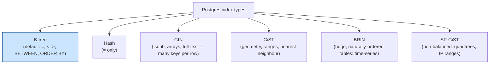
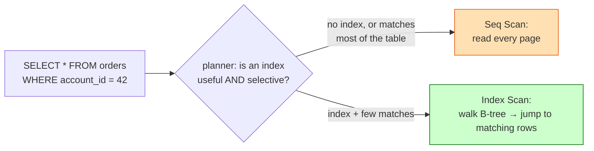
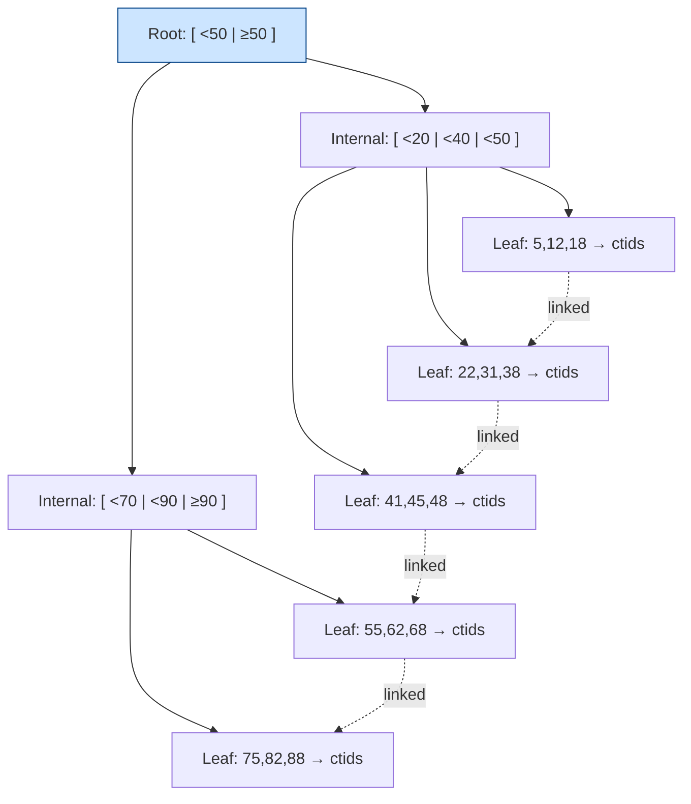
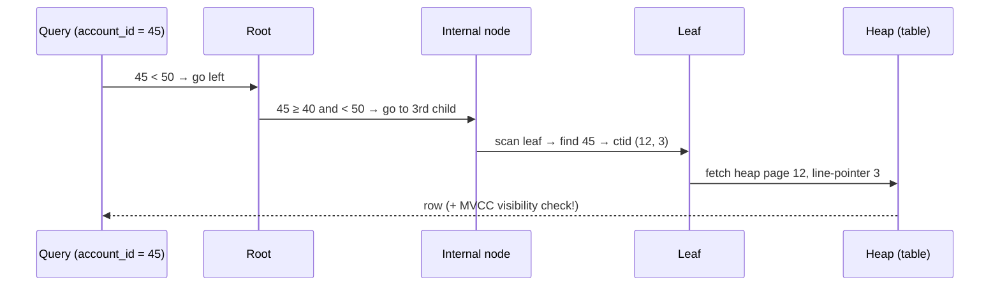
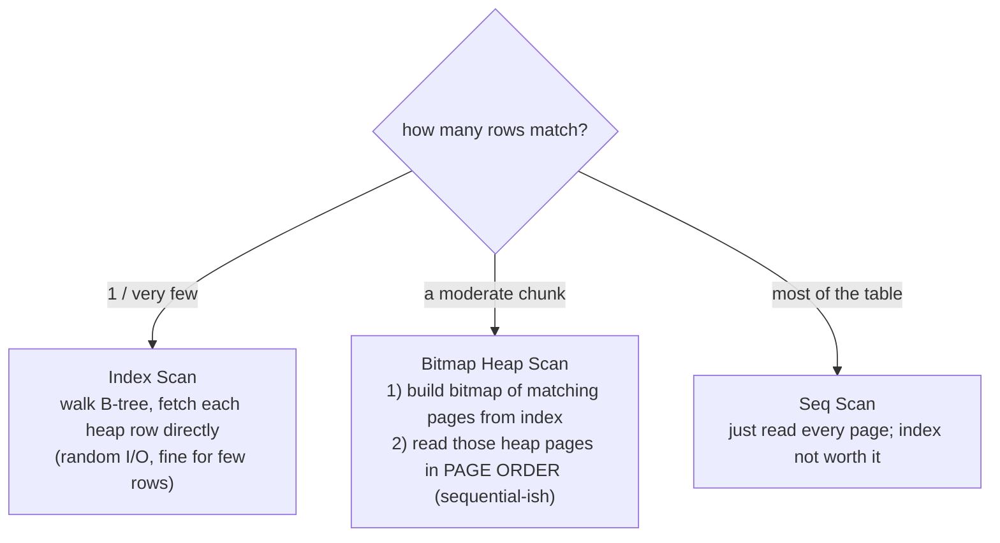
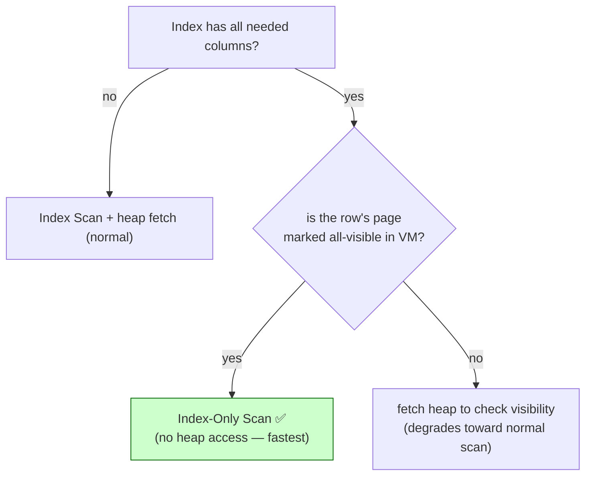
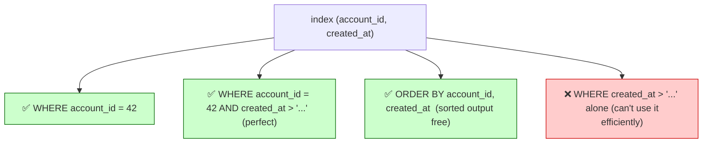
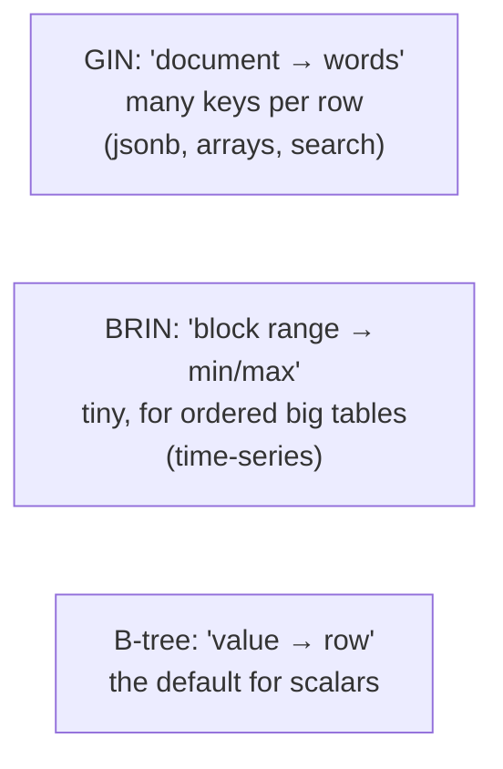

# 04 — Indexing Deep Dive

> **Where this fits:** Topics 1–3 were about *correctness* under concurrency. Indexing is about
> *speed*. But the two are linked: because of MVCC (Topic 1), an index entry alone can't tell Postgres
> whether a row is *visible to you* — which is why "index-only scans" need the visibility map, and why
> a bloated table kills index performance. This is the JD's third headline ("understand indexing") and
> Zerodha will absolutely ask "you added an index and it got *slower* — why?"

---

## 0. The mental model (read this first)

An index is the **alphabetical index at the back of a textbook**.

- Without it, to find every mention of "MVCC" you read all 800 pages (**sequential scan**).
- With it, you flip to the index, find "MVCC → pages 41, 88, 203", and jump straight there
  (**index scan**).
- But the index has a cost: every time you *edit the book*, you must also *update the index*. And if
  a word appears on 700 of 800 pages, the index is useless — you'd flip back and forth 700 times;
  just read the book (**this is why low-selectivity indexes get ignored**).

That last point is the whole "why did my index make it slower" answer in one analogy. Now the precise
version.



99% of interview discussion is **B-tree**. Know it cold; know *when* the others win.

---

## 1. WHAT

An index is a **separate data structure** that maps column value(s) → location of matching rows
(`ctid` = `(page, line-pointer)`, from Topic 1), so Postgres can find rows without scanning the whole
table. It speeds up reads at the cost of **extra storage** and **slower writes** (every insert/update
of an indexed column must maintain the index).

```sql
CREATE INDEX idx_orders_account ON orders (account_id);   -- B-tree by default
```

---

## 2. WHY — sequential scan vs index scan



Key nuance the planner knows and juniors don't: **a sequential scan is sometimes the *right* choice.**
If your `WHERE` matches 60% of the table, jumping around via the index (random I/O, one heap fetch per
match) is *slower* than just streaming all pages sequentially. 

#### The Phone Book Analogy:
* **Index Scan (Search for one specific name)**: Find the phone number of "Rohit Kumar". You check the index at the back, see "Page 452", and turn directly there. You read 2 pages total (index page + page 452). Highly efficient.
* **Sequential Scan (Search for a broad group)**: Find all people whose last name does *not* start with "Z" (95% of the book). If you use the index, you look up "A" $\rightarrow$ turn to page 1, look up "B" $\rightarrow$ turn to page 12, etc. Flipping back and forth thousands of times (Random I/O) is extremely slow. Instead, you ignore the index and just read the book sequentially from Page 1 to 1000 (Sequential I/O).

#### The Database Example:
```sql
SELECT * FROM orders WHERE status = :status;
```
* If `:status = 'failed'` (0.01% of the table), Postgres uses an **Index Scan** because it only needs to grab a few rows.
* If `:status = 'completed'` (90% of the table), Postgres ignores the index and does a **Sequential Scan**, reading the whole table from start to finish.

#### How Postgres Decides (The Cost-Based Optimizer):
1. **Gathers Table Statistics**: A background autovacuum process runs `ANALYZE` to keep statistics in `pg_stats` updated (distribution of values, total pages, data sorting correlation).
2. **Calculates the Cost**:
   * *Sequential Scan Cost*: `(Total Pages * seq_page_cost) + (Total Rows * cpu_tuple_cost)`. Reads sequentially using the cheap `seq_page_cost` weight (default `1.0`).
   * *Index Scan Cost*: Uses the expensive `random_page_cost` weight (default `4.0`) because jumping around via index locations causes random disk I/O.
3. **The Verdict**: Postgres calculates both numbers and executes whichever plan has the lowest cost.

---

## 3. HOW — B-tree internals (the structure you must be able to draw)

A B-tree (technically a B⁺-tree) is a balanced, sorted tree. All values live in the **leaf level**;
internal nodes are just signposts. Leaves are **linked left-to-right**, which is what makes range
scans and `ORDER BY` cheap.



### 3.1 How a lookup works (find account_id = 45)



- **Depth is tiny:** even a billion-row table is ~4–5 levels deep, so a lookup is ~4–5 page reads.
  That's the `O(log n)` win.
- **Range scan** (`account_id BETWEEN 40 AND 70`):
  * *Without Linked Leaves*: Postgres would have to climb up and down the tree branches repeatedly to find 40, then 41, then 42... all the way to 70. Extremely slow.
  * *With Linked Leaves*: Postgres climbs down the tree **once** to find the leaf containing `40`. Then, it simply walks straight across the leaves horizontally using the links (`40 -> 41 -> 42 -> ... -> 70`) and stops at 70. This prevents re-traversal and makes range scans (`>`, `<`, `BETWEEN`) and `ORDER BY` sorting incredibly cheap (zero sorting math required in CPU memory).
- **The heap fetch + visibility check** at the end is the MVCC tax: the index entry says "row is at
  ctid X," but Postgres must still visit the heap to check `xmin`/`xmax` against your snapshot — *unless*
  it can use an index-only scan (§5).

---

## 4. Index Scan vs Bitmap Heap Scan vs Seq Scan

Three ways Postgres reads, and you should know when it picks each:



### Deep Dive:

#### 1. Index Scan (Direct Jumps)
* **How it works**: Postgres reads the B-tree index, retrieves the row location (`ctid`), and **immediately** jumps to the table page on disk to grab that row.
* **Disk I/O**: **Random I/O** (jumping around disk blocks).
* **When it is used**: When matching **very few rows** (typically 1 to a few dozen).
* **Analogy**: You look at the index at the back of a textbook: *"MVCC $\rightarrow$ page 42"*. You turn directly to page 42, read it, and close the book.

#### 2. Sequential Scan (Cover-to-Cover)
* **How it works**: Postgres completely ignores the index. It starts at the first page of the table and reads every page sequentially to the end.
* **Disk I/O**: **Sequential I/O** (very fast for hardware).
* **When it is used**: When matching **most of the table** — once the match is a large fraction of rows, the planner decides (by cost, not a fixed cutoff) that streaming all pages sequentially beats random index jumps.
* **Analogy**: You read the textbook cover-to-cover from Page 1 to Page 1000.

#### 3. Bitmap Heap Scan (The Smart Middle Ground)
* **The Problem with Index Scans on Moderate Datasets**: If a query matches 5,000 rows, a normal Index Scan might force Postgres to visit Page 12, then Page 99, then Page 12 again, then Page 5—reading blocks out of physical order and visiting the same page multiple times.
* **How Bitmap Scan solves this in 2 Phases**:
  1. **Phase 1 (Bitmap Index Scan)**: Postgres scans the index and builds a **checklist in memory** of matching pages (e.g. *"Pages 5, 12, and 99 contain matching rows"*).
  2. **Phase 2 (Bitmap Heap Scan)**: Postgres reads the checklist and visits those pages **in physical order on disk** (Page 5, then Page 12, then Page 99).
* **Why it's brilliant**:
  * It visits each page only once.
  * It converts slow Random I/O into faster sequential-ish I/O.
  * It can combine multiple indexes by performing bitwise `AND`/`OR` operations on the bitmaps in memory before hitting the disk.
* **When it is used**: When matching a **moderate amount of rows** — roughly a moderate fraction of the table, enough that direct index jumps would re-read pages but not so many that a full seq scan is cheaper. This is cost-driven, not a fixed percentage cutoff.

---

## 5. Index-Only Scans & Covering Indexes (the MVCC tie-in)

Normally Postgres walks the index *then* visits the heap to (a) read columns not in the index and
(b) **check visibility**. If the index already contains *all columns the query needs*, it could skip
the heap entirely — an **index-only scan**. But MVCC complicates this: the index doesn't store
`xmin`/`xmax`, so how does Postgres know the row is visible without touching the heap?

**Answer: the Visibility Map (VM).** Each table has a VM bitmap marking pages where *every* tuple is
visible to *all* transactions (set by VACUUM). If the matching row is on an "all-visible" page,
Postgres trusts the index and skips the heap fetch. If not, it falls back to a heap visibility check.



**Practical lesson:** index-only scans only stay fast if **VACUUM keeps the visibility map fresh**. A
heavily-updated table with stale VM won't get index-only scans even with a perfect covering index.
(Ties straight back to Topics 1 & 6.)

#### Detailed Example: "Dirty" Pages vs. MVCC Visibility
A common point of confusion: **Does "dirty" in the Visibility Map mean the data is invisible?** No! "Dirty" only means Postgres must check the table heap page to verify visibility manually.

##### Timeline:
* **10:00 AM (T1)**: **Transaction A** starts. Its snapshot reads: *"I can only see data committed before 10:00 AM."*
* **10:01 AM (T2)**: **Transaction B** updates Alice's balance from `100` to `50` and commits.
  * Postgres writes a new row version: **Version 2 (balance = 50)** onto Page 12.
  * The old version **Version 1 (balance = 100)** remains on Page 12 as a "dead tuple" (until VACUUM runs).
  * Postgres immediately marks Page 12 as **"Dirty" (0)** in the Visibility Map.
* **10:02 AM**: **Transaction A** queries Alice's balance.
  1. Postgres looks up Alice in the B-tree index, pointing to Page 12.
  2. Postgres checks the Visibility Map and sees Page 12 is **Dirty (0)**.
  3. Because it is dirty, Postgres cannot perform a pure Index-Only Scan. It **fetches Page 12 from the table heap**.
  4. Postgres evaluates both row versions on Page 12 against Transaction A's snapshot (T1):
     * *Version 2 (balance = 50)*: Created at T2 (future) $\rightarrow$ **Not Visible**.
     * *Version 1 (balance = 100)*: Created before T1 $\rightarrow$ **Visible**.
  5. Postgres returns **`100`** to Transaction A.

##### Summary:
* **Visibility Map (VM)**: Controls query path (Clean = Skip heap read; Dirty = Must read heap).
* **Table Heap**: Where the MVCC engine evaluates `xmin`/`xmax` to decide which historical row version is visible.
* **Autovacuum**: Cleans the dead tuples from Page 12 and resets the VM bit to **Clean (1)** so future reads can use fast Index-Only Scans again.

### Covering indexes with `INCLUDE`

```sql
-- Query: SELECT status FROM orders WHERE account_id = 42;
-- This index lets it be index-only: account_id is the search key, status is "along for the ride".
CREATE INDEX idx_orders_acct_cover ON orders (account_id) INCLUDE (status);
```

`INCLUDE` columns are stored only in the **leaf** (not used for searching/ordering), so the index
stays a fast search structure on `account_id` while *covering* `status`. Use it to turn a hot query
index-only without bloating the tree's comparison key.

#### The Library Card Catalog Analogy:
* **Without `INCLUDE` (Index on Author)**: You want to check the availability (status) of Tolkien's books. You search the catalog, find the index card showing the location *"Aisle 5, Shelf 2"*, and physically walk to the bookshelf (table heap) to check.
* **With `INCLUDE(status)`**: You search the catalog, pull out Tolkien's card, and find **"Status: Available"** written directly on the card. You answer the user instantly without walking to the shelf.

#### Real-World Backend Examples:

##### Example 1: User Login (Username -> Email)
```sql
SELECT email FROM users WHERE username = 'alice_smith';
```
If we index username: `CREATE INDEX ON users (username) INCLUDE (email);`
Postgres finds `alice_smith` in the index, grabs the email address directly from the leaf node payload, and returns it. It completely skips fetching the user row from disk.

##### Example 2: E-Commerce Orders (Order ID -> Price)
```sql
SELECT price FROM orders WHERE order_id = 98765;
```
If we use `CREATE UNIQUE INDEX ON orders (order_id) INCLUDE (price);`
The B-tree remains narrow and highly compact because it is sorted only by a simple integer (`order_id`). The decimal `price` is just stuck to the leaf nodes next to the pointers.

#### Critical Questions for Interviews:

##### Q: What happens if we `UPDATE` an included column?
* **A**: Postgres is forced to update the index leaf node because the stored value changed. Therefore, **only `INCLUDE` columns that are read frequently but updated rarely** (like email or product price). Avoid including columns that experience high-write churn.

##### Q: What if the index has duplicate values (e.g. multiple orders for `account_id = 42`)?
* **A**: The B-tree leaf level simply stores multiple entries for `42`, each pointing to a different `ctid` (row) and carrying its own included column payload:
  ```text
  - (Account 42) -> Row Location A | Included Status: 'pending'
  - (Account 42) -> Row Location B | Included Status: 'shipped'
  ```
  Postgres reads all matching entries from the index leaves, reads their payloads, and returns them. It still avoids hitting the heap.

---

## 6. Multicolumn indexes & the leftmost-prefix rule

```sql
CREATE INDEX idx_orders_acct_time ON orders (account_id, created_at);
```

Because the index is sorted by `account_id` *first*, then `created_at`, it's like a phone book sorted
by (last name, first name). You can look up by **last name alone**, or **(last name + first name)** —
but you **cannot** efficiently look up by *first name alone*.



Rule: a multicolumn index serves queries that use a **leftmost prefix** of its columns. Order the
columns by: equality-filter columns first, then the range/sort column last. Getting this order right
is one of the highest-leverage tuning skills — and a favorite interview question.

#### Concrete Analogy & Example:

##### The Phone Book Analogy:
If a phone book is sorted by `(last_name, first_name)`:
* **Look up "Smith, John"**: Easy, find "Smith" then "John". **(Uses Index)**
* **Look up all "Smiths"**: Easy, open book straight to "Smith" section. **(Uses Index)**
* **Look up all "Johns"**: Hard. "Johns" are scattered under Abbott, Baker, Smith, etc. You must scan the entire book page-by-page. **(Ignored/Seq Scan)**

##### Leftmost-Prefix Compatibility Table:
For a multicolumn index defined on columns `(A, B, C)`:

| Query `WHERE` Clause | Uses Index? | Reason |
| :--- | :---: | :--- |
| `WHERE A = 1` | **YES** | Leftmost column `A` is filtered. |
| `WHERE A = 1 AND B = 2` | **YES** | Prefix `(A, B)` matches. |
| `WHERE A = 1 AND B = 2 AND C = 3` | **YES** | Full prefix `(A, B, C)` matches. |
| `WHERE B = 2` | **NO** | Skipped `A`. Must scan table sequentially. |
| `WHERE B = 2 AND C = 3` | **NO** | Skipped `A`. |
| `WHERE A = 1 AND C = 3` | **PARTIALLY** | Uses index to filter `A = 1`, but must scan those rows to check `C` because `B` was skipped. |

##### Design Rule: Ordering Your Index Columns
When building a multicolumn index:
1. **Equality filters first**: Columns filtered with `=` (e.g. `account_id = 42`).
2. **Range or Sort columns last**: Columns filtered with `<`, `>`, `BETWEEN`, or used in `ORDER BY` (e.g. `created_at > '2026-06-01'`).

*Correct*: `CREATE INDEX ON orders (account_id, created_at);`
*Incorrect*: `CREATE INDEX ON orders (created_at, account_id);` (Putting the range first stops Postgres from sorting/filtering the second column efficiently).

**Bonus — `ORDER BY ... LIMIT` (Pre-Sorted Indexes)**: 
Using an index like `(account_id, created_at DESC)` makes queries filtering by account and sorting by date (like `WHERE account_id = 42 ORDER BY created_at DESC LIMIT 10`) **essentially free**.

##### The Scenario:
A user opens a trading app to view their **last 10 stock orders** out of **10,000 total orders**.
```sql
SELECT * FROM orders WHERE account_id = 42 ORDER BY created_at DESC LIMIT 10;
```

##### How it runs under different index designs:
* **With a basic index on `(account_id)`**:
  1. Postgres finds all 10,000 orders for `account_id = 42`.
  2. It loads all 10,000 records into database memory (RAM).
  3. It performs a **sorting algorithm** (like QuickSort) on all 10,000 elements.
  4. It returns the top 10 and discards the other 9,990. (High CPU usage).
* **With a pre-sorted index on `(account_id, created_at DESC)`**:
  1. Postgres climbs down the B-tree and lands on the first index leaf entry for `account_id = 42`. Because the index is sorted `DESC`, this first entry is already the latest order.
  2. Because of `LIMIT 10`, Postgres reads the **first 10 leaf entries** horizontally and stops.
  3. It completely ignores the remaining 9,990 rows and **skips the sorting phase** entirely.

This pattern shifts the sorting work from **Query Time** (expensive read CPU math) to **Insert Time** (sorting once when writing the row).

---

## 7. Specialized B-tree variants

### Partial index — index *only the rows you care about*
```sql
-- A payout queue: 10M rows total, but only ~500 are ever 'pending'. Index just those.
CREATE INDEX idx_pending_payouts ON payout_jobs (created_at) WHERE status = 'pending';
```
Tiny index, blazing fast for the queue query, and cheap to maintain (rows leaving 'pending' drop out of
the index). Perfect for the `SKIP LOCKED` queue from Topic 3.

### Expression (functional) index — index a *computed* value
```sql
-- WHERE lower(email) = '...': a plain index on email won't help. Index the expression:
CREATE INDEX idx_users_lower_email ON users (lower(email));
SELECT * FROM users WHERE lower(email) = 'alice@x.com';   -- now uses the index
```

### Unique index — uniqueness *is* an index
A `UNIQUE` constraint or `PRIMARY KEY` is implemented *as* a unique B-tree. So a PK already gives you a
fast lookup index for free — don't add a redundant one.

---

## 8. When you genuinely need a different index type

| Type | Win when | Example |
|------|----------|---------|
| **GIN** | one row contains **many** searchable keys | `jsonb @>`, array `@>`/`&&`, full-text `tsvector` |
| **GiST** | overlap / nearest-neighbour / ranges | geospatial `&&`, `tsrange` overlap, "nearest 10 ATMs" |
| **BRIN** | huge table **naturally ordered** by the column | time-series: index `created_at` on an append-only events table — *tiny* index, stores min/max per block range |
| **Hash** | only `=` equality, never range | rarely worth it over B-tree now; B-tree handles `=` fine |

**BRIN is the sleeper hit for fintech/time-series:** on a 1-billion-row append-only trades table
ordered by time, a BRIN index on `traded_at` is *kilobytes* (it stores the min/max timestamp per ~1 MB
block range) yet prunes the scan to the right time window. A B-tree there would be *gigabytes*.



---

### Detailed Examples for Each Index Type:

#### 1. BRIN (Block Range Index) — For Big Time-Series Data
* **Win when**: A massive table is naturally sorted on disk by the indexed column (e.g., append-only logs, timestamps).
* **How it works**: Instead of indexing individual rows, it groups disk pages into ranges (default: 128 pages $\approx$ 1MB of data) and only stores the **minimum** and **maximum** value for each block range.

##### Disk Block Range Layout:
| Disk Pages | Min Time | Max Time | Action |
| :--- | :--- | :--- | :--- |
| **Pages 1 – 128** | `09:00 AM` | `09:15 AM` | Skip if looking for `09:20 AM` |
| **Pages 129 – 256** | `09:15 AM` | `09:30 AM` | **Scan these pages** |
| **Pages 257 – 384** | `09:30 AM` | `09:45 AM` | Skip if looking for `09:20 AM` |

* **Why it's a "Sleeper Hit"**: An index on a 1-billion-row table takes only **kilobytes** (e.g., 30KB) instead of **gigabytes** (e.g., 30GB) for a B-tree. It offers blazing-fast **Block Pruning** with near-zero write overhead.

---

#### 2. GIN (Generalized Inverted Index) — For Multi-Value Search
* **Win when**: A single row contains **multiple values** inside one column (e.g., arrays, JSONB documents, or text search vectors).
* **How it works**: It builds an "inverted" map that links individual elements back to the rows they appear in.
* **Real-world Example (Tags on a Post)**:
  Imagine a table where you store blog posts and their tags:
  ```sql
  CREATE TABLE posts (id INT, title TEXT, tags TEXT[]);
  CREATE INDEX idx_posts_tags ON posts USING GIN (tags);
  ```
  A GIN index creates a mapping in the database structure like this:
  * `'fintech'` $\rightarrow$ points to Rows: `1, 15, 99`
  * `'postgres'` $\rightarrow$ points to Rows: `2, 15, 104`
  
  When you query `WHERE tags @> ARRAY['fintech']`, Postgres jumps directly to the matching rows using the GIN map. (A B-tree cannot search inside arrays).

---

#### 3. GiST (Generalized Search Tree) — For Geometric & Range Overlaps
* **Win when**: You are searching coordinate spaces, nested boundaries, or overlapping ranges (e.g. geometric points, IP ranges, timestamps).
* **How it works**: It groups coordinates/ranges into bounding boxes (nested rectangles) to search spatial datasets.
* **Real-world Example (Find Nearest ATMs)**:
  Finding the 10 closest ATMs to a user's current GPS location:
  ```sql
  SELECT * FROM locations 
  ORDER BY gps_coordinates <-> point(12.97, 77.59) 
  LIMIT 10;
  ```
  A B-tree cannot sort X and Y coordinates together. A GiST index groups physical locations into geographical zones (nested regions), allowing Postgres to instantly locate the closest points.

---

#### 4. Hash Index — For Exact Equality Only
* **Win when**: You only ever use the `=` operator, and never range filters (`>`, `<`, `BETWEEN`).
* **Why it's rarely used**: Modern B-trees are just as fast for `=` checks, while also supporting sorting, range scans, and multi-column combinations. Use B-tree instead.

---

## 9. WHY AN INDEX CAN MAKE THINGS SLOWER (the money question)

This is the question Zerodha loves. Here are the 6 reasons with concrete examples and analogies:

### 1. Write Amplification (Slows down writes)
* **What it is**: Every write operation (`INSERT`/`UPDATE`/`DELETE`) has to update the table heap AND all the corresponding index trees.
* **Example**: You have a `trades` ledger table with 8 indexes (e.g. index on `id`, `user_id`, `stock_symbol`, `status`, `price`, `volume`, `created_at`, `broker_id`).
  * If you run a single `INSERT`, Postgres physically performs **9 writes** (1 to the table heap, and 8 updates to the 8 B-tree index structures). Under a heavy load of 50,000 inserts/second, this write multiplication clogs your disk queue.

### 2. Low Selectivity (Wasted Index + Overhead)
* **What it is**: The index columns only have a few distinct values, so filtering by them returns a huge portion of the table. Postgres ignores the index, making it a pure waste of write performance.
* **Example**: You have a `users` table with 10 million rows, and you index the `is_active` boolean column (where 95% of users are active).
  * If you query `SELECT * FROM users WHERE is_active = true;`, the planner ignores the index and does a Sequential Scan (because doing 9.5 million random index jumps is extremely slow). The index is never used for reads, but still slows down every insert.

### 3. Index Bloat (Increases Disk Reads)
* **What it is**: Updates and deletes leave "dead entries" in the B-tree structure that occupy space until cleaned up.
* **The Notebook Analogy**: Imagine writing phone numbers in a notebook. When a friend changes their number, instead of erasing it (which you can't in database blocks), you just cross it out with a line. After a few years, your notebook has **100,000 crossed-out lines** and only **10 active friends**. To search for a friend, you still have to flip through a 1,000-page notebook.
* **Q: Doesn't Autovacuum fix this?**:
  * Autovacuum runs by default but **does not shrink the index file size on disk**. It only marks the crossed-out pages as "reusable" for new data. 
  * If your index grows to 10GB during a massive update, it will stay 10GB forever. 
  * To physically shrink the file size and release space back to the OS, you must **manually** run:
    ```sql
    REINDEX INDEX CONCURRENTLY idx_name;
    ```
    *(Postgres never runs REINDEX automatically because it is very resource-intensive).*

### 4. Defeating HOT (Heap-Only Tuple) Updates (Slows down updates)
* **What it is**: HOT updates allow Postgres to update a row on the same page without updating any indexes, avoiding index write overhead. But if the updated column is indexed, a HOT update is impossible.
* **The Registry Book Analogy**: Imagine editing a student registry book where each student has a profile page, and there is a **Name Index** at the back (e.g. *"Alice -> Page 10"*).
  * *Update non-indexed column (HOT - Fast)*: Alice changes her phone number. You turn to Page 10, cross out the number, and write the new one. You do not touch the Name Index because her name hasn't changed.
  * *Update indexed column (Slow)*: If you index the `last_login_time` column, every time Alice clicks a button, you must update her profile page **and** flip to the back of the book to update her entry in the login-time index. This causes high index churn and bloat.

### 5. Stale Statistics -> Wrong Plan Selection (Picks slow queries)
* **What it is**: The query planner relies on table stats to pick the best path. If stats are outdated, it might pick a slow nested loop index scan instead of a fast sequential scan/hash join.
* **The Outdated Map Analogy**: Imagine you are a delivery driver using a map from 1990. According to the map, Route A is a quiet country dirt road with only 5 houses. In reality (2026), it is a massive highway with 10,000 houses. Because your map was outdated, you got stuck in a massive traffic jam.
* **In databases**: If a table suddenly receives 1 million bulk inserts, the statistics table (`pg_stats`) hasn't been updated yet via `ANALYZE`. Postgres planner will think the table is tiny and choose a slow loop index scan that hangs the query.

### 6. Random I/O on a Non-Correlated Index (Slow Range Scans)
* **What it is**: If the physical order of rows on disk doesn't match the sorted order of the index, scanning a range in the index forces Postgres to jump randomly all over the disk.
* **Example**: You index `email` on a `users` table. Users signed up randomly, so email addresses are scattered randomly across physical disk pages.
  * If you query `WHERE email BETWEEN 'a' AND 'd'` (matching 20% of users), Postgres has to jump back and forth randomly between thousands of physical disk pages. This random disk reading is much slower than a simple sequential scan of the contiguous disk blocks.

---

## 10. Maintenance & verification (ops chops)

```sql
-- Which indexes are never used? (drop candidates — they only cost you writes)
SELECT relname, indexrelname, idx_scan
FROM pg_stat_user_indexes WHERE idx_scan = 0 ORDER BY relname;

-- Index sizes
SELECT indexrelname, pg_size_pretty(pg_relation_size(indexrelid))
FROM pg_stat_user_indexes ORDER BY pg_relation_size(indexrelid) DESC;

-- Rebuild a bloated index without blocking writes
REINDEX INDEX CONCURRENTLY idx_orders_account;

-- Always confirm an index is actually used:
EXPLAIN (ANALYZE, BUFFERS) SELECT * FROM orders WHERE account_id = 42;
```

---

## 11. INTERVIEW ANGLES

**Q: What kind of index does Postgres create by default and what operations does it support?**
A: B-tree. Supports `=`, `<`, `<=`, `>`, `>=`, `BETWEEN`, `IN`, `IS NULL`, prefix `LIKE 'abc%'`, and
provides sorted output for `ORDER BY`. It's the right answer for almost all scalar columns.

**Q: You added an index and the query got slower / it isn't used. Why?**
A: Several possibilities — low selectivity so the planner seq-scans, write amplification slowing the
workload, stale statistics, index bloat, or it defeated HOT updates on a hot column. Verify with
`EXPLAIN ANALYZE`; the planner ignoring it usually means it's not selective enough to beat a seq scan.

**Q: What is an index-only scan and what does it require?**
A: A scan that answers the query entirely from the index without visiting the heap. Requires (1) the
index to *cover* all needed columns (often via `INCLUDE`) and (2) the rows' pages to be marked
all-visible in the visibility map — which depends on VACUUM. Without a fresh VM, it falls back to heap
fetches.

**Q: Explain the leftmost-prefix rule.**
A: A multicolumn index `(a, b, c)` can serve queries filtering on `a`, `a,b`, or `a,b,c` — any leftmost
prefix — but not `b` or `c` alone, because the index is sorted by `a` first. Order columns:
equality filters first, range/sort column last.

**Q: When would you use BRIN over B-tree?**
A: On a very large table whose physical order correlates with the column — classically a time-series /
append-only table indexed on a timestamp. BRIN stores min/max per block range, so it's orders of
magnitude smaller than a B-tree while still pruning scans to the relevant range.

**Q: Difference between Index Scan and Bitmap Heap Scan?**
A: Index Scan walks the B-tree and fetches each matching heap row directly (good for very few matches,
random I/O). Bitmap Heap Scan first builds a bitmap of matching *pages* from the index, then reads those
pages in physical order (good for moderate match counts; can combine multiple indexes via BitmapAnd/Or).

**Q: How do you index `WHERE status = 'pending'` on a 10M-row table where pending is rare?**
A: A partial index `... (created_at) WHERE status = 'pending'` — it only indexes the few pending rows,
so it's tiny, fast, and cheap to maintain (rows leave the index when status changes).

**Q (fintech): "Latest 20 orders for a user" — index design?**
A: `(account_id, created_at DESC)`. The query `WHERE account_id = ? ORDER BY created_at DESC LIMIT 20`
walks to the account and reads 20 leaf entries — no sort, no heap scan of unrelated rows.

---

## 12. RECALL CARDS

- Index = back-of-book index. Speeds reads, costs writes + storage + maintenance. Default = **B-tree**.
- B-tree: balanced, sorted, ~4–5 levels deep; **leaves linked** → cheap range scans + `ORDER BY`.
- Index entry → `ctid`; Postgres still does an **MVCC visibility check** on the heap (the tax).
- **Index-only scan** skips the heap *only* if covered columns + page is all-visible (VACUUM/VM dependent).
- `INCLUDE (...)` = covering columns stored in leaves only → index-only without bloating the search key.
- **Leftmost prefix:** `(a,b,c)` serves `a`, `a,b`, `a,b,c` — never `b`/`c` alone. Equality cols first.
- Partial (`WHERE`), expression (`lower(x)`), unique (= the PK index). Use them.
- Other types: **GIN** (jsonb/arrays/search), **GiST** (geo/ranges), **BRIN** (huge ordered/time-series), Hash (=).
- Seq < Index < Bitmap Heap Scan — planner picks by **selectivity + statistics**. Index ≠ always faster.
- Slower because: write amplification, low selectivity, bloat, defeated HOT, stale stats, random I/O.
- Audit: `pg_stat_user_indexes.idx_scan = 0` → drop. `REINDEX CONCURRENTLY` for bloat. `EXPLAIN ANALYZE` to confirm.

→ **Next:** [05 — Query Planning & EXPLAIN ANALYZE](05-query-planning.md) (how the planner *chooses* between these scans, reading EXPLAIN output, statistics, and join algorithms).
