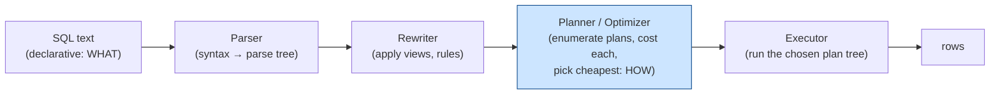
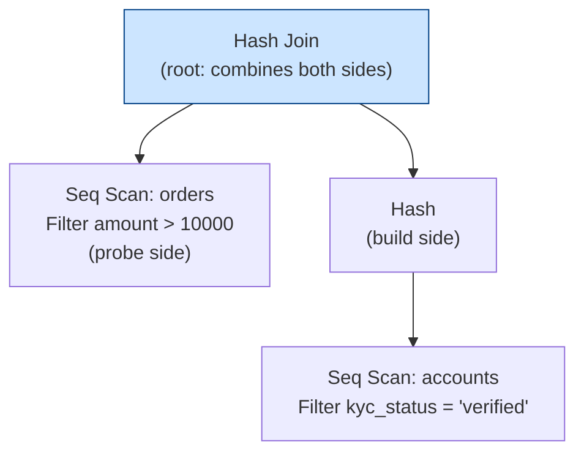
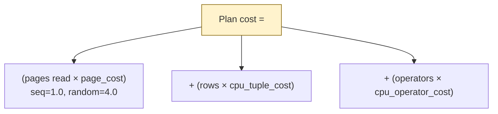
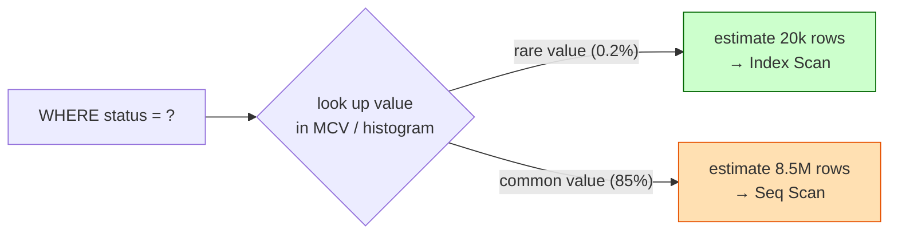
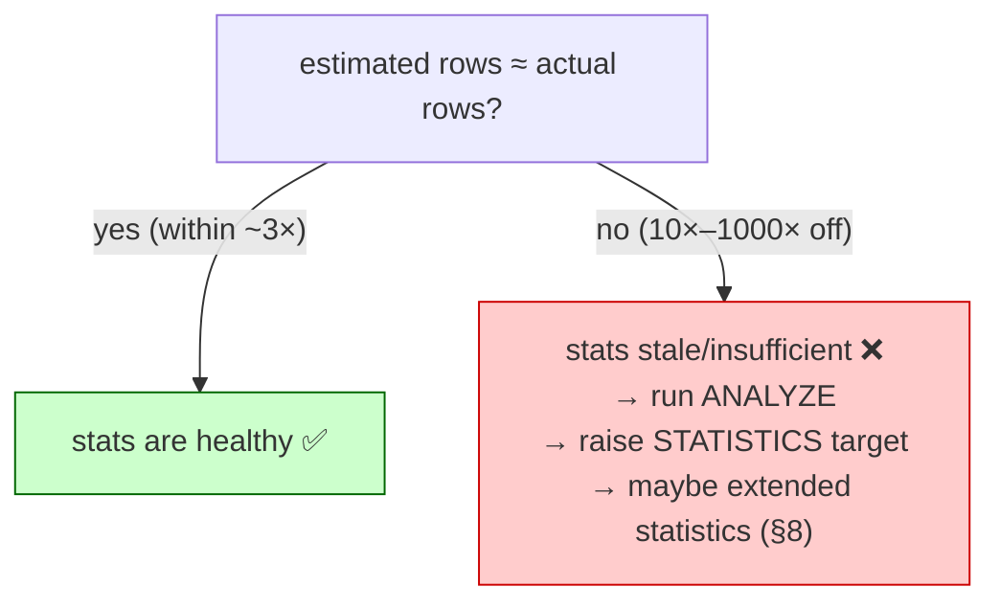
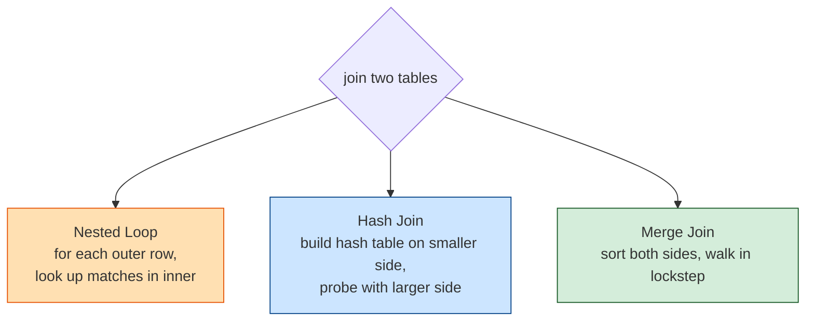

# 05 — Query Planning & EXPLAIN ANALYZE

> **Where this fits:** Topic 4 taught you the *scans* Postgres can choose (Seq, Index, Bitmap Heap)
> and the *indexes* that feed them. This topic is the brain that **chooses between them** — and, once
> more than one table is involved, picks the **join algorithm** and **join order** too. The planner is a
> cost-based optimizer: it estimates the price of every plan and runs the cheapest. When a query is
> mysteriously slow, 90% of the time the answer is "the planner picked a bad plan because its row
> *estimate* was wrong." Reading `EXPLAIN ANALYZE` — specifically the gap between **estimated** and
> **actual** rows — is the single most valuable Postgres debugging skill, and Zerodha will hand you an
> EXPLAIN output and ask "what's wrong here?"

---

## 0. The mental model (read this first)

The planner is a **GPS routing engine** — or, even better, a **School Librarian fetching books for a student**.

### Analogy: The Librarian and the Book Request
You walk up to a librarian and say:
> *"Please get me all Science Fiction books published after 2010 that are currently available to borrow."*

This request is **declarative** (SQL). You told the librarian **WHAT** you want, not **HOW** to get it. 

The librarian is the **Query Planner**. They must formulate a plan to get the books as fast as possible. They have two main choices:
1. **Plan A (Sequential Scan):** Walk down every single aisle of the library, pull every book off the shelf, check its genre, publication date, and availability. (Slow for small requests, but reliable).
2. **Plan B (Index Scan):** Go to the card catalog (which is indexed by Genre). Look up "Science Fiction". It gives you the exact location of 15 books. Go directly to those 15 spots on the shelves. (Extremely fast for rare categories).

#### How does the Librarian decide? (Cost-Based Planning)
The librarian doesn't run the plan first to see which is faster. Instead, they **estimate** the effort based on **statistics** (what they know about the library):
* **Rare Genre (e.g., Sci-Fi):** The librarian knows Sci-Fi makes up only $0.15\%$ of the library (15 books). They choose **Plan B (Index Scan / Card Catalog)**.
* **Common Genre (e.g., Textbooks):** If you asked for textbooks, which make up $80\%$ of the library, running back and forth for 8,000 individual index lookups is exhausting. It's faster to just push a cart down the aisles and scan everything sequentially (Plan A).

#### The Disaster: Stale Statistics
Imagine the library recently received a massive donation of 5,000 Science Fiction books, but the librarian **does not know this yet** because their database catalog statistics haven't been updated.
1. You ask for Sci-Fi books.
2. The librarian consults their stale stats: *"Ah, we only have 15 Sci-Fi books. Plan B (Index Scan) will be fastest!"*
3. The librarian starts the task. But instead of 15 books, they find **5,000 books**. They end up walking back and forth to the card catalog and individual shelves 5,000 times.
4. **It takes 6 hours.** Had they known there were 5,000 books, they would have chosen Plan A (walk the aisles sequentially) and finished in 2 hours.

That last scenario is the whole game. **A slow query is almost always a costing mistake driven by bad statistics**, not a "Postgres is slow" problem. `EXPLAIN ANALYZE` is the dashcam/video recording that shows you what *actually* happened versus what the GPS/Librarian predicted.




Everything interesting happens in the **Planner** box.

---

## 1. WHAT — the planner and the plan tree

Postgres turns one SQL statement into a **tree of plan nodes**. Each node pulls rows from its children,
does one operation (scan, filter, sort, join, aggregate), and passes rows up. The root produces the
final result.

```sql
EXPLAIN
SELECT o.id, o.amount
FROM orders o
JOIN accounts a ON a.id = o.account_id
WHERE a.kyc_status = 'verified' AND o.amount > 10000;
```

```text
Hash Join  (cost=33.50..71.20 rows=120 width=12)
  Hash Cond: (o.account_id = a.id)
  ->  Seq Scan on orders o  (cost=0.00..30.00 rows=400 width=16)
        Filter: (amount > 10000)
  ->  Hash  (cost=28.00..28.00 rows=440 width=4)
        ->  Seq Scan on accounts a  (cost=0.00..28.00 rows=440 width=4)
              Filter: (kyc_status = 'verified'::text)
```

Read it **inside-out / bottom-up**: leaf nodes (the two Seq Scans) run first, feed their parent (the
Hash / Hash Join), which feeds the root. Indentation = parent/child; the deepest nodes execute first.



---

## 2. WHY — cost-based optimization

There can be **thousands** of valid plans for a single query (which table to scan first, which index,
which join algorithm, which join order). Postgres assigns each candidate a unitless **cost** and runs the
cheapest. Cost is built from a handful of tunable constants (`postgresql.conf`):

| Parameter | Default | Meaning |
|-----------|---------|---------|
| `seq_page_cost` | `1.0` | cost to read one page **sequentially** (the baseline unit) |
| `random_page_cost` | `4.0` | cost to read one page via **random** I/O (4× — assumes spinning disk) |
| `cpu_tuple_cost` | `0.01` | cost to process one row |
| `cpu_index_tuple_cost` | `0.005` | cost to process one index entry |
| `cpu_operator_cost` | `0.0025` | cost to evaluate one operator/function |

A cost number like `cost=0.00..30.00` is **two numbers**:

- **Startup cost** (`0.00`) — work before the *first* row can be emitted (e.g. a Sort must read
  everything before returning row 1; a Seq Scan can emit immediately).
- **Total cost** (`30.00`) — work to return *all* rows.



> **Why `random_page_cost = 4.0` matters:** it's why a Seq Scan often *beats* an Index Scan on a chunk
> of the table — the index path pays the 4× random penalty per heap fetch. On **SSD/NVMe**, random reads
> are nearly as cheap as sequential, so a very common real-world tuning is to lower it to `1.1`. This one
> knob flips the planner toward index scans and is a frequent "we changed one setting and everything got
> faster" interview story.

---

## 3. HOW — statistics: where the estimates come from

The planner's row estimates come from the **statistics** that `ANALYZE` (run automatically by
autovacuum) collects into the `pg_statistic` catalog, readable via the `pg_stats` view. Without good
stats, the GPS has a stale map.

For each column, Postgres stores:

| Statistic | What it captures | Used for |
|-----------|------------------|----------|
| `n_distinct` | number of distinct values | estimating `WHERE col = ?` selectivity |
| **MCV** (most common values) | the top-N frequent values + their frequencies | skewed columns (`status`, `country`) |
| **histogram** | value distribution split into equal-frequency buckets | range estimates `WHERE col > ?` |
| `null_frac` | fraction of NULLs | `IS NULL` / `IS NOT NULL` |
| `correlation` | how well physical row order matches sorted column order (−1…+1) | Index Scan vs Bitmap; **drives BRIN value** |

### Analogy: The Classroom Statistics
To understand these metrics, imagine a school teacher maintaining stats on a classroom of **100 students**:
* **`n_distinct` (Unique options):** The teacher counts unique blood types in the class (e.g. A+, B-, O+ = `3` distinct values). But for phone numbers, they expect `100` distinct values. High distinct values mean a query matching a single value will likely return only 1 row (great for Index Scans).
* **MCV (Common Values):** The teacher notes that 70 students live in Mumbai, 20 in Pune, and the rest are spread out. The MCV list stores `[Mumbai: 0.70, Pune: 0.20]`. If you search for students in `Mumbai`, the planner sees 70% match and runs a Sequential Scan. If you search for a rare town like `Delhi` (not in MCV), it knows the match rate is extremely low ($<1\%$) and chooses an Index Scan.
* **Histogram (Range Buckets):** The teacher groups students' grades into 5 equal-sized buckets of 20 students each (e.g. $0-50$, $50-75$, $75-85$, $85-92$, $92-100$). If you search for grades `> 90`, the planner checks the buckets to quickly estimate that ~25 students will match.
* **`null_frac` (Empty values):** The percentage of students without a driving license ($95\%$). If you search for students *with* a license (`IS NOT NULL`), it knows only 5% of the class matches (Index Scan).
* **`correlation` (Seat arrangement):** 
  * **1.0 (Perfect):** Students sit in alphabetical order. Scanning for names starting with "A" through "C" is incredibly fast because they are sitting side-by-side in the front row.
  * **0.0 (Random):** Students sit wherever they want. Finding "A" through "C" requires jumping all over the classroom (leads to Bitmap Index Scans to sort the lookup order before reading).


```sql
-- Peek at what the planner actually knows about a column:
SELECT attname, n_distinct, most_common_vals, correlation
FROM pg_stats
WHERE tablename = 'orders' AND attname IN ('status', 'created_at');
```

### 3.1 How an estimate is computed (worked example)

Query: `SELECT * FROM orders WHERE status = 'pending';` on a 10,000,000-row table.

1. Planner looks up `status` in the MCV list. Say `'pending'` has frequency `0.002`.
2. Estimated rows = `10,000,000 × 0.002 = 20,000`.
3. 20,000 / 10M = 0.2% selectivity → "few rows" → it prefers an **Index Scan** (if an index exists).

If instead `status = 'completed'` has frequency `0.85` → estimate `8,500,000` rows → **Seq Scan**. The
*same query shape* gets a different plan depending on the **literal value**, because the MCV stats tell
the planner the distribution is skewed. This is why **prepared statements with a generic plan can
surprise you** (§9).



### 3.2 The histogram (range estimates)

For `WHERE created_at > '2026-06-01'`, MCVs don't help — it's a range. Postgres stores a **histogram**: buckets each holding ~the same *number* of rows (equal-frequency, not equal-width). 

#### Analogy: Packing 100 T-shirts into 5 Boxes
Imagine you have 100 t-shirts of various sizes (XS to XXXL) to pack into **5 boxes**, with **exactly 20 shirts per box** (equal frequency):
* **Box 1 (XS to S):** 20 shirts. (Very narrow range because small shirts are common).
* **Box 2 (M):** 20 shirts.
* **Box 3 (L):** 20 shirts.
* **Box 4 (XL to XXL):** 20 shirts.
* **Box 5 (XXXL):** 20 shirts. (Very wide range because XXXL shirts are rare).

If a customer asks: *"How many shirts are size **XL or larger**?"*, the planner looks at the boxes and sees that Box 4 and Box 5 match. Since each box holds 20 shirts, it calculates `2 boxes × 20 shirts = 40 shirts` without scanning any individual shirt.

To estimate `> '2026-06-01'`, Postgres counts how many buckets fall completely above that boundary and interpolates (estimates the split) within the single bucket that straddles the boundary. Default = **100 buckets** (`default_statistics_target = 100`).

> **Tuning lever:** If a column has a highly lopsided distribution (e.g. millions of orders on Black Friday but only 10 on a normal Tuesday), a single bucket might span a massive date range, causing bad estimates. 
> You can increase the number of boxes:
> `ALTER TABLE orders ALTER COLUMN created_at SET STATISTICS 1000;` then `ANALYZE orders;`
> More buckets (1,000 instead of 100) = finer estimates = better plans, at the cost of slightly slower `ANALYZE` commands.

---

## 4. READING `EXPLAIN` — the three commands

```sql
EXPLAIN              SELECT ...;   -- plan + estimates only (does NOT run the query)
EXPLAIN ANALYZE      SELECT ...;   -- ACTUALLY RUNS it, shows estimated vs actual
EXPLAIN (ANALYZE, BUFFERS) SELECT ...;   -- + how many pages came from cache vs disk
```

> ⚠️ **`EXPLAIN ANALYZE` executes the query.** On an `UPDATE`/`DELETE`/`INSERT` it **really modifies
> data**. To analyze a write safely, wrap it: `BEGIN; EXPLAIN ANALYZE UPDATE ...; ROLLBACK;`

### 4.1 The one line that matters most: estimated vs actual rows

```text
Seq Scan on orders  (cost=0.00..30.00 rows=400 width=16) (actual time=0.02..1.30 rows=39000 loops=1)
                                       ^^^^^^^^                                  ^^^^^^^^^^
                                       planner GUESSED 400                      reality: 39,000
```

The planner thought **400**, reality was **39,000** — a **~100× misestimate**. That is the smell of
**stale or insufficient statistics**, and it cascades: a wrong row count at a leaf makes the planner
pick the wrong join algorithm above it (it'll choose a Nested Loop expecting 400 rows, then loop 39,000
times — catastrophic).



**Interview gold:** when shown an EXPLAIN ANALYZE, the *first* thing you do out loud is scan for the node
where `rows=(estimate)` diverges hugely from `actual rows`. Name that node as the root cause.

### 4.2 `loops`, and reading per-row cost

```text
->  Index Scan using idx_orders_account on orders  (actual time=0.01..0.03 rows=5 loops=8000)
```

`loops=8000` means this node ran **8,000 times** (it's the inner side of a Nested Loop). **The reported
`rows` and `time` are PER LOOP** — multiply by `loops` for the true total: `5 × 8000 = 40,000` rows,
`~0.03ms × 8000 = 240ms`. A node that *looks* cheap (0.03ms) can dominate the query once you account for
loops. This trips up almost everyone the first time.

### 4.3 `BUFFERS` — cache vs disk

```text
Seq Scan on trades  (actual ...) 
  Buffers: shared hit=1200 read=8000
```

- `shared hit=1200` → 1,200 pages served from the **buffer cache** (RAM, fast).
- `read=8000` → 8,000 pages had to be **read from disk** (slow).

A query slow only on the "cold" first run but fast afterwards is disk-read-bound — `BUFFERS` proves it.
Always use `(ANALYZE, BUFFERS)` for real diagnosis.

---

## 5. JOIN ALGORITHMS — the heart of the planner

Once two+ tables are involved, the planner picks **how** to join. There are exactly three algorithms.
Knowing when each wins is core SDE2 material.



### 5.1 Nested Loop Join

```text
for each row R in OUTER:
    for each row S in INNER (ideally via index on join key):
        if R.key == S.key: emit (R, S)
```

- **Wins when:** the outer side is **small** (few rows) AND the inner side has an **index** on the join
  key. Then each inner lookup is an O(log n) index probe, not a full scan.
- **Cost:** `outer_rows × cost_of_one_inner_lookup`. Great for 5 outer rows; **catastrophic** for
  500,000 (that's 500,000 index probes).
- **Analogy:** you have 5 invoices and a filing cabinet sorted by customer ID. For each invoice you walk
  to the cabinet and pull the one matching folder. Fine for 5 invoices, insane for 500,000.
- **The classic disaster:** planner *underestimates* the outer side (stale stats say 10 rows, reality
  100,000) → picks Nested Loop → runs the inner lookup 100,000 times → query that should take 50ms takes
  5 minutes. This is the **#1 real-world bad-plan story.**

### 5.2 Hash Join

```text
BUILD:  read smaller table, put every row in a hash table keyed on join column
PROBE:  read larger table, hash each row's key, look it up in the hash table
```

- **Wins when:** joining **two large** unsorted tables on an **equality** condition (`=`). No index
  needed. This is the workhorse for analytics / big joins.
- **Cost:** roughly one full pass over each table (build + probe) — O(N+M), far better than Nested
  Loop's O(N×M) when both are big.
- **Requires memory:** the build-side hash table must fit in `work_mem`. If it doesn't, Postgres
  **spills to disk** in batches (slower) — visible as `Batches: 4  Memory Usage: ...` in EXPLAIN.
- **Equality only:** hashing can't do `>`/`<` (no notion of "near" in a hash). Range joins can't use it.
- **Analogy:** to match 10,000 invoices to 10,000 customers, you first build a quick lookup table
  (customer ID → customer) in your head/notepad, then flip through invoices once, instantly looking each
  up. Two passes, no sorting.

### 5.3 Merge Join

```text
sort BOTH inputs by the join key (or use already-sorted index output)
walk both in lockstep like a zipper, emitting matches
```

- **Wins when:** both inputs are **already sorted** on the join key (e.g. both come off a B-tree index in
  order), or for very large joins where sorting once is cheaper than a giant hash table. Also handles
  `>=`/`<=` range joins, which Hash Join can't.
- **Cost:** dominated by the two sorts (`O(N log N)`) — but **free** if the rows already arrive sorted
  from an index, which is the case it really shines in.
- **Analogy:** two stacks of paperwork already sorted by ID. You lay them side by side and zip down both
  simultaneously, matching as you go. No random lookups, no hash table.

### 5.4 Simple Join Walkthrough (Students & Checkouts)

To make these joins intuitive, imagine we are matching **Students** (Table A: 1,000 rows) to their **Checkouts** (Table B: 50,000 rows).

* **Nested Loop Join:** You take the first student, find their name, walk over to the checkouts log, search for their name, and write down the books. Then you take the second student, search the log, and write down the books. 
  * *When it's great:* You only have 3 students to look up, and the checkouts log is alphabetized (indexed).
  * *When it's a disaster:* You have 10,000 students. Walking back and forth to search the log 10,000 times will take all day.
* **Hash Join:** You take all 1,000 students and write their names on a whiteboard with a quick index number (a Hash Table). Then, you read through the 50,000 checkouts log *exactly once*. For each checkout, you quickly look at the whiteboard to see if that student matches.
  * *When it's great:* Both datasets are medium-to-large, and you want to match them on an exact key (e.g. `student_id = checkout_student_id`). It only requires reading each table once.
* **Merge Join:** You sort both the student list and the checkouts list alphabetically by student ID. Now you lay them side-by-side. You look at the first student "Alice" and the first checkout "Alice". Match! You move down both lists in lockstep (like zipping up a jacket).
  * *When it's great:* Both lists are **already sorted** (for example, if they came out of indexes that store data in alphabetical order). You don't have to spend any time sorting or building whiteboards.

### 5.5 Cheat sheet

| Algorithm | Best when | Needs index? | Operators | Memory |
|-----------|-----------|:---:|-----------|--------|
| **Nested Loop** | outer side tiny, inner indexed | inner: yes (ideally) | `=`, `<`, `>`, anything | low |
| **Hash Join** | two big tables, equality | no | **`=` only** | `work_mem` (build side) |
| **Merge Join** | both pre-sorted / very large | helps (sorted output) | `=`, ranges | sort memory |

> **The disaster signature again:** a `Nested Loop` whose inner node shows a huge `loops=` and whose
> *outer* node has `rows=(small estimate)` vs `actual rows=(huge)`. The fix is almost never "force a hash
> join" — it's **fix the stats** (`ANALYZE`, extended statistics) so the planner sees the real outer size
> and chooses Hash Join itself.

---

## 6. Other plan nodes you must recognize

| Node | What it does | Watch for |
|------|--------------|-----------|
| `Sort` | sorts rows (for `ORDER BY`, Merge Join, `DISTINCT`) | `Sort Method: external merge Disk: …` = spilled past `work_mem`; raise it or add a sorted index |
| `Hash Aggregate` | `GROUP BY` via hash table | spills to disk if groups exceed `work_mem` |
| `GroupAggregate` | `GROUP BY` over pre-sorted input | cheaper than HashAgg when input already sorted |
| `Limit` | stops after N rows | enables "fast first row" plans (index + LIMIT, Topic 4 §6) |
| `Gather` / `Gather Merge` | collects rows from **parallel workers** | parallel query is active |
| `Materialize` | caches a subtree's output to avoid recomputing | often around the inner side of a join |
| `Memoize` (PG14+) | caches inner lookups in a Nested Loop (like a per-query result cache) | big win for skewed Nested Loops |
| `Append` / `Merge Append` | combines partitions or `UNION` branches | partition pruning visible here |
| `Incremental Sort` (PG13+) | sorts only the unsorted suffix when input is partly sorted | cheaper than full Sort |

### 6.1 Parallel query

For big scans Postgres can split work across worker processes:

```text
Gather  (workers planned: 2)
  ->  Parallel Seq Scan on trades  (...)
```

Governed by `max_parallel_workers_per_gather` (default 2). Each worker scans a slice; `Gather` merges
results. Great for large analytical scans/aggregations; pointless for tiny OLTP lookups (worker startup
overhead isn't worth it).

---

## 7. A full worked diagnosis (the interview walk-through)

```sql
EXPLAIN (ANALYZE, BUFFERS)
SELECT a.name, sum(o.amount)
FROM accounts a
JOIN orders o ON o.account_id = a.id
WHERE a.region = 'IN' AND o.created_at >= '2026-06-01'
GROUP BY a.name;
```

```text
HashAggregate  (cost=... rows=50) (actual ... rows=4800 loops=1)
  ->  Nested Loop  (cost=... rows=50) (actual time=0.1..98000 rows=480000 loops=1)
        ->  Seq Scan on accounts a  (rows=50) (actual rows=4800 loops=1)
              Filter: (region = 'IN')
        ->  Index Scan using idx_orders_account on orders o
              (rows=1) (actual rows=100 loops=4800)
              Index Cond: (account_id = a.id)
              Filter: (created_at >= '2026-06-01')
  Buffers: shared hit=120 read=92000
```

**How to read this out loud in an interview:**

1. The `accounts` Seq Scan: estimate `50`, actual `4800` — **96× off**. Stats on `region` are stale (or
   `region='IN'` is far more common than the planner thinks).
2. Because it believed there were only 50 accounts, the planner chose a **Nested Loop**. But it actually
   loops the inner Index Scan **4,800 times** (`loops=4800`), pulling 100 orders each = **480,000 rows**.
3. `Buffers: read=92000` — 92k pages off disk. The query takes ~98 seconds.
4. **Diagnosis:** misestimate on `accounts.region` → wrong join algorithm. **Fix:** `ANALYZE accounts;`
   (and/or raise statistics target on `region`). With the real count (4,800), the planner will switch to
   a **Hash Join** — one pass over each side instead of 4,800 index loops — turning 98s into well under a
   second. Notice: **we changed zero SQL.** We fixed the map.

---

## 8. Extended statistics — when columns are correlated

Default stats assume columns are **independent**. They aren't always:

```sql
SELECT * FROM orders WHERE city = 'Mumbai' AND state = 'Maharashtra';
```

Planner reasoning (independence assumption): `P(city) × P(state)` → multiplies two small fractions →
estimates *far too few* rows. But `city='Mumbai'` **implies** `state='Maharashtra'` (functional
dependency) — the real selectivity is just `P(city)`. The underestimate can trigger a bad Nested Loop.

**Fix — tell Postgres the columns are correlated:**

```sql
CREATE STATISTICS stat_city_state (dependencies, ndistinct)
  ON city, state FROM orders;
ANALYZE orders;
```

Now the planner knows the functional dependency and estimates correctly. This is an advanced lever worth
*naming* in a senior interview — it shows you understand *why* multi-column estimates go wrong.

---

## 9. Generic vs custom plans (the prepared-statement gotcha)

A **prepared statement** (`PREPARE`, or via JDBC/most ORMs) is planned with placeholders `$1`. Postgres:

- For the first **5 executions**, builds a **custom plan** each time using the *actual* parameter value
  (so it can use MCV stats for that specific value).
- After that, if a **generic plan** (value-agnostic) looks no more expensive on average, it switches to
  the generic plan and **stops re-planning** (saves planning cost).

The trap: for a **skewed** column, the generic plan averages across values and can pick a Seq Scan that's
terrible for the *rare* value you actually pass — the exact case where a custom plan would have used the
index. Symptom: "the query is fast in `psql` but slow from the app." Control it:

```sql
SET plan_cache_mode = 'force_custom_plan';   -- always re-plan with the real value
-- (or 'force_generic_plan' / 'auto' = default)
```

---

## 10. Knobs & verification (the toolkit)

```sql
-- Refresh stats (the #1 fix for bad plans):
ANALYZE orders;                 -- one table
ANALYZE;                        -- whole database

-- Give a skewed column finer-grained stats, then re-analyze:
ALTER TABLE orders ALTER COLUMN status SET STATISTICS 1000;
ANALYZE orders;

-- Memory for sorts & hash tables (per operation, per connection — be careful at scale):
SET work_mem = '256MB';         -- session-level; stops Sort/Hash spilling to disk

-- SSD reality check — make index scans more attractive:
SET random_page_cost = 1.1;     -- default 4.0 assumes spinning disk

-- Diagnose anything:
EXPLAIN (ANALYZE, BUFFERS, VERBOSE, FORMAT TEXT) SELECT ...;

-- See current stats the planner is using:
SELECT * FROM pg_stats WHERE tablename = 'orders';
```

> **Postgres has no real `HINTS`.** Unlike Oracle, you can't pin a plan in SQL. The "Postgres way" is to
> *fix the inputs* (statistics, indexes, `work_mem`, cost constants) so the planner chooses well. For
> emergencies you can toggle `enable_nestloop = off` etc. **per session** to test a hypothesis (never in
> production config), or install the `pg_hint_plan` extension. Saying "I'd fix the stats, not force the
> plan" is the senior answer.

`work_mem` warning for fintech scale: it's allocated **per sort/hash node, per connection**. With 500
connections each running a query with 2 hash nodes at `work_mem=256MB`, worst case ≈ `500 × 2 × 256MB =
256GB`. Set it modestly globally and bump it per-session for known-heavy queries.

---

## 11. INTERVIEW ANGLES

**Q: Walk me through what happens between submitting SQL and getting rows.**
A: Parser (syntax → parse tree) → Rewriter (expand views/rules) → Planner/Optimizer (enumerate plans,
cost each from statistics, pick cheapest) → Executor (run the plan tree). The planner is where
performance is decided; SQL is declarative so Postgres chooses the *how*.

**Q: What do the two numbers in `cost=0.00..30.00` mean?**
A: Startup cost (work before the first row — e.g. a Sort must consume all input first) and total cost
(work for all rows). Unitless, anchored to `seq_page_cost = 1.0`.

**Q: I hand you an `EXPLAIN ANALYZE`. What's the first thing you look at?**
A: The node where **estimated rows** diverge most from **actual rows**. A large gap means stale/bad
statistics, which cascades into wrong join choices. I'd also check `loops` (per-loop numbers must be
multiplied) and `Buffers` (disk `read` vs cache `hit`).

**Q: Difference between `EXPLAIN` and `EXPLAIN ANALYZE`?**
A: `EXPLAIN` shows the plan and *estimates* without running it. `EXPLAIN ANALYZE` actually executes the
query and shows *actual* time/rows/loops — so it modifies data on writes (wrap in `BEGIN…ROLLBACK`).

**Q: Explain the three join algorithms and when each is chosen.**
A: **Nested Loop** — small outer side + indexed inner; degrades to O(N×M) if outer is large. **Hash
Join** — two big tables on an equality key, builds a hash on the smaller side; needs `work_mem`. **Merge
Join** — inputs already sorted on the key (often from indexes) or very large; also does range joins.

**Q: A query suddenly got 1000× slower after a bulk load. Why, and how do you fix it?**
A: The bulk insert made statistics stale; the planner still thinks the table is tiny, underestimates row
counts, and picks a Nested Loop that now loops millions of times. Fix: `ANALYZE` the table so the
planner sees reality — it'll switch to a Hash Join. No SQL change needed.

**Q: Why does the same query use an index for one value and a seq scan for another?**
A: Skewed data + MCV statistics. A rare value is estimated as few rows (index wins); a common value as
most of the table (seq scan wins). The planner inlines the literal and consults the distribution.

**Q: Postgres doesn't have query hints. So how do you control the plan?**
A: You don't force it; you fix its inputs — refresh/raise statistics, add the right index, tune
`work_mem` and `random_page_cost`, add extended statistics for correlated columns. `enable_*` toggles
exist for *diagnosis* per-session, and `pg_hint_plan` for emergencies, but the idiomatic fix is the
statistics.

**Q: What is `random_page_cost` and why lower it on SSD?**
A: Estimated cost of a random page read, default 4× sequential (spinning-disk assumption). On SSD/NVMe
random ≈ sequential, so lowering it to ~1.1 stops the planner over-penalizing index scans.

**Q (fintech): A reconciliation join over two 50M-row tables is slow with a Nested Loop. Diagnosis?**
A: Nested Loop over 50M outer rows = 50M inner lookups — wrong algorithm. Either stats underestimate the
outer side, or there's no usable index. For two big tables on an equality key the planner should pick a
**Hash Join**; I'd verify estimates with `EXPLAIN ANALYZE`, `ANALYZE` both tables, ensure enough
`work_mem` so the hash doesn't spill, and confirm it flips to Hash Join.

---

## 12. RECALL CARDS

- Pipeline: **Parse → Rewrite → Plan → Execute.** All performance decisions live in the **Planner**.
- Planner = **cost-based GPS**: estimates plan cost from **statistics**, runs the cheapest. Never drives first.
- `cost=startup..total`; unit anchored to `seq_page_cost=1.0`; `random_page_cost=4.0` (lower to ~1.1 on SSD).
- Stats live in `pg_stats`: **n_distinct, MCV, histogram, null_frac, correlation**. Refreshed by `ANALYZE`/autovacuum.
- **#1 skill:** in `EXPLAIN ANALYZE`, find where **estimated rows ≠ actual rows**. Big gap = stale stats.
- `loops=N` → reported `rows`/`time` are **per loop**; multiply by N for the truth.
- `(ANALYZE, BUFFERS)` → `shared hit` (cache) vs `read` (disk). Cold-vs-warm proof.
- **Nested Loop**: tiny outer + indexed inner (O(N×M) if outer big). **Hash Join**: 2 big tables, `=` only, needs `work_mem`. **Merge Join**: pre-sorted inputs / ranges.
- Classic disaster: underestimated outer → **Nested Loop with huge `loops`** → fix = `ANALYZE`, not forcing a plan.
- Skewed column → same query, different plan per literal (MCV). Beware generic prepared-statement plans (`plan_cache_mode`).
- Correlated columns → **extended statistics** (`CREATE STATISTICS ... dependencies`) to fix underestimates.
- Postgres has **no SQL hints** — fix the *inputs* (stats, indexes, work_mem, cost constants). `enable_*` = diagnosis only.
- `work_mem` is **per node, per connection** — multiply by concurrency before raising it.

→ **Next:** [06 — Vacuum, Bloat & txid Wraparound](06-vacuum-bloat.md) (why dead tuples accumulate, how
autovacuum reclaims them and refreshes the very statistics this chapter relies on, and the wraparound
emergency that can halt writes).
