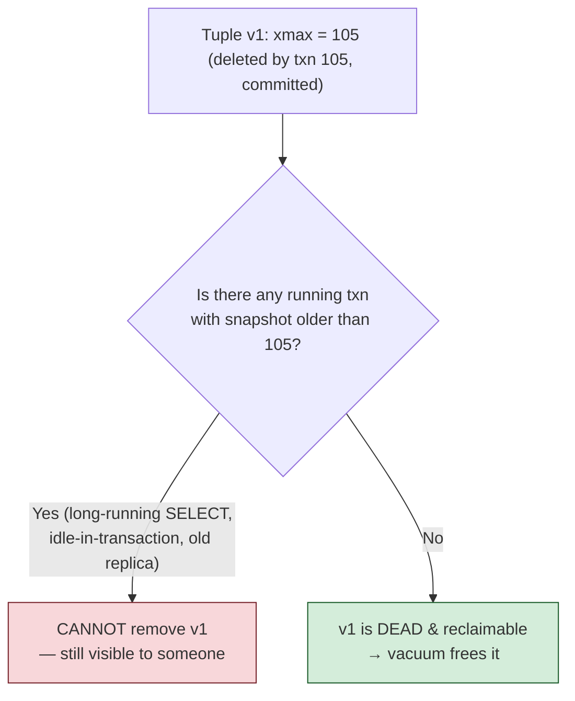
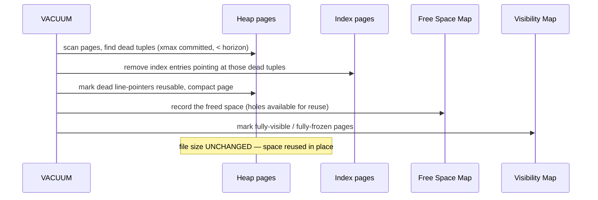
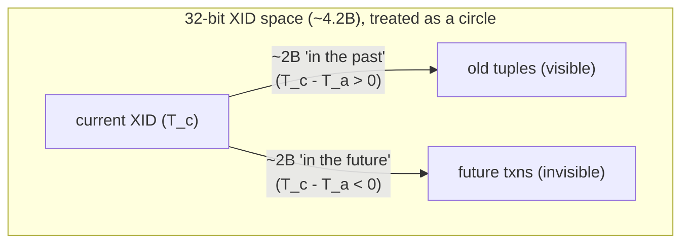
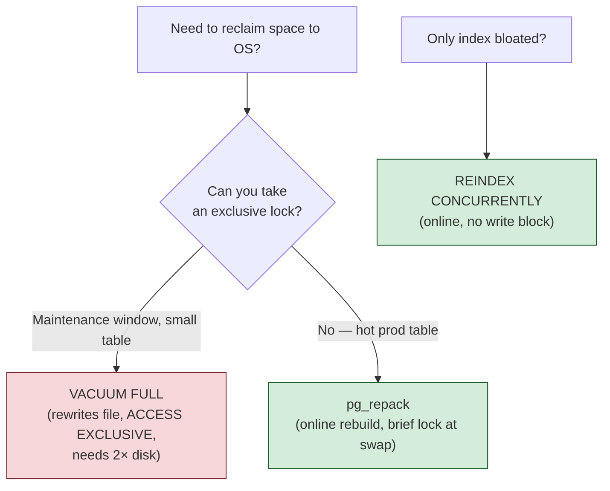

# 06 — Vacuum, Bloat & txid Wraparound

> **Where this fits:** Topic 1 told you the dirty secret — every `UPDATE`/`DELETE` leaves a **dead
> tuple** behind, because MVCC never overwrites in place. This topic is the *cleanup crew* that makes
> MVCC sustainable. Without vacuum, a busy Postgres table grows forever (bloat), indexes rot, the
> planner's statistics go stale (Topic 5), and — the nightmare scenario — the 32-bit transaction
> counter wraps around and Postgres **stops accepting writes to protect your data**. Zerodha-style
> interviews love this because it's where "I know Postgres syntax" separates from "I've run Postgres
> in production at scale."

---

## 0. The mental model (read this first)

MVCC is a **restaurant that never clears tables until a busboy comes around.**

- Every `UPDATE`/`DELETE` is a customer leaving — but their dirty plates (dead tuples) stay on the table.
- Readers with old snapshots are *still eating* at some of those tables, so you can't clear a plate
  until **every** diner who might still want it has left (no transaction old enough to see it remains).
- **VACUUM** is the busboy: it walks the floor, clears plates that *no current diner can see anymore*,
  and frees the seat for the next customer.
- If the busboy is too slow (autovacuum can't keep up), plates pile up → tables overflow → you need
  more tables (the file grows) → **bloat**. The restaurant is now half-full of dirty tables.
- **VACUUM does NOT shrink the building.** It frees seats *within* existing tables for reuse. To
  actually return floor space to the landlord (the OS), you need `VACUUM FULL` (rebuild the room) —
  which closes the restaurant while it happens.

That last distinction — *vacuum reclaims space for reuse but doesn't return it to the OS* — is the
single most misunderstood thing about Postgres operations.

---

## 1. WHAT

**VACUUM** is the background process that removes **dead tuples** — row versions that are no longer
visible to *any* running or future transaction — and makes that space available for reuse. It does
four jobs:

1. **Reclaims dead tuple space** within heap pages (and index pages) for future inserts/updates.
2. **Updates the Free Space Map (FSM)** so new tuples know where the reusable holes are.
3. **Updates the Visibility Map (VM)** — marks pages "all-visible" (enables index-only scans) and
   "all-frozen."
4. **Freezes old tuples** — marks ancient tuples as "frozen" (so they're always visible regardless of
   their `xmin`) to prevent **transaction ID wraparound**. Since 9.4 this sets the `HEAP_XMIN_FROZEN`
   bit in `t_infomask` and leaves the actual `xmin` intact (pre-9.4 physically overwrote `xmin` with
   `FrozenTransactionId = 2`).

`ANALYZE` (often run together as part of autovacuum) is a separate-but-related job: it refreshes the
**planner statistics** (`pg_stats`) that Topic 5 depends on.

| Operation | Reclaims space for reuse | Returns space to OS | Locks table | Updates stats |
|-----------|:---:|:---:|:---:|:---:|
| `VACUUM` (plain) | ✅ | ❌ | No (shares table) | ❌ (unless `ANALYZE`) |
| `VACUUM FULL` | ✅ | ✅ (rewrites file) | **ACCESS EXCLUSIVE** 🔒 | ✅ |
| `ANALYZE` | ❌ | ❌ | No | ✅ |
| **autovacuum** | ✅ | ❌ | No | ✅ (auto-analyze) |

---

## 2. WHY (the problem vacuum solves)

Recall the MVCC slogan from Topic 1: **`UPDATE` = mark old version dead + insert new version.** So:

- A table receiving 10k updates/sec accumulates 10k dead tuples/sec.
- Dead tuples consume disk, sit in the buffer cache evicting useful pages, and force scans to read
  more pages for the same live rows.
- Index entries pointing at dead tuples also accumulate → **index bloat** → slower index scans.
- The planner's row-count estimates drift as live/dead ratios change → **bad plans** (Topic 5).

And the time bomb: Postgres identifies transactions with a **32-bit transaction ID (XID)**. That's
only ~4.2 billion values, and the visibility logic treats XID space as a **circle** (any XID is
"in the past" for half the circle and "in the future" for the other half). If you burn through ~2
billion XIDs without freezing old rows, those old rows would suddenly appear to be **in the future**
and become invisible — silent, catastrophic data loss. To prevent this, Postgres **must** freeze old
tuples, and if it can't keep up it will **shut down writes**. Vacuum is not optional housekeeping;
it's a correctness requirement.

---

## 3. HOW (the internals)

### 3.1 What makes a tuple "dead" and reclaimable

A dead tuple can only be removed when it's invisible to **every** transaction — including the oldest
still-running one. The gatekeeper is the **xmin horizon** (a.k.a. `OldestXmin`): the oldest snapshot
currently held by any backend.



**This is the #1 production gotcha:** a single **long-running transaction** or a connection stuck
**`idle in transaction`** holds the xmin horizon back, so vacuum *runs but reclaims nothing* —
dead tuples pile up everywhere even though autovacuum looks healthy. Same effect from a lagging
physical replica with `hot_standby_feedback = on`, or an abandoned replication slot.

```sql
-- Find the saboteur (oldest running transaction holding the horizon)
SELECT pid, state, now() - xact_start AS duration, query
FROM pg_stat_activity
WHERE state <> 'idle' AND xact_start IS NOT NULL
ORDER BY xact_start ASC LIMIT 5;

-- Abandoned replication slots also pin the horizon
SELECT slot_name, active, age(xmin) AS xmin_age FROM pg_replication_slots;
```

### 3.2 What VACUUM physically does (plain vacuum)



Key points:
- Plain `VACUUM` runs **concurrently** with normal traffic (only a `SHARE UPDATE EXCLUSIVE` lock that
  blocks DDL/other vacuums, not reads/writes).
- It leaves the file at the **same size**; the freed space is recorded in the FSM for future inserts.
- Exception: it can truncate **trailing** empty pages back to the OS, but interior bloat stays.

### 3.3 Bloat — what it is, how to measure it

**Bloat** = dead space + unused-but-allocated space inside a table or index. A 10 GB table with 4 GB of live data is ~60% bloated. 

#### Why Bloat Degrades your Cache Hit Ratio:
* **Analogy:** Postgres reads data in 8 KB **pages** (shipping boxes). If you have 100 apples (live rows) packed tightly at 10 per box, you only need **10 boxes** (pages) in RAM. If the table is bloated and each box contains only 4 apples (plus 6 empty slots of dead space), you now need **25 boxes** in RAM to hold the exact same 100 apples.
* **The impact:** Postgres cannot read individual rows directly off disk; it must load the entire 8 KB page into the buffer cache. Wasting RAM on empty slots (the 6 GB of bloat) evicts other useful pages from memory, forcing subsequent queries to go to slow disk and dropping your cache hit ratio.
* **Effects:** More pages to scan, worse cache hit ratio, slower everything.

```sql
-- Live vs dead tuples, and last (auto)vacuum/analyze
SELECT relname,
       n_live_tup, n_dead_tup,
       round(n_dead_tup::numeric / NULLIF(n_live_tup + n_dead_tup, 0), 3) AS dead_ratio,
       last_autovacuum, last_autoanalyze
FROM pg_stat_user_tables
ORDER BY n_dead_tup DESC
LIMIT 10;
```

**Fixing bloat:**
- **Best:** prevent it — tune autovacuum so it keeps pace (§3.6); design for **HOT updates** (Topic 1).
- **Reclaim to OS without downtime:** `pg_repack` (extension) — rebuilds the table/index online using
  triggers + a swap, only a brief lock at the end. The production-standard tool.
- **Brute force (locks the table):** `VACUUM FULL` rewrites the entire table into a fresh file at
  minimum size — but takes an **ACCESS EXCLUSIVE** lock (no reads or writes) and needs ~2× disk during
  the rewrite. Never on a hot ledger table during market hours.
- **Index-only bloat:** `REINDEX CONCURRENTLY` rebuilds an index without blocking writes.

### 3.4 The Visibility Map and index-only scans (the payoff)

VACUUM maintains a **Visibility Map (VM)** — one bit per heap page meaning "every tuple on this page
is visible to all transactions." This powers two big wins:

1. **Index-only scans (Topic 4):** if the VM says a page is all-visible, an index scan can return
   values **without visiting the heap** to check visibility. No vacuum → stale VM → no index-only
   scans → your "covering index" silently degrades to a regular index scan.
2. **Vacuum can skip all-frozen pages** entirely on the next run — making vacuum cheaper over time.

This is why people are surprised that "running VACUUM made my read queries faster" — it refreshed the
VM and re-enabled index-only scans.

### 3.5 Transaction ID Wraparound — the doomsday clock

XIDs are 32-bit and assigned to write transactions. Postgres treats the XID space as **modular (circular)**: for any transaction, ~2 billion XIDs are "in the past" and ~2 billion are "in the future." A tuple's `xmin` must always look like it's *in the past* to be visible.

#### What does "modular/circular" and "looking like it's in the past" actually mean?

Because transaction IDs are 32-bit unsigned integers, they eventually wrap around from $2^{32} - 1$ back to `3`. If a simple numeric comparison like `xmin < current_xid` were used, transaction `5` (which was created after wrapping around) would be incorrectly seen as older than transaction `4,000,000,000`.

To solve this, Postgres determines if transaction $T_a$ is in the past relative to the current transaction $T_c$ by casting the subtraction to a **signed 32-bit integer**:
$$\text{Is Past} = (T_c - T_a) > 0 \pmod{2^{32}}$$

* **If the signed difference is positive:** $T_a$ is in the past.
* **If the signed difference is negative:** $T_a$ is in the future.

This effectively splits the 4.29 billion XID space into a moving circle:
* The $2^{31}$ (~2.1 billion) values **modulo-behind** the current XID are in the **past** (visible).
* The $2^{31}$ (~2.1 billion) values **modulo-ahead** of the current XID are in the **future** (invisible).



#### The Danger: Why rows suddenly "vanish"
If a row was created at transaction `100` and the database keeps accepting writes without freezing this row, the current transaction counter eventually climbs to `2,147,483,748` ($100 + 2^{31}$). 

The moment the current XID crosses this threshold:
1. The difference $(T_c - 100)$ flips to a negative value when interpreted as a signed 32-bit integer.
2. The transaction `100` suddenly shifts from the **past window** to the **future window**.
3. When checking visibility, Postgres thinks the row was created by a future transaction that hasn't happened yet.
4. **Result:** The row silently disappears from all queries.

To prevent this, vacuum **freezes** old tuples: it stamps them with a frozen marker (modern Postgres sets a frozen bit in `t_infomask`) that tells the visibility engine: *"This tuple is frozen; ignore its actual `xmin` and treat it as always in the past."* Frozen tuples are immune to wraparound.

**The escalation Postgres performs to protect you:**

| `age(datfrozenxid)` | Postgres behavior |
|---|---|
| Normal | Routine autovacuum freezes lazily |
| `vacuum_freeze_table_age` (default 150M) | Next autovacuum becomes an **aggressive** scan (visits all-but-frozen pages to freeze) |
| `autovacuum_freeze_max_age` (default 200M) | Forces an **anti-wraparound autovacuum**, even if autovacuum is disabled |
| ~40M XIDs remaining | Logs increasingly urgent warnings |
| ~3M XIDs remaining (approx) | Refuses to assign new XIDs → **database stops accepting writes** (read-only) until you vacuum |

Recovery from the read-only emergency: connect as superuser and run `VACUUM` (a plain freeze vacuum) on
the offending tables/databases. On PG14+ a superuser can usually still connect in **normal mode**;
single-user mode is now rarely required (older lore says it always is). This was the famous
**Sentry (2015)** and **Mailchimp/Joyent** outage class.

```sql
-- How close are you to the cliff? (higher age = more urgent)
-- 2000000000 ≈ the hard wrap; the FORCED anti-wraparound vacuum already fires far earlier,
-- at autovacuum_freeze_max_age (200M). Use a plain literal (underscores in numbers are PG16+ only).
SELECT datname, age(datfrozenxid) AS xid_age,
       2000000000 - age(datfrozenxid) AS xids_until_wrap
FROM pg_database ORDER BY xid_age DESC;

-- Per-table, find what's holding the oldest unfrozen xid
SELECT relname, age(relfrozenxid) AS xid_age
FROM pg_class WHERE relkind = 'r' ORDER BY xid_age DESC LIMIT 10;
```

> **Note — MultiXacts wrap too:** `MultiXactId`s (created when multiple transactions hold a shared
> row lock — `SELECT … FOR SHARE`, FK checks) are **also 32-bit and have their own independent
> wraparound**, governed by `autovacuum_multixact_freeze_max_age` (default **400M**). Postgres has *not*
> made them 64-bit. There's ongoing community work toward 64-bit XIDs, but on all mainstream versions
> you must still treat 32-bit wraparound — for both XIDs and MultiXacts — as real. Mention this in interviews.

### 3.6 Autovacuum — the daemon that does this automatically

The **autovacuum launcher** spawns workers that vacuum/analyze tables when thresholds are crossed.
The trigger formula for vacuum:

```
dead_tuples > autovacuum_vacuum_threshold
            + autovacuum_vacuum_scale_factor * reltuples
```

Defaults: `threshold = 50`, `scale_factor = 0.2` (20%). **The 0.2 default is the classic scaling
trap:** on a 100-row table autovacuum fires after ~70 dead rows (fine); on a **100M-row** table it
waits for **20M dead tuples** before acting — massive bloat accumulates first.

**Production tuning playbook (the answer interviewers want):**

```sql
-- For large, high-churn tables: vacuum much sooner, per-table.
ALTER TABLE orders SET (
  autovacuum_vacuum_scale_factor = 0.02,   -- 2% instead of 20%
  autovacuum_vacuum_threshold    = 1000,
  autovacuum_analyze_scale_factor = 0.01   -- keep stats fresh for the planner
);

-- Let workers do more work before sleeping (cost-based throttle):
--   autovacuum_vacuum_cost_limit  (raise → vacuum faster, more I/O)
--   autovacuum_vacuum_cost_delay  (lower → less throttling)
--   autovacuum_max_workers        (more parallel tables)
```

Knobs that matter:
- **`autovacuum_vacuum_cost_delay` / `_cost_limit`** — the I/O throttle. Default throttling is
  conservative; on modern SSDs you usually raise the cost limit so vacuum finishes before the next
  flood arrives.
- **`autovacuum_max_workers`** — parallelism across tables (not within one table).
- **`maintenance_work_mem`** (and `autovacuum_work_mem`) — bigger = vacuum collects more dead TIDs per
  index pass = fewer index scans = faster vacuum. Big win for large tables.
- **`autovacuum_naptime`** — how often the launcher checks (default 1 min).

### 3.7 Why VACUUM FULL is dangerous (and the alternatives)



`VACUUM FULL` takes an **ACCESS EXCLUSIVE** lock → blocks **everything**, including reads. On a
trading ledger this is an outage. Default to `pg_repack` / `REINDEX CONCURRENTLY` for live systems.

---

## 4. CODE / SQL — operate it yourself

```sql
-- 1. Manually vacuum + refresh stats + see what happened
VACUUM (VERBOSE, ANALYZE) orders;
-- VERBOSE prints: pages removed, dead tuples found, index passes, etc.

-- 2. Watch dead tuples accumulate then get reclaimed
SELECT n_live_tup, n_dead_tup FROM pg_stat_user_tables WHERE relname='orders';
UPDATE orders SET status = 'filled' WHERE status = 'pending';   -- creates dead tuples
SELECT n_live_tup, n_dead_tup FROM pg_stat_user_tables WHERE relname='orders';  -- dead ↑
VACUUM orders;
SELECT n_live_tup, n_dead_tup FROM pg_stat_user_tables WHERE relname='orders';  -- dead → 0

-- 3. Prove the long-transaction-blocks-vacuum effect
--   Session A:
BEGIN; SELECT 1;            -- holds a snapshot open, does nothing else
--   Session B:
UPDATE orders SET status='x' WHERE id < 1000;   -- dead tuples
VACUUM orders;                                  -- runs, but...
SELECT n_dead_tup FROM pg_stat_user_tables WHERE relname='orders';  -- still high!
--   ...because Session A's horizon still "sees" those versions.
--   Session A:
COMMIT;
--   Session B:
VACUUM orders;             -- NOW the dead tuples are reclaimed

-- 4. Wraparound health check (run this on every prod cluster you own)
SELECT datname, age(datfrozenxid) FROM pg_database ORDER BY 2 DESC;

-- 5. Freeze proactively during a window
VACUUM (FREEZE, VERBOSE) orders;
```

---

## 5. INTERVIEW ANGLES

**Q: What does VACUUM actually do?**
A: Removes dead tuples (row versions invisible to all transactions), frees their space *for reuse*
within the file, updates the Free Space Map and Visibility Map, refreshes stats (with ANALYZE), and
freezes old tuples to prevent XID wraparound. Plain VACUUM does **not** shrink the file or block reads.

**Q: I ran VACUUM but my table is still 10 GB on disk. Why?**
A: Plain VACUUM reclaims space for *internal reuse*, it doesn't return it to the OS. To shrink the
file use `VACUUM FULL` (locks the table) or, online, `pg_repack`.

**Q: Autovacuum is running but dead tuples keep climbing. What's wrong?**
A: Something is holding the xmin horizon back — a long-running transaction, an `idle in transaction`
connection, a lagging replica with `hot_standby_feedback`, or an abandoned replication slot. Vacuum
can't remove tuples still visible to the oldest snapshot. Find it in `pg_stat_activity` /
`pg_replication_slots`.

**Q: What is transaction ID wraparound and why does Postgres go read-only?**
A: XIDs are 32-bit and compared circularly. If old tuples aren't frozen within ~2B transactions, their
`xmin` would flip to "in the future" and they'd vanish — silent data loss. To prevent that, Postgres
forces anti-wraparound autovacuum, and as a last resort stops accepting writes (~3M XIDs left) until
you vacuum/freeze. It's choosing **availability loss over data loss**.

**Q: Default autovacuum on a 100M-row table — what breaks?**
A: `autovacuum_vacuum_scale_factor = 0.2` means it waits for ~20M dead tuples before firing → huge
bloat and stale stats. Fix: lower the per-table scale factor to ~0.01–0.02, raise the cost limit,
bump `maintenance_work_mem`.

**Q: How do you reclaim bloat on a hot table during market hours?**
A: Not `VACUUM FULL` (ACCESS EXCLUSIVE = outage). Use `pg_repack` for tables and
`REINDEX CONCURRENTLY` for indexes — both rebuild online with only a momentary lock.

**Q: How does vacuum relate to query performance / index-only scans?**
A: Vacuum maintains the Visibility Map; index-only scans require all-visible pages. Skipping vacuum
disables index-only scans and lets the planner's stats rot, producing bad plans. So vacuum is a
*performance* feature, not just cleanup.

**Q (fintech twist): What's your vacuum strategy for a high-frequency order/ledger table?**
A: Per-table aggressive autovacuum (scale_factor ~0.01), generous cost limit + `maintenance_work_mem`,
monitor `n_dead_tup` and `age(relfrozenxid)`, alert on long transactions/idle-in-transaction, prefer
append-only/partitioned designs (drop old partitions instead of deleting rows → no bloat), and use
HOT updates by keeping hot-mutated columns out of indexes.

---

## 6. ONE-LINE RECALL CARDS

- VACUUM removes dead tuples & frees space **for reuse**; it does **not** return space to the OS.
- A dead tuple is only reclaimable when it's invisible to the **oldest snapshot** (xmin horizon).
- **Long/idle transactions, lagging replicas, dead replication slots** pin the horizon → vacuum reclaims nothing.
- `VACUUM FULL` rewrites the file (shrinks to OS) but takes **ACCESS EXCLUSIVE** — use `pg_repack` online instead.
- VACUUM maintains the **Visibility Map** → enables **index-only scans**; skipping vacuum silently kills them.
- XIDs are **32-bit, compared circularly**; unfrozen old tuples after ~2B txns → wraparound → Postgres goes **read-only**.
- Watch `age(datfrozenxid)` / `age(relfrozenxid)`; anti-wraparound autovacuum forces itself at `autovacuum_freeze_max_age`.
- Autovacuum default `scale_factor=0.2` is too lax for big tables → tune **per-table** to ~0.01–0.02.
- `maintenance_work_mem` ↑ = fewer index passes = faster vacuum.
- Fintech: partition + drop old partitions (no DELETE bloat), keep hot columns unindexed (HOT updates).

→ **Next:** [07 — WAL, Checkpoints & Replication](07-wal-replication.md) (the write-ahead log that makes
COMMIT durable, how checkpoints bound recovery time, and how streaming WAL to replicas gives you HA and
read scaling).
