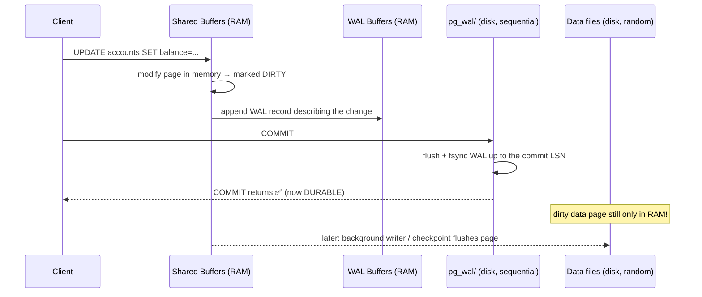
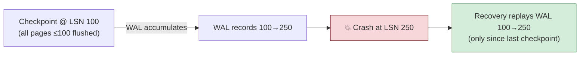
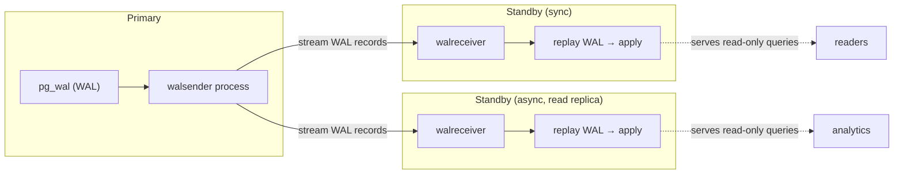
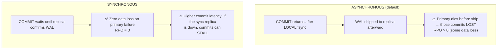

# 07 — WAL, Checkpoints & Replication

> **Where this fits:** Topic 1 promised that a `COMMIT` is durable the moment its **WAL** record is
> fsync'd — *not* when the data page is written. This topic cashes that promise. The Write-Ahead Log
> is the spine of Postgres: it makes commits durable, makes crash recovery possible, bounds recovery
> time via **checkpoints**, and is the literal byte stream shipped to replicas for **high availability**
> and **read scaling**. For a fintech/exchange role this is the "how do you not lose a trade when the
> primary's power supply dies?" topic — they *will* ask about RPO/RTO, sync vs async replication, and
> failover.

---

## 0. The mental model (read this first)

WAL is an **accountant's journal vs. the ledger book.**

- The **ledger book** (data files / heap pages) is the official record, but rewriting it is slow —
  pages are scattered all over the disk (random I/O).
- So before touching the ledger, the accountant scribbles every change into a **journal** (WAL) — a
  single notebook written strictly top-to-bottom (sequential I/O, fast to fsync).
- **Rule: write the journal entry first, then update the ledger whenever convenient** ("write-ahead").
- If the office burns down (crash) mid-update, you reopen the journal and **replay** every entry since
  the last reconciliation — the ledger is reconstructed exactly. No committed change is ever lost,
  because it was in the journal before you said "done."
- Periodically you **reconcile** (checkpoint): flush the ledger up to date and note "everything up to
  here is safely in the book," so after a crash you only replay journal entries *after* that mark.
- **Replication** = photocopying the journal page-by-page to a second office (replica) that replays the
  same entries, staying a mirror of the first.

The whole design exists because **sequential writes are cheap and random writes are expensive**, and
because a sequential log is trivially shippable to other machines.

---

## 1. WHAT

The **Write-Ahead Log (WAL)** is an append-only, sequential record of every change to the database's
data pages, written **before** the corresponding change is allowed to reach the permanent data files.

Core guarantees it provides:
- **Durability (the D in ACID):** a committed transaction survives a crash because its effects are in
  the WAL on stable storage.
- **Crash recovery:** on restart, Postgres replays WAL from the last checkpoint to reach a consistent,
  up-to-date state (redo).
- **Atomicity assist:** uncommitted work present in WAL/data files is rolled back/ignored during recovery.
- **Replication & PITR:** the same WAL stream feeds physical replicas and point-in-time recovery.

WAL lives in `pg_wal/` as a series of 16 MB **segment files**. A position in the log is an **LSN**
(Log Sequence Number) — a monotonically increasing byte offset like `0/16B3F58`.

---

## 2. WHY (the problem WAL solves)

Without WAL, to make a commit durable you'd have to **fsync every modified data page** at commit time.
Those pages are scattered across the heap → **random I/O**, slow, and a single transaction touching 5
pages means 5 random fsyncs. Worse, a crash *mid-flush* could leave a page **half-written** (torn
page), corrupting data with no way to tell.

WAL fixes both:
1. **Performance:** commit only needs to fsync the **sequential** WAL up to the commit record — one
   contiguous write, regardless of how scattered the actual page changes are. The dirty data pages are
   flushed lazily, in bulk, later.
2. **Correctness:** because the log records the change *before* the page is touched, recovery can always
   redo it. **Full-page writes** (the first change to a page after a checkpoint logs the entire page)
   protect against torn pages.

This is the classic **"turn random writes into sequential writes + deferred flush"** pattern — the same
idea behind a database redo log, an LSM-tree commit log, and Kafka's append-only segments.

---

## 3. HOW (the internals)

### 3.1 The write path — when is a COMMIT durable?



The crucial insight: at the moment `COMMIT` returns, the **data file may not contain the change at
all** — only the WAL does. That's fine, because recovery replays WAL. Durability is anchored to the
**WAL fsync**, not the data-page write.

### 3.2 `synchronous_commit` — the durability/throughput dial

| Setting | COMMIT waits for | Risk on crash | Use case |
|---|---|---|---|
| `off` | nothing — returns before fsync | lose commits in the last **~3 × `wal_writer_delay`** (≈600 ms; **no corruption**, still consistent) | bulk loads, logs |
| `local` | local WAL fsync to disk (ignores replicas) | lose committed txns only if the primary's disk dies | single-node default behaviour |
| `on` (default) | local fsync **+** every sync standby has **fsync'd** the WAL (when `synchronous_standby_names` is set) | none unless primary *and* all sync standbys fail | ledgers, money (RPO=0) |
| `remote_write` | local fsync **+** standby has **received** it into its OS cache (not yet fsync'd) | lose if the standby's **OS** crashes before flushing | balanced HA |
| `remote_apply` | the above **+** standby has **replayed/applied** it (visible to queries there) | strongest; highest latency | read-your-writes on a replica |

> Note `on` ≠ `local`: with `synchronous_standby_names` configured, the default `on` waits for the
> standby to **fsync** WAL (RPO=0). With no sync standbys named, `on` is effectively just local fsync.

#### Concrete Scenarios & Lifecycles

Consider a Client committing: `UPDATE bank_accounts SET balance = 100 WHERE id = 1;` in a cluster with one Primary and one Standby replica.

##### 1. `off` (Asynchronous Commit)
* **How it works:** Client commits. Postgres writes the change to the local WAL buffer in RAM and immediately returns "Success!". In the background, `wal_writer` flushes it to disk ~600ms later.
* **Use Case:** Ingesting IoT sensor data, web analytics clickstream, or user profile views.
* **Crash Scenario:** If the primary crashes 100ms after success, the database restarts cleanly but that transaction is lost. It is perfectly internally consistent, just missing the last few commits.

##### 2. `local` (Local Synchronous Commit)
* **How it works:** Client commits. Primary writes WAL, calls `fsync`, waits for local disk confirmation, and returns "Success!". It does not wait for replication standby.
* **Use Case:** Single-node setups, or non-critical state like session tokens where replica lag is tolerable.
* **Crash Scenario:** Primary crash is fully durable because WAL is on disk. However, if the primary's disk physically explodes, failover to standby will lose any transactions that had not replicated yet.

##### 3. `on` (Default Synchronous Standby)
* **How it works:** Client commits. Primary writes/fsyncs WAL locally and streams it to the standby. The standby writes the WAL to its local disk, calls `fsync`, and tells the primary: *"Safe on disk."* Only then does the primary return "Success!".
* **Use Case:** Core transaction registers, order creation.
* **Crash Scenario:** If the primary node physically dies, failing over to the standby guarantees zero data loss (RPO = 0) because the standby has the WAL on disk.

##### 4. `remote_write` (Fast Replication Balance)
* **How it works:** Client commits. Primary writes/fsyncs WAL locally and streams to standby. Standby receives the WAL into its **RAM (OS Page Cache)** and immediately tells the primary: *"Got it in memory."* (doesn't wait for its own disk write). Primary returns "Success!".
* **Use Case:** High-throughput transactional data that needs network redundancy but cannot tolerate standby disk latency.
* **Crash Scenario:** Safe if only the primary crashes (the standby's OS will eventually flush its memory cache to disk). Only loses data if both the primary crashes and the standby loses power/hardware at the same time.

##### 5. `remote_apply` (Read-Your-Writes Consistency)
* **How it works:** Client commits. Primary writes/fsyncs WAL locally and streams to standby. Standby writes/fsyncs WAL to disk **and replays the WAL** (updating its database tables so the change is queryable). Standby tells primary: *"Data is applied and visible."* Primary returns "Success!".
* **Use Case:** User updates their password or profile picture, and the frontend immediately redirects them to read from a standby replica.
* **Benefit:** Eliminates replication lag for readers. A query hitting the standby replica immediately after a write on the primary is guaranteed to see the new value.

#### Session & Transaction Level Control
You do not have to set this globally. You can tune the durability dial dynamically:
```sql
BEGIN;
SET LOCAL synchronous_commit = off; -- Safe async commit for non-critical logging
INSERT INTO application_logs VALUES (...);
COMMIT;
```

**Key nuance for interviews:** `synchronous_commit = off` is **safe for consistency** — it never corrupts data, it only widens the window of *committed-but-lost-on-crash* transactions. That's an acceptable trade for analytics ingestion but **never** for a trade execution.


### 3.3 Checkpoints — bounding recovery time

A **checkpoint** is a point where Postgres guarantees all pages that were dirty as of the checkpoint's
start have been flushed to the data files. The LSN recorded at checkpoint *start* is the **REDO point**
— the position from which crash recovery begins (the checkpoint *record* is written later, once the
flush completes). After a crash, recovery only needs to replay WAL **from the REDO point of the last
checkpoint** — so checkpoints bound your **recovery time (RTO)**.



#### Step-by-Step Example of a Checkpoint & Crash

1. **At 12:00 PM: Checkpoint Starts (LSN 100)**
   * Postgres identifies all dirty data pages in RAM (Shared Buffers) modified up to LSN 100.
   * A background process starts flushing these pages from RAM to the database files on disk. 
   * *Note:* Transactions do not pause; new writes (LSN 110, 120, etc.) are still happening in RAM and streaming to WAL.
2. **At 12:05 PM: Checkpoint Completes**
   * Postgres has finished flushing all pages up to LSN 100 to disk.
   * Postgres writes a checkpoint record and saves LSN 100 in the control file (`pg_control`) as the **REDO point**.
   * **Clean-up:** Any WAL files containing only LSNs `< 100` are now safely recycled/deleted.
3. **12:05 PM to 12:15 PM: Active Writes**
   * Active writes continue, writing changes to the WAL on disk (durable) but only modifying the table pages in RAM: Transaction A (LSN 150), Transaction B (LSN 200), and Transaction C (LSN 250).
4. **At 12:16 PM: Server crashes (Power Outage) 💥**
   * RAM is instantly wiped clean. The main table files on disk are missing the changes from LSN 150, 200, and 250.
5. **At 12:17 PM: Server boots back up (Recovery) 🔄**
   * Postgres reads `pg_control` and finds the REDO point: **LSN 100**.
   * Because of the checkpoint, it knows everything before LSN 100 is already safe in the database files.
   * Postgres opens the WAL files, goes straight to LSN 100, and **replays** the changes from LSN 100 to 250. Replaying anything before LSN 100 is completely skipped, saving time.

The trade-off:
- **Frequent checkpoints** → short recovery, but more I/O (pages flushed often) and more **full-page
  writes** (WAL bloat), hurting steady-state throughput.
- **Infrequent checkpoints** → less steady-state I/O, but longer recovery and bigger WAL.

Tuning knobs:
- `checkpoint_timeout` (default 5 min) — max time between checkpoints. Production often 15–30 min.
- `max_wal_size` (default 1 GB) — a **soft** ceiling: Postgres triggers checkpoints to *try* to keep
  total WAL under it (it can be exceeded under bursty load), not a hard cutoff.
- `wal_keep_size` (PG13+, replaced `wal_keep_segments`) — minimum WAL to retain for lagging standbys
  that aren't using a replication slot.
- `checkpoint_completion_target` (default 0.9) — spread the flush over 90% of the interval to avoid a
  brutal I/O spike ("checkpoint storm") that stalls queries.
- `full_page_writes` (default on) — first write to a page post-checkpoint logs the whole page (torn-page
  protection). Don't turn off unless your storage guarantees atomic 8 KB writes.

A **checkpoint spike** (latency stalls every N minutes) is a classic prod symptom → raise
`checkpoint_timeout`/`max_wal_size` and keep `completion_target` high to smooth the flush.

### 3.4 Physical (streaming) replication — how replicas stay in sync

The primary streams its WAL to one or more **standbys**, which continuously **replay** it, staying
**logically identical at the block level** via WAL replay (not necessarily byte-for-byte identical files
— hint bits, `pg_wal` contents, etc. can differ). Standbys can serve **read-only** queries (hot standby).



#### Replication Slots vs. Manual Log Shipping

Suppose **Standby 1** goes offline for 10 minutes due to a network glitch.
* **Without a Replication Slot:** The Primary continues writing new WAL files. When a checkpoint completes, the Primary deletes the old WAL files. When Standby 1 comes back online and says, *"I need WAL starting at LSN 100!"*, the Primary has already recycled those files. Standby 1 is now broken and must be rebuilt from scratch (`pg_basebackup`).
* **With a Replication Slot:** The replication slot acts as a bookmark on the Primary: *"Standby 1 is currently at LSN 100."* Postgres's checkpointer is **forbidden** from deleting any WAL files containing LSNs newer than 100. When Standby 1 comes back online, it reads the saved WAL files and catches up perfectly.
  * **⚠️ Production Hazard:** If Standby 1 goes offline for *days*, the primary will hoard WAL files indefinitely. Eventually, the primary's `pg_wal` disk partition fills up completely, and the database will crash. You must monitor `pg_replication_slots`.

#### Resolving Read Conflicts on Replicas (`hot_standby_feedback`)

Imagine an analyst runs a massive reporting query on the **Standby** replica. It takes 15 minutes to run.
1. **At 12:01 PM:** The query starts on the Standby, reading historical data.
2. **At 12:02 PM:** A user deletes those same rows on the **Primary**, and the Primary's autovacuum purges them.
3. **At 12:03 PM:** The deletion/vacuum WAL record is streamed to the Standby.
4. **The Conflict:** The Standby's recovery process wants to replay the delete (removing the rows), but the analyst's query is still reading those rows.
   * **If `hot_standby_feedback = off` (default):** The Standby waits for a brief grace period (e.g., `max_standby_streaming_delay` = 30s) and then **forcibly kills the analyst's query** with the error: *"canceling statement due to conflict with recovery"*.
   * **If `hot_standby_feedback = on`:** The Standby sends a message back to the Primary: *"I am running a query that still needs these rows."* The Primary delays its vacuuming of those rows. The analyst's query completes successfully. *(Trade-off: Delaying vacuum causes table bloat on the Primary!)*

### 3.5 Synchronous vs Asynchronous replication — RPO trade-off



- **Async (default):** low latency, but if the primary dies you lose any commits not yet shipped →
  **RPO > 0** (nonzero potential data loss).
- **Sync** (`synchronous_standby_names` + `synchronous_commit = on`/`remote_apply`): COMMIT blocks
  until a standby confirms → **RPO = 0**, but commit latency rises and a stalled/lost sync standby can
  **block writes** unless you have ≥2 sync candidates (`ANY 1 (s1, s2, s3)` quorum).

**The fintech answer:** for the money-moving cluster, run **synchronous replication with a quorum of
standbys** (e.g., `ANY 1 (standbyA, standbyB)`) so RPO = 0 *and* a single standby failure doesn't halt
trading. Keep async read replicas for analytics where staleness is acceptable.

### 3.6 RPO / RTO — the vocabulary they're testing

- **RPO (Recovery Point Objective):** how much data you can afford to lose (time window). Async repl →
  RPO = replication lag. Sync repl → RPO = 0.
- **RTO (Recovery Time Objective):** how long until service is restored. Driven by checkpoint frequency
  (recovery replay time) + failover automation speed.
- **Failover:** promoting a standby to primary when the primary dies. Tools: **Patroni** (the de-facto
  standard, uses etcd/Consul for leader election), `repmgr`, cloud-managed (RDS/Aurora/Cloud SQL).
  Beware **split-brain** (two primaries) — fencing/STONITH and a consensus store prevent it.

### 3.7 PITR — Point-In-Time Recovery

Take a **base backup** + archive every WAL segment (`archive_mode = on`, `archive_command` / or
`pg_receivewal` / tools like **pgBackRest**, **WAL-G**). To recover, restore the base backup and replay
archived WAL up to a chosen **target** (a timestamp, LSN, or named restore point) — e.g., "restore to
09:14:59, one second before the bad `DELETE`." This is your defense against *logical* disasters
(a fat-fingered `DELETE FROM orders;`) that replication faithfully copies to every replica.

### 3.8 Physical vs Logical replication (one-paragraph contrast)

- **Physical (streaming):** ships raw WAL; replica replays it into a block-level identical copy, **same
  major version**, whole-cluster, read-only. Best for HA/failover & read scaling.
- **Logical replication:** decodes WAL into row-level change events (INSERT/UPDATE/DELETE) published per
  table; subscribers can be a **different major version**, a **subset of tables**, and remain
  **writable**. Best for zero-downtime major upgrades, selective replication, CDC into Kafka/warehouses.

---

## 4. CODE / SQL — operate it yourself

```sql
-- Current WAL position (LSN) on the primary
SELECT pg_current_wal_lsn();

-- Replication lag, measured per connected standby (run on PRIMARY)
SELECT client_addr, state, sync_state,
       pg_wal_lsn_diff(pg_current_wal_lsn(), replay_lsn) AS replay_lag_bytes,
       write_lag, flush_lag, replay_lag
FROM pg_stat_replication;

-- On a STANDBY: is it in recovery, and how far behind in time?
SELECT pg_is_in_recovery(), now() - pg_last_xact_replay_timestamp() AS replay_delay;

-- Watch out for slots pinning WAL (disk filler + vacuum-horizon holder)
SELECT slot_name, active, restart_lsn,
       pg_size_pretty(pg_wal_lsn_diff(pg_current_wal_lsn(), restart_lsn)) AS retained_wal
FROM pg_replication_slots ORDER BY 4 DESC;

-- Durability dial per-transaction (e.g., relax it for a bulk load only)
SET synchronous_commit = off;   -- session-local; ledger code keeps the default 'on'
```

```ini
# postgresql.conf — a sane HA + checkpoint baseline
wal_level = replica                 # (or 'logical' if you need logical decoding/CDC)
synchronous_commit = on
synchronous_standby_names = 'ANY 1 (standbyA, standbyB)'   # quorum sync → RPO 0, survives 1 loss
checkpoint_timeout = 15min
max_wal_size = 8GB
checkpoint_completion_target = 0.9  # smooth the flush, avoid checkpoint storms
archive_mode = on
archive_command = 'pgbackrest --stanza=prod archive-push %p'   # for PITR
```

---

## 5. INTERVIEW ANGLES

**Q: Walk me through what happens when I COMMIT.**
A: The change is made to the page in shared buffers (dirty) and a WAL record is appended to WAL buffers.
On COMMIT, Postgres flushes+fsyncs WAL up to the commit LSN; once that returns, the commit is durable
and the client is acknowledged. The dirty data page is written to the data files later by the background
writer/checkpointer. Durability hangs on the WAL fsync, not the data-page write.

**Q: Why WAL at all — why not just write the data pages?**
A: Data pages are scattered (random I/O) and a mid-flush crash can tear a page. WAL turns commit into a
single sequential fsync and lets recovery redo changes; full-page writes guard against torn pages. It's
"random writes → sequential log + deferred flush."

**Q: What's the difference between sync and async replication? Which would you use for trades?**
A: Async: COMMIT returns after local fsync, WAL ships afterward → if the primary dies you lose un-shipped
commits (RPO > 0). Sync: COMMIT waits for a standby to confirm → RPO = 0 but higher latency, and a lost
sync standby can stall writes. For trades I'd use **quorum sync** (`ANY 1 (a,b)`) → RPO 0 while tolerating
one standby failure, plus async replicas for analytics.

**Q: What's a checkpoint and how does it affect recovery and performance?**
A: It flushes all dirty pages up to an LSN and records that mark, so crash recovery only replays WAL
after it — bounding RTO. Frequent checkpoints = faster recovery but more I/O and full-page-write WAL;
infrequent = less steady I/O but longer recovery. Smooth the flush with `checkpoint_completion_target`.

**Q: A replica is fine but the primary's `pg_wal` keeps filling the disk. Why?**
A: Almost certainly an inactive/abandoned **replication slot** (or stuck `archive_command`) forcing the
primary to retain WAL the consumer never acked. Check `pg_replication_slots`; drop dead slots. (Bonus:
that slot also pins the vacuum horizon → bloat, per Topic 6.)

**Q: RPO vs RTO?**
A: RPO = max acceptable data loss (window); set by replication mode (sync = 0, async = lag). RTO = max
acceptable downtime; set by checkpoint/recovery time + failover automation (Patroni etc.).

**Q: Replication copied a bad `DELETE` to every replica. How do you recover?**
A: Replication can't help against a *logical* error — every copy faithfully applied it. You need **PITR**:
restore a base backup and replay archived WAL to a target time just before the DELETE.

**Q: How do you do a major-version upgrade with near-zero downtime?**
A: **Logical replication** — stand up the new version as a subscriber, let it catch up, then cut over.
(Physical replication requires identical major versions, so it can't bridge versions.)

---

## 6. ONE-LINE RECALL CARDS

- WAL = append-only sequential redo log; **write the log before the data page** ("write-ahead").
- COMMIT is durable when **WAL is fsync'd** — the data page is flushed later by checkpoint/bgwriter.
- `synchronous_commit=off` loses recent commits on crash but **never corrupts** (still consistent).
- **Checkpoint** flushes dirty pages + marks an LSN → recovery only replays WAL *after* it (bounds RTO).
- Tune `checkpoint_timeout`/`max_wal_size`; `completion_target=0.9` smooths flush (avoid checkpoint storms).
- **Full-page writes** protect against torn pages (log whole page on first post-checkpoint touch).
- Physical replication streams WAL → standbys replay it (read replicas + HA). **Logical** decodes row events (cross-version, per-table, writable).
- **Async repl → RPO>0** (lose un-shipped commits); **sync repl → RPO=0** (but latency + possible write stall). Use **quorum sync** for the best of both.
- **Replication slots** retain WAL for a consumer — abandoned slot = disk fills + vacuum horizon pinned.
- **PITR** (base backup + archived WAL) is the only defense against *logical* disasters (bad DELETE) that replication copies everywhere.
- **RPO** = data-loss window (replication mode); **RTO** = downtime window (recovery + failover, e.g., Patroni).

→ **Next:** [08 — Connection Pooling & Performance at Scale](08-pooling-scale.md) (why each Postgres
connection is an OS process, why thousands of connections melt the server, and how PgBouncer + tuning
keep an exchange-grade workload alive).
