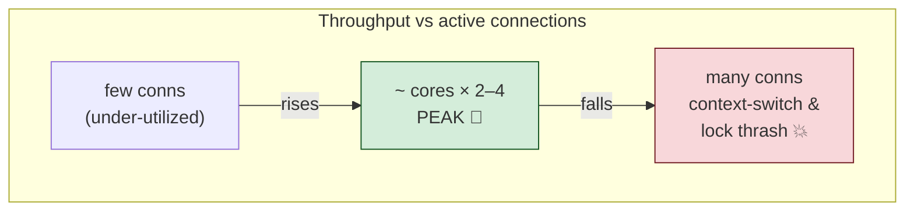
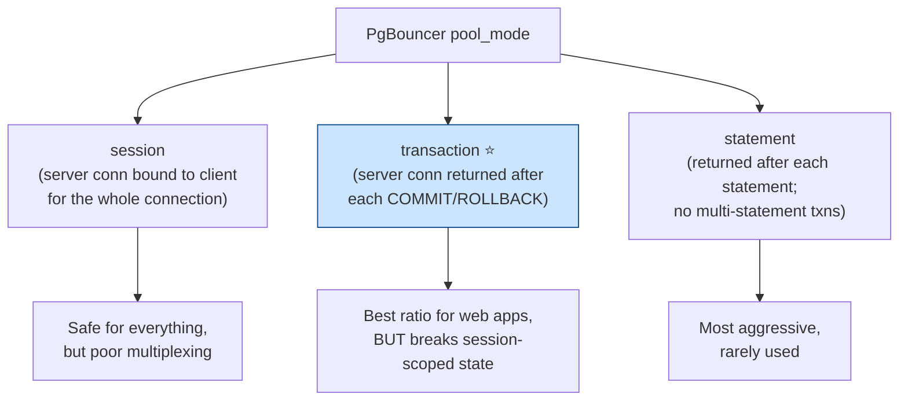
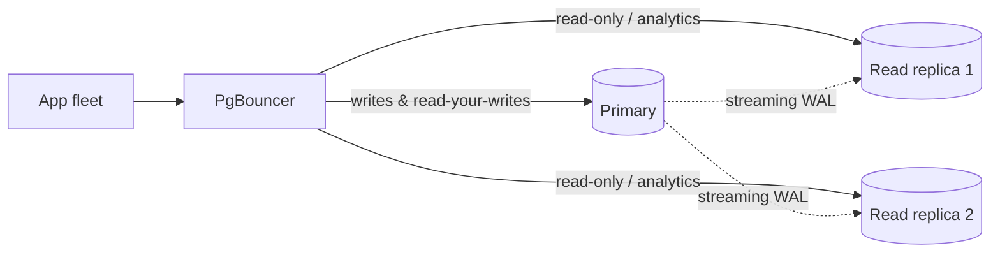

# 08 — Connection Pooling & Performance at Scale

> **Where this fits:** Topics 1–7 made you fluent in *one* connection's behavior — its snapshot, its
> locks, its WAL. This topic is about **thousands of connections at once**, which is where most
> real-world Postgres incidents actually happen. The brutal fact: **every Postgres connection is a
> separate OS process**, not a lightweight thread. An app server farm that naively opens 5,000
> connections doesn't get 5,000× throughput — it gets a melted database. Zerodha runs spiky,
> high-concurrency workloads (market open, order bursts), so "how do you keep Postgres alive under a
> connection storm?" is a core question. The answer is **connection pooling** + a handful of tuning
> levers.

---

## 0. The mental model (read this first)

A Postgres server is a **kitchen with a fixed number of chefs (CPU cores).**

- Each incoming connection is like hiring a **dedicated waiter** who stands in the kitchen — even when
  idle, the waiter takes up floor space (RAM ~5–10 MB/process), and the chefs have to keep stepping
  around him (context-switching, lock/latch contention).
- 50 waiters for 8 chefs? Manageable. **5,000 waiters for 8 chefs?** The kitchen is gridlocked — chefs
  spend all their time squeezing past idle waiters instead of cooking. Throughput *collapses* past the
  saturation point (this is the **"hockey-stick / thundering herd"** curve).
- A **connection pooler (PgBouncer)** is the **maître d'**: it keeps a *small* set of waiters who
  actually enter the kitchen, and makes everyone else wait politely in the lobby. 5,000 clients share,
  say, 40 real database connections. Throughput stays high and latency stays bounded.

The counterintuitive headline: **fewer connections = more throughput** once you're past the optimal
point. The optimal active connection count is roughly `cores × 2–4`, not "however many clients exist."

---

## 1. WHAT

PostgreSQL uses a **process-per-connection** model: the postmaster `fork()`s a dedicated **backend
process** for each client connection. That process holds its own memory (work_mem allocations, catalog
caches, prepared statements) and participates in shared-memory structures (lock table, buffer pool).

**Connection pooling** inserts a lightweight proxy between the application and Postgres that multiplexes
many client connections onto a **small, reused set** of real database connections. The dominant tool is
**PgBouncer** (tiny, single-purpose). One scaling caveat: PgBouncer is **single-threaded**, so a single
instance is effectively one CPU core for proxying — very high-throughput shops run **multiple PgBouncer
instances** (often behind `SO_REUSEPORT`) or use multi-threaded alternatives like **pgcat** / **Odyssey**.
App-side pools like **HikariCP** (JVM) are the other common layer.

Two layers, often both present:
1. **App-side pool** (HikariCP, etc.) — reuses connections within one app instance, avoiding the per-request TCP/TLS handshake cost.
2. **Server-side pool** (PgBouncer) — caps *total* connections across **all** app instances hitting the database. This saves the database during fleet-wide traffic storms.

#### Concrete Example: The Two-Layer Pool in Action

Imagine you have a microservice application deployed on Kubernetes:
* **The Scale:** 100 app replica pods.
* **The Query Load:** High concurrency, but queries are very fast (milliseconds).

##### Scenario A: No Pooling (Direct Connection)
1. Every pod opens 50 direct connections to Postgres.
2. `100 pods × 50 connections = 5,000` concurrent connection processes created via `fork()` on the database server.
3. The server runs out of RAM, thrashes the CPU scheduling 5,000 processes, and undergoes congestion collapse.

##### Scenario B: App-Side Pooling Only (HikariCP only)
1. You limit HikariCP on each pod to `maximumPoolSize = 5`.
2. Total connections to Postgres = `100 pods × 5 = 500`.
3. Safe for now. But during a sales event, your Kubernetes cluster autoscales the fleet from 100 pods to **1,000 pods**.
4. Suddenly, `1,000 pods × 5 = 5,000` connections hit Postgres. The database crashes because there is no central mechanism capping the total connections.

##### Scenario C: Two-Layer Pooling (HikariCP + PgBouncer)
1. **App-Side (HikariCP):** Each of the 1,000 pods keeps its `maximumPoolSize = 5` (total 5,000 client connections hitting PgBouncer). Each pod reuses its 5 connections, so there is zero TCP connection overhead per HTTP request.
2. **Server-Side (PgBouncer in Transaction Mode):** PgBouncer sits in front of the database. It handles the 5,000 incoming connections from the pods (the "lobby") but only opens **30 real database connections** to Postgres (cores × 3).
3. As client queries arrive, PgBouncer multiplexes them across the 30 active Postgres backend processes and immediately releases them upon transaction `COMMIT`.
4. **Result:** The database remains extremely stable and fast because it is only handling 30 OS processes, even though the application fleet scaled to 1,000 pods.

---

## 2. WHY (the problem pooling solves)

Three distinct costs of "too many connections":

1. **Connection setup is expensive.** A new connection = `fork()` a process + TCP/TLS handshake +
   authentication + backend initialization + catalog cache warm-up. Doing this per HTTP request (no
   pool) adds milliseconds and floods the server. Pooling **reuses** warm connections.

2. **Idle connections still cost RAM and CPU.** Each backend reserves several MB even when idle. 5,000
   idle connections can be tens of GB of RAM and a giant process table the kernel must schedule around.

3. **Active connections beyond `cores × ~2–4` reduce throughput.** Past CPU saturation, more concurrent
   queries mean more context switches, more spinlock/latch contention on shared structures (buffer
   mapping, lock manager, WAL insert), and more lock waiting. The system spends its time coordinating
   instead of working.



There's even a known failure mode where load *increases* until the server passes the peak, latency
spikes, clients time out and **retry**, adding *more* connections — a self-reinforcing **congestion
collapse**. A pool with a hard cap is what breaks that loop.

#### Deep Dive: Why scaling connections thrashes the CPU

To understand why throughput drops past the optimal point, let's translate the technical bottlenecks into our kitchen analogy:

##### A. Context-Switching (Chefs shifting attention)
* **The Tech Reality:** A CPU core can only run **one thread/process** at a single microsecond. If you have 8 CPU cores but 5,000 active connections, the Operating System's kernel scheduler must constantly pause connection #1, save its state, load connection #2, run it for a fraction of a millisecond, pause it, load connection #3, and so on. This overhead is called **context-switching**.
* **The Kitchen Analogy:** A chef is trying to cook 500 meals at once. The chef chops one slice of an onion for Waiter A, puts down the knife, washes hands, runs to the other side of the kitchen, stirs a soup for Waiter B, puts down the spoon, washes hands, runs back, and chops a second slice of onion for Waiter A. The chef spends 90% of their energy **running around and swapping tools** (context-switching overhead) rather than actually cooking food.

##### B. Shared Memory Structures (The Shared Pantry)
* **The Tech Reality:** Postgres backends do not live in isolation; they share a giant pool of RAM (**Shared Buffers**) where database table pages are kept. To find out where a specific table page (like your `users` table) is located in RAM, a process must lookup a shared hash map (called **Buffer Pool Mappings**).
* **The Kitchen Analogy:** Think of this like the **shared pantry shelf** where all the ingredients are kept. To make any dish, every waiter and chef must go to this single shelf and look at a shared catalog box containing index cards to find where the onions are kept.

##### C. Lock/Latch Contention (Fighting over the Salt Shaker)
* **The Tech Reality:** Because the pantry map (Shared Buffers) is shared, processes cannot modify it at the exact same microsecond, or they would corrupt the memory. So they use **latches** (ultra-fast, lightweight locks). If Connection A is looking at a page map entry, Connection B must wait. If 1,000 connections try to read/write the same shared memory structures at once, they block each other. They spend CPU cycles just waiting for locks to release.
* **The Kitchen Analogy:** Imagine the kitchen only has **one salt shaker** (a latch) and **one pantry gate** (shared memory structure). If 5,000 waiters are crowded in the kitchen, and 200 of them try to grab the salt shaker at the exact same second, they will push, shove, and block each other. The chefs get physically blocked by the crowd and can't even walk to the stove. Everyone is standing still, wasting energy fighting over the salt shaker.

---

## 3. HOW (the internals & the levers)

### 3.1 PgBouncer pooling modes — the critical design choice

PgBouncer multiplexes clients onto server connections; *when* it hands a server connection back to the
pool defines the mode. This choice has **correctness implications**, not just performance.



| Mode | Server conn released | Multiplexing Ratio | Analogy | Gotchas |
|---|---|---|---|---|
| **session** | When client disconnects | Weak (1:1 while connected) | **Weekend Hotel Room:** Renting a room for the weekend. Even when you are sleeping or sightseeing (idle), no one else can use that room. | None. Perfectly compatible with all Postgres features. |
| **transaction** ⭐ | At each `COMMIT`/`ROLLBACK` | Strong (many clients : few conns) | **Meeting Room:** Booking a conference room only for a specific meeting. As soon as your meeting ends, you leave, and another team immediately enters the room. | Breaks session-scoped variables, prepared statements, and session locks (see below). |
| **statement** | After every single query | Strongest | **Hot Desk:** Renting a desk in a co-working space by the minute. You sit down, write one email, pack your bags, and leave immediately. | Breaks multi-statement transactions (e.g., `BEGIN` and `INSERT` run on different backends). |

**Transaction mode is the standard for high-scale web/services** because between transactions a client holds *no* server connection — so 5,000 clients that are mostly idle-between-queries share ~40 backends.

#### Why Transaction Mode Breaks Session-Scoped State (The Gotchas & Fixes)

Since PgBouncer gives you a different database connection for your next transaction, anything stored in the connection's memory is lost:

1. **Session-level configuration settings (`SET`)**
   * *The Problem:* If you run `SET timezone = 'UTC'`, this changes the timezone only on *that specific backend process*. Your next query might land on a different backend, which still has the default timezone (e.g., `EST`).
   * *The Fix:* Use `SET LOCAL timezone = 'UTC'` inside a transaction block (it automatically reverts at `COMMIT`), or configure the timezone at the user/database level.
2. **Server-side prepared statements (`PREPARE`)**
   * *The Problem:* Your app prepares a query plan (`PREPARE my_plan AS SELECT ...`) on backend #1. When it executes the plan, PgBouncer routes the query to backend #2. Backend #2 does not have `my_plan` in its RAM caches and throws an error: *"prepared statement 'my_plan' does not exist"*.
   * *The Fix (modern, preferred):* Use **PgBouncer 1.21+ (Oct 2023)**, which supports server-side prepared statements in transaction mode via the `max_prepared_statements` setting. PgBouncer tracks prepared statements at the protocol level and transparently re-prepares them on whichever backend it routes to, so the driver can keep using server-side prepares. Set e.g. `max_prepared_statements = 200` in `pgbouncer.ini`.
   * *The Fix (historical / older PgBouncer < 1.21):* Disable server-side prepared statements in your client driver (e.g., JDBC `prepareThreshold=0` or `prepareThreshold=-1`), forcing the driver to send parameters inline.
3. **Session Advisory Locks (`pg_advisory_lock`)**
   * *The Problem:* You acquire an advisory lock on backend #1. When your application tries to unlock it, PgBouncer routes the unlock statement to backend #2. Backend #2 is unlocked, but backend #1 remains permanently locked, causing a deadlock.
   * *The Fix:* Use transaction-scoped advisory locks: **`pg_advisory_xact_lock()`**, which automatically release when the transaction commits.
4. **Temporary Tables**
   * *The Problem:* You create a temporary table. If your next query lands on a different backend process, it will search for the temp table in its own local memory, fail to find it, and throw a *"relation does not exist"* error.
   * *The Fix:* Avoid using temporary tables across multiple transactions. Use standard tables with session IDs, or use Postgres schemas with proper cleanups.
5. **LISTEN/NOTIFY**
   * *The Problem:* `LISTEN` registers the current backend process to receive notifications. Since transaction mode constantly swaps backends, you cannot guarantee the listener connection stays connected.
   * *The Fix:* Keep a dedicated, non-pooled connection for `LISTEN` clients (often using session mode).

### 3.2 Sizing the pool — the formula

The real database connection cap should be small. A widely-cited starting point (PgBouncer/HikariCP
lore, derived from the disk + CPU concurrency model):

```
pool_size ≈ ((core_count × 2) + effective_spindle_count)
```

For a modern all-SSD box, effectively **`cores × 2` to `cores × 4`** active connections. Examples:
- 8-core SSD server → ~16–32 server connections is often *optimal*, even serving thousands of clients.
- You set PgBouncer `default_pool_size` (per user/db pair) to this, and `max_client_conn` (the lobby) to
  thousands.

The mistake everyone makes: "we have 2,000 users so we need a 2,000 connection pool." No — you need a
**~30 connection pool and a 2,000-slot lobby**. Most "users" are idle most of the time.

```ini
; pgbouncer.ini — exchange-grade starting point
[databases]
prod = host=10.0.0.10 port=5432 dbname=prod

[pgbouncer]
pool_mode = transaction          ; max multiplexing
max_client_conn = 5000           ; lobby size (cheap)
default_pool_size = 30           ; real backend conns to Postgres (≈ cores × 3)
reserve_pool_size = 5            ; emergency headroom for bursts
reserve_pool_timeout = 3
server_idle_timeout = 600
; Postgres-side: max_connections = 100  (pool_size × #poolers + admin headroom)
```

Postgres `max_connections` then only needs to cover (sum of pooler pool sizes + a few admin/replication
slots) — often ~100–200, **not** thousands. Raising `max_connections` to 5,000 to "fix" the storm is the
**anti-pattern**: it lets the kitchen flood.

### 3.3 Per-connection memory: `work_mem` is a footgun at scale

`work_mem` is the memory **each sort/hash/aggregate node** may use — **per node, per connection** (from Topic 5). The danger:

```
worst-case RAM ≈ work_mem × (nodes needing memory per query) × active_connections
```

Two multipliers the simple formula hides: **hash-based nodes get up to `hash_mem_multiplier × work_mem`** (introduced in PG13 with a default of 1.0; the default became 2.0 in PG15), and **each parallel worker gets its own `work_mem`** — so the true worst-case memory consumption runs much higher than the headline number.

#### Step-by-Step Example of the Multiplier

If you set `work_mem = 64MB` on a database server with 32 GB RAM:

1. **A Single Complex Query:**
   Suppose a client runs a query with 2 hash joins and 2 sorts (4 memory-hungry operations).
   $$\text{Memory usage} = 4 \text{ nodes} \times 64 \text{ MB} = 256 \text{ MB of RAM}$$
2. **Parallel Worker Multiplier:**
   If Postgres decides to run this query in parallel using 4 workers, each worker receives the full `work_mem` allocation:
   $$\text{Memory usage} = 4 \text{ workers} \times 4 \text{ nodes} \times 64 \text{ MB} = 1,024 \text{ MB (1 GB of RAM)}$$
   This means **a single client connection is now consuming 1 GB of RAM** just to run one query!
3. **The scaling effect without a pooler:**
   If you have **500 direct client connections** running similar queries at once:
   $$\text{Total RAM needed} = 500 \text{ connections} \times 1 \text{ GB} = 500 \text{ GB of RAM}$$
   Since your server only has 32 GB of physical RAM, it will trigger the Linux **OOM (Out-of-Memory) Killer**. It will forcibly terminate a Postgres process, forcing the postmaster to restart the whole database cluster into crash recovery—dropping all active connections.

**How Connection Pooling saves you:**
By using PgBouncer to cap active Postgres connections to **30**, you guarantee that the maximum memory footprint is bounded:
$$\text{Max RAM footprint} = 30 \text{ connections} \times 1 \text{ GB} = 30 \text{ GB of RAM}$$
Capping active connections is what makes setting a generous `work_mem` (which speeds up query sorting) safe.

---

### 3.4 Key memory & resource settings (the tuning cheat sheet)

| Setting | What it is | Rule of thumb |
|---|---|---|
| `shared_buffers` | Postgres's own page cache (RAM) | ~25% of system RAM |
| `effective_cache_size` | Planner *hint* of total cache (OS + PG); not an allocation | ~50–75% of RAM |
| `work_mem` | Per-node sort/hash memory | Small (4–64 MB) × bounded by pool cap |
| `maintenance_work_mem` | Vacuum/index-build memory | 256 MB–2 GB (Topic 6) |
| `max_connections` | Hard backend cap | Low (~100–200) **because** a pooler fronts it |
| `random_page_cost` | Planner random-I/O cost (Topic 5) | ~1.1 on SSD (default 4.0 = HDD era) |
| `max_wal_size`/`checkpoint_timeout` | Checkpoint cadence (Topic 7) | Larger = smoother |

`effective_cache_size` is famously misunderstood: it allocates **nothing** — it just tells the planner
how much data is likely cached, nudging it toward index scans. (Topic 5.)

### 3.5 Read scaling — offload reads to replicas

Pooling caps connections; it doesn't add CPU. To scale **read** throughput, route read-only queries to
**physical replicas** (Topic 7) behind their own pooler, keeping the primary for writes.



#### The Trap: Replication Lag & Stale Reads

Because physical replication is asynchronous by default (to avoid slowing down writes on the Primary), there is a network propagation delay before a write reaches a replica. This is called **replication lag**.

##### Concrete Example of the Replication Lag Bug:
A user updates their profile name from "John" to "Johnny".
1. The App sends `UPDATE users SET name = 'Johnny'` to the **Primary**. The primary saves it and returns success.
2. The App redirects the user's browser to their profile dashboard page.
3. The App queries `SELECT name FROM users WHERE id = 123` to display the dashboard. To save CPU on the primary, this read query is routed to **Replica 1**.
4. **The Bug:** The WAL stream updating the name to "Johnny" hasn't finished replaying on Replica 1 yet. Replica 1 returns the old value: **"John"**.
5. **The Result:** The page refreshes, and the user still sees "John" on the screen. They think the change failed and try again, creating unnecessary DB load.

##### How to Solve replication lag in production (System Design Answers):
* **Split Reads by Criticality:** Send dashboards, analytics, and search queries (where a 2-second lag is fine) to replicas. Keep profile edits, login password checks, and checkouts on the Primary.
* **Sticky Routing (Write-Through Window):** When a user performs a write on the primary, set a key in Redis or a cookie (e.g. `user_wrote_recently = true`) for **5 seconds**. For the next 5 seconds, route all of that user's reads to the Primary. After 5 seconds, route them back to replicas.
* **remote_apply:** Configure `synchronous_commit = remote_apply` (Topic 7) for critical transactions. The primary blocks confirmation until replicas have written and applied the change. (Slows down writes).

### 3.6 Partitioning & sharding — when one box isn't enough

#### A. Table Partitioning (Single Instance Scaling)
* **What it is:** Splitting a single large logical table (e.g., `orders`) into smaller physical tables (e.g., `orders_2026_q1`, `orders_2026_q2`) under the hood, on the same Postgres host.
* **Concrete Example:** 
  An e-commerce store grows to 500 million rows in the `orders` table. Querying this table becomes slow because B-Tree indexes are too large to fit in RAM.
  * **Solution:** Create `orders` as a partitioned table by range on `order_date`.
  * **Partition Pruning:** When a customer queries `SELECT * FROM orders WHERE order_date BETWEEN '2026-01-10' AND '2026-01-20'`, the planner completely ignores all other quarters and scans only the `orders_2026_q1` partition.
  * **Zero-Bloat Deletion:** To drop data from 2024, instead of running a slow, locking, and WAL-heavy `DELETE FROM orders WHERE order_date < ...` (which leaves dead tuples), you run:
    ```sql
    DROP TABLE orders_2024_q4;
    ```
    This is an instantaneous metadata drop that instantly frees disk space with zero vacuum or index bloat overhead.

#### B. Sharding (Horizontal Scaling)
* **What it is:** Spanning your database across **multiple separate Postgres hosts** (instances) by partition key, dividing the write workload.
* **Concrete Example:** 
  A multi-tenant SaaS platform has 50,000 corporate tenants. The total write volume exceeds the IOPS capacity of the primary database's NVMe SSD.
  * **Solution:** Distribute the data across 3 database servers (**Shard A**, **Shard B**, and **Shard C**) using `tenant_id` as the **Shard Key**.
  * **Key Routing:** Your app layer or a coordinator proxy (like Citus) routes queries:
    * `tenant_id = 1` through `16000` goes to **Shard A**.
    * `tenant_id = 16001` through `32000` goes to **Shard B**.
    * `tenant_id = 32001` onwards goes to **Shard C**.
  * **Why it scales:** Shard A, B, and C have separate CPUs, RAM, and disks. They can process writes simultaneously, scaling your write throughput linearly.
  * **The Trade-Off (Gotcha):** Cross-shard queries (e.g., *"Find total sales across all 50,000 tenants"*) are extremely slow because the coordinator has to query all shards over the network and merge the results (scatter-gather). Cross-shard updates also require slow Two-Phase Commits (2PC).

### 3.7 Diagnosing connection problems live

```sql
-- How many connections, and how many are just idle (or idle-in-transaction = danger)
SELECT state, count(*) FROM pg_stat_activity GROUP BY state ORDER BY 2 DESC;

-- 'idle in transaction' holds locks + pins vacuum horizon (Topic 6) — hunt these
SELECT pid, now() - state_change AS idle_for, query
FROM pg_stat_activity
WHERE state = 'idle in transaction'
ORDER BY idle_for DESC;

-- Are we near max_connections?
SELECT count(*) AS used, current_setting('max_connections')::int AS cap FROM pg_stat_activity;

-- Auto-kill idle-in-transaction so a bad client can't pin resources forever
SET idle_in_transaction_session_timeout = '30s';   -- per session, or set globally
```

`idle_in_transaction_session_timeout` and `statement_timeout` are essential guardrails: they stop a
single stuck client from holding locks/horizon and cascading into an outage.

---

## 4. CODE / SQL — the practical setup

```text
Topology for a high-concurrency service:

  [ app pods × N ]  --HikariCP (small per-pod pool)-->  [ PgBouncer (transaction mode) ]
                                                              |  default_pool_size = 30
                                                              v
                                                        [ Postgres primary ]
                                                        max_connections = 150
```

```properties
# HikariCP (app side) — keep per-instance pools SMALL; PgBouncer caps the total
maximumPoolSize=10
connectionTimeout=2000
idleTimeout=600000
maxLifetime=1800000
# With PgBouncer < 1.21 in transaction mode, disable server-side prepared statements:
dataSource.prepareThreshold=0      # (PostgreSQL JDBC)
# With PgBouncer 1.21+, set max_prepared_statements in pgbouncer.ini instead and keep server-side prepares enabled.
```

```sql
-- Guardrails every prod database should set
ALTER SYSTEM SET idle_in_transaction_session_timeout = '60s';
ALTER SYSTEM SET statement_timeout = '30s';          -- cap runaway queries (override per-job)
ALTER SYSTEM SET lock_timeout = '5s';                -- don't wait forever on a lock (Topic 3)
SELECT pg_reload_conf();
```

---

## 5. INTERVIEW ANGLES

**Q: Why can't I just open 5,000 connections to Postgres?**
A: Each connection is a separate OS process (~several MB RAM + scheduling overhead). Past ~cores × 2–4
active queries, you saturate CPU and start losing throughput to context switches and lock/latch
contention — throughput *drops*. 5,000 idle backends also waste tens of GB of RAM. You front Postgres
with a pooler instead.

**Q: How does connection pooling actually help — same number of clients?**
A: Clients are mostly idle between queries. A pooler (PgBouncer in transaction mode) lets thousands of
clients share a *small* set of real backends, returning a backend to the pool at each COMMIT. The DB
only ever runs ~pool_size concurrent backends, staying in its efficient range, while the "lobby"
(`max_client_conn`) absorbs the crowd.

**Q: What breaks in PgBouncer transaction mode?**
A: Anything session-scoped, because consecutive statements may hit different backends: session `SET`,
server-side prepared statements, session advisory locks, `LISTEN/NOTIFY`, `WITH HOLD` cursors, temp
tables. Fixes: `SET LOCAL`, transaction-scoped advisory locks; for prepared statements, modern
PgBouncer 1.21+ supports them in transaction mode via `max_prepared_statements` (older versions
required disabling server-side prepares in the driver).

**Q: How big should the pool be?**
A: Small — roughly `cores × 2–4` (formula `cores×2 + spindles`). An 8-core SSD box might serve thousands
of clients with ~24 server connections. The lobby (`max_client_conn`) is large; the actual DB pool is
tiny. Raising `max_connections` to thousands is the anti-pattern.

**Q: How does `work_mem` interact with connection count?**
A: `work_mem` is per-node, per-connection, so worst-case RAM ≈ work_mem × nodes × active_conns. Without
a connection cap, a generous `work_mem` can OOM the server. The pooler's small active-connection count
is what makes a healthy `work_mem` safe.

**Q: You've maxed out a single primary. How do you scale further?**
A: Reads → route to physical read replicas (mind replication lag for read-your-writes). Writes/storage →
partition the big tables (drop old partitions instead of DELETE), and ultimately shard by a key
(account_id) across clusters (Citus / app-level), accepting harder cross-shard transactions.

**Q: A connection storm at market open is taking the DB down. First moves?**
A: Cap real connections with PgBouncer (transaction mode, small `default_pool_size`); set
`statement_timeout`, `lock_timeout`, `idle_in_transaction_session_timeout` so stuck clients can't pin
resources; shrink app-side pools; route reads to replicas. Do **not** raise `max_connections` — that
removes the only backpressure and accelerates congestion collapse.

---

## 6. ONE-LINE RECALL CARDS

- Postgres is **process-per-connection** (~MB each) — not threads. Idle connections still cost RAM + scheduling.
- Throughput peaks around **active conns ≈ cores × 2–4**, then **falls** (context-switch + lock thrash). Fewer can be faster.
- **PgBouncer** multiplexes thousands of clients onto a small pool. **Transaction mode** = best ratio for web apps.
- Transaction mode **breaks session state**: session `SET`, server-side prepares, session advisory locks, `LISTEN/NOTIFY`, temp tables → use `SET LOCAL` / `pg_advisory_xact_lock`; for prepares, PgBouncer 1.21+ supports them via `max_prepared_statements` (older versions needed driver-side disabling).
- Pool size ≈ `cores×2 + spindles`; keep `max_connections` **low** (~100–200), make `max_client_conn` large. Raising `max_connections` to thousands is the anti-pattern.
- `work_mem` is **per-node × per-connection** → bounded only by the pool cap; mis-set = OOM.
- `shared_buffers` ≈ 25% RAM; `effective_cache_size` is a **planner hint** (allocates nothing); `random_page_cost ≈ 1.1` on SSD.
- Scale **reads** with replicas (watch replication lag for read-your-writes); scale **writes** with partitioning (drop old partitions, no bloat) then sharding.
- Guardrails: `statement_timeout`, `lock_timeout`, `idle_in_transaction_session_timeout` stop one stuck client from cascading into an outage.

→ **Next:** [09 — Fintech Patterns](09-fintech-patterns.md) (putting it all together: double-entry
ledgers, idempotency keys, exactly-once money movement, and reconciliation — the patterns that turn
Postgres internals into a correct exchange).
