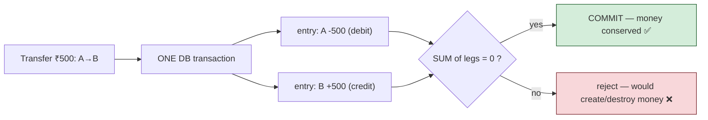
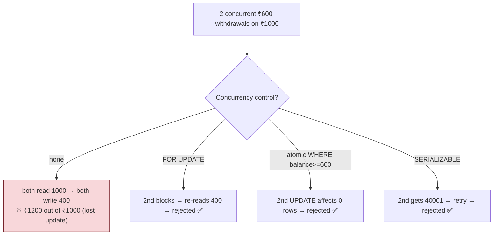

# 09 — Fintech Patterns (Ledgers, Idempotency, Double-Entry, Reconciliation)

> **Where this fits:** This is the capstone. Topics 1–8 taught Postgres *mechanics* — MVCC, isolation,
> locking, indexing, planning, vacuum, WAL, pooling. This topic assembles them into the **patterns that
> make money correct**: a double-entry ledger that can never lose a paisa, idempotency that survives
> retries and network failures, exactly-once balance updates under concurrency, and reconciliation that
> proves the books are right. This is *the* Zerodha-shaped topic — an exchange/broker is, at its core, a
> ledger with a matching engine bolted on. Get this right and you're demonstrating you can be trusted
> with real money.

---

## 0. The mental model (read this first)

A financial system is **a courtroom of record, not a cache.**

- Every rupee that moves must have a **provenance** — *where it came from and where it went* — that is
  immutable and auditable. You never "set the balance to 900"; you **record the event** "₹100 moved from
  A to B" and *derive* balances from events.
- The cardinal sin is **money created or destroyed out of thin air** — a debit without a matching
  credit, a payment applied twice, a balance updated on a request that the client also retried.
- Three forces constantly attack correctness: **concurrency** (two requests touch the same balance),
  **partial failure** (the network dies *after* the DB commit but *before* the client hears back), and
  **time** (long-running reports must see a consistent snapshot while writes pour in).
- Postgres gives you exactly the tools to beat all three: **double-entry** (structural balance),
  **idempotency keys** (retry-safe), **serializable isolation / row locks** (concurrency-safe), and
  **MVCC snapshots** (consistent reads). This chapter is how to wire them together.

The governing principle: **append immutable facts; derive state.** Never mutate history.

---

## 1. WHAT

The fintech data-correctness toolkit, all expressible in plain Postgres:

1. **Double-entry ledger** — every transaction is recorded as ≥2 entries that **sum to zero**: what
   leaves one account (debit) must arrive in another (credit). Balances are derived, and the invariant
   `SUM(all entries) = 0` is a continuous, checkable proof that no money was invented.
2. **Idempotency keys** — a client-supplied unique token per logical operation, stored with a `UNIQUE`
   constraint, so a retried request produces the **same** result instead of a duplicate side effect.
3. **Exactly-once balance mutation** — using row locks (`SELECT ... FOR UPDATE`) or `SERIALIZABLE`
   isolation so two concurrent debits can't both succeed on insufficient funds (no lost update / no
   negative balance).
4. **Reconciliation** — periodic batch jobs that re-derive balances from the immutable ledger and assert
   they match cached/expected values, catching any drift.
5. **The outbox pattern** — emit external events (Kafka, webhooks) atomically with the DB write, so you
   never "charge the card but lose the event" or vice versa.

---

## 2. WHY (the problems these solve)

| Failure you must prevent | How it happens | The pattern that stops it |
|---|---|---|
| Money created/destroyed | A debit recorded without its matching credit | **Double-entry** + `SUM = 0` invariant |
| Double charge / double payout | Client retries after a timeout; both hit the DB | **Idempotency key** (`UNIQUE`) |
| Negative balance / overdraft | Two concurrent withdrawals both read old balance | **`FOR UPDATE`** or **`SERIALIZABLE`** |
| Lost update | Read-modify-write race (Topic 2) | Row lock / serializable / atomic UPDATE |
| Dirty/inconsistent report | Long SUM sees a mid-flight transfer | **MVCC snapshot** (RR isolation, Topic 1–2) |
| "Charged but no event" | App crashes between DB commit and Kafka publish | **Transactional outbox** |
| Silent drift | A bug mis-posts once | **Reconciliation** detects & alerts |

The deep reason these matter more in fintech than in a typical CRUD app: **errors are not idempotent in
their consequences.** A duplicated "like" is annoying; a duplicated ₹50,000 withdrawal is a lawsuit. So
the bar is *provable* correctness, not "usually fine."

---

## 3. HOW (the patterns, with Postgres internals)

### 3.1 Double-entry ledger — the schema

The ledger is an **append-only** table of immutable entries. A transfer is **one transaction** that
inserts balanced rows summing to zero.

```sql
CREATE TABLE accounts (
    id            bigint PRIMARY KEY,
    -- 'balance' here is a CACHED/derived convenience column, source of truth is entries
    balance       numeric(20,4) NOT NULL DEFAULT 0,
    CONSTRAINT non_negative CHECK (balance >= 0)        -- DB-enforced overdraft guard
);

-- The immutable journal. NEVER UPDATE or DELETE rows here.
CREATE TABLE ledger_entries (
    id            bigserial PRIMARY KEY,
    txn_id        uuid        NOT NULL,                  -- groups the legs of one transfer
    account_id    bigint      NOT NULL REFERENCES accounts(id),
    amount        numeric(20,4) NOT NULL CHECK (amount <> 0),  -- +credit / -debit, never zero
    created_at    timestamptz NOT NULL DEFAULT now()
);
CREATE INDEX ON ledger_entries (account_id, created_at);
CREATE INDEX ON ledger_entries (txn_id);
```

A transfer of ₹500 from account 1 → account 2:

```sql
BEGIN;
  -- Two legs, summing to zero — the structural guarantee no money is invented.
  INSERT INTO ledger_entries (txn_id, account_id, amount) VALUES
    ('…uuid…', 1, -500),     -- debit source
    ('…uuid…', 2, +500);     -- credit destination
  -- Maintain the cached balances atomically in the SAME transaction.
  UPDATE accounts SET balance = balance - 500 WHERE id = 1;
  UPDATE accounts SET balance = balance + 500 WHERE id = 2;
COMMIT;
```

Why this is robust:
- **Atomicity (Topic 1/7):** both legs + both balance updates are in one transaction → all-or-nothing.
  If the transaction doesn't commit, crash recovery never makes its rows visible (it's aborted, not
  "replayed") — so you never see a half-written transfer.
- **The invariant is testable any time:** `SELECT SUM(amount) FROM ledger_entries;` must equal `0`
  globally. If it isn't, you have a bug — and you can *detect* it (§3.6).
- **Caveat & Implementation — DB-Enforced leg balancing:** 
  The raw DDL guarantees that no single ledger entry is `0`, but it does not prevent a buggy application from inserting a single-legged entry or a mismatched set (e.g., debiting ₹500 but only crediting ₹400). 
  
  To turn this from a *detectable* bug into a *prevented* database invariant, you can define a **Deferrable Constraint Trigger** that checks that the legs of each `txn_id` sum to zero at the moment of `COMMIT`:

  ```sql
  -- 1. Create a function to validate ledger leg conservation
  CREATE OR REPLACE FUNCTION enforce_ledger_leg_balance()
  RETURNS TRIGGER AS $$
  DECLARE
      v_sum numeric(20,4);
  BEGIN
      -- Calculate the sum of entries for the transaction ID being committed
      SELECT SUM(amount) INTO v_sum 
      FROM ledger_entries 
      WHERE txn_id = NEW.txn_id;

      IF v_sum <> 0 THEN
          RAISE EXCEPTION 'Ledger transaction % is unbalanced! Legs sum to %', 
              NEW.txn_id, v_sum;
      END IF;

      RETURN NEW;
  END;
  $$ LANGUAGE plpgsql;

  -- 2. Define the constraint trigger as DEFERRED (evaluated at COMMIT time)
  CREATE CONSTRAINT TRIGGER check_ledger_balance
  AFTER INSERT ON ledger_entries
  DEFERRABLE INITIALLY DEFERRED
  FOR EACH ROW
  EXECUTE FUNCTION enforce_ledger_leg_balance();
  ```
  *Why deferred?* Because during your transaction, you insert the legs one-by-one. If checked immediately, the first insert (e.g. `-₹500`) would fail. Deferring the check to `COMMIT` allows all legs to be inserted first. If the sum is not `0` at commit time, Postgres aborts the entire transaction. Mentioning this deferred trigger in interviews shows elite Postgres expertise.
- **Balances are derivable:** `SELECT SUM(amount) FROM ledger_entries WHERE account_id = 1;` recomputes
  the truth, so the cached `accounts.balance` can always be audited/rebuilt.



### 3.2 Concurrency: stopping the double-withdrawal (lost update)

Two requests withdraw ₹600 each from a ₹1000 account at the same time. Naive read-modify-write:
both read 1000, both think "enough!", both write 400 → **₹1200 withdrawn from ₹1000.** Classic
**lost update** (Topic 2). Three correct fixes:

**(a) Pessimistic — `SELECT … FOR UPDATE` (row lock, Topic 3):**
```sql
BEGIN;
  SELECT balance FROM accounts WHERE id = 1 FOR UPDATE;   -- locks the row
  -- second concurrent txn BLOCKS here until we commit, then re-reads fresh value
  -- app checks balance >= 600, then:
  UPDATE accounts SET balance = balance - 600 WHERE id = 1;
COMMIT;
```
The second transaction waits, then sees ₹400 and correctly rejects. Deterministic, easy to reason about.

**(b) Atomic conditional UPDATE — no app-side read at all (often best):**
```sql
UPDATE accounts SET balance = balance - 600
WHERE id = 1 AND balance >= 600;
-- Check rows-affected: 1 = success, 0 = insufficient funds. Atomic, race-free, lock held briefly.
```
This pushes the check into a single atomic statement — the row lock is held only for the UPDATE's
duration, and the `balance >= 600` predicate is evaluated on the *current* row. Highest throughput.

**(c) Optimistic — `SERIALIZABLE` (SSI, Topic 2):**
```sql
SET TRANSACTION ISOLATION LEVEL SERIALIZABLE;
-- read balance, decide, write; on conflict Postgres raises serialization_failure (SQLSTATE 40001)
-- → application RETRIES the whole transaction.
```
Best when logic is complex/multi-row; you must implement a **retry loop** on `40001`.



**Deadlock avoidance (Topic 3):** When a transaction locks *multiple* rows (e.g. both the sender and receiver accounts), always acquire the locks in a **consistent global order** (e.g., ascending `account_id`) so two concurrent transfers cannot deadlock.

##### Concrete Example: Why Unordered Locks Deadlock
Suppose User 1 (ID: 10) transfers money to User 2 (ID: 20), while User 2 simultaneously transfers money to User 1.

* **Without Ordering (Naive):**
  * **Txn A (10 → 20):** Locks ID 10 first.
  * **Txn B (20 → 10):** Locks ID 20 first.
  * **Txn A:** Tries to lock ID 20 → blocks (waiting for Txn B).
  * **Txn B:** Tries to lock ID 10 → blocks (waiting for Txn A).
  * **Result:** **Deadlock 💥**. Postgres detects this after a second and aborts one of them, but this hurts throughput and latency.

* **With Ordering (Sorting by ID):**
  The application logic sorts the account IDs: `low = min(from, to)`, `high = max(from, to)`. Both transactions are forced to lock the lower ID first:
  * **Txn A (10 → 20):** Tries to lock ID 10. Succeeds.
  * **Txn B (20 → 10):** Tries to lock ID 10. **Blocks** (waiting for Txn A).
  * **Txn A:** Locks ID 20. Succeeds. Completes updates and commits, releasing both locks.
  * **Txn B:** Unblocks, locks ID 10, then locks ID 20. Completes safely.
  * **Result:** No deadlock, queries execute cleanly in sequence.

⚠️ **Implementation Gotcha:** A single query like `SELECT * FROM accounts WHERE id IN (10, 20) FOR UPDATE` does **not** guarantee locking in sorted order. Postgres locks rows as it encounters them in the execution plan (e.g., via physical sequence on disk), which can happen before sorting. 

To guarantee correct locking order, lock the accounts in **separate, sequential statements** ordered by the application code:
```sql
-- Computed by app: lo_id = 10, hi_id = 20
SELECT 1 FROM accounts WHERE id = 10 FOR UPDATE;
SELECT 1 FROM accounts WHERE id = 20 FOR UPDATE;
```

### 3.3 Idempotency — surviving retries and the "lost ack" problem

The nastiest distributed-systems failure: your app **commits** the payment, then the network drops the response. The client times out and **retries the same logical payment**. Without protection, you pay twice.

**The Fix:** The client generates a unique token (an idempotency key) for the transaction and sends it to the server. The server stores this key inside a `UNIQUE` index within the same database transaction.

##### Concrete Example: Frontend & HTTP Header Flow
1. **Frontend (User clicks "Pay"):**
   The browser/app generates a unique UUID *at the moment of the click* (not on page load):
   ```javascript
   // Frontend JS
   const idempotencyKey = crypto.randomUUID(); // e.g. "9b1deb4d-3b7d-4bad-9bdd-2b0d7b3dcb6d"
   await fetch("/api/v1/transfers", {
       method: "POST",
       headers: {
           "Content-Type": "application/json",
           "Idempotency-Key": idempotencyKey
       },
       body: JSON.stringify({ from: 1, to: 2, amount: 500 })
   });
   ```
2. **HTTP Request Headers:**
   ```http
   POST /api/v1/transfers HTTP/1.1
   Host: api.bank.com
   Idempotency-Key: 9b1deb4d-3b7d-4bad-9bdd-2b0d7b3dcb6d
   Content-Type: application/json
   ```

##### Schema & Database Setup
```sql
CREATE TABLE idempotency_keys (
    key          uuid PRIMARY KEY,
    txn_id       uuid NOT NULL,
    response     jsonb,                       -- cached result to replay on retry
    created_at   timestamptz NOT NULL DEFAULT now()
);

-- Inside the payment transaction:
BEGIN;
  INSERT INTO idempotency_keys (key, txn_id) VALUES ('9b1deb4d-3b7d-4bad-9bdd-2b0d7b3dcb6d', '…txn_uuid…');
  -- If this is a RETRY, the INSERT hits a UNIQUE violation (SQLSTATE 23505) -> retry logic catches this.
  
  ... do the ledger inserts + balance updates ...
  
  -- Persist the result so a later retry can replay it WITHOUT redoing the money move:
  UPDATE idempotency_keys 
  SET response = '{"status":"success","txn_id":"…txn_uuid…"}'::jsonb
  WHERE key = '9b1deb4d-3b7d-4bad-9bdd-2b0d7b3dcb6d';
COMMIT;
```

##### Handling the Retry: Two Backend Strategies

1. **Single-Transaction Design (Simple):**
   When the `INSERT` throws `23505` (unique violation), the backend rolls back the transaction and runs:
   ```sql
   SELECT response FROM idempotency_keys WHERE key = :key;
   ```
   * **Timing Benefit:** Because the key was inserted in the same transaction, a concurrent retry's insert will **block** on the unique index lock until the original transaction commits or rolls back. Once the lock is released, the retry fails with `23505`, and the `response` is guaranteed to be fully committed and readable.

2. **Upfront Key Reservation (For long-running tasks):**
   If the transaction takes a long time, holding the lock open is dangerous. Instead, you register the key in an independent transaction first:
   * **Txn 1:** `INSERT INTO idempotency_keys (key, response) VALUES (:key, NULL);` (Commits immediately)
   * **Txn 2:** Executes long money movement. When done, updates `response` to its finished value.
   * **The Retry Check:** If a retry arrives while **Txn 2** is still in flight, the query for the key returns `response IS NULL`. The backend knows the original request is still running and returns **`409 Conflict`** (or `"Processing, try again later"`) instead of duplicate execution or crashing.
   * **Timing Benefit:** Prevents concurrent duplicate requests from running at the same time. If the first transaction crashed and left it `NULL` permanently, a reaper worker times out the key and deletes it so the client can try again.

```mermaid
sequenceDiagram
    participant C as Client
    participant S as Service
    participant DB as Postgres
    C->>S: POST /transfer (Idempotency-Key: K1)
    S->>DB: BEGIN; INSERT idempotency_keys(K1); move money; COMMIT
    DB-->>S: committed ✅
    S--xC: response LOST (network drop)
    C->>S: RETRY same request (Idempotency-Key: K1)
    S->>DB: INSERT idempotency_keys(K1) → 23505 UNIQUE violation
    DB-->>S: duplicate!
    S-->>C: return ORIGINAL stored response (money moved ONCE) ✅
```

Why the `UNIQUE` constraint and not "check if exists then insert"? Because **check-then-insert is itself
a race** (two retries arriving simultaneously both pass the check). The unique index makes the database
the single arbiter — exactly **one** insert wins, atomically. This is the same "let the DB enforce it"
principle as the atomic conditional UPDATE in §3.2.

### 3.4 The transactional outbox — atomic DB write + event emission

You often must both (a) move money in Postgres **and** (b) publish an event to Kafka (for downstream: notifications, analytics, settlement). You **cannot** atomically write to two systems — if you commit the DB then crash before publishing, the event is lost; publish first then crash, you emitted a phantom event.

**Outbox pattern:** Write the event payload into a local `outbox` table *in the same transaction* as the money movement. A separate outbox relay reads this table and publishes to Kafka.

```sql
CREATE TABLE outbox (
    id          bigserial PRIMARY KEY,
    aggregate   text NOT NULL,
    payload     jsonb NOT NULL,
    created_at  timestamptz NOT NULL DEFAULT now(),
    published   boolean NOT NULL DEFAULT false
);

BEGIN;
  -- 1. Ledger debit & credit inserts
  -- 2. Balance updates
  -- 3. Atomic Outbox Insert:
  INSERT INTO outbox (aggregate, payload) VALUES (
      'transfer', 
      jsonb_build_object(
          'event_id', gen_random_uuid(),
          'type', 'money_moved',
          'from_account', 10,
          'to_account', 20,
          'amount', 500.00
      )
  );
COMMIT;       -- DB change and the intent-to-publish commit atomically
```

#### How the Outbox Relay works in production
A background worker polls the outbox table. To prevent multiple workers from picking up the same event or blocking each other, use **`FOR UPDATE SKIP LOCKED`**:

```sql
-- Safe, high-concurrency event polling
BEGIN;
  SELECT * FROM outbox 
  WHERE published = false 
  ORDER BY id 
  LIMIT 100 
  FOR UPDATE SKIP LOCKED; -- Locks rows, but skips any rows already being processed by other workers

  -- (Application sends the payloads to Kafka...)

  -- Mark them as published inside the transaction
  UPDATE outbox SET published = true WHERE id IN (...list of IDs...);
COMMIT;
```

---

### 3.5 Consistent reporting — MVCC for end-of-day sums

A reconciliation report runs `SELECT SUM(balance)` for 30 seconds while trades commit continuously. Thanks to **MVCC (Topic 1)**, a `REPEATABLE READ` transaction takes **one snapshot** and sees a single point-in-time view — the report is internally consistent (no half-applied transfer), and it **doesn't block** the write path.

##### Concrete Step-by-Step Scenario:
* **Initial State:** Account A has ₹1000. Account B has ₹0. Total sum = ₹1000.
* **12:00:00 PM:** EOD Report starts:
  ```sql
  BEGIN ISOLATION LEVEL REPEATABLE READ;
  ```
  Postgres captures a snapshot. The report starts scanning ledger rows to compute the sum.
* **12:00:10 PM:** A concurrent transaction transfer starts:
  ```sql
  BEGIN;
    UPDATE accounts SET balance = balance - 200 WHERE id = A;
    UPDATE accounts SET balance = balance + 200 WHERE id = B;
  COMMIT;
  ```
  This transaction commits successfully. Account A now has ₹800, Account B has ₹200.
* **12:00:20 PM:** The EOD Report finishes scanning and sums the accounts.
  * **Result:** Under `REPEATABLE READ`, the report query completely ignores the commit from 12:00:10 PM because it happened *after* the 12:00:00 PM snapshot.
  * The report reads A = ₹1000, B = ₹0. Total sum = ₹1000 (correct).
  * If the report had run under `READ COMMITTED` (the default), it might have read A *after* the update (₹800) but B *before* the update (₹0), resulting in a corrupted total sum of ₹800.

---

### 3.6 Reconciliation — proving the books

Even with all the above, a bug could mis-post once. Reconciliation is the **continuous proof**:

```sql
-- (1) Global invariant: all entries must net to zero. Anything else = money invented/destroyed.
SELECT SUM(amount) AS should_be_zero FROM ledger_entries;

-- (2) Cached vs derived: the convenience column must match the journal-derived truth.
SELECT a.id, a.balance AS cached,
       COALESCE(SUM(le.amount), 0) AS derived,
       a.balance - COALESCE(SUM(le.amount), 0) AS drift
FROM accounts a
LEFT JOIN ledger_entries le ON le.account_id = a.id
GROUP BY a.id, a.balance
HAVING a.balance <> COALESCE(SUM(le.amount), 0);     -- rows here = ALERT
```

Run it on a read replica (Topic 8) under `REPEATABLE READ`. Any nonzero result pages an engineer.
Because the ledger is immutable and append-only, you can always **rebuild** the cached balances from it.

---

### 3.7 Money type, precision & time — the silent killers

* **Never use `float`/`double` (floating point) for money.**
  Binary floating-point types (`float8`, `double precision`) cannot represent decimal fractions exactly. Over millions of calculations, these tiny rounding errors accumulate, causing balance discrepancies.
  
  ```sql
  -- ❌ Floating Point Error (returns false!)
  SELECT (0.1::float8 + 0.2::float8) = 0.3::float8; -- Result is 0.30000000000000004
  
  -- ✅ Numeric Type (returns true!)
  SELECT (0.1::numeric + 0.2::numeric) = 0.3::numeric; -- Result is exactly 0.3
  ```
  *Use `numeric(p,s)` (exact decimal) or store money in **minor units** (e.g. store paise/cents as `bigint`).*

* **`timestamptz`, never `timestamp`:**
  Always store time with timezone. This forces Postgres to convert timestamps to UTC internally. Comparing plain `timestamp` values across servers in different time zones leads to audit and settlement transaction discrepancies.
  
* **Enforce invariants in the DB, not just the app:**
  `CHECK (balance >= 0)`, `UNIQUE` on idempotency keys, `NOT NULL`. Application-layer checks are subject to race conditions; constraints are evaluated atomically by Postgres. The database is your last line of defense.
  
* **Append-only + partitioning (Topic 6/8):**
  The ledger only ever grows; partition by month/date and **archive/drop** old partitions instead of running slow `DELETE` queries. This avoids vacuum bloat, enables partition pruning, and makes data retention cheap.

---

## 4. CODE / SQL — a complete, race-safe transfer

```sql
-- Idempotent, concurrency-safe, double-entry transfer in one transaction.
-- Inputs: :key (idempotency uuid), :from, :to, :amt, :txn (uuid)
BEGIN;

  -- 1. Idempotency guard — duplicate retry trips the UNIQUE PK and we bail out.
  INSERT INTO idempotency_keys (key, txn_id) VALUES (:key, :txn);
  --   on 23505 → ROLLBACK and return the cached/original response (handled in app)

  -- 2. Lock the two accounts in a DETERMINISTIC order to avoid deadlock (Topic 3).
  --    Lock lowest id FIRST, in SEPARATE statements — a single "IN (...) ORDER BY id FOR UPDATE"
  --    does NOT guarantee lock-acquisition order (rows are locked as fetched, before the sort).
  --    (:lo = least(:from,:to), :hi = greatest(:from,:to) — computed by the app.)
  SELECT 1 FROM accounts WHERE id = :lo FOR UPDATE;
  SELECT 1 FROM accounts WHERE id = :hi FOR UPDATE;

  -- 3. Atomic debit with sufficiency check — 0 rows affected ⇒ insufficient funds.
  UPDATE accounts SET balance = balance - :amt
   WHERE id = :from AND balance >= :amt;
  --   app verifies ROW_COUNT = 1, else ROLLBACK with 'insufficient funds'

  -- 4. Credit the destination.
  UPDATE accounts SET balance = balance + :amt WHERE id = :to;

  -- 5. Append the immutable double-entry legs (sum to zero).
  INSERT INTO ledger_entries (txn_id, account_id, amount) VALUES
    (:txn, :from, -:amt),
    (:txn, :to,   +:amt);

  -- 6. Emit the event atomically with the money move (outbox).
  INSERT INTO outbox (aggregate, payload)
    VALUES ('transfer', jsonb_build_object('txn', :txn, 'from', :from, 'to', :to, 'amt', :amt));

COMMIT;
-- WAL fsync makes this durable (Topic 7); MVCC let readers run throughout (Topic 1).
```

```sql
-- The two invariants a reconciliation job asserts continuously:
SELECT SUM(amount) FROM ledger_entries;                         -- = 0  (global)
-- per-account cached vs derived drift (should return no rows):
SELECT a.id FROM accounts a
LEFT JOIN ledger_entries le ON le.account_id = a.id
GROUP BY a.id, a.balance
HAVING a.balance <> COALESCE(SUM(le.amount),0);
```

---

## 5. INTERVIEW ANGLES

**Q: Design a money-transfer system on Postgres. How do you guarantee no money is lost or created?**
A: Double-entry ledger: each transfer is one transaction inserting ≥2 immutable entries that sum to
zero, plus atomic balance updates. The invariant `SUM(ledger_entries.amount)=0` is continuously
checkable. Atomicity (WAL) makes legs all-or-nothing; reconciliation re-derives balances from the
immutable journal to detect any drift.

**Q: Two withdrawals hit the same account at once. How do you prevent overdraft / lost update?**
A: Either `SELECT … FOR UPDATE` to serialize on the row, or — better — an atomic
`UPDATE … SET balance = balance - x WHERE id = ? AND balance >= x` and check rows-affected, or
`SERIALIZABLE` with a retry loop on `40001`. The atomic conditional UPDATE is race-free and holds the
lock briefly.

**Q: A client retries a payment after a timeout. How do you avoid double-charging?**
A: Idempotency key — client sends a UUID per logical operation; insert it under a `UNIQUE` constraint in
the same transaction as the effect. The retry hits a `23505` duplicate; we return the original stored
response. The unique index (not check-then-insert) is what makes it race-safe.

**Q: You must move money AND publish a Kafka event. How do you make that atomic?**
A: You can't 2-phase-commit across Postgres and Kafka cheaply, so use the **transactional outbox**:
write the event into an `outbox` table in the same DB transaction; a relay (poller or Debezium reading
WAL) publishes it at-least-once; consumers dedupe by event id → exactly-once *effect*. The dedup check
and the side effect must be in the **same transaction / same store**, or the double-apply race returns.

**Q: A 30-second EOD report runs while trades commit. Consistent? Does it block writes?**
A: Run it in `REPEATABLE READ` — MVCC gives it one frozen snapshot, so it's internally consistent
(no half-transfer) and, because readers don't block writers, it never stalls the trading path. Ideally
run it on a read replica.

**Q: Why `numeric` and not `float` for money?**
A: Binary floating point can't represent decimal fractions exactly (`0.1+0.2≠0.3`), so sums drift over
millions of rows → reconciliation breaks. Use `numeric` (exact) or integer minor units (paise).

**Q: Where do you enforce "balance can't go negative"?**
A: Two distinct mechanisms, don't conflate them. The **concurrency control** is the atomic
`UPDATE … WHERE balance >= :amt` (or `FOR UPDATE`) — the implicit row write-lock serializes concurrent
debits so the check sees a fresh value. The `CHECK (balance >= 0)` is a **last-resort invariant**: it
guarantees no committed row is ever negative regardless of app bugs, but it does *not* by itself prevent
a lost update (it only rejects a negative *result*). Use both: the conditional UPDATE for correctness
under concurrency, the CHECK as the constraint that can't be bypassed by a buggy deploy.

**Q: How do you keep the ledger from bloating / how do you retain years of history?**
A: Append-only + **partition by date** (Topic 6/8); archive or drop old partitions instead of `DELETE`
(no vacuum bloat, fast pruning). The journal is immutable, so cached balances can always be rebuilt.

**Q: How do you avoid deadlocks when a batch touches many accounts?**
A: Acquire row locks in a **consistent global order** (e.g., ascending `account_id`) so cyclic waits
can't form (Topic 3). Set `lock_timeout` and `deadlock_timeout` as guardrails.

---

## 6. ONE-LINE RECALL CARDS

- **Append immutable facts; derive state.** Ledger is append-only; never UPDATE/DELETE history.
- **Double-entry:** every txn = balanced legs summing to **0** → `SUM(entries)=0` is a continuous correctness proof.
- **Lost update fix:** `FOR UPDATE`, or atomic `UPDATE … WHERE balance>=x` (check rows-affected), or `SERIALIZABLE`+retry on `40001`.
- **Idempotency key** under a `UNIQUE` constraint (not check-then-insert) makes retries safe; `23505` ⇒ return original response.
- **Transactional outbox:** write event + money in one txn; relay/Debezium publishes at-least-once; consumers dedupe → exactly-once.
- **Reporting:** `REPEATABLE READ` snapshot (MVCC) = consistent + non-blocking; run on a read replica.
- **Reconciliation:** assert `SUM=0` and cached-balance == derived-balance; alert on drift; rebuild from journal.
- **Money type:** `numeric`/integer minor units, **never float**. Time: `timestamptz` (UTC).
- **Enforce invariants in the DB** (`CHECK`, `UNIQUE`, `NOT NULL`) — app checks race, constraints don't.
- **Lock accounts in consistent id order** to avoid deadlocks; partition the ledger by date and drop old partitions (no bloat).

→ **Back to:** [PostgreSQL Index](index.md) — you've now covered storage/MVCC, isolation, locking,
indexing, query planning, vacuum, WAL/replication, pooling/scale, and fintech patterns end-to-end.
