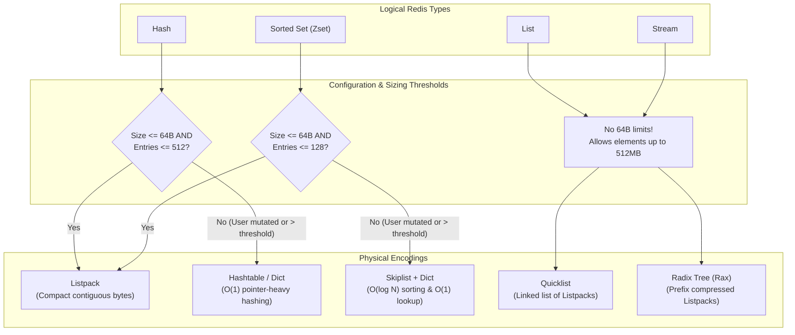
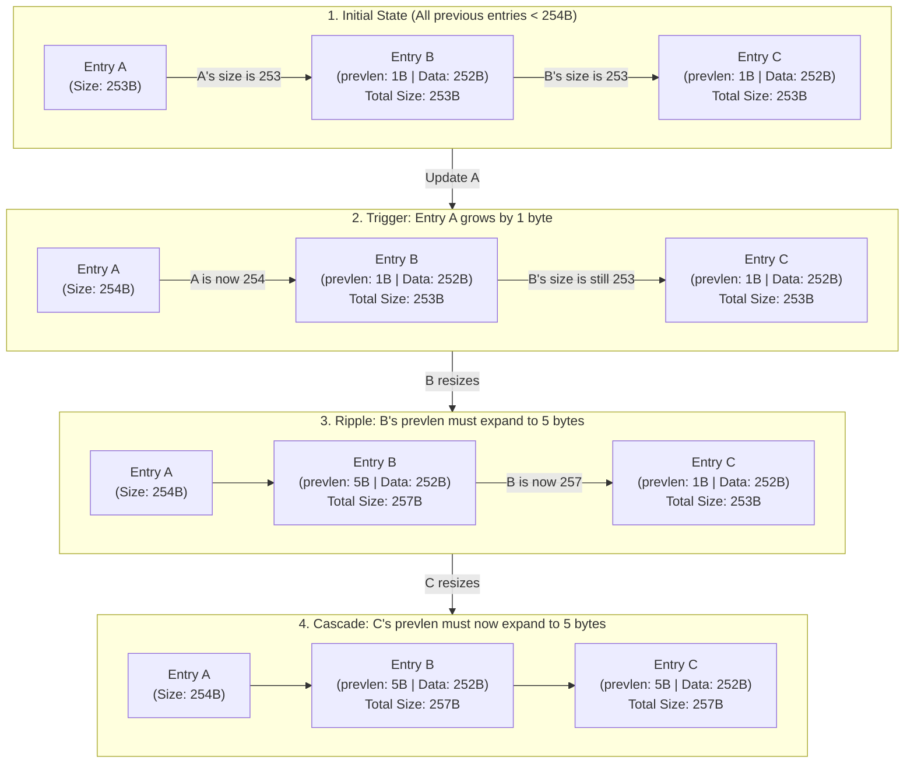
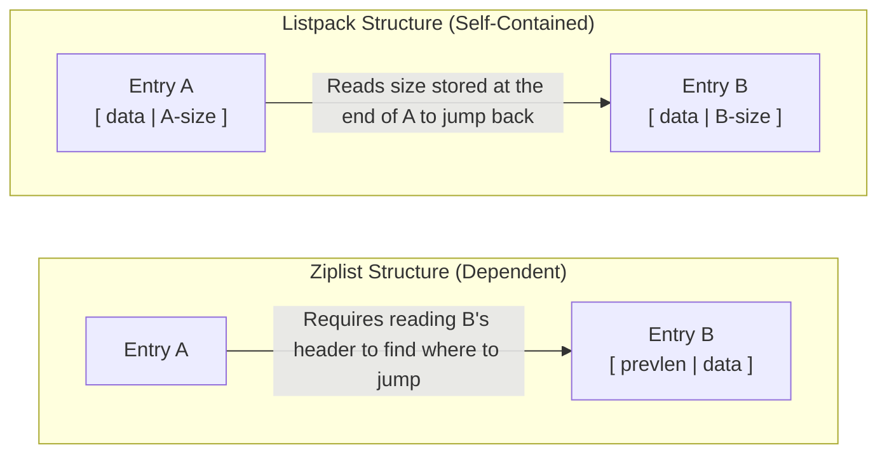

# 01 — Data Structures & Internal Encodings

> **Why this is Topic 1:** Redis is an in-memory store. At Zerodha's scale (streaming millions of market ticks per second, managing active user sessions, and enforcing order rate limits), memory is the primary resource constraint and cost driver. Choosing the right logical data structure and understanding its physical internal representation (encoding) determines whether your cache consumes 2GB or 20GB of RAM. The interviewer will grill you on how Redis saves memory (e.g., `listpack` vs `ziplist`, `embstr` vs `raw`), why `skiplist` is chosen over B-Tree/Red-Black Tree for sorted sets, and how incremental rehashing works without blocking the single-threaded event loop.

---

## 1. WHAT

Redis separates its user-facing **logical data types** from their physical **internal encodings**. This separation allows Redis to change its memory representation dynamically behind the scenes. For instance, a small hash is represented as a compact serialized array (`listpack`) to optimize memory and cache locality, but it automatically upgrades to a hash table (`hashtable`) when it grows too large.

Every key in Redis points to a `redisObject` (internally `robj`), which wraps the actual data structure and stores critical metadata:

```c
typedef struct redisObject {
    unsigned type:4;          /* Logical type (string, hash, list, set, zset, stream) */
    unsigned encoding:4;      /* Physical internal encoding */
    unsigned lru:24;          /* LRU time or LFU frequency metadata (eviction) */
    int refcount;             /* Reference count for memory management */
    void *ptr;                /* Pointer to the physical data structure */
} robj;
```

### The Type-Encoding Matrix (Modern Redis 7+)

| Logical Type | Physical Encodings (`OBJECT ENCODING`) | Threshold for Upgrade / Transition |
| :--- | :--- | :--- |
| **String** | `int`, `embstr`, `raw` | Integer check -> `int`. Len <= 44B -> `embstr`. Len > 44B -> `raw`. |
| **List** | `listpack`, `quicklist` | A small list is a single `listpack`; it converts to a `quicklist` (doubly linked list of `listpack` nodes) once it exceeds `list-max-listpack-size`. |
| **Hash** | `listpack`, `hashtable` | Upgrades to `hashtable` if entries > `hash-max-listpack-entries` (512) or any value > `hash-max-listpack-value` (64 bytes). |
| **Set** | `intset`, `listpack`, `hashtable` | All-integer & ≤ `set-max-intset-entries` (512) → `intset`. Small non-integer (≤ `set-max-listpack-entries` 128, values ≤ `set-max-listpack-value` 64B) → `listpack` (since 7.2). Exceed either limit → `hashtable`. |
| **Zset** | `listpack`, `skiplist` | Upgrades to `skiplist` if entries > `zset-max-listpack-entries` (128) or any value > `zset-max-listpack-value` (64 bytes). |
| **Stream** | `stream` | Radix Tree (`rax`) containing nodes packed with `listpack`s. |

> **Version note:** the thresholds above are **Redis 7.x** defaults. `hash-max-listpack-entries` was
> raised from **128 (Redis 6.x)** to **512 (7.x)**; pre-7.0 the compact encoding was called `ziplist`
> (not `listpack`) and lists/sets had no `listpack` encoding. If the deployment is on 6.x, expect 128.

### Logical to Physical Encoding & Upgrade Paths
The following diagram illustrates how Redis routes logical data types to compact or standard physical representations based on sizing thresholds and configuration. Notice that **Lists** and **Streams** bypass the default 64-byte limits and always route through Quicklists and Radix Trees:



---

## 2. WHY (the problem it solves)

Standard programming language data structures (like standard C++ `std::map`, Java `HashMap`, or Python `dict`) are not designed for extreme memory efficiency or network performance. They suffer from:

1. **Memory Overhead (Pointer Chasing & Fragmentation):** In a 64-bit OS, a single pointer costs 8 bytes. A doubly linked list node needs 16 bytes just for pointers (`prev` and `next`), plus heap allocator (`jemalloc`) padding. Redis offsets this with contiguous memory layouts (like `listpack` and `intset`) that use offsets instead of pointers.
2. **CPU Cache Misses (Pointers vs. Contiguous Arrays):**
   * **The Problem:** The CPU reads memory from RAM in chunks of **64 bytes** (called a **Cache Line**) and stores it in the fast L1/L2 CPU cache.
   * **Pointer-heavy structures (e.g., standard linked list/tree):** Nodes are scattered randomly in memory. When the CPU jumps from Node A (address `1000`) to Node B (address `8000`), the cache line from `1000` is useless. The CPU must wait for RAM to fetch a new cache line at `8000` (**Cache Miss** — slow: ~100-200 cycles).
     * *Analogy:* Like a scavenger hunt where every clue is in a different room in the house, forcing you to walk (wait) between each step.
   * **Contiguous arrays (e.g., Listpack/Intset):** Elements are packed adjacent in memory. Fetching Element A automatically loads Elements B, C, and D into the same 64-byte Cache Line (**Cache Hit** — fast: ~1-3 cycles).
     * *Analogy:* Like reading a book page-by-page. The next sentence is already right under your eyes.
3. **Latency Spikes during Reallocation (Standard vs. Incremental Rehashing):**
   * **The Problem:** Resizing a standard hash table from 1 million to 2 million buckets normally requires a stop-the-world loop that hashes and moves all 1 million keys at once. For 5 million keys, this takes 20-50ms, causing a massive latency spike and blocking the server thread.
     * *Analogy (The Naive Way):* Closing your supermarket for 2 days to move all 10,000 product boxes to a larger building next door. Customers cannot buy anything during this downtime.
   * **The Solution (Incremental Rehashing):** Redis allocates the larger table alongside the old one. Every time a client sends a command (e.g., `SET key1 value1`), Redis performs a tiny rehashing step: it migrates all keys in **just one bucket index** (tracked by `rehashidx`), increments `rehashidx`, and then executes the client's command.
     * *Analogy (The Redis Way):* Keeping the store open. Every time a customer walks in to buy an item, you carry exactly **1 box** to the new building before serving them. The move is split into tiny, unnoticeable microsecond fractions across millions of customer visits.

---

## 3. HOW (the internals — this is what gets you the offer)

### 3.1 Simple Dynamic Strings (SDS)
Redis does not use standard null-terminated C strings (`char*`) because finding their length is an `O(N)` operation and they are not binary-safe (cannot contain `\0`). Instead, Redis uses **Simple Dynamic Strings (SDS)**:

```c
struct __attribute__ ((__packed__)) sdshdr8 {
    uint8_t len;         /* Number of bytes currently used (O(1) length lookup) */
    uint8_t alloc;       /* Allocated space excluding header and null terminator */
    unsigned char flags; /* 3 least significant bits are header type (sdshdr5/8/16/32/64) */
    char buf[];          /* Flexible array member containing the actual string data */
};
```
*Note: `__attribute__ ((__packed__))` prevents compiler padding, allowing Redis to directly access `flags` at `buf[-1]`, saving critical bytes.*

#### Detailed Fields & Purpose:
1. **`len` (Used Length):**
   * **O(1) Length:** Storing the length explicitly makes `STRLEN` an $O(1)$ operation, whereas standard C strings require scanning character-by-character until a null terminator `\0` is found ($O(N)$).
   * **Binary Safety:** Standard C strings interpret `\0` as the end of the string, making them unable to hold raw binary data like images, audio files, or serialized payloads containing `\0`. SDS relies on the `len` field to track boundaries, enabling it to store arbitrary binary data safely.
2. **`alloc` (Total Capacity):**
   * **Avoids Reallocations:** When modifying a string, Redis checks if the remaining capacity (`alloc - len`) is enough. If so, it appends in-place without requesting new heap memory.
   * **Memory Allocation Policies:** When growing, SDS pre-allocates extra space (e.g., doubles the size for allocations $< 1$ MB) to make future appends $O(1)$ amortized. When shrinking, SDS does not immediately free space (lazy freeing), preserving it for future growth.
3. **`flags` (SDS Type Header):**
   * **Granular Header Sizing:** To save memory, SDS uses different headers depending on string size. The `flags` byte indicates which header type is active:
     * `sdshdr5` (under 32 bytes): Packs string length *inside* the 5 remaining bits of the `flags` byte itself, resulting in a **0-byte** overhead for `len` and `alloc` fields!
     * `sdshdr8` (under 256 bytes): Uses 1 byte for `len` and 1 byte for `alloc` (header = 3 bytes total).
     * `sdshdr16` / `sdshdr32` / `sdshdr64`: Scale up to use 16-bit, 32-bit, or 64-bit size variables for huge strings.
   * **Metadata Backtracking (`buf[-1]`):** In Redis C code, functions receive a pointer straight to the string buffer `buf[]` (`char*`). To fetch the metadata, Redis inspects `buf[-1]` (which is exactly where `flags` resides due to packing). Once it reads `flags`, it knows the header type and can jump back by the exact size of that header to read `len` and `alloc`.

#### 3.1.1 `embstr` vs `raw` Memory Layouts
Understanding how `embstr` saves memory is a common test of depth:

*   **`embstr` (Contiguous):** The `redisObject` header and the SDS struct are allocated as a **single block** of contiguous memory.
*   **`raw` (Fragmented):** Two separate memory allocations are made—one for the `redisObject` and one for the SDS struct.

```
[embstr Layout - Single 64-byte block]
+------------------------------+------------------------------------+
| redisObject Header (16 bytes)| sdshdr8 + String + \0 (48 bytes)  |
+------------------------------+------------------------------------+
^ Allocated as one piece by jemalloc

[raw Layout - Two separate blocks]
+------------------------------+       +------------------------------------+
| redisObject Header (16 bytes)| ----> | sdshdr8 + String + \0 (> 48 bytes) |
+------------------------------+       +------------------------------------+
^ Jemalloc Allocation #1               ^ Jemalloc Allocation #2
```

#### Why is the threshold for `embstr` exactly 44 bytes?

To understand this, think of the memory allocator (**`jemalloc`**) as a shipping service that only sells fixed-sized boxes. For small items, the most efficient box size it offers is exactly **64 bytes**.

If Redis can pack everything about a string key into a single 64-byte box, it does so (`embstr`). If not, it has to use two separate boxes (`raw`).

Here is a visual breakdown of what we need to pack into that 64-byte box:

```
+---------------------------------------------------------------------------------------+
|                                    TOTAL: 64 Bytes                                    |
+--------------------------------+--------------------+--------------------------+------+
|      redisObject Header        |   sdshdr8 Header   |   Actual String Value    |  \0  |
|           (16 Bytes)           |     (3 Bytes)      |   (Maximum: 44 Bytes)    | (1B) |
+--------------------------------+--------------------+--------------------------+------+
\_______________________________/ \_____________________________________________________/
        Part 1: Wrapper                      Part 2: SDS String Structure (48 Bytes)
```

##### 1. The Math Breakdown:
*   **Wrapper (`redisObject`):** Every key in Redis needs a metadata wrapper. This wrapper takes exactly **`16 bytes`**.
*   **SDS String Header (`sdshdr8`):** The Simple Dynamic String metadata (length, capacity, flags) takes exactly **`3 bytes`** (`len` is 1B, `alloc` is 1B, `flags` is 1B).
*   **Null Terminator (`\0`):** To remain compatible with standard C libraries, the string must end with a null byte, taking **`1 byte`**.
*   **Total Metadata Overhead:** $16 + 3 + 1 = 20\text{ bytes}$.
*   **Leftover space for actual text:** $64\text{ bytes (Box size)} - 20\text{ bytes (Overhead)} = \mathbf{44\text{ bytes}}$.

##### 2. What happens if the string is 45 bytes?
If your string is 45 bytes, the total space required is:
$$\text{Overhead } (20\text{B}) + \text{String } (45\text{B}) = 65\text{ bytes}$$

Since $65\text{ bytes}$ is larger than the $64\text{ byte}$ jemalloc box, it cannot fit. 

Instead of letting the block spill over into a larger single allocation (which is less memory-efficient and harder to align), Redis splits it into **two separate allocations** (switching the encoding to **`raw`**):
1. **Allocation #1:** A `16-byte` block just for the `redisObject` header.
2. **Allocation #2:** A `64-byte` block containing the SDS Header + 45-byte string + null terminator (totaling 49 bytes, which fits inside a 64-byte block).

**Why `embstr` is preferred:** Because allocating **1 contiguous block** is twice as fast as allocating **2 separate blocks** (1 malloc call vs. 2) and keeps the data right next to the header in CPU memory, avoiding a pointer-chasing CPU cache miss.

---

### 3.2 Listpack vs Ziplist (Solving the Cascading Update Vulnerability)
Historically, Redis used a structure called **Ziplist** to represent small lists, hashes, and zsets. Ziplist stored entries as:
`[prevlen] [encoding] [entry-data]`

*   **`prevlen`**: Stored the length of the previous entry to allow backward traversal.
    *   **1-byte mode:** If the previous entry was $< 254$ bytes, `prevlen` occupied exactly `1 byte` to directly store that length. This is an extreme optimization for the common case of small keys/values.
    *   **5-byte mode:** If the previous entry was $\ge 254$ bytes, the first byte of `prevlen` was set to a special flag byte **`254` (`0xFE`)**, indicating that the actual length was stored in the following `4 bytes` (representing a 32-bit unsigned integer, capable of describing lengths up to 4 GB).
*   **The Cascading Update Vulnerability:** If you had multiple consecutive entries that were each exactly 253 bytes long, each of their `prevlen` fields occupied exactly 1 byte. If you mutated the very first entry such that its size grew to 254 bytes:
    1. The second entry's `prevlen` now had to store `254`.
    2. Since $254 \ge 254$, the second entry's `prevlen` field had to grow from 1 byte to 5 bytes (a 4-byte increase).
    3. This expansion increased the total size of the second entry from 253 bytes to 257 bytes.
    4. Consequently, the third entry's `prevlen` (which stores the second entry's size) now had to store `257`.
    5. Since $257 \ge 254$, the third entry's `prevlen` also had to grow from 1 byte to 5 bytes, and so on.
    This caused a chain reaction of reallocations and memory copies across the entire contiguous Ziplist, blocking the single event-loop thread.



#### The Modern Replacement: Listpack
Redis 7 completely replaced Ziplists with **Listpack**. A Listpack structure stores entries as:
`[encoding-type] [element-data] [element-tot-len]`

```
+--------------------------------------------------------------+
| lpbytes (32b) | lplen (16b) | Entry 1 | Entry 2 | lpend (8b) |
+--------------------------------------------------------------+
                              /         \
   +-------------------------------------------------+
   | encoding-type | element-data | element-tot-len  |
   +-------------------------------------------------+
```

*   **`element-tot-len` (Self-contained back-pointer):** Stored at the *end* of the entry itself. It contains the total size of its own entry (not the previous one). It is encoded as a variable-length integer (7 bits per byte, read right-to-left, with the MSB indicating continuation).
*   **Preventing Cascading Updates:** Since an entry's encoding does not store metadata about other entries, mutating a node *never* cascades. To traverse backward, Redis reads the end of the previous entry, parses `element-tot-len` backwards, and jumps back to its start.



#### Why Listpack Supports Up to 4 GB (Even with 64-Byte Defaults)
If Redis types upgrade to hashtables or skiplists at a 64-byte threshold, why does Listpack still support 4 GB entries?
1. **User Configurability:** The 64-byte limits are customizable. A user can set `hash-max-listpack-value` to 100 KB or more to save RAM. The underlying engine must support this.
2. **Lists and Streams:** Lists (encoded as Quicklists of Listpacks) and Streams (encoded as Radix Trees of Listpacks) do not apply the 64-byte limit. Individual list entries can be up to 512 MB, so Listpack must support large sizes.
3. **Separation of Concerns:** The Listpack library is generic and does not know about Redis logical type-upgrade policies. It is built to support any entry size up to 4 GB.

---

### 3.3 Quicklist (Underpinning Lists)
Redis `List` types are represented by a **Quicklist**: a doubly linked list of `listpack`s.

```
+--------+        +-------------------+        +-------------------+        +--------+
|  Head  | <----> |   QuicklistNode   | <----> |   QuicklistNode   | <----> |  Tail  |
+--------+        | (listpack: 8 KB)  |        | (listpack: 8 KB)  |        +--------+
                  +-------------------+        +-------------------+
```

*   **Why Quicklist?** A raw doubly linked list has a `24-byte` pointer overhead per node. If you store 1-byte strings, the overhead is $2400\%$. If you use a single array, updates in the middle require shifting all bytes (`O(N)`).
*   **The Compromise:** Quicklist groups elements into chunks of contiguous memory (`listpack`s, defaults to 8 KB). If elements are pushed to the head/tail, only the edge listpacks are mutated.
*   **LZF Compression:** You can configure `list-compress-depth` (e.g., `list-compress-depth 2`). This compresses all intermediate nodes in memory using LZF compression, leaving only the head and tail uncompressed for immediate push/pop operations.

---

### 3.4 Dict & Incremental Rehashing (Underpinning Hashes, Sets, and Key space)
The Redis `dict` uses chaining for hash collisions. To scale to millions of keys without latency spikes, it utilizes **two internal hash tables** (`ht_table[0]` and `ht_table[1]`) and performs **incremental rehashing**:

```
dict
+--------------------+
| dictType *type     |
| ht_table[2]        | -----> ht_table[0] (Active hash table)
| ht_used[2]         | -----> ht_table[1] (Target hash table, allocated during rehash)
| rehashidx          | (Current bucket index being rehashed. -1 if not rehashing)
| pauserehash        |
+--------------------+
```

#### How Incremental Rehashing works step-by-step:
1. **Trigger:** When the load factor ($\text{used} / \text{size}$) exceeds `1` (or `5` if a background process like RDB fork is running), Redis initiates a rehash, allocating `ht_table[1]` at twice the size.
2. **Rehash Index:** Redis sets `rehashidx` from `-1` to `0`.
3. **Step-by-Step Migration (Passive):** Every read, write, or delete operation on the dictionary executes a tiny rehashing step: it takes all keys from `ht_table[0]` at index `rehashidx`, hashes them to `ht_table[1]`, increments `rehashidx`, and processes the user command.
4. **Active Rehashing:** Redis also runs a background cron job (`databasesCron`) that spends up to `1 ms` per iteration actively migrating buckets to speed up the transition when the database is idle.
5. **Lookup Semantics:** During rehashing, a lookup checks `ht_table[0]` first. If the key is not found, it checks `ht_table[1]`.
6. **Insert Semantics:** New writes are *always* routed to `ht_table[1]` to guarantee `ht_table[0]` eventually empties out.
7. **Cleanup:** Once `ht_used[0] == 0`, Redis swaps the tables (`ht_table[0] = ht_table[1]`), frees the old table, and resets `rehashidx` to `-1`.

---

### 3.5 Sorted Sets (Zset): Skiplist + Dict Dual Engine
A `Zset` matches a unique string member to a floating-point score. It must support `O(1)` score lookups (`ZSCORE`) and `O(log N)` range queries (`ZRANGEBYSCORE`). To do this, it couples a **dict** and a **skiplist** together:

```
                  dict (Member -> Score)
                  +--------------------------+
                  | "Alice" -> 95.5          |
                  | "Bob"   -> 88.0          |
                  +--------------------------+
                               |
                               v
                  skiplist (Sorted by Score, ascending)
Level 3: Head -------------------------------------------> [Alice: 95.5] ---------------> NIL
Level 2: Head ------------------> [Bob: 88.0] -----------> [Alice: 95.5] ---------------> NIL
Level 1: Head ------------------> [Bob: 88.0] -----------> [Alice: 95.5] ---------------> NIL
Level 0: Head -> [Charlie: 72.1] -> [Bob: 88.0] ---------> [Alice: 95.5] -> [Dave: 99.1] -> NIL
```

*   **`dict` role:** Maps member strings to scores. Allows `ZSCORE` to run in `O(1)`.
*   **`skiplist` role:** Stores elements sorted by score. The level 0 list is a standard doubly linked list containing all elements. Higher levels are forward skip-pointers.
*   **Rank Calculation via `span`:** Every pointer in the skiplist levels stores a `span` value (number of nodes bypassed on level 0). To calculate the rank of an element, Redis traverses the levels, summing the `span` of all pointers followed. This makes rank lookups (`ZRANK`) `O(log N)` instead of `O(N)`.

#### Why Skiplist over B-Tree or Red-Black Tree?
1. **Range Query Simplicity:** B-trees or AVL trees require complex tree-walking for range scans. In a skiplist, you search for the lower bound (`O(log N)`), then traverse the level-0 link list linearly until you exceed the upper bound.
2. **Locking Overhead / Single-Thread Match:** While balanced trees require complex structural rebalancing (which can block the event loop or make parallelization hard), skiplists use a simple probabilistic algorithm for node heights, requiring only local pointer mutations on insert/delete.
3. **Memory Tuning:** You can control the skiplist memory footprint by adjusting the level probability ($p$, default `0.25` in Redis). The average number of pointers per node is $\frac{1}{1-p} \approx 1.33$.

---

### 3.6 Radix Tree (`rax`) inside Streams
Redis Streams handle high-frequency append-only logging (similar to Kafka). Instead of a listpack or skiplist, they use a **Radix Tree (named `rax`)**:

```
                       (root)
                      /      \
                    "m"      "u"
                    /          \
                 "arket"      "sers"
                  /              \
         [listpack of ticks]    [listpack of logins]
```

*   **Prefix Compression:** In a stream, message IDs are auto-generated timestamps (e.g., `1687789392123-0`). Storing full IDs for every message wastes memory. The radix tree merges common prefixes, storing only the differences.
*   **Payload Packing:** The actual data fields and values of a batch of messages are serialized and compressed inside a single `listpack` leaf node. Since financial ticks often share identical schemas (e.g., `price`, `volume`, `symbol`), storing them in a listpack allows Redis to deduplicate the field names, drastically saving RAM.

---

## 4. CODE / EXAMPLES

Verify the internal encoding behavior directly via the Redis CLI.

### 4.1 Verifying String Encodings

```redis
# 1. Integer within signed 64-bit range
> SET user_id 109283
OK
> OBJECT ENCODING user_id
"int"

# 2. String <= 44 bytes (embstr)
> SET session_token "abcde12345abcde12345abcde12345abcde12345abcd"
OK
> STRLEN session_token
(integer) 44
> OBJECT ENCODING session_token
"embstr"
> MEMORY USAGE session_token
(integer) 64  # Matches our jemalloc size-class math exactly!

# 3. String > 44 bytes (raw)
> SET session_token "abcde12345abcde12345abcde12345abcde12345abcde"
OK
> STRLEN session_token
(integer) 45
> OBJECT ENCODING session_token
"raw"
```

### 4.2 Verifying Hash Listpack-to-Hashtable Upgrades

```redis
# Create a hash with a small number of elements and values
> HSET order:123 symbol "INFY" price "1500.50" qty "10"
(integer) 3
> OBJECT ENCODING order:123
"listpack"

# Insert a field with a value exceeding 64 bytes (hash-max-listpack-value)
> HSET order:123 metadata "{\"broker\":\"zerodha\",\"exchange\":\"NSE\",\"segment\":\"EQ\",\"client_id\":\"ZR001\",\"timestamp\":\"2026-06-26T17:16:42+05:30\"}"
(integer) 1
> OBJECT ENCODING order:123
"hashtable"
```

### 4.3 Key Configuration Knobs (`redis.conf`)
These configurations allow you to tune the trade-off between CPU usage and memory footprint:

```ini
# Enforce listpack limits for hashes
hash-max-listpack-entries 512
hash-max-listpack-value 64

# Enforce listpack limits for sorted sets
zset-max-listpack-entries 128
zset-max-listpack-value 64

# Set maximum size for quicklist listpack nodes (8 KB is default)
list-max-listpack-size -2

# Number of quicklist nodes from head/tail to leave uncompressed
list-compress-depth 0
```

---

## 5. INTERVIEW ANGLES

### Q: Why does `embstr` use only one allocation, and why does it matter?
**A:** `embstr` allocates the `redisObject` header and the SDS struct in one contiguous memory block via a single `malloc`/`jemalloc` call. `raw` requires two separate allocations (one for `redisObject`, one for SDS). 
Contiguous allocation means:
1. **Halves allocation overhead:** 1 malloc call instead of 2.
2. **CPU Cache Locality:** Since the header and the buffer are contiguous in memory, reading the header pulls the actual string data into the CPU cache line automatically.
3. **Less Memory Fragmentation:** Reduces allocator metadata overhead.

### Q: What is a cascading update, and how did listpack fix it?
**A:** A cascading update was a performance vulnerability in the old `ziplist` representation. Ziplist entries stored `prevlen` (length of the previous entry) to support backward navigation. `prevlen` occupied either 1 byte (if previous entry $< 254$ bytes) or 5 bytes (if $\ge 254$ bytes). If multiple entries were right around 253 bytes, updating one entry to be $\ge 254$ bytes forced the next entry's `prevlen` to expand to 5 bytes, which in turn could push its size $\ge 254$ bytes, triggering a chain reaction of reallocations and memory moves across the entire ziplist.
**Listpack** resolved this by removing `prevlen`. Instead, each listpack entry stores its own total length (`element-tot-len`) at the *end* of the entry. Since changing an entry's size does not affect the metadata stored in subsequent entries, cascading updates are physically impossible.

### Q: How does Redis execute rehashing without blocking the system?
**A:** Redis uses **incremental rehashing**. Instead of copying all keys from the old hash table (`ht_table[0]`) to the new one (`ht_table[1]`) in one block, Redis registers a `rehashidx = 0`. 
On every subsequent read, write, or delete operation on that dictionary, Redis migrates all keys located at `ht_table[0]`'s `rehashidx` bucket to `ht_table[1]`, then increments `rehashidx`. It also runs an active background job (`databasesCron`) that rehashes keys for up to `1 ms` per cycle when idle. 
Reads check `ht_table[0]` first, then `ht_table[1]`. Writes are always routed to `ht_table[1]`.

### Q: Why doesn't Redis use a B-Tree or Red-Black Tree for Sorted Sets (Zset)?
**A:** 
1. **Range Query Efficiency:** Zsets are frequently queried using ranges (e.g., `ZRANGEBYSCORE`). B-Trees/Red-Black Trees require recursive tree traversal to find subsequent nodes. In a skiplist, finding the start node is `O(log N)` and traversing the rest is a simple linear walk along the Level-0 doubly linked list.
2. **Ease of Implementation:** Skiplists are far simpler to implement than self-balancing trees like AVL or Red-Black trees, which require complex node rotation algorithms.
3. **Single-Thread Optimization:** Balanced trees require complex locking/balancing operations. For Redis's single-threaded event loop, the probabilistic height generation of skiplists means insertions only involve updating immediate neighbor pointers, keeping latency low and deterministic.

### Q: If you need to store 10 Million user session objects (with fields like `user_id`, `token`, `status`), how would you design this in Redis to minimize memory consumption?
**A:** Storing them as 10 Million independent String keys (e.g., `session:123` -> JSON string) incurs massive overhead due to 10 Million separate `redisObject` headers and hash table entries in the global key space.
Instead:
1. Use **Hashes**.
2. Shard the sessions into bucket hashes: take `user_id`, run `hash(user_id) % N` to get a bucket ID (e.g., `sessions:bucket:534`), and store the session as fields inside that hash.
3. **Pick `N` so each bucket stays under `hash-max-listpack-entries` (512).** For 10M sessions you need roughly `10M / 512 ≈ 19.5K` buckets minimum — use, say, **`N = 40,000`** (≈250 fields/bucket) for headroom. With `N = 1000` you'd get 10,000 fields/bucket, which *exceeds* 512 and silently promotes every bucket to `hashtable`, defeating the trick. (Alternatively, raise `hash-max-listpack-entries`, trading CPU for memory.)
4. Below the threshold each bucket is a **listpack**, removing millions of per-key `redisObject` headers and global keyspace dict entries — this is the classic Instagram memory optimization, saving up to $60-80\%$ of RAM (at the cost of O(n)-within-listpack field access, which is fine for small n).

---

## 6. ONE-LINE RECALL CARDS

*   `redisObject` (16 bytes) wraps all keys; its `encoding` field details the physical data representation.
*   **Simple Dynamic String (SDS)** is binary-safe, stores string length in $O(1)$, and prevents buffer overflows.
*   `embstr` allocations place the `redisObject` and the SDS buffer in one contiguous 64-byte block (string limit $\le 44$ bytes).
*   **Listpack** replaced Ziplist to prevent the **cascading update** vulnerability by storing total entry size within the entry itself.
*   **Quicklist** is a doubly linked list of `listpack`s, balancing pointer overhead with linear search costs.
*   **Incremental rehashing** migrates dict buckets step-by-step during client operations and idle cron cycles.
*   **Zsets** couple a `dict` (for $O(1)$ member-to-score lookup) with a `skiplist` (for $O(\log N)$ rank/range operations).
*   **Streams** store historical message logs inside a **Radix Tree (`rax`)** with message payloads packed in compressed listpacks.

---

→ **Next:** [02 — Single-Threaded Model, Event Loop & Pipelining](02-single-thread-event-loop.md) (epoll, why O(N) is dangerous, Redis 6 threaded I/O).
