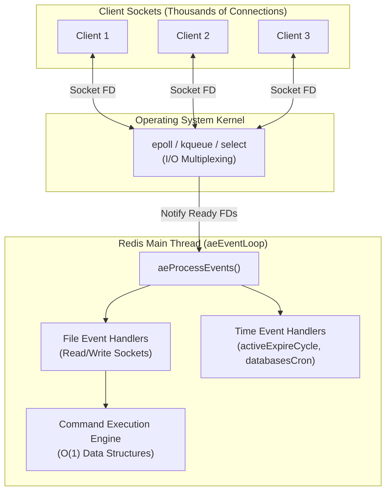

# 02 — Single-Threaded Model, Event Loop & Pipelining

> **Why this is Topic 2:** Redis executes all database commands on a single thread. At Zerodha's scale (processing millions of order placements, real-time portfolio updates, and token authentication requests), a single blocking operation can queue up thousands of subsequent requests, leading to cascade failures, API timeouts, and critical financial transaction delays. The interviewer will test your depth on *why* Redis is fast despite being single-threaded, how the operating system multiplexes connections using `epoll`, the risks of $O(N)$ operations on production, and how Redis 6+ Threaded I/O optimizes network throughput without sacrificing thread-safe execution.

---

## 1. WHAT

Redis is historically known as a **single-threaded** application. While it runs background threads for helper tasks (like file flushing, memory freeing, and client execution monitoring), the **core execution path**—reading commands from client sockets, parsing them, executing the database modifications, and writing responses—is performed by a single thread.

This architecture is powered by three main pillars:
1. **The Event Loop (`ae.c`):** An infinite loop that waits for occurrences of file events (incoming socket data, connection requests) and time events (cron tasks like key eviction, active rehashing).
2. **I/O Multiplexing (e.g., `epoll`):** A kernel mechanism allowing one thread to monitor thousands of network sockets simultaneously, waking up only when a socket is actually ready for read/write.
3. **Threaded I/O (Redis 6.0+):** An enhancement that delegates network serialization, deserialization, and socket I/O to helper threads, while leaving command execution strictly on the main thread.



---

## 2. WHY (the problem it solves)

### 2.1 Why Single-Threaded for Command Execution?
Standard multi-threaded databases (like MySQL or custom in-memory stores) utilize multiple threads to read and write data. This introduces significant costs:

1. **Lock Contention & Mutex Overhead:** In-memory operations are extremely fast (nanoseconds). If multiple threads compete for the same hash table or skiplist, the CPU spends more time managing mutexes, spinlocks, and thread synchronization than executing commands.
2. **Context Switching Costs:** The operating system must constantly swap threads in and out of CPU cores. Context switches require saving register state, invalidating CPU caches, and reloading execution contexts (~1-10 microseconds per switch). For an in-memory store processing 100k+ operations per second, context switching would consume the majority of CPU time.
3. **Memory Bottleneck:** Redis is bound by memory bandwidth and network throughput, not CPU capacity. A single core can process over 1,000,000 read operations per second on modern hardware, making multi-threading unnecessary for standard query volumes.

### 2.2 Why `epoll` over `select` or `poll`?
To handle tens of thousands of active clients, Redis needs a mechanism to wait on network data. 

| Metric / Feature | `select` | `poll` | `epoll` (Linux) / `kqueue` (BSD/macOS) |
| :--- | :--- | :--- | :--- |
| **Complexity (Scale)** | $O(N)$ | $O(N)$ | $O(1)$ |
| **Max Connections** | Fixed limit (typically 1024) | Unlimited (bounded by memory) | Unlimited (bounded by memory) |
| **Kernel-to-User Copy** | Copies entire FD set on every call | Copies entire FD set on every call | Shares memory (via kernel event queue) |
| **Trigger Mechanism** | Level-Triggered | Level-Triggered | Level-Triggered / Edge-Triggered (Redis uses LT) |

*   **The $O(N)$ Bottleneck of `select`:** The application passes a list of file descriptors (sockets) to the kernel. The kernel scans them, modifies the list to flag active ones, and returns. The application must then loop through the entire list to find which sockets are ready. If you have 10,000 active clients, but only 2 have sent data, you must scan 10,000 items every time.
*   **The $O(1)$ Efficiency of `epoll`:** The application registers sockets into an interest list in the kernel (`epoll_ctl`). When data arrives on a socket, the network interface card (NIC) triggers an interrupt, and the kernel appends the ready socket directly to a ready list. The application calls `epoll_wait`, which returns *only* the list of active sockets. No scanning or iteration over inactive connections is required.

---

## 3. HOW (the internals)

### 3.1 The Event Loop (`ae.c`)
The main loop of Redis is structured around the `aeEventLoop` struct, defined in `src/ae.h`:

```c
typedef struct aeEventLoop {
    int maxfd;                  /* Highest file descriptor currently registered */
    int setsize;                /* Max number of file descriptors tracked */
    long long timeEventNextId;
    aeFileEvent *events;        /* Registered events (indexed by Socket FD) */
    aeFiredEvent *fired;        /* Fired events ready for processing */
    aeTimeEvent *timeEventHead; /* Head of the linked list of time events */
    int stop;
    void *apidata;              /* State of multiplexing layer (epoll/kqueue) */
    aeBeforeSleepProc *beforesleep;
    aeBeforeSleepProc *aftersleep;
} aeEventLoop;
```

#### Event Loop Lifecycle
The event loop runs indefinitely via `aeMain()`:

```c
void aeMain(aeEventLoop *eventLoop) {
    eventLoop->stop = 0;
    while (!eventLoop->stop) {
        aeProcessEvents(eventLoop, AE_ALL_EVENTS|AE_CALL_BEFORE_SLEEP|AE_CALL_AFTER_SLEEP);
    }
}
```

Every iteration of `aeProcessEvents` executes the following sequence:

```
[aeMain Loop Start]
       │
       ▼
┌──────────────────────────────┐
│  Run beforesleep() Handler   │ ──► Process pending writes to client buffers, AOF fsync, etc.
└──────────────────────────────┘
       │
       ▼
┌──────────────────────────────┐
│       epoll_wait()           │ ──► Sleep until nearest time event OR file event fires
└──────────────────────────────┘
       │
       ▼
┌──────────────────────────────┐
│  Run aftersleep() Handler    │ ──► Pre-processing after waking up from epoll_wait
└──────────────────────────────┘
       │
       ▼
┌──────────────────────────────┐
│   Process File Events        │ ──► Iterate through active socket FDs and invoke:
│                              │     - acceptCommonHandler() for new connection requests
│                              │     - readQueryFromClient() for incoming commands
└──────────────────────────────┘     - sendReplyToClient() for outgoing responses
       │
       ▼
┌──────────────────────────────┐
│   Process Time Events        │ ──► Walk the linked list of timers and execute expired events
│                              │     - e.g., activeExpireCycle() (TTL evictions)
└──────────────────────────────┘     - e.g., databasesCron() (incremental rehashing)
       │
       ▼
[Loop Repeats]
```

#### Detailed Breakdown of each Event Loop Step:

1. **`beforesleep()` Handler:**
   Before the main thread blocks (goes to sleep) in `epoll_wait`, it executes lightweight, non-blocking chores to clean up pending work:
   * **Write Buffer Flush:** Writes ready reply buffers directly to client sockets (so clients receive responses as fast as possible without waiting for the next event loop tick).
   * **AOF Flush:** Flushes the memory-buffered AOF (Append-Only File) changes down to disk based on the configured persistence policy.
   * **Active Expiration:** Runs a quick, time-boxed session of deleting expired keys to prevent memory bloat.

2. **`epoll_wait()` (The Sleep Phase):**
   If there is no active work remaining, the single thread goes to sleep to conserve CPU resources:
   * **How it sleeps:** It registers its interest list of socket file descriptors and calls `epoll_wait` (or `kqueue`). It supplies a timeout duration calculated by finding the nearest scheduled time event (timer).
   * **Waking Up:** The OS kernel blocks the thread, placing it in a sleep state using **0% CPU** until one of two things happens:
     * A registered client socket becomes readable/writable (network data arrives).
     * The timeout expires (it's time to run a scheduled background task).

3. **`aftersleep()` Handler:**
   Immediately after the thread is awakened by the OS kernel, this handler runs to do quick setup chores before processing the newly arrived events.

4. **Process File Events (Network I/O):**
   The OS kernel provides a list of only the active, fired file descriptors (sockets) that woke up the loop. The main thread processes them sequentially:
   * **Connection Requests:** If a socket is the listening server socket, it runs `acceptCommonHandler()` to establish the TCP connection.
   * **Incoming Commands:** If it is a client read socket, it runs `readQueryFromClient()` to read raw bytes, parse them into RESP commands, and execute them on the in-memory database.
   * **Outgoing Response:** If it is a client write socket, it runs `sendReplyToClient()` to flush buffered replies.

5. **Process Time Events (Timers / Cron):**
   After handling all active network events, Redis runs time-based background maintenance tasks:
   * **`activeExpireCycle()`**: Randomly samples keys with TTL limits and deletes them if expired.
   * **`databasesCron()`**: Runs every 100ms by default to handle key dictionary resizing, incremental rehashing, system stats, cluster state, and Sentinel heartbeats.

6. **Loop Repeats:**
   The thread returns to the top of the loop and starts the next iteration.

---

### 3.2 The Danger of $O(N)$ Operations
Because Redis uses a single thread for command execution, any command that takes milliseconds to run will stall all other client connections. 

#### Why $O(N)$ blocks the thread:
1. **`KEYS pattern`**: Scans the entire global keyspace dictionary. If you have 10 million keys, Redis must check every single key name against the glob pattern. This can block the event loop for hundreds of milliseconds or seconds.
2. **`SMEMBERS key` / `HGETALL key` / `ZRANGE key 0 -1`**: Fetches all elements of a Set, Hash, or Sorted Set. If the structure has 100k+ elements, the serialization to the output buffer and processing blocks the thread.
3. **`FLUSHALL` / `FLUSHDB` (Synchronous)**: Deallocates all keys in memory. Memory deallocation requires calling `free()` on millions of keys, which is a slow CPU operation.

#### Mitigating $O(N)$ Blocks:

##### 1. Cursor-Based Scanning (`SCAN` / `HSCAN` / `SSCAN` / `ZSCAN`)
Instead of fetching all keys or elements at once, `SCAN` iterates through them in chunks. Each call executes in $O(1)$ time, returning a subset of elements and a cursor token for the next iteration.

```
Client ──[ SCAN 0 (Start) ]───────────► Redis (Returns keys & Next Cursor: 12)  ──► Runs in O(1)
Client ──[ SCAN 12 ]──────────────────► Redis (Returns keys & Next Cursor: 48)  ──► Runs in O(1)
Client ──[ SCAN 48 ]──────────────────► Redis (Returns keys & Next Cursor: 0)   ──► Complete
```

*   **How `SCAN` cursor math avoids rehashing errors:**
    Redis databases are implemented as hash tables (an array of buckets containing linked lists of keys). If the hash table grows or shrinks (rehashes) while a client is scanning sequentially (e.g. `0, 1, 2, 3...`), buckets split or merge:
    *   **Growing:** Elements move to new buckets, causing you to scan the same elements again (creating duplicates).
    *   **Shrinking:** Multiple buckets collapse into one, causing you to miss elements entirely (data loss).
    
    To solve this, Redis uses **Reverse Binary Counting** (traversing the hash table buckets by reversing the bits of the index). For example, in a table of size 8:
    *   Standard Binary: `000 (0) -> 001 (1) -> 010 (2) -> 011 (3) -> 100 (4) -> 101 (5) -> 110 (6) -> 111 (7)`
    *   Reverse Binary:  `000 (0) -> 100 (4) -> 010 (2) -> 110 (6) -> 001 (1) -> 101 (5) -> 011 (3) -> 111 (7)`
    
    *How this prevents errors:* When a hash table doubles in size, bucket `0` (`000`) splits into bucket `0` (`0000`) and bucket `8` (`1000`). Because reverse binary counting visits `0` and then immediately visits `4` (which splits into `4` and `12`—i.e. `0100` and `1100`), the split buckets are always adjacent in the traversal sequence. This guarantees that **no keys present from the start of the scan are missed**, even if the hash table resizes mid-scan.

##### 2. Asynchronous Memory Reclamation (`UNLINK` and `ASYNC` flags)
Deallocating a massive data structure (like a Set with 1,000,000 values) takes time because the OS kernel must free every individual node allocation.

*   **Synchronous `DEL`:** Blocks the single main thread while looping through memory to free the allocations.
*   **Asynchronous `UNLINK`:** Detaches the key pointer from the main directory in $O(1)$ time, making it immediately invisible to clients. The memory pointer is passed to a background queue, where a background lazy-free thread executes the slow C `free()` calls.

```
[DEL key]      ──► [Remove from directory] ──► [Synchronous free()] (Blocks event loop)

[UNLINK key]   ──► [Remove from directory] ──── (Main thread continues immediately)
                                 │
                                 ▼ (Hand off memory pointer)
                       [Background Thread] ──► [Asynchronous free()] (No blocking)
```

Similarly, use `FLUSHALL ASYNC` to clear entire databases without freezing the main thread.

---

---

### 3.3 Pipelining
Normally, Redis operations follow a request-response pattern:
```
Client ──[ SET key1 val1 ]──> Network (RTT) ──> Redis Main Thread (Executes)
Client <──[ OK ]───────────── Network (RTT) <── Redis Main Thread
(Total time = 1 RTT + Execution time)
```

If you need to execute 1,000 commands, you pay the cost of 1,000 Network Round-Trip Times (RTT). If your RTT is 2ms, executing 1,000 operations sequentially will take **2 seconds**, even though Redis execution time was less than 1ms.

**Pipelining** changes this flow:
```
Client ──[ SET k1 v1 \n SET k2 v2 \n SET k3 v3 ]──> Network (1 RTT) ──> Redis
                                                                           │
                                                                           ▼ (Executes all)
Client <──[ OK \n OK \n OK ]─────────────────────── Network (1 RTT) <── Responses
(Total time = 1 RTT + Total Execution time)
```

#### Internals of Pipelining:
*   Pipelining is purely a **client-side network optimization**. Redis does not need to configure anything to support it.
*   The client writes multiple commands into its local TCP send buffer. The OS packages them into TCP packets and sends them over the wire.
*   Redis reads all commands from the socket buffer in one read syscall (`readQueryFromClient()`), processes them sequentially in memory, and buffers all responses.
*   Redis writes the bulk responses back in a single operation. This reduces the number of socket read/write system calls on both the client and server.

> [!WARNING]
> Pipelining does **NOT** guarantee atomicity. If another client sends a command while a pipeline is being executed, their command can interleave with the pipeline commands. For atomicity, use Lua scripts or `MULTI`/`EXEC`.

---

### 3.4 Redis 6.0+ Threaded I/O
Historically, the single thread was saturated by two operations before CPU limits were hit:
1. **Reading and writing TCP buffers:** System calls like `read()`, `write()`, `send()`, and `recv()` require kernel space context switches.
2. **Parsing protocols:** Deserializing the Redis serialization protocol (RESP) into command arguments, and formatting response buffers back into RESP.

To solve this, Redis 6.0 introduced **Threaded I/O** (I/O threads).

#### The Restaurant Analogy
Imagine the restaurant is now insanely busy. The main waiter is still the only one allowed to cook the food (command execution on the database) because only they know the secret recipes, and having multiple people at the stove would cause chaos (race conditions). 
However, they are getting slow because they spend too much time translating foreign languages on menus, writing down orders, and packaging takeout boxes in bags.

To fix this, the restaurant hires **three assistants** (I/O threads):
* **Read & Parse (Assistants):** The assistants take the orders from clients, parse them, translate them, and place clean tickets in a queue for the waiter.
* **Cooking (Main Waiter):** The main waiter cooks the orders one-by-one from the queue (sequential, atomic execution).
* **Write response (Assistants):** The assistants take the cooked dishes, wrap them up, print receipts, and hand them back to clients.

```
                             [ TCP Sockets ]
                                 │   ▲
                  Read Socket    │   │  Write Socket
                 (Parallelized)  ▼   │ (Parallelized)
                  ┌─────────────────────────────────┐
                  │    Multiple I/O Worker Threads  │  ◄── Parallel Threads
                  └─────────────────────────────────┘
                        │                     ▲
             Parsed     │                     │  Buffered
            Commands    ▼                     │ Responses
                  ┌─────────────────────────────────┐
                  │        Redis Main Thread        │  ◄── Single Core Execution
                  │    (Atomic Command Execution)   │
                  └─────────────────────────────────┘
```

#### The Parallel-Sequential-Parallel Lifecycle:
Coordination between threads runs in three clear steps, separated by **Wait Barriers** (synchronization points) to prevent race conditions:

```
 TIME ──►
 ┌────────────────────────────────────────────────────────────────────────┐
 │ 1. READ & PARSE PHASE (Multiple Worker Threads)                        │
 │    - Worker Thread 1 reads raw network bytes and parses: "SET x 10"    │
 │    - Worker Thread 2 reads raw network bytes and parses: "GET y"       │
 └────────────────────────────────────────────────────────────────────────┘
                                  │
                       [WAIT BARRIER / SYNC]
   (Main thread blocks until ALL workers have finished parsing the commands)
                                  │
                                  ▼
 ┌────────────────────────────────────────────────────────────────────────┐
 │ 2. EXECUTION PHASE (Single Main Thread)                                │
 │    - Main thread executes: "SET x 10" (mutates database memory)        │
 │    - Main thread executes: "GET y"    (reads database memory)          │
 │    - Responses are written to local client memory buffers.             │
 └────────────────────────────────────────────────────────────────────────┘
                                  │
                       [WAIT BARRIER / SYNC]
   (Main thread blocks until ALL execution is done before starting write)
                                  │
                                  ▼
 ┌────────────────────────────────────────────────────────────────────────┐
 │ 3. WRITE PHASE (Multiple Worker Threads)                               │
 │    - Worker Thread 1 takes response "OK" and writes it to Client 1     │
 │    - Worker Thread 2 takes response "15" and writes it to Client 2     │
 └────────────────────────────────────────────────────────────────────────┘
```

#### Why wait at the Barriers?
* **First Barrier (Before Execution):** The main thread must be 100% sure it has the complete, fully parsed commands before it starts running them.
* **Second Barrier (Before Write):** The main thread must complete all database read/writes to populate the output buffers fully before worker threads start sending those buffers back to the sockets.

This design yields up to $2.5\times$ performance scaling on multi-core systems because it parallelizes the slow network I/O calls (Phases 1 & 3) while keeping database execution (Phase 2) single-threaded and lock-free.

---

## 4. CODE / EXAMPLES

### 4.1 Configuring Threaded I/O in `redis.conf`
Threaded I/O is disabled by default. To enable it, configure the thread pool size and processing behavior:

```ini
# Enable Threaded I/O by specifying the number of worker threads.
# Rule of thumb: If you have 4 CPU cores, use 2 or 3 threads. If you have 8 cores, use 6 threads.
# Do not exceed the number of physical cores!
io-threads 4

# By default, I/O threads are only used for writing responses to clients.
# Enable this to use I/O threads for reading and parsing client payloads as well.
io-threads-do-reads yes
```

### 4.2 Safe Keyspace Scanning (Avoid KEYS)
In production, never use `KEYS *`. Here is how to implement a cursor-based scan in Java to find and asynchronously delete keys matching a pattern:

#### Java (Jedis Client)
```java
import redis.clients.jedis.Jedis;
import redis.clients.jedis.params.ScanParams;
import redis.clients.jedis.resps.ScanResult;
import java.util.List;

public class RedisScanner {
    public static void deleteKeysWithPattern(String pattern) {
        try (Jedis jedis = new Jedis("localhost", 6379)) {
            String cursor = ScanParams.SCAN_POINTER_START;
            ScanParams scanParams = new ScanParams().match(pattern).count(1000);
            
            do {
                ScanResult<String> scanResult = jedis.scan(cursor, scanParams);
                List<String> keys = scanResult.getResult();
                
                if (keys != null && !keys.isEmpty()) {
                    // Use unlink (async) instead of del (sync) to avoid blocking the event loop
                    jedis.unlink(keys.toArray(new String[0]));
                    System.out.printf("Unlinked %d keys...%n", keys.size());
                }
                cursor = scanResult.getCursor();
            } while (!cursor.equals(ScanParams.SCAN_POINTER_START));
        }
    }
}
```

#### Java (Spring Data Redis / Lettuce)
```java
import org.springframework.data.redis.core.Cursor;
import org.springframework.data.redis.core.ScanOptions;
import org.springframework.data.redis.core.StringRedisTemplate;
import java.util.ArrayList;
import java.util.List;

public class SpringRedisScanner {
    private final StringRedisTemplate redisTemplate;

    public SpringRedisScanner(StringRedisTemplate redisTemplate) {
        this.redisTemplate = redisTemplate;
    }

    public void deleteKeysWithPattern(String pattern) {
        ScanOptions options = ScanOptions.scanOptions().match(pattern).count(1000).build();
        List<String> keysBatch = new ArrayList<>();
        
        // Lettuce cursor implements AutoCloseable to prevent resource leaks
        try (Cursor<String> cursor = redisTemplate.scan(options)) {
            while (cursor.hasNext()) {
                keysBatch.add(cursor.next());
                
                // Process in batches of 1000 to keep memory footprint low
                if (keysBatch.size() >= 1000) {
                    redisTemplate.unlink(keysBatch);
                    System.out.printf("Unlinked batch of %d keys...%n", keysBatch.size());
                    keysBatch.clear();
                }
            }
            
            // Delete remaining keys in the last batch
            if (!keysBatch.isEmpty()) {
                redisTemplate.unlink(keysBatch);
                System.out.printf("Unlinked final batch of %d keys...%n", keysBatch.size());
            }
        }
    }
}
```


### 4.3 Measuring Latency and Slow Operations
Use these built-in tools to detect if slow commands are blocking the single-threaded event loop:

```redis
# 1. Measure server latency from the client's perspective
$ redis-cli --latency -h 127.0.0.1
min: 0, max: 12, avg: 0.14 (348 samples)

# 2. Get the current slowlog configuration
> CONFIG GET slowlog-log-slower-than
1) "slowlog-log-slower-than"
2) "10000"  # Logs commands that take longer than 10,000 microseconds (10ms)

# 3. Retrieve the latest slow queries
> SLOWLOG GET 5
1) 1) (integer) 4            # Unique slowlog ID
   2) (integer) 1687789392    # Unix timestamp of execution
   3) (integer) 12400         # Duration in microseconds (12.4 ms)
   4) 1) "KEYS"               # The command executed
      2) "user:*"
```

---

## 5. INTERVIEW ANGLES

### Q: Why is Redis fast even though it operates on a single thread?
**A:** The performance of Redis is driven by four key factors:
1. **In-Memory Design:** Redis stores all data in RAM. Accessing RAM takes nanoseconds, whereas disk seeks take milliseconds (magnetic disks) or microseconds (SSDs). There are no disk disk-reads on the request path.
2. **O(1) Data Structures:** Redis structures are optimized for in-memory operations (like `listpacks` for cache locality and `skiplists` for sorted lookups).
3. **Non-Blocking I/O Multiplexing:** Redis uses `epoll`/`kqueue` to handle thousands of concurrent client connections with a single thread, sleeping when there is no work and waking up immediately when data is ready.
4. **No Lock Contention:** Because there is only one thread executing commands, there is no thread context-switching overhead, and no CPU cycles are wasted waiting for mutexes, spinlocks, or managing deadlocks.

### Q: Explain the difference between `select`, `poll`, and `epoll`. Why does Redis prefer `epoll`?
**A:** `select` and `poll` require the application to pass the entire list of monitored sockets (File Descriptors) to the kernel on every call ($O(N)$ memory copy). The kernel scans them, returns, and the application must loop through the entire list to identify active sockets. This does not scale.
`epoll` uses an in-kernel interest list. When a socket receives data, the OS appends it to a "ready list". The application calls `epoll_wait` and receives *only* the file descriptors that are ready for processing, achieving $O(1)$ complexity. Redis uses `epoll` on Linux (and `kqueue` on macOS/BSD) to scale to tens of thousands of active client sockets without CPU degradation.

### Q: If Redis 6.0+ is multi-threaded (Threaded I/O), why is it still considered "single-threaded"?
**A:** Because **command execution remains strictly single-threaded and atomic**. 
Multi-threading is only used for network processing: reading bytes from client sockets, parsing the RESP protocol into command objects, and formatting the output back to client buffers. Once the commands are parsed, they are queued and executed sequentially by the single main thread. This preserves the simple programming model of Redis (no race conditions, no locks on data structures) while offloading socket syscalls and serialization costs to helper threads.

### Q: What is pipelining, and does it guarantee atomic execution?
**A:** Pipelining is a client-side optimization where multiple commands are written to the TCP socket buffer at once, bypassing the normal request-response network loop. This reduces the number of round trips (RTT) and minimizes socket read/write system calls.
Pipelining **does not guarantee atomicity**. The pipeline is parsed and executed command-by-command on the Redis server. If another client sends a query to Redis while the pipeline is executing, its query can be interleaved between the pipeline's commands. If atomicity is required, you must use Lua scripts or transactional blocks (`MULTI`/`EXEC`).

### Q: What is the difference between `DEL` and `UNLINK`? When would you use which?
**A:** 
*   `DEL` is synchronous. It removes the key reference from the database dictionary and calls `free()` on the associated memory space immediately. If you run `DEL` on a Hash or Set with millions of elements, the event loop will block for several milliseconds to release that memory.
*   `UNLINK` is asynchronous. It removes the key reference from the dictionary in $O(1)$ time, making the key instantly invisible to other clients. It then passes the actual data pointer to a background lazy-free thread, which handles the slow `free()` operation without blocking the event loop.
*   **Usage:** Always use `UNLINK` for large structures or when deleting key patterns in production. Use `DEL` only for small string keys or when immediate synchronous deletion is required.

### Q: How does `SCAN` work, and why does it sometimes return duplicate keys?
**A:** `SCAN` is a cursor-based iterator. It walks the internal hash table bucket-by-bucket. It returns a batch of keys and a next-step cursor. The client passes this cursor back in the subsequent call.
**Caveats:**
1. **Duplicates:** If the hash table shrinks or grows (rehashes) while a scan is in progress, some buckets can be split or merged. To prevent missing keys, the cursor uses reverse binary counting. This math guarantees that all keys are returned at least once, but it can cause keys to be scanned twice. Clients must handle deduplication if absolute uniqueness is required.
2. **Missing Keys:** If a key is deleted or added during the scan, it may or may not be returned depending on whether its bucket was already visited.

---

## 6. ONE-LINE RECALL CARDS

*   Redis uses a single main thread for database execution, avoiding locks and CPU context switches.
*   **I/O Multiplexing (`epoll`/`kqueue`)** enables a single thread to monitor thousands of client connections with $O(1)$ efficiency.
*   `epoll_wait` polls the OS kernel's ready list instead of scanning all file descriptors like `select` ($O(N)$).
*   **$O(N)$ commands** (like `KEYS *`, `HGETALL`) block the single thread and starve all other client requests.
*   `SCAN` uses **reverse binary cursor math** to traverse the keyspace incrementally without blocking.
*   `UNLINK` deletes key indices in $O(1)$ time and delegates memory cleanup to background threads.
*   **Pipelining** batches network requests to save Round-Trip Time (RTT) but **does not** guarantee atomicity.
*   **Threaded I/O (Redis 6.0+)** offloads socket reading/writing and RESP serialization to helper threads, while command execution remains strictly single-threaded.

---

**Next:** [03 — Persistence: RDB, AOF, Hybrid](03-persistence.md) (fork/CoW, fsync policies, what you lose on crash).
