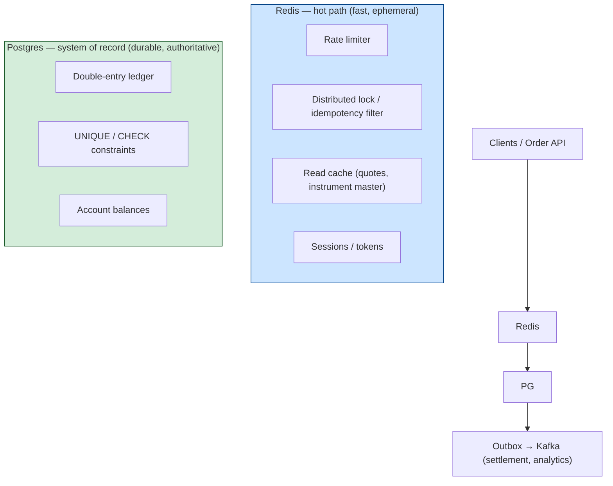
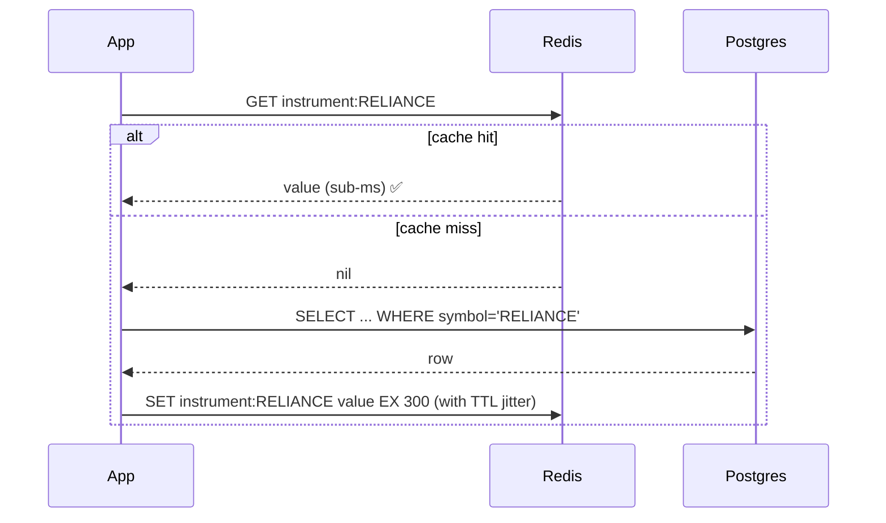
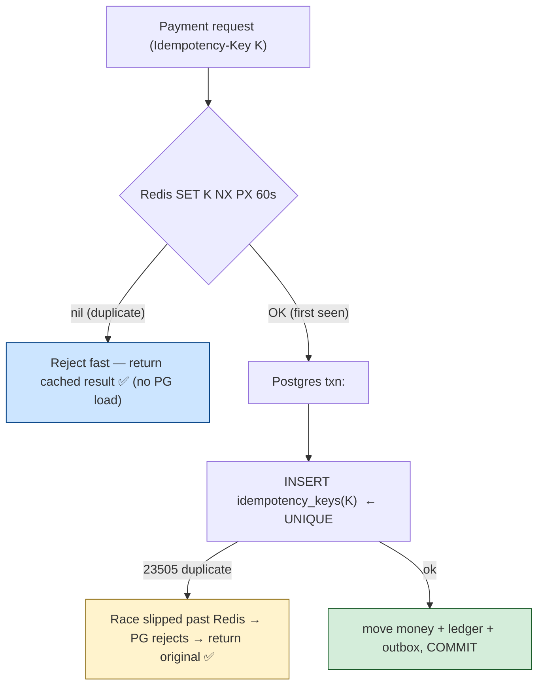

# 13 — Postgres + Redis: System Design Patterns (The Capstone)

> **Why this is Topic 13:** Every prior topic taught Redis in isolation. But Zerodha doesn't run Redis
> *or* Postgres — it runs **both, together**, and the SDE2 system-design round is almost always "design
> X" where the right answer is *Postgres as the durable system of record + Redis as the hot-path
> accelerator/coordinator.* The candidates who stand out don't just say "add a cache" — they can state
> **exactly which store owns which guarantee**, what happens on each failure, and how the two stay
> consistent. This chapter stitches the [Redis track](index.md) and the
> [Postgres track](../postgres/index.md) into one mental model you can defend under cross-examination.

---

## 0. The mental model (read this first)

Think **court of record vs. trading floor.**

- **Postgres is the court of record** — slow, deliberate, durable, *authoritative*. If the court says a
  trade happened, it happened. It owns money, balances, the immutable ledger, and all constraints.
- **Redis is the trading floor** — fast, loud, ephemeral. It absorbs the firehose (quotes, sessions,
  rate-limit counters, locks, hot reads) so the court isn't trampled. If the floor forgets something,
  the court is still correct.
- **The cardinal rule:** *never let the trading floor be the only place a fact about money lives.* Redis
  may go first (speed) but Postgres must be the place that *decides* (truth). Every design below is an
  application of that single rule.



---

## 1. WHAT — who owns which guarantee

The whole capstone compresses into one table. If you can reproduce this on a whiteboard, you've won the
round.

| Concern | Owner | Why | Cross-ref |
|---|---|---|---|
| Money / balances / ledger | **Postgres** | ACID, durability, constraints, MVCC snapshots | [PG 09](../postgres/09-fintech-patterns.md) |
| Durability of a committed fact | **Postgres** (WAL fsync) | Redis is async-replicated, best-effort | [PG 07](../postgres/07-wal-replication.md), [Redis 03](03-persistence.md) |
| Idempotency *enforcement* | **Postgres** `UNIQUE` | Redis filter can be lost on failover | [Redis 11](11-fintech-patterns.md) |
| Idempotency *fast-reject* | **Redis** `SET NX PX` | Absorbs duplicate floods before they hit PG | [Redis 07](07-distributed-locks.md) |
| Rate limiting | **Redis** | O(1) counters, sub-ms, ephemeral by design | [Redis 11](11-fintech-patterns.md) |
| Hot reads (quotes, instrument master) | **Redis cache** | Offload PG read replicas, sub-ms latency | [Redis 05](05-caching-patterns.md) |
| Sessions / tokens | **Redis** | Short-lived, TTL-native, no durability need | [Redis 04](04-expiration-eviction.md) |
| Distributed lock | **Redis** (+ fencing token) | Cross-process mutual exclusion | [Redis 07](07-distributed-locks.md) |
| Cross-service events | **Postgres outbox → Kafka** | Atomic with the DB write; exactly-once-effect | [PG 09](../postgres/09-fintech-patterns.md), [Redis 08](08-pubsub-streams.md) |
| Live leaderboard / counters | **Redis ZSET**, batch-synced to PG | O(log N) ranks; PG holds EOD truth | [Redis 11](11-fintech-patterns.md) |

---

## 2. WHY — the impedance mismatch that forces two stores

You can't use one store for everything because the two workloads have **opposite** requirements:

| Dimension | Hot path (quotes, limits, sessions) | System of record (money) |
|---|---|---|
| Latency target | sub-millisecond | tens of ms acceptable |
| Durability need | "fine to lose on crash" | **zero loss** |
| Throughput | millions/sec, spiky (market open) | thousands/sec |
| Consistency | eventual / best-effort OK | strict, ACID |
| Data lifetime | seconds–minutes (TTL) | years (audit) |

Forcing money through a sub-ms in-memory store gives you speed and **data-loss liability**. Forcing
quotes through Postgres gives you durability and a **melted database** at 9:15 AM. So you split by
*guarantee*, and the engineering art is the **seams** between them — which is the rest of this chapter.

---

## 3. HOW — the canonical patterns

### 3.1 Cache-aside in front of Postgres (the 80% pattern)

The default integration. Redis caches what Postgres owns; Postgres remains the source of truth.



The traps (each is a [Redis 05](05-caching-patterns.md) topic, here tied to PG):
- **Stampede at market open:** thousands of concurrent misses all hammer Postgres for the same hot key.
  Fix: **TTL jitter** (don't expire all keys at once) + **single-flight lock** (one request rebuilds,
  others wait) + optional stale-while-revalidate.
- **Inconsistency on write:** after `UPDATE` in Postgres, the cache is stale. Fix: **invalidate, don't
  update** the cache on write (`DEL instrument:RELIANCE`) — let the next read repopulate from PG. Writing
  the cache directly risks a race where an older value wins.
- **Cache penetration:** repeated misses for a non-existent key bypass the cache and pound PG. Fix:
  cache a short-TTL negative/sentinel value.

### 3.2 Idempotency: Redis fast-filter + Postgres hard guarantee (the money pattern)

The single most important two-store pattern in fintech. **Redis absorbs the duplicate flood; Postgres
makes it *correct*.** Neither alone is sufficient — Redis can lose the key on failover (async repl,
[Redis 09](09-replication-ha.md)); Postgres alone would take a row lock per duplicate under a flash
crowd.



Why **both** layers:
- **Redis only:** primary crashes after `SET K` but before replication → retry finds no key → **double
  payment**. Unacceptable for money.
- **Postgres only:** every duplicate retry takes a row lock / index probe → connection-pool exhaustion
  at market open ([PG 08](../postgres/08-pooling-scale.md)).
- **Both:** Redis rejects ~99.99% of duplicates in sub-ms with no PG load; the rare race that slips
  through (or a Redis failover) is caught by the Postgres `UNIQUE` constraint — the *real* guarantee.
- **Tighten the window:** Redis `WAIT 1 100` after the `SET` blocks until ≥1 replica acks, shrinking the
  lost-write window; but you still keep the PG constraint as the backstop.

### 3.3 Distributed lock (Redis) + fencing token (Postgres) — safe mutual exclusion

A Redis lock alone is **not safe** under GC pauses / failover (Kleppmann, [Redis 07](07-distributed-locks.md)).
The fix spans both stores: Redis issues a **monotonic fencing token**, Postgres **rejects stale tokens**.

```mermaid
sequenceDiagram
    participant A as Worker A
    participant B as Worker B
    participant R as Redis (lock + INCR token)
    participant PG as Postgres (records max token)
    A->>R: SET lock NX PX; INCR fence → token=83
    Note over A: GC pause (lock TTL expires)
    B->>R: SET lock NX PX; INCR fence → token=84
    B->>PG: write WHERE :token(84) > stored_token → accepted (stores 84)
    A->>PG: write WHERE :token(83) > stored_token → REJECTED (83 < 84) ✅
```

The DB-side guard is just a conditional write: `UPDATE resource SET ..., fence=:t WHERE :t > fence`.
Redis gives *speed* (the lock); Postgres gives *safety* (the fencing check). Same division of labor as
everywhere else.

### 3.4 The outbox: bridging Postgres truth to the streaming world

You must update money in Postgres **and** emit an event (to Kafka/Redis Streams) for settlement,
notifications, downstream services. You can't atomically write two systems, so write the event into a
Postgres **outbox table in the same transaction**, then relay it. (Full detail in
[PG 09](../postgres/09-fintech-patterns.md); the consumer side is [Redis 08](08-pubsub-streams.md) /
Kafka.)

- **Why not publish from the app after COMMIT?** Crash between COMMIT and publish → money moved, event
  lost. Outbox makes the *intent to publish* part of the atomic commit.
- **Why not Redis Pub/Sub for this?** Fire-and-forget — a disconnected consumer loses the event
  permanently ([Redis 08](08-pubsub-streams.md)). Use a durable log (Kafka, or Redis Streams with
  consumer groups + idempotent consumers).
- **Delivery is at-least-once → consumers must be idempotent** (dedupe by event id). This is the same
  idempotency principle as §3.2, now on the consumer side.

### 3.5 Live leaderboard / counters: Redis serves, Postgres persists

Trading-contest P&L ranks, referral standings, live position counters:
- **Redis ZSET** serves O(log N) updates and O(log N + k) top-k reads in sub-ms — Postgres window
  functions would block read replicas at 1M users ([Redis 11](11-fintech-patterns.md)).
- **Postgres holds the durable truth** — a periodic job snapshots ZSET state into PG (end-of-day final
  standings, audit). If Redis is wiped, you **rebuild the ZSET from Postgres**. Redis is a *derived,
  rebuildable* view; PG is the source.

This "Redis is a rebuildable cache of a Postgres-owned truth" framing applies to almost every counter:
keep the authoritative count derivable from the ledger, use Redis for the fast live view.

### 3.6 Failure-mode matrix (the question they love)

| Failure | What survives | What you lose | Why it's safe |
|---|---|---|---|
| **Redis primary crashes** | All money/ledger (PG intact) | Sessions, rate-limit counters, cache, un-replicated locks | Redis holds nothing authoritative; caches repopulate from PG, sessions re-auth |
| **Redis failover mid-`SET` (idempotency)** | Correctness | The fast-reject for one key | PG `UNIQUE` constraint catches the duplicate (§3.2) |
| **Postgres primary crashes** | Committed trades (WAL fsync + sync replica) | In-flight uncommitted txns; async-replica lag window | RPO=0 with quorum sync repl ([PG 07](../postgres/07-wal-replication.md)) |
| **Cache returns stale value** | Money correctness | A few seconds of read freshness | Reads that *must* be current go to PG, not cache |
| **Both up, network partition** | PG availability (CP-ish) | Redis-coordinated locks may be unsafe | Fencing tokens make stale lock holders harmless (§3.3) |

The headline answer: **"Redis failures cost performance; Postgres failures cost data — so money never
depends on Redis surviving."**

---

## 4. CODE / EXAMPLE — one request, both stores

End-to-end "place a limit order," showing each store doing its job:

```text
POST /orders  (Idempotency-Key: K, api_key: U)

1. RATE LIMIT      Redis: token-bucket Lua for api_key U      → reject if exhausted   [Redis 11]
2. IDEMP FAST-PASS Redis: SET idemp:K <reqhash> NX PX 60000   → nil ⇒ return cached    [Redis 07/11]
3. LOCK            Redis: SET lock:acct:U NX PX 5000 + INCR fence:acct:U → token T     [Redis 07]
4. DURABLE TXN     Postgres (one transaction):                                         [PG 09]
                     INSERT idempotency_keys(K)               -- UNIQUE backstop
                     UPDATE accounts SET balance = balance - :amt
                        WHERE id=:acct AND balance >= :amt AND :T > fence_token
                     INSERT ledger_entries (debit, credit)    -- sum to zero
                     INSERT outbox (order_event)              -- atomic event
                   COMMIT                                     -- WAL fsync = durable    [PG 07]
5. CACHE           Redis: DEL cache:positions:U  (invalidate, don't write)             [Redis 05]
6. UNLOCK          Redis: Lua compare-and-del lock:acct:U (only if value == ours)      [Redis 07]
7. RELAY           outbox → Kafka (at-least-once); consumers idempotent                [Redis 08]
```

Each numbered step maps to exactly one store's strength. If Redis dies between steps, the worst case is a
rejected/retried request — **never a lost or duplicated rupee**, because step 4 is the only step that
*decides*, and it's pure Postgres.

```sql
-- The Postgres core (step 4) — the only authoritative part:
BEGIN;
  INSERT INTO idempotency_keys(key) VALUES (:K);          -- 23505 ⇒ duplicate, rollback+return original
  UPDATE accounts SET balance = balance - :amt, fence_token = :T
    WHERE id = :acct AND balance >= :amt AND :T > fence_token;  -- 0 rows ⇒ insufficient funds OR stale lock
  INSERT INTO ledger_entries(txn_id, account_id, amount)
    VALUES (:txn, :acct, -:amt), (:txn, :counterparty, +:amt);  -- double entry, sums to 0
  INSERT INTO outbox(aggregate, payload) VALUES ('order', :json);
COMMIT;   -- durable on WAL fsync; MVCC let readers run throughout
```

---

## 5. INTERVIEW ANGLES

**Q: Design order placement for a broker. Where does Redis fit vs Postgres?**
A: Postgres is the system of record — double-entry ledger, balances, constraints, durability via WAL.
Redis is the hot path — rate limiting, an idempotency fast-filter, distributed lock with a fencing
token, hot-read cache, sessions. Money is *decided* only in a single Postgres transaction; Redis
absorbs load and coordinates but never holds the sole copy of a money fact.

**Q: Redis is your idempotency store. Primary crashes right after `SET`. Double charge?**
A: Possible if Redis is the *only* guard — async replication can lose the un-replicated key. That's why
Redis is only a fast-reject; the real guarantee is a Postgres `UNIQUE` constraint inside the money
transaction, which catches any duplicate that slips through. Optionally `WAIT 1 100` to shrink the
window. Redis for speed, Postgres for correctness.

**Q: How do you keep the cache consistent with Postgres on writes?**
A: Invalidate, don't update — `DEL` the key after the PG commit and let the next read repopulate from the
source of truth. Writing the new value into the cache risks a race where a concurrent older read writes a
stale value after yours. For reads that must be current (e.g., available margin at order time), bypass
the cache and read Postgres.

**Q: Your Redis lock isn't safe under GC pauses. Fix it across both stores.**
A: Redis issues a monotonically increasing fencing token (`INCR`) with the lock; Postgres records the
highest token seen and rejects any write carrying a lower token (`WHERE :token > fence_token`). A paused
holder waking up late writes with a stale token and is rejected — Redis gives mutual-exclusion speed, PG
gives the safety backstop.

**Q: Move money AND notify settlement — atomically across Postgres and Kafka?**
A: You can't 2-phase-commit them cheaply, so use the transactional outbox: write the event into an outbox
table in the same Postgres transaction as the money move; a relay (poller or Debezium reading WAL)
publishes at-least-once; consumers dedupe by event id. Never publish from the app after COMMIT — a crash
in between loses the event.

**Q: Market open: 10× traffic spike. What protects Postgres?**
A: Layered. Redis rate limiter sheds abusive load; cache-aside with TTL jitter + single-flight stops a
read stampede; PgBouncer caps real PG connections so the spike can't open thousands of backends
([PG 08](../postgres/08-pooling-scale.md)); reads go to PG replicas, writes stay on the primary. Redis is
the shock absorber in front of the durable core.

**Q: Redis goes completely down for 5 minutes. What breaks?**
A: Performance, not correctness. Caches miss → reads fall back to Postgres (slower, possibly needing more
replicas/circuit-breaking); rate limiting and sessions degrade (fail-open or fail-closed by policy); locks
unavailable → either queue or fall back to a Postgres advisory lock / `SELECT FOR UPDATE`. No money is
lost or duplicated because Postgres owns all of it.

---

## 6. ONE-LINE RECALL CARDS

- **Postgres = system of record (truth, durability, money); Redis = hot path (speed, ephemeral, coordination).**
- **Cardinal rule:** no money fact lives *only* in Redis. Redis may go first; Postgres decides.
- **Cache-aside:** read-through with TTL jitter + single-flight; on write **invalidate (`DEL`), don't update**.
- **Idempotency = Redis fast-reject (`SET NX PX`) + Postgres `UNIQUE` backstop.** Failover-safe because PG catches the race.
- **Lock = Redis (`SET NX PX` + fencing `INCR`) + Postgres rejects stale tokens** (`WHERE :token > fence`). Safe under GC pauses.
- **Cross-system events = Postgres outbox in the same txn → Kafka, at-least-once, idempotent consumers.** Never publish after COMMIT.
- **Leaderboards/counters:** Redis ZSET serves live ranks; Postgres holds durable truth; **rebuild Redis from PG** after a wipe.
- **Failure headline:** Redis failures cost *performance*; Postgres failures cost *data* — so money never depends on Redis surviving.
- **Market-open defense stack:** Redis rate limit → cache (jitter + single-flight) → PgBouncer cap → PG read replicas.

---

**Prev:** [12 — Memory Model & Ops](12-memory-ops.md) | **Index:** [Redis Curriculum](index.md) | **See also:** [Postgres Fintech Patterns](../postgres/09-fintech-patterns.md)
