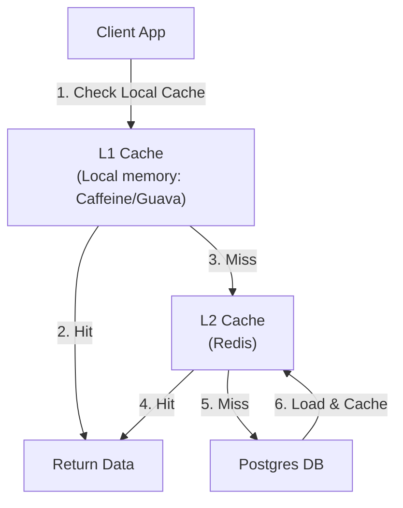
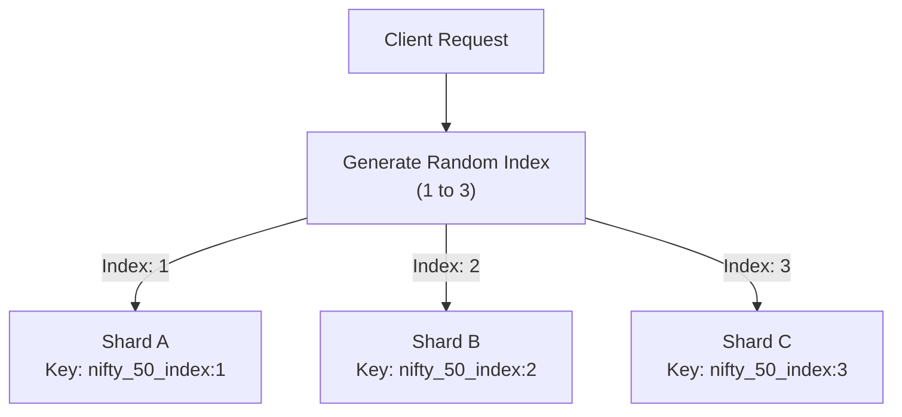

# 16 — Redis Operations: Big Keys & Hot Keys

In a high-throughput, scale-out environment, a single poorly structured key or an ultra-popular item can bring down your entire caching tier. System design interviewers love testing your operational depth by asking: *"Your Redis CPU has spiked to 100% and clients are getting timeouts. How do you find and fix Big Keys and Hot Keys?"*

Here is the comprehensive guide on what they are, how they crash production systems, how to detect them, and how to mitigate them.

---

## 💡 The "Noob" Analogies

### 1. The Big Key: Moving a Grand Piano 🎹
* **The Analogy**: Imagine a narrow hallway (the Redis single thread) where people walk back and forth. 
  * A normal key is like a small envelope. It is carried through the hallway in microseconds.
  * A **Big Key** is like trying to move a massive grand piano down the hallway. 
* **The Problem**: While the movers are squeezing the piano through the corridor, the entire hallway is blocked. Nobody else can pass. Other clients have to wait in line outside the door (latency spike) until the piano is completely moved out.

### 2. The Hot Key: The Swarmed Cashier 🏪
* **The Analogy**: Imagine a supermarket with 10 checkout counters (Redis shards). 
  * Most counters have short queues.
  * However, a celebrity is working at **Counter 3**. 
* **The Problem**: 10,000 customers swarm **Counter 3** (the Hot Key) at the exact same second, while the other 9 counters stand empty. Counter 3 gets overwhelmed, transactions stall, and eventually, the cashier collapses from exhaustion (Redis CPU hits 100% and crashes), even though the store as a whole has plenty of spare capacity.

---

## ⚙️ What They Are & Why They Occur

### 1. Big Keys (Data Size Issue)
A **Big Key** is a single Redis key that contains a disproportionately large amount of data. 

* **What defines "Big"?**
  * **Strings**: Values larger than **1 MB**.
  * **Collections (Hashes, Sets, Lists, Sorted Sets)**: Collections containing more than **10,000 elements**, or exceeding **50 MB** in memory size.
* **Why they occur**:
  * **Unbounded Collections**: Storing user logs, audit history, clickstream data, or chat histories in a single Redis list or set without clearing old data.
  * **Fat Objects**: Serializing massive JSON blobs (like a global catalog or entire user profile graphs) into a single string key.

### 2. Hot Keys (Access Frequency Issue)
A **Hot Key** is a key that receives a massive volume of read/write requests (RPS) compared to other keys.

* **What defines "Hot"?**
  * Typically, a key receiving **thousands of operations per second** that saturates a single Redis core's CPU or fills up the physical network link (NIC) bandwidth.
* **Why they occur**:
  * **Celebrity Effect / Flash Sales**: A highly popular product (e.g., a ticket for a Coldplay concert or a limited-edition sneaker) or a celebrity user page (e.g., Elon Musk's feed).
  * **Global Configs / Metadata**: A single configuration key loaded by all application microservices on boot or on every request.
  * **Market Tickers**: The real-time NIFTY 50 or SENSEX index key in stock trading apps (like Zerodha) being updated and read by millions of concurrent clients.

---

## ⚠️ How They Cause Production Outages

### 1. Outages Caused by Big Keys
* **Event Loop Blocking**: Commands like `DEL`, `HGETALL`, or `SMEMBERS` on big keys take milliseconds or seconds. Because Redis is single-threaded, the database freezes during this time.
* **Network Saturation (NIC)**: If a client requests a **5 MB** key **200 times per second**, it consumes **1 GB/s (8 Gbps)** of network bandwidth. This saturates the network interface card (NIC) of the Redis server, causing packet drops and latency across *all* connections.
* **Out-Of-Memory (OOM) Crashes**: Modifying big keys can trigger memory reallocation. If Redis exceeds its `maxmemory` limit, it will start evicting other keys or crash.

### 2. Outages Caused by Hot Keys
* **CPU Bottleneck**: The single core executing commands for the hot key hits **100% utilization**, causing all subsequent requests to queue up.
* **Cache Stampede (Thundering Herd)**: If a hot key expires, thousands of concurrent threads will miss the cache simultaneously and hit the backend database (Postgres) to fetch the same data, knocking the database offline.
* **Connection Exhaustion**: As Redis slows down due to CPU saturation, application clients keep opening new connections to retry, running out of available file descriptors.

---

## 🔍 How to Detect Them

> [!CAUTION]
> **Production Warning**: Never run the raw `MONITOR` or `KEYS *` commands on a busy production server. `MONITOR` records every single execution and can degrade Redis performance by up to 50%, while `KEYS` blocks the single main thread.

### 1. Detecting Big Keys

#### Option A: Built-in Scan Tool
Run this command from your terminal:
```bash
$ redis-cli --bigkeys -h <host> -p <port>
```
* **How it works**: It utilizes the non-blocking `SCAN` command to traverse the keyspace. It samples keys and prints the largest keys per data type (String, Hash, List, Set, ZSet).

#### Option B: Memory Usage Query
Find the exact byte count of a suspected key:
```redis
> MEMORY USAGE user:100:activity
(integer) 8432096  # Returns size in bytes (~8.4 MB)
```

---

### 2. Detecting Hot Keys

#### Option A: Built-in Hot Keys Scan
If your Redis instance is configured with LFU (Least Frequently Used) eviction policy (e.g., `allkeys-lfu` or `volatile-lfu`), run:
```bash
$ redis-cli --hotkeys -h <host> -p <port>
```
* **Note**: If LFU is not active, the command will fail and prompt you to enable LFU configuration.

#### Option B: Command Statistics (Global Level)
Check if a specific command type (like `HGETALL` or `GET`) is spiking:
```redis
> INFO commandstats
# Returns call counts and cumulative microseconds spent per command
cmdstat_get:calls=18239042,usec=5983402,usec_per_call=0.33
```

---

## 🛠️ How to Mitigate and Prevent Them

### 🛡️ Big Key Mitigations

#### 1. Split Big Collections (Sharded Keys)
Instead of putting all items in a single collection, distribute them using a hash function or suffix.
* **Bad**: Hash key `user:100:logs` (with 1,000,000 entries)
* **Good**: Split by date or ID bucket: 
  * `user:100:logs:2026-07-02`
  * `user:100:logs:bucket:1`, `user:100:logs:bucket:2` (using `hash(log_id) % 10`)

#### 2. Compression
For large JSON blocks or raw strings, compress the payload on the client side (using GZIP, Snappy, or LZ4) before saving it to Redis. A 5MB JSON string can often compress down to 200KB.

#### 3. Use Asynchronous Deletion (`UNLINK`)
Never delete a big key with `DEL`. Use `UNLINK`, which detaches the key instantly from the namespace (so it appears deleted) and delegates the slow memory freeing to a background thread.

#### 4. Pagination / Incremental Reads
Never call `HGETALL`, `SMEMBERS`, or `LRANGE 0 -1` on collections. Use:
* `HSCAN`, `SSCAN` for iteration.
* `ZRANGE ... LIMIT` for sorted sets.

---

### 🛡️ Hot Key Mitigations

#### 1. Client-Side Caching (L1 Cache)
The most effective way to protect Redis from hot keys is to bypass Redis entirely for highly repeated queries.


* **How it works**: Store the hot key in the application node's local memory (using Caffeine in Java, or a local map in Go/Node) for a short duration (e.g., 2 to 5 seconds).
* **Syncing / Invalidation**: To prevent reading stale data, use **Redis Pub/Sub** or **Keyspace Notifications**. When the key changes in Redis, publish an invalidation event. All application nodes subscribe to this event and clear their local memory cache.

#### 2. Key Salting (Replica Sharding)
If a hot key is causing read traffic to saturate a single Redis shard, you can duplicate the key across multiple shards by adding a random suffix.

* **Write Step**: When writing the key (e.g., `nifty_50_index`), write it to multiple locations:
  * `nifty_50_index:1`
  * `nifty_50_index:2`
  * `nifty_50_index:3`
* **Read Step**: The client generates a random suffix between `1` and `3` on every read request. The load is distributed evenly across multiple Redis shards.


#### 3. Route Reads to Replicas
For read-heavy hot keys, configure your Redis client library to route read operations to **Replica (Slave) nodes** while sending writes to the **Master node**.

---

## 🙋‍♂️ Interview Angles

### Q: An API is experiencing latency spikes. You run `INFO` and see CPU is at 100%. How do you diagnose if it's a big key or a hot key?
**A:** I would take a systematic approach:
1. **Rule out command abuse**: Run `SLOWLOG GET` to see if there are expensive $O(N)$ operations blocking the thread.
2. **Scan for Big Keys**: Run `redis-cli --bigkeys` on the CLI to search for large data structures without blocking the engine.
3. **Scan for Hot Keys**: Run `redis-cli --hotkeys` (if LFU policy is active) to identify if a single key is monopolizing the request cycles.
4. **Bandwidth Check**: Check network interface card (NIC) metrics. If network egress is saturated, it points to a big key being read repeatedly. If packet rates are extreme but bandwidth is moderate, it points to a hot key.

### Q: Explain "Key Salting" for Hot Keys. What are the downsides?
**A:** Key salting duplicates a hot key by appending random suffixes (e.g., `key:1`, `key:2`, `key:3`) so the keys reside on different sharded cluster nodes, distributing the read load.
* **Downsides**: 
  1. **Write Overhead**: Writes must update all salted keys to maintain consistency, causing write multiplication.
  2. **Stale Reads**: If a write fails to update all salted keys, clients might read stale data depending on which salt index they hit.
  3. **Memory overhead**: Duplicating data consumes more cluster RAM.

### Q: Why is client-side caching preferred over adding more Redis replicas for Hot Keys?
**A:** Client-side caching cuts down network latency to zero by resolving reads in the application's process memory. Adding replicas still incurs network round-trip overhead (RTT) and requires scaling up TCP connections to Redis. Additionally, if the hot key volume is high enough, replication lag between the master and replicas can lead to clients reading stale data.

---

**Next:** [17 — Redis HyperLogLog Deep Dive](17-hyperloglog-deep-dive.md) or back to the [Redis index](index.md).
