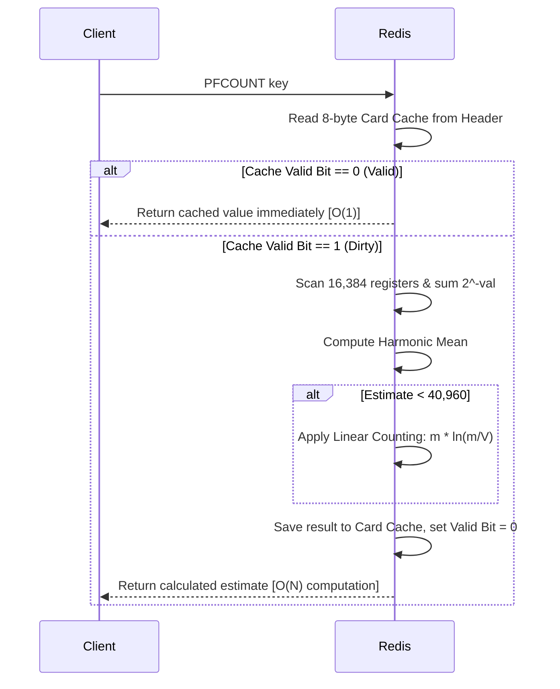

# 17 — Redis HyperLogLog: Mathematical Foundation & Internals

> To count 100M unique user IDs exactly, a Redis Set takes **hundreds of megabytes**. Redis HyperLogLog (HLL) does it in a **fixed 12 KB** with a standard error of **0.81%**. This chapter covers the mathematical engine behind this black magic, how Redis packs 6-bit registers into a raw byte array, the transition from sparse to dense encodings, and how to defend HLL in system design interviews.

---

## Quick Summary (TL;DR)
- **What**: HyperLogLog is a probabilistic data structure that estimates the cardinality (number of unique elements) of a set without storing the actual elements.
- **Scale**: Fixed memory footprint of **12 KB** (plus a 16-byte header) for the dense representation, capable of counting up to $2^{64}$ elements.
- **Key Equation**: Uses the **harmonic mean** of leading-zero run-lengths across $16,384$ registers to compute the estimate.
- **Optimizations**:
  - Starts as a **Sparse** RLE-compressed representation for low cardinalities (a few bytes to 3 KB) and promotes to a **Dense** representation (12 KB flat array of 6-bit registers) once it hits `hll-sparse-max-bytes`.
  - Uses **Linear Counting** at low cardinalities (when many registers are 0) to bypass harmonic mean bias.
  - Caches the estimated cardinality in the header so subsequent `PFCOUNT` calls are $O(1)$ read ops.

---

## Noob Jargon Buster

* **Cardinality**: The count of unique items in a dataset. For `[A, B, A, C]`, the cardinality is 3.
* **Bernoulli Trial**: An experiment with exactly two outcomes (e.g., flipping a coin: heads or tails).
* **Standard Error**: The typical standard deviation of the error relative to the actual value. A standard error of $0.81\%$ means that if the true unique count is 1,000,000, roughly 68% of the estimates will fall between 991,900 and 1,008,100 ($\pm 0.81\%$).
* **Harmonic Mean**: The reciprocal of the arithmetic mean of the reciprocals: $\frac{n}{\sum (1/x_i)}$. It penalizes extremely large values (outliers) and is crucial in HLL to prevent a single lucky hash with a massive run of zeros from ruining the average.
* **Run-Length Encoding (RLE)**: A compression technique that stores repeated data values as a single value and count (e.g., storing fifteen zeros as `(0, 15)` instead of `0,0,0...`).
* **Bit Slicing / Packing**: The process of reading and writing values whose sizes do not align with standard 8-bit byte boundaries (like HLL's 6-bit registers).

---

## 1. The Core Problem: Why Exact Counting Fails at Scale

To count unique items exactly, you must store them to perform duplicate checking. 

### Memory Growth: Set vs. HyperLogLog
Suppose you want to track daily unique visitors (UV) for a high-traffic fintech site.
- **User ID size**: 36-byte UUID strings or 8-byte integers.
- **Cardinality**: 50,000,000 unique users.

| Data Structure | Math / Overhead | Total Memory for 50M Uniques | Membership Check? | Exact? |
| :--- | :--- | :--- | :--- | :--- |
| **Redis Set (Intset/Hashtable)** | 50M × (8 bytes + 32-byte dictEntry + jemalloc padding) | **~1.6 GB** | Yes (`SISMEMBER`) | Yes (100% accurate) |
| **Redis Set (String UUIDs)** | 50M × (36 bytes + dictEntry + sds header + padding) | **~3.2 GB** | Yes (`SISMEMBER`) | Yes (100% accurate) |
| **Redis HyperLogLog** | Fixed 12,288 bytes + 16-byte header | **12 KB** | No | No ($\approx 0.81\%$ error) |

If you have 10,000 campaigns or trading symbols to track independently, storing exact sets requires **terabytes** of RAM. HyperLogLog solves this by compressing the representation of unique elements into a fixed-size signature.

---

## 2. The Mathematical Foundation: How HLL Estimates Uniques

### The Coin Toss Intuition
Imagine flipping a fair coin repeatedly and recording the results:
- Game 1: `H, T` $\rightarrow$ Max consecutive tails before first heads = 1
- Game 2: `T, T, H` $\rightarrow$ Max consecutive tails before first heads = 2
- Game 3: `T, T, T, T, H` $\rightarrow$ Max consecutive tails before first heads = 4

If someone tells you, *"In my longest run, I got 10 tails in a row before a head,"* you can statistically estimate they played around $2^{10} = 1024$ flips. It is highly unlikely to get 10 consecutive tails in a few flips. 

In computer science, we replace coin flips with a **cryptographic hash function**.
1. Hash an input value (like user ID) to a 64-bit uniform binary stream.
2. The individual bits of the hash act like independent, fair coin flips (0 or 1 with 50% probability).
3. We scan the bits from left to right and find the position of the first `1` bit. A run of $k$ consecutive zeros indicates that we've probably hashed roughly $2^{k+1}$ unique items.

```
Input: "user_94821" ──► Hash ──► 0000010110...01 ──► First '1' is at index 6 (5 leading zeros).
Estimate: We need roughly 2^6 = 64 unique elements to statistically observe 5 leading zeros.
```

### The Problem of High Variance
A single hash function is highly volatile. If your very first user hashes to a value starting with 20 zeros, your estimate will jump to $2^{20} \approx 1,000,000$ immediately.

To solve this, HLL uses **LogLog Register Multiplexing**:
1. Divide the single estimate into $m$ independent sub-estimates (registers).
2. Redis uses $m = 16,384$ registers ($2^{14}$).
3. When an element is added, we use the first 14 bits of its hash to select which register to update.
4. We use the remaining 50 bits of the hash to count the leading zeros, and update the selected register with the maximum run-length seen so far.

```mermaid
flowchart TD
    Elem[Element: user_123] --> Hash[64-bit MurmurHash2]
    Hash --> Split{Split Hash}
    Split -->|First 14 bits| RegIdx[Register Index\n0 to 16,383]
    Split -->|Remaining 50 bits| RunCount[Find position of first 1-bit\nRun-length R]
    RegIdx --> Update[Register M[Idx] = max(M[Idx], R)]
```

### The HyperLogLog Formula
Instead of taking the arithmetic mean of the registers (which is heavily biased by outlier registers that got lucky long runs), HyperLogLog uses the **harmonic mean** of the registers.

The mathematical formula for the raw estimate $E$ is:

$$E = \alpha_m \cdot m^2 \cdot \left( \sum_{i=0}^{m-1} 2^{-M[i]} \right)^{-1}$$

Where:
- $m$ is the number of registers ($16,384$ in Redis).
- $M[i]$ is the value of the $i$-th register.
- $\alpha_m$ is a correction factor to resolve bias caused by hash collisions on small values, defined as:

$$\alpha_m = \frac{0.7213}{1 + 1.079/m} \approx 0.7213 \text{ for } m = 16,384$$

- The standard error is given by:

$$\text{Standard Error} = \frac{1.04}{\sqrt{m}} = \frac{1.04}{\sqrt{16,384}} \approx 0.8125\%$$

---

## 3. Redis-Specific Implementation: The 12 KB Magic

### Why 12 KB? (The Bit-Slicing Math)
How does Redis store the registers, and where does the "12 KB" memory number come from?

1. **Number of registers ($m$)**: $16,384$.
2. **Bits per register**: 
   - The remaining part of the 64-bit hash used to search for the first `1` bit is $64 - 14 = 50$ bits.
   - The maximum possible index of the first `1` bit is 50 (if the first 49 bits are zero and the 50th bit is one).
   - To store a number up to 50 in binary, we need $6$ bits ($2^6 = 64 \ge 50$).
3. **Total memory calculation**:
   $$\text{Total Bits} = 16,384 \text{ registers} \times 6 \text{ bits/register} = 98,304 \text{ bits}$$
   $$\text{Total Bytes} = \frac{98,304 \text{ bits}}{8 \text{ bits/byte}} = 12,288 \text{ bytes} = 12 \text{ KB}$$

### The Redis HLL Header (16 bytes)
Redis wraps the 12,288 bytes of register data in a small 16-byte header to make operations efficient.

| Field | Size | Description |
| :--- | :--- | :--- |
| **Magic** | 4 bytes | Set to `HYCL` (HyperLogLog Card Limit) to identify the structure. |
| **Encoding** | 1 byte | `0` = Dense encoding, `1` = Sparse encoding. |
| **Reserved** | 3 bytes | Reserved for future use (zero-filled). |
| **Card Cache** | 8 bytes | Stores the cached result of the last computed cardinality. The MSB (most significant bit) is used as a **dirty/valid bit** (`1` = cache invalid/dirty, `0` = cache valid). |

```
┌──────────────────────────────────────────────────────────┐
│                    REDIS HLL STRUCTURE                   │
├──────────────┬──────────┬──────────┬─────────────────────┤
│ Magic (4B)   │ Enc (1B) │ Res (3B) │ Card Cache (8B)     │ ◄─── Header (16 bytes)
│ "HYCL"       │ 0 or 1   │ 00 00 00 │ [Valid Bit + Value] │
├──────────────┴──────────┴──────────┴─────────────────────┤
│ 16,384 Registers packed as 6-bit chunks                  │ ◄─── Register Data (12,288 bytes)
│ [Reg 0: 6b][Reg 1: 6b][Reg 2: 6b] ... [Reg 16383: 6b]     │
└──────────────────────────────────────────────────────────┘
```

---

## 4. Encodings: Sparse vs. Dense

Allocating 12 KB for an HLL that only contains 5 or 10 elements is extremely wasteful when scaled to millions of keys. To solve this, Redis employs two internal representations:

### 4.1 Sparse Encoding
When a HyperLogLog is newly initialized, it starts in the **Sparse** representation. The registers are mostly 0, so Redis compresses them using a custom Run-Length Encoding (RLE) format with three opcodes:

1. **ZERO Opcode (1 byte)**: `00xxxxxx` (where `xxxxxx` is a 6-bit count).
   - Represents a run of $1$ to $64$ consecutive registers containing 0.
2. **XZERO Opcode (2 bytes)**: `01xxxxxxxxxxxxxx` (where `xxxxxxxxxxxxxx` is a 14-bit count).
   - Represents a run of $1$ to $16,384$ consecutive registers containing 0.
3. **VAL Opcode (1 byte)**: `1vvvvvxx` (where `vvvvv` is a 5-bit register value, and `xx` is a 2-bit run length).
   - Represents a run of $1$ to $4$ consecutive registers containing a non-zero value up to $32$.

#### Example:
A newly created HLL key contains $16,384$ zero registers. 
- In **Dense** mode, it takes **12,288 bytes**.
- In **Sparse** mode, it is represented by a single **XZERO opcode** indicating a run of 16,384 zeros, taking only **2 bytes** of register payload!

### 4.2 Conversion to Dense
As you add more elements, the registers populate, values exceed 32, and the RLE format becomes less efficient. 
- Redis monitors the size of the sparse representation. 
- When the size exceeds the configuration parameter **`hll-sparse-max-bytes`** (default **`3000` bytes**), or when a register value exceeds **`32`** (which cannot be represented by the VAL opcode's 5-bit value field), Redis automatically converts the key to **Dense representation**.
- Once converted to dense, a key **never** demotes back to sparse (unless overridden by overwriting or copying).

```
[Sparse Key (RLE)] ───► PFADD elements ───► Size exceeds 3,000 bytes OR Val > 32 ───► Promotes to [Dense Key (12 KB)]
```

---

## 5. Correction Algorithms at the Extremes

The raw HLL harmonic mean formula is inaccurate when cardinalities are very small (many registers are still 0) or extremely large (hash collisions occur). Redis implements mathematical overrides at these limits:

### 5.1 Low Cardinality: Linear Counting
When the raw estimate $E < \frac{5}{2} m$ (which is $E < 40,960$ for $m=16,384$), the estimate suffers from high bias. Redis discards the harmonic mean and switches to **Linear Counting**:

$$E^* = m \ln\left(\frac{m}{V}\right)$$

Where:
- $m = 16,384$
- $V$ is the number of registers equal to zero.
- As long as at least one register is 0 ($V > 0$), this formula provides an extremely precise estimate for low-range datasets.

### 5.2 High Cardinality Correction
For extremely large datasets where estimates approach $2^{32}$ (which was the limit of older 32-bit hashing architectures), hash collisions begin to skew results. If $E > \frac{1}{30} 2^{32} \approx 143,165,576$, Redis applies the following correction:

$$E^* = -2^{32} \ln\left(1 - \frac{E}{2^{32}}\right)$$

*Note: Modern Redis uses a 64-bit hash (MurmurHash2), making this high-cardinality saturation correction mathematically redundant for realistic cardinalities, but the logic remains preserved in the source code for safety.*

---

## 6. E2E Commands Flow & Internals

### 6.1 `PFADD key element`
How does Redis read and write 6-bit registers that are packed across byte boundaries?

Since 6 is not a divisor of 8, registers overlap bytes. For instance:
- Register 0 occupies bits 0 to 5 of Byte 0.
- Register 1 occupies bits 6 and 7 of Byte 0, and bits 0 to 3 of Byte 1.
- Register 2 occupies bits 4 to 7 of Byte 1, and bits 0 and 1 of Byte 2.

```
Byte 0:          Byte 1:          Byte 2:
[0 1 2 3 4 5][6 7 0 1 2 3][4 5 6 7 0 1][2 3 4 5 6 7]
└─ Register 0 ─┘└─ Register 1 ─┘└─ Register 2 ─┘
```

#### Writing Step-by-Step:
1. Hash the element using MurmurHash2 to get a 64-bit value.
2. Index = lower 14 bits (ranges from 0 to 16,383).
3. Value = leading-zero count on the upper 50 bits + 1.
4. Calculate the bit offset: $bit\_offset = index \times 6$.
5. Determine target bytes: $byte\_idx = \lfloor bit\_offset / 8 \rfloor$ and $bit\_shift = bit\_offset \bmod 8$.
6. Read the current 6-bit value using bit masks:
   ```c
   // Redis t_hll.c dense register read concept
   unsigned char *p = dense_bytes + byte_idx;
   unsigned int current_val = (((p[0] | p[1] << 8) >> bit_shift) & 63);
   ```
7. If the new `Value` > `current_val`:
   - Write the new value back to the overlapping bytes using masks.
   - **Invalidate the cached cardinality** in the header by setting the dirty bit (MSB of Card Cache to 1).
   - Return 1.
8. If the new `Value` $\le$ `current_val`, do nothing and return 0.

### 6.2 `PFCOUNT key`
1. Read the Card Cache in the 16-byte header.
2. If the MSB (dirty bit) is `0`, the cache is valid. **Return the cached value instantly** ($O(1)$ read path).
3. If the dirty bit is `1`:
   - Scan all 16,384 registers (if dense, iterate 12,288 bytes; if sparse, decompress RLE on the fly).
   - Sum $2^{-M[i]}$ for all registers. To make this extremely fast, Redis uses a precomputed lookup table containing floating-point values of $2^{-x}$ for $x \in [0, 64]$.
   - Calculate raw estimate $E$ using the harmonic mean.
   - Apply Linear Counting if $E < 40,960$.
   - Save the result in the Card Cache, set the dirty bit to `0` (valid).
   - Return the result.



### 6.3 `PFMERGE destkey sourcekey1 sourcekey2 ...`
To union multiple HyperLogLogs:
1. Initialize `destkey` as an empty HLL.
2. For each register index $i \in [0, 16,383]$:
   - Read the value of register $i$ across all source HLLs.
   - Set the register $i$ in `destkey` to the maximum of those values:
     $$M_{dest}[i] = \max(M_{src1}[i], M_{src2}[i], M_{src3}[i], \dots)$$
3. Invalidate the Card Cache of `destkey`.
4. This operation is **lossless** (the accuracy of the merged HLL is exactly the same as if all elements were added to a single HLL from the beginning).

---

## 7. Interview Angles: Defending Your Architecture

### Q: How do you explain the concept of HyperLogLog to a non-technical interviewer vs. a Principal Engineer?
- **To a non-technical interviewer**: 
  > "Think of HLL like a coin-flipping experiment. If you flip a coin and get 10 tails in a row before your first head, I can guess you've been sitting there flipping coins for a long time. HLL applies this exact probability principle by using a mathematical hash function on incoming data to act like coin flips. By keeping track of the longest run of zeros, it estimates how many unique visitors we have without needing to write down their names."
- **To a Principal Engineer**: 
  > "Redis HyperLogLog uses a 64-bit MurmurHash2 to partition the key space. It uses stochastic averaging across $16,384$ registers (selected via the lower 14 bits of the hash) to minimize estimation variance. Each register stores the maximum run-length of leading zeros observed in the remaining 50 bits of the hash. Using 6 bits per register, it packs the state into a fixed 12 KB payload. To eliminate bias at low cardinalities, it swaps the harmonic mean estimator for Linear Counting based on the number of empty registers."

### Q: Why does `PFCOUNT` sometimes write to the database? Why is this a replication risk?
- **Answer**: 
  > "On a newly modified or sparse HLL, `PFCOUNT` needs to compute the cardinality and update the cached estimation inside the 16-byte header. If the HLL is in sparse format, calculating this count might also trigger an encoding upgrade to dense if the memory threshold is exceeded. 
  > This means a read command (`PFCOUNT`) can perform a write under the hood. In older Redis master-replica configurations, executing `PFCOUNT` on a read-only replica could fail or cause state divergence unless the replica allowed local modifications or handled the execution lazily. Redis resolved this in modern versions by calculating the value in memory without writing the cache back to the header if the node is a read-only replica."

### Q: Compare Bloom Filters, Bitmaps, and HyperLogLogs. When do you use which?

| Structure | Memory Cost | Primary Query | Can add items? | Can merge? | Accuracy |
| :--- | :--- | :--- | :--- | :--- | :--- |
| **Set** | Linear $O(N)$ | "List all elements" or "Is X in the set?" | Yes | Yes (`SUNION`) | 100% |
| **Bloom Filter** | Fixed $O(M)$ (ranges from KB to MB) | "Is X *probably* in the set?" (Membership) | Yes | Yes (if same size & hash functions) | Probabilistic (false positives, no false negatives) |
| **Bitmap** | Max offset-dependent (up to 512 MB) | "Did user ID $N$ perform action $X$?" | Yes | Yes (`BITOP`) | 100% (exact flags) |
| **HyperLogLog** | Fixed **12 KB** | "How many unique items are there?" (Cardinality) | Yes | Yes (`PFMERGE`) | Probabilistic ($\approx 0.81\%$ standard error) |

- **Use HLL** when you need **global counts** (e.g., UV counts, unique API requests, unique search queries) and do not care about identifying *who* the users were.
- **Use Bloom Filter** when you need **membership checks** to prevent database lookups (e.g., "Has this user ID already registered?").
- **Use Bitmap** when you have **dense integer IDs** and need exact boolean flags per user (e.g., daily active user flag).

### Q: What is the main performance risk when using `PFMERGE` in a single-threaded Redis instance?
- **Answer**: 
  > "While `PFCOUNT` on a single key is $O(1)$ due to the header cache, `PFMERGE` is $O(N)$ where $N$ is the number of HLL keys being merged times the number of registers ($16,384$). If an application attempts to merge 1,000 monthly HLL keys on the fly during a user request, Redis has to iterate through $16,384$ registers for all 1,000 keys to compute the maximum value for each slot. This blocks the single thread for several milliseconds, stalling all other client requests. To mitigate this, `PFMERGE` operations should be run offline by a background worker, or aggregated pre-emptively (e.g., updating a weekly HLL daily rather than unioning 7 keys on the fly)."

---

## 8. One-Line Recall Cards

* **HyperLogLog** counts unique elements in a fixed **12 KB** payload with a **0.81%** standard error — stores no elements, provides no membership checks.
* **12 KB math**: $16,384$ registers ($2^{14}$) $\times$ $6$ bits per register (to store values up to 50 leading zeros) $= 12,288$ bytes.
* **Harmonic Mean** ($\frac{n}{\sum (1/x_i)}$) is used in HLL to down-weight outlier registers and prevent luck-based hash anomalies from skewing results.
* **Linear Counting** ($m \ln(m/V)$) is used as an override for small cardinalities ($E < 40,960$) to correct estimation bias.
* **Sparse Encoding** compresses empty registers using **Run-Length Encoding (RLE)** to save space (often down to a few bytes) until it hits the `hll-sparse-max-bytes` threshold (3000 bytes).
* **Card Cache** (8 bytes) stores the last computed estimation; the MSB acts as a **dirty/valid bit** to allow $O(1)$ subsequent reads.
* **PFMERGE** is a simple index-by-index `max()` operation across all registers of the source HLLs — mathematically lossless but $O(N)$ over keys merged.
* HLL is **read-only** under the hood *only* when the cache is valid; a dirty cache forces an $O(m)$ register scan to recalculate.

---

**Next:** back to the [Redis index](index.md) — or explore [14 — Specialized Data Types](14-specialized-data-types.md) for Bitmaps and Geo.
