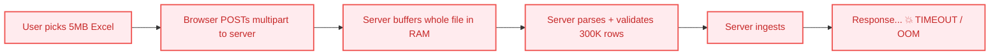
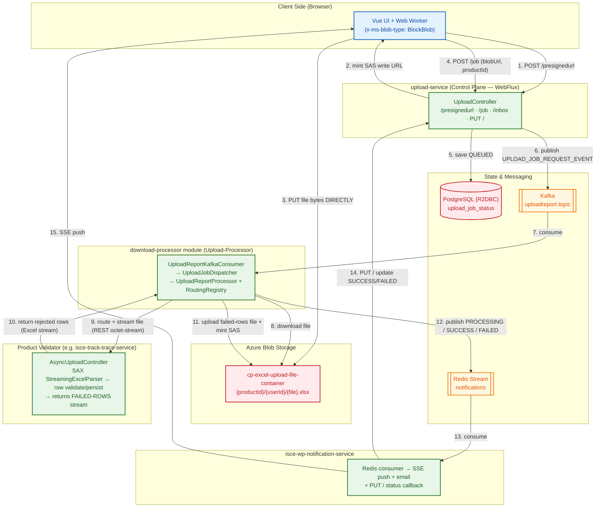
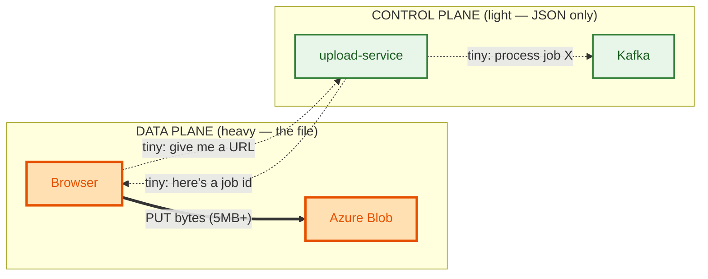
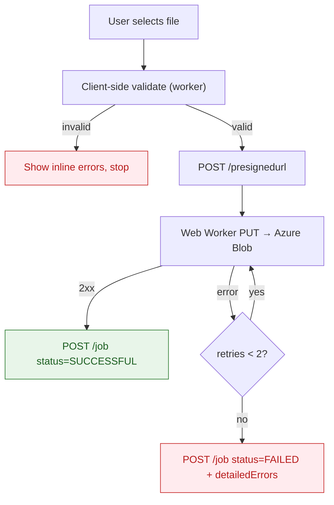
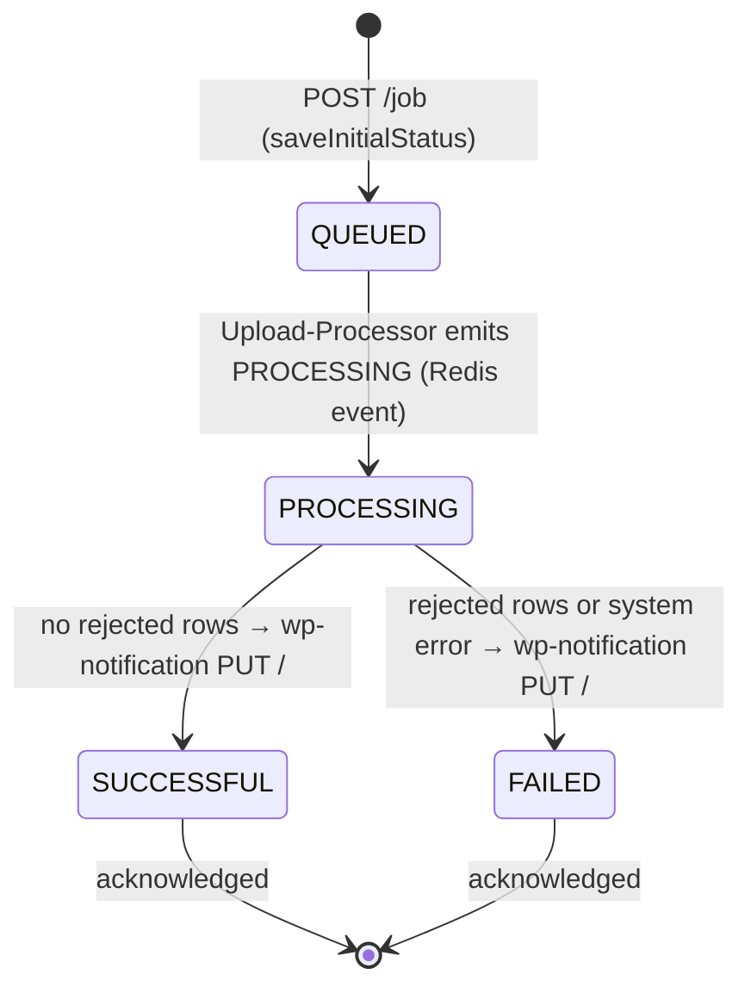
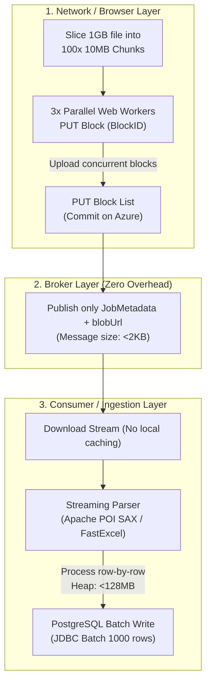

# Async File Upload Pipeline — Complete Beginner-Friendly Interview Guide

> **Resume Line:** *"Built a Kafka-based asynchronous bulk file-upload pipeline using presigned (SAS) URLs for direct browser-to-cloud transfer, offloading multi-MB Excel uploads off the app server and routing files to SAX-streaming product-side validators, with real-time SSE status tracking."*

> **Companion doc:** This is the *reverse* pipeline to [`async-report-download-pipeline.md`](./async-report-download-pipeline.md). Download = server **generates** a file and hands it to the user. Upload = user **sends** a file in, and downstream services ingest it. Both live in the `isce-reporting-tool` monorepo and share the same notification platform ([`sse-notification-platform.md`](./sse-notification-platform.md)).

---

## 📖 Jargon Buster: Cheat Sheet for Beginners

| Term | What it is | Everyday Analogy |
| :--- | :--- | :--- |
| **Presigned URL / SAS URL** | A temporary, cryptographically-signed link that grants a browser permission to **write** a file straight into cloud storage, without any password. | A one-time keycard the hotel front desk hands you — it opens *only* room 402, and *only* until midnight. |
| **Direct-to-Blob Upload** | The browser uploads the file *straight* to Azure Blob Storage — the file bytes never pass through our server. | Couriering a parcel directly to the warehouse instead of dropping it at the reception desk to be forwarded. |
| **Control Plane vs Data Plane** | The *control plane* handles metadata/coordination (job IDs, status). The *data plane* is the actual bulk data (the file). We keep them separate. | An air-traffic controller (control plane) directs planes but never flies them; the planes (data plane) carry the actual passengers. |
| **Web Worker** | A background JavaScript thread in the browser that runs work off the main UI thread. | A prep cook in the back kitchen chopping vegetables so the waiter out front stays free to take orders. |
| **BlockBlob** | Azure's storage format for uploading a file as a single block or set of blocks (`x-ms-blob-type: BlockBlob`). | Shipping a package as one labeled box rather than loose items. |
| **Kafka** | A durable digital conveyor belt that passes "a file was uploaded, please process it" messages to other services. | An order rail in a kitchen — the waiter clips a ticket, a chef grabs it later. |
| **Upload-Processor** | The Kafka consumer (lives in the `download-processor` module) that picks up the job, downloads the file from blob, and hands it to the right product service. | The kitchen expediter who grabs the ticket, fetches the raw ingredients, and routes them to the correct specialist station. |
| **Routing Registry** | A config map (`UploadRoutingRegistry`) that resolves `productId + uploadType` → which product service endpoint validates it. | The expediter's cheat-sheet: "Subscription tickets → grill station; Flexi tickets → salad station." |
| **Product Validator** | The domain service (e.g. `isce-track-trace-service`) that receives the streamed file over REST, runs row-level validation, persists valid rows, and returns the *rejected rows* as an Excel stream. | The specialist chef who actually inspects each ingredient and hands back the ones that failed inspection. |
| **Status Callback** | After processing, the notification service calls the upload-service API back to say "done — mark this job SUCCESSFUL/FAILED." | The pickup bell that updates the order screen. |
| **R2DBC** | Reactive, non-blocking PostgreSQL driver. Talks to the DB without freezing threads. | Emailing a request instead of holding on a phone line until it's resolved. |
| **Spring WebFlux (Netty)** | Non-blocking web framework running on an event loop — handles many connections with few threads. | One fast bartender serving a whole line by moving down it, not one bartender per customer. |
| **SSE (Server-Sent Events)** | A one-way live pipe from server → browser for real-time updates. | A departures board that refreshes itself without you asking. |
| **Idempotency** | Doing the same operation twice produces the same result — no duplicates. | Pressing the elevator button 10 times doesn't summon 10 elevators. |
| **Path Traversal (`../`)** | An attack where a crafted filename escapes the intended folder to reach other files. | Sneaking `../../` into a locker number to open the manager's safe instead of your locker. |

---

## Table of Contents

1. [The Problem — Why This Exists](#1-the-problem)
2. [The Solution in One Picture](#2-the-solution-in-one-picture)
3. [End-to-End Flow for a Complete Beginner](#3-end-to-end-flow-for-a-complete-beginner)
4. [The Big Idea — Direct-to-Blob Upload (Control Plane vs Data Plane)](#4-the-big-idea)
5. [System Architecture Deep Dive](#5-system-architecture-deep-dive)
6. [Component-by-Component Code Breakdown](#6-component-by-component-breakdown)
7. [The Browser Side — Web Worker Upload & Client Validation](#7-the-browser-side)
8. [Notification System — SSE + Redis (Shared Platform)](#8-notification-system)
9. [Retry, Failure Handling & Edge Cases](#9-retry-failure-handling--edge-cases)
10. [Security Deep Dive — Presigned URLs & Path Sanitization](#10-security-deep-dive)
11. [Database Schema & Job Lifecycle](#11-database-schema--job-lifecycle)
12. [API Contract Reference](#12-api-contract-reference)
13. [Kafka Design Decisions](#13-kafka-design-decisions)
14. [Architectural Trade-Off Deep Dives](#14-architectural-trade-off-deep-dives)
15. [Production Config That Matters](#15-production-config-that-matters)
16. [Interview Q&A — 30 Key Questions & Answers](#16-interview-qa)

---

## 1. The Problem

### What Was Happening Before (Synchronous Upload Through the Server)

Operations teams need to bulk-load data — thousands of subscription rows, flexi shipment records — from Excel files. The naive design routes the whole file *through* the application server:



| Technical Problem | Plain English | Business Impact |
| :--- | :--- | :--- |
| **Gateway Timeout (60s)** | The gateway kills any request that runs longer than ~60s. Parsing + validating a big file takes minutes. | Large uploads always failed with `504`. |
| **Memory Explosion** | The server buffers the entire multipart file (plus the parsed object graph) in RAM. 20 concurrent uploads = several GB. | `OutOfMemoryError`, pod crashes taking out *other* users. |
| **Thread Starvation** | Each upload pins a request thread for the full parse/validate/ingest duration. | 10 concurrent uploads froze the whole service. |
| **Bandwidth Double-Hop** | Bytes travel browser → server → blob. The server pays ingress *and* egress bandwidth for data it doesn't even own. | Wasted network, higher cost, slower uploads. |
| **Tight Coupling** | The generic "upload" endpoint had to *know* how to validate subscription data, metering data, flexi data… every product baked in. | Every new product = redeploy the upload service. |
| **No Visibility** | Spinner until it finished or died. | Users didn't know if a 4-minute upload was working or hung. |

**Real Customer Impact:** Customers uploading bulk subscription and flexi files (hundreds of thousands of rows) hit timeouts and got no feedback, blocking onboarding and bulk configuration.

---

## 2. The Solution in One Picture

We flipped the model. The browser talks to cloud storage **directly** using a short-lived signed key; the `upload-service` only ever handles small JSON control messages. The file is picked up asynchronously by an **Upload-Processor**, which streams it to whichever **product service** owns that data for validation.



**Core Design Idea:**
The heavy thing (the file) goes browser → cloud **directly**. The `upload-service` only shuffles tiny JSON envelopes (a signed URL out, a job record in). An asynchronous **Upload-Processor** then downloads the file and **routes it by `productId`/`uploadType`** to the product service that owns the domain rules — which validates it and returns only the *rejected* rows. Notifications and the DB status update flow back through Redis Streams and a dedicated notification service.

---

## 3. End-to-End Flow for a Complete Beginner

### The Warehouse Drop-Off Analogy

| Warehouse Scenario | Our Technical System |
| :--- | :--- |
| **1.** You call the depot: "I want to drop a pallet for the Subscription dock." | Browser calls `POST /presignedurl` with the product + filename. |
| **2.** They text you a one-time gate code good for 48 hours for bay #402. | `upload-service` returns a **SAS URL** (signed, write-only, scoped to your file path, 48h expiry). |
| **3.** You drive straight to bay #402 and unload — you never enter the front office. | The browser **PUTs the file bytes directly to Azure Blob**. The server sees none of it. |
| **4.** You leave a slip at reception: "Pallet dropped, it's for Subscriptions, here's the bay." | Browser calls `POST /job` with the `blobUrl` + `productId`. Server saves a `QUEUED` record and drops a Kafka ticket. |
| **5.** An expediter grabs the ticket, fetches your pallet, and wheels it to the correct inspection station. | The **Upload-Processor** (Kafka consumer) downloads the file from blob and routes/streams it to the right **product service** by `productId`. |
| **6.** The inspector checks each box, keeps the good ones, and hands back a crate of the rejects. | The **product validator** (e.g. track-trace) SAX-parses the file, persists valid rows, and returns the **rejected rows** as an Excel stream. |
| **7.** The reject crate is stored in a labelled locker, and the office logs the outcome. | The processor uploads the failed-rows Excel to blob (fresh SAS URL) and publishes `SUCCESS`/`FAILED` to Redis; the notification service writes the DB status. |
| **8.** Your phone buzzes: "Your drop-off is processed." | Redis → notification-service → SSE pushes the alert; the bell badge increments. |

---

### The Actual Technical Steps

#### Step 1 — Browser requests a presigned upload URL
```http
POST /presignedurl
Content-Type: application/json

{
  "productId": "SUBSCRIPTION",
  "fileName": "jan_subscriptions",
  "contentType": "application/vnd.openxmlformats-officedocument.spreadsheetml.sheet"
}
```
`UploadJobManager.generatePresignedUrl()` builds a sanitized blob path (`{productId}/{sanitizedUserId}/{sanitizedFileName}.xlsx`) and asks `PresignedUrlServiceImpl` to mint an Azure SAS token valid for **48 hours** (`BlobConstants.VALID_HOURS = 48`) with **Create + Write + Add + Read** permissions.

**Response:**
```json
{
  "blobUrl": "https://acct.blob.core.windows.net/cp-excel-upload-file-container/SUBSCRIPTION/u123/jan_subscriptions.xlsx?sv=...&sig=...",
  "expiryTime": "2026-07-06T10:15:00Z"
}
```

#### Step 2 — Browser uploads the file *directly* to Azure (in a Web Worker)
A dedicated Web Worker (`uploadWorkers.ts`) does an `XMLHttpRequest` **PUT** straight to that URL:
```js
xhr.open("PUT", uploadUrl, true);
xhr.setRequestHeader("x-ms-blob-type", "BlockBlob");
xhr.timeout = 60000;
xhr.send(file);   // raw file bytes → Azure. Server never sees them.
```
Progress events (`xhr.upload.onprogress`) drive the UI progress bar. On network/timeout failure the util retries up to `MAX_RETRIES = 2`.

#### Step 3 — Browser creates the job record
Once the PUT succeeds:
```http
POST /job
SOURCE-SYSTEM: ISCE-CP-UI

{
  "productId": "SUBSCRIPTION",
  "uploadType": "SUBSCRIPTION_UPLOAD",
  "blobUrl": "https://.../jan_subscriptions.xlsx?...",
  "fileName": "jan_subscriptions",
  "status": "SUCCESSFUL",
  "transportMode": "OCEAN",
  "detailedErrors": []
}
```
`UploadJobManager.handleJobRequest()` builds an `UploadJobRequestDTO` (attaching `customerCode`/`userId` from the `TenantDetails`), then `JobPublisherService.publishJob()`:
1. Generates a `jobId = UUID`.
2. `saveInitialStatus()` → inserts a row in `upload_job_status` (**QUEUED**).
3. Publishes `UPLOAD_JOB_REQUEST_EVENT` to the Kafka topic.
4. Returns the `jobId` instantly (< 50ms).

#### Step 4 — Upload-Processor picks up the job (in the `download-processor` module)
`UploadReportKafkaConsumer` consumes `UPLOAD_JOB_REQUEST_EVENT`; `UploadJobDispatcher.dispatch()` then:
1. Publishes a **`PROCESSING`** notification to the Redis Stream.
2. `blobPublisher.downloadReportFromBlob(blobUrl)` — streams the uploaded file back out of blob.
3. Hands the stream to `UploadReportProcessor.generateReport()`.

#### Step 5 — Processor routes the file to the owning product service
`UploadReportProcessor` uses `UploadRoutingRegistry.resolve(productId, uploadType)` to pick a `WebClient` + endpoint, then **streams the file as `application/octet-stream`** (with `username`/`customerCode`/`transportMode`/`features` as query params) to that product service — e.g. `isce-track-trace-service` → `POST /flex-user-references-upload`.

The product service (`AsyncUploadController` → `ExcelStreamProcessorService`) does the real work:
- **`StreamingExcelParser`** — SAX streaming parse (`OPCPackage` + `XSSFReader` + `XSSFSheetXMLHandler`) → `Flux<RowData>`, constant memory.
- **`BusinessRowProcessor`** — validates + maps each row (concurrency **50**) and persists valid rows via `UserReferenceService.saveUserReferences(...)`.
- **`FailedReportGenerator`** — builds an Excel of only the **rejected rows**, streamed back in the HTTP response (empty response = all rows valid).

#### Step 6 — Processor finalizes: blob + Redis
Back in `UploadJobDispatcher`, it `collectList()`s the returned bytes:
- **No rejected rows** → publish `UploadNotification.success(...)` to the Redis Stream.
- **Rejected rows returned** → `uploadFailedReport(...)` writes the failed-rows Excel to blob under `{jobId}.xlsx`, `generateFailedSignedUrl(...)` mints a 48h SAS URL, then publish `UploadNotification.failedWithReport(..., signedUrl)`.
- **System error** → publish `UploadNotification.failedSystem(...)`.

#### Step 7 — Notification service updates DB + notifies the user
`isce-wp-notification-service` consumes the Redis Stream and:
- Calls the upload-service **`PUT /`** status callback (`UpdateStatusClient` → `JobStatusService.updateJobStatus()`), which loads the row and writes `job_status`/`message`/`error_file_url`/`expiry_time`.
- Pushes the alert to the browser via **SSE** (and email). The user opens their **inbox** (`GET /inbox`) to download the rejected-rows file.

> **Note:** The `POST /job` `status` field the browser sends only reflects whether the *upload to blob* succeeded — it is **not** the validation outcome. The authoritative `SUCCESSFUL`/`FAILED` verdict is written later by the notification service after the product service reports back.

---

## 4. The Big Idea

### Direct-to-Blob Upload = Control Plane / Data Plane Separation

This is the single most important thing to articulate in an interview. **The file bytes never touch the `upload-service`.**



**Why this matters:**

| Concern | Naive (through-server) | Direct-to-Blob (our design) |
| :--- | :--- | :--- |
| **App server memory** | Buffers whole file → OOM risk | Sees only small JSON → flat memory |
| **App server threads** | Pinned for minutes per upload | Freed in milliseconds |
| **Bandwidth** | Server pays ingress **and** egress | Server pays neither; Azure absorbs it |
| **Scalability** | Bounded by app-server capacity | Bounded by Azure (effectively unlimited) |
| **Gateway timeout** | Big files always exceed 60s | Control calls are all sub-second |

And **decoupled domain validation** means the generic `upload-service` never learns product-specific rules. A new product is onboarded by adding one entry to the `UploadRoutingRegistry` (product → validation endpoint) and implementing that endpoint — no change to `upload-service` or the processor's core loop. This is the classic *generic transport, specialized processing* split.

---

## 5. System Architecture Deep Dive

### 5.1 Monorepo Placement

```
isce-reporting-tool/
├── download-common-module/          # Shared models (UploadJobRequestDTO, JobStatusUpdateRequest, enums)
│   └── com/maersk/isce/model/
│       ├── UploadJobRequestDTO.java     # Kafka payload + DTO (fileName, blobUrl, productId, uploadType, detailedErrors…)
│       └── JobStatusUpdateRequest.java  # Status callback body
│   └── com/maersk/isce/enums/
│       ├── UploadType.java              # SUBSCRIPTION_UPLOAD | FLEXI_UPLOAD
│       └── JobStatus.java               # QUEUED | IN_PROGRESS | SUCCESSFUL | FAILED
│
├── upload-service/                  # ← THIS SERVICE (control plane, WebFlux + R2DBC)
│   └── com/maersk/isce/upload/service/
│       ├── controller/UploadController.java        # /presignedurl, /job, PUT /, /{jobId}, /inbox, /acknowledge
│       ├── manager/UploadJobManager.java           # Orchestration + tenant extraction + blob path building
│       ├── services/
│       │   ├── JobPublisherService.java            # save QUEUED → publish Kafka
│       │   ├── PresignedUrlServiceImpl.java        # Azure SAS token minting (impl of BlobPublisher)
│       │   ├── JobStatusService.java               # R2DBC CRUD + status callback + inbox
│       │   └── BlobPublisher.java                  # interface
│       ├── publisher/KafkaPublisher.java           # reactive KafkaTemplate wrapper + metrics
│       ├── repository/UploadStatusRepository.java  # ReactiveCrudRepository + @Query inbox/acknowledge
│       ├── domain/UploadJobEntity.java             # @Table upload_job_status, Persistable<String>
│       ├── utils/BlobPathSanitizer.java            # anti path-traversal + URL encoding
│       └── configurations/
│           ├── AzureBlobStorageConfig.java         # BlobContainerAsyncClient bean
│           └── KafkaProducerConfiguration.java     # producer factory, acks=all, zstd, SASL
│
├── download-processor/              # Upload-Processor lives here (shared worker engine for download + upload)
│   └── com/maersk/isce/download/processor/
│       ├── consumer/UploadReportKafkaConsumer.java # consumes UPLOAD_JOB_REQUEST_EVENT
│       ├── manager/UploadJobDispatcher.java        # download blob → process → publish PROCESSING/SUCCESS/FAILED to Redis
│       ├── service/client/UploadReportProcessor.java # RoutingRegistry → stream file (REST octet-stream) to product svc
│       └── model/UploadNotification.java           # processing() | success() | failedWithReport() | failedSystem()
│
├── isce-wp-notification-service/    # consumes Redis Stream → SSE + email + PUT / status callback (UpdateStatusClient)
├── isce-reporting-bff/              # Serves the SSE notification stream + inbox to the UI
└── (product validators, e.g. isce-track-trace-service)
        └── AsyncUploadController → ExcelStreamProcessorService
            (StreamingExcelParser [SAX] → BusinessRowProcessor → FailedReportGenerator)
```

> **Note:** the "Upload-Processor" is **not** a separate deployable — it's a set of consumer/manager classes inside the same `download-processor` module that also runs the report *generation* pipeline. Product validators are reached over **REST** (octet-stream), not by subscribing to the Kafka topic.

### 5.2 Tech Stack Choices

| Component | Choice | Why (Layman) | Why (Technical) |
| :--- | :--- | :--- | :--- |
| **Language** | Java 21 | Modern, fast, virtual threads. | Structured concurrency, records, pattern matching. |
| **Framework** | Spring Boot 3.4.5 + WebFlux | Handles many concurrent uploads with few threads. | Non-blocking Netty event loop; returns `Mono`/`Flux`. |
| **DB** | PostgreSQL + R2DBC | Relational features, fully async. | Non-blocking driver keeps event-loop threads free. |
| **Storage** | Azure Blob Storage | Cheap, huge, and supports temporary signed keys. | Object store with SAS token delegation for direct client writes. |
| **Queue** | Apache Kafka | Reliable hand-off to product teams; nothing lost. | Durable partitioned log; per-key ordering; consumer groups. |
| **Notifications** | Redis Streams + SSE | Instant "your upload is done" bell. | Log-structured pub/sub broadcast across BFF instances. |
| **Serialization** | JSON (`ShipmentSerializer`) | Readable, flexible payloads. | Custom Kafka value serializer; `default-property-inclusion: non_null`. |
| **Persistence trick** | `Persistable<String>` | Tells the DB "this is a brand-new row." | R2DBC has no `@Version`; `isNew()` forces `INSERT` not `UPDATE`. |

---

## 6. Component-by-Component Breakdown

### 6.1 `UploadController.java` (Control-Plane API)
Reactive WebFlux controller. Every endpoint returns `Mono<ResponseEntity<...>>` so no thread ever blocks. Endpoints: mint presigned URL, create job, **status callback (`PUT /`)**, get status, delete, inbox, acknowledge-all. All wrapped in Micrometer `@Timed` histograms (p90/p99 latency).

### 6.2 `PresignedUrlServiceImpl.java` (SAS Minting)
The crux of the "direct upload" design:
```java
BlobSasPermission permissions = new BlobSasPermission()
        .setCreatePermission(true)
        .setWritePermission(true)
        .setAddPermission(true)
        .setReadPermission(true);
BlobServiceSasSignatureValues sasValues =
        new BlobServiceSasSignatureValues(expiry, permissions);
String sasToken = blobContainerAsyncClient.generateSas(sasValues);
return containerUrl + "/" + blobPath + "?" + sasToken;
```
Wrapped in `Mono.fromCallable(...)` so the (synchronous) SDK call is deferred and composes into the reactive chain. Rejects `validHours <= 0`.

### 6.3 `UploadJobManager.java` (Orchestration Brain)
- **`generatePresignedUrl()`** — builds the sanitized path and delegates to the SAS service.
- **`handleJobRequest()`** — maps the request + tenant into `UploadJobRequestDTO`, delegates to the publisher.
- **`handleJobStatusUpdate()`** — the callback path; validates `jobId`/`customerCode`/`jobStatus` are present.
- **`extractTenant()`** — pulls `customerCode` (principal) and `userId` (details) from `TenantDetails`; bails out if missing (multi-tenant isolation).
- **`toInboxResponse()`** — maps the entity to the UI's `UploadInboxItem` (note: inbox exposes `error_file_url` as `blobUrl` so the user can download the rejected-rows file).

### 6.4 `JobPublisherService.java` (DB-then-Kafka)
```java
String jobId = UUID.randomUUID().toString();
jobRequest.setJobId(jobId);
return statusService.saveInitialStatus(jobRequest)         // 1. INSERT QUEUED
        .then(Mono.defer(() -> kafkaPublisher.publish(      // 2. publish event
                jobId, jobRequest, UPLOAD_JOB_REQUEST_EVENT)))
        .thenReturn(jobId)
        .onErrorResume(e -> Mono.error(new InternalServerErrorException(...)));
```
This is a **dual write** (DB then Kafka) — discussed as a deliberate trade-off in §14.

### 6.5 `KafkaPublisher.java` (Reactive wrapper)
Wraps `KafkaTemplate.send()` in `Mono.fromFuture(...)`, increments a per-event Micrometer counter, logs correlation IDs. Generic over `<K, V>` — reused as `<String, UploadJobRequestDTO>`.

### 6.6 `JobStatusService.java` + `UploadStatusRepository.java`
R2DBC persistence. Custom queries:
- **Inbox:** `findActiveOrUnexpiredByCustomerCode(customerCode, userId)` — filters by tenant, keeps rows whose `expiry_time` is null or within a 48h window, ordered newest-first.
- **Acknowledge:** `markAllUploadJobsAcknowledged(customerCode, userId)` — bulk `UPDATE ... SET is_upload_acknowledged = TRUE`.

### 6.7 `UploadJobDispatcher.java` (Upload-Processor — `download-processor` module)
The orchestrator on the consumer side. `dispatch()` = `publishProcessing()` → `process()`:
- `process()` downloads the file (`downloadReportFromBlob`), pipes it through `UploadReportProcessor.generateReport()`, and `collectList()`s the returned bytes.
- **Empty** returned bytes ⇒ all rows valid ⇒ publish `UploadNotification.success(...)` to Redis.
- **Non-empty** ⇒ rejected rows ⇒ `uploadFailedReport(...)` to blob + `generateFailedSignedUrl(...)` → publish `failedWithReport(..., signedUrl)`.
- `onErrorResume` ⇒ publish `failedSystem(...)`. Every branch ends in a Redis-Stream publish; the processor itself never touches the DB.

### 6.8 `UploadReportProcessor.java` + `UploadRoutingRegistry` (routing)
`generateReport()` resolves `productId + uploadType` → `UploadEndpointConfig { client(), endpoint() }`, converts the blob byte stream to `DataBuffer`s, and `POST`s them as `application/octet-stream` to the product service, forwarding `SOURCE-SYSTEM` + tenant/features as headers/query params. Returns the product service's response body (the rejected-rows Excel) as `Flux<ByteBuffer>`. **This is where "generic transport" meets "specialized processing."**

### 6.9 Product Validator — `isce-track-trace-service` (example)
`AsyncUploadController.processExcelUpload()` receives the raw Excel as `Flux<DataBuffer>` (octet-stream) and calls `ExcelStreamProcessorService.processExcel()`:
- **`StreamingExcelParser.parse()`** — reduces the flux to bytes, opens with `OPCPackage`, and SAX-parses via `XSSFReader` + `XSSFSheetXMLHandler`, emitting one `RowData` per row (header row normalized via `HeaderMapper`). Constant memory regardless of row count.
- **`BusinessRowProcessor.process()`** — maps each row (`ReferenceMapper`), persists via `UserReferenceService.saveUserReferences(...)` on `Schedulers.boundedElastic()`, at flatMap concurrency **50**. Returns `RowResult.success/failure` per row.
- **`FailedReportGenerator.generate()`** — if any rows failed, builds an Excel of just those rows; returned to the processor as the response body. All-valid ⇒ empty `200 OK`.

> **Persistence reality check:** `saveUserReferences` is a **per-row** loop (fanning out to journey IDs / flex references), run with bounded reactive concurrency — **not** a JDBC batch insert. If asked "show me the batch insert," there isn't one; the honest improvement is to move to `saveAll`/multi-row inserts.

---

## 7. The Browser Side

The UI (`isce-cp-ui`, Vue) does more than fire requests — it does real engineering to keep the tab responsive and the payload clean.

### 7.1 Client-Side Pre-Validation
Before *any* upload, the workbook is parsed and validated in the browser (`useExcelUploader.ts → validateWorkbookData`). Structural/column errors are caught client-side, so obviously-broken files never reach cloud storage or Kafka. Validation errors ride along in the job's `detailedErrors[]` (`{field, value, message, errorCode}`).

### 7.2 Off-Thread Upload via Web Worker
The actual PUT runs in a **Web Worker** (`uploadWorkers.ts`), not the main thread — a multi-MB upload never freezes the UI. The worker:
- Sets `x-ms-blob-type: BlockBlob` (required by Azure for block-blob PUT).
- Emits `progress` messages → live progress bar.
- Reports `complete` with `success`/`statusCode`/`error`.

### 7.3 Retry + Terminal Failure Recording
`asyncUploadUtil.ts` retries the upload up to `MAX_RETRIES = 2` on failure. If retries are exhausted, it *still* calls `POST /job` — but with `status: FAILED` and a `detailedErrors` entry — so the failure is **recorded and visible in the inbox** rather than silently lost. This is a nice detail: the control plane tracks failed uploads too.



---

## 8. Notification System

Uploads reuse the **same SSE + Redis Streams platform** as the download pipeline — see [`sse-notification-platform.md`](./sse-notification-platform.md) for the full deep dive. Specifics for the upload path:

- The **Upload-Processor** (`UploadJobDispatcher`) publishes to the **Redis Stream** at each stage — **three terminal states plus a progress one**: `PROCESSING`, `SUCCESS`, `FAILED-with-report`, `FAILED-system`.
- **`isce-wp-notification-service`** consumes the Redis Stream and does two things: (1) calls the upload-service **`PUT /`** status callback (`UpdateStatusClient`) so PostgreSQL reflects the final verdict, and (2) fans the alert out to the browser via **SSE** (and email).
- **Broadcast-then-filter:** all BFF instances see the stream; each checks its in-memory `sinkMap` of active SSE connections keyed by customer/user, and only the instance holding *this* user's live socket forwards it — the rest discard it.
- **Fallback:** if Redis/SSE is down, PostgreSQL is the source of truth — the UI polls `GET /inbox` to show upload results and the rejected-rows download link.

> **Two writers, one source of truth:** the *processor* owns the file work and the Redis event; the *notification service* owns the DB status write and the user-facing push. The `upload-service` stays a passive control-plane store that both the browser (`POST /job`) and the notification service (`PUT /`) write into.

---

## 9. Retry, Failure Handling & Edge Cases

| Failure Event | What happens | How we handle it |
| :--- | :--- | :--- |
| **Browser → Blob PUT fails** (network/CORS/timeout) | Worker reports `complete/success:false`. | Client retries up to 2×; on final failure records a `FAILED` job so it's visible in the inbox. |
| **User closes tab mid-upload** | Web Worker is killed, PUT aborts. | No orphan job (job is only created *after* a successful PUT). If they got as far as `/job`, the Upload-Processor still picks it up and processes it. |
| **SAS URL expires (48h) before use** | Azure rejects the PUT with 403. | Uploads are immediate, so this is rare; the user simply re-requests a fresh presigned URL. |
| **`/job` publish fails after DB insert** | Row is stuck in `QUEUED`, no Kafka event. | Dual-write gap (see §14) — recovered by a reconciliation sweep / user retry; low blast radius (reporting domain, not financial). |
| **Product service is down / errors** | The processor's REST call fails. | `UploadJobDispatcher.onErrorResume` publishes a `FAILED-system` notification to Redis → the user is told it failed and can retry. |
| **Upload-Processor crashes mid-job** | Kafka offset not committed. | Kafka rebalances the partition; the message is redelivered to a healthy processor instance and re-run. |
| **Malicious filename (`../../etc/passwd`)** | Could escape the blob folder. | `BlobPathSanitizer` strips `..`, leading slashes, collapses `//`, URL-encodes. |
| **Partial/corrupt file uploaded** | Bytes land in blob but rows are invalid. | The product service's SAX parse/validation marks rows invalid and returns them; the processor uploads a rejected-rows Excel and publishes `FAILED-with-report`. |

---

## 10. Security Deep Dive

### 10.1 Why Presigned URLs Are Safe
- **No credentials in the browser.** The Azure account key never leaves the server; the SAS token is a *derived*, signed grant.
- **Least privilege.** The token grants only Create/Write/Add/Read — scoped to **one blob path**, not the whole container.
- **Time-boxed.** 48-hour expiry (`VALID_HOURS`). After that the signature is worthless.
- **Tenant-scoped path.** The path embeds `{productId}/{sanitizedUserId}/...`, so one tenant can't guess/write into another's namespace.

### 10.2 Path Traversal Defense (`BlobPathSanitizer`)
```java
cleaned = input.trim();
cleaned = cleaned.replace("..", "");            // kill traversal
cleaned = cleaned.replaceAll("^[/\\\\]+", "");   // strip leading slashes
cleaned = cleaned.replaceAll("/{2,}", "/");      // collapse duplicate slashes
cleaned = URLEncoder.encode(cleaned, UTF_8).replace("+", "%20");
```
A filename like `../../secrets/config` becomes a harmless, encoded, in-folder name.

### 10.3 Tenant Isolation
Every read/write path derives `customerCode` and `userId` from the authenticated `TenantDetails`. Inbox and acknowledge queries are **always** filtered by both — a user cannot enumerate another tenant's uploads.

---

## 11. Database Schema & Job Lifecycle

```sql
CREATE TABLE IF NOT EXISTS upload_job_status (
    job_id                 VARCHAR PRIMARY KEY,          -- UUID
    file_name              VARCHAR(255),
    blob_url               VARCHAR NOT NULL,             -- where the user's file lives
    product_name           VARCHAR(50) NOT NULL,         -- SUBSCRIPTION / FLEXI / ...
    upload_type            VARCHAR(50),                  -- SUBSCRIPTION_UPLOAD | FLEXI_UPLOAD
    user_id                VARCHAR(100),
    customer_code          VARCHAR(100),
    job_status             VARCHAR(50) NOT NULL,         -- QUEUED / IN_PROGRESS / SUCCESSFUL / FAILED
    message                VARCHAR,
    total_records          INTEGER,                      -- result summary
    valid_records          INTEGER,
    invalid_records        INTEGER,
    error_file_url         VARCHAR,                      -- rejected-rows file (SAS URL)
    detailed_errors        JSONB,                        -- [{field, value, message, errorCode}]
    is_upload_acknowledged BOOLEAN DEFAULT FALSE,        -- inbox dismissed?
    created_at             timestamptz,
    updated_at             timestamptz,
    expiry_time            timestamptz                   -- when error_file_url SAS expires
);

CREATE INDEX IF NOT EXISTS idx_upload_job_status__created_by
    ON upload_job_status (customer_code, user_id);       -- powers the inbox query
```

### Lifecycle

> The terminal DB write (`SUCCESSFUL`/`FAILED`) is always done by `isce-wp-notification-service` via `PUT /`, driven by the processor's Redis event — not by the browser's `POST /job` or by the product service directly.

> **Note on `detailed_errors` (JSONB):** stored via custom R2DBC converters (`UploadBlobErrorToJsonConverter` / `JsonToUploadBlobErrorConverter`) so the list of `{field, value, message, errorCode}` round-trips as native Postgres JSONB — queryable, not an opaque blob.

---

## 12. API Contract Reference

### `POST /presignedurl` — mint a direct-upload URL
**Request:** `{ productId, fileName, contentType }`
**Response 200:** `{ blobUrl: "https://...?sv=...&sig=...", expiryTime: "..." }`

### `POST /job` — register the upload job (after direct PUT)
**Headers:** `SOURCE-SYSTEM: <caller>`
**Request:** `{ productId, uploadType, blobUrl, fileName, status, transportMode, detailedErrors[] }`
**Response 200:** `"<jobId>"`

### `PUT /` — status callback (downstream consumer → us)
**Request:** `{ jobId, customerCode, jobStatus, message, downloadUrl, fileName, expiryTime, noOfRows }`
**Response 200:** `"Job status updated successfully for jobId: ..."`

### `GET /{jobId}` — poll a single job
**Response 200:** full `UploadJobEntity`.

### `GET /inbox?uploadAcknowledged=false` — list a user's uploads
**Response 200:** `List<UploadInboxItem>` (status, message, error-file `blobUrl`, counts, timestamps).

### `PATCH /acknowledge` — dismiss all of a user's notifications
**Response 200:** `"Acknowledged N jobs for customerCode: ..."`

### `DELETE /{jobId}` — delete a job
**Response 200 / 404** (via `JobNotFoundException` + `GlobalExceptionHandler`).

---

## 13. Kafka Design Decisions

- **Topic:** `msk.isceexperience.<env>.uploadreport.topic.internal.dedicated.v1` — a **dedicated, internal** topic (not shared with external producers).
- **Key = `jobId`** — the record key is the UUID `jobId` (see `KafkaPublisher.publish(key, ...)`), giving per-job ordering and a natural idempotency handle.
- **Producer reliability:** `acks=all` (wait for all in-sync replicas), `compression=zstd` (Excel-error JSON compresses well), `max.request.size=5MB` (headroom for large `detailedErrors` payloads — the *file* isn't in the message, only metadata).
- **Single consumer, routed downstream:** one topic, consumed by the Upload-Processor; the `UploadRoutingRegistry` then dispatches each job to the right product service by `productId`/`uploadType`. Generic transport, specialized processing — the *routing* (not the topic subscription) is the extension point.
- **Security:** `SASL_SSL` + `SCRAM-SHA-512` with a PEM truststore in non-local environments (plaintext only for local dev).

---

## 14. Architectural Trade-Off Deep Dives

### 14.1 Direct-to-Blob (SAS) vs Proxy-Through-Server
| Metric | Proxy through app server | Direct-to-Blob (our choice) |
| :--- | :--- | :--- |
| Server memory/threads | High (buffers file, pins thread) | Minimal (JSON only) |
| Bandwidth cost | Ingress + egress on the app | None on the app |
| Client complexity | Simple multipart POST | Higher: 2 calls + worker + retries |
| Failure surface | One hop | Two hops (URL, then PUT) to reason about |
| **Verdict** | Fine for tiny files | **Right for multi-MB bulk files** |

### 14.2 DB-then-Kafka Dual Write vs Transactional Outbox
Same reasoning as the download pipeline. `publishJob()` writes `QUEUED` to Postgres then publishes to Kafka — **not** atomic. If the publish fails after the insert, the job is orphaned in `QUEUED`.

We deliberately **did not** adopt the Outbox pattern (outbox table + Debezium/poller) because:
1. **Domain criticality is low** — this is reporting/bulk-config ingestion, not a financial ledger. A stuck upload is retryable with negligible impact.
2. **Operational simplicity** — no CDC pipeline or polling scheduler to run.
Recovery is a reconciliation sweep over rows stuck in `QUEUED` past a threshold, or the user simply re-uploads.

### 14.3 Client-Side vs Server-Side vs Consumer-Side Validation
We validate at **three** layers by design:
- **Client** (fast fail, UX): structure/columns before upload.
- **Presigned scope** (security): what/where can be written.
- **Product service** (source of truth): full domain validation via SAX streaming against live data, producing the authoritative rejected-rows file.
The generic `upload-service` **and** the Upload-Processor do **zero** domain validation — that's what keeps the transport product-agnostic.

### 14.4 Generic Transport + Routing vs Per-Product Upload Endpoints
One reusable transport (SAS + Kafka + processor) with a **routing registry** vs N bespoke upload stacks. We chose generic: adding a new product means one `UploadRoutingRegistry` entry + implementing that product's validation endpoint — no change to `upload-service` or the processor's core loop.

---

## 15. Production Config That Matters

```yaml
kafka:
  producer:
    acks-config: all          # durability: wait for all ISRs
    compression-type: zstd    # shrink metadata/error payloads
    max-request-size: 5242880 # 5MB headroom for detailedErrors
    linger: 2                 # small batching window
  upload-request:
    topic: ${UPLOAD_JOBS_TOPIC_NAME}
    client-id: upload-publisher

azure:
  storage:
    reports:
      container-name: cp-excel-upload-file-container

spring:
  r2dbc:
    url: r2dbc:postgresql://.../reporting   # non-blocking driver
  jackson:
    default-property-inclusion: non_null    # skip null fields on the wire
```
- **`BlobConstants.VALID_HOURS = 48`** — SAS validity. Long enough for retries, short enough to limit exposure.
- **`SXSSF`/streaming is NOT here** — unlike the *download* service, `upload-service` never parses the file, so it needs no streaming-Excel machinery. That lives in the product service (`StreamingExcelParser`, SAX).

---

## 16. Interview Q&A

### Q1: "Walk me through what happens when a user uploads a bulk Excel file."
> **Layman:** Browser gets a one-time signed link, uploads straight to cloud storage, then tells our server "done, here's where it is." Our server logs it and drops a Kafka ticket. A background processor grabs the ticket, fetches the file, and streams it to the team that owns that data; they validate the rows and hand back the rejects. The user gets a notification.
* **Technical:** Three control-plane calls — `POST /presignedurl` (mint a scoped SAS write URL), a direct browser→Azure `PUT` (in a Web Worker, `x-ms-blob-type: BlockBlob`), then `POST /job` which inserts a `QUEUED` row and publishes `UPLOAD_JOB_REQUEST_EVENT` keyed by `jobId`. The **Upload-Processor** (in the `download-processor` module) consumes it, downloads the blob, and via `UploadRoutingRegistry` streams the file as octet-stream to the owning **product service** (e.g. track-trace `/flex-user-references-upload`), which SAX-parses, validates + persists rows, and returns only the rejected rows. The processor uploads that rejected-rows Excel to blob and publishes `SUCCESS`/`FAILED` to a Redis Stream; `isce-wp-notification-service` then writes the DB status (`PUT /`) and pushes SSE to the browser.

### Q2: "Why upload directly to blob instead of through your server?"
> **Layman:** So a 5MB file never clogs our server's memory or bandwidth.
* **Technical:** Control-plane/data-plane separation. Proxying files buffers them in app-server RAM (OOM risk), pins request threads for minutes (thread starvation), and makes the server pay both ingress and egress bandwidth. Presigned SAS URLs let the browser write straight to Azure; our service only handles sub-second JSON. It scales with Azure, not with our pod count.

### Q3: "What is a presigned/SAS URL and how is it secure?"
> **Layman:** A one-time keycard for exactly one file that expires in 48 hours.
* **Technical:** A Shared Access Signature — a token cryptographically signed with the account key (which never leaves the server). It's least-privilege (Create/Write/Add/Read only), scoped to a single blob path, and time-boxed to 48h (`VALID_HOURS`). The path embeds the tenant's `productId/userId`, so it can't be repurposed to write elsewhere.

### Q4: "How does your generic upload service handle product-specific validation?"
> **Layman:** It doesn't — it just passes the ticket to whichever team owns the data.
* **Technical:** Deliberate. `upload-service` (and the Upload-Processor) are product-agnostic transport: mint URL, record job, publish event, download, route. Domain validation lives in each **product service**, reached over REST via the `UploadRoutingRegistry` (`productId + uploadType` → endpoint). Adding a new product = one registry entry + that endpoint, no change to the transport. Generic transport, specialized processing.

### Q5: "Why do validation in the browser AND in the consumer? Isn't that duplicated?"
> **Layman:** Fast feedback for the user up front; the real, trustworthy check happens on the backend.
* **Technical:** Client validation is a UX optimization (fail fast on structural/column errors, don't waste an upload). It's untrusted. The consumer does authoritative validation against live data and produces the source-of-truth `valid/invalid` counts and rejected-rows file. Never trust the client; but do save the user a round-trip when you cheaply can.

### Q6: "The browser writes to blob, THEN calls /job. What if it crashes in between?"
> **Layman:** No harm — we only log the job after the file is safely uploaded.
* **Technical:** The job row is created *after* a successful PUT, so a crash before `/job` leaves only an orphan blob (garbage-collected by a lifecycle policy), no phantom job. If it crashes after `/job`, the file is already in blob and the Upload-Processor will pick up the Kafka event and process it. The ordering (upload → then register) is intentional.

### Q7: "You insert to Postgres then publish to Kafka in publishJob(). That's a dual write — what if Kafka fails?"
> **Layman:** The upload gets stuck in QUEUED; a cleanup job or a user retry fixes it. Not worth the complexity of a bulletproof pattern for reporting data.
* **Technical:** It's a non-atomic dual write — if the publish fails after the insert, the row is orphaned in `QUEUED`. We consciously skipped the Transactional Outbox pattern (outbox table + Debezium/poller) because the domain is bulk-config/reporting ingestion, not financial. Worst case is a retryable stuck job. Recovery is a reconciliation sweep over stale `QUEUED` rows or a user re-upload. For a ledger I'd use Outbox.

### Q8: "How do you prevent path traversal in the blob path?"
> **Layman:** We scrub the filename so `../` tricks can't escape the folder.
* **Technical:** `BlobPathSanitizer` strips `..`, removes leading slashes/backslashes, collapses duplicate slashes, and URL-encodes the result. The path is `{productId}/{sanitizedUserId}/{sanitizedFileName}.xlsx`, so even a hostile filename stays confined to the tenant's namespace inside the container.

### Q9: "Why run the upload in a Web Worker?"
> **Layman:** So the page doesn't freeze while a big file uploads.
* **Technical:** A multi-MB `XMLHttpRequest.send(file)` on the main thread would block the UI event loop — janky/frozen page, no interaction. The worker (`uploadWorkers.ts`) runs the PUT off-thread, posting `progress`/`complete` messages back so the main thread just updates a progress bar. It also cleanly supports `abort()` on cancel.

### Q10: "What if the direct upload to Azure fails?"
> **Layman:** We retry twice, and if it still fails we record a FAILED job so the user sees it.
* **Technical:** `asyncUploadUtil.ts` retries up to `MAX_RETRIES = 2` on network/timeout/non-2xx. On terminal failure it still calls `POST /job` with `status: FAILED` and a `detailedErrors` entry, so the failure is durable and visible in the inbox rather than silently lost. The worker distinguishes error/timeout/abort so we can message accordingly.

### Q11: "How does the final result get back into the DB?"
> **Layman:** The processor announces the outcome on a Redis channel; a notification service hears it and updates our records.
* **Technical:** The Upload-Processor publishes the outcome (`SUCCESS`/`FAILED-with-report`) to a **Redis Stream**. `isce-wp-notification-service` consumes it and calls the upload-service **`PUT /`** with a `JobStatusUpdateRequest` (`jobId`, `customerCode`, `jobStatus`, `message`, `downloadUrl` = rejected-rows file, `expiryTime`). `JobStatusService.updateJobStatus()` does a load-modify-save. The processor never writes the DB directly — it only emits the event.

### Q12: "How is this multi-tenant safe?"
> **Layman:** Every action is locked to the logged-in user's company and account.
* **Technical:** `customerCode` (principal) and `userId` (details) come from the authenticated `TenantDetails`. `extractTenant()` bails if either is missing. Inbox and acknowledge queries filter by `(customer_code, user_id)` — backed by the composite index — so no cross-tenant enumeration is possible.

### Q13: "Why WebFlux/R2DBC for a service that mostly shuffles small JSON?"
> **Layman:** Lots of users may hold live notification connections; non-blocking handles them cheaply.
* **Technical:** The service also participates in SSE-driven flows and coordinates with reactive Kafka/blob SDKs. Blocking JDBC on a Netty event loop would starve the loop under concurrency. R2DBC + reactive types keep the small thread pool free; the whole chain stays non-blocking end to end.

### Q14: "What's the Kafka topic key and why?"
> **Layman:** The upload's unique ID.
* **Technical:** `jobId` (a UUID). It gives per-job ordering and a natural idempotency key so a redelivered message maps to the same DB row. We don't need per-customer fair-share partitioning here like the download side, because the heavy work (validation) is in the product consumers, not this service.

### Q15: "How do you handle duplicate Kafka delivery to the processor?"
> **Layman:** Re-running the same job lands on the same file and the same record, so a duplicate mostly just redoes harmless work.
* **Technical:** Delivery is at-least-once, so duplicates are possible. Idempotency is anchored on `jobId`: the failed-rows blob is written to a deterministic path (`{jobId}.xlsx`, so a re-run overwrites rather than duplicates), and the DB row is keyed by `jobId` (a load-modify-save on `PUT /`). The heaviest side effect to guard is the product service's row persistence — the honest answer is that true exactly-once there depends on that service's own upsert/dedup keys, which is a place I'd tighten if re-processing caused duplicate rows.

### Q16: "Why 48-hour SAS expiry specifically?"
> **Layman:** Long enough to survive retries and slow networks, short enough to limit risk.
* **Technical:** `BlobConstants.VALID_HOURS = 48`. Uploads are near-immediate, but the same 48h window also governs the *error-file* download link the user retrieves from their inbox later. It balances usability (user may check results next day) against exposure (a leaked SAS is useless after 2 days).

### Q17: "How does the user get notified, across multiple server instances?"
> **Layman:** A Redis broadcast reaches every server; only the one holding the user's live connection forwards it.
* **Technical:** Broadcast-then-filter (shared with the download pipeline). The Upload-Processor publishes completion to a Redis Stream; `isce-wp-notification-service`/BFF instances consume it and check their in-memory `sinkMap` of active SSE connections; only the instance with the user's socket pushes the event. If Redis/SSE is down, the UI falls back to polling `GET /inbox` (Postgres is source of truth).

### Q18: "What does the inbox show and how is it queried?"
> **Layman:** Your recent uploads and their results, newest first.
* **Technical:** `findActiveOrUnexpiredByCustomerCode` selects rows for `(customerCode, userId)` where `expiry_time` is null or within a 48h window, ordered by `created_at DESC`. Each maps to a `UploadInboxItem` exposing status, message, counts, timestamps, and the rejected-rows file (surfaced as `blobUrl`).

### Q19: "Why store detailed_errors as JSONB instead of a child table?"
> **Layman:** Errors are a flexible list tied to one upload; JSON keeps it simple and still queryable.
* **Technical:** Errors are a variable-length, schema-loose list of `{field, value, message, errorCode}` bound 1:1 to a job — no independent lifecycle. JSONB avoids a join table and an extra migration per field, while remaining indexable/queryable in Postgres if needed. Custom R2DBC converters handle (de)serialization.

### Q20: "How is this different from the download pipeline?"
> **Layman:** Download = we build a file for the user. Upload = the user sends a file to us.
* **Technical:** Direction and who does the heavy lifting. Download: the server *generates* a huge Excel (SXSSF streaming, SAX parsing, memory engineering) and hands a SAS *read* URL to the user. Upload: the browser *sends* the file directly to blob via a SAS *write* URL; the `upload-service` does no file processing — the Upload-Processor downloads and routes it, and domain validation (SAX streaming) is delegated to the owning product service. They share the `download-processor` worker module, Kafka, Postgres, and the SSE/Redis notification platform.

### Q21: "The upload-service never opens the file — where does the '300K rows' cost go?"
> **Layman:** To whichever product service validates the data.
* **Technical:** By design, `upload-service` has zero Excel machinery. The parsing/validation/persistence cost (SAX streaming + row-level work) lives in the product service that owns the domain, reached over REST from the Upload-Processor. This keeps the transport light and horizontally trivial to scale.

### Q22: "What stops a user from writing to another user's blob folder with their SAS URL?"
> **Layman:** The URL only works for their own specific file path.
* **Technical:** The SAS is scoped to a single blob path derived server-side from the authenticated tenant (`productId/userId/file`). The token isn't a container-wide grant, and the path is sanitized. Even if leaked, it authorizes writing that one blob, not browsing or writing elsewhere.

### Q23: "How would you handle extremely large files (say 1GB+)? Where are the bottlenecks?"
> **Layman:** Slice it into tiny chunks for the upload, and process it row-by-row on the server like a stream, so we don't blow up the memory.
* **Technical:** A 1GB file creates bottlenecks at three different layers: the network (browser), the event broker (Kafka), and the execution worker (consumer). We solve them through a multi-layered design:



#### 1. The Network Layer (Browser to Blob)
* **The Problem**: A single HTTP `PUT` request for 1GB is guaranteed to fail due to network timeouts, Wi-Fi drops, or browser limits.
* **The Solution (Block-List Uploads)**: 
  * The browser slices the 1GB file into smaller chunks (e.g., 10MB blocks).
  * We use Web Workers to upload these chunks **in parallel** (3-4 concurrent streams) using Azure's `Put Block` API, tagging each chunk with a unique `BlockID`.
  * If chunk #45 fails, the client only retries that specific 10MB chunk, rather than restarting the entire 1GB upload from scratch.
  * Once all blocks are successfully uploaded, the browser calls `Put Block List` (commit point), instructing Azure to assemble the blocks into a single 1GB file.

#### 2. The Broker Layer (Kafka)
* **The Problem**: Kafka has a default message size limit of 1MB. Passing 1GB payload through Kafka would crash the brokers.
* **The Solution**: Our design natively handles this because the 1GB file bytes are **never** sent to Kafka. The event payload contains only the `blobUrl` pointer and metadata (size: < 2KB). Kafka handles this at near-zero overhead.

#### 3. The Consumer Layer: Memory (The OOM Trap)
* **The Problem**: Loading a 1GB Excel (.xlsx) file into memory using standard DOM-based parsers (like `XSSFWorkbook` in Apache POI) creates a massive tree of XML objects, expanding to **10GB–20GB of heap memory**, instantly triggering `OutOfMemoryError` (OOM).
* **The Solution (Streaming Parsers)**:
  * We use a **streaming/event-based parser** (such as the Apache POI SAX Event API or a library like FastExcel/EasyExcel).
  * The parser reads the file as an input stream and processes it **row-by-row** (firing events as it parses sheets). The heap memory stays flat (often **under 128MB**), regardless of whether the file is 10MB or 10GB.
  * *Operational Constraint*: For 1GB+ files, we strongly enforce **CSV** or **Parquet** formats. CSV has no XML parsing overhead and can be read natively using a simple buffered reader.

#### 4. The Consumer Layer: Database (Batch Ingestion)
* **The Problem**: Running a separate SQL `INSERT` statement for every row would result in millions of database round-trips, taking hours and locking tables.
* **The Solution**: 
  * We batch writes into Postgres using **JDBC Batching** (e.g., batches of 1,000–5,000 records).
  * We wrap every batch in a separate, smaller transaction. This keeps database lock times short, prevents transaction log saturation, and ensures we don't hold database connection pool threads open for too long.
  * On the UI side, we use the SSE notification system to periodically push progress metrics (e.g., "50,000 rows processed...") to the user so they are not left looking at a static loader.

### Q24: "How do you clean up orphaned blobs (uploaded but no job created)?"
> **Layman:** A storage rule auto-deletes stale files.
* **Technical:** An Azure Blob **lifecycle management** policy deletes blobs under the upload prefix older than N days if not referenced by a completed job. Complemented by a reconciliation job that cross-checks blob inventory against `upload_job_status`.

### Q25: "How do you observe/monitor this in production?"
> **Layman:** We track upload success rates, latencies, and queue health.
* **Technical:** Micrometer `@Timed` p90/p99 on every endpoint (`upload_service_*_latency`), a per-event Kafka publish counter (`CustomMetricCounterUtility`), a Kafka `KafkaHealthIndicator`, R2DBC health in the readiness group, and Zipkin tracing (sampling 1.0). Dashboards: presign→job conversion, `/job` publish failures, consumer lag, callback error rates.

### Q26: "Why acks=all and zstd on the producer?"
> **Layman:** Don't lose upload tickets; compress the chatter.
* **Technical:** `acks=all` waits for all in-sync replicas before considering a publish durable — no lost job events on broker failover. `zstd` compresses the JSON payload (especially bulky `detailedErrors`) for less network/broker storage at low CPU cost. `max-request-size=5MB` gives headroom for large error lists (the file itself is never in the message).

### Q27: "What happens if the same file is uploaded twice by the user?"
> **Layman:** They become two separate jobs.
* **Technical:** Each `/job` call mints a fresh `jobId` UUID, so two uploads are two independent jobs and two blob writes (same path would overwrite in blob, but distinct job rows). Business-level dedup (same content) would need a content hash — currently not enforced; each request is treated as intentional.

### Q28: "Why is `UploadJobEntity` implementing `Persistable`?"
> **Layman:** To tell the database 'this is new, INSERT it' instead of trying to UPDATE.
* **Technical:** Spring Data R2DBC decides INSERT vs UPDATE by whether the entity is "new." With a client-assigned `@Id` (our UUID), it can't infer newness, so it'd attempt an UPDATE and silently no-op. Implementing `Persistable<String>` with an `isNew` flag (set true on create) forces the correct INSERT on `saveInitialStatus`.

### Q29: "How does the status callback avoid clobbering fields it doesn't send?"
> **Layman:** It merges the update onto the existing record.
* **Technical:** `updateJobStatus` does a load-modify-save: `findById`, then `toBuilder()` on the existing entity, overwriting only the callback's fields (status, message, error-file, expiry, updatedAt) and preserving others (e.g. `fileName` falls back to the existing value if null). It's not a blind overwrite.

### Q30: "If you redesigned this, what would you change?"
> **Layman:** Add resumable chunked uploads, a virus scan, and content-based dedup.
* **Technical:** (1) Block-list chunked/resumable uploads for large files (Q23). (2) An antivirus/malware scan hook on the blob (Event Grid → scanner) before the consumer ingests. (3) Content-hash dedup to short-circuit re-uploads. (4) Close the dual-write gap with a lightweight outbox if the domain criticality rises. (5) Push periodic progress (validated %, not just done) to the SSE channel for a live progress bar during consumer-side validation.
```
