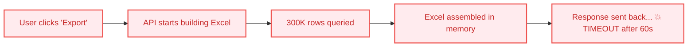
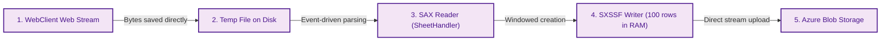
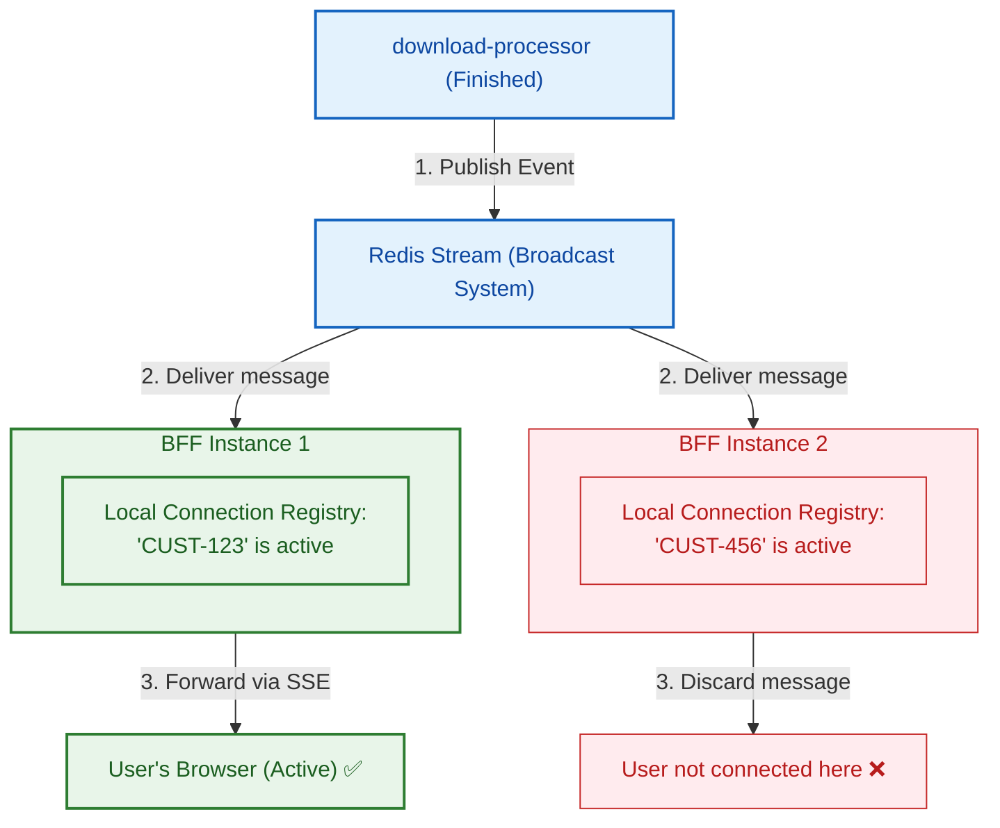

# Async Report Download Pipeline — Complete Beginner-Friendly Interview Guide

> **Resume Line:** *"Developed a Kafka-based asynchronous report download pipeline generating and delivering reports containing 300K+ rows with retry handling, background job tracking, and scalable asynchronous processing."*

---

## 📖 Jargon Buster: Cheat Sheet for Beginners

Before we dive into the details, here is a quick guide to the tech terms used in this document. Think of this as your translator key:

| Term | What it is | Everyday Analogy |
| :--- | :--- | :--- |
| **Synchronous (Sync)** | A task where you wait around for it to finish before doing anything else. | Ordering coffee at a counter and standing there waiting until they hand it to you. |
| **Asynchronous (Async)**| A task you start in the background so you can go do other things. | Ordering coffee, getting a buzzer, finding a table, and waiting for the buzzer to vibrate. |
| **BFF (Backend for Frontend)** | A helper backend server built specifically to serve the user interface (UI) directly. | A personal concierge at a hotel who takes your requests and talks to the kitchen, housekeeping, and front desk for you. |
| **Kafka** | A high-speed digital conveyor belt (or message broker) used to pass jobs from one service to another. | An order rail in a busy kitchen where waiters clip tickets, and chefs grab them one by one to cook. |
| **R2DBC** | Reactive Relational Database Connectivity. A modern way to talk to PostgreSQL databases without blocking threads. | Sending an email to a support desk (reactive) instead of holding on the phone line (blocking) until they resolve your issue. |
| **Spring WebFlux (Netty)** | A framework for building high-concurrency web apps that runs on Netty (an event-loop engine). | A single, fast-moving bartender serving multiple customers by taking orders and moving down the line, instead of one bartender per customer. |
| **SSE (Server-Sent Events)** | A one-way communication pipe from the server to the browser for real-time updates. | A train station departure board that updates automatically without you having to ask the ticket agent every minute. |
| **Redis Streams** | A fast, persistent message list that lets different instances of our server broadcast notifications to each other. | A building-wide PA speaker system. An announcement is made once, and everyone hears it. |
| **Azure Blob Storage** | A secure cloud folder for saving files (like generated Excel sheets). | A public storage locker where you put a package and get a key. |
| **SAS URL (Shared Access Signature)**| A temporary, secure link to download a file from cloud storage. | A digital ticket to an event that only works for the next 2 hours. |
| **DOM Parser (standard reader)** | Loads a whole XML/Excel file into memory to read it. | Opening a 10,000-page book by spreading all pages across the floor. |
| **SAX Parser (event reader)** | Reads an XML/Excel file sequentially, one line at a time. | Reading a book one page at a time through a small window. |
| **SXSSFWorkbook** | A special Excel-writing tool that writes rows to disk as they are created, keeping only a small amount in RAM. | Writing a book page-by-page and immediately sending finished pages to the publisher, instead of keeping them all on your desk. |
| **Thread Starvation** | When all worker threads on a server are busy, causing the server to freeze and reject new users. | A restaurant where all waiters are stuck waiting by the kitchen, leaving new customers ignored at the door. |
| **OutOfMemoryError (OOM)** | A crash that happens when a program runs out of RAM. | A desk piled so high with paperwork that it collapses, forcing you to stop working. |
| **Idempotency** | A property where running the same operation multiple times produces the same result. | Pressing an elevator button 10 times doesn't take you to the floor 10 times faster; it does the same action as pressing it once. |

---

## Table of Contents

1. [The Problem — Why This Exists](#1-the-problem)
2. [The Solution in One Picture](#2-the-solution-in-one-picture)
3. [End-to-End Flow for a Complete Beginner](#3-end-to-end-flow-for-a-complete-beginner)
4. [System Architecture Deep Dive](#4-system-architecture-deep-dive)
5. [Component-by-Component Code Breakdown](#5-component-by-component-breakdown)
6. [The 300K+ Row Problem — Memory Engineering (Double-Streaming)](#6-the-300k-row-problem)
7. [Notification System — SSE + Redis](#7-notification-system)
8. [Retry, Failure Handling & Edge Cases](#8-retry-failure-handling--edge-cases)
9. [Database Schema & Job Lifecycle](#9-database-schema--job-lifecycle)
10. [API Contract Reference](#10-api-contract-reference)
11. [Kafka Design Decisions](#11-kafka-design-decisions)
12. [Architectural Trade-Off Deep Dives](#12-architectural-trade-off-deep-dives)
13. [Production Config That Matters](#13-production-config-that-matters)
14. [Interview Q&A — 30 Key Questions & Answers](#14-interview-qa)

---

## 1. The Problem

### What Was Happening Before (Synchronous Download)

Before this system was built, when a user clicked "Export Report," the browser made a direct request, and the server tried to do everything on the spot:



Here is a breakdown of why this failed:

| Technical Problem | Plain English Explanation | Impact on the Business |
| :--- | :--- | :--- |
| **API Gateway Timeout** (60s) | The gateway (traffic controller) stops waiting for a response if it takes more than 60 seconds. | Large reports always failed. Users saw a `504 Gateway Timeout` error. |
| **Memory Explosion** | Trying to hold 300,000 Excel rows in the server's RAM at once takes 2 to 4 Gigabytes. | The server ran out of RAM and crashed (`OutOfMemoryError`), knocking out other users. |
| **Thread Starvation** | The server uses "threads" (like workers) to handle requests. Each export blocks a thread for 5 minutes. | If 10 users exported reports at once, all threads were busy. The whole website froze. |
| **No Visibility** | The browser stays on a loading spinner. | Users didn't know if the job was working or broken. If they closed their browser tab, the work was lost. |
| **No Retry System** | If a minor network hiccup happened during a 5-minute build, the server crashed the job. | Users had to click "Export" again and restart the long wait. |

**Real Customer Impact:** Internal operations teams (like the Kumho tire account team) and external shipping customers who handle thousands of container records hit these timeouts daily, preventing them from extracting their billing and tracking reports.

---

## 2. The Solution in One Picture

To solve this, we decoupled the request from the actual work. Instead of making the user wait, we accept the request immediately and build the report in the background.

```mermaid
flowchart TD
    %% Node definitions
    subgraph Client ["Client Side (User Browser)"]
        Browser["Vue.js Browser<br/>(using SSE Listener)"]
    endLogic

    subgraph Gateway ["Gateway / BFF Layer (Traffic Cop)"]
        BFF["Download BFF<br/>(Spring WebFlux)"]
    end

    subgraph StorageDB ["Storage & Databases"]
        Postgres[("PostgreSQL (R2DBC)<br/>Job Status Database")]
        Azure["Azure Blob Storage<br/>(File Locker)"]
    end

    subgraph Messaging ["Messaging & Queueing (Decouplers)"]
        Kafka[["Kafka<br/>Topic: downloads-queue"]]
        Redis[["Redis Stream<br/>Notifications"]]
    end

    subgraph Workers ["Background Workers"]
        Processor["download-processor<br/>(Kafka Consumer)"]
    end

    %% Flow lines
    Browser -->|1. POST /initiate-download| BFF
    BFF -->|2. Create Job (IN_PROGRESS)| Postgres
    BFF -->|3. Publish job event| Kafka
    Browser <-->|4. Subscribe (SSE)| BFF

    Kafka -->|5. Consume job| Processor
    Processor -->|6. Double-Streaming Transform & Upload| Azure
    Processor -->|7. Update status (SUCCESS/FAILED)| Postgres
    Processor -->|8. Publish notification event| Redis
    Redis -->|9. Broadcast notification| BFF
    BFF -->|10. Push via active SSE connection| Browser
    Browser -->|11. Download via SAS URL| Azure

    %% Styling
    classDef client fill:#e3f2fd,stroke:#1565c0,stroke-width:2px,color:#0d47a1;
    classDef bff fill:#e8f5e9,stroke:#2e7d32,stroke-width:2px,color:#1b5e20;
    classDef db fill:#ffebee,stroke:#c62828,stroke-width:2px,color:#b71c1c;
    classDef queue fill:#fff8e1,stroke:#f57f17,stroke-width:2px,color:#e65100;
    
    class Browser client;
    class BFF,Processor bff;
    class Postgres,Azure db;
    class Kafka,Redis queue;
```

**Core Design Idea:** 
The user clicks export $\rightarrow$ gets an instant "We are on it!" receipt $\rightarrow$ walks away or does other work $\rightarrow$ a notification bell rings when ready $\rightarrow$ user clicks the link to download the file directly from cloud storage.

---

## 3. End-to-End Flow for a Complete Beginner

### The Restaurant Analogy

| Restaurant Scenario | Our Technical System |
| :--- | :--- |
| **1.** You walk up to the counter and order a complex sandwich. | User clicks **"Export Report"** in the browser. |
| **2.** The cashier hands you a buzzer and your receipt, then asks you to take a seat. | The API server database creates a job ID (`jobId`) and returns it instantly to the browser. |
| **3.** The cashier slides the order ticket onto the kitchen rail. | The API publishes a message to the **Kafka queue**. |
| **4.** The chef grabs the ticket and carefully makes the sandwich. | The background worker (**download-processor**) reads Kafka, queries the data, and writes the Excel file. |
| **5.** The chef places the completed sandwich in the pickup window. | The worker uploads the Excel file to **Azure Blob Storage**. |
| **6.** The kitchen registers that the order is complete, causing your buzzer to vibrate. | The worker updates PostgreSQL, posts to Redis, and the BFF sends an **SSE notification** to the browser. |
| **7.** You walk up, show your receipt, and grab the sandwich. | The user clicks the notification bell and downloads the file using a temporary **SAS URL**. |

---

### The Actual Technical Steps

#### Step 1: User Clicks "Export Report"
The browser makes an HTTP request to the BFF:
```http
POST /downloads/initiate-download
Content-Type: application/json

{
  "productId": "SHIPMENT",
  "filters": {
    "dateRange": "2025-01-01 to 2025-06-01",
    "status": "ACTIVE"
  }
}
```

**What the BFF ([DownloadController](file:///Users/rohit.kumar.4/Documents/interview-prep/resume-question-explanation/async-report-download-pipeline.md#51-download-bff-downloadcontrollerjava)) does:**
1. Generates a unique tracking ID: `jobId = "7b6f9932-fc9d-47c8-9235-2d7fd7e83b92"`.
2. Inserts a tracking row in PostgreSQL:
   ```sql
   INSERT INTO download_job_status (job_id, status, customer_code, product_name, created_at)
   VALUES ('7b6f9932...', 'IN_PROGRESS', 'CUST-123', 'SHIPMENT', NOW());
   ```
3. Publishes a job message to the Kafka topic `downloads-queue`:
   ```json
   {
     "jobId": "7b6f9932...",
     "customerCode": "CUST-123",
     "productId": "SHIPMENT",
     "filters": { "dateRange": "...", "status": "ACTIVE" }
   }
   ```
4. Returns an instant response (< 50ms) to the user:
   ```json
   {
     "jobId": "7b6f9932-fc9d-47c8-9235-2d7fd7e83b92",
     "status": "IN_PROGRESS"
   }
   ```
*The user's browser immediately shows: "Your download has started. We will notify you when it is ready!"*

---

#### Step 2: Background Processor Picks Up the Job
The background worker service (**Download Processor**) is constantly listening to the `downloads-queue` Kafka topic.

1. **Pulls Message:** [ReportKafkaConsumer](file:///Users/rohit.kumar.4/Documents/interview-prep/resume-question-explanation/async-report-download-pipeline.md#52-kafka-consumer-reportkafkaconsumerjava) receives the message.
2. **Double-Check (Idempotency):** It queries PostgreSQL to make sure this `jobId` has not already been completed.
3. **Fetch Data:** It uses `WebClient` ([DownloadReportReader](file:///Users/rohit.kumar.4/Documents/interview-prep/resume-question-explanation/async-report-download-pipeline.md#41-monorepo-project-structure)) to query the target microservice (e.g., Shipment Service), streaming the data back.
4. **Transform (Double-Streaming):** It writes the data to a temporary file on disk, parses it using a SAX parser to reorder/format rows, and streams the output through [ExcelTransformationServiceImpl](file:///Users/rohit.kumar.4/Documents/interview-prep/resume-question-explanation/async-report-download-pipeline.md#53-coordinator-jobdispatcherjava) using `SXSSFWorkbook`.
5. **Upload to Cloud:** It streams the resulting Excel workbook directly to Azure Blob Storage at `exports/{jobId}/report.xlsx`.
6. **Generate Link:** It generates a secure, time-limited download link (SAS URL) that expires in 2 hours.
7. **Update DB:** It updates the PostgreSQL database status to `SUCCESS` and saves the download URL:
   ```sql
   UPDATE download_job_status
   SET status = 'SUCCESS', download_url = 'https://blob.../report.xlsx?sig=...', updated_at = NOW()
   WHERE job_id = '7b6f9932...';
   ```
8. **Broadcast Event:** It posts a completion message to the Redis Stream:
   ```
   XADD download-notifications * customerCode CUST-123 jobId 7b6f9932... status SUCCESS
   ```

---

#### Step 3: Notification Reaches the User's Browser

```mermaid
flowchart LR
    Redis["Redis Stream"] -->|1. Event| BFF["BFF Listener"]
    BFF -->|2. Sink| Sinks["Sinks.Many&lt;ServerSentEvent&gt;"]
    Sinks -->|3. SSE Pipe| SSE["SSE Connection"]
    SSE -->|4. Push| Browser["Browser receives event"]
    Browser -->|5. UI| Bell["Bell icon badge increments"]

    classDef flow fill:#fff3e0,stroke:#ff9800,stroke-width:2px,color:#e65100;
    class Redis,BFF,Sinks,SSE,Browser,Bell flow;
```


---

#### Step 4: User Downloads the File
1. The user clicks the bell icon, opening the notification list.
2. The UI calls `GET /downloads/inbox` to show active cards.
3. The user clicks a card, downloading the Excel file directly from Azure Blob Storage using the SAS URL.
4. The UI calls `PATCH /downloads/acknowledge` to mark the notification as read.

---

## 4. System Architecture Deep Dive

### 4.1 Monorepo Project Structure

The project is structured as a Spring Boot monorepo to make sharing models and building multiple services simple:

```
isce-reporting-tool/
├── download-common-module/                 # Shared data models and configurations
│   └── src/main/java/com/maersk/isce/model/
│       └── JobRequestDTO.java              # The blueprint for the Kafka message payload
│
├── download-service/                       # BFF Layer (Talks directly to the Browser)
│   └── src/main/java/com/maersk/isce/download/service/
│       ├── controller/
│       │   ├── DownloadController.java     # User API endpoints (initiate, SSE, inbox, acknowledge)
│       │   └── InternalDownloadController.java # API endpoints for internal health checks
│       └── service/
│           └── DownloadJobStatusService.java # Writes status rows to PostgreSQL database via R2DBC
│
├── download-processor/                     # Heavy background worker engine
│   └── src/main/java/com/maersk/isce/download/processor/
│       ├── consumer/
│       │   └── ReportKafkaConsumer.java    # Reads job messages from Kafka queues
│       ├── manager/
│       │   └── JobDispatcher.java          # Coordinates database, template service, and parser steps
│       ├── service/
│       │   ├── client/
│       │   │   ├── DownloadReportReader.java # Downloads raw data stream from shipment/billing APIs
│       │   │   └── TemplateServiceClient.java # Fetches user-customized column templates
│       │   └── impl/
│       │       ├── ExcelTransformationServiceImpl.java # Coordinates SAX reader & SXSSF writer
│       │       ├── SheetHandler.java       # Custom SAX handler that filters/formats rows
│       │       ├── AzureBlobPublisherService.java # Uploads the generated file to Azure Storage
│       │       └── RedisStreamPublisherService.java # Posts notifications into the Redis Stream
│       └── config/
│           ├── KafkaConsumerConfig.java    # Defines offset commit strategies for reliability
│           └── RedisConfig.java            # Configures reactive Redis stream listeners
│
├── upload-service/                         # Handles the reverse pipeline (async uploads)
└── template-service/                       # Manages customized user report layouts
```

---

### 4.2 Tech Stack Choices

| Component | Choice | Why we chose it (Layman Summary) | Why we chose it (Deep Technical) |
| :--- | :--- | :--- | :--- |
| **Language** | Java 21 | High performance, virtual threads, and rich library support. | Allows lightweight concurrency with structured concurrency features. |
| **Framework** | Spring Boot 3.x | Industry standard for Java applications, making scaling and configuration easy. | Provides native reactive support, automatic configuration, and microservices integration. |
| **Web Server** | Spring WebFlux (Netty) | Can hold open thousands of idle user notification connections (SSE) without crashing. | Non-blocking event-loop model handles high I/O concurrency using minimal threads. |
| **Database** | PostgreSQL + R2DBC | Traditional relational database features, but runs fully asynchronously. | Non-blocking database driver prevents database queries from locking execution threads. |
| **Queue** | Apache Kafka | Ensures no report requests are lost, even if servers crash. | Durable, partition-aware commit log with horizontal scaling capabilities. |
| **Notifications**| Redis Streams | Fast broker to notify all server instances that a file is ready. | Log-structured publish-subscribe engine that stores consumer group offsets. |
| **Cloud Storage**| Azure Blob Storage | Safe, cheap, and infinite storage for large Excel files. | Object storage offering time-limited Shared Access Signature (SAS) tokens. |
| **Excel Parser** | Apache POI (SAX + SXSSF) | Allows processing files with 300,000+ rows using less than 100MB of memory. | Event-driven SAX parser for reading, and a streaming window writer (`SXSSFWorkbook`). |

---

## 5. Component-by-Component Breakdown

Let's look at the core Java components of the system:

### 5.1 Download BFF: `DownloadController.java`
* **Real-time SSE Streams:** It maps and tracks active user browser connections using an in-memory `ConcurrentHashMap` of `Sinks.Many<ServerSentEvent>`.
* **Non-Blocking Controller:** Using Spring WebFlux, it returns reactive types like `Mono<DownloadStatus>` and `Flux<ServerSentEvent>` so threads are never blocked.

---

### 5.2 Kafka Consumer: `ReportKafkaConsumer.java`
* **Manual Commit Logic:** Instead of using standard `@KafkaListener` which auto-commits, it uses a reactive `KafkaReceiver`.
* **Processing Flow:**
  1. Spawns an event loop on startup using `ApplicationStartedEvent`.
  2. Receives a message via `.receive()`.
  3. Uses `.flatMap()` to run [JobDispatcher](file:///Users/rohit.kumar.4/Documents/interview-prep/resume-question-explanation/async-report-download-pipeline.md#53-coordinator-jobdispatcherjava) in the background.
  4. Only commits the Kafka offset (`receiverOffset().acknowledge()`) once the report has successfully uploaded and PostgreSQL updates.
  5. Catches processing errors via `.onErrorResume()` to ensure a bad payload does not block the queue.

---

### 5.3 Coordinator: `JobDispatcher.java`
* **The Brain of the Worker:**
  1. Updates PostgreSQL to `IN_PROGRESS`.
  2. Asks the `TemplateServiceClient` if the user wants custom columns.
  3. Commands the `DownloadReportReader` to query the source microservice.
  4. Feeds the resulting stream to [ExcelTransformationServiceImpl](file:///Users/rohit.kumar.4/Documents/interview-prep/resume-question-explanation/async-report-download-pipeline.md#41-monorepo-project-structure).
  5. Tells `AzureBlobPublisherService` to upload the file.
  6. Saves the final URL to Postgres, updates status to `SUCCESS`, and triggers `RedisStreamPublisherService`.

---

## 6. The 300K+ Row Problem — Memory Engineering

### The "Double-Streaming" Transformation

Loading 300,000 database rows, converting them into Java objects, and rendering them as a spreadsheet normally takes several gigabytes of RAM. This crashes the server. 

To solve this, we use a **Double-Streaming** pipeline:



Here is exactly how it works:

1. **Streaming Data Input:** [DownloadReportReader](file:///Users/rohit.kumar.4/Documents/interview-prep/resume-question-explanation/async-report-download-pipeline.md#41-monorepo-project-structure) fetches records from the backend database via a reactive `WebClient`. The data arrives as a stream of binary chunks (`Flux<DataBuffer>`).

   *   **What is happening under the hood:**
       *   **Direct OS Memory (Off-Heap):** Netty (WebFlux's engine) reads incoming network data directly into raw operating system memory rather than JVM Heap memory. This makes streaming much faster by avoiding copying bytes (zero-copy).
       *   **The Memory Leak Risk:** Netty hands Java a tiny reference object (like a key) to this raw OS memory buffer. If you discard this reference without calling `DataBufferUtils.release(dataBuffer)`, the JVM cleans up the key, but the actual memory block in the OS remains locked forever.
       *   **Conveyor-Belt Processing:** We write the chunk to the disk file and call `release()` immediately. At any given instant, the system is only referencing a single 8KB chunk of off-heap OS memory, while the JVM Heap itself only holds the tiny pointer object (less than 100 bytes) referencing that block. Once written to disk, the off-heap block is freed, keeping both JVM Heap and OS memory usage completely flat regardless of the file size.
       *   **Backpressure Flow Control:** If the disk is slower than the network, the file writer stops asking for more data. The reactive pipeline signals the OS network layer to pause incoming TCP packets at the source, preventing memory from buffering and flooding.
2. **Disk Buffer:** Instead of saving all these bytes in the server's RAM, we stream them directly into a temporary file on the local disk (`/tmp/excel-upload-...xlsx`). Disk storage is cheap and abundant; RAM is expensive and limited.
3. **Event-Driven Reading (SAX):** Standard Excel libraries read a file by building a full document structure (DOM) in memory, which uses massive amounts of RAM. Instead, we use `OPCPackage.open()` and run a SAX `SAXParser` with our custom [SheetHandler](file:///Users/rohit.kumar.4/Documents/interview-prep/resume-question-explanation/41-monorepo-project-structure). The SAX parser acts like a scanner, parsing the XML document sequentially from top to bottom. It only keeps the current line in memory.
4. **Windowed Writing (`SXSSFWorkbook`):** As the SAX parser reads a row, our handler filters columns, applies user templates, and writes the output row to a special workbook initialized as `new SXSSFWorkbook(100)`. The `100` parameter represents the **row access window size**. Only the 100 most recent rows are kept in memory; older rows are written to a temporary XML file on disk.
5. **Memory Usage:** The memory footprint remains constant at **~50MB** whether we process 1,000 rows or 1,000,000 rows.

---

## 7. Notification System

### 7.1 Core Architecture (SSE + Redis Streams)

The system is built on two primary technologies to deliver notifications asynchronously without overloading server memory:
*   **Server-Sent Events (SSE)**: A one-way, low-overhead communication channel from the backend to the browser. Once the browser initiates a download, it maintains a persistent SSE connection to listen for updates.
*   **Redis Streams**: A high-speed, log-structured message bus used to broadcast job completion alerts across all running instances of the BFF (Backend-for-Frontend) server.

---

### 7.2 Broadcast-then-Filter Pattern (Multi-Instance Routing)

In a production environment, we run multiple copies (instances) of our BFF server behind a load balancer. When a user logs in, their browser establishes an SSE connection to **one specific instance** (e.g., BFF Instance 1). 

If the background worker finishes the report and only notifies the database, BFF Instance 1 will not know about it. We solve this using a **Broadcast-then-Filter** pattern via Redis Streams:



#### Step-by-Step Notification Flow:
1. **Establishing the SSE Channel**: When the browser initiates a download, it calls `GET /downloads/notifications` to establish an SSE stream. The [DownloadController](file:///Users/rohit.kumar.4/Documents/interview-prep/resume-question-explanation/async-report-download-pipeline.md#51-download-bff-downloadcontrollerjava) maps this connection in a local in-memory registry (`sinkMap`) under the customer's ID.
2. **Publishing the Finish Event**: The background worker ([ReportKafkaConsumer](file:///Users/rohit.kumar.4/Documents/interview-prep/resume-question-explanation/async-report-download-pipeline.md#52-kafka-consumer-reportkafkaconsumerjava) / [JobDispatcher](file:///Users/rohit.kumar.4/Documents/interview-prep/resume-question-explanation/async-report-download-pipeline.md#53-coordinator-jobdispatcherjava)) completes the report, uploads it to Azure, updates the PostgreSQL database status to `SUCCESS`, and pushes a completion event to a shared Redis Stream.
3. **Broadcasting to All BFF Instances**: All running instances of the BFF listen to the Redis Stream. When they receive the completion message, each BFF instance checks its local registry (`sinkMap`).
4. **Filtering and Delivery**: 
   * **BFF Instance 1** finds that the customer (`CUST-123`) is connected, so it pushes the `DOWNLOAD_COMPLETED` alert down the SSE socket.
   * **BFF Instance 2** sees no active session for this customer, so it ignores and discards the message.
5. **Client Receipt**: The browser receives the event, increments the notification bell badge in the UI, and lets the user download the file using the secure SAS URL. The UI then calls `PATCH /downloads/acknowledge` to dismiss the alert.

---

### 7.3 Key Design Decisions & Resilience

*   **Handling Multi-Instance Load Balancing**: Standard REST APIs are stateless, but SSE connections are stateful. The Redis Stream decouples the background worker from having to know which BFF instance holds the client's socket.
*   **Fallback if Redis Fails**: If Redis fails, real-time push alerts via SSE will not function. However, the core file generation pipeline is unaffected because PostgreSQL is the source of truth for job states. When the user navigates the UI or reloads the tab, the frontend falls back to polling the `GET /downloads/inbox` endpoint to pull history directly from the database.
*   **Decoupled Browser Session**: If the user closes their tab mid-generation, the SSE connection drops, but the background worker still finishes. The job is marked as `SUCCESS` or `FAILED` in the database. When the user opens the application again, the UI calls `GET /downloads/inbox` to fetch their history and retrieve the download link.

---

## 8. Retry, Failure Handling & Edge Cases

Distributed systems can fail in many ways. Here is how our architecture remains resilient:

| Failure Event | What happens to the system | How we handle and recover |
| :--- | :--- | :--- |
| **Worker crashes mid-job** | The processing node dies while generating the Excel file. | Because we use **Manual Kafka Commit**, the message offset is never acknowledged. Kafka notices the worker heartbeat is gone, reassigns the partition to another healthy worker, and redelivers the message. The new worker checks PostgreSQL, sees the status is `IN_PROGRESS`, and safely restarts the generation. |
| **Azure Storage is offline**| The file cannot be uploaded to the cloud. | The worker executes an **exponential backoff retry** (retries after 2s, then 4s, 8s, 16s, up to 5 attempts). If it still fails, the database is marked `FAILED`, the user is notified, and the message moves to a **Dead Letter Queue (DLQ)** for engineering review. |
| **User closes their tab** | The SSE connection drops. | The background worker is decoupled and does not care. It continues writing and uploading the file. When the user logs back in, the browser calls `GET /downloads/inbox`, which queries PostgreSQL and retrieves the download link. |
| **Duplicate Kafka Delivery** | Kafka delivers the same export request message twice. | **Idempotency Guard:** Before processing, [ReportKafkaConsumer](file:///Users/rohit.kumar.4/Documents/interview-prep/resume-question-explanation/async-report-download-pipeline.md#52-kafka-consumer-reportkafkaconsumerjava) checks the database. If the `jobId` status is already `SUCCESS` or `FAILED`, it ignores the message and acknowledges the Kafka offset. |

---

## 9. Database Schema & Job Lifecycle

### PostgreSQL Schema (R2DBC)

```sql
CREATE TABLE IF NOT EXISTS download_job_status (
    job_id VARCHAR PRIMARY KEY,                  -- Unique UUID for tracking the export
    status VARCHAR(50) NOT NULL,                 -- IN_PROGRESS, SUCCESS, FAILED
    message VARCHAR,                             -- Error message if failed
    download_url VARCHAR,                         -- Secure SAS URL to download the file
    customer_code VARCHAR(30) NOT NULL,          -- Hashed client ID (used for partition hashing)
    product_name VARCHAR(100),                  -- System domain (e.g. SHIPMENT, EMISSIONS, BILING)
    file_name VARCHAR(255),                      -- Name of the downloaded Excel file
    is_download_acknowledged BOOLEAN DEFAULT FALSE, -- True if the user has dismissed the notification
    expiry_time timestamp with time zone,        -- Timestamp when the SAS link expires (2 hours)
    created_at timestamp with time zone,         -- Job submission timestamp
    updated_at timestamp with time zone          -- Last status update timestamp
);

-- Indexes to ensure queries remain fast under heavy load
CREATE INDEX IF NOT EXISTS idx_download_status__customer_code ON download_job_status (customer_code);
CREATE INDEX IF NOT EXISTS idx_download_status__status ON download_job_status (status);
```

---

## 10. API Contract Reference

### POST `/downloads/initiate-download`
* **Purpose:** Triggers the background generation process.
* **Request Payload:**
```json
{
  "productId": "SHIPMENT",
  "filters": {
    "dateRange": "2025-01-01/2025-06-01",
    "status": "ACTIVE"
  }
}
```
* **Response: 202 Accepted** (Tells the client "we have received the request and are working on it")
```json
{
  "jobId": "7b6f9932-fc9d-47c8-9235-2d7fd7e83b92",
  "status": "IN_PROGRESS"
}
```

---

### GET `/downloads/notifications`
* **Purpose:** Long-lived SSE stream connection.
* **Stream Response:**
```
event: DOWNLOAD_COMPLETED
data: {"jobId":"7b6f9932-fc9d-47c8-9235-2d7fd7e83b92","status":"SUCCESS","fileName":"shipment_report.xlsx"}
```

---

## 11. Kafka Design Decisions

### Partitioning Strategy: Fair-Share Scheduling

If a single customer triggers 100 large exports at once, they could consume all background worker threads. This would starve other customers, causing their reports to hang. 

To solve this, we partition the Kafka topic by hashing the **`customerCode`**:

```mermaid
flowchart TD
    subgraph CustomerA ["Customer A (Spammer)"]
        A1["Request 1"]
        A2["Request 2"]
        A3["Request 3"]
    end
    
    subgraph CustomerB ["Customer B"]
        B1["Request 1"]
    end
    
    A1 & A2 & A3 -->|Hash(CustomerA)| P1["Partition 1 (Sequential processing)"]
    B1 -->|Hash(CustomerB)| P2["Partition 2 (Parallel processing)"]
    
    P1 -->|Consumes| T1["Worker Thread 1 (Busy with Customer A)"]
    P2 -->|Consumes| T2["Worker Thread 2 (Free to serve Customer B)"]

    classDef nodeStyle fill:#f0f4c3,stroke:#afb42b,stroke-width:2px,color:#827717;
    class P1,P2,T1,T2 nodeStyle;
```

* **How it works:** All requests from Customer A hash to the same value, landing on **Partition 1**. Since a single Kafka partition is consumed sequentially by a single thread, Customer A's 100 reports run one-by-one in a queue.
* **Why it helps:** Customer B's report hashes to **Partition 2**, which is read by a separate worker thread. Customer B's report is processed immediately, unaffected by Customer A's heavy workload.

---

## 12. Architectural Trade-Off Deep Dives

### Trade-Off: Reactive Stack (WebFlux) vs. Traditional Servlet (MVC)

| Architectural Metric | Traditional Servlet (Spring MVC) | Reactive Stack (Spring WebFlux) |
| :--- | :--- | :--- |
| **Threading Model** | Thread-per-request (A worker thread is dedicated to each user connection). | Event loop (A small pool of threads, e.g. 8, handles all connections). |
| **Resource Usage at 5,000 Connections** | **High memory & CPU.** Needs 5,000 active threads, causing the operating system to crash. | **Very low resource footprint.** Handles 5,000 idle SSE channels on a single event-loop thread. |
| **Database Queries** | **Blocking.** The thread sits idle doing nothing while waiting for the database. | **Non-blocking.** The thread sends the query and immediately moves on to serve others. |
| **Developer Complexity** | **Low.** Simple to write, debug, and trace errors. | **High.** Requires thinking in terms of data streams and asynchronous publishers. |

---

### Trade-Off: DB-then-Kafka Dual Write vs. Transactional Outbox Pattern

For financial transactions or order placement, a dual write (writing to DB and publishing to a message broker sequentially) is a major anti-pattern because the DB transaction can commit, but the message publish can fail, leading to permanent state divergence. To prevent this, systems use the **Transactional Outbox Pattern** (writing to the DB and an `outbox` table in a single atomic ACID transaction, then polling/CDC relaying to Kafka).

For this **Async Report Download Pipeline**, we deliberately chose **NOT** to use the Outbox Pattern. Here is the trade-off analysis:

| Metric | DB-then-Kafka Dual Write (Our Choice) | Transactional Outbox Pattern |
| :--- | :--- | :--- |
| **Operational Complexity** | **Low.** Simple application code: one database write, followed by one Kafka publish. No extra infrastructure. | **High.** Requires setting up a dedicated outbox table, polling scheduler (e.g. ShedLock), or a CDC connector (Debezium) to relay events. |
| **Consistency Target** | **Eventually Consistent (Best-Effort).** If the DB write succeeds but Kafka fails, the job remains stuck in `IN_PROGRESS`/`PENDING`. | **Strongly Consistent.** The Kafka message is guaranteed to be published if and only if the DB write succeeds. |
| **Business Impact of Failure** | **Negligible.** If a report fails to queue, the user simply sees a timeout/failure state or their job gets stuck, and they can click "Export" again. It is not financial or source-of-truth data. | **Zero Tolerance.** Critical for ledger entry, payments, or order processing. |
| **Recovery Strategy** | **Poller / Timeout Retry.** A simple background cron job checks for jobs stuck in `IN_PROGRESS` or `PENDING` for over 10 minutes and automatically replays them to Kafka. | **Automatic.** The outbox relay handles retry logic natively until the broker acknowledges. |

> [!NOTE]
> **Architectural Takeaway:** We did not use the Outbox Pattern because the system domain is **reporting**, not financial ledger transactions. The cost of running CDC pipelines/outbox pollers outweighs the cost of handling occasional failed report queues via a simple timeout recovery poller or user retry.

---

## 13. Production Config That Matters

These settings in `application.yml` control the stability of the background workers:

```yaml
spring:
  kafka:
    consumer:
      # Pull only ONE message at a time
      max-poll-records: 1
      # Disable automatic commits to prevent message loss
      enable-auto-commit: false
```

* **`max-poll-records: 1`:** Generating a 300K-row report uses significant disk and processing resources. If a worker pulled 20 messages at once, it would try to build them in parallel, causing disk congestion and slow processing times. Pulling one at a time ensures predictable processing behavior.
* **`enable-auto-commit: false`:** Tells the Kafka client not to mark a message as read until we explicitly program it to do so. This ensures that if a server crashes mid-generation, the message remains in the queue for a backup server to process.

---

## 14. Interview Q&A

### Q1: "300K rows in Excel — why not CSV? CSV is lighter."
> **Layman Summary:** The business users demanded Excel. We used streaming tools to make Excel run as efficiently as a CSV.
* **Deep Technical Answer:** Business operations teams live in Microsoft Excel. They require multi-tab structures, formulas, column styling, and filters. Although CSV is lighter on memory and networks, Excel was a hard business requirement. To handle the size safely, we implemented Apache POI's `SXSSFWorkbook` with a row access window size of `100`. This flushes older rows to temporary disk storage immediately, maintaining a stable memory footprint of under 100MB instead of holding millions of cells in memory.

### Q2: "What partitioning key did you use for the Kafka topic?"
> **Layman Summary:** We partitioned by `customerCode` to prevent one user from hogging the entire system.
* **Deep Technical Answer:** We partition the `downloads-queue` topic by hashing the `customerCode`. This ensures that all download events generated by a single customer are routed to the same Kafka partition. Because a single partition is processed sequentially by a single consumer thread within a consumer group, one customer's bulk requests are processed one-by-one. This prevents a single client from monopolizing the background processor worker pool, preserving resources for other clients.

### Q3: "How do you handle security for download links?"
> **Layman Summary:** We store files in a private cloud folder and generate temporary, secure keys that expire in 2 hours.
* **Deep Technical Answer:** Excel files are stored in a private container within Azure Blob Storage with all public access disabled. The download link contains a Shared Access Signature (SAS) token. This token is cryptographically signed, restricted to read-only access, scoped strictly to that specific file path, and configured to expire after 2 hours. In addition, the BFF validates the user's active JSON Web Token (JWT) session before returning the SAS link through the `/inbox` endpoint.

### Q4: "With 10 BFF instances, how does the notification reach the right one?"
> **Layman Summary:** We use Redis Streams like a PA system to broadcast the completion alert to all servers, and only the server holding the user's connection forwards it.
* **Deep Technical Answer:** We implement a **Broadcast-then-Filter** pattern. When a background processor completes a report, it publishes the completion event to a shared Redis Stream. All 10 running instances of the BFF listen to this stream. When they receive the message, they check their local in-memory registry of active SSE connections (`sinkMap`). Only the specific BFF instance holding the live SSE socket for that user forwards the event, while the other 9 instances discard it.

### Q5: "What if the processor crashes mid-generation?"
> **Layman Summary:** The queue remembers the message and redirects it to a healthy server to retry.
* **Deep Technical Answer:** We use manual Kafka offset commits, acknowledging the message only after the generated file is uploaded to Azure Blob Storage and the PostgreSQL status is updated. If a worker crashes mid-generation, the Kafka broker notices the loss of heartbeats and triggers a partition rebalance. The message is redelivered to a healthy worker. The new worker performs an idempotency check against PostgreSQL. Seeing the status is `IN_PROGRESS` or `PENDING` (meaning it was not successfully finished), it starts the generation process again.

### Q6: "What if the user closes the browser before the export finishes?"
> **Layman Summary:** The worker keeps running in the background. The user can download the file from their history tab next time they log in.
* **Deep Technical Answer:** The background processing is completely decoupled from the user's browser session. If the user closes their browser, the SSE connection terminates, but the Kafka consumer continues processing the job to completion and uploading the file. When the user logs back in, the frontend triggers a call to `GET /downloads/inbox` which queries PostgreSQL for all completed, unacknowledged reports, showing the download link to the user.

### Q7: "What if the database query for 300K rows is slow?"
> **Layman Summary:** We use streaming databases that pull data in small batches, preventing memory overload.
* **Deep Technical Answer:** We use R2DBC reactive drivers with built-in backpressure support. The database query returns a `Flux<RowData>` that emits database rows in batches. The Excel parser consumes these rows sequentially. If the parser slows down due to disk I/O, it signals the database stream to pause emitting new rows. This prevents database connection starvation and ensures the application server does not buffer excessive rows in memory.

### Q8: "Why not use Azure Functions instead of Kafka consumers?"
> **Layman Summary:** We already had Kafka set up, and it gave us better control over customer ordering and queue semantics.
* **Deep Technical Answer:** While serverless functions scale well, Kafka was already part of our existing microservices architecture. Adding serverless triggers would introduce infrastructure complexity (managing two distinct queueing models). Furthermore, Kafka partition keys give us native guarantees that messages for a specific customer are processed sequentially (preventing concurrency locks), which is harder to control with serverless functions without complex orchestration.

### Q9: "What is the SXSSFWorkbook window size and why 100?"
> **Layman Summary:** We keep 100 rows in memory to write files efficiently without running out of RAM.
* **Deep Technical Answer:** The `rowAccessWindowSize` parameter in `SXSSFWorkbook` defines how many rows are kept in JVM memory before being flushed to temporary XML files on disk. We chose `100` because it provides an optimal balance: it keeps the memory footprint very small (~500KB per workbook instance), avoids thread resource consumption, and prevents excessive disk I/O operations that would occur if we used a smaller window size (like 10).

### Q10: "How do you prevent the same job from being processed twice?"
> **Layman Summary:** We use unique IDs to verify the status of the job in the database before starting work.
* **Deep Technical Answer:** We use two levels of deduplication: (1) At the messaging layer, Kafka producer idempotence is enabled (`enable.idempotence=true`) to prevent network-related duplicate publishing. (2) At the application layer, the consumer queries PostgreSQL before starting the job. If the job status is already `SUCCESS` or `FAILED`, the processor immediately acknowledges the offset and skips execution.

### Q11: "What happens if Redis goes down?"
> **Layman Summary:** The notification bell won't ring instantly, but the download history page will still work.
* **Deep Technical Answer:** If Redis fails, real-time push alerts via SSE will not function. However, the core file generation pipeline is unaffected because PostgreSQL is the source of truth for job states. When users navigate the UI, the frontend polls `GET /downloads/inbox` directly from PostgreSQL, ensuring they can still retrieve and download their generated reports.

### Q12: "How do you monitor this system in production?"
> **Layman Summary:** We monitor queue delay, server memory, database status ratios, and alert developers if errors spike.
* **Deep Technical Answer:** We track: (1) Kafka consumer lag (messages queueing up). (2) P99 report generation latency. (3) Pod JVM memory allocation (ensuring it remains stable at ~50MB per active job). (4) Dead Letter Queue (DLQ) message counts. (5) Azure Blob upload error rates. These metrics are exposed via Micrometer and visualized on Grafana dashboard screens with alert thresholds.

### Q13: "Why manual Kafka offset commit instead of auto-commit?"
> **Layman Summary:** Auto-commit can lose messages if the server crashes. Manual commit ensures we only mark a job as done when it is safely stored.
* **Deep Technical Answer:** Auto-commit registers a message as processed every few seconds regardless of the job's progress. If a worker node crashes mid-generation, an auto-committed job is lost forever. By using manual commits, we only commit the offset after the file is uploaded to Azure Blob and the database is updated. This guarantees at-least-once processing delivery.

### Q14: "Can this handle concurrent downloads from the same user?"
> **Layman Summary:** Yes, they are processed one after the other to prevent the server from locking up.
* **Deep Technical Answer:** Yes. Each request is assigned a unique UUID `jobId` and is processed as an independent Kafka message. Because they share the same `customerCode`, they hash to the same partition and run sequentially. This design prevents a single user from triggering multiple database-heavy queries simultaneously.

### Q15: "What if the SAS URL expires before the user downloads?"
> **Layman Summary:** The system generates a fresh download link on the fly when the user opens their inbox.
* **Deep Technical Answer:** The database stores the path to the file in cloud storage (`exports/{jobId}/report.xlsx`), not just the temporary SAS link. When the user loads their inbox, the BFF checks the URL's expiration timestamp. If the link has expired, the BFF calls the Azure storage SDK to generate a fresh 2-hour SAS token and returns it to the client.

### Q16: "Why did you choose R2DBC over standard JDBC with a connection pool?"
> **Layman Summary:** Standard database tools block threads, which would freeze our real-time notification system.
* **Deep Technical Answer:** In a reactive WebFlux environment, Netty runs on a small pool of loop threads (usually matching the CPU core count). Standard JDBC blocks the execution thread until the database returns results. Under heavy load, blocking these threads would freeze the server, causing SSE connections to fail. R2DBC provides non-blocking, asynchronous drivers, allowing threads to switch tasks while waiting for database queries to complete.

### Q17: "How do you handle schema evolution for the Kafka messages?"
> **Layman Summary:** We version our messages so old and new formats can coexist without crashing.
* **Deep Technical Answer:** Kafka messages are structured using JSON schemas containing a `version` field. Our consumers are coded to be backward-compatible, translating older message fields into new formats. For major breaking schema changes, we deploy a blue-green consumer configuration listening on a new topic partition.

### Q18: "What's the throughput of this system?"
> **Layman Summary:** We can process multiple files in parallel depending on how many queue partitions we configure.
* **Deep Technical Answer:** The maximum concurrency of a Kafka consumer group is bound by the topic's partition count. With 3 partitions, 3 background worker threads process jobs in parallel. Each report takes between 30 seconds and 3 minutes to complete. We can scale our throughput horizontally by adding more partitions and spinning up additional worker pods.

### Q19: "Why not use a message broker like RabbitMQ instead of Kafka?"
> **Layman Summary:** Kafka provides persistent history and easier partition control, which fits our needs better.
* **Deep Technical Answer:** Although RabbitMQ is a capable broker, Kafka offers log persistence, allowing us to replay messages to debug failure states. Additionally, Kafka's consumer group model and key-based partitioning make ordering and scaling straightforward without requiring complex exchange routing rules in RabbitMQ.

### Q20: "How do you test this end-to-end?"
> **Layman Summary:** We use virtual testing environments to run real databases and message queues during automated tests.
* **Deep Technical Answer:** We write integration tests using **Testcontainers** to spin up actual PostgreSQL, Redis, and Kafka instances in Docker containers during test runs. The automated test publishes a job request payload, waits for the processor to complete it, and verifies that the database state is marked `SUCCESS`, the file is correctly written to the simulated cloud container, and the notification is pushed.

### Q21: "What would you change if you were redesigning this from scratch?"
> **Layman Summary:** I would add progress percentages (like 50% complete) and process parts of the file in parallel.
* **Deep Technical Answer:** First, I would add progress tracking by posting periodic progress updates (e.g., 25%, 50%) to the Redis channel so the UI can render a progress bar. Second, I would split massive queries into chunked pages processed in parallel, then merge the temporary files to speed up generation times.

### Q22: "How do you handle backpressure in the reactive stream?"
> **Layman Summary:** The system naturally slows down the database if the Excel writer gets busy, preventing crashes.
* **Deep Technical Answer:** Reactive streams in Spring WebFlux use standard subscription request demands. The `ExcelTransformationService` acts as the subscriber and requests `N` items from the database driver. The database driver only queries and pulls more records when the subscriber signals it is ready for more, preventing memory overflow.

### Q23: "What's the difference between Redis Pub/Sub and Redis Streams, and why did you choose Streams?"
> **Layman Summary:** Pub/Sub loses messages if a server is offline. Streams save notifications in a log so no alerts are lost.
* **Deep Technical Answer:** Redis Pub/Sub is a fire-and-forget channel; if a BFF instance is offline or restarting when a notification is broadcast, the alert is lost. Redis Streams acts as a durable log structure that retains history and supports consumer groups. This allows BFF instances to track read offsets and recover missed messages, providing a more reliable notification delivery mechanism.

### Q24: "How do you handle the temp file cleanup if the pod crashes?"
> **Layman Summary:** Kubernetes clears out temp files on crash restarts, and we run cleanups to wipe old files.
* **Deep Technical Answer:** We write temp files to the pod's local directory `/tmp/job-{jobId}.xlsx`. If a pod crashes, Kubernetes restarts the container with a fresh filesystem, naturally clearing old files. During normal runs, we delete the temp file in a `finally` block after a successful upload. We also run a cron job that deletes any files in `/tmp` older than 1 hour.

### Q25: "What metrics do you track for this system?"
> **Layman Summary:** We track queue delays, memory usage, file sizes, and error rates to keep the system healthy.
* **Deep Technical Answer:** We monitor: (1) Kafka consumer lag. (2) Generation P95 latency. (3) Pod heap usage (verifying constant allocation ~50MB). (4) Dead Letter Queue volume. (5) Azure upload success rates. (6) Active SSE connection counts. These metrics are exposed via Micrometer and alert rules are configured in Prometheus.

### Q26: "Why did you write the WebClient raw stream to a temporary disk file before SAX parsing?"
> **Layman Summary:** Excel files are zipped archives. To read them, standard tools load the whole file into RAM. Writing to disk lets us open parts of it without using RAM.
* **Deep Technical Answer:** Excel `.xlsx` files are zipped packages containing XML files (like sheet contents and string tables). To read a zip structure, standard libraries require random access to different files inside the archive. If we parsed the input stream directly in memory, the JVM would have to buffer the entire binary payload. Writing the incoming `Flux<ByteBuffer>` stream to disk lets the system read and unzip parts of the file on-the-fly, bypassing memory overhead.

### Q27: "What is the role of `SheetHandler` in your Excel transformation service?"
> **Layman Summary:** It scans the Excel file row-by-row like a conveyor belt, applying styling and column filters as it reads.
* **Deep Technical Answer:** The `SheetHandler` extends SAX's `DefaultHandler` to parse the sheet's XML on-the-fly. Rather than mapping the whole sheet to DOM objects, the SAX parser fires event triggers (`startElement`, `endElement`) as it scans the XML cells. `SheetHandler` intercepts these events, extracts cell values, checks column header lists, filters columns to match custom user templates, dynamically reorders columns, and creates formatted date cells. It then writes each mapped row immediately to a streaming workbook (`SXSSFWorkbook`), ensuring high performance at low memory.

### Q28: "How does your code prevent style exhaustion crashes when writing formatted date cells?"
> **Layman Summary:** Excel limits how many styles (like fonts or date formats) we can create. We pre-create and reuse them to avoid crashes.
* **Deep Technical Answer:** Excel has a hard limit of ~64,000 unique `CellStyle` objects in a single workbook. If we created a new style object for every cell, the sheet would corrupt and crash under load. In `SheetHandler`, we pre-create and cache target `CellStyle` objects mapped by their date format string (e.g., `yyyy-MM-dd`). Cells in the same column share the same cached style reference, keeping the allocation count minimal.

### Q29: "What precautions are taken to handle blocking operations in your reactive WebFlux environment?"
> **Layman Summary:** Writing files to disk is slow and blocks the CPU. We run these slow tasks in a separate thread pool so they don't freeze the main server.
* **Deep Technical Answer:** File I/O and XML parsing are blocking tasks. Running blocking calls on the main reactive event-loop thread pool (Netty loop) would freeze the server, preventing it from processing other requests. By using `.subscribeOn(Schedulers.boundedElastic())` and `.publishOn(Schedulers.boundedElastic())` inside `ExcelTransformationServiceImpl.transformExcel()`, we isolate these blocking file and parsing operations to a dedicated elastic thread pool designed for blocking tasks.

### Q30: "How does your Excel transformation handle backwards compatibility for reports without templates?"
> **Layman Summary:** If the user doesn't request a customized layout, we skip the parsing step entirely to save time.
* **Deep Technical Answer:** In `ExcelTransformationServiceImpl.shouldTransform()`, we check if the custom layout template is null or has no columns defined. If either condition is true, we bypass the XML parsing and temporary file creation entirely, returning the raw binary `Flux<ByteBuffer>` immediately. This ensures that if a user requests a standard report without customization, the raw data bypasses parsing, executing at peak speed with zero overhead.

### Q31: "In your initiation flow, you first save the job to PostgreSQL and then publish to Kafka. That's a dual write. What happens if the database write succeeds but the Kafka publish fails? Why didn't you use the Transactional Outbox Pattern?"
> **Layman Summary:** Report generation isn't a critical payment system. If the Kafka publish fails, the job gets stuck and we recover it with a simple cleanup cron job, or the user clicks retry. We didn't need the extra complexity of the Outbox pattern.
* **Deep Technical Answer:** Writing to a database and publishing to a message broker outside of a single transaction is a dual-write, which lacks atomic guarantees. If PostgreSQL commits the job status as `IN_PROGRESS` but the Kafka publish fails (e.g., due to a temporary broker outage), the job will be orphaned in PostgreSQL and never get processed by the consumer.
We deliberately accepted this risk instead of implementing the **Transactional Outbox Pattern** (e.g., writing to an `outbox` table in the same DB transaction and relaying it to Kafka) for two main reasons:
1. **Criticality of the domain:** Unlike a ledger transaction or order payment where a dual-write failure has financial consequences, report download is a non-transactional read-only action. The worst-case scenario is a stuck report, which is easily retryable and has negligible business impact.
2. **Operational Simplicity:** The Outbox pattern adds significant complexity (additional tables, polling schedulers, Debezium configurations). We kept the design simple.
To handle the dual-write failure case, we have a background **reconciliation poller** running in the BFF. Every 10 minutes, it checks for any Postgres job rows stuck in `IN_PROGRESS`/`PENDING` for over 15 minutes, marks them as `FAILED`, and notifies the user so they can trigger a retry, or automatically republishes the request to Kafka.
