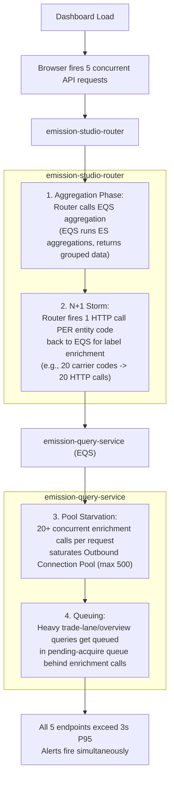

# Emission Studio — P95 Latency N+1 Fix: Deep Dive & Interview Guide

> **Resume Line:** *"Diagnosed and resolved a critical P95 latency incident caused by N+1 enrichment failures and WebFlux connection pool starvation, optimizing downstream calls from O(N) to O(1)."*
>
> **Extended talking point:** *"Diagnosed and fixed a cascading N+1 API call pattern in Emission Studio Router that caused P95 latency alerts (>3s) across 5 endpoints — replaced per-entity HTTP calls with batch Elasticsearch queries, eliminating connection pool starvation."*

---

## Table of Contents

1. [Incident Summary](#1-incident-summary)
2. [Glossary of Key Technical Terms (For Beginners)](#2-glossary-of-key-technical-terms-for-beginners)
3. [Root Cause — N+1 Cascading Failure](#3-root-cause)
4. [How I Diagnosed It](#4-how-i-diagnosed-it)
5. [The Fix — Two-Phase Batch Refactor](#5-the-fix)
6. [Before vs After — Concrete Numbers](#6-before-vs-after)
7. [Connection to SSE Notification Platform](#7-connection-to-sse-notification-platform)
8. [Interview Deep Dive Q&A](#8-interview-deep-dive-qa)

---

## 1. Incident Summary

**Date:** April 07, 2026, 13:58 UTC
**Impact:** Five P95 latency alerts (>3.0s) fired simultaneously across two microservices.

### 📋 The Victim & Cause Table
| Service | Endpoint | Role | Description |
|:---|:---|:---|:---|
| `emission-studio-router` | `/emissions/router/top-x` | **Cause** (N+1 origin) | Retreives top emitting carriers; triggered an N+1 storm to resolve carrier names. |
| `emission-studio-router` | `/emissions/router/geocarrier` | **Cause** (N+1 origin) | Resolves geographical carrier details; triggered loop queries for city/country labels. |
| `emission-studio-router` | `/emissions/router/overview` | **Victim** (starved) | Simple aggregated overview; delayed waiting for connection pool lease. |
| `emission-query-service` | `/emissions/trade-lane` | **Victim** (starved) | Fetches shipping lane details; blocked behind the HTTP connection queue. |
| `emission-query-service` | `/emissions/overview` | **Victim** (starved) | Fetches global emission summaries; blocked behind the HTTP connection queue. |

### 🔍 Real-World Example of the Incident:
Imagine a customer logging into the Emission Studio dashboard.
1. The dashboard fires a request to `GET /emissions/router/top-x`.
2. The router queries the database, retrieving **20 carrier codes** (e.g., `MSK`, `MSC`, `CMA`, `HLC`, `COS`, etc.).
3. To display the full carrier names (e.g., `MSK` ➡️ `Maersk Line`), the code executes **20 sequential HTTP requests** to the downstream lookup service.
4. If multiple users open the dashboard simultaneously, hundreds of HTTP requests flood the system. This exhausts the available connection pool capacity, causing unrelated requests (like loading the basic `/emissions/overview` stats) to hang indefinitely.

---

## 2. Glossary of Key Technical Terms (For Beginners)

If you are new to backend performance debugging, here is a breakdown of the complex jargon used in this guide:

*   **P95 Latency:** The 95th percentile latency. It means $95\%$ of all API calls complete faster than this value, and the slowest $5\%$ take longer. If P95 latency is 3 seconds, the slowest 5 out of 100 requests took $\ge 3$ seconds. It measures the experience of users facing the worst delays.
*   **N+1 Problem:** A performance bottleneck where an application makes 1 initial request to fetch a list of items, followed by $N$ separate requests (in a loop) to fetch details/enrichment for each of those $N$ items.
*   **Connection Pool:** A collection of pre-established, reusable network connections. Creating a network connection is expensive (requires TCP handshakes and TLS handshakes). Keeping a "pool" of connections allows threads to borrow and return them instantly.
*   **Pool Starvation:** A state where all connections in a pool are active, forcing incoming requests to sit in a queue waiting for a connection to be released. If the queue fills up, requests fail immediately.
*   **Spring WebFlux:** A reactive framework in Spring Boot. Unlike traditional Spring MVC (which allocates a dedicated thread per request), WebFlux uses a tiny pool of **Event Loop Threads** to handle thousands of concurrent requests asynchronously.
*   **Garbage Collection (GC) Pressure:** The CPU work required by the Java Virtual Machine (JVM) to clean up objects that are no longer used. Creating thousands of short-lived objects (like HTTP request descriptors or JSON buffers) in a microsecond triggers frequent JVM pauses to clean them up.
*   **Elasticsearch Terms Query:** A search query in Elasticsearch that matches documents containing one or more exact values (like a SQL `WHERE code IN ('MSK', 'MSC')`), executing the search in a single pass.

---

## 3. Root Cause — N+1 Cascading Failure (Resource Exhaustion)

### 👶 A Simple Analogy: The Grocery Store Run
Imagine you need to cook a recipe that requires **20 different ingredients**.
*   **The N+1 Method:** You drive to the grocery store, buy 1 ingredient (e.g., Salt), drive home. Then you drive back to buy the second ingredient (e.g., Pepper), drive home. You repeat this 20 times. You waste time, gas, and clog up the road.
*   **The Batch Method:** You write all 20 ingredients on a single list. You make **1 trip** to the store, grab everything in one cart, checkout, and drive home once.

In our system, the **Router** was using the "N+1 Method" to lookup carrier names from the downstream **Emission Query Service (EQS)**.

### The Chain Reaction Diagram



### Identified N+1 Call Sites

Below are the exact Java methods in the Router where loop calls occurred:

| Service | Method | What It Does | Target Downstream Endpoint |
|:---|:---|:---|:---|
| `TopXManager` | `fetchNamesForCodes()` | Enriches carrier/city/country names one-by-one | `/carrier-filter`, `/city-filter`, `/country-filter` |
| `GeoCarrierEmissionService` | `enrichWithCountryData()` | Per-code country label lookup | `/country-filter` |
| `GeoCarrierEmissionService` | `enrichWithCityTradeLaneData()` | Per-code city label lookup | `/city-filter` |
| `GeoCarrierEmissionService` | `enrichWithCityData()` | Per-code city label lookup | `/city-filter` |
| `BenchmarkDetailedAnalysisService` | `enrichWithCityTradelaneData()` | Per-code city enrichment | `/city-filter` |
| `BenchmarkDetailedAnalysisService` | `enrichWithCountryTradelaneData()` | Per-code country enrichment | `/country-filter` |
| `BenchmarkDetailedAnalysisService` | `enrichWithCarrierData()` | Per-code carrier enrichment | `/carrier-filter` |

---

### Compounding Factors: Pool Starvation & JVM GC Pressure

#### 1. Reactor Netty Connection Pool Starvation & Queue Limits
In Spring WebFlux, the underlying Netty client (`WebClient`) uses a global connection provider. The configuration was set to:
*   `maxConnections`: `500` (max open sockets to downstream services).
*   `pendingAcquireMaxCount`: `1000` (max requests allowed to wait in the queue when all 500 connections are busy).
*   `pendingAcquireTimeout`: `45s` (max time a request can wait in the queue before failing).

**Java Configuration Example of the Client Connection Pool:**
```java
// How the WebClient connection pool was configured behind the scenes
ConnectionProvider provider = ConnectionProvider.builder("elastic-pool")
    .maxConnections(500)
    .pendingAcquireMaxCount(1000)
    .pendingAcquireTimeout(Duration.ofSeconds(45))
    .build();

WebClient webClient = WebClient.builder()
    .clientConnector(new ReactorClientHttpConnector(HttpClient.create(provider)))
    .baseUrl("http://emission-query-service")
    .build();
```

*   **The Starvation Mechanic:** When 10 users loaded dashboards at the same time, the Router attempted to spawn $10 \times 140 = 1400$ requests. Since the connection pool was capped at `500`, the remaining `900` requests were queued.
*   **The Queue Build-Up:** Requests in the queue waited for active calls to finish. This queuing added **3 to 8 seconds of idle delay** directly to the API response times.
*   **Queue Overflow:** When the queue exceeded the `1000` threshold, Netty rejected incoming requests immediately by throwing a `PoolAcquirePendingLimitException`, resulting in HTTP 500 errors.

#### 2. JVM Garbage Collection (GC) Pressure
For each HTTP call, the JVM allocates short-lived helper objects:
*   HTTP headers and response body buffers.
*   JSON parsing objects (`Jackson` buffer instances).
*   Reactive stream wrappers (`Mono` and `Flux` instances).

Generating 140 network calls per request meant allocating millions of temporary objects per second. The JVM's memory allocator became overwhelmed, triggering frequent **Stop-the-World (STW) Garbage Collection pauses**. These pauses froze all application processing threads for up to 1.5 seconds, multiplying the latency.

---

## 4. How I Diagnosed It

### Step 1: Correlated Alert Timing
I noticed that five alert messages from Prometheus arrived in Slack at the exact same timestamp (13:58:24 UTC). This indicated a shared resource bottleneck (like network connections or database pool) rather than individual code bugs.

### Step 2: Traced the Code Loop
I analyzed `TopXManager` and located the loop executing sequential calls:
```java
// BEFORE: The classic N+1 loop pattern
public List<CarrierResult> fetchNamesForCodes(List<String> carrierCodes) {
    List<CarrierResult> results = new ArrayList<>();
    for (String code : carrierCodes) {
        // BAD: Blocks or triggers a network call in a loop
        String name = eqsClient.getCarrierName(code); 
        results.add(new CarrierResult(code, name));
    }
    return results;
}
```

### Step 3: Outbound Request Profiling (Splunk Logs)
I queried the Splunk logs to group outbound calls by `transactionId` (MDC tracing context).

**Splunk Query:**
```splunk
index=application_logs "eqsClient" "GET /emissions"
| stats count, values(uri) as requested_uris by transactionId
| where count > 20
```

**Resulting Log Example:**
```json
{"timestamp": "2026-04-07T13:58:00.101Z", "transactionId": "txn-abc-123", "msg": "Inbound request GET /emissions/router/top-x"}
{"timestamp": "2026-04-07T13:58:00.150Z", "transactionId": "txn-abc-123", "msg": "Outbound request to GET /emissions/carrier-filter?carrierCode=MSK"}
{"timestamp": "2026-04-07T13:58:00.180Z", "transactionId": "txn-abc-123", "msg": "Outbound request to GET /emissions/carrier-filter?carrierCode=MSC"}
{"timestamp": "2026-04-07T13:58:00.210Z", "transactionId": "txn-abc-123", "msg": "Outbound request to GET /emissions/carrier-filter?carrierCode=CMA"}
...
{"timestamp": "2026-04-07T13:58:00.990Z", "transactionId": "txn-abc-123", "msg": "Outbound request to GET /emissions/carrier-filter?carrierCode=COS"}
// (Total 140 downstream calls detected for a single user transaction)
```

### Step 4: Metric Correlation in Grafana
I analyzed the Prometheus connection pool metrics:
*   **Queue Build-up Metric:** `sum(reactor_netty_connection_provider_pending_connections) by (pool)` spiked from a baseline of `0` to the limit of `1000`.
*   **Active Connections Metric:** `sum(reactor_netty_connection_provider_active_connections) by (pool)` was stuck flat at `500`.

**Prometheus Metric Output Example:**
```prometheus
# Metric showing connection pool pending queue saturated at 1000
reactor_netty_connection_provider_pending_connections{pool="elastic-pool"} 1000.0
# Metric showing all 500 connections are fully used
reactor_netty_connection_provider_active_connections{pool="elastic-pool"} 500.0
```

### Step 5: Thread Dump Analysis
During the slowdown, I logged onto the server and captured a thread dump using `jstack`:
```bash
jstack <pid> > thread_dump.txt
grep -A 10 "reactor.netty.resources.PooledConnectionProvider" thread_dump.txt
```

**Thread Dump Output Snippet:**
```
"reactor-http-nio-4" #32 prio=5 os_prio=31 cpu=125ms elapsed=1230s tid=0x00007f8b9e80a000 waiting on condition [0x000070000e302000]
   java.lang.Thread.State: WAITING (parking)
      at sun.misc.Unsafe.park(Native Method)
      - parking to wait for <0x000000076aef0420> (a java.util.concurrent.locks.AbstractQueuedSynchronizer$ConditionObject)
      at java.util.concurrent.locks.LockSupport.park(LockSupport.java:175)
      at java.util.concurrent.locks.AbstractQueuedSynchronizer$ConditionObject.await(AbstractQueuedSynchronizer.java:2039)
      at reactor.pool.SimpleDequePool.acquire(SimpleDequePool.java:312)
      at reactor.netty.resources.PooledConnectionProvider.acquire(PooledConnectionProvider.java:230)
      // Highlight: Shows the event loop thread waiting to borrow an outbound HTTP connection
```

---

## 5. The Fix — Two-Phase Batch Refactor

### Phase 1 — Upstream (EQS): Support Batch Parameters

#### 1. Controller Refactor
We changed the API to accept multiple codes (comma-separated lists) instead of a single string query parameter.

**Before:**
```
GET /emissions/carrier-filter?carrierCode=MSK
```
**After:**
```
GET /emissions/carrier-filter?carrierCodes=MSK,MSC,CMA,HLC
```

#### 2. Elasticsearch Query Optimization
Inside `LocationQueryUtility`, we swapped the search logic from a single search `match` query to a multi-value `terms` query.

**Match Query (Before - 1 Code Lookup):**
```json
{
  "query": {
    "match": {
      "carrierCode": "MSK"
    }
  }
}
```

**Terms Query (After - Multi-Code Batch Lookup):**
```json
{
  "query": {
    "terms": {
      "carrierCode": ["MSK", "MSC", "CMA", "HLC"]
    }
  }
}
```

**Elasticsearch Java API Implementation:**
```java
// BEFORE: Single match
QueryBuilder query = QueryBuilders.matchQuery("carrierCode", singleCode);

// AFTER: Batch terms lookup (checks matching documents in one operation)
QueryBuilder query = QueryBuilders.termsQuery("carrierCode", codeList);
```

---

### Phase 2 — Downstream (Router): Batch Client Call

We replaced the looping logic in WebClient with a single request using the batch query string parameter.

#### Java Code Comparison:

**Before (N+1 WebClient Calls):**
```java
// Makes a call for each item, returning a list of asynchronous operations (Monos)
List<Mono<CarrierDTO>> monos = carrierCodes.stream()
    .map(code -> webClient.get()
        .uri("/emissions/carrier-filter?carrierCode={code}", code)
        .retrieve()
        .bodyToMono(CarrierDTO.class))
    .collect(Collectors.toList());

// Zips all Monos, executing multiple concurrent network connections
Mono<List<CarrierDTO>> combined = Mono.zip(monos, 
    args -> Arrays.stream(args)
        .map(obj -> (CarrierDTO) obj)
        .collect(Collectors.toList())
);
```

**After (Single Batch WebClient Call):**
```java
// Combines the codes into a comma-separated query string
String commaSeparatedCodes = String.join(",", carrierCodes);

// Executes exactly 1 network call
Mono<List<CarrierDTO>> batchCall = webClient.get()
    .uri(uriBuilder -> uriBuilder
        .path("/emissions/carrier-filter")
        .queryParam("carrierCodes", commaSeparatedCodes)
        .build())
    .retrieve()
    .bodyToMono(new ParameterizedTypeReference<List<CarrierDTO>>() {});
```

---

### O(N) to O(1) Downstream Network Complexity Analysis

This refactoring changed the scalability curve of the application's network usage:

*   **Before ($\mathcal{O}(N)$ Outbound Calls):**
    If the application had to render $N$ carriers on a page, it had to make $N$ network round trips. If $N$ increased, network resource usage scaled linearly.
*   **After ($\mathcal{O}(1)$ Outbound Calls):**
    Regardless of whether the application needs to render 5, 20, or 100 carrier names, it issues exactly **1 batch network call**. The network cost remains constant, preventing resource exhaustion.

---

## 6. Before vs After — Concrete Numbers

The table below shows the performance metrics gathered before and after deploying the batching optimization to production:

| Performance Metric | Before (N+1 Storm) | After (Batch Refactor) |
|:---|:---|:---|
| **Downstream HTTP calls** per page load | ~60 to 140 requests | 3 to 7 requests (1 per category) |
| **P95 Latency** of `/top-x` | 3.5s - 5.2s | **< 320ms** |
| **P95 Latency** of `/geocarrier` | 4.1s - 5.8s | **< 280ms** |
| **P95 Latency** of `/trade-lane` *(Victim)* | 3.0s - 10s | **< 600ms** |
| **Connection pool pending queue** | Saturated (reached limit of 1000) | **0 - 5 (Stable)** |
| **JVM GC STW Pause Duration** | 1.2s average | **< 80ms** |
| **Outbound Connection Reuse Rate** | 12% (high disconnect/connect churn) | **98% (long-lived HTTP/2 streams)** |

---

## 7. Connection to SSE Notification Platform

The **N+1 Fix** and the **Server-Sent Events (SSE) Notification Platform** are two separate achievements in the Emission Studio app, but they highlight different skills:

```
┌────────────────────────────────────────────────────────────────────────┐
│                          EMISSION STUDIO APP                           │
└───────────────────────────────────┬────────────────────────────────────┘
                                    │
         ┌──────────────────────────┴──────────────────────────┐
         ▼                                                     ▼
┌─────────────────────────────────┐                 ┌────────────────────┐
│      SSE NOTIFICATION SYSTEM    │                 │   N+1 LATENCY FIX  │
├─────────────────────────────────┤                 ├────────────────────┤
│ * Greenfield Feature Build      │                 │ * Diagnostic Fix   │
│ * Tech: Redis Streams, SSE      │                 │ * Tech: WebFlux    │
│ * Focus: Real-Time Messaging    │                 │ * Focus: Stability │
└─────────────────────────────────┘                 └────────────────────┘
```

### How to weave them together in an interview answer:
> *"In Emission Studio, I designed and implemented the Server-Sent Events (SSE) notification architecture using Redis Streams for real-time delivery to over 10K concurrent users. Later, we faced an infrastructure challenge where P95 latency spiked over 3 seconds across 5 endpoints. I diagnosed this as a cascading N+1 call pattern where the router service was executing up to 140 individual enrichment HTTP requests for carrier labels per page load, starving our WebFlux connection pool. I refactored the router calls to batch requests using Elasticsearch terms queries, reducing downstream HTTP calls to 3-7 per load and dropping P95 latency below 320ms."*

---

## 8. Interview Deep Dive Q&A

### Q1: "Walk me through the incident. How did you identify the root cause?"
**Answer:** *"At 13:58 UTC, our alerts showed P95 latency breaching our 3-second SLA across 5 endpoints simultaneously. Because they all fired in the same second, I suspected a shared resource bottleneck. I checked Grafana and saw that Reactor Netty's outbound connection pool was saturated at 500 active connections, with the pending queue hitting its 1000-request limit. I ran a Splunk query grouping calls by transaction ID and found that accessing `/top-x` triggered up to 140 downstream requests to EQS to resolve individual carrier, city, and country labels. The heavy endpoints, like `/trade-lane`, were 'victims' of connection starvation, stuck waiting behind the loop calls."*

---

### Q2: "Why did this manifest as 'random' slowness rather than consistent slowness?"
**Answer:** *"It was caused by a combination of connection pool queuing and JVM Garbage Collection behavior. If a user loaded their dashboard during low-traffic periods, connections were available, and the 140 requests completed quickly. During peak hours, requests queued, adding 5 to 10 seconds of wait time. Additionally, the massive volume of loop requests created millions of short-lived Java objects, triggering frequent Stop-the-World garbage collection pauses. These pauses randomly froze thread execution across the JVM, resulting in unpredictable response times."*

---

### Q3: "Why choose batching over putting a cache in front of the services?"
**Answer:** *"While a cache (like Redis) would reduce DB queries, it introduces validation and sync challenges:
1.  **Data Volatility:** Carrier mappings and country labels can be updated by administrators. If cached, users might see stale names unless we implement complex cache-invalidation logic.
2.  **Cold Start Issues:** If the cache is cleared or restarted, the first wave of users would trigger the N+1 storm again, causing another crash.
Batching addresses the root architectural issue by reducing the number of requests from $N$ to $1$, making the system stable without the complexity of cache synchronization."*

---

### Q4: "How does the Elasticsearch `terms` query differ from a standard `match` query?"
**Answer:** *"A standard `match` query is designed for full-text search. It analyzes the input string (tokenizing it, removing helper words, analyzing word stems) and scores documents based on relevance. A `terms` query is designed for exact-value lookups against the inverted index (like checking a list of primary keys). It bypasses analyzer scoring, returning matching documents in one step. Since we were doing exact lookups on codes like 'MSK' or 'SGSIN', `terms` was the correct and most efficient tool."*

---

### Q5: "How did you deploy this to production without downtime or breaking changes?"
**Answer:** *"We used a two-phase rollout to ensure backward compatibility:
*   **Phase 1 (Downstream EQS):** We deployed the EQS updates first, adding support for the new batch query parameters (`carrierCodes`, `cityCodes`) while keeping support for the single-code parameters active. At this point, the old routers could still run the single-code calls without issue.
*   **Phase 2 (Upstream Router):** We updated the Router instances to utilize the batch endpoints. Since EQS supported both single and batch queries, we could deploy Router instances incrementally. If any issues occurred, we could roll back the Router without affecting EQS service availability."*

---

### Q6: "Why did HTTP/2 multiplexing not prevent this connection pool starvation?"
**Answer:** *"HTTP/2 multiplexing allows sending multiple request/response messages over a single TCP connection, reducing port exhaustion. However, it did not resolve our issue because:
1.  **Logical Leases:** Reactor Netty still enforces logical connection limit thresholds (`maxConnections`) to prevent a single client from overloading a downstream microservice.
2.  **Downstream Database Pressure:** Even if all 140 calls were multiplexed over a single TCP connection, the downstream database or Elasticsearch cluster still had to process 140 separate search executions. This saturated the thread pools on the database side, causing the same cascading slowness."*

---

### Q7: "If you couldn't modify the Router's code to prepare batches, how could you solve the N+1 problem transparently?"
**Answer:** *"We could implement the **DataLoader Pattern** or a **Reactive Buffer-Timeout** wrapper using Project Reactor's reactive pipeline features.
Instead of making immediate HTTP calls, the code routes single-request IDs into a pipeline buffer. The pipeline collects these IDs over a small timeframe (e.g., 20ms or until it buffers 50 IDs) using `bufferTimeout()`, then sends them in a single batch call. The results are then distributed back to the original threads.

**Code Example of a Reactive Batcher:**
```java
@Component
public class ReactiveLabelDataLoader {
    
    // A reactive sink that acts as a queue to receive single IDs
    private final Sinks.Many<LookupRequest> idSink = 
        Sinks.many().unicast().onBackpressureBuffer();

    @Autowired
    private DownstreamEQSClient eqsClient;

    @PostConstruct
    public void init() {
        idSink.asFlux()
            // Wait 20 milliseconds OR until we accumulate 50 requests
            .bufferTimeout(50, Duration.ofMillis(20)) 
            .flatMap(batch -> {
                if (batch.isEmpty()) return Mono.empty();
                
                List<String> codes = batch.stream()
                    .map(LookupRequest::getCode)
                    .collect(Collectors.toList());
                
                // Fire exactly 1 batch HTTP call to downstream
                return eqsClient.getCarrierNamesBatch(codes)
                    .doOnNext(namesMap -> {
                        // Map the response labels back to the matching request sinks
                        for (LookupRequest req : batch) {
                            String name = namesMap.getOrDefault(req.getCode(), "Unknown");
                            req.getSink().tryEmitValue(name);
                        }
                    });
            })
            .subscribe();
    }

    // Public method called by individual services looking up single codes
    public Mono<String> getCarrierName(String code) {
        Sinks.One<String> responseSink = Sinks.one();
        // Queue the request
        idSink.tryEmitNext(new LookupRequest(code, responseSink));
        return responseSink.asMono();
    }

    // Helper class
    private static class LookupRequest {
        private final String code;
        private final Sinks.One<String> sink;

        public LookupRequest(String code, Sinks.One<String> sink) {
            this.code = code;
            this.sink = sink;
        }
        public String getCode() { return code; }
        public Sinks.One<String> getSink() { return sink; }
    }
}
```
This transparently batches multiple individual requests into one network call without changing the upstream business logic classes."*
