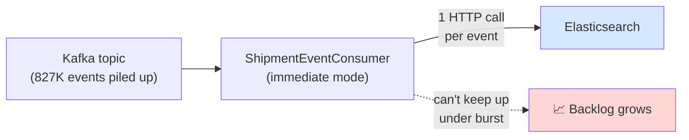
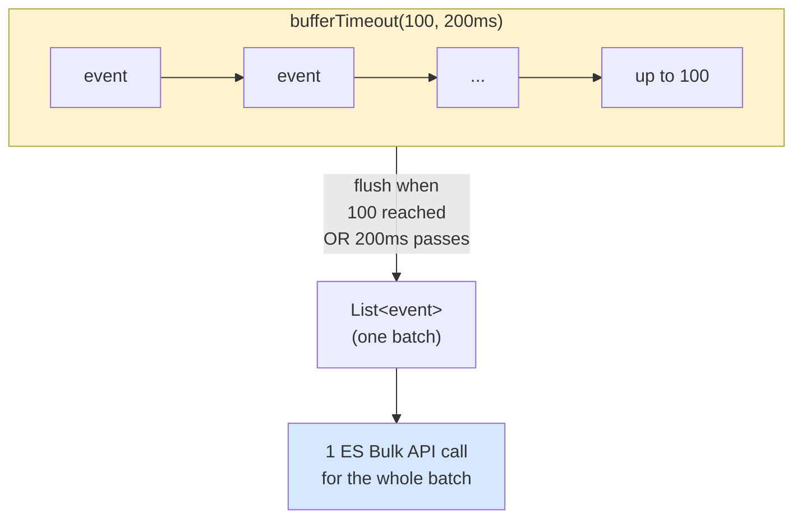
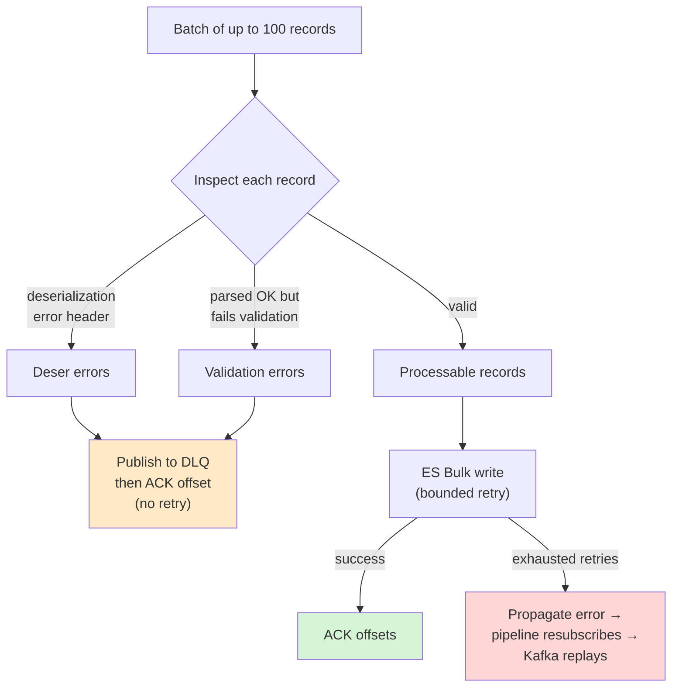
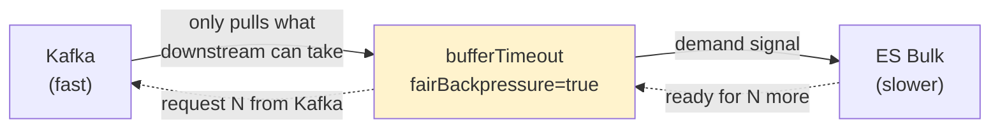
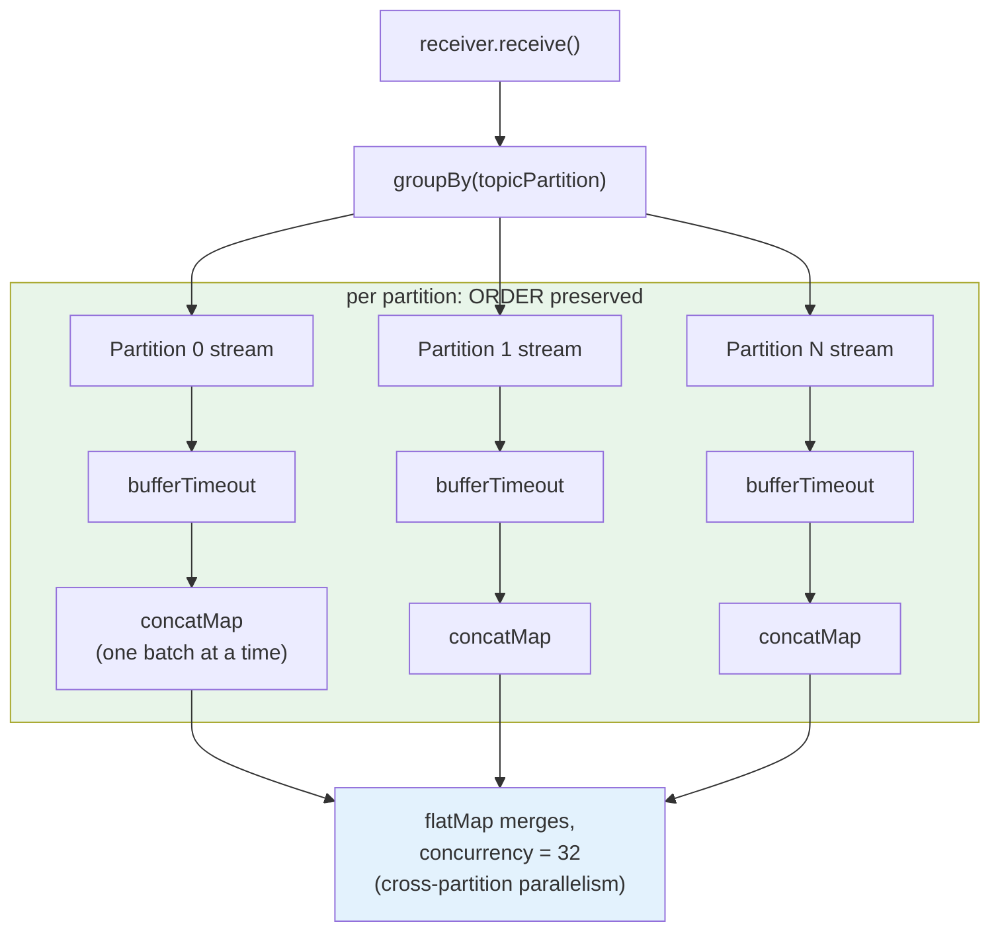
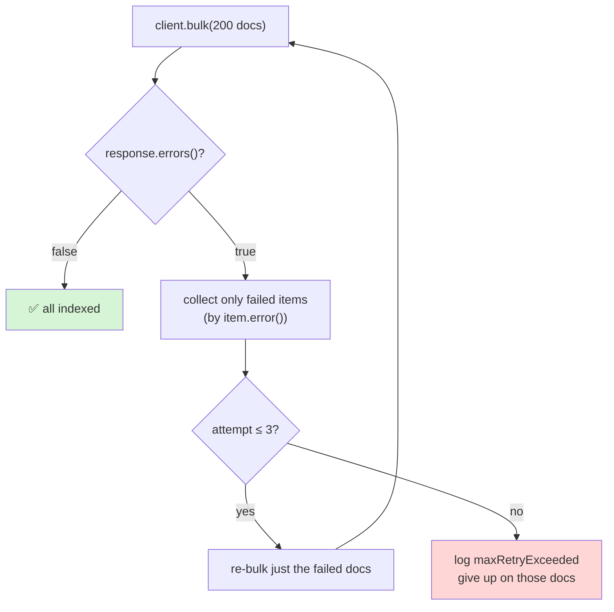
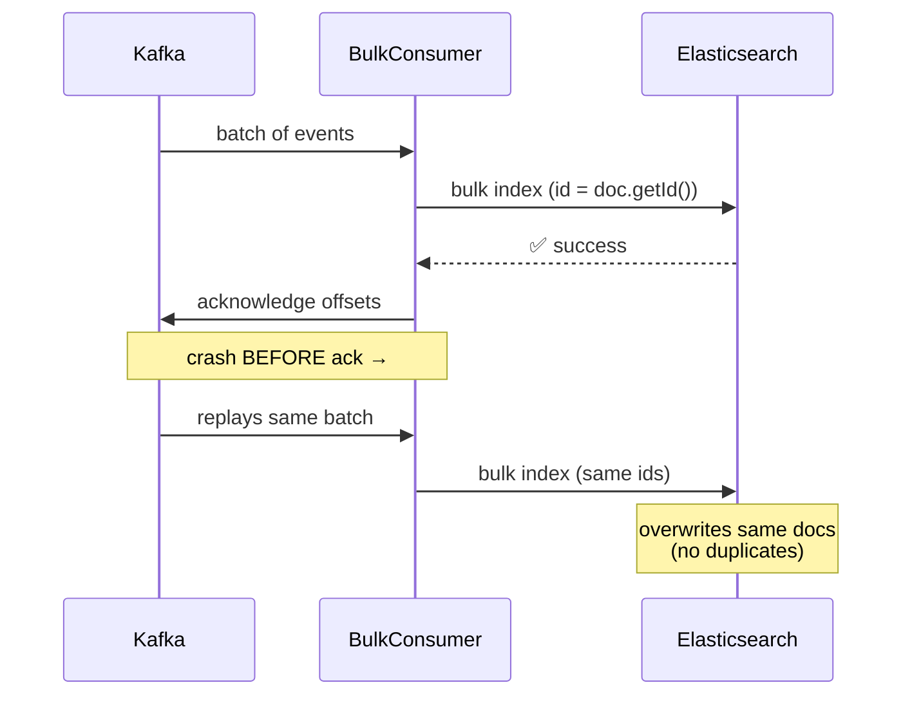
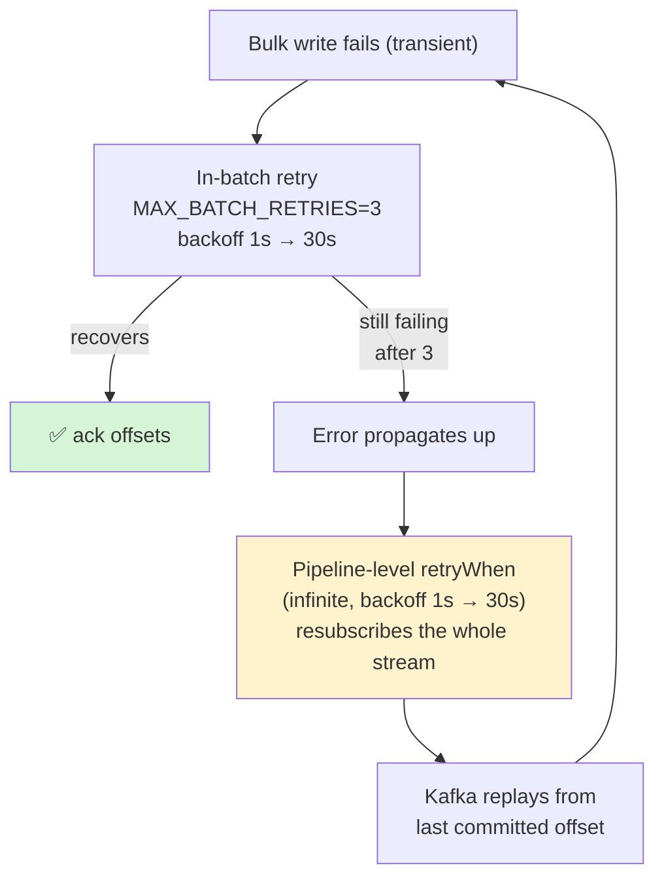

# Batched Kafka → Elasticsearch Consumer — Deep Dive & Interview Guide

> **Resume Line:** *"Engineered a batched Kafka→Elasticsearch consumer using Reactor `bufferTimeout` with equitable backpressure and the native ES Bulk API, eliminating an 827K-event backlog in ~15 minutes while holding memory (~17%) and CPU (~40%) stable — replacing a lag-prone per-record pattern."*
>
> **Extended talking point:** *"Our carrier-performance ingestion service consumed shipment events from Kafka and indexed them into Elasticsearch one record at a time. Under burst load it fell behind and built an 827K-event backlog. I re-architected the consumer to buffer events into time-and-size bounded batches with `Flux.bufferTimeout(100, 200ms, fairBackpressure=true)` and flush each batch through the Elasticsearch Bulk API in a single HTTP call, with per-partition ordering, idempotent writes, and layered retries. It drained the full backlog in ~15 minutes and held memory and CPU flat because every buffer in the pipeline is bounded."*

---

## Table of Contents

1. [What This Service Does (The 30-Second Version)](#1-what-this-service-does)
2. [Glossary of Key Terms (For Beginners)](#2-glossary-of-key-terms-for-beginners)
3. [The Problem — The Per-Record Pattern That Lagged](#3-the-problem)
4. [The Core Idea — Batching with `bufferTimeout`](#4-the-core-idea)
5. [The Full Pipeline (Annotated)](#5-the-full-pipeline)
6. [Equitable (Fair) Backpressure — What It Actually Means](#6-equitable-backpressure)
7. [Ordering, Parallelism & The `groupBy` Trick](#7-ordering-parallelism)
8. [The Elasticsearch Bulk API Side](#8-the-elasticsearch-bulk-api-side)
9. [Delivery Guarantees, Idempotency & Offsets](#9-delivery-guarantees)
10. [Error Handling — DLQ + Layered Retries](#10-error-handling)
11. [Why Memory & CPU Stayed Flat](#11-why-memory-cpu-stayed-flat)
12. [Before vs After — Concrete Numbers](#12-before-vs-after)
13. [Deep Interview Q&A (Every Angle)](#13-deep-interview-qa)

---

## 1. What This Service Does

**In one sentence:** the `carrier-performance-ingestion-service` reads shipment journey events from a Kafka topic, turns them into "carrier performance" documents, and writes them into Elasticsearch so dashboards can query carrier reliability, transit times, and delays.

The piece we're talking about is the **consumer** — the part that pulls events off Kafka and gets them into Elasticsearch as fast and as safely as possible.

There are **two implementations of that consumer** in the codebase, chosen at startup by a config flag:

| Mode (`shipment.processing.mode`) | Class | Strategy |
|:---|:---|:---|
| `immediate` (default) | `ShipmentEventConsumer` | **Old:** process & index **one event at a time** |
| `bulk` | `ShipmentBulkConsumer` | **New:** buffer events into batches, index with **one Bulk API call per batch** |

> 💡 Keeping both behind a feature flag (`@ConditionalOnProperty`) is itself a good talking point: it let us roll out the new path and instantly roll back to the old one if anything went wrong.

---

## 2. Glossary of Key Terms (For Beginners)

If some of this jargon is new, read this first — every later section assumes these.

* **Kafka topic / partition:** A topic is a named log of messages. It's split into **partitions** (parallel sub-logs). Kafka only guarantees ordering *within a single partition*, and messages with the same **key** always land on the same partition.
* **Offset:** A message's position number within a partition. The consumer **commits/acknowledges** an offset to say "I've safely processed everything up to here." If the consumer crashes, it restarts from the last committed offset.
* **Consumer lag / backlog:** The gap between the newest message produced and the last one the consumer has processed. A backlog of **827K events** means the consumer was 827,000 messages behind.
* **Throughput vs latency:** *Throughput* = how many events/second you process. *Latency* = how long one event takes end-to-end. Batching trades a little latency (an event may wait up to 200ms in a buffer) for a huge throughput gain.
* **Reactor (`Flux` / `Mono`):** A reactive-streams library. A `Flux<T>` is a stream of 0..N items; a `Mono<T>` is 0 or 1 item. They're **lazy** (nothing happens until you `subscribe`) and support **backpressure**.
* **Backpressure:** The mechanism where a *slow consumer* tells a *fast producer* "slow down, I can only handle N more items right now." Without it, a fast Kafka stream would overwhelm a slower Elasticsearch and blow up memory.
* **`bufferTimeout(maxSize, maxTime)`:** A Reactor operator that collects items into a `List` and emits the list when **either** it reaches `maxSize` items **or** `maxTime` elapses — whichever comes first. This is the heart of the batching strategy.
* **Elasticsearch Bulk API:** A single HTTP endpoint that accepts **many** index/delete operations in **one** request, instead of one HTTP call per document. Dramatically cheaper than N separate calls.
* **Idempotent write:** An operation you can safely repeat without changing the result. Indexing a document with a fixed `_id` is idempotent — doing it twice just overwrites with the same data, no duplicate.
* **DLQ / DLT (Dead-Letter Queue/Topic):** A separate Kafka topic where "poison" messages (un-parseable or invalid) are parked so they don't block the main flow forever.
* **At-least-once delivery:** A guarantee that every event is processed *at least* once (possibly more than once on retry). Combined with idempotent writes, duplicates do no harm.

---

## 3. The Problem

### 👶 A Simple Analogy: The Single-Letter Mail Carrier

Imagine a postal worker who delivers mail like this: pick up **one** letter from the sorting office, drive across town, deliver it, drive back, pick up the **next** letter, repeat. Each round trip is mostly *driving*, not *delivering*. On a quiet day it's fine. But when a holiday rush dumps 827,000 letters in the office, this worker falls hopelessly behind — the pile (backlog) just grows.

The **batch** version: load 100–200 letters into the van, do **one** trip, deliver them all, come back. The driving cost is paid once per 200 letters instead of once per letter.

### What the old per-record path actually did

In `immediate` mode, `ShipmentEventConsumer` processes each record on its own:

```java
// ShipmentEventConsumer (immediate mode) — simplified
.groupBy(ReceiverRecord::key, MAX_CONCURRENCY)
.flatMap(group -> group
        .concatMap(rec -> processRecord(rec).thenReturn(rec)) // 1 event ...
        .doOnNext(rec -> rec.receiverOffset().acknowledge()), // ... 1 ES write ... 1 ack
    MAX_CONCURRENCY)
```

Each event triggered roughly **one Elasticsearch write** and **one offset commit**. The "driving cost" here is the **per-request HTTP + network round-trip to Elasticsearch**. At ~12 events/sec average it kept up, but during bursts (1000+/sec) the per-record overhead dominated and the consumer couldn't drain fast enough → the **827K backlog**.



> **The root cause in one line:** the fixed per-event overhead (HTTP round-trip + offset commit) was multiplied by *every single event*, so cost scaled **O(N) in network calls** instead of **O(N / batchSize)**.

---

## 4. The Core Idea

The fix is to stop treating events one at a time. Collect them into a **batch** that is bounded **two ways at once**:

```java
// ShipmentBulkConsumer
partitionFlux
    .bufferTimeout(BATCH_SIZE, MAX_TIME, true)   // BATCH_SIZE=100, MAX_TIME=200ms, fairBackpressure=true
    .concatMap(this::processBatch)
```

`bufferTimeout(100, 200ms)` means: **"give me a `List` of up to 100 events, but never make me wait longer than 200ms."**

* **High traffic** → the buffer fills to 100 almost instantly → we flush full batches → maximum throughput (great for draining a backlog).
* **Low traffic** → maybe only 3 events arrive → after 200ms we flush a batch of 3 anyway → events never get "stuck" waiting for a batch that will never fill. This bounds **latency**.



This single change turns *N network round-trips* into *N/100 round-trips*. That's the entire performance story in one operator.

---

## 5. The Full Pipeline

Here's the real `start()` method, annotated line by line:

```java
@EventListener(ApplicationStartedEvent.class)
public void start() {
    receiver.receive()                                          // ① reactive stream of Kafka records
        .groupBy(rec -> rec.receiverOffset().topicPartition())  // ② one sub-stream per partition
        .flatMap(partitionFlux -> partitionFlux
                .bufferTimeout(BATCH_SIZE, MAX_TIME, true)       // ③ batch within a partition (fair BP)
                .concatMap(this::processBatch),                  // ④ process batches IN ORDER per partition
            PARTITION_CONCURRENCY)                               // ⑤ process up to 32 partitions in parallel
        .retryWhen(Retry.backoff(Long.MAX_VALUE,                 // ⑥ if the whole pipeline errors,
                PIPELINE_RETRY_MIN_BACKOFF)                      //    resubscribe (Kafka replays from
            .maxBackoff(PIPELINE_RETRY_MAX_BACKOFF))             //    last committed offset)
        .subscribe(...);                                         // ⑦ start it running
}
```

| # | Operator | Why it's there |
|:--|:---|:---|
| ① | `receiver.receive()` | `reactor-kafka` gives us records as a `Flux` with backpressure built in. |
| ② | `groupBy(topicPartition)` | Split the stream into one sub-stream **per partition** so we can preserve per-partition order. |
| ③ | `bufferTimeout(100, 200ms, true)` | Batch events *within each partition*. The `true` = **fair backpressure**. |
| ④ | `concatMap(processBatch)` | `concatMap` processes batches **one at a time, in order** → ordering within a partition is preserved. |
| ⑤ | `flatMap(..., 32)` | The outer `flatMap` runs up to **32 partitions concurrently** → cross-partition parallelism. |
| ⑥ | `retryWhen(backoff(MAX_VALUE))` | If the pipeline ever errors out, **resubscribe forever** with exponential backoff so the consumer self-heals. |
| ⑦ | `subscribe()` | Nothing runs until subscription — this kicks the whole machine into motion at app startup. |

And inside `processBatch`, the batch is split into three buckets before anything is written:



The key design decision: **bad data** (deser/validation) is non-retriable — retrying would never help — so it's parked in the DLQ and acknowledged. Only **valid records** go through the retry-able bulk write, and their offsets are committed **only on success**.

---

## 6. Equitable Backpressure

This is the phrase from the resume line, and interviewers will poke at it. Be precise.

`bufferTimeout` has an overload with a third boolean argument:

```java
bufferTimeout(int maxSize, Duration maxTime, boolean fairBackpressure)
```

That `true` is **`fairBackpressure`**. "Equitable backpressure" = **fair backpressure**.

### What problem does it solve?

Without fair backpressure, `bufferTimeout` can be "greedy": it tends to request an unbounded amount from upstream to keep its buffer fed, which can let too many in-flight events pile up when the downstream (Elasticsearch) is slow — defeating the point of backpressure and risking memory growth.

With `fairBackpressure=true`, the operator coordinates demand **fairly** between what the downstream is actually ready to consume and what it pulls from upstream. It won't over-request from Kafka just to fill buffers the slow ES side can't drain. Concretely:



> **One-liner for the interview:** *"Fair backpressure makes the buffering operator propagate the real downstream demand back to Kafka instead of greedily pulling, so memory stays bounded even when Elasticsearch is the bottleneck. That's what lets us drain a huge backlog without OOMing."*

This directly connects to the **stable ~17% memory** claim — backpressure is *why* memory doesn't balloon while chewing through 827K events.

---

## 7. Ordering & Parallelism

A classic interview trap: *"If you batch and parallelize, don't you break ordering?"* The answer is no — and here's exactly why.

Kafka guarantees order **only within a partition**, and same-key messages always go to the same partition. So we only need to preserve order *per partition*. The pipeline does this with a two-level structure:



* **`concatMap`** (not `flatMap`) inside each partition = **strictly sequential**: batch 2 doesn't start until batch 1 finishes. Order within the partition is intact.
* **Outer `flatMap(..., PARTITION_CONCURRENCY=32)`** = up to 32 *different* partitions processed at the same time. Parallelism across partitions, order within each.

> ⚠️ **Subtle gotcha worth mentioning:** `PARTITION_CONCURRENCY` (32) **must be ≥ the number of partitions** assigned to this consumer. A bounded `flatMap` over `groupBy` will **deadlock** if concurrency < partition count, because some partition sub-streams never get subscribed and thus never release demand. The code comments call this out explicitly.

---

## 8. The Elasticsearch Bulk API Side

Once a batch of valid events becomes a batch of `CarrierPerformanceProjection` documents, `ReactiveBulkProcessor` writes them. There's a **second tier of batching** here:

```java
public Mono<Void> process(Flux<CarrierPerformanceProjection> stream) {
    return stream
        .onBackpressureBuffer(MAX_SIZE, d -> log.warn(...))   // bounded safety buffer (10_000)
        .buffer(BULK_SUB_BATCH_SIZE)                          // sub-batches of 200
        .flatMap(subBatch -> executeBulk(subBatch, 0),
                 BULK_SUB_BATCH_CONCURRENCY)                  // up to 2 bulk calls in flight
        .then();
}
```

Why split again into sub-batches of 200?

* One giant bulk request (say 5,000 docs) is a single huge serial HTTP call and a big chunk of heap. Splitting into **200-doc sub-batches** with **concurrency 2** keeps each request modest and lets two run in parallel — better pipelining, smaller memory spikes, less shard contention.

The actual bulk call:

```java
Mono.fromCallable(() -> client.bulk(buildBulkRequest(batch)))  // blocking ES client...
    .subscribeOn(Schedulers.boundedElastic())                  // ...moved off the event loop
    .timeout(Duration.ofSeconds(BULK_TIMEOUT_SECONDS))         // 60s cap
    .flatMap(response -> handleResponse(...));
```

Two important details:

1. **`subscribeOn(boundedElastic())`** — the Elasticsearch Java client `client.bulk()` is **blocking**. Running it directly on Reactor's event-loop thread would stall the whole pipeline. Wrapping it in `Mono.fromCallable(...).subscribeOn(boundedElastic())` offloads the blocking call to a dedicated thread pool.

2. **Partial-failure handling** — a bulk request can **partly** succeed. ES returns a `200 OK` even if individual items failed, with per-item errors. The code inspects every item:

```java
if (!response.errors()) { logSuccess(...); return Mono.empty(); }  // all good
List<...> failed = collectFailedDocs(response, batch);             // pick out only the failures
return executeBulk(failed, attempt + 1);                           // retry ONLY the failed subset (≤ 3x)
```



Retrying **only the failed subset** (not the whole batch) avoids re-indexing the docs that already succeeded — cheaper and avoids unnecessary work.

---

## 9. Delivery Guarantees

This is **at-least-once** delivery, made safe by **idempotent writes**.

### Offsets are committed only after success

In `ShipmentBulkConsumer`, offsets are acknowledged in `logBatchProcessed`, which runs **only** on the success path (`doOnSuccess`):

```java
return shipmentEventUseCase.handleShipmentEvents(Flux.fromIterable(events))
        .doOnSuccess(v -> logBatchProcessed(events, processableRecords, batchStart));
// logBatchProcessed → processableRecords.forEach(r -> r.receiverOffset().acknowledge());
```

If the bulk write fails and exhausts retries, the error **propagates**, the offsets are **never acknowledged**, the pipeline resubscribes, and Kafka **replays** from the last committed offset. Nothing is silently lost.

### Why duplicates don't hurt — idempotency

Because replay can re-deliver events, we must avoid duplicate documents. The bulk request uses an **explicit document `_id`** (the projection's own id) plus routing:

```java
.index(idx -> idx
    .index(CARRIER_PERFORMANCE_INDEX)
    .id(doc.getId())          // ← fixed, deterministic id
    .routing(doc.getId())
    .document(doc));
```

Indexing with a fixed `_id` is an **upsert/overwrite**: re-processing the same event just rewrites the same document. So *at-least-once + deterministic id = effectively-once* from the data's point of view.



---

## 10. Error Handling

There are **three distinct failure types**, each handled differently — interviewers love this distinction:

| Failure type | Retriable? | Handling |
|:---|:---|:---|
| **Deserialization** (bytes won't parse) | ❌ No | Publish to **DLQ**, then **ack** (stops infinite replay of poison data) |
| **Validation** (parsed, but breaks rules) | ❌ No | Publish to **DLQ**, then **ack** |
| **Transient** (ES down, timeout) | ✅ Yes | **Bounded retry** with backoff; if exhausted → propagate → Kafka replay |

And retries themselves are **layered**:



* **Inner retry (3x)** handles brief ES blips without disturbing the rest of the pipeline.
* **Outer retry (infinite)** is the self-healing safety net: even a long ES outage just makes the consumer back off and keep retrying instead of dying.
* A **120s `BATCH_PROCESSING_TIMEOUT`** caps how long any single batch can hang before being abandoned, so one stuck batch can't freeze a partition forever.

> 💡 **Why ack poison messages?** If you *retried* un-parseable data forever, that one bad message would block its partition permanently (a "poison pill") and the backlog would never clear. Parking it in the DLQ and acking is what keeps the consumer healthy.

---

## 11. Why Memory & CPU Stayed Flat

The "~17% memory, ~40% CPU" claim isn't luck — **every buffer in the pipeline is deliberately bounded**, and several constants were *tuned down* specifically to shrink the memory footprint:

| Constant | Value | Note (from code comments) |
|:---|:---|:---|
| `BATCH_SIZE` | **100** | *reduced from 200 — smaller per-batch memory footprint* |
| `MAX_CONCURRENCY` | **8** | *reduced from 16 — limits concurrent partition memory* |
| `BULK_SUB_BATCH_SIZE` | **200** | *reduced from 250 — safer per-bulk-call size* |
| `BULK_SUB_BATCH_CONCURRENCY` | **2** | *reduced from 4 — limits concurrent ES shard pressure* |
| `MAX_SIZE` (backpressure buffer) | **10,000** | bounded overflow buffer in `ReactiveBulkProcessor` |
| `CACHE_WARM_CONCURRENCY` | **16** | *reduced from 64 — limits ES warm-up pressure* |

The mental model: **at any instant, the maximum number of events "in flight" is bounded** ≈ (partitions in parallel) × (batch size) × (sub-batch concurrency). Because nothing is unbounded, memory is essentially flat regardless of how big the backlog is — you can throw 827K or 8.27M events at it and the *steady-state* memory looks the same. Fair backpressure (Section 6) is what enforces this bound end-to-end.

CPU stays moderate because the expensive part (waiting on ES network I/O) is **non-blocking from the pipeline's perspective** — blocking calls are offloaded to `boundedElastic`, and the event loop isn't burning CPU spinning.

---

## 12. Before vs After

| Metric | Before (per-record / `immediate`) | After (batched / `bulk`) |
|:---|:---|:---|
| ES calls per 100 events | ~100 HTTP round-trips | **1 bulk call** (+ sub-batching) |
| Behavior under burst | Falls behind → backlog grows | Fills batches → drains fast |
| 827K backlog | Could not catch up | **Cleared in ~15 min** |
| Memory | Risk of growth under load | **Stable ~17%** (bounded buffers) |
| CPU | — | **Stable ~40%** |
| Delivery | at-least-once | at-least-once + idempotent |

**Quick math to quote:** 827,000 events ÷ ~15 min (900s) ≈ **~920 events/sec sustained** drain rate. With 100-event batches that's only ~9 bulk-batch flushes/sec per the consumer — trivially within Elasticsearch's capacity, which is exactly why it kept up.

---

## 13. Deep Interview Q&A

Each answer below is written the way you'd *say* it, followed by the *why* so you can defend it under follow-ups.

### Q1. "Walk me through what you built."
**Answer:** "We had a Kafka→Elasticsearch ingestion consumer that indexed shipment events one at a time. Under burst load it built an 827K-event backlog. I re-architected it to batch events with Reactor's `bufferTimeout` — up to 100 events or 200ms, whichever comes first — and flush each batch through the Elasticsearch Bulk API in a single call. I preserved per-partition ordering with `groupBy` + `concatMap`, parallelized across partitions with `flatMap`, made writes idempotent with deterministic doc ids, and added layered retries with a DLQ for poison messages. It drained the backlog in ~15 minutes with flat memory and CPU."

### Q2. "Why was the old per-record approach slow? It's not like the CPU work changed."
**Answer:** "The bottleneck wasn't CPU, it was the **fixed per-request overhead** — one HTTP round-trip to Elasticsearch plus one offset commit *per event*. That overhead is paid N times. Batching pays it once per ~100 events, so the number of network round-trips drops by ~100x. It's an amortization win, not a compute win."

### Q3. "Why `bufferTimeout` and not plain `buffer(100)`?"
**Answer:** "`buffer(100)` only flushes when it hits exactly 100 items. During low traffic, an event could sit forever waiting for a 100th event that never arrives — unbounded latency. `bufferTimeout(100, 200ms)` adds a **time trigger**: even a batch of 3 flushes after 200ms. So I get big batches under load *and* bounded latency when it's quiet."

### Q4. "What exactly is 'equitable backpressure'?"
**Answer:** "It's the `fairBackpressure=true` flag on `bufferTimeout`. Without it the operator can greedily over-request from upstream to keep its buffer full, which lets in-flight events pile up when Elasticsearch is the slow side. With it, the operator propagates the *real* downstream demand back to Kafka, so we never pull more than we can write. That's the mechanism that keeps memory bounded while draining a huge backlog."

### Q5. "If you batch and run partitions in parallel, how do you not break ordering?"
**Answer:** "Kafka only guarantees ordering within a partition, and same-key events share a partition. So I `groupBy` partition, and *within* each partition I use `concatMap`, which processes batches strictly one-at-a-time in order. The parallelism is only the **outer** `flatMap` across *different* partitions. Order within a partition is never violated."

### Q6. "Your outer `flatMap` has a concurrency limit of 32. What if you set it too low?"
**Answer:** "That's an actual gotcha we hit. The concurrency must be **≥ the number of partitions** assigned to the consumer. A bounded `flatMap` over `groupBy` will only subscribe to that many inner streams; if it's lower than the partition count, the un-subscribed partitions never make progress and the pipeline **deadlocks**. We set `PARTITION_CONCURRENCY=32` to stay safely above our partition count."

### Q7. "A bulk request returns 200 OK even if some documents fail. How do you handle that?"
**Answer:** "Right — bulk is not all-or-nothing. I check `response.errors()`, and if true I walk `response.items()`, collect only the items with a non-null `error()`, and **retry just that failed subset** (up to 3 times). I don't retry the whole batch, since the successful docs are already indexed. If a doc still fails after retries, we log it (`maxRetryExceeded`) and move on so one bad doc can't stall everything."

### Q8. "What are your delivery guarantees? Could you lose or duplicate data?"
**Answer:** "It's **at-least-once**. Offsets are committed only after a batch is successfully indexed — `doOnSuccess`. If a write fails after retries, the error propagates, offsets aren't committed, and Kafka replays from the last committed offset, so we don't lose data. Duplicates from replay are harmless because we index with a **deterministic `_id`** (the projection id), so re-indexing just overwrites the same document. At-least-once + idempotent id ≈ effectively-once for the data."

### Q9. "Why not exactly-once with Kafka transactions?"
**Answer:** "Exactly-once across Kafka *and* an external system like Elasticsearch is hard — ES isn't a transactional participant in Kafka's transaction protocol. The pragmatic, robust pattern is at-least-once delivery plus idempotent writes keyed on a deterministic id, which gives the same observable result without the complexity and throughput cost of distributed transactions."

### Q10. "The ES client is blocking. How does that coexist with reactive code?"
**Answer:** "I wrap the blocking `client.bulk(...)` in `Mono.fromCallable(...)` and `subscribeOn(Schedulers.boundedElastic())`. That moves the blocking call onto a dedicated elastic thread pool instead of running it on Reactor's event-loop threads, which would otherwise stall the whole pipeline. The reactive operators still orchestrate concurrency, retries, and backpressure around it."

### Q11. "How did you keep memory flat while processing 827K events?"
**Answer:** "Every buffer is bounded and several constants were tuned down deliberately — batch size 100, partition concurrency 8, ES sub-batch 200 at concurrency 2, plus a bounded `onBackpressureBuffer` of 10,000. The max events in flight at any moment is bounded by those numbers regardless of backlog size, and fair backpressure enforces that bound back to Kafka. So whether the backlog is 800K or 8M, steady-state memory looks the same — that's why it held ~17%."

### Q12. "What happens to a message that can never be processed — bad JSON?"
**Answer:** "Those are non-retriable. Deserialization errors are detected via a Kafka header, validation errors via an explicit validator. Both get published to a **DLQ/dead-letter topic** and then the offset is **acknowledged**. If I retried poison data instead, it'd become a poison pill blocking its partition forever and the backlog would never clear. The DLQ lets us inspect and reprocess them out-of-band."

### Q13. "How do you handle a sustained Elasticsearch outage?"
**Answer:** "Two retry layers. Inside a batch, a bounded retry (3x, 1–30s backoff) rides out brief blips. If that's exhausted, the error propagates to a **pipeline-level `retryWhen` with effectively infinite retries** and backoff, which resubscribes the whole stream — so during a long outage the consumer just keeps backing off and retrying instead of dying. When ES recovers, it replays from the last committed offset and catches up. A 120s per-batch timeout prevents any single batch from hanging forever."

### Q14. "How did you pick batch size 100 and timeout 200ms?"
**Answer:** "It's a throughput/latency/memory trade-off. Bigger batches = fewer round-trips but more heap per batch and higher tail latency; the 200ms timeout caps worst-case latency for sparse traffic. We actually *reduced* batch size from 200 to 100 and concurrency from 16 to 8 specifically to shrink the memory footprint after observing it under load — the numbers are tuned empirically, not theoretical."

### Q15. "Why two levels of batching — `bufferTimeout(100)` then `buffer(200)`?"
**Answer:** "They serve different purposes. `bufferTimeout` at the Kafka level groups events by *time and size* so we commit offsets per meaningful batch. The inner `buffer(200)` in the ES processor shapes the *bulk request* size — splitting work into parallel, modestly-sized HTTP calls (concurrency 2) instead of one giant serial request, which is easier on heap and on ES shards."

### Q16. "Why keep the old per-record consumer at all?"
**Answer:** "Both are behind `@ConditionalOnProperty(shipment.processing.mode)`. Keeping `immediate` mode gave us a **safe rollback**: we could flip back instantly if the bulk path misbehaved in production. It also makes the change reviewable and A/B-testable. Once bulk proved itself, immediate is just the fallback."

### Q17. "What would you improve if you had more time?"
**Answer:** "A few things: (1) make the DLQ reprocessing automated rather than manual; (2) add adaptive batch sizing that grows under backlog and shrinks when caught up; (3) richer metrics — we already emit batch size, throughput, and per-doc errors via Micrometer, but I'd add explicit consumer-lag-based autoscaling; (4) consider the async/reactive ES client to drop the `boundedElastic` offload entirely."

### Q18. "How do you know it actually worked — what did you measure?"
**Answer:** "We instrument throughput (`recPerSec`, `docsPerSec`), batch sizes, total processed, bulk attempt counts, and partial-failure counts via Micrometer `@Timed` and structured `metric=` logs. The headline evidence was consumer lag dropping from 827K to zero in ~15 minutes while the pod's memory sat around 17% and CPU around 40% — flat, not climbing, which is the signature of a properly backpressured bounded pipeline."

---

### 🎯 The 3 things to make sure you say
1. **`bufferTimeout(100, 200ms, fairBackpressure=true)`** turns N HTTP calls into N/100 — that's the perf win, and the `true` is the "equitable backpressure."
2. **`groupBy(partition)` + `concatMap`** preserves order; the **outer `flatMap`** gives parallelism — batching does *not* break ordering.
3. **At-least-once + deterministic `_id`** = safe replay; **bounded buffers** = flat memory; **DLQ for poison data** = no stuck partitions.
