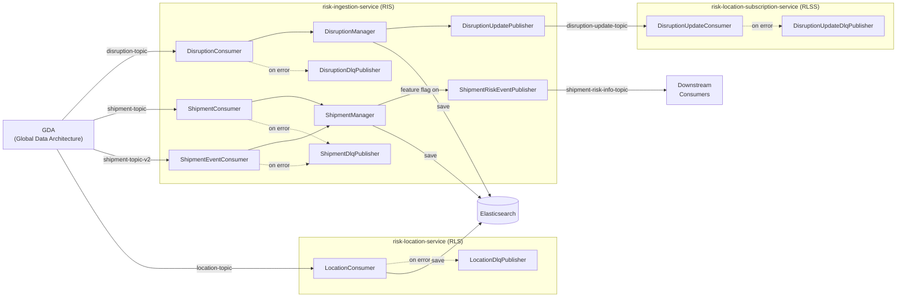

# Kafka Deep Dive — isce-risk-management

> **Context**: PR #628 and full Kafka architecture across the risk-management microservices

---

## 1. Architecture Overview

The system uses **Apache Kafka** as the event-driven backbone connecting **3 microservices** that consume events from an upstream GDA (Global Data Architecture) platform, process them, and propagate downstream:



---

## 2. Kafka Topics (Production)

| Topic Name (Prod) | Type | Service | Purpose |
|---|---|---|---|
| `msk.iscegda.mrmdisruption.topic.internal.dedicated.v1` | Consumer | RIS | Disruption events from GDA |
| `msk.iscegda.mrmshipments.topic.internal.dedicated.v1` | Consumer | RIS | Shipment events from GDA (v1 — full message) |
| `msk.iscegda.mrmshipments.topic.internal.dedicated.v2` | Consumer | RIS | Shipment events from GDA (v2 — event-based with UPSERT/DELETE) |
| `msk.iscewebproductsrm.disruptionupdate.topic.internal.dedicated.v1` | Producer→Consumer | RIS produces → RLSS consumes | Internal disruption update propagation |
| `msk.iscewebproductsrm.shipmentriskinformation.topic.internal.dedicated.v1` | Producer | RIS | Shipment risk info for downstream webhook consumers |
| `msk.iscewebproductsrm.disruptiondlq.topic.internal.dedicated.v1` | Producer (DLQ) | RIS | Failed disruption messages |
| `msk.iscewebproductsrm.shipmentdlq.topic.internal.dedicated.v1` | Producer (DLQ) | RIS | Failed shipment messages |
| *(location-topic — prod name in RLS values)* | Consumer | RLS | Location events from GDA |
| *(location-dlq-topic — prod name in RLS values)* | Producer (DLQ) | RLS | Failed location messages |
| *(disruption-update-dlq-topic — prod name in RLSS values)* | Producer (DLQ) | RLSS | Failed disruption update messages |

---

## 3. Kafka Configuration Settings (Detailed)

### 3.1 Common Settings (Same Across All 3 Services)

| Setting | Value | Explanation |
|---|---|---|
| `bootstrap-servers` | `${KAFKA_BOOTSTRAP_SERVER}` | Kafka cluster endpoint (injected from Vault in prod) |
| `security.protocol` | `SASL_SSL` (prod) / `PLAINTEXT` (local) | Authentication mechanism |
| `sasl.mechanism` | `SCRAM-SHA-512` | SASL authentication type |
| `sasl.jaas.config` | Vault secret | JAAS login credentials |
| `client-id` | `${spring.application.name}` | Unique per service (e.g., `risk-ingestion-service`) |
| `ssl.trust-store-type` | `PEM` | TLS certificate type |
| `ssl.trust-store-certificates` | Base64-encoded PEM cert from Vault | The TLS truststore certificate |

### 3.2 Consumer Settings

| Setting | Value | Explanation |
|---|---|---|
| `group-id` | Service-specific (see below) | Consumer group identity |
| `auto-offset-reset` | `latest` | Start from latest offset (skip old messages on fresh join) |
| `max-poll-records` | **1** | Process **one message at a time** — ensures ordering & safe DLQ routing |
| `key-deserializer` | `StringDeserializer` (Spring default) | Keys are Strings |
| `value-deserializer` | `StringDeserializer` (Spring default) | Values are JSON strings |

**Consumer Groups (Prod):**

| Service | Consumer Group |
|---|---|
| RIS | `msk.iscewebproductsrm.ris.consumergroup.v1` |
| RLS | `msk.iscewebproductsrm.rls.consumergroup.v1` |
| RLSS | `msk.iscewebproductsrm.rlss.consumergroup.v1` |

### 3.3 Producer Settings

| Setting | Value | Explanation |
|---|---|---|
| `key-serializer` | `StringSerializer` | Keys serialized as Strings |
| `value-serializer` | `StringSerializer` | Values serialized as JSON Strings |
| `acks` | **`all`** | Wait for **all in-sync replicas** to acknowledge — strongest durability guarantee |
| `compression-type` | **`zstd`** | Zstandard compression for efficient network/storage usage |

### 3.4 Listener Settings (RIS & RLS Only)

| Setting | Value | Explanation |
|---|---|---|
| `idle-between-polls-ms` | `500ms` | Throttle between polls to control CPU/throughput. Prevents tight-loop polling |

---

## 4. KafkaConfigurations.java (Custom Config Class)

Each service has a [KafkaConfigurations.java](file:///Users/rohit.kumar.4/Documents/isce-risk-management/risk-ingestion-service/src/main/java/com/maersk/isce/ris/config/KafkaConfigurations.java) that customizes Spring Kafka's auto-configured beans:

### Beans Registered

| Bean | Purpose |
|---|---|
| `kafkaTemplate` | `KafkaTemplate<String, String>` — used by all publishers. Has **observability enabled** (tracing) |
| `kafkaListenerContainerFactory` | `ConcurrentKafkaListenerContainerFactory` — container for `@KafkaListener` consumers. **Observation enabled** for tracing |
| `kafkaAdminClient` | Used by `KafkaHealthIndicator` to check cluster connectivity |
| `kafkaAdmin` | Spring's Kafka admin abstraction |
| `observationConvention` | Custom `KafkaTemplateObservationConvention` that tags metrics with the `topic` name |

### SSL/SASL Handling

```java
// In both producerConfig() and consumerConfig():
if (securityProtocol.equalsIgnoreCase("SASL_SSL")) {
    props.put(SSL_TRUSTSTORE_CERTIFICATES_CONFIG,
              new String(Base64.getDecoder().decode(sslTrustStoreCertificate)));
    props.put(SSL_TRUSTSTORE_TYPE_CONFIG, sslTrustStoreType);
}
```

> The PEM certificate is stored **Base64-encoded** in Vault and decoded at runtime. This avoids filesystem-dependent truststore files.

---

## 5. Consumer Pattern (All Consumers Follow the Same Pattern)

Every consumer follows a **uniform reactive pattern**:

```java
@KafkaListener(topics = "#{'${kafka.consumer.<topic>}'}",
               groupId = "#{'${spring.kafka.consumer.group-id}'}",
               containerFactory = "kafkaListenerContainerFactory")
public Disposable consumeEvent(ConsumerRecord<String, String> consumerRecord) {
    return processEvent(consumerRecord)
            .doOnError(error -> {
                log.error("Error processing ...", error);
                dlqPublisher.sendRecord(consumerRecord, error);  // → DLQ
            })
            .onErrorResume(error -> Mono.empty())  // swallow after DLQ
            .subscribe();
}
```

### Processing Pipeline

1. **Validate** the `ConsumerRecord` (key & value non-null/empty)
2. **Deserialize** JSON string → domain model (e.g., `DisruptionMessage`, `ShipmentMessage`)
3. **Validate** the domain model structure
4. **Delegate** to Manager → Service → Elasticsearch
5. **On Error**: publish to DLQ and resume (never crash the consumer)

### Consumers Summary

| Consumer | Topic | Processes | Also Publishes To |
|---|---|---|---|
| [DisruptionConsumer](file:///Users/rohit.kumar.4/Documents/isce-risk-management/risk-ingestion-service/src/main/java/com/maersk/isce/ris/consumer/DisruptionConsumer.java) | `disruption-topic` | Saves to ES | `disruption-update-topic` (via DisruptionUpdatePublisher) |
| [ShipmentConsumer](file:///Users/rohit.kumar.4/Documents/isce-risk-management/risk-ingestion-service/src/main/java/com/maersk/isce/ris/consumer/ShipmentConsumer.java) | `shipment-topic` | Saves to ES | `shipment-risk-information-topic` (behind feature flag) |
| [ShipmentEventConsumer](file:///Users/rohit.kumar.4/Documents/isce-risk-management/risk-ingestion-service/src/main/java/com/maersk/isce/ris/consumer/ShipmentEventConsumer.java) | `shipment-topic-v2` | UPSERT/DELETE in ES | `shipment-risk-information-topic` (behind feature flag, UPSERT only) |
| [LocationConsumer](file:///Users/rohit.kumar.4/Documents/isce-risk-management/risk-location-service/src/main/java/com/maersk/isce/rls/consumer/LocationConsumer.java) | `location-topic` | Saves to ES | — |
| [DisruptionUpdateConsumer](file:///Users/rohit.kumar.4/Documents/isce-risk-management/risk-location-subscription-service/src/main/java/com/maersk/isce/rlss/consumer/DisruptionUpdateConsumer.java) | `disruption-update-topic` | Processes location subscriptions | — |

---

## 6. Producer Pattern (All Publishers Follow the Same Pattern)

```java
// Serialize to JSON
String messageJson = ObjectMapperUtility.OBJECT_MAPPER.writeValueAsString(message);

// Create ProducerRecord with domain-ID as key (ensures partition affinity)
var producerRecord = new ProducerRecord<>(topicName, domainId, messageJson);

// Async send with callback logging
kafkaTemplate.send(producerRecord)
    .whenCompleteAsync((result, exception) -> {
        if (exception == null) log.info("Published successfully");
        else log.error("Publish failed", exception);
    });
```

### Publishers Summary

| Publisher | Topic | Key Used | Triggered By |
|---|---|---|---|
| [DisruptionUpdatePublisher](file:///Users/rohit.kumar.4/Documents/isce-risk-management/risk-ingestion-service/src/main/java/com/maersk/isce/ris/publisher/DisruptionUpdatePublisher.java) | `disruption-update-topic` | `disruptionId` | After saving disruption to ES |
| [ShipmentRiskEventPublisher](file:///Users/rohit.kumar.4/Documents/isce-risk-management/risk-ingestion-service/src/main/java/com/maersk/isce/ris/publisher/ShipmentRiskEventPublisher.java) | `shipment-risk-information-topic` | `shipmentId` | When a shipment risk notification is triggered |
| [DisruptionDlqPublisher](file:///Users/rohit.kumar.4/Documents/isce-risk-management/risk-ingestion-service/src/main/java/com/maersk/isce/ris/publisher/DisruptionDlqPublisher.java) | `disruption-dlq-topic` | original key | On disruption processing error |
| [ShipmentDlqPublisher](file:///Users/rohit.kumar.4/Documents/isce-risk-management/risk-ingestion-service/src/main/java/com/maersk/isce/ris/publisher/ShipmentDlqPublisher.java) | `shipment-dlq-topic` | original key | On shipment processing error |
| [DisruptionUpdateDlqPublisher](file:///Users/rohit.kumar.4/Documents/isce-risk-management/risk-location-subscription-service/src/main/java/com/maersk/isce/rlss/publisher/DisruptionUpdateDlqPublisher.java) | `disruption-update-dlq-topic` | original key | On disruption update processing error in RLSS |

---

## 7. Dead Letter Queue (DLQ) Strategy

Every consumer has a **paired DLQ publisher**. The [DlqMapper](file:///Users/rohit.kumar.4/Documents/isce-risk-management/risk-ingestion-service/src/main/java/com/maersk/isce/ris/mapper/DlqMapper.java) creates structured `DlqMessage` objects with:

| Field | Value |
|---|---|
| `originalTopic` | The topic the message came from |
| `originalPartition` | Partition number |
| `originalOffset` | Offset in the partition |
| `timestamp` | `Instant.now()` |
| `failedAtService` | Service name constant |
| `failureReason` | `ExceptionClass: message` |
| `payload` | Original raw JSON payload |
| `retriable` | `true` unless `IllegalArgumentException` or `JsonProcessingException` (validation/parse errors are non-retriable) |

> [!IMPORTANT]
> The DLQ publishers themselves are wrapped in try-catch — if even DLQ publishing fails, it's logged as `CRITICAL` but the consumer **never crashes**. This ensures consumer group stability.

---

## 8. Health Checks

The [KafkaHealthIndicator](file:///Users/rohit.kumar.4/Documents/isce-risk-management/risk-ingestion-service/src/main/java/com/maersk/isce/ris/health/KafkaHealthIndicator.java) is a custom `ReactiveHealthIndicator` that:

1. Creates an `AdminClient` from the consumer config
2. Calls `adminClient.listTopics().names().get()`
3. Returns `Health.up()` if topics exist, `Health.down()` otherwise
4. Runs on `Schedulers.boundedElastic()` to avoid blocking the event loop

This health check is included in the **readiness probe** via:
```yaml
management.endpoint.health.group.readiness.include: "readinessState,diskSpace,ping,kafka"
```

> The pod won't receive traffic until Kafka is reachable.

---

## 9. Observability & Metrics

| Feature | How |
|---|---|
| **Distributed Tracing** | `observation-enabled: true` on both `KafkaTemplate` and `ConcurrentKafkaListenerContainerFactory`. Traces propagate through Kafka headers → Zipkin/Grafana |
| **Consumer Latency Metrics** | `@Timed` annotation on each consumer (e.g., `disruption-consumer-latency`, `shipment-consumer-latency`). Exposed as Prometheus histograms |
| **Producer Topic Metrics** | Custom `KafkaTemplateObservationConvention` adds a `topic` tag to producer metrics |
| **Prometheus Endpoint** | `/actuator/prometheus` exposed, Kubernetes annotations scrape it |

---

## 10. Deployment & Scaling (Prod)

| Setting | RIS |
|---|---|
| **Replicas** | **9** |
| **Memory Request/Limit** | 512Mi / 1Gi |
| **CPU Request/Limit** | 500m / 750m |
| **Max Heap** | 512m |
| **Rolling Update Strategy** | maxUnavailable: 50%, maxSurge: 1 |

> With `max-poll-records: 1` and 9 replicas, each pod processes **one message at a time**, and Kafka assigns partitions across the consumer group. This trades throughput for **strict ordering per partition** and **safe error handling**.

---

## 11. Key Data Flow: Disruption Processing (End-to-End)

```
1. GDA publishes disruption event → disruption-topic
2. DisruptionConsumer receives ConsumerRecord
3. ValidationUtility.validateConsumerRecord() — checks key/value non-empty
4. ObjectMapper deserializes JSON → DisruptionMessage
5. DisruptionMessageValidator validates structure
6. DisruptionManager.processMessage():
   a. DisruptionMapper maps DisruptionMessage → DisruptionDocument
   b. DisruptionService.saveOrUpdateDisruption() → Elasticsearch
   c. DisruptionMapper maps DisruptionDocument → DisruptionUpdateMessage
   d. DisruptionUpdatePublisher publishes → disruption-update-topic
7. RLSS DisruptionUpdateConsumer receives the update
8. Processes location subscriptions for affected regions
```

If any step fails:
```
Error → DisruptionDlqPublisher → disruption-dlq-topic
     → Structured DlqMessage with original payload + error info
     → Consumer resumes with Mono.empty() (no crash)
```

---

## 12. Interview-Ready Summary Points

> [!TIP]
> Key talking points for explaining this in an interview:

1. **Event-Driven Architecture**: 3 microservices connected via Kafka — RIS ingests disruptions/shipments from GDA, processes them into Elasticsearch, and publishes internal updates downstream to RLSS
2. **Security**: SASL_SSL with SCRAM-SHA-512, PEM certificates stored in HashiCorp Vault, Base64-decoded at runtime
3. **Resilience**: Every consumer has a paired DLQ publisher. `max-poll-records: 1` ensures a single failure doesn't block a batch. Even DLQ failures are caught (never crash)
4. **Durability**: `acks=all` ensures messages are written to all in-sync replicas before acknowledging
5. **Performance**: `zstd` compression, `idle-between-polls: 500ms` throttling, 9 replicas in prod for parallel partition consumption
6. **Observability**: Full distributed tracing via Spring Micrometer + Zipkin. Consumer latency histograms via `@Timed`. Prometheus scraping via `/actuator/prometheus`
7. **Health Checks**: Custom `ReactiveHealthIndicator` that verifies Kafka connectivity before marking pod as ready (part of K8s readiness probe)
8. **Reactive Processing**: All consumers use Project Reactor (`Mono`/`Disposable`) for non-blocking processing, even though Kafka consumption itself is synchronous (bridged via `Mono.fromCallable`)

---
---

# Part 2: Interview Grill-Down Questions & Answers

> [!IMPORTANT]
> These are the kinds of deep questions senior engineers ask at companies like Amazon, Uber, LinkedIn, or Maersk. Your architecture document is strong technically — the grilling will focus on **tradeoffs, failures, scaling, guarantees, and design decisions**.

---

## 1. Kafka Fundamentals Grill

### Q1. Why did you choose Kafka instead of REST communication between services?

**Answer:** We chose Kafka for **asynchronous decoupling** between the GDA upstream platform and our risk microservices. Key reasons:

- **Backpressure handling** — if our service is slow, messages queue in Kafka partitions instead of timing out
- **Replayability** — Kafka retains messages; we can reprocess from a past offset after bug fixes
- **Durable event log** — messages persist on disk with configurable retention
- **Independent scaling** — producers and consumers scale independently
- **Loose coupling** — GDA doesn't need to know about our services at all
- **Ordering** — partition-based ordering by entity key (shipmentId, disruptionId)

**Follow-up: Why not RabbitMQ / Pulsar / SQS+SNS?**

| | Kafka | RabbitMQ | SQS+SNS | Pulsar |
|---|---|---|---|---|
| **Replay** | ✅ offset-based | ❌ consumed = deleted | ❌ no replay | ✅ segment-tiered |
| **Ordering** | ✅ per partition | ❌ no inherent ordering | ⚠️ FIFO queues only | ✅ per partition |
| **Throughput** | Very high | Moderate | High (managed) | Very high |
| **Best for** | Event streaming, logs | Task queues, RPC | Serverless, AWS-native | Multi-tenant streaming |

**Our use case** = high-throughput event streaming with replay + ordering → **Kafka is the right fit**.

---

## 2. Ordering & Partitioning

### Q2. How does Kafka guarantee ordering EXACTLY?

**Answer:**
- Ordering guaranteed **ONLY within a single partition**, not across partitions or topics
- We use **domain IDs as keys** (e.g., `disruptionId`, `shipmentId`) → same key always hashes to the same partition
- All events for the same entity are processed **sequentially in offset order**

**Follow-up: What if partition count changes?**

- The hash function `murmur2(key) % numPartitions` changes.
- Same key may land in a **different partition** after re-partitioning.
- Ordering across old/new partition **breaks temporarily**.

**Deep Dive: How do you safely execute a migration to change partition count?**

You cannot simply increase the partition count on a live ordered topic without breaking ordering. Here is the enterprise-grade "Migration Window" approach:

1. **Create a New Topic:**
   - Create a completely new topic (e.g., `shipment-topic-v3`) with the desired new number of partitions (e.g., 18).
2. **Double-Publish (Producers):**
   - Update the upstream system (GDA) to publish events to **both** the old topic (`v2`) and the new topic (`v3`).
3. **Drain the Old Topic (Consumers):**
   - Keep the consumers reading from the old `v2` topic until the migration window begins.
   - Consumers ignore the new `v3` topic for now.
4. **The Migration Window (Cutover):**
   - **Pause** upstream production briefly, or stop the consumers.
   - Wait for the consumers to completely **drain the old topic** (consumer lag reaches 0). This ensures all in-flight ordered events are processed.
   - **Switch consumer configuration** to point to the new `v3` topic.
   - Start the consumers.
5. **Resume & Cleanup:**
   - Consumers process from the new `v3` topic. Since all old events were drained, strict ordering is preserved for new events.
   - Deprecate and delete the old `v2` topic.

*Alternative (if downtime is unacceptable):* Use a **Router/Proxy** that handles the transition by forwarding traffic and ensuring keys finish processing on old partitions before allowing them on new partitions, but this is highly complex. The "Drain and Switch" migration window is standard practice.

**Answer:**
- **Partition affinity** — all events for the same disruption/shipment go to the same partition
- **Event locality** — sequential processing per entity prevents race conditions
- **Ordered updates** — e.g., a disruption's status changes are applied in correct order

**Follow-up: What if key is null?**

- Kafka uses **round-robin partitioning** → message goes to any partition
- Ordering breaks completely — different events for same entity may go to different partitions
- That's why our `ValidationUtility.validateConsumerRecord()` throws `IllegalArgumentException` if key is null/empty

### Q4. What happens if two producers publish the exact same shipment event simultaneously?

**Answer:**
- **Kafka Level:** Kafka does not "drop" or "merge" them. It accepts both. Because they have the same key (`shipmentId`), they go to the same partition. Kafka appends them sequentially (e.g., at offset 100 and offset 101).
- **Consumer Level:** With `max-poll-records=1`, the consumer will pull offset 100, process it, and then pull offset 101 and process it. It processes them one after the other.
- **Elasticsearch Level (The Result):** The `ShipmentService.saveOrUpdateShipment()` method performs an **UPSERT**.
  1. The first event writes the shipment document.
  2. A few milliseconds later, the second event overwrites (updates) the same document.
  Because the payloads are identical, the final state in ES is the same, but ES performs two separate write operations.

**Follow-up: What if the events are NOT identical (e.g., an older update arrives slightly after a newer update)?**

This is a classic race condition in distributed systems. If Kafka receives "Status: Delivered" (newer) slightly before "Status: In Transit" (older), ES will UPSERT "Delivered" and then UPSERT "In Transit", leaving the data in an incorrect state.

To fix this, we rely on **Elasticsearch Optimistic Concurrency Control (Versioning)**:
- ES supports `_version` or `_seq_no` / `_primary_term`.
- If the event payload contains a timestamp or sequence number, the UPSERT query must include a condition: `if (incoming_timestamp > current_es_timestamp) then UPDATE else IGNORE`.
- Without version control in the query, the second processed event blindly overwrites the first.

**Follow-up: Is exactly-once guaranteed?**

**No.** Our system provides **at-least-once**:
- Kafka ordering within partition: ✅
- End-to-end exactly-once: ❌
- We rely on the **idempotent ES writes** (UPSERT with deterministic document IDs) to ensure duplicate events don't create duplicate rows, but rather just overwrite the existing record safely.

---

## 3. Consumer Group Deep Grill

### Q5. Explain consumer group rebalance internally.

**Answer:**
1. A consumer **joins or leaves** the group (e.g., pod restart, crash, new replica)
2. The **Group Coordinator** (a specific broker) detects the change
3. Triggers a **rebalance protocol**:
   - All consumers stop fetching
   - Partitions are **redistributed** across remaining consumers
   - Consumers get new partition assignments
4. During rebalance: **no messages processed** (pause window)

**Follow-up: Eager vs Cooperative rebalance?**

| | Eager (default) | Cooperative (incremental) |
|---|---|---|
| **Behavior** | Revoke ALL partitions, then reassign | Only reassign the ones that need to move |
| **Downtime** | Full pause during rebalance | Minimal — unaffected partitions keep processing |
| **Config** | `RangeAssignor` or `RoundRobinAssignor` | `CooperativeStickyAssignor` |

Our project uses the **default (eager)** — an improvement would be switching to cooperative sticky assignor to reduce rebalance impact during rolling deployments.

### Q6. Why 9 replicas?

**Answer:**
First, to clarify terminology:
*   **Kubernetes Replicas (Pods):** The number of Spring Boot instances running (e.g., 9 pods of `risk-ingestion-service`).
*   **Kafka Topic Replicas (Replication Factor):** The number of times data is copied across Kafka brokers for fault tolerance (usually 3).

When we say "9 replicas", we mean 9 Kubernetes Pods. We chose 9 to match the number of **Kafka topic partitions** for maximum parallelism. Kafka has a strict rule for Consumer Groups: **A single partition can only be read by ONE consumer pod at a time.**

**Example Scenarios (Assuming a topic with 9 Partitions):**

*   **Scenario A: 9 Pods (Perfect Match - What we have)**
    *   Each of the 9 pods reads exactly 1 partition.
    *   **Result:** Maximum efficiency. All 9 pods are working in parallel.
*   **Scenario B: 12 Pods (Too Many Pods)**
    *   Pods 1 through 9 each read 1 partition.
    *   Pods 10, 11, and 12 get **0 partitions**.
    *   **Result:** Pods 10, 11, and 12 sit completely idle doing nothing (they act only as hot standbys). Wasted server resources.
*   **Scenario C: 3 Pods (Too Few Pods)**
    *   Pod 1 reads Partitions 1, 2, 3
    *   Pod 2 reads Partitions 4, 5, 6
    *   Pod 3 reads Partitions 7, 8, 9
    *   **Result:** Works perfectly fine, but each pod does 3x the work, so overall throughput is slower.

**Rule of thumb for scaling:** You scale pods horizontally, but your maximum effective scale is limited by the number of Kafka partitions. `replicas ≤ partition count`.
### Q7. How many partitions should a topic have?

**Answer — factors to consider:**
- **Target throughput** ÷ per-partition throughput = min partitions
- **Consumer parallelism** — each partition = one consumer thread
- **Broker capacity** — each partition has cost (memory, file handles, replication)
- **Replication overhead** — more partitions × replication factor = more network IO

**Example Calculation:**
Imagine your system expects to receive **1,000 shipment events per second** during peak traffic (Target Throughput).
You benchmark your Spring Boot app and find that a single pod can process **200 events per second** (Per-Partition Throughput).
*Formula:* 1,000 (Target) / 200 (Per-Partition) = **5 Partitions minimum**.
To be safe and handle future growth or pod failures, you might double it and create **10 Partitions** (allowing you to run 10 pods for 2,000 events/sec capacity).

**Follow-up: Too many partitions problem?**

- Open file handles explosion on brokers
- Memory overhead for segment buffers
- **Rebalance becomes slower** (more partitions to reassign)
- Controller pressure during leader elections

**Example of the Danger:**
You might think: *"Why not just create 1,000 partitions just in case we get huge traffic?"*
Because every partition is an actual physical folder with `.log` and `.index` files on the Kafka broker's hard drive. 
If you have 500 topics, each with 1,000 partitions, and a Replication Factor of 3, that is **1,500,000 open files** the Kafka broker has to manage simultaneously. This will rapidly exhaust the broker's RAM and file handles, causing it to crash. Furthermore, if a broker goes down, the Kafka Controller has to elect new leaders for those millions of partitions, which can take minutes, causing a massive system-wide outage. 
**Rule of thumb:** Start with the throughput-based estimate (e.g., 10-20), don't over-provision.

---

## 4. Offset Management (VERY IMPORTANT)

### Q8. When is offset committed in your application?

**Answer:**
- Spring Kafka default with `@KafkaListener`: **auto-commit is disabled**
- The listener container commits **after the listener method returns successfully**
- This is `AckMode.BATCH` (default) — commits after each poll batch completes
- Since `max-poll-records=1`, it effectively commits **after each message**

**Follow-up: What if consumer crashes AFTER ES save but BEFORE offset commit?**

This is the **classic at-least-once problem**:
1. Message consumed → processed → saved to ES ✅
2. Pod crashes before offset commit ❌
3. On restart → same message re-consumed → **duplicate ES write**
4. Mitigation: ES UPSERT with **deterministic document IDs** (idempotent writes)

### Q9. What delivery guarantee does your system provide?

**Answer: At-least-once.**

- **No message loss** — offset only committed after successful processing
- **Possible duplicates** — crash between ES write and offset commit

**Follow-up: Why not exactly-once?**

- Kafka Exactly-Once Semantics (EOS) only works **within the Kafka ecosystem** (Kafka → Kafka)
- Our sink is **Elasticsearch** — outside Kafka's transaction boundary
- True distributed transactions (Kafka + ES) would require **2PC or transactional outbox**, adding complexity
- At-least-once + idempotent ES writes is the pragmatic choice

---

## 5. DLQ Grill (VERY IMPORTANT)

### Q10. Why DLQ instead of retry forever?

**Answer:**
- **Poison pill messages** — malformed JSON or invalid data will never succeed no matter how many retries
- **Partition blocking** — retrying forever blocks the partition for all subsequent messages
- **Infinite retry = cascading failure** — if ES is down, retry floods logs and exhausts resources
- DLQ lets us **isolate failures** and continue processing healthy messages

**Follow-up: How do you replay DLQ messages?**

- Dedicated **replay job/consumer** reads from DLQ topic
- Fix the root cause (data issue, bug, infra problem)
- Republish the original payload (stored in `DlqMessage.payload`) back to the source topic
- The `retriable` flag in `DlqMessage` helps prioritize which ones to replay

**Real-World Example:**
Imagine a shipment event arrives, but Elasticsearch is undergoing maintenance and is temporarily down.
1. **The Failure:** The consumer fails to save the document. Instead of crashing, it wraps the raw JSON event into a `DlqMessage`, sets `retriable = true`, records the error as "Connection Refused", and sends it to the `shipment-dlq-topic`.
2. **The Fix:** Two hours later, Elasticsearch is back online. The root cause is resolved.
3. **The Replay Script:** An engineer triggers a dedicated DLQ replay tool. This tool reads the `shipment-dlq-topic`. 
4. **The Execution:** For each message where `retriable == true`, the script looks at the `originalTopic` field (which says `shipment-topic`) and extracts the original raw JSON from the `payload` field. It then publishes that exact raw JSON back onto the normal `shipment-topic` as if it were a brand new message.
5. **The Result:** The normal `ShipmentConsumer` picks up the message again. This time, because ES is online, it saves successfully. The system has automatically recovered the lost data!

### Q11. Why classify retriable vs non-retriable?

**Our code (DlqMapper):**
- `JsonProcessingException` → **non-retriable** (payload is permanently malformed)
- `IllegalArgumentException` → **non-retriable** (validation failure — data will never pass)
- Everything else → **retriable** (network timeout, ES unavailable, broker timeout — transient)

**Follow-up: Why is JSON parsing non-retriable?**

Because the payload bytes are immutable in Kafka. If they can't be deserialized now, they can never be deserialized. Retrying the exact same bytes is pointless.

### Q12. What happens if DLQ publishing fails?

**Our approach:**
- DLQ publishers are wrapped in `try-catch`
- If even DLQ fails → **logged as CRITICAL**
- Consumer still resumes via `onErrorResume(Mono.empty())` — **never crashes**

**Follow-up: But now the message is lost?**

**Honest answer: Yes, potentially.** But the tradeoff is:
- Consumer death = **entire partition blocked** for all messages
- Lost single message = **one message affected**, rest continue flowing
- Mitigation: CRITICAL log triggers **monitoring alerts** → ops team investigates
- Original message is still in the source topic (within retention period) — recoverable

> [!TIP]
> That honest admission of a tradeoff sounds very senior in interviews. Don't pretend the system is perfect.

---

## 6. Reactive + Kafka Grill

### Q13. Kafka is synchronous. Why use Reactor (Mono/Disposable)?

**Answer:**
- Kafka's poll loop is blocking — that's correct
- But **downstream IO is non-blocking**: Elasticsearch reactive client, HTTP calls to other services
- `Mono.fromCallable()` bridges the blocking consumer record into a reactive chain
- Benefits: better **thread utilization**, async chaining, cleaner error handling

**Follow-up: Are you REALLY fully reactive?**

**Honest answer: No.**
- Kafka consumption itself is **synchronous** (Spring's listener container uses a blocking thread per consumer)
- Reactive starts **after** the message is received
- The `.subscribe()` call in our consumers is essentially fire-and-forget within the listener
- It's a **hybrid model** — blocking ingress, reactive processing

**Real-World Analogy (The Restaurant):**
Think of a restaurant kitchen to understand this hybrid model:
1. **The Blocking Ingress (Kafka Poll):** The waiter taking an order from a customer is synchronous. The waiter stands there and *blocks* until the customer finishes speaking. This is the Spring `@KafkaListener` thread polling Kafka.
2. **The Bridge (`Mono.fromCallable`):** The waiter writes the order on a ticket and puts it on the kitchen's wheel.
3. **The Reactive Processing (Downstream IO):** The chefs take the ticket. A chef puts a steak on the grill and fries in the fryer. Crucially, *the chef does not stand there staring at the grill while the meat cooks*. They move on to prep another ticket. This is your reactive Elasticsearch client — it sends the network request to ES and frees up the thread immediately.
4. **The `.subscribe()`:** The waiter walks away to serve another table without waiting for the food to finish cooking (fire-and-forget).
*Result:* Even though the initial Kafka connection uses a traditional blocking thread, the heavy lifting (saving to Elasticsearch) is completely non-blocking, saving massive amounts of CPU and memory.

> [!TIP]
> Admitting this distinction shows you understand both Kafka and Reactor internals. Very senior-level answer.

### Q14. What problem happens if you call `.subscribe()` manually?

**Answer — several risks:**
- **Fire-and-forget** — the listener method returns immediately, Spring Kafka may commit the offset before processing finishes
- **Harder lifecycle management** — no way to cancel/timeout the subscription
- **Backpressure lost** — Reactor's backpressure doesn't propagate to Kafka's poll loop
- **Error propagation issues** — errors inside the reactive chain don't bubble up to Spring's error handler

**Example of the Danger (Silent Data Loss):**
Imagine your `@KafkaListener` receives offset 100.
1. Your code maps the message to a document, calls `shipmentService.save()`, and tacks `.subscribe()` on the end.
2. Because `.subscribe()` is non-blocking, it hands the work to a background thread. Your listener method instantly finishes and returns.
3. Spring Kafka sees the method finished without throwing an exception. It says: *"Success! I will now commit offset 100."*
4. A few milliseconds later, the background reactive thread tries to write to Elasticsearch, but Elasticsearch is down. The write fails.
**The Result:** You committed offset 100 (so Kafka thinks it's done), but the data is NOT in your database. You just silently lost an event.

*Note on why your project survives this:* Your codebase mitigates this specific danger because any errors inside your reactive chain are caught by `.doOnError()` which synchronously publishes the failed event to the DLQ *before* the reactive chain terminates. So even though the listener returns early, failures are still captured.

---

## 7. Throughput & Performance Grill

### Q15. Why `max-poll-records=1`?

**Pros:**
- **Strict ordering** — process one at a time, no concurrent mutations
- **Safe DLQ isolation** — exactly one message sent to DLQ on failure (no ambiguity about which message in a batch failed)
- **Easier debugging** — logs show exactly one message per processing cycle

**Cons:**
- **Lower throughput** — polling overhead per message
- **Underutilization** — network round-trip per single record

**Follow-up: How would you improve throughput?**

1. **Increase partitions** — more parallelism across consumers
2. **Increase max-poll-records** — batch processing (requires batch-aware DLQ logic)
3. **Async processing** — process in parallel within a batch (sacrifices ordering)
4. **Reduce idle-between-polls** — less wait time between polls
5. **Optimize ES writes** — bulk indexing instead of single-document UPSERT

### Q16. Why `acks=all`?

**Answer:**
- Strongest **durability guarantee** — message acknowledged only after all in-sync replicas (ISR) have written it
- No data loss even if leader broker crashes immediately after ack

**Tradeoff:**
- **Higher latency** — must wait for all replicas
- **Lower throughput** — more network round trips

**Follow-up: What if leader crashes after ack?**

- Since `acks=all`, all ISR replicas already have the data
- A new leader is elected from ISR
- **No data loss** — this is the whole point of `acks=all`
- If we used `acks=1` (leader only), data could be lost if leader crashes before replicating

### Q17. Why zstd compression?

**Answer:**
- **Better compression ratio** than snappy/lz4 — smaller payloads on wire and disk
- Our messages are JSON strings — compress very well with zstd

**Tradeoff:** Higher CPU usage for compression/decompression

| | zstd | snappy | lz4 | gzip |
|---|---|---|---|---|
| **Compression ratio** | Best | Moderate | Moderate | Good |
| **Speed** | Moderate | Fastest | Fast | Slowest |
| **CPU cost** | Moderate | Lowest | Low | Highest |

**Why not snappy?** Snappy is faster but compresses less. Our JSON payloads benefit more from zstd's better ratio, and the CPU cost is acceptable.

---

## 8. Failure Scenarios (MOST IMPORTANT)

### Q18. Elasticsearch is down. What happens?

**Answer — step by step:**
1. Consumer polls message → processes → tries to save to ES
2. ES write **fails** (connection refused / timeout)
3. `doOnError` fires → message sent to **DLQ**
4. `onErrorResume(Mono.empty())` → consumer continues
5. Offset is committed (message won't be retried from source topic)
6. DLQ message has `retriable: true` → can be replayed later when ES recovers

**Follow-up: Could Kafka backlog explode?**

- **No** in our current design — messages are consumed and sent to DLQ, so offsets keep advancing
- But DLQ topic grows rapidly → monitor DLQ size
- If we used retry-in-place (no DLQ), then yes — consumer lag would spike and Kafka backlog would grow
- Monitoring needed: **consumer lag**, **DLQ message rate**, **ES health alerts**

### Q19. What happens during broker failure?

**Answer:**
1. If a **follower** broker fails: no impact, ISR shrinks
2. If the **leader** broker fails:
   - Controller detects via ZooKeeper/KRaft heartbeat
   - **Leader election** from ISR replicas
   - New leader starts serving reads/writes
   - Producers/consumers reconnect (brief unavailability — milliseconds to seconds)
3. With `acks=all`: **no data loss** since all ISR had the data

### Q20. What happens during network partition?

**Answer:**
- Brokers that can't reach the controller are considered **dead**
- ISR shrinks to reachable replicas
- If ISR drops below `min.insync.replicas`:
  - Producers with `acks=all` will get **NotEnoughReplicas** exception
  - Consumer can still read from available replicas
- **Split brain prevention**: Kafka uses controller-based (or KRaft-based) consensus — only one controller at a time
- **Unclean leader election** (disabled by default): if all ISR replicas are down, a non-ISR replica could become leader → **data loss risk**

---

## 9. Security Grill

### Q21. Explain SASL_SSL internally.

**Answer — two layers:**
- **SSL/TLS** → encrypts all traffic (broker ↔ client) — confidentiality + integrity
- **SASL** → authenticates the client identity — authorization layer

Combined: SASL_SSL = encrypted + authenticated connection.

**Follow-up: Why SCRAM-SHA-512?**

- **SCRAM** = Salted Challenge Response Authentication Mechanism
- Password is **never sent over the wire** — only a salted hash challenge
- SHA-512 = strong hash, resistant to brute force
- Better than PLAIN (password in cleartext) even over SSL

### Q22. Why Base64 certificate in Vault?

**Answer:**
- Avoid **filesystem dependency** — no need to mount certificate files in K8s pods
- PEM cert stored as Base64 string in HashiCorp Vault → injected as environment variable
- At runtime: `Base64.getDecoder().decode(cert)` → raw PEM string → passed to Kafka SSL config
- Works cleanly with **Vault + K8s annotation-based secret injection** (Banzai Cloud webhook)

**Tradeoff:** Runtime decoding overhead — negligible for a one-time boot operation.

---

## 10. Observability Grill

### Q23. How do you trace an event across microservices?

**Answer:**
1. **Spring Micrometer** observation is enabled on both `KafkaTemplate` and `KafkaListenerContainerFactory`
2. When RIS produces to `disruption-update-topic`, trace headers (`traceparent`, `tracestate`) are **injected into Kafka record headers**
3. When RLSS consumes from that topic, Spring extracts the trace headers → continues the **same trace context**
4. Both services export spans to **Zipkin/Grafana** via the configured endpoint
5. Result: a single trace ID follows the event from RIS → Kafka → RLSS

**Follow-up: What metrics matter most?**

| Metric | Why |
|---|---|
| **Consumer lag** | How far behind the consumer is — spike = processing bottleneck |
| **Processing latency** | `@Timed` histograms (e.g., `disruption-consumer-latency`) — p90/p99 |
| **Rebalance count** | Frequent rebalances = instability (pod crashes, slow consumers) |
| **DLQ rate** | Spike = upstream data quality issue or downstream failure |
| **Broker request latency** | Broker health from the client perspective |
| **ES response time** | If ES slows down, everything slows down |

---

## 11. Architecture Decision Grill

### Q24. Why separate RIS, RLS, RLSS?

**Answer:**
- **Bounded context** — each service owns a specific domain (disruption ingestion, location management, location subscriptions)
- **Independent scaling** — RIS handles high-volume GDA events (9 replicas), RLSS handles lighter subscription updates
- **Ownership isolation** — different teams can own different services
- **Failure isolation** — RLS crash doesn't affect RIS or RLSS

**Follow-up: Downsides?**

- **Distributed complexity** — more services = more deployment, monitoring, debugging overhead
- **Eventual consistency** — ES writes in RIS and subscription processing in RLSS are not atomic
- **Operational overhead** — 3 deployments, 3 sets of configs, 3 CI/CD pipelines
- **Network hops** — RIS → Kafka → RLSS → RLS/RQS for some flows

---

## 12. Extremely Advanced Grill (Staff Level)

### Q25. How would you implement exactly-once end-to-end?

**Answer — 4 Approaches Explained (Problem & Solution):**

1. **Transactional Outbox Pattern:**
   - **Problem:** `DisruptionManager` saves a disruption to Elasticsearch, and then publishes to the `disruption-update-topic`. If the pod crashes *after* saving to ES but *before* publishing to Kafka, downstream services (like RLSS) will never know the disruption happened. We have an inconsistent system (Database says yes, Kafka says no).
   - **Solution:** Instead of publishing directly to Kafka, the application saves the disruption data to ES *and* writes the event payload to an "outbox" index/table inside the **exact same database transaction**. A separate background worker constantly reads the outbox and publishes those messages to Kafka. This guarantees that if data is saved to the database, it *will* eventually be published to Kafka.

2. **Kafka Transactions + Idempotent Producer:**
   - **Problem:** Service A consumes a message, calculates something, and publishes 3 separate messages to 3 different output topics. If it crashes after publishing the 1st message, it will consume the original message again upon restart and publish all 3 messages *again*, resulting in duplicates on the downstream topics.
   - **Solution:** Configure the producer with `enable.idempotence=true` and a `transactional.id`. Service A starts a Kafka Transaction, consumes the input offset, publishes the 3 output messages, and commits the transaction. If it crashes halfway, Kafka "rolls back" the output messages. The downstream topics only ever see the messages exactly once. *(Note: This only works Kafka-to-Kafka, it cannot roll back an Elasticsearch save).*

3. **Idempotent ES Writes (Our current "Effectively-Once" approach):**
   - **Problem:** A pod crashes after saving to Elasticsearch but before committing the Kafka offset. Upon restart, it reads the exact same message and tries to save it to Elasticsearch again, potentially creating duplicate database rows.
   - **Solution:** Use the incoming event's unique ID (e.g., `SHIP-999`) as the explicit Document ID in Elasticsearch and use an **UPSERT**. The second save attempt just harmlessly overwrites the existing document with identical data. No duplicate rows are created. From the user's perspective, the outcome is indistinguishable from exactly-once processing.

4. **Dedupe Store (Idempotency Key):**
   - **Problem:** What if processing the event triggers a non-idempotent action, like sending an email or charging a credit card? We cannot simply "UPSERT" an email. If we process the event twice, the user gets two emails.
   - **Solution:** Create a extremely fast key-value store (like Redis). Before processing an event, check if its unique `eventId` exists in Redis. If no: process it (send the email) and save the `eventId` to Redis. If yes: skip it entirely. This guarantees the side-effect only happens exactly once, even if Kafka delivers the event twice.

### Q26. How do you prevent duplicate Elasticsearch writes?

**Answer (already in our code):**
- **Deterministic document IDs** — document ID = entity ID (e.g., disruptionId, shipmentId)
- **UPSERT semantics** — `saveOrUpdateDisruption()` / `saveOrUpdateShipment()` → same ID = overwrite
- **Idempotent** — processing the same message twice produces the same ES document
- **Versioning** — ES supports `_version` and `_seq_no` for optimistic concurrency (could be added)

### Q27. How would you handle schema evolution?

**Answer:**
- Ideally: **Schema Registry** (Confluent) with **Avro or Protobuf**
- Backward/forward compatibility rules enforced at registry level
- Consumer can deserialize old schemas with new code

**Follow-up: Why are you using raw JSON strings?**

**Honest answer:**
- Simpler integration with GDA upstream (they publish JSON)
- No schema registry infrastructure to maintain
- **Weaker guarantees** — no compile-time schema validation
- If GDA changes their JSON structure without notice → our `ObjectMapper` throws `JsonProcessingException` → message goes to DLQ
- An improvement would be adding schema validation layer or adopting Avro

---

## 13. Kubernetes + Kafka Grill

### Q28. What happens during rolling deployment?

**Answer — step by step:**
1. K8s starts new pod, terminates old pod (per `maxUnavailable: 50%, maxSurge: 1`)
2. Old pod's consumer **leaves the group**
3. **Rebalance triggered** — partitions reassigned to remaining consumers
4. New pod starts → consumer **joins the group**
5. **Another rebalance** — partitions redistributed again
6. During rebalance: **all consumers pause** (with eager assignor)

**Follow-up: How to reduce rebalance impact?**

1. **Cooperative Sticky Assignor** — incremental rebalance, unaffected partitions keep processing
2. **Graceful shutdown** — `spring.kafka.listener.shutdown-timeout` to finish in-flight messages
3. **Static Group Membership** — `group.instance.id` per pod → avoids rebalance on restart within session timeout
4. **PodDisruptionBudget** — limit how many pods K8s can kill simultaneously
5. **Longer session timeout** — gives pods time to restart before coordinator triggers rebalance

---

## 14. Real Production Incident Questions

### Q29. Tell me a production Kafka issue you faced.

**Prepare answers for these scenarios:**

| Scenario | What Happens | How to Diagnose | How to Fix |
|---|---|---|---|
| **Consumer lag spike** | Processing can't keep up with incoming rate | Grafana lag dashboard, consumer group describe | Scale consumers, increase partitions, optimize processing |
| **Rebalance storm** | Pods keep restarting → constant rebalances → no processing | Frequent rebalance logs, consumer group state flapping | Fix pod crash root cause, increase session timeout, use static membership |
| **Poison pill event** | Malformed message causes repeated failures | DLQ topic filling up, error logs | DLQ isolates it; fix upstream data quality |
| **ES slowdown** | Processing latency spikes, lag increases | `@Timed` metrics spike, ES cluster health | Scale ES, optimize queries, add circuit breaker |
| **Partition skew** | One partition gets 80% of traffic (hot key) | Partition lag metrics uneven | Better key distribution, add suffix to hot keys |

### Q30. One thing you would improve in this architecture?

**Strong answers (pick 1-2):**

1. **Schema Registry** — enforce schema contracts between GDA and our services
2. **Retry Topics** — intermediate retry topics (e.g., `retry-1`, `retry-2`) before DLQ, with exponential backoff
3. **Idempotency tokens** — dedupe store to guarantee exactly-once even across restarts
4. **Cooperative Sticky Assignor** — reduce rebalance downtime during deployments
5. **Transactional Outbox** — for the ES write + Kafka publish atomicity problem
6. **Partition strategy optimization** — right-size partitions based on actual throughput metrics

---

## 15. Most Dangerous Interview Questions (Quick Reference)

> [!CAUTION]
> These are the questions that expose weak Kafka understanding immediately. Make sure you can answer ALL of them:

| # | Question | Key Point to Nail |
|---|---|---|
| 1 | When is offset committed? | After listener method returns, NOT after poll |
| 2 | Delivery guarantee? | At-least-once. Be honest about duplicates |
| 3 | Rebalance internals? | Coordinator, partition reassignment, pause window |
| 4 | Ordering guarantee? | ONLY within a partition, key-based routing |
| 5 | Idempotency? | Deterministic ES doc IDs, UPSERT semantics |
| 6 | Exactly-once? | Only Kafka→Kafka. ES is outside txn boundary |
| 7 | Partitioning strategy? | Domain ID as key → partition affinity |
| 8 | Why max-poll-records=1? | Safe DLQ + ordering, tradeoff is throughput |
| 9 | DLQ vs infinite retry? | Poison pills, partition blocking |
| 10 | Kafka vs RabbitMQ? | Replay, ordering, throughput, event log vs task queue |

---

## 16. What Makes Your Project Strong

> [!TIP]
> Your project covers all these production-grade Kafka patterns. This is already **above average SDE-2 level** if explained properly:

- ✅ Real production Kafka configs (not just localhost defaults)
- ✅ DLQ strategy with retriable classification
- ✅ Observability (tracing + metrics + Prometheus)
- ✅ Reactive processing with Project Reactor
- ✅ Horizontal scaling (9 replicas, partition-based parallelism)
- ✅ Kubernetes readiness probes with Kafka health checks
- ✅ Security (SASL_SSL, SCRAM-SHA-512, Vault secrets)
- ✅ Event-driven architecture across 3 microservices
- ✅ Partition-key design for entity ordering
- ✅ Production deployment with Helm + rolling updates

