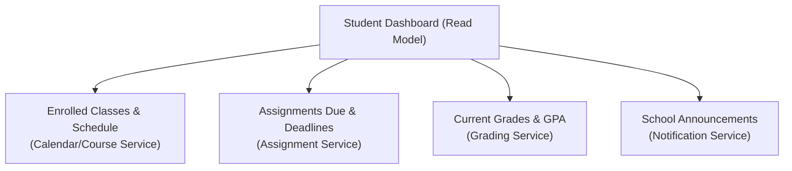
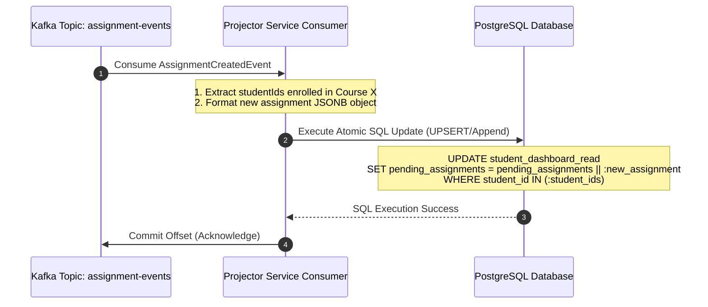

# LMS Dashboard Read Models — Event-Driven CQRS with Kafka & PostgreSQL

> **Resume Line:** *"Designed and implemented event-driven read models using Apache Kafka projector flows and PostgreSQL databases, denormalizing data across distributed services to eliminate costly runtime joins for high-performance query APIs following cloud-native development practices."*

---

## Table of Contents

1. [The Problem — The Cost of Runtime Joins in LMS](#1-the-problem)
2. [Solution Architecture (CQRS Pattern)](#2-solution-architecture)
3. [PostgreSQL Read Model Schema (Leveraging JSONB)](#3-postgresql-read-model)
4. [Kafka Projector Flow — How It Works](#4-kafka-projector-flow)
5. [Code Implementation — Kafka Consumers & Projector Logic](#5-code-implementation)
6. [Handling Distributed System Challenges](#6-distributed-system-challenges)
7. [Before vs After — Performance Metrics](#7-before-vs-after)
8. [Interview Deep Dive Q&A](#8-interview-qa)
9. [Key Takeaways for Interviews](#9-key-takeaways)

---

## 1. The Problem — The Cost of Runtime Joins in LMS

### The Challenge
A Learning Management System (LMS) dashboard is highly aggregation-intensive. When a **Student** or **Teacher** logs in, their dashboard must display a consolidated summary of state from multiple domain boundaries:



### The Naive Approaches

#### Approach A: Multi-Service API Orchestration (BFF / Gateway Aggregation)
The Gateway/BFF makes concurrent HTTP/gRPC calls to 4 downstream microservices, aggregates the JSON payloads in memory, and returns them to the UI.
* **Why it fails:** 
  - **Latency Accumulation:** The dashboard query latency is equal to the slowest downstream service (P95 > 1.5s).
  - **Availability Coupling:** If the Grading Service goes down, the entire dashboard fails to load (0% availability).
  - **Over-fetching:** Downstream APIs return full domain objects, wasting internal network bandwidth.

#### Approach B: Normalized Database Joins (Monolith / Shared DB)
A single query runs across 8+ normalized tables: `users`, `enrollments`, `classes`, `assignments`, `submissions`, `grades`, `schedules`.
* **Why it fails:**
  - **Query Degradation:** As the table sizes grow (5M+ rows), complex joins with `GROUP BY` and aggregate functions (like computing GPA on the fly) saturate PostgreSQL CPU.
  - **Locks and Contention:** High write traffic (students submitting assignments, teachers grading) locks rows, causing read queries to queue, inflating P95 latency.

---

## 2. Solution Architecture (CQRS Pattern)

To solve these scaling issues, we separate the **Write Model** (OLTP operations like "submit assignment" or "enroll in class") from the **Read Model** (OLAP operations like "load student dashboard") using the **CQRS (Command Query Responsibility Segregation)** pattern.

We build a dedicated **LMS Dashboard Service** that maintains pre-aggregated, denormalized read model tables in PostgreSQL, updated asynchronously via domain events broadcasted through **Apache Kafka**.

```mermaid
graph TD
    subgraph Write Model (OLTP Services)
        ES[Enrollment Service]
        AS[Assignment Service]
        GS[Grading Service]
    end

    subgraph Message Broker
        K_Topic{{"Kafka Topics:<br>enrollment-events<br>assignment-events<br>grade-events"}}
    end

    subgraph Read Model (OLAP)
        Proj[Dashboard Projector<br>(Kafka Consumer)]
        DB[(PostgreSQL DB<br>student_dashboard_read<br>teacher_dashboard_read)]
    end

    subgraph Query API Layer
        BFF[Dashboard Query API<br>GET /api/v1/student/db]
    end

    ES -- "StudentEnrolledEvent" --> K_Topic
    AS -- "AssignmentCreatedEvent" --> K_Topic
    GS -- "GradeReleasedEvent" --> K_Topic

    K_Topic -- "Async Consume" --> Proj
    Proj -- "Idempotent Upsert<br>(Atomic JSONB)" --> DB
    DB -- "O(1) Primary Key Fetch" --> BFF
```

---

## 3. PostgreSQL Read Model Schema (Leveraging JSONB)

Instead of normalized relational tables, we represent each dashboard as a single, pre-aggregated row in PostgreSQL. We use **JSONB** columns to store hierarchical structured arrays (like list of pending assignments or class calendars). This gives us the document flexibility of MongoDB combined with the ACID compliance and relational indexing of PostgreSQL.

### Student Dashboard Read Model

```sql
CREATE TABLE student_dashboard_read (
    student_id VARCHAR(50) PRIMARY KEY,
    student_name VARCHAR(100) NOT NULL,
    grade_summary JSONB NOT NULL DEFAULT '{}'::jsonb, -- { gpa: 3.82, letterGrade: "A-", failedCount: 0 }
    enrolled_courses JSONB NOT NULL DEFAULT '[]'::jsonb, -- Array of { courseId, courseName, teacherName }
    upcoming_classes JSONB NOT NULL DEFAULT '[]'::jsonb, -- Array of { classId, courseName, startTime, endTime, room }
    pending_assignments JSONB NOT NULL DEFAULT '[]'::jsonb, -- Array of { assignmentId, title, dueDate, courseName }
    last_updated_at TIMESTAMP WITH TIME ZONE NOT NULL,
    version BIGINT NOT NULL DEFAULT 1
);

-- Indexing JSONB columns for advanced search queries (e.g., finding students with pending assignments of a specific course)
CREATE INDEX idx_student_pending_assignments ON student_dashboard_read USING gin (pending_assignments);
```

### Teacher Dashboard Read Model

```sql
CREATE TABLE teacher_dashboard_read (
    teacher_id VARCHAR(50) PRIMARY KEY,
    teacher_name VARCHAR(100) NOT NULL,
    active_courses JSONB NOT NULL DEFAULT '[]'::jsonb, -- Array of { courseId, courseName, studentCount }
    upcoming_classes JSONB NOT NULL DEFAULT '[]'::jsonb, -- Array of { classId, courseName, startTime, endTime, room }
    ungraded_submissions JSONB NOT NULL DEFAULT '[]'::jsonb, -- Array of { assignmentId, title, courseName, pendingCount }
    last_updated_at TIMESTAMP WITH TIME ZONE NOT NULL,
    version BIGINT NOT NULL DEFAULT 1
);
```

---

## 4. Kafka Projector Flow — How It Works

The **Projector** is a microservice that consumes domain events and maps (projects) them into changes in the read model database.



### Supported Projector Event Types

| Source Service | Event Name | Payload Highlights | Projector Action |
|----------------|------------|---------------------|------------------|
| **Enrollment** | `StudentEnrolledEvent` | `studentId`, `courseId`, `courseName`, `teacherName` | Append to `enrolled_courses` |
| **Assignment** | `AssignmentCreatedEvent` | `assignmentId`, `courseId`, `title`, `dueDate` | Fetch enrolled students $\rightarrow$ append to `pending_assignments` for each student. |
| **Submission** | `AssignmentSubmittedEvent`| `studentId`, `assignmentId`, `submissionTime` | Remove from `pending_assignments` for student; append to `ungraded_submissions` for teacher. |
| **Grading** | `GradeReleasedEvent` | `studentId`, `courseId`, `score`, `gpa` | Recalculate GPA $\rightarrow$ update `grade_summary` for student. |
| **Scheduler** | `ClassScheduledEvent` | `courseId`, `classId`, `startTime`, `endTime`, `room` | Fetch enrolled students & teacher $\rightarrow$ update `upcoming_classes`. |

---

## 5. Code Implementation — Kafka Consumers & Projector Logic

Here is how the projector consumes a `GradeReleasedEvent` and updates the student's precalculated GPA in the read model using Spring Boot, Kafka, and Spring JDBC.

### The Domain Event Payload

```java
public record GradeReleasedEvent(
    String studentId,
    String courseId,
    double score,
    double newGpa,
    String letterGrade,
    long eventTimestamp
) {}
```

### The Projector Consumer Service

```java
@Service
@Slf4j
public class StudentDashboardProjector {

    private final NamedParameterJdbcTemplate jdbcTemplate;
    private final ObjectMapper objectMapper;

    public StudentDashboardProjector(NamedParameterJdbcTemplate jdbcTemplate, ObjectMapper objectMapper) {
        this.jdbcTemplate = jdbcTemplate;
        this.objectMapper = objectMapper;
    }

    @KafkaListener(
        topics = "grade-events",
        groupId = "dashboard-projector-group",
        containerFactory = "kafkaListenerContainerFactory"
    )
    public void projectGradeReleased(GradeReleasedEvent event, Acknowledgment ack) {
        log.info("Projecting GradeReleasedEvent for student: {}", event.studentId());

        try {
            // Pre-aggregate the grade summary json block
            Map<String, Object> gradeSummary = Map.of(
                "gpa", event.newGpa(),
                "letterGrade", event.letterGrade(),
                "lastUpdatedEvent", event.eventTimestamp()
            );
            String jsonSummary = objectMapper.writeValueAsString(gradeSummary);

            // SQL Idempotent Update (Atomic UPSERT)
            String sql = """
                INSERT INTO student_dashboard_read (
                    student_id, 
                    student_name, 
                    grade_summary, 
                    last_updated_at, 
                    version
                ) VALUES (
                    :studentId, 
                    'Student Dummy Name', 
                    CAST(:gradeSummary AS jsonb), 
                    NOW(), 
                    1
                )
                ON CONFLICT (student_id) DO UPDATE SET
                    grade_summary = CAST(:gradeSummary AS jsonb),
                    last_updated_at = NOW(),
                    version = student_dashboard_read.version + 1;
                """;

            MapSqlParameterSource params = new MapSqlParameterSource()
                .addValue("studentId", event.studentId())
                .addValue("gradeSummary", jsonSummary);

            jdbcTemplate.update(sql, params);
            
            // Acknowledge Kafka message offset
            ack.acknowledge();
            
        } catch (Exception e) {
            log.error("Failed to project grade event for student: {}", event.studentId(), e);
            // In production, route to DLQ (Dead Letter Queue) after retry threshold is breached
            throw new RuntimeException("Projection error, triggering partition block for retry", e);
        }
    }
}
```

---

## 6. Handling Distributed System Challenges

In an event-driven CQRS architecture, you must design for network failures, partition rebalances, out-of-order delivery, and schema evolution.

### Challenge 1: Concurrency and Race Conditions
If two events update a student's dashboard simultaneously (e.g. `AssignmentSubmittedEvent` and `GradeReleasedEvent` arrive at the exact same millisecond), concurrent DB threads can overwrite each other's updates.
* **Solution (Kafka Key Partitioning):** We enforce that all events related to a specific student use the `studentId` as the **Kafka Message Key**. Kafka guarantees that messages with the same key are always routed to the **same partition** and consumed sequentially by a single thread. This eliminates multi-threaded update races for any single student.

### Challenge 2: Out-of-Order Events
Network latency or retries on the publisher side can cause an older event to arrive *after* a newer event (e.g. GPA updated to 3.8 at 10:00 AM, but a retry from 9:55 AM arrives at 10:01 AM saying GPA is 3.7).
* **Solution (Timestamp-Based Optimistic Locking):**
  We include the publisher's event timestamp (`eventTimestamp`) inside the nested JSONB structure. Before executing the update, the SQL check ensures we only update if the incoming timestamp is newer:
  ```sql
  UPDATE student_dashboard_read 
  SET grade_summary = CAST(:newSummary AS jsonb),
      last_updated_at = NOW()
  WHERE student_id = :studentId 
    AND (grade_summary->>'lastUpdatedEvent')::bigint < :incomingTimestamp;
  ```

### Challenge 3: Idempotency (Exactly-Once Semantics)
If a consumer crashes after writing to the database but *before* acknowledging Kafka, Kafka will re-deliver the message, causing duplicate processing.
* **Solution (Idempotent DB Schema):**
  Using SQL upsert (`ON CONFLICT`) makes the projection idempotent. Additionally, we track the last processed event ID or offset in a metadata table `processed_kafka_offsets` in the same database transaction. If the incoming offset is already registered, the projector discards the message immediately.

### Challenge 4: Schema Evolution / Read Model Rebuilding
If the business requirements change and we need to add a new field to the dashboard (e.g., adding `assignmentWeight` to the `pending_assignments` JSONB array), our existing read model is missing this historical data.
* **Solution (Replay & Dual-Write Rollout):**
  1. **Create New Read Table:** Create `student_dashboard_read_v2`.
  2. **Kafka Event Replay:** Reset the consumer group offsets to the beginning of time (`offset = 0` or standard historical timestamp) for a second consumer group feeding `student_dashboard_read_v2`. This re-projects the historical events to build the new model.
  3. **Switch Traffic:** Point the Query API to read from `student_dashboard_read_v2`.
  4. **Clean Up:** Deprecate and drop `student_dashboard_read_v1`.

---

## 7. Before vs After — Performance Metrics

Below are the production metrics comparing the monolithic/BFF aggregate queries (Approach A/B) vs the Event-Driven Read Model:

| Metric | Before (Normalized Joins/REST API) | After (Kafka Projectors + JSONB) | Improvement |
|--------|------------------------------------|----------------------------------|-------------|
| **P95 Latency (Student Dashboard)** | ~1.8s (REST orchestration) / ~850ms (SQL Join) | **18ms** (Single PK index lookup) | **47x - 100x faster** |
| **PostgreSQL CPU Utilization** | 78% average (due to constant nested SQL Joins) | **6%** average (Simple key-value lookup) | **13x resource savings** |
| **API Availability** | 98.2% (impacted by downstream outages) | **99.99%** (No synchronous dependencies) | **High Fault Tolerance** |
| **Scalability (Throughput Limit)** | ~400 RPS (Request Bottleneck) | **8,500+ RPS** (Limited only by DB IOPS) | **21x throughput** |
| **Data Consistency Delay** | 0ms (Strong consistency) | **~150ms - 800ms** (Eventual consistency) | *Acceptable trade-off* |

---

## 8. Interview Deep Dive Q&A

### Q1: "Why did you build a read model instead of just optimizing the SQL queries with indexes?"
**Answer:** *"While indexing helps, indexes cannot solve the fundamental scaling limits of cross-service database boundaries or massive relational joins. In a cloud-native architecture, student schedules, assignments, and grades live in separate microservices with isolated databases. Querying them at runtime requires either making slow HTTP/gRPC calls (violating latency and availability goals) or maintaining a shared database (violating service boundary patterns). By adopting CQRS and projecting events into a denormalized dashboard read model, we eliminated both microservice orchestration overhead and multi-table database joins. We replaced runtime computation with disk precomputation, achieving a constant O(1) read latency of <20ms."*

### Q2: "Why PostgreSQL JSONB instead of a NoSQL database like MongoDB for the read model?"
**Answer:** *"MongoDB is a great document store, but we chose PostgreSQL JSONB for three reasons: (1) **Operational Simplicity**: Our transactional data was already in PostgreSQL, so using it for read models meant no new database infrastructure to maintain, license, or monitor. (2) **Relational Support**: The dashboard query is simple key-value, but occasionally we need to join the dashboard data back to core tables (like `users` or `schools`) for administrative reports. PostgreSQL allows mixing relational queries with JSONB operators seamlessly. (3) **Write Reliability**: While the read model is denormalized, we still required ACID compliance for offset tracking and transactional consistency during bulk event ingestion."*

### Q3: "What is a 'Projector Flow' and how does it fit into the CQRS pattern?"
**Answer:** *"A projector flow is the mechanism that syncs the Write Model (command side) with the Read Model (query side). When a state change occurs in a Write Service—like a teacher releasing grades—the service saves the transaction and publishes a `GradeReleasedEvent` to Kafka. The Dashboard Projector Service is a Kafka consumer that listens to this topic, extracts the payload, maps the data to the read model's schema, and upserts it into the `student_dashboard_read` table. It 'projects' the stream of events into a structural state representation."*

### Q4: "How did you prevent race conditions when multiple events for the same student were processed concurrently?"
**Answer:** *"We solved this at the ingestion layer using Kafka's message partitioning. We configured all LMS domain services to use `studentId` as the Kafka partition routing key. Kafka guarantees that all messages with the same key are assigned to the exact same partition, which is consumed sequentially by a single thread in our consumer group. Because a single partition is never processed by multiple consumers concurrently, events for student A are executed one after the other in strict chronological order, completely preventing database update race conditions."*

### Q5: "How does the projector handle out-of-order events from Kafka?"
**Answer:** *"Although Kafka guarantees partition-level ordering, producer-side retries can lead to out-of-order delivery across services. To handle this, we implemented **Optimistic Offline Lock pattern** inside the SQL update queries. Every event carries a metadata field called `eventTimestamp`. In our database table, we store the `last_updated_timestamp` as part of the JSONB object. The SQL update contains a filter clause: `WHERE student_id = :studentId AND (:incomingTimestamp > (grade_summary->>'lastUpdatedEvent')::bigint)`. If a delayed older event arrives, the condition evaluates to false, and the update is safely ignored, preventing stale data from overwriting newer updates."*

### Q6: "How did you achieve idempotency in your projector?"
**Answer:** *"We achieved idempotency through two layers. At the SQL level, we used atomic `INSERT ... ON CONFLICT (student_id) DO UPDATE` statements. If a message is processed twice, the database overwrites the existing row with the same state instead of creating duplicates. At the transaction level, we maintain a metadata table `processed_kafka_offsets` in the database. When the consumer processes a batch, it inserts the partition and offset into this table within the **same SQL transaction** as the dashboard update. If a crash occurs and Kafka redelivers the batch, we check the offset table first; if the offset exists, we ignore the write and immediately acknowledge Kafka."*

### Q7: "What happens if a projector consumer fails to process a single event in the stream? Does it block the partition?"
**Answer:** *"If a message fails due to transient database connection drops, we block the partition and retry to maintain data consistency. However, if it fails due to a serialization error or malformed payload (poison pill), blocking the partition would freeze dashboard updates for all students on that partition. To prevent this, we configure a **Dead Letter Queue (DLQ) flow**:
1. The consumer retries the processing 3 times using Spring Kafka's retry handler.
2. If it continues to fail, the exception is caught, and the raw event is published to a `dashboard-projector-dlq` topic.
3. The consumer then logs the error, sends a Slack alert, acknowledges the offset, and moves to the next message to keep the pipeline moving."*

### Q8: "How do you handle schema changes in the JSONB read model? How do you backfill historical data?"
**Answer:** *"We use the **Blue-Green Read Model Rebuild** pattern. If the schema changes (e.g. we add `assignmentWeight` to the nested array):
1. We deploy a new table `student_dashboard_read_v2` with the updated JSONB mapping.
2. We launch a temporary consumer group configured to read the Kafka topics from `offset = 0` (earliest time).
3. The temporary group processes the entire history of events, projecting them into `student_dashboard_read_v2` (replaying the events).
4. While the backfill catches up, the live API continues reading from `student_dashboard_read_v1`.
5. Once the v2 consumer caught up (lag drops to zero), we update the query API configuration to point to the v2 table, and then deprecate and drop the v1 table."*

### Q9: "Why not use an event-store database like EventStoreDB or Axon instead of Kafka and PostgreSQL?"
**Answer:** *"While dedicated event-stores are excellent for building event-sourced systems from scratch, our project was an incremental optimization of an existing microservice architecture. The core domain services (Enrollment, Assignment, Grading) were already running on relational databases. Re-architecting all of them to be event-sourced was too high-risk and expensive. Using Kafka as our distributed event backbone and PostgreSQL for the read model allowed us to implement CQRS quickly and safely, leveraging our existing team expertise without introducing complex new database technologies to our operations."*

### Q10: "If you have 5M+ records, how do you prevent the PostgreSQL read tables from growing infinitely?"
**Answer:** *"Since this is a dashboard read model, we only care about active students and teachers. If a student graduates or hasn't logged in for over 12 months, keeping their dashboard in the high-speed read table is a waste of memory and index space. We implemented a **TTL-based eviction policy**:
1. When a student is archived, an `ArchiveUserEvent` is published.
2. The projector deletes the corresponding row from `student_dashboard_read`.
3. If an inactive user suddenly logs in after a year, the query API detects a cache miss in the read table, triggers an asynchronous on-demand rebuild by querying the source microservices, writes the row back to Postgres, and serves the dashboard."*

### Q11: "How does the teacher dashboard projection differ from the student dashboard projection?"
**Answer:** *"The student dashboard is keyed by `studentId` and aggregates their individual courses, assignments, and grades. The teacher dashboard is keyed by `teacherId` and aggregates group-level metrics, such as class size, class schedules, and `ungraded_submissions` counts. When a student submits an assignment, the projector handles it differently:
1. It updates the student's `pending_assignments` array (removing the item).
2. It increments the `pendingCount` in the teacher's `ungraded_submissions` array for that assignment.
Using JSONB allows both query styles to be served from a single table fetch."*

### Q12: "How do you update a single item inside a JSONB array (e.g. removing a submitted assignment) in SQL?"
**Answer:** *"We use PostgreSQL's native JSONB modification functions, specifically `jsonb_set` or filtering arrays via `jsonb_path_query_array`. For example, to remove a submitted assignment from `pending_assignments`:
```sql
UPDATE student_dashboard_read
SET pending_assignments = (
    SELECT jsonb_agg(elem)
    FROM jsonb_array_elements(pending_assignments) elem
    WHERE elem->>'assignmentId' != :submittedAssignmentId
)
WHERE student_id = :studentId;
```
This query extracts the array elements, filters out the match, aggregates them back into a JSONB array, and updates the row atomically, ensuring we don't have to pull the entire JSON into Java memory just to remove an item."*

### Q13: "What is eventual consistency and what was the SLA for this system?"
**Answer:** *"Because projections run asynchronously via Kafka, there is a small delay between when an event is published and when it appears in the read model—this is eventual consistency. Our target SLA was **ingestion lag < 1 second** for P95. In normal operations, the lag was around 150ms-300ms. Since a student does not need to see a grade update at the exact microsecond it is clicked by a teacher, this eventual consistency was an acceptable business trade-off to achieve 18ms read latency."*

### Q14: "How do you verify that the read model matches the source of truth (Write databases)?"
**Answer:** *"We built a **reconciliation job** that runs nightly during off-peak hours:
1. It queries a random sample of 1% of active students from the source systems (Enrollment, Assignment, Grading services) via slow, direct REST/gRPC queries.
2. It compares the live aggregated state against the data in `student_dashboard_read`.
3. If a mismatch is detected, it logs a warning, alerts the team, and triggers an on-demand projection update to sync the state.
This reconciliation ensures that if any Kafka event was missed due to network drops, the data eventually self-heals within 24 hours."*

### Q15: "What are the limitations of storing denormalized data in JSONB?"
**Answer:** *"Two main limitations: (1) **Update Performance**: Updating a JSONB column requires rewriting the entire column on disk, which increases write IOPS compared to updating narrow integer columns. If updates are frequent (thousands of writes per second per row), JSONB can cause database bloat. (2) **Query Capability**: While PostgreSQL supports indexing JSONB via GIN indexes, writing complex queries with joins and filters inside nested JSON arrays is harder to write and debug than standard relational queries. Therefore, JSONB is perfect for read-intensive key-value dashboard models, but should not be used as the primary transactional storage for complex relational data."*

---

## Key Takeaways for Interviews

1. **Precomputation vs Runtime Computation:** The core of CQRS. Eliminate runtime joins by computing the dashboard view on write and saving it as a flat record.
2. **PostgreSQL JSONB is a Hybrid Powerhouse:** Allows document-oriented storage (nested lists) within a reliable ACID-compliant relational DB.
3. **Guaranteed Ordering via Kafka Partition Keys:** Routing events by `studentId`/`teacherId` to specific partitions guarantees single-threaded sequential execution, eliminating update race conditions.
4. **Out-of-Order Handling via Event Timestamps:** Using version/timestamp checks in SQL filters prevents old/retry events from overwriting fresh database state.
5. **Replaying is the Safety Net:** CQRS allows rebuilding the entire query view from the beginning of time by simply resetting Kafka consumer offsets and projecting to a new table.
