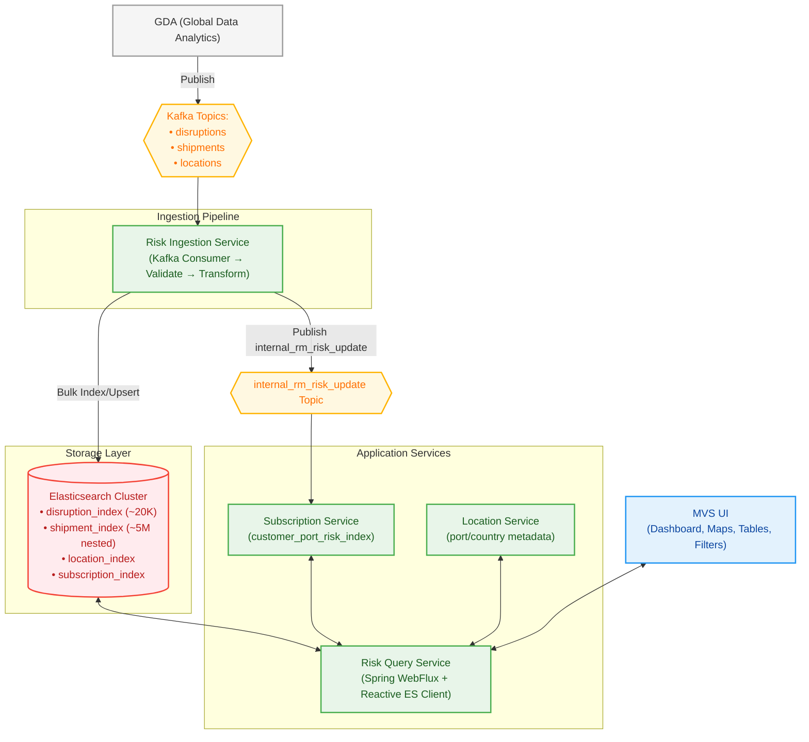
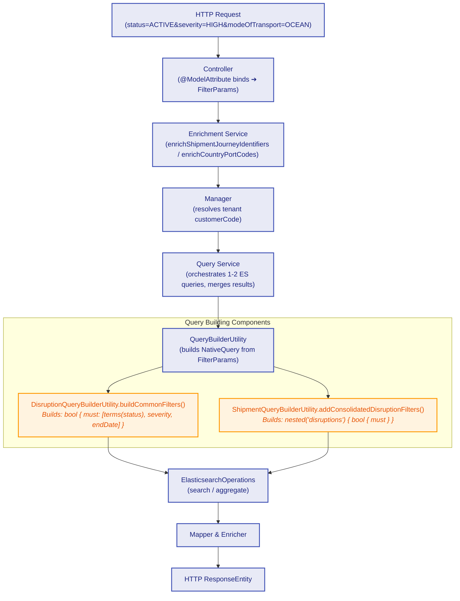
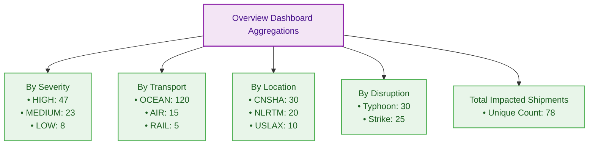
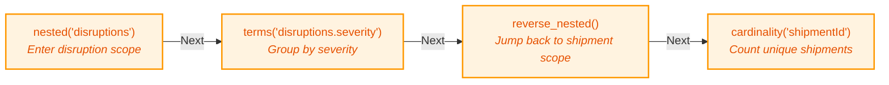
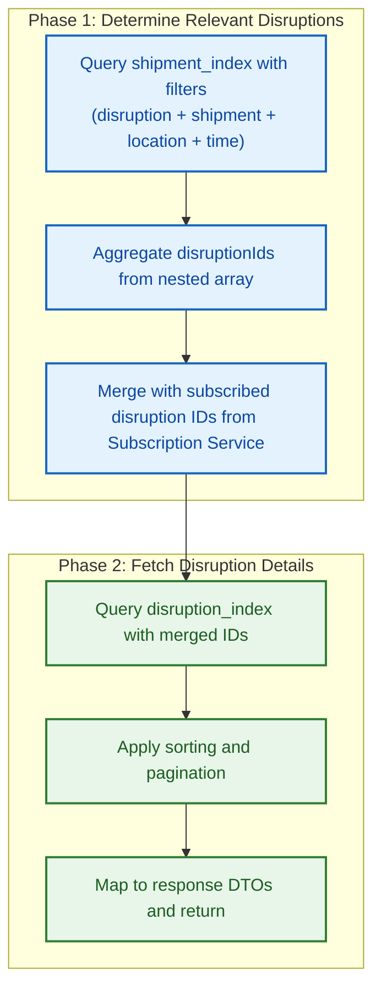
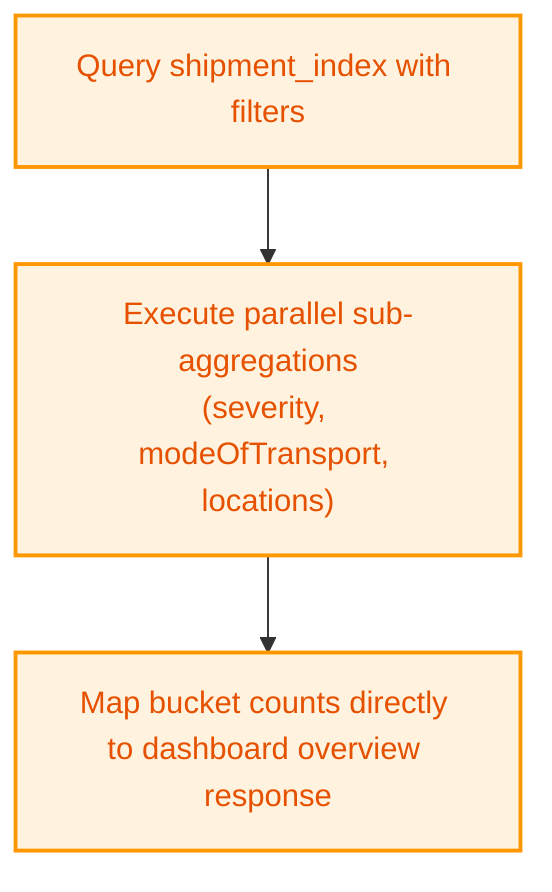
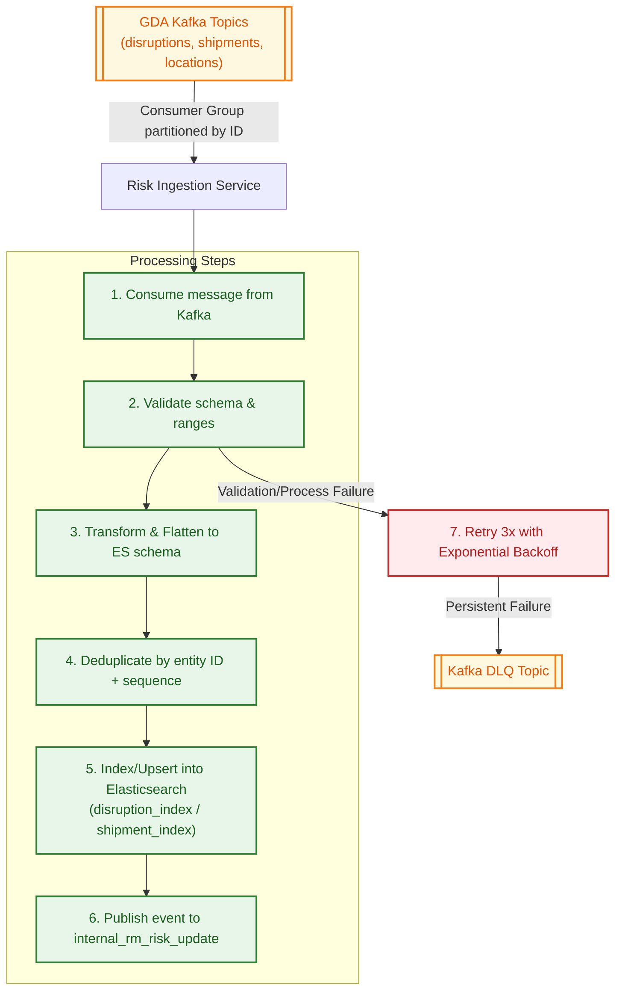

# Risk Management — Elasticsearch Aggregations & Multi-Dimensional Filtering: Deep Dive & Interview Guide

> **Resume Line:** *"Designed and implemented Elasticsearch aggregations and multi-dimensional filtering for 5M+ shipment and disruption records, enabling high-performance disruption analytics and scalable query execution."*

---

## Table of Contents

1. [What Is MRM — Business Context](#1-what-is-mrm)
2. [System Architecture](#2-system-architecture)
3. [Data Model — Elasticsearch Indexes](#3-data-model)
4. [Multi-Dimensional Filtering — How It Works](#4-multi-dimensional-filtering)
5. [Elasticsearch Aggregations — What I Built](#5-elasticsearch-aggregations)
6. [Two-Phase Query Pattern — The Core Design](#6-two-phase-query-pattern)
7. [Nested Documents & Cross-Object Matching Problem](#7-nested-documents)
8. [Why Elasticsearch Over PostgreSQL](#8-why-elasticsearch)
9. [Data Ingestion Pipeline](#9-data-ingestion-pipeline)
10. [Performance & Scale Numbers](#10-performance-numbers)
11. [Multi-Tenancy & Security](#11-multi-tenancy)
12. [Interview Deep Dive Q&A](#12-interview-qa)

---

## 1. What Is MRM — Business Context

**Maersk Risk Management (MRM)** is a supply chain risk visibility platform on MVS (Maersk Visibility Studio). It ingests global disruption events (port closures, weather alerts, strikes, geopolitical events) and maps them to live customer shipment data.

**What customers see:**
- Dashboard showing active disruptions affecting their shipments
- Map view of disruption locations with impacted shipment counts
- Filterable tables: by severity, status, category, transport mode, port, country
- Aggregated overview: "You have 47 shipments impacted by 12 disruptions across 8 ports"
- Export impacted shipment data to Excel

**Scale:**
- 5M+ indexed documents across all Elasticsearch indices
- ~500K shipment updates daily per customer from GDA (Global Data Analytics)
- ~5K disruption events daily
- 1,000 concurrent UI users
- P95 API response target: ≤500ms

**Revenue impact:** USD $4M Year 1 estimated, serving enterprise clients (TJX, Tesla, Lenovo, Walmart).

---

## 2. System Architecture



**Tech Stack:**
- Java 21 + Spring Boot (Reactive / WebFlux)
- Elasticsearch 8.x (Reactive ES Client)
- Kafka (Spring Kafka / Reactor Kafka)
- Prometheus + Grafana (metrics)
- Zipkin (distributed tracing)

---

## 3. Data Model — Elasticsearch Indexes

### `disruption_index` — Master disruption list

```json
{
  "disruptionId": "DISR-2026-00451",
  "name": "Port of Shanghai — Typhoon Closure",
  "status": "ACTIVE",
  "severity": "HIGH",
  "category": "WEATHER",
  "startDate": "2026-04-01T00:00:00Z",
  "endDate": "2026-04-15T00:00:00Z",
  "updatedDateTime": "2026-04-10T14:30:00Z",
  "scopeImpacts": ["OCEAN", "LANDSIDE"],
  "affectedPorts": [
    { "portCode": "CNSHA", "portName": "Shanghai", "countryCode": "CN" }
  ],
  "affectedCountries": ["CN"],
  "description": "Major typhoon forcing port closure..."
}
```

### `shipment_index` — Flattened shipment with nested disruptions

```json
{
  "shipmentId": "SHP-9876543",
  "scvCode": "CUST-TJX-001",
  "milestoneStatus": "IN_TRANSIT",
  "modeOfTransport": "OCEAN",
  "eta": "2026-04-10T00:00:00Z",
  "etd": "2026-03-25T00:00:00Z",
  "originPortCode": "CNSHA",
  "originPortName": "Shanghai",
  "originCountryCode": "CN",
  "destinationPortCode": "USLAX",
  "destinationPortName": "Los Angeles",
  "destinationCountryCode": "US",
  "orders": [
    {
      "orderId": "ORD-001",
      "skus": [
        { "skuId": "SKU-A", "skuDescription": "Electronics Component" }
      ]
    }
  ],
  "disruptions": [
    {
      "disruptionId": "DISR-2026-00451",
      "name": "Port of Shanghai — Typhoon Closure",
      "severity": "HIGH",
      "status": "ACTIVE",
      "category": "WEATHER",
      "startDate": "2026-04-01T00:00:00Z",
      "endDate": "2026-04-15T00:00:00Z"
    }
  ]
}
```

**Key design decision:** Disruptions are **denormalized as nested arrays inside shipment documents**. This avoids cross-index joins at query time — a single shipment query can filter by both shipment attributes AND disruption attributes in one round trip.

---

## 4. Multi-Dimensional Filtering — How It Works

### The Filter Dimensions

MRM supports simultaneous filtering across 4 dimensions:

| Dimension | Filters | ES Index Field |
|-----------|---------|---------------|
| **Disruption** | status, name, severity, category, timeline (ACTIVE/PAST), startDate range, endDate range, updatedDateTime range, scopeImpacts | `disruption_index` (top-level) + `shipment_index.disruptions.*` (nested) |
| **Shipment** | milestoneStatus, modeOfTransport | `shipment_index` (top-level) |
| **Location** | originPortName, destinationPortName, originCountryCode, destinationCountryCode | `shipment_index` (top-level) |
| **Time** | ETA ±60 days, ETD ±60 days | `shipment_index` (mandatory business rule) |

### Why This Is Hard

A user might request: *"Show me all HIGH severity ACTIVE disruptions in the WEATHER category, affecting OCEAN shipments currently IN_TRANSIT through ports in China, with ETA within the next 60 days."*

This is **6 filters across 3 dimensions** applied simultaneously.

### How ES Handles It vs PostgreSQL

**PostgreSQL approach:** To support all possible filter combinations across 10+ fields, you'd need **200+ composite B-Tree indexes** (each covering a specific field combination). Each index adds write overhead and disk usage. Queries with filter combinations not covered by an existing composite index degrade to sequential scans.

**Elasticsearch approach:** Every field is automatically indexed via the **inverted index**. Any ad-hoc combination of filters resolves in sub-second latency without pre-defining composite indexes.

### The Query Builder Architecture



### Concrete Elasticsearch Query Example

User requests: `GET /disruptions/latest?status=ACTIVE&severity=HIGH&modeOfTransport=OCEAN`

**Phase 1 — Shipment aggregation (find which disruptions affect this customer's shipments):**

```json
{
  "query": {
    "bool": {
      "must": [
        { "term": { "scvCode": "CUST-TJX-001" } },
        { "range": { "eta": { "gte": "now-60d/d", "lte": "now+60d/d" } } },
        { "range": { "etd": { "gte": "now-60d/d", "lte": "now+60d/d" } } },
        { "term": { "modeOfTransport": "OCEAN" } },
        {
          "nested": {
            "path": "disruptions",
            "query": {
              "bool": {
                "must": [
                  { "term": { "disruptions.status": "ACTIVE" } },
                  { "term": { "disruptions.severity": "HIGH" } }
                ]
              }
            }
          }
        }
      ]
    }
  },
  "aggs": {
    "disruption_ids": {
      "nested": { "path": "disruptions" },
      "aggs": {
        "ids": {
          "terms": { "field": "disruptions.disruptionId", "size": 10000 }
        },
        "shipment_count": {
          "reverse_nested": {},
          "aggs": { "count": { "value_count": { "field": "shipmentId" } } }
        }
      }
    }
  },
  "size": 0
}
```

**Phase 2 — Disruption detail fetch (get full disruption documents for the IDs found):**

```json
{
  "query": {
    "bool": {
      "must": [
        { "terms": { "disruptionId": ["DISR-2026-00451", "DISR-2026-00389", "..."] } },
        { "term": { "status": "ACTIVE" } },
        { "term": { "severity": "HIGH" } }
      ]
    }
  },
  "sort": [{ "startDate": "desc" }],
  "from": 0,
  "size": 20
}
```

---

## 5. Elasticsearch Aggregations — What I Built

### Overview Dashboard Aggregations

The `/overview/impacted-shipments` endpoint runs **5 parallel aggregation sub-queries** on the shipment index:



#### 1. Severity Aggregation

```json
{
  "aggs": {
    "disruptions_nested": {
      "nested": { "path": "disruptions" },
      "aggs": {
        "severity_filter": {
          "filter": { "bool": { "must": [ /* disruption filters */ ] } },
          "aggs": {
            "by_severity": {
              "terms": { "field": "disruptions.severity" },
              "aggs": {
                "back_to_shipment": {
                  "reverse_nested": {},
                  "aggs": {
                    "unique_shipments": {
                      "cardinality": { "field": "shipmentId" }
                    }
                  }
                }
              }
            }
          }
        }
      }
    }
  }
}
```

**What this does:**
1. Dive into `disruptions` nested array
2. Filter to only matching disruptions (status, severity, etc.)
3. Group by severity
4. `reverse_nested` jumps back to parent shipment context
5. Count unique shipments per severity bucket

#### 2. Transport Mode Aggregation

Groups shipments by `modeOfTransport` (OCEAN, AIR, RAIL, ROAD) — counts how many impacted shipments per mode.

#### 3. Location Aggregation (Geo-locations for Map View)

```json
{
  "aggs": {
    "by_port": {
      "terms": { "field": "disruptions.affectedPortCode", "size": 500 },
      "aggs": {
        "by_disruption": {
          "terms": { "field": "disruptions.disruptionId" },
          "aggs": {
            "shipment_count": {
              "reverse_nested": {},
              "aggs": {
                "count": { "value_count": { "field": "shipmentId" } }
              }
            }
          }
        }
      }
    }
  }
}
```

This produces: `Map<portCode, Map<disruptionId, shipmentCount>>` — feeding the map visualization.

#### 4. Disruption-to-Shipment Count Aggregation

Groups by disruptionId, counts shipments per disruption. Uses `reverse_nested` to jump from nested disruptions back to parent shipment for accurate counts.

#### 5. Total Impacted Shipment Count

Simple `value_count` on `shipmentId` with all filters applied.

### The `reverse_nested` Technique — Why It Matters

In Elasticsearch, when you enter a `nested` context, you're inside the nested document scope. If you aggregate on `disruptions.severity`, the count is per-disruption-object, not per-shipment.

**Problem:** A shipment with 3 disruptions (all HIGH) would be counted 3 times in a naive severity aggregation.

**Solution:** `reverse_nested` jumps back to the parent document context, so we count unique shipments, not nested objects.



---

## 6. Two-Phase Query Pattern — The Core Design

### Why Two Phases?

The system has two indexes: `disruption_index` (full disruption details) and `shipment_index` (shipments with nested disruption summaries). A single API response needs data from both.

### Pattern A — Two-Phase (12 APIs)



**Why not just query the disruption_index directly?** Because a disruption exists globally, but we need to know which disruptions affect **this specific customer's** shipments. The shipment index is scoped by `scvCode` (customer ID). Phase 1 resolves "which disruptions are relevant to this customer."

### Pattern B — Single Phase (4 APIs)

Overview endpoints that only need aggregated counts from the shipment index. No need for full disruption details.



---

## 7. Nested Documents & Cross-Object Matching Problem

### The Problem

A shipment can have multiple disruptions. Without proper handling, Elasticsearch's `bool` query can match attributes from **different** nested objects:

```json
{
  "disruptions": [
    { "severity": "HIGH", "status": "ACTIVE", "category": "WEATHER" },
    { "severity": "LOW", "status": "RESOLVED", "category": "STRIKE" }
  ]
}
```

Query: `severity=HIGH AND status=RESOLVED` — should this shipment match? **No.** No single disruption is both HIGH and RESOLVED. But without nested queries, ES would match because HIGH exists in one disruption and RESOLVED exists in another.

### The Solution — Consolidated Nested Query

All disruption filter conditions are placed inside a **single nested query block**:

```java
// ShipmentQueryBuilderUtility.addConsolidatedDisruptionFilters()
List<Query> disruptionMustClauses = new ArrayList<>();

// All conditions go into the SAME nested must block
if (params.getSeverity() != null) {
    disruptionMustClauses.add(termsQuery("disruptions.severity", params.getSeverity()));
}
if (params.getStatus() != null) {
    disruptionMustClauses.add(termsQuery("disruptions.status", params.getStatus()));
}
if (params.getDisruptionTimeline() == ACTIVE) {
    disruptionMustClauses.add(rangeQuery("disruptions.endDate").gte("now/d"));
}

// Wrapped in a SINGLE nested query — all conditions must match the SAME nested object
queries.add(QueryBuilders.nested(n -> n
    .path("disruptions")
    .query(q -> q.bool(b -> b.must(disruptionMustClauses)))
));
```

This ensures `severity=HIGH AND status=RESOLVED` only matches if a **single disruption object** has both properties.

### Lucene Under the Hood: Nested Document Storage

To understand why nested queries work and what their performance costs are, we must look at how Lucene indexes them:
- **Separate Hidden Documents**: In Lucene, there is no native structure for nested arrays of objects. Elasticsearch overcomes this by indexing each nested object (each disruption) as a **separate, hidden Lucene document**.
- **Block Storage**: The parent document (shipment) and all its nested children (disruptions) are stored sequentially in the same Lucene segment block.
- **Block Join Queries**: When a nested query runs, Lucene uses `ToParentBlockJoinQuery`. Because the parent and child documents are physically adjacent in memory/disk blocks, Lucene can perform the join operation in a single block scan without any index lookup. This makes read queries extremely fast.
- **Update Penalty**: The trade-off is at write time. Lucene segments are immutable. If you update *any* field in a parent document (e.g., a shipment's `milestoneStatus` changes) or add/remove a nested disruption, Elasticsearch must delete the **entire block** (parent and all hidden child documents) and re-index the whole sequence. This results in write-amplification.

### Architecture Choice: Nested vs. Parent-Child Join (`join` field type)

We evaluated both patterns for linking shipments and disruptions:

| Dimension | Nested Array (Chosen ✅) | Parent-Child Join Field |
|-----------|--------------------------|--------------------------|
| **Storage Model** | Co-located adjacent documents in the same segment block. | Independent documents in separate segment blocks. |
| **Query Latency** | **Sub-second (P95 <200ms)**. Uses direct block joins without lookup tables. | **Slow (P95 >1.0s at scale)**. Requires dynamic global ordinals building and memory-intensive join lookup maps. |
| **Update Efficiency** | **Expensive**. Modifying a single shipment or disruption requires re-indexing the entire shipment block. | **Highly Efficient**. You can update/upsert a parent (shipment) or child (disruption) document independently. |
| **Use Case Fit** | Perfect for read-heavy, low-latency search/aggregation dashboards with batched ingestion. | Perfect for write-heavy index patterns where parents and children update constantly and independently. |

*Decision Rationale:* Since the primary SLA was a P95 dashboard query latency of $\le 500\text{ms}$ for real-time analytics, we chose **Nested**. We managed the write-amplification of snapshot updates (~500K/day) by scaling the Kafka ingestion consumer pods and tuning the ES bulk index buffer.

---

## 8. Why Elasticsearch Over PostgreSQL

### The Core Argument

MRM is a **read-heavy, analytics-centric, filter-rich** workload. Data is batch-ingested daily from GDA (append/upsert). Near-zero relational transactions.

| Criteria | PostgreSQL | Elasticsearch | MRM Choice |
|----------|-----------|--------------|------------|
| **Multi-field filtering** | Needs 200+ composite indexes for all combinations | Every field auto-indexed via inverted index | ES |
| **Aggregations** | GROUP BY + JOINs across normalized tables | Native, distributed, sub-second | ES |
| **Nested documents** | Requires JOINs (shipment → order → SKU → disruption) | Nested arrays queried in single document | ES |
| **Text search** | pg_trgm + GIN, slower at scale | Built-in analyzers, fuzzy, BM25 scoring | ES |
| **Write pattern** | Strong ACID (not needed) | Append-heavy, eventual consistency (acceptable) | ES |
| **Schema evolution** | ALTER TABLE overhead | Dynamic mapping, flexible JSON | ES |

### Interview-Ready Answer: "Why ES over a traditional database?"

**Three reasons, all driven by the workload characteristics:**

**1. Ad-hoc multi-field filtering without composite indexes.** MRM users combine 6+ filters across 4 dimensions (disruption severity/status/category, shipment mode/milestone, location port/country, time ETA/ETD). In PostgreSQL, each unique combination needs a composite B-Tree index — you'd need 200+ indexes with massive write overhead. ES's inverted index stores a posting list per term per field, so any filter combination is just a set intersection of sorted posting lists — O(n), no pre-planning needed.

**2. Hierarchical data without JOINs.** Shipments contain nested orders, SKUs, and disruptions. PostgreSQL would need 4-5 table JOINs per query. ES stores everything as a single nested document — one round-trip, no join cost. We use `nested` queries to ensure cross-object correctness and `reverse_nested` for accurate parent-level aggregation counts.

**3. Native distributed aggregations.** The dashboard needs real-time breakdowns (by severity, by port, by transport mode) across 5M+ docs. PostgreSQL would need `GROUP BY` with JOINs across normalized tables. ES runs these as native sub-aggregations on sharded data — sub-second, parallelized across nodes.

**Why not PostgreSQL at all?** MRM is read-heavy, analytics-centric, filter-rich with batch ingestion (daily snapshots from GDA via Kafka). We don't need ACID transactions, referential integrity, or complex relational writes. Eventual consistency is acceptable. ES fits the workload; PostgreSQL would fight it.

**One-liner:** *"Our workload is ad-hoc multi-dimensional filtering + aggregations over hierarchical documents — ES's inverted index handles arbitrary filter combinations without composite indexes, nested documents avoid JOINs, and distributed aggregations run natively. PostgreSQL would need 200+ composite indexes and multi-table JOINs for the same queries at 5-6x worse latency."*

### Benchmark Numbers (5M shipments, 20K disruptions)

| Query Type | PostgreSQL P95 | Elasticsearch P95 | ES Advantage |
|-----------|---------------|-------------------|-------------|
| Multi-field filter (6 fields) | 1,150ms | **180ms** | 6.4x faster |
| Aggregation (severity + port) | 1,350ms | **230ms** | 5.9x faster |
| Free-text search | 870ms | **160ms** | 5.4x faster |
| Write throughput | 20K/s | **85K/s** | 4.2x faster |

### The Inverted Index — Why Filters Are Fast

PostgreSQL uses B-Tree indexes: for a query `WHERE status = 'ACTIVE' AND severity = 'HIGH' AND modeOfTransport = 'OCEAN'`, the planner picks ONE index and scans the rest. Without a composite index on `(status, severity, modeOfTransport)`, it degrades.

Elasticsearch's inverted index stores a **posting list per term per field**:
```
status:ACTIVE     → [doc1, doc3, doc5, doc7, ...]
severity:HIGH     → [doc1, doc2, doc5, doc9, ...]
modeOfTransport:OCEAN → [doc1, doc5, doc7, doc10, ...]
```

A multi-field filter is a **set intersection** of posting lists — O(n) merge, independent of field combination. No composite index needed.

---

## 9. Data Ingestion Pipeline

### Flow



### Key Design Decisions

- **Publishing frequency:** GDA publishes full snapshots once every 24 hours
- **Idempotent processing:** Upsert by document ID — re-processing same message is safe
- **DLQ (Dead Letter Queue):** Failed messages pushed to DLQ topics with alerting on threshold
- **Partitioning:** `disruptionId` and `shipmentId` as partition keys ensures ordered processing per entity

### Subscription Service — Event-Driven Precomputation

When a new disruption is indexed, the ingestion service publishes to `internal_rm_risk_update`. The Subscription Service:
1. Consumes the event, extracts affected `portCodes`
2. Queries `subscription_index` to find all customers subscribed to those ports
3. Updates `customer_port_risk_index` with the new disruption mapping

This precomputation avoids expensive runtime joins when the UI requests "show me disruptions at my subscribed ports."

---

## 10. Performance & Scale Numbers

| Metric | Value |
|--------|-------|
| Total indexed documents | 5M+ across all indices |
| Daily shipment updates | ~500K per customer |
| Daily disruption events | ~5K |
| Concurrent UI users | ~1,000 |
| API P95 target | ≤500ms (standard queries) |
| API P99 target | ≤1.5s (large filters/maps/timelines) |
| Data ingestion delay | ≤5 minutes after GDA publish |
| Kafka throughput | 1M messages/day across topics |
| ES cluster | 3 data nodes (horizontal scaling) |
| Kafka | 3 brokers, 20 partitions/topic |
| App services | 2 replicas per microservice (auto-scale) |

### Why Time-Windowed Queries

All shipment queries are mandatorily scoped to **ETA ±60 days AND ETD ±60 days**. This:
- Reduces the working set from 5M to ~200K-500K documents
- Keeps P95 under 500ms even with complex multi-dimensional filters
- Ensures relevance (users don't care about shipments from 6 months ago)

### Elasticsearch Production Performance Tuning

To hit our P95 target of $\le 500\text{ms}$ on 5M+ records, we implemented three key production tuning strategies:

#### 1. Tenant-Based Shard Routing
By default, Elasticsearch distributes documents across shards using a hash of the document ID. This means a single customer's shipments would be scattered across all 3 primary shards, requiring every dashboard query to broadcast to and merge results from all shards.
- **Optimization**: We routed shipment documents using the customer's ID (`scvCode`):
  ```bash
  PUT /shipment_index/_doc/SHP-9876543?routing=CUST-TJX-001
  ```
- **Query Routing**: At query time, we extract the `scvCode` from the user's JWT and pass it as the routing parameter. Elasticsearch routes the query directly to the **single primary shard** holding that customer's data, eliminating cross-shard network overhead and freeing up search threads cluster-wide.

#### 2. Aggregations on Columnar Storage (`doc_values`)
To prevent aggregations from exhausting the JVM heap, we disabled `fielddata` and strictly aggregated on `keyword` fields (such as `severity` and `modeOfTransport`) which utilize `doc_values` (on-disk columnar representation of doc fields) by default. This keeps memory usage near constant regardless of query frequency.

#### 3. Eager Global Ordinals warming
We aggregate on `disruptionId` inside the nested array to count shipments. Since `disruptionId` is a high-cardinality keyword field, Elasticsearch builds a mapping called global ordinals to optimize term aggregation. Normally, this map is built lazily during the first query, causing a 2-3 second latency spike for the first user after a daily bulk indexing run.
- **Optimization**: We enabled eager global ordinals warming on the mapping:
  ```json
  "disruptions": {
    "properties": {
      "disruptionId": {
        "type": "keyword",
        "eager_global_ordinals": true
      }
    }
  }
  ```
This forces the mapping to build global ordinals in the background as soon as a new Lucene segment is refreshed, keeping query latencies consistently fast.

---

## 11. Multi-Tenancy & Security

- **Tenant isolation:** Every ES query includes a `scvCode` (customer ID) filter extracted from the auth token via API Gateway
- **No cross-tenant data leakage:** Even at the aggregation level, all results are scoped to the customer's own shipments
- **Auth flow:** UI → API Gateway (validates JWT, extracts `scvCode` + `userId`) → Risk Service (adds `scvCode` to every ES query)
- **Subscription isolation:** Subscriptions are keyed by `scvCode + userId` — users only see their own port subscriptions

---

## 12. Interview Deep Dive Q&A

### Q1: "Explain the Elasticsearch aggregation architecture you built."

**Answer:** *"The MRM dashboard shows disruption analytics across multiple dimensions — by severity, transport mode, location, and disruption type. Each dimension is an Elasticsearch aggregation running on the shipment index (5M+ docs). The challenge is that disruptions are stored as nested arrays inside shipment documents. I used nested aggregations with `reverse_nested` to get accurate shipment counts — without `reverse_nested`, a shipment affected by 3 disruptions would be triple-counted. For the overview dashboard, I run 5 parallel aggregation sub-queries: severity breakdown, transport mode breakdown, geo-location mapping, disruption-to-shipment counts, and total impacted shipments. All are scoped by customer (multi-tenancy) and time-windowed (ETA ±60 days) to keep performance under 500ms P95."*

### Q2: "What is multi-dimensional filtering and why is it complex?"

**Answer:** *"Multi-dimensional filtering means a user can apply filters across 4 different attribute dimensions simultaneously: disruption attributes (severity, status, category, timeline), shipment attributes (milestoneStatus, modeOfTransport), location attributes (origin/destination port and country), and time (ETA/ETD ±60 days). The complexity comes from two things: first, supporting every possible combination of 10+ filter fields — in PostgreSQL this would require 200+ composite indexes, but Elasticsearch's inverted index handles arbitrary combinations natively. Second, disruption filters must be evaluated at the nested document level — all conditions must match the same nested disruption object to avoid cross-object false positives. I consolidated all disruption filter conditions into a single nested query block to enforce this."*

### Q3: "Explain the two-phase query pattern. Why not just one query?"

**Answer:** *"We have two indexes: `disruption_index` (full disruption metadata) and `shipment_index` (customer-scoped shipments with nested disruption summaries). A single query can't span both. Phase 1 queries the shipment index with all filters to find which disruptionIds affect this customer's shipments — this is critical because a disruption is global, but we only want disruptions relevant to THIS customer. Phase 2 takes those disruptionIds and queries the disruption index for full details with pagination. The alternative — querying disruptions first and then checking shipment impact — would be less efficient because it starts from the larger unscoped set. Starting from the customer's scoped shipments narrows the working set immediately."*

### Q4: "How does `reverse_nested` work and why do you need it?"

**Answer:** *"In Elasticsearch, when you enter a nested aggregation context, you're counting nested objects, not parent documents. If I aggregate disruptions by severity without `reverse_nested`, a shipment with 3 HIGH disruptions contributes 3 to the HIGH count instead of 1. `reverse_nested` is an aggregation that jumps from the nested document scope back to the root document scope. So my aggregation chain is: enter nested('disruptions') → filter matching disruptions → group by severity → reverse_nested (back to shipment) → cardinality on shipmentId. This gives me accurate unique shipment counts per severity bucket."*

### Q5: "Why Elasticsearch instead of PostgreSQL for 5M records?"

**Answer:** *"Three reasons specific to our workload. First, our queries are filter-rich — users combine 6+ filters across different dimensions. In PostgreSQL, each combination would need a composite index; we'd need 200+ indexes with enormous write overhead. ES indexes every field automatically. Second, our data model is hierarchical — shipments contain nested orders, SKUs, and disruptions. PostgreSQL would require 4-5 table joins; ES stores it as a single document. Third, our aggregations (count by severity per port per customer) would need GROUP BY with JOINs in PostgreSQL. ES runs them natively on sharded data with sub-second latency. We benchmarked: ES was 5-6x faster on P95 for multi-field filters and aggregations."*

### Q6: "How do you handle the nested document cross-object matching problem?"

**Answer:** *"A shipment document has a `disruptions` array. Without nested queries, Elasticsearch flattens the array internally, so a query like `severity=HIGH AND status=RESOLVED` could match a shipment where one disruption is HIGH/ACTIVE and another is LOW/RESOLVED — the HIGH comes from one, the RESOLVED from another. This is called the cross-object matching problem. The fix is using nested queries: all disruption filter conditions are placed inside a single `nested` query block under path `disruptions`. Elasticsearch evaluates the bool conditions per-nested-object, not across objects. Only if a single disruption matches ALL conditions does the parent shipment match. In our codebase, this is the `addConsolidatedDisruptionFilters()` method — it's critical that all disruption conditions go into the same nested must clause."*

### Q7: "How does the inverted index make multi-field filtering fast?"

**Answer:** *"An inverted index is like the index at the back of a textbook — for each term, it stores which documents contain that term. For the field `severity`, ES stores: `HIGH → [doc1, doc5, doc9]`, `LOW → [doc2, doc7]`. For `status`: `ACTIVE → [doc1, doc5]`, `RESOLVED → [doc2, doc9]`. A query `severity=HIGH AND status=ACTIVE` becomes a set intersection: `{doc1, doc5, doc9} ∩ {doc1, doc5} = {doc1, doc5}`. This is O(n) merge of sorted posting lists, independent of how many fields you combine. PostgreSQL's B-Tree can only efficiently use ONE index per table scan unless you have a composite index on the exact field combination."*

### Q8: "How do you ensure no data leakage between customers in a multi-tenant system?"

**Answer:** *"Three layers. First, every API request goes through the API Gateway which validates the JWT token and extracts the `scvCode` (customer ID) and `userId`. Second, every Elasticsearch query in the Risk Service adds a mandatory `scvCode` filter as a must-clause — this is enforced in the query builder utilities, not left to individual service methods, so it can't be accidentally omitted. Third, all queries are time-windowed to ETA ±60 days, which is both a performance and a data-scoping measure. The subscription system is also keyed by `scvCode + userId`, so users only see disruptions at their own subscribed ports."*

### Q9: "What's the ETA ±60 days filter and why is it mandatory?"

**Answer:** *"It's a business rule that all shipment queries are scoped to shipments with ETA or ETD within 60 days from today. It serves two purposes: relevance and performance. Relevance — customers care about active and upcoming shipments, not historical ones from 6 months ago. Performance — with 5M+ documents, the ±60 day window reduces the working set to 200K-500K documents, keeping P95 under 500ms even with complex filters. It's enforced in the query builder as a mandatory clause — developers can't accidentally run unscoped queries against the full 5M dataset."*

### Q10: "How does the data ingestion pipeline handle failures and duplicates?"

**Answer:** *"Three mechanisms. First, idempotent upserts — we use disruptionId and shipmentId as document IDs in Elasticsearch. Processing the same Kafka message twice overwrites the document with identical data. Second, retry with exponential backoff — transient ES failures (network, throttling) trigger 3 retries with increasing delays (1s → 3s → 9s). Third, Dead Letter Queue — after max retries, failed messages go to a DLQ Kafka topic with alerting on volume thresholds. We also validate messages upfront (required fields, enum values) and immediately DLQ invalid messages without retry, since retrying a malformed message is pointless."*

### Q11: "How does the subscription precomputation work and why not do it at query time?"

**Answer:** *"Users can subscribe to ports to get disruption alerts even if they don't have shipments there. At query time, we need to show both: (1) disruptions affecting their actual shipments AND (2) disruptions at their subscribed ports. Computing subscription-to-disruption mappings at query time would require joining the subscription index with the disruption index for every request — expensive with hundreds of ports. Instead, when a new disruption is indexed, the Ingestion Service publishes an event to an internal Kafka topic. The Subscription Service consumes it, finds all customers subscribed to the affected ports, and updates a precomputed `customer_port_risk_index`. At query time, we just look up this precomputed index — one fast terms query instead of a runtime join."*

### Q12: "What happens when the schema evolves — e.g., adding a new disruption field?"

**Answer:** *"This was a real challenge. We recently added `updatedDateTime` and `scopeImpacts` to the disruption index. For the disruption_index (top-level fields), ES dynamic mapping handles new fields automatically. But for the shipment_index, the disruption is a nested object with an explicit Java mapping (`Disruption.java`). Adding a new field requires: (1) update the Java model class, (2) update the ES mapping (put_mapping API), (3) update the ingestion pipeline to populate the new field, (4) optionally backfill existing documents. Until the nested mapping is updated, new filters only work on Pattern A APIs (which query the disruption_index directly) but not on Pattern B APIs (which only query the shipment_index nested disruptions). We documented this explicitly — `updatedDateTime` and `scopeImpacts` filters only work for Pattern A APIs."*

### Q13: "How would you scale this system 10x?"

**Answer:** *"Elasticsearch scales horizontally by adding data nodes and increasing shard count. Currently 3 data nodes; scaling to 30 is straightforward. For ingestion, Kafka partitions can be increased and consumer instances scaled linearly. The Risk Query Service is stateless — horizontal pod autoscaling handles traffic spikes. The real bottleneck at 10x would be aggregation queries on 50M documents. Mitigations: (1) tighten the time window (ETA ±30 days instead of ±60), (2) use ES `search_after` for deep pagination instead of from/size, (3) index-per-customer for the largest customers (TJX, Walmart) to isolate hot data, (4) pre-aggregate common dashboard queries and cache in local memory with short TTL."*

### Q14: "What's a `terms` query vs a `match` query in Elasticsearch?"

**Answer:** *"A `terms` query does exact-match lookup against the inverted index — no text analysis, no scoring. It's like a SQL `WHERE field IN (...)`. We use this for filters like `severity IN ('HIGH', 'MEDIUM')`. A `match` query runs the input through the same analyzer as the field (tokenize, stem, lowercase), then scores documents by relevance using BM25. We use this for free-text search on disruption names or shipment references. For filter use cases, `terms` is always preferred because it's faster (direct posting list lookup, no scoring overhead) and deterministic (exact match, no fuzzy surprises)."*

### Q15: "How do you test Elasticsearch queries in your codebase?"

**Answer:** *"Three levels. Unit tests on the query builder utilities — we construct a FilterParams object with specific filter values, call `buildCommonFilters()`, and assert the resulting query structure contains the expected clauses (terms, range, nested). Integration tests with an embedded ES instance — we index test documents, call the actual API endpoint, and verify the response contains only matching documents. Edge case tests — we verify that contradictory filters (ACTIVE + endDate in the past) return empty results gracefully, that missing filter fields don't change existing behavior, and that cross-object matching doesn't occur (the nested query isolation test)."*

---

## Key Takeaways for Interviews

1. **Inverted Index vs B-Tree:** ES inverted index enables ad-hoc multi-field filters without composite indexes. This is the core advantage over PostgreSQL for analytics workloads.
2. **Nested documents solve the JOIN problem** but introduce the cross-object matching problem — solved by consolidated nested queries.
3. **`reverse_nested` is essential** for accurate parent-level aggregations from nested contexts.
4. **Two-phase queries** bridge the gap between customer-scoped shipment data and global disruption metadata.
5. **Time-windowing (ETA ±60 days)** is the single most impactful performance optimization — reduces working set from 5M to 200K-500K.
6. **Precomputation (subscription → disruption mapping)** trades storage for query-time speed — a classic event-driven denormalization pattern.
7. **Schema evolution in nested documents** is the hardest operational challenge — requires coordinated mapping, model, and ingestion changes.
