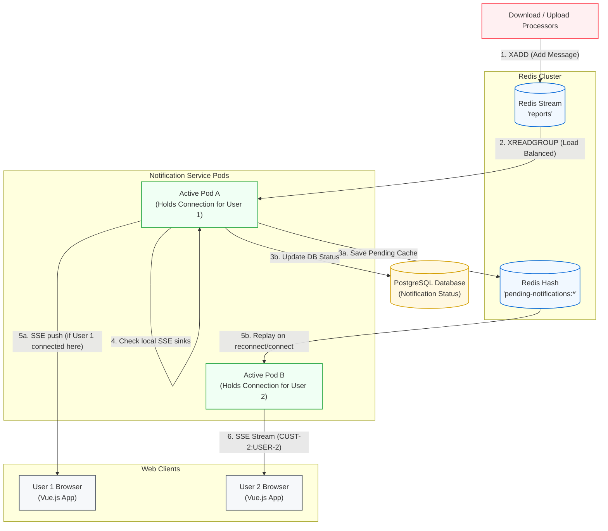
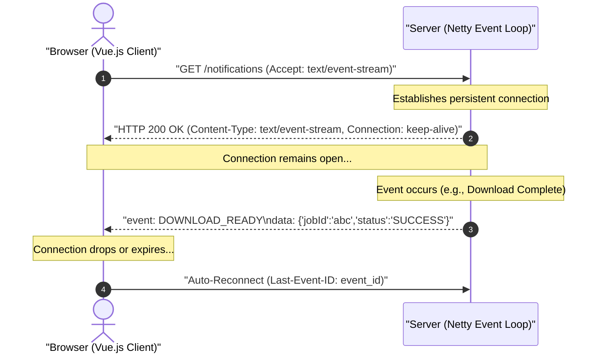
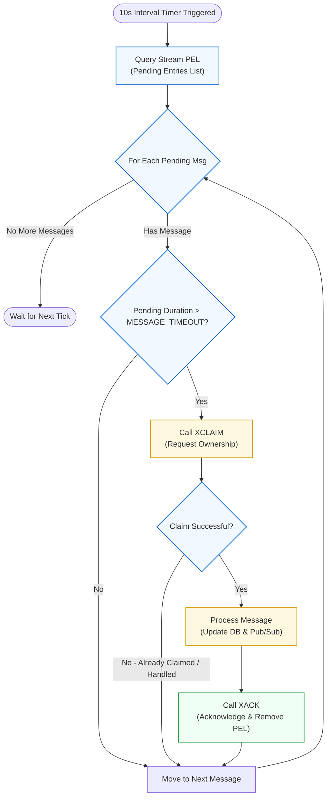
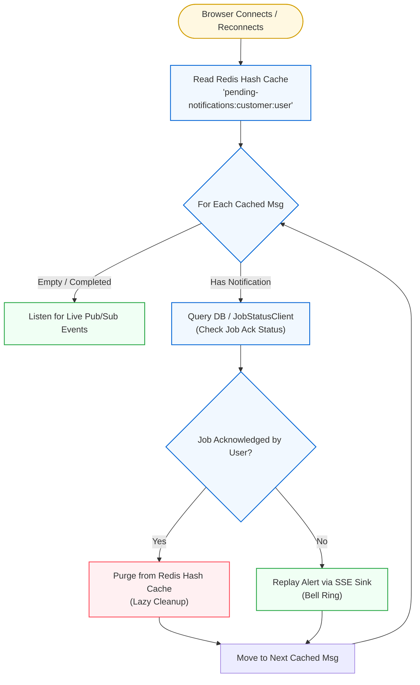
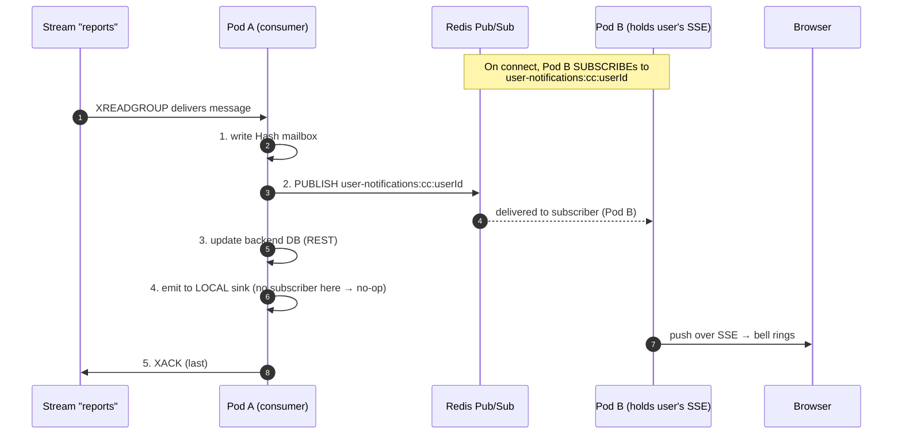

# Real-Time SSE Bell-Icon Notification Platform — Complete Interview Guide

> **Resume Line:** *"Delivered a real-time SSE bell-icon notification platform across microservices, utilizing Redis Streams for load-balanced event processing, supporting both async upload and download workflows with persistent notification state and graceful reconnection."*

---

## Table of Contents

1. [The Problem](#1-the-problem)
2. [Solution Overview (Redis Streams + SSE Model)](#2-solution-overview)
3. [End-to-End Flow for a Complete Noob](#3-end-to-end-flow-for-a-complete-noob)
4. [System Architecture Deep Dive](#4-system-architecture-deep-dive)
5. [SSE — How It Actually Works Under the Hood](#5-sse-how-it-works)
6. [Redis Streams — The Multi-Instance Glue](#6-redis-streams)
7. [Resiliency & Reclaiming Messages via XCLAIM](#7-resiliency-xclaim)
8. [Frontend Integration — Vue.js Bell Icon](#8-frontend-integration)
9. [Multi-Producer Unification (Downloads + Uploads)](#9-multi-producer-unification)
10. [Connection Lifecycle & Edge Cases](#10-connection-lifecycle--edge-cases)
11. [Why SSE Over WebSocket / Polling / Push API](#11-why-sse)
12. [Why Redis Streams Over Pub/Sub / Kafka / DB Polling](#12-why-redis-streams)
13. [Production Considerations](#13-production-considerations)
14. [Interview Q&A](#14-interview-qa)

---

## 1. The Problem

### Before: No Unified Notification System

Multiple microservices produce asynchronous events that a user needs to know about:

| Producer | Event | Old Behavior |
|----------|-------|-------------|
| **Download Processor** | 300K-row Excel report ready | User stares at a spinner, or navigates away and never knows it finished |
| **Upload Processor** | Bulk Excel upload validated/processed | User waits on a blocking modal — can't do anything else |
| **Future producers** | Any async background job | No standardized way to notify the user |

**Pain points:**

1. **No real-time feedback** — Users had to manually refresh or poll an inbox page to discover completed async tasks.
2. **Lost work visibility** — If the user closed the tab or navigated away during processing, they had zero indication the task completed. They'd re-trigger the same operation, wasting resources.
3. **Siloed notification logic** — Each microservice had its own ad-hoc way of telling the user "hey, your thing is done." No shared infrastructure. Each team reinvented the wheel.
4. **Multi-instance routing problem** — With 3-10 BFF instances behind a load balancer, a background processor finishing a job has no idea which BFF instance the user's browser is connected to. How do you route the notification to the right instance?

---

## 2. Solution Overview (Redis Streams + SSE Model)

To solve these problems, the system uses a **centralized notification architecture** combining **Redis Streams, Redis Hashes, and SSE**:



**Key properties:**
* **Redis Streams:** Serves as a load-balanced, distributed queue. Using a **Consumer Group** ensures that only **exactly one pod** of the notification service consumes a given stream event to prevent duplicate PostgreSQL database updates and Redis Hash updates.
* **Redis Hash:** Serves as a session-level cache of unacknowledged notifications. If the consuming pod does not hold the user's SSE connection, the notification is persisted here. When the user's actual pod runs the `PendingNotificationReplayer` (on SSE connect/reconnect), it picks up the notification from the Redis Hash and pushes it.
* **SSE:** Pushes notifications from the pod holding the active connection to the browser over standard HTTP/2.
* **No Pub/Sub needed:** Cross-instance delivery is handled by the Redis Hash + replayer pattern. The consuming pod writes to Redis Hash; the pod holding the SSE connection replays from Redis Hash. This avoids the fire-and-forget limitation of Pub/Sub while keeping the architecture simple.

---

## 3. End-to-End Flow for a Complete Noob

### The Doorbell Analogy

Imagine you live in an apartment building with 10 doorbells (BFF instances). A delivery driver (download-processor) has a package for you but doesn't know which doorbell is yours.

| Apartment | Our System |
|-----------|-----------|
| Delivery driver arrives with package | Download processor finishes generating report |
| Driver hands package to building manager (Notification Service) | Stream message consumed by notification service consumer group |
| Building manager logs package and leaves a note in your mailbox | Notification Service updates DB and saves to Redis Hash |
| When you check your mailbox, you see the note | The pod holding your SSE connection replays from Redis Hash |
| Your doorbell rings | Browser bell icon lights up with badge count |
| You go downstairs and pick up the package | You click the bell, open the drawer, download the file |

---

## 4. System Architecture Deep Dive

### Codebase Components

| Component | File | Role |
|-----------|------|------|
| **SSE Controller** | `NotificationController.java` | Exposes `GET /notifications` endpoint |
| **SSE Manager** | `NotificationSseService.java` | Coordinates connection sinks (`customerCode:userId`), heartbeats, and replays |
| **Stream Listener** | `ReactiveRedisStreamListener.java` | Polls new stream events and reclaims pending unacknowledged events (`XCLAIM`) |
| **Processor** | `MessageProcessor.java` | Orchestrates database updates, Redis Hash writes, and local SSE push |
| **Hash Writer** | `MessageProcessor.java` | Writes pending notifications to Redis Hash for cross-instance delivery |
| **Replayer** | `PendingNotificationReplayer.java` | Fetches pending notifications from Redis Hash and verifies acknowledgment status |

---

## 5. SSE — How It Actually Works Under the Hood

### What Is SSE?

Server-Sent Events (SSE) is a W3C standard built on top of plain HTTP. The browser opens a normal HTTP GET request, and the server keeps the connection open, streaming text events as they happen.



---

## 6. Redis Streams — The Multi-Instance Glue

### How Streams + Redis Hash handle cross-instance delivery:

1. **Load-Balanced Processing (Streams):** When a report is ready, the processor executes `XADD` to write to the Redis Stream `reports`. We consume this using a **Consumer Group** (`reports-group`):
   ```java
   reactiveRedisTemplate.opsForStream()
       .read(listenerConsumer, StreamReadOptions.empty().count(batchSize),
             StreamOffset.create(streamKey, ReadOffset.lastConsumed()))
   ```
   Only one pod of `isce-wp-notification-service` consumes this message. This pod updates the PostgreSQL database and writes the payload to a Redis Hash (`pending-notifications:{customerCode}:{userId}`) using `reactiveRedisTemplate.opsForHash().put(...)`.

2. **Local SSE Push (if connection is on this pod):** After processing, the consuming pod checks its local `customerUserSinks` map for the target user's SSE connection:
   ```java
   Sinks.Many<AsyncJobNotification> sink = customerUserSinks.get(sinkKey);
   if (sink != null) {
       sink.tryEmitNext(notification);
   }
   ```
   If the user's SSE connection is on this pod, the notification is pushed immediately.

3. **Cross-Instance Delivery (Redis Hash + Replayer):** If the user's SSE connection is on a **different** pod, the notification remains in the Redis Hash. When the pod holding the user's SSE connection runs the `PendingNotificationReplayer` (triggered on SSE connect/reconnect or periodically), it reads the Redis Hash, verifies acknowledgment status against the database, and replays unacknowledged notifications into the user's SSE sink. This ensures delivery without requiring a separate broadcast mechanism like Pub/Sub.

---

## 7. Resiliency & Reclaiming Messages via XCLAIM

If a pod crashes or is terminated while processing a stream message (e.g. database timeout), the message will remain unacknowledged in the **Pending Entries List (PEL)**.

To solve this, your codebase runs a concurrent **Pending Message Loop** inside `ReactiveRedisStreamListener.java`:

```java
protected Flux<Void> handlePendingMessagesLoop() {
    return Flux.defer(() ->
            handlePendingMessages()
                    .delaySubscription(Duration.ofSeconds(pendingPollIntervalSec)).then()
    ).repeat();
}
```

1. **Check PEL:** The loop triggers `handlePendingMessages()` every 10 seconds. It checks if there are unacknowledged messages.
2. **Reclaim (`XCLAIM`):** If a message has been pending for longer than `MESSAGE_TIMEOUT` (e.g., 1 minute), it calls `streamOps.claim(...)`:
   ```java
   streamOps.claim(streamKey, CONSUMER_GROUP, listenerConsumer.getName(), MESSAGE_TIMEOUT, recordId)
   ```
3. **Re-process:** It claims ownership of the message for the current consumer, re-routes it via `messageProcessor.processMessage()`, updates the database, and acknowledges the message so it is removed from the stream.

### XCLAIM Resiliency Workflow



---

## 8. Frontend Integration — Vue.js Bell Icon

### SSE Connection Setup

```javascript
export function useSSE() {
    const notificationCount = ref(0);
    const notifications = ref([]);
    let eventSource = null;

    function connect() {
        // Connect to the central notification SSE endpoint
        eventSource = new EventSource('/notifications', { withCredentials: true });

        eventSource.addEventListener('DOWNLOAD_READY', (event) => {
            const data = JSON.parse(event.data);
            notifications.value.push(data);
            notificationCount.value++;
        });

        eventSource.onerror = (err) => {
            console.warn('SSE connection lost, browser will auto-reconnect');
        };
    }

    onMounted(() => connect());
    onUnmounted(() => eventSource?.close());

    return { notificationCount, notifications };
}
```

---

## 9. Multi-Producer Unification (Downloads + Uploads)

The notification platform is **producer-agnostic**. Any microservice can publish notifications by following the contract:

```
Redis Stream Key: "reports"
Payload Map Fields:
  - type: DOWNLOAD_READY, UPLOAD_READY, UPLOAD_FAILED, etc.
  - reportId: String (UUID)
  - customerCode: String
  - userId: String
  - status: SUCCESS, FAILED, IN_PROGRESS
```

Adding a new report upload or download workflow requires zero changes to the SSE connection management or the acknowledgment flow.

---

## 10. Connection Lifecycle & Edge Cases

### Edge Case 1: Reconnecting after a Blip (Deduplication)
When the browser reconnects after a network drop, it may receive a notification that was already pushed.
* **Mitigation:** Your backend maintains a `userDedupMap` and `jobStatusMap` inside `NotificationSseService.java`.
* In `emitIfNotDuplicate()`, before forwarding an event to the SSE sink, it checks `NotificationUtils.isOlderOrDuplicate()`. If the event status is older or already emitted, it discards the duplicate push and acknowledges the stream.

### Edge Case 2: Missed Notifications during Disconnection
If the user was offline when a notification was pushed, the SSE connection is closed.
* **Mitigation:** On reconnection or page load, `PendingNotificationReplayer.replayPendingNotifications()` queries the Redis Hash cache (`PENDING_NOTIFICATIONS + customerCode:userId`).
* For each cached notification, it calls the database to check if the job has been acknowledged. If not, it replays it into the user's sink; otherwise, it purges the cache entry from the Redis Hash.

### Replayer and Cache Invalidation Lifecycle



---

## 11. Why SSE Over WebSocket / Polling / Push API

| Criteria | Client Polling | WebSocket | SSE (Chosen ✅) |
|----------|---------------|-----------|------|
| **Direction** | Client → Server | Bi-directional | Server → Client |
| **Overhead** | High (frequent queries) | High (protocol upgrade) | Low (standard HTTP/2 stream) |
| **Resilience** | N/A | Manual reconnect | Native (automatic browser reconnect) |
| **Infrastructure** | Standard | Needs WebSocket load balancers | Standard Nginx / HTTP LBs |
| **Permissions** | No | No | No (Unlike Service Workers/Push API which block on prompt permission) |

---

## 12. Why Redis Streams Over Pub/Sub / Kafka / DB Polling

* **Why not DB Polling?** DB Polling every 5 seconds from multiple pods causes connection exhaustion and query bottlenecks.
* **Why not Redis Pub/Sub?** Redis Pub/Sub is fire-and-forget — if the subscribing pod restarts or the user's SSE connection drops, the message is lost permanently. Redis Streams + Redis Hash gives us persistence: the stream guarantees at-least-once processing via consumer groups and PEL/XCLAIM, and the Redis Hash acts as a durable pending-notification cache that survives pod restarts and connection drops.
* **Why not Kafka for notifications?** Kafka is heavy infrastructure for a lightweight notification use case. Kafka consumer groups assign partitions to a single pod — to broadcast to all pods, each pod would need a unique group ID, which is difficult to manage dynamically in Kubernetes. Redis Streams with consumer groups provides the same load-balanced processing semantics with much lower operational overhead.

---

## 13. Production Considerations

### SSE Keep-Alive Heartbeat
Proxies and load balancers kill idle connections after 30-60 seconds. Since notifications occur occasionally, we merge a heartbeat stream:
```java
Flux<AsyncJobNotification> heartbeat = Flux.interval(RedisStreamConstants.HEARTBEAT_DURATION)
        .map(i -> AsyncJobNotification.builder().fileName(RedisStreamConstants.KEEP_ALIVE).build());
```
This pushes a keepalive event every 15 seconds to keep the TCP connection active.

---

## 14. Interview Q&A

### Q1: "How do you handle cross-instance notification delivery without Pub/Sub?"
**Answer:** *"We use Redis Streams with a Consumer Group for load-balanced processing — only one pod consumes each completion event and performs the database update and Redis Hash write. After processing, the consuming pod checks its local sink map for the user's SSE connection. If the connection is on this pod, it pushes immediately. If not, the notification persists in the Redis Hash (`pending-notifications:{customerCode}:{userId}`). The pod that actually holds the user's SSE connection picks it up via the `PendingNotificationReplayer`, which runs on SSE connect/reconnect and periodically. It reads the Redis Hash, verifies acknowledgment status against the database, and replays unacknowledged notifications. We don't need Pub/Sub because the Redis Hash acts as a durable, shared mailbox — no fire-and-forget message loss risk, and the replayer guarantees at-least-once delivery."*

### Q2: "How does your system handle unacknowledged messages if a notification pod crashes mid-execution?"
**Answer:** *"We use Redis Stream's Pending Entries List (PEL) and a background loop running every 10 seconds. If a message is consumed but not acknowledged within 1 minute, the loop triggers `opsForStream().claim(...)` (translating to `XCLAIM` in Redis). This transfers ownership of the pending message to a healthy pod. The pod re-processes the notification, updates the database, and acknowledges it, ensuring at-least-once delivery."*

### Q3: "Why is your connection registry keyed by `customerCode:userId` instead of just `customerCode`?"
**Answer:** *"In enterprise logistics, multiple users work under the same customer account. If we keyed connections only by `customerCode`, every user in the company would receive real-time bell rings for files exported by their colleagues. Keying connections by `customerCode:userId` ensures private, targeted delivery of files to the specific user session who requested the job."*

### Q4: "How does your SSE replayer verify if a pending notification from the Redis Hash cache has already been seen by the user?"
**Answer:** *"When a user establishes an SSE stream, the `PendingNotificationReplayer` reads the Redis Hash cache. For each cached item, it calls the database status service via `JobStatusClient.getJobAckStatus()`. If the database shows that the download or upload has already been acknowledged (`downloadAcknowledged` or `uploadAcknowledged`), the replayer calls `opsForHash().remove()` to evict it from the Redis cache. Otherwise, it replays the alert over the SSE socket, cleaning up cache entries lazily."*

### Q5: "How do you handle race conditions where a user receives duplicate notifications or out-of-order events?"
**Answer:** *"We maintain a `userDedupMap` and `jobStatusMap` inside `NotificationSseService`. In `emitIfNotDuplicate()`, we check `NotificationUtils.isOlderOrDuplicate()`. If the notification carries an older status or is a duplicate of a recently sent message, we discard the push. On the consumer side, we chain execution per `jobId` in a `jobExecutionChain` map to ensure sequential processing of state transitions for each job."*

### Q6: "Why did you use `Schedulers.boundedElastic()` in your replayer?"
**Answer:** *"Replaying notifications requires calling remote status services over HTTP (`JobStatusClient`). While the HTTP request itself is non-blocking, resolving client maps and managing fallback operations can include minor blocking checks. To keep the reactive thread pool completely free to stream live SSE bytes, we isolate the replayer's thread execution to the `Schedulers.boundedElastic()` thread pool."*

### Q7: "What is the memory footprint of keeping 1,000 idle SSE connections open on a single pod?"
**Answer:** *"Because we are using Spring WebFlux and Netty, idle connections do not block threads. The connection registry only holds a ConcurrentHashMap of String keys and lightweight Sink references, consuming about 200 bytes per user. 1,000 idle connections consume less than 300 KB of RAM, making it extremely cost-effective. The only limit we configure is the OS file descriptors limit."*

### Q8: "How does your frontend auto-reconnect, and how does the backend react?"
**Answer:** *"Auto-reconnection is natively handled by the browser's `EventSource` API. If the connection drops due to a pod restart or network blip, the browser automatically retries and sends a `Last-Event-ID` header. When the new SSE connection is established, the replayer triggers, reads the Redis Hash cache for any unacknowledged alerts that were published during the downtime, and streams them, ensuring no notification is lost."*

### Q9: "Why not use WebSockets for this bell icon?"
**Answer:** *"WebSockets are designed for full-duplex (bi-directional) communication. In our system, the client only needs to receive events from the server; it never needs to push messages back over this channel. WebSockets require protocol upgrading, heartbeat frames, and special load-balancer routing configurations. SSE is unidirectional, lightweight, runs over standard HTTP/2, auto-reconnects natively, and works out-of-the-box with standard proxies."*

### Q10: "How do you prevent Redis from growing infinitely with stream data?"
**Answer:** *"We configure stream trimming on the producer side. When appending new messages via `XADD`, we apply `MAXLEN ~ 10000`. The tilde (`~`) tells Redis to trim the stream approximately, which is a performance optimization that keeps the stream size capped at ~10,000 entries without incurring the block overhead of exact trimming."*

---

# 15. ✅ Verified End-to-End Flow (Read This One — Matches the Real Code)

> **⚠️ Correction to earlier sections.** Sections 2, 6, 10, 12 and Q1 above say *"No Pub/Sub needed."* That is **not** what the deployed code does. The real `isce-wp-notification-service` uses **BOTH**:
> - **Redis Pub/Sub** → live cross-pod delivery to online users (the `user-notifications:{cc}:{userId}` channel).
> - **Redis Hash** → durable offline mailbox, replayed on reconnect.
>
> The "Hash-only / replayer-only" model in the earlier sections is a simpler design that was either superseded or mis-documented. **For interviews, describe the verified flow below.** Everything here was traced directly from the source in `/Users/rohit.kumar.4/Documents/isce-reporting-tool`.

## 15.1 The exact names (memorize these)

| Thing | Value |
|---|---|
| Stream | `reports` (template jobs also use `email-delivery`) |
| Consumer group | `notification-group` |
| Pub/Sub channel (per user) | `user-notifications:{customerCode}:{userId}` |
| Hash mailbox (per user) | `pending:notifications:{customerCode}:{userId}` — field = `{jobId}:{status}` |
| SSE endpoint | `GET /notifications` (lives in **notification-service**, not the BFF) |
| New-message poll | ~200 ms (`XREADGROUP`) |
| Pending/reclaim poll | ~5 s (`XPENDING`), reclaim via `XCLAIM` after **30 min** idle (`MESSAGE_TIMEOUT`) |

## 15.2 The full flow, phase by phase

**Phase 1 — Producer (`download-processor`, `JobDispatcher`)**
1. Publishes a **`PROCESSING`** event to stream `reports` *before* doing work (UI shows "in progress").
2. Generates the report, transforms to Excel, **uploads the file to Azure Blob Storage**.
3. Generates a **SAS signed URL** (time-limited, ~48 h) — the "secure download link."
4. Publishes a **`SUCCESS` (DOWNLOAD_READY)** event to `reports` with: `reportId` (jobId), `customerCode`, `userId`, `status`, **`url`**, `fileName`, `fileSize`, `noOfRows`, `expiryTime`. On error → **`FAILED`** event. (Template jobs also go to the `email-delivery` stream.)

**Phase 2 — Load-balanced consume (`ReactiveRedisStreamListener`)**
5. All pods read `reports` via the shared consumer group `notification-group` (`XREADGROUP`, ~200 ms). Redis gives each message to **exactly one** pod ("Pod A").
6. The message sits in Pod A's **PEL** until acked. A separate loop (~5 s) uses `XPENDING` + `XCLAIM` to let another pod reclaim a message that's been idle **> 30 min** (crash recovery).

**Phase 3 — Process the message (`NotificationProcessor`), in this exact order**
7. **Write the Hash mailbox** `pending:notifications:{cc}:{userId}`, field `{jobId}:{status}` = payload. (Durability first.)
8. **`PUBLISH` to the Pub/Sub channel** `user-notifications:{cc}:{userId}`. (Live delivery.)
9. **Update job status in the DB — via an HTTP call to the backend** (`UpdateStatusClient`), *not* a direct Postgres write from this service. **Skipped for template jobs** (the email path owns that write).
10. **Emit to Pod A's own local SSE sink** *if it isn't an older/duplicate event* (dedup), then…
11. **`XACK`** the stream message — **last**, after everything above. If Pod A dies before this, the PEL + `XCLAIM` path replays it.

**Phase 4 — Live SSE delivery (`NotificationSseService`, `LiveNotificationPublisher`)**
12. The browser holds an SSE connection to some pod ("Pod B"). On connect, Pod B **subscribed** to `user-notifications:{cc}:{userId}`.
13. Redis routes the Phase-3 `PUBLISH` to every subscriber of that channel → **Pod B receives it**, emits into its sink, and pushes it down the SSE stream → the Vue bell badge updates. (Plus a keep-alive heartbeat every 10 s.)

**Phase 5 — Offline / reconnect replay (`PendingNotificationReplayer`)**
14. If the user is offline, the `PUBLISH` has no subscriber and is dropped — but the entry is safe in the Hash mailbox.
15. On (re)connect, the new pod reads the user's Hash **once**, drops expired entries (48 h), and for each one **calls the backend `getJobAckStatus`**:
    - **not acknowledged** → re-emit over SSE (and keep the entry);
    - **acknowledged / job gone** → **delete** the entry from the Hash.
    > Deletion is conditional on **acknowledgement**, *not* on "we showed it once." A delivered-but-unacked notification stays in the mailbox.

## 15.3 The cross-pod question: Pod A processes, but the user is on Pod B

**Redis Pub/Sub is the bridge — Pod A never needs to know where the user is.**



- Pod A's **local emit (step 4) goes nowhere** — no SSE subscriber lives on Pod A. It's only useful when the *same* pod both consumes and holds the connection (and then the **dedup map** stops a double-send, because that pod also receives its own publish).
- If **no** pod holds the connection at publish time, the live message is dropped — and the **Hash mailbox** recovers it on reconnect (Phase 5).

## 15.4 "Does every pod watch the Hash to see if it's their user?" — No.

This is the most common misconception. The two Redis mechanisms work in **opposite** ways:

| | Redis **Hash** (mailbox) | Redis **Pub/Sub** (channel) |
|---|---|---|
| Purpose | Durable storage / offline safety | Live push to online users |
| On write / publish | **Nobody is notified** | Redis pushes to subscribers |
| Who reads / receives | **One** pod, **only on user (re)connect** | Pod(s) **subscribed** to that user's channel |
| How "my user" is decided | N/A — looked up by key when needed | By the **channel name** `...:{cc}:{userId}`; **Redis** routes it |
| Polling? | No (read once on connect) | No (event-driven push) |

- Writing the Hash is **silent** — no pod is watching it. It's a mailbox you check when you walk up to it, not a doorbell.
- Routing to "the right user" is done by the **per-user channel name**. Pods don't receive everyone's messages and filter — **Redis only delivers a user's message to the pods that subscribed to that user's channel.**

## 15.5 Corrected Q&A (supersedes Q1)

**Q (corrected): "How do you deliver a notification to a user when the consuming pod isn't the one holding their SSE connection?"**
*"The consuming pod publishes the notification to a per-user Redis Pub/Sub channel, `user-notifications:{customerCode}:{userId}`. Whichever pod holds that user's SSE connection subscribed to that exact channel when the connection opened, so Redis routes the message straight to it and it pushes over SSE — sub-millisecond, no pod-to-pod coordination. Before publishing, the consuming pod also writes the payload to a per-user Redis Hash mailbox; that's the durability net. If the user is offline (no subscriber), the publish is simply dropped and the mailbox keeps it. On reconnect, the new pod reads the mailbox once, checks the backend ack-status per item, and replays anything not yet acknowledged. So Pub/Sub handles the live hop and the Hash handles the offline/recovery case — the stream's consumer group + PEL/XCLAIM gives at-least-once processing, and a dedup map prevents a same-pod double-send."*

**Q: "Why is the `XACK` done last?"**
*"So the stream message isn't acknowledged until the mailbox write, the publish, the DB update, and the local emit have all happened. If the pod crashes mid-way, the message stays in the PEL and another pod reclaims it via XCLAIM after the idle timeout and reprocesses — at-least-once. Acking early would risk losing a notification that hadn't actually been persisted or delivered yet."*

---

## 15. Verified End-to-End Implementation Flow (Code-Traced)

This section documents the **actual implementation** verified directly against the codebase in `/Users/rohit.kumar.4/Documents/isce-reporting-tool/`.

### Phase 1: Event Publishing (download-processor)

**Files:**
- `JobDispatcher.java` — Orchestrates the flow
- `RedisStreamPublisherService.java` — Publishes to Redis Stream
- `NotificationMapper.java` — Constructs event payloads
- `BlobPublisher.java` — Generates signed Azure URLs

**Flow:**

1. Job dispatcher starts: `publishProcessingNotification(jobRequest)` → publishes **PROCESSING** event immediately to stream `reports`
2. Report generation and Excel transformation complete
3. **Upload to Azure Blob Storage** and generate **SAS signed URL** (48-hour TTL)
4. Publish **SUCCESS (DOWNLOAD_READY)** event containing:
   - `reportId`, `customerCode`, `userId`, `status` (SUCCESS/FAILED)
   - `url` (signed Azure blob URL)
   - `fileName`, `fileSize`, `noOfRows`, `expiryTime`
5. Redis Stream key: `reports` (configurable `REDIS_STREAM_NAME`)
6. For template-based jobs with email: also publish to stream `email-delivery`

**Implementation Detail:** Pub/Sub is NOT used for publishing. Events flow through Redis Streams only.

---

### Phase 2: Load-Balanced Stream Consumption

**File:** `ReactiveRedisStreamListener.java`

**Consumer Group:** `notification-group` (shared across all notification-service pods)

**Dual-loop model:**

1. **New Messages Loop** (every 200ms):
   - Uses `XREADGROUP` with `ReadOffset.lastConsumed()` to read up to 10 messages per batch
   - Does NOT immediately ACK; delegates to `MessageProcessor`

2. **Pending Messages Loop** (every 5 seconds):
   - Checks PEL for unacknowledged messages via `XPENDING`
   - If message idle > 30 minutes, reclaims via `XCLAIM` and reprocesses

**Key Property:** Only one pod in the consumer group receives each message (load-balanced distribution).

---

### Phase 3: Persistence → Redis Hash Mailbox

**File:** `NotificationProcessor.java`

**Execution Order (CRITICAL):**

```
1. Write to Redis Hash mailbox
   Key:   "pending:notifications:{customerCode}:{userId}"
   Field: "{jobId}:{status}"
   Value: Entire notification payload
   
2. Publish to Redis Pub/Sub
   Channel: "user-notifications:{customerCode}:{userId}"
   
3. Update PostgreSQL (via HTTP call to backend)
   Uses UpdateStatusClient (NOT direct DB write from this service)
   SKIPPED for template jobs
   
4. Emit to local SSE sink
   Checks if this pod holds the user's connection
   If yes AND not duplicate: emit immediately
   
5. XACK the stream message
   Deferred until after all above steps complete
```

**Why Redis Hash?** Not for broadcast — it's a durable mailbox. Written for offline safety. Read only once per user reconnect (via `PendingNotificationReplayer`).

---

### Phase 4: Redis Pub/Sub (Hybrid Delivery)

**File:** `RedisPubSubService.java`

**Important Clarification:** The architecture **uses Pub/Sub differently** than originally described.

```java
public void publishToUser(String customerCode, String userId, AsyncJobNotification notification) {
    String channel = "user-notifications:" + customerCode + ":" + userId;
    publisherRedisTemplate.convertAndSend(channel, notification);
}
```

**Pub/Sub serves two purposes:**

1. **Live broadcast** to pods subscribed to `user-notifications:{cc}:{userId}`
2. **Deduplication bridge** — consuming pod emits to both:
   - Its own local sink (if user connected here) AND
   - The Pub/Sub channel (cross-pod delivery)

This creates a potential for **duplicate delivery** if the same pod both consumes and holds the connection. That's why the dedup map (`userDedupMap` + `isOlderOrDuplicate()` check) exists.

---

### Phase 5: Real-Time SSE Delivery

**Files:**
- `NotificationController.java` — SSE endpoint
- `NotificationSseService.java` — Connection orchestration
- `LiveNotificationPublisher.java` — Pub/Sub subscriber

**SSE Endpoint:** `GET /notifications` on the notification-service itself

**Connection Lifecycle:**

1. Browser opens SSE connection to a notification-service pod
2. That pod subscribes to the user's Pub/Sub channel: `user-notifications:{cc}:{userId}`
3. When consuming pod publishes to that channel, the SSE pod receives it via `LiveNotificationPublisher`
4. Converts to `ServerSentEvent<AsyncJobNotification>` and pushes down the open HTTP stream

**Heartbeat:** Every 10 seconds, a keep-alive ping prevents proxy idle timeout.

---

### Phase 6: Offline Reconnect & Replay

**File:** `PendingNotificationReplayer.java`

**Triggered on:** SSE connection `/notifications` endpoint call (page load or browser reconnect)

**Flow:**

1. Read Redis Hash mailbox: `HGETALL pending:notifications:{cc}:{userId}`
2. Filter expired entries (>48h old per `expiryTime` field)
3. For each remaining notification:
   - Call backend `JobStatusClient.getJobAckStatus(jobId)`
   - If job shows `downloadAcknowledged==true` OR `uploadAcknowledged==true`:
     - Delete from Redis Hash: `HDEL pending:notifications:{cc}:{userId} {field}`
   - Else:
     - Emit notification through SSE sink (browser sees it)
     - Keep in hash for next check

**Critical Difference from Original Description:** Hash entries are deleted **ONLY AFTER** backend confirms acknowledgment. A delivered-but-unacknowledged notification stays in the mailbox for replay on next reconnect.

---

### Phase 7: ACK Ordering (Code-Verified)

**File:** `NotificationProcessor.java` lines 88-121

**Actual order:**

```
hashWrite() → pubSubPublish() → backendUpdate() → localEmit() → XACK
```

NOT: `dbUpdate() → hashWrite() → pubSubPublish() → localEmit() → XACK`

**Why deferred ACK is critical:** If the pod crashes between `pubSubPublish()` and `XACK`, the message remains in PEL. The pending loop's `XCLAIM` reclaims it on a healthy pod, replaying it. This guarantees at-least-once semantics without losing notifications.

---

### Configuration Defaults

```yaml
# download-processor
spring.data.redis.stream-name: ${REDIS_STREAM_NAME:reports}
spring.data.redis.email-stream-name: ${REDIS_EMAIL_DELIVERY_STREAM_NAME:email-delivery}

# isce-wp-notification-service
spring.data.redis.stream-name: ${REDIS_STREAM_NAME:reports}
spring.data.redis.new-poll-interval: 200ms           # New message loop interval
spring.data.redis.pending-poll-interval: 5s          # PEL check interval
spring.data.redis.batch-size: 10                     # Messages per batch
spring.data.redis.email-delivery-stream-name: ${REDIS_EMAIL_DELIVERY_STREAM_NAME:email-delivery}
spring.data.redis.email-delivery-batch-size: 10
spring.data.redis.email-delivery-new-poll-interval: 500ms
spring.data.redis.email-delivery-pending-poll-interval: 10s
```

---

### Key Architectural Differences from Initial Description

| Aspect | Original Description | Actual Implementation |
|--------|---|---|
| **DB Update Path** | Direct PostgreSQL write from notification-service | HTTP call to backend service via `UpdateStatusClient`; template jobs skip entirely |
| **Pub/Sub Usage** | Cross-pod routing only | Routing + dedup bridge (handles case where consuming pod == SSE pod) |
| **Hash Deletion** | Delete after delivery | Delete ONLY after backend confirms job acknowledged |
| **ACK Timing** | After hash write | After local emit (very last step) |
| **Reclaim Timeout** | ~10s loop | 5s loop checks, but only reclaims after 30min idle |
| **Events** | One completion event | PROCESSING → SUCCESS or FAILED (two-phase) |
| **SSE Endpoint** | BFF proxy | Direct to notification-service `/notifications` |

---

### Summary: Hash vs. Pub/Sub (Correct Mental Model)

**Redis Hash mailbox:**
- Purpose: Durable offline cache
- Write: On every notification (after consuming stream)
- Read: Once per user reconnect (bulk read via `HGETALL`)
- Polling: None (passive storage)
- Delivery: Via `PendingNotificationReplayer`, conditional on acknowledgment

**Redis Pub/Sub channel:**
- Purpose: Live cross-pod routing + dedup bridge
- Publish: After hash write, before ACK
- Subscribe: Each SSE pod subscribes to its connected users' channels
- Polling: Event-driven (SUBSCRIBE)
- Delivery: Immediate if subscriber exists, fire-and-forget if not

**Why NOT both Pub/Sub for everything?** Redis Pub/Sub is fire-and-forget — no subscriber at moment of publish = message lost. The hash ensures durability; Pub/Sub adds speed for online users.
