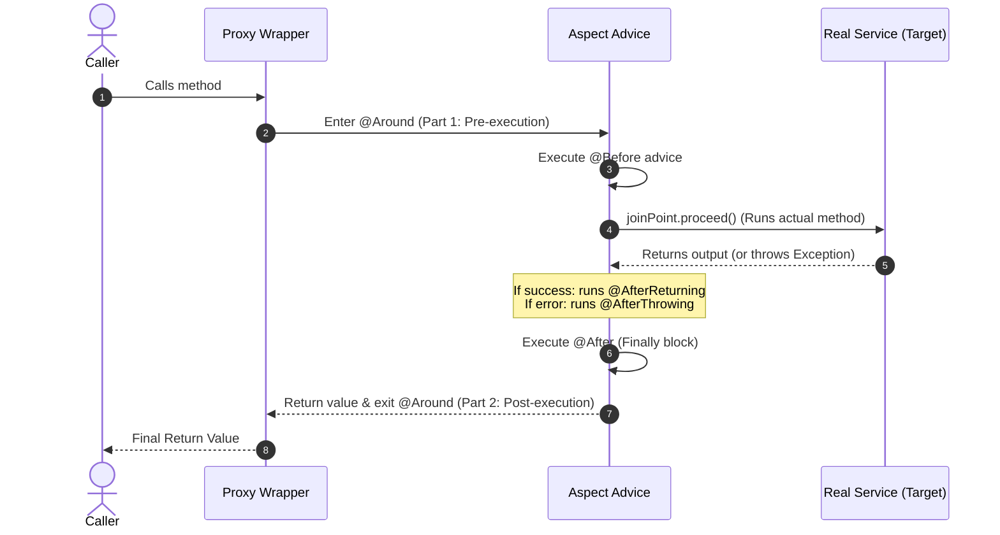

# Spring AOP (Aspect-Oriented Programming) — A Noob-Friendly Guide 🚀

---

## 1. What is AOP? (The "Personal Assistant" Analogy)

Imagine you run a bank. Every time a customer wants to withdraw money, a clerk must perform several tasks:
1.  **Security**: Check if the customer is who they say they are.
2.  **Logging**: Write the transaction in a ledger book.
3.  **Business Logic**: Actually deduct the cash from their balance.
4.  **Notification**: Send an SMS receipt.

Without **AOP**, your code would look like this in every single service method:

```java
public void withdrawMoney() {
    securityCheck();      // ❌ Boilerplate / Repetitive
    logTransaction();     // ❌ Boilerplate / Repetitive
    
    // ACTUAL BUSINESS LOGIC
    bankAccount.decreaseBalance(); 
    
    sendSMS();            // ❌ Boilerplate / Repetitive
}
```

If you have 100 methods, you have to copy-paste those boilerplate lines 100 times. What a nightmare to maintain!

### The AOP Solution

**AOP** lets you extract these repetitive tasks (called **cross-cutting concerns**) and put them into a single, clean class called an **Aspect**. 

Spring then creates a **Proxy** (a wrapper or a "Personal Assistant") around your class. Instead of talking directly to your real code, callers talk to the Proxy first.

```mermaid
graph TD
    subgraph Without AOP (Cluttered Service)
        Caller1[Caller] --> Service1[Service Method]
        Service1 --> Boilerplate1["❌ Security check (Copy-Pasted)<br/>❌ Logging (Copy-Pasted)<br/>✅ Actual Business Logic (Deduct Cash)<br/>❌ SMS receipt (Copy-Pasted)"]
    end

    subgraph With AOP (Clean & Modular)
        Caller2[Caller] --> Proxy[Proxy Wrapper]
        subgraph Proxy [Proxy / Personal Assistant]
            Sec[Aspect: Security] --> Log[Aspect: Logging]
            Log --> Target[Clean Target Method: Deduct Cash]
            Target --> SMS[Aspect: SMS Receipt]
        end
    end

    style Boilerplate1 fill:#f9d,stroke:#333,stroke-width:1px
    style Target fill:#d4f7d4,stroke:#333,stroke-width:2px
    style Proxy fill:#e1f5fe,stroke:#0288d1,stroke-width:2px
```

---

## 2. Core AOP Vocabulary (The House Sockets Analogy)

AOP terms sound scary, but they make complete sense when mapped to everyday objects.

> [!TIP]
> ### 🔌 The Wall Socket Analogy
> *   **Join Points** are all the **wall outlets** in your house. They are all possible places where you *can* plug in.
> *   **Pointcut** is the **shape of your charger's plug**. It dictates which specific outlets the plug will fit into.
> *   **Advice** is the **electricity** that flows to charge your phone once connected.

```mermaid
graph TD
    subgraph Wall Outlets = Join Points (Possible methods to intercept)
        JP1[Method A: getBalance]
        JP2[Method B: withdrawMoney]
        JP3[Method C: updateProfile]
    end

    subgraph Plug Shape = Pointcut (The rule/filter)
        PC["Pointcut Rule: Matches only methods annotated with @LogTime"]
    end

    subgraph Electricity = Advice (The code that runs)
        AD["Advice: Measure execution time and log it"]
    end

    PC --> |"Matches & Filters"| JP2
    AD --> |"Injects power/runs at"| JP2

    style JP2 fill:#ffe0b2,stroke:#fb8c00,stroke-width:2px
    style PC fill:#e1f5fe,stroke:#0288d1,stroke-width:2px
    style AD fill:#d4f7d4,stroke:#4caf50,stroke-width:2px
```

### Quick Vocabulary Table

| AOP Term | Standard Definition | Simple Explanation | Analogy (Restaurant) |
| :--- | :--- | :--- | :--- |
| **Aspect** | A modular class for a cross-cutting concern. | The Java class containing our reusable AOP code. | The **Waiter** who handles logging/billing. |
| **Advice** | Action taken by an aspect at a Join Point. | The actual code that runs, and *when* it runs. | The waiter **greeting** you or **bringing** the bill. |
| **Join Point** | A point during program execution. | A possible spot in your code where you can attach AOP. | Any **interaction** (sitting down, ordering, leaving). |
| **Pointcut** | A predicate to match Join Points. | The filter/rule that selects *which* methods to intercept. | The rule: *"Only greet customers who order dessert."* |
| **Target** | Object being advised. | The original class containing the real business logic. | The **Chef** in the kitchen cooking the food. |
| **Proxy** | Wrapper object created by AOP. | The assistant Spring creates to intercept the calls. | The **Front Door/Host** managing access to tables. |
 
---

## 2.1 Pointcut Expressions (How to target methods?) 🎯

A **Pointcut Expression** is the rule pattern that tells Spring AOP which methods to intercept. The most common pointcut designators are:

### 1. `execution(...)` (Match method signatures)
This is the most powerful and common designator. 
* **Syntax:** `execution(modifiers-pattern? ret-type-pattern declaring-type-pattern? name-pattern(param-pattern) throws-pattern?)`
  *(Question marks `?` mean the part is optional).*

* **Examples:**
  * `execution(public * *(..))` -> Matches **any public method**.
  * `execution(* com.example.service.*.*(..))` -> Matches **any method in any class** inside the `com.example.service` package.
  * `execution(* com.example.service.UserService.save*(..))` -> Matches any method starting with `save` inside `UserService`.

### 2. `@annotation(...)` (Match custom annotations)
Matches any method marked with a specific custom annotation.
* **Example:** `@annotation(com.example.aop.annotation.LogTime)` -> Targets only methods annotated with `@LogTime`.

### 3. `within(...)` (Match all methods in a package/class)
Limits matching to join points within certain types/classes.
* **Example:** `within(com.example.controller..*)` -> Matches all methods in the controller package and its subpackages.

---

---

## 3. The 5 Types of Advice (When does it run?)

1.  **Before (`@Before`)**: Runs *before* the target method starts (e.g., Security role check).
2.  **After Returning (`@AfterReturning`)**: Runs *only if* the target method completes successfully (e.g., Log success status).
3.  **After Throwing (`@AfterThrowing`)**: Runs *only if* the target method throws an exception (e.g., Triggering alerts on crash).
4.  **After (`@After`)**: Runs after the method finishes, *no matter what* (success or failure, like a `finally` block).
5.  **Around (`@Around`)**: Runs *before AND after*. It wraps the method completely. (e.g., Measuring method performance/duration).

---

## 4. The Onion Model (Advice Execution Order)

When multiple types of advice target the same method, they wrap around it like layers of an onion.



---

## 5. Code Example — Logging execution time

Let's write a simple AOP aspect to **measure how long a method takes to run**.

### Step 1: Create a Custom Annotation
We want to mark any method we want to measure with `@LogTime`.

```java
package com.example.aop.annotation;

import java.lang.annotation.ElementType;
import java.lang.annotation.Retention;
import java.lang.annotation.RetentionPolicy;
import java.lang.annotation.Target;

@Target(ElementType.METHOD)          // Tells Java: Apply this annotation only on methods
@Retention(RetentionPolicy.RUNTIME)  // Tells Java: Keep this annotation readable at runtime
public @interface LogTime {
    // This acts as a marker annotation!
}
```

### Step 2: Create the Aspect Class
This class will intercept any method marked with `@LogTime` and print its execution duration.

```java
package com.example.aop.aspect;

import lombok.extern.slf4j.Slf4j;
import org.aspectj.lang.ProceedingJoinPoint;
import org.aspectj.lang.annotation.Around;
import org.aspectj.lang.annotation.Aspect;
import org.springframework.stereotype.Component;

@Aspect      // 1. Tell Spring this is an AOP Aspect
@Component   // 2. Register it as a Spring Bean
@Slf4j
public class PerformanceAspect {

    // 3. Match any method annotated with @LogTime
    @Around("@annotation(com.example.aop.annotation.LogTime)")
    public Object logExecutionTime(ProceedingJoinPoint joinPoint) throws Throwable {
        long startTime = System.currentTimeMillis();

        // 4. Let the target method execute!
        Object result = joinPoint.proceed(); 

        long endTime = System.currentTimeMillis();
        long executionTime = endTime - startTime;

        log.info("Method [{}] took {} ms to execute.", 
                 joinPoint.getSignature().getName(), 
                 executionTime);

        // 5. Return the result of the method
        return result; 
    }
}
```

> [!IMPORTANT]
> In `@Around` advice, you **MUST** call `joinPoint.proceed()`, otherwise your real business method will never run!

### Step 3: Apply the Annotation
Now we just put `@LogTime` on any method we want to monitor.

```java
@Service
public class DummyService {

    @LogTime  // 🚀 Spring AOP will intercept this method!
    public void performHeavyTask() {
        // Business logic here
    }
}
```

---

## 6. Common Traps (Crucial for Interviews!)

### Trap 1: The "Self-Invocation" Problem
If Method A calls Method B **inside the same class**, AOP will **not** trigger on Method B.

```mermaid
graph TD
    subgraph External Call (Interception works)
        Caller --> |"Calls Method A"| Proxy[Proxy Wrapper]
        Proxy --> |"Intercepts"| Aspect[Aspect Advice]
        Aspect --> |"Calls target"| TargetA[Target Method A]
    end

    subgraph Internal Call (Bypasses Proxy ❌)
        TargetA --> |"this.methodB()"| TargetB[Target Method B]
        style TargetB fill:#ffcdd2,stroke:#e53935
        note["Calls methodB directly on itself (this), bypassing the Proxy wrapper!<br/>AOP advice on Method B will NOT trigger."]
    end
```

*   **Why?**: The call `this.methodB()` bypasses the proxy wrapper and goes directly to the internal instance.
*   **The Fix**: Move `methodB()` to a different service class, or inject the service bean into itself lazily (`@Autowired @Lazy private MyService self`) and call `self.methodB()`.

### Trap 2: Private Methods
*   **The Rule**: AOP does **not** work on `private` methods.
*   **Why**: Spring AOP creates proxies using subclasses or interfaces. A subclass cannot override or access `private` methods of the parent class, making it impossible for the proxy to intercept them.

### Trap 3: JDK Dynamic Proxy vs. CGLIB
Spring AOP uses two proxy types:
1.  **JDK Dynamic Proxy**: Used if your class implements an **interface** (e.g. `UserServiceImpl` implementing `UserService`).
2.  **CGLIB Proxy**: Used if your class does **not** implement an interface. It creates a subclass of your class at runtime.

> [!NOTE]
> Spring Boot 2+ defaults to using **CGLIB** for all proxies by default to avoid class-cast issues (e.g. attempting to autowire a concrete implementation when JDK proxy only exports interface types).

---

## 7. Aspect Ordering & Precedence (`@Order`) 🪜

If you have multiple aspects intercepting the same method (e.g., a `SecurityAspect` checking roles, and a `LoggingAspect` tracking calls), who runs first?

By default, the order of execution is undefined. To enforce execution order, annotate your aspect classes with Spring's `@Order` annotation.

```mermaid
graph TD
    Client[HTTP Client Request] --> Proxy[Proxy Wrapper]
    
    subgraph Aspect Execution Flow (Onion Chain)
        Proxy --> Order1In[Aspect 1: Order 1 <br> e.g. SecurityAspect - IN]
        Order1In --> Order2In[Aspect 2: Order 2 <br> e.g. LoggingAspect - IN]
        Order2In --> Controller[Target Controller Method]
        
        Controller --> Order2Out[Aspect 2: Order 2 <br> e.g. LoggingAspect - OUT]
        Order2Out --> Order1Out[Aspect 1: Order 1 <br> e.g. SecurityAspect - OUT]
    end
    
    Order1Out --> Response[HTTP Response]

    style Proxy fill:#e1f5fe,stroke:#0288d1,stroke-width:2px
    style Controller fill:#d4f7d4,stroke:#4caf50,stroke-width:2px
    style Order1In fill:#ffe0b2,stroke:#fb8c00,stroke-width:2px
    style Order1Out fill:#ffe0b2,stroke:#fb8c00,stroke-width:2px
```

* **Rule:** A **lower** value in `@Order` means **higher priority**.
* **Flow:** The aspect with `@Order(1)` runs **before** the aspect with `@Order(2)` on the way into the method, but runs **after** it on the way out (nested/onion structure).

### Code Example:
```java
@Aspect
@Component
@Order(1) // Runs first on the way in
public class SecurityAspect {
    @Before("execution(* com.example.service.*.*(..))")
    public void verify() { System.out.println("Checking security..."); }
}

@Aspect
@Component
@Order(2) // Runs second on the way in
public class LoggingAspect {
    @Before("execution(* com.example.service.*.*(..))")
    public void log() { System.out.println("Logging method execution..."); }
}
```

---

## 8. Spring AOP vs. Full AspectJ ⚔️

Many beginners confuse Spring AOP with the full AspectJ library. Spring AOP uses some AspectJ annotations, but their core engines are completely different.

| Feature | Spring AOP | AspectJ |
| :--- | :--- | :--- |
| **Core Goal** | Simple AOP integrated with Spring IOC container. | Robust, complete AOP framework. |
| **Weaving Time** | **Runtime Proxying** (creates proxies at startup). | **Compile-Time, Post-Compile, or Load-Time Weaving**. |
| **Interception Scope**| Only **public methods** inside Spring Beans. | Any class method, constructor, field access, static block. |
| **Performance** | Slower (requires proxy lookup overhead). | Faster (bytecode modified directly, no proxies needed). |
| **Complexity** | Extremely simple (no extra compilation setup). | Higher (requires AspectJ compiler/ajc plugin). |

> [!TIP]
> Use **Spring AOP** for 99% of enterprise microservices tasks (logging, transaction propagation, authorization). Use **AspectJ** only when you need to intercept constructor calls, private methods, or objects not managed by the Spring context.

