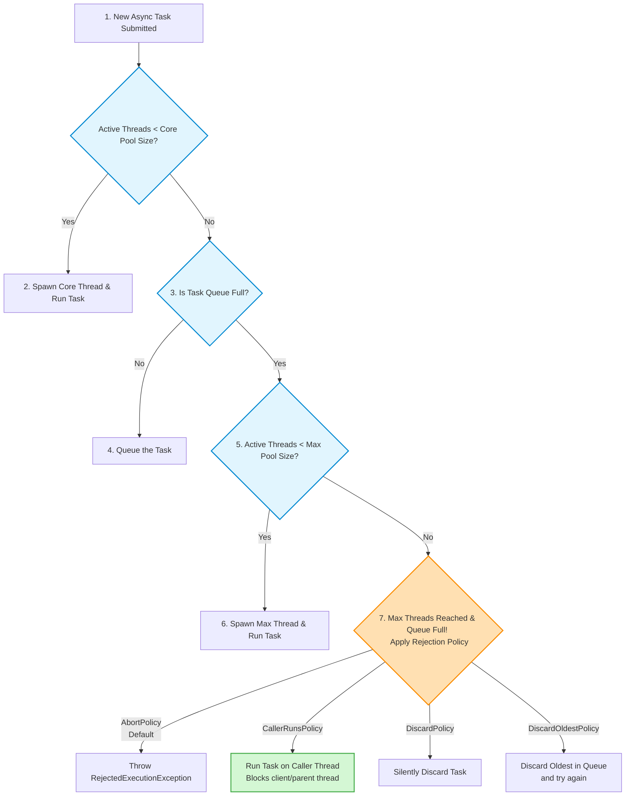
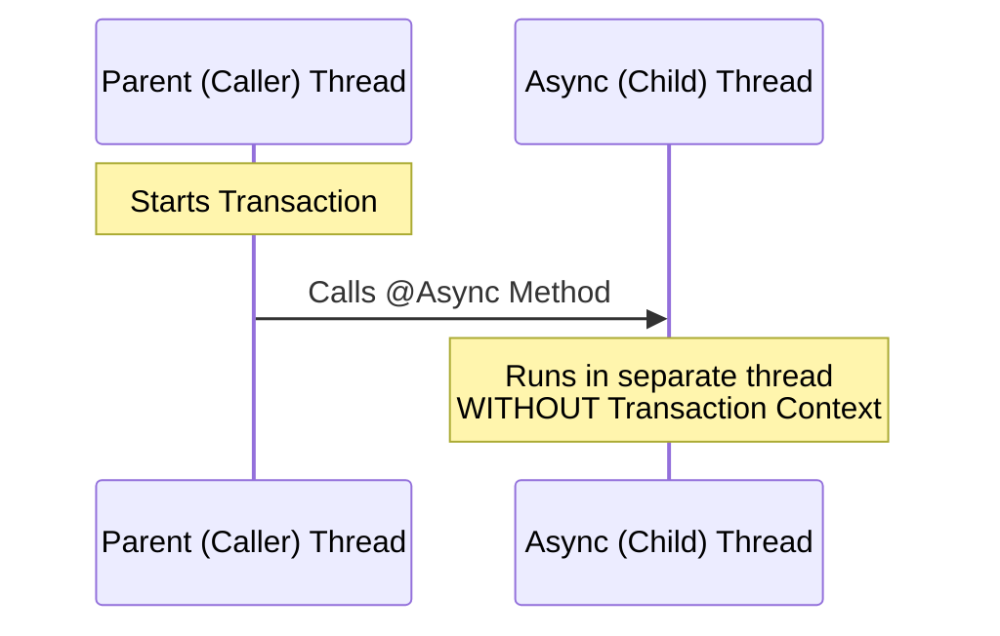

# Spring Boot `@Async` Notes: A Guide for Beginners

Welcome to the beginner-friendly guide to Spring Boot `@Async`! If you've ever wondered how to make your Spring Boot applications run tasks in the background without blocking the main workflow, this note is for you.

---

## 1. What is a Thread Pool? (The Basics)
Before diving into Spring, let's understand the core concept: a **Thread Pool**.

*   **Definition**: A collection of worker threads that are kept alive and ready to perform tasks.
*   **Why use it?** Spawning a thread in Java is expensive (takes time and memory). A thread pool allows us to **reuse** existing threads.
*   **The Lifecycle**:
    1. A task is submitted.
    2. It goes into a **Task Queue** (waiting room) if all threads are busy.
    3. An idle thread from the pool picks up the task from the queue, executes it, and then **returns to the pool** to wait for the next task.

### Java's `ThreadPoolExecutor` Parameters:
When you configure a thread pool in Java, you define three main parameters:
1.  **Core Pool Size**: The minimum number of threads kept alive in the pool (even if idle).
2.  **Max Pool Size**: The maximum number of threads the pool can grow to under high load.
3.  **Queue Capacity**: The size of the waiting room. If the queue fills up, *then* the pool starts creating new threads up to the Max Pool Size.

---

## 2. Introducing Spring Boot `@Async`
By default, Java runs code sequentially (top-to-bottom on the same thread). If a method takes 5 seconds, the user waits 5 seconds.
With `@Async`, you can run a method in the background on a **separate thread**.

### How to use it:
1.  **Enable Asynchronous Behavior**: Add `@EnableAsync` to your main class or a configuration class.
2.  **Annotate the Method**: Add `@Async` on top of the method you want to run asynchronously.

```java
@SpringBootApplication
@EnableAsync // Step 1: Enable it!
public class Application {
    public static void main(String[] args) {
        SpringApplication.run(Application.class, args);
    }
}

@Component
public class UserService {
    @Async // Step 2: Mark it async!
    public void sendEmailNotification() {
        System.out.println("Email sent by: " + Thread.currentThread().getName());
    }
}
```

---

## 3. Under the Hood: What is Spring's Default Executor?
If you just add `@Async` without configuring anything, how does Spring manage the threads? This is a common interview trap!

Spring Boot's `AsyncExecutionInterceptor` decides which executor to use:
*   It first looks for a **default executor** (a Spring bean of type `TaskExecutor`, or a `java.util.concurrent.Executor` named `taskExecutor`).
*   With **Spring Boot auto-configuration present**, Boot registers an `applicationTaskExecutor` (a `ThreadPoolTaskExecutor`) and `@Async` uses it as the default. So in a normal Boot app you do **not** fall back to `SimpleAsyncTaskExecutor`.
*   `SimpleAsyncTaskExecutor` is only the fallback in **plain Spring without Boot auto-config**, or when no qualifying executor bean exists (e.g. you defined a non-`TaskExecutor` `Executor` bean that Boot doesn't pick up — see Method B).

### Use Case 1: The Default Spring Boot Behavior
If you don't define any custom executor, Spring Boot auto-configures the `applicationTaskExecutor` (a `ThreadPoolTaskExecutor`) and `@Async` uses it with the following default configuration:
*   **Core Pool Size**: `8`
*   **Max Pool Size**: `2,147,483,647` (`Integer.MAX_VALUE`)
*   **Queue Capacity**: `2,147,483,647` (`Integer.MAX_VALUE`)
*   **Keep Alive**: `60 seconds`

#### ⚠️ Why the Default Configuration is DANGEROUS for Production:
1.  **Underutilization**: Since the queue capacity is virtually infinite (`Integer.MAX_VALUE`), threads will **never** grow beyond the Core size of `8` until the queue is completely full (which will never happen under normal load).
2.  **High Latency**: Tasks will pile up in the queue waiting for those 8 threads, causing lag.
3.  **Memory Exhaustion (OOM)**: An unbounded queue holding millions of tasks will consume all your JVM memory, crashing the server.
4.  **Thread Exhaustion**: If the queue *does* fill up, Spring will try to spawn up to 2 billion threads, instantly crashing your OS.

---

## 4. Customizing Your Executor (The Right Way)

To solve the issues above, you should define your own custom executor.

### Method A: Defining a `ThreadPoolTaskExecutor` (Recommended)
This is Spring's wrapper around Java's `ThreadPoolExecutor`. Because it is a Spring-managed bean, Spring will automatically pick it up as the default executor for `@Async`.

```java
@Configuration
public class AppConfig {
    @Bean(name = "myThreadPoolExecutor")
    public Executor taskExecutor() {
        ThreadPoolTaskExecutor executor = new ThreadPoolTaskExecutor();
        executor.setCorePoolSize(2);
        executor.setMaxPoolSize(4);
        executor.setQueueCapacity(3);
        executor.setThreadNamePrefix("MyThread-");
        executor.initialize();
        return executor;
    }
}
```

#### How it handles load under this config:
*   **First 2 tasks**: Run immediately on Core Threads (`MyThread-1`, `MyThread-2`).
*   **Next 3 tasks**: Sit in the Queue (Queue holds up to 3 tasks).
*   **Next 2 tasks**: Queue is full! Create new threads up to Max Pool Size (`MyThread-3`, `MyThread-4`).
*   **8th task**: Queue is full, Max Pool Size is reached! The task gets **rejected** (`RejectedExecutionException`).

---

### Method B: Defining a Java `ThreadPoolExecutor` (The Trap 🪤)
If you configure a raw Java `ThreadPoolExecutor` instead of Spring's `ThreadPoolTaskExecutor`:

```java
@Bean(name = "myThreadPoolExecutor")
public Executor taskExecutor() {
    return new ThreadPoolExecutor(2, 4, 1, TimeUnit.HOURS, new ArrayBlockingQueue<>(3));
}
```

*   **The Problem**: During startup, Spring Boot does not recognize this as a Spring-specific task executor to set as the *default*.
*   **The Fallback**: Spring Boot falls back to `SimpleAsyncTaskExecutor`, which **creates a brand-new thread for every single async call**!
*   **The Fix**: You must explicitly name it in the annotation: `@Async("myThreadPoolExecutor")`.

---

### Method C: Implementing `AsyncConfigurer` (The Safest Way)
If you don't want to worry about naming your thread pool in every `@Async` annotation, you can implement `AsyncConfigurer`. This makes your custom thread pool the global default.

```java
@Configuration
public class AppConfig implements AsyncConfigurer {
    
    @Override
    public Executor getAsyncExecutor() {
        ThreadPoolTaskExecutor executor = new ThreadPoolTaskExecutor();
        executor.setCorePoolSize(5);
        executor.setMaxPoolSize(10);
        executor.setQueueCapacity(100);
        executor.setThreadNamePrefix("DefaultAsync-");
        executor.initialize();
        return executor;
    }
}
```
Now, any method annotated with `@Async` (without a name) will automatically use this custom configuration!

---

### Method D: Java 21+ Virtual Threads (Modern Spring Boot 3.2+) 🚀
With Java 21+, you no longer need complex sizing of core and max pools for I/O-bound tasks. Instead, you can run tasks on **Virtual Threads**, which are incredibly lightweight threads managed by the JVM (allowing millions of concurrent threads).

```java
@Configuration
public class AsyncVirtualThreadConfig {

    @Bean(name = "taskExecutor")
    public Executor taskExecutor() {
        // SimpleAsyncTaskExecutor can be told to start each task on a new Virtual Thread (Spring 6.1+ / Boot 3.2).
        SimpleAsyncTaskExecutor executor = new SimpleAsyncTaskExecutor();
        executor.setVirtualThreads(true); // Each submitted task runs on a fresh virtual thread
        return executor;
    }
}
```

> [!WARNING]
> **Common mistake:** `new SimpleAsyncTaskExecutor(Runnable::run)` does **NOT** use virtual threads. That constructor takes a `ThreadFactory`, and `Runnable::run` makes every task execute **synchronously on the caller thread** (no new thread at all). To get virtual threads you must call `setVirtualThreads(true)` as shown above.

The simplest option of all is to skip custom config entirely and set the property — Boot 3.2+ will then run `@Async` tasks (and web request handling) on virtual threads:

```properties
spring.threads.virtual.enabled=true
```

---

## 4.1 Thread Pool Saturation & Rejection Policies 🚧

When a system gets overloaded, tasks will pile up. Let's look at the exact decision algorithm of a Spring/Java Thread Pool and what happens when all boundaries are exceeded.

### The Scaling Decision Flow:



### The 4 Saturation (Rejection) Policies:

1. **`AbortPolicy` (Default):** 
   - Throws a `RejectedExecutionException`. The caller thread gets this error, and the task is lost.
2. **`CallerRunsPolicy` (Highly Recommended for Rate Limiting):**
   - Instead of throwing an error or spawning a thread, **the caller thread (the main HTTP thread) runs the task itself**. 
   - *Advantage:* Naturally throttles the incoming request rate because the HTTP container thread is busy running the task and cannot accept new requests immediately.
3. **`DiscardPolicy`:**
   - Silently drops the task. No exception is thrown, no logs are generated. It just vanishes. (Use with extreme caution).
4. **`DiscardOldestPolicy`:**
   - Drops the task at the head of the queue (the oldest task waiting) and attempts to submit the new task again.

#### Customizing Rejection Policy in Spring:
```java
@Bean(name = "myThreadPoolExecutor")
public Executor taskExecutor() {
    ThreadPoolTaskExecutor executor = new ThreadPoolTaskExecutor();
    executor.setCorePoolSize(5);
    executor.setMaxPoolSize(10);
    executor.setQueueCapacity(50);
    
    // Set Rejection Policy
    executor.setRejectedExecutionHandler(new ThreadPoolExecutor.CallerRunsPolicy());
    
    executor.initialize();
    return executor;
}
```

---

---

## 5. Noob-Friendly Q&A: Check Your Understanding

Test your knowledge with these questions. Click on a question to reveal the answer!

<details>
<summary><b>Q1: What happens if I put @Async on a method but forget to add @EnableAsync anywhere in my application?</b></summary>
<br>
<b>Answer:</b> The method will execute synchronously (on the main calling thread). The @Async annotation is ignored unless @EnableAsync is present to activate the post-processing of async beans.
</details>

<details>
<summary><b>Q2: What is the main difference between Spring's default SimpleAsyncTaskExecutor and ThreadPoolTaskExecutor?</b></summary>
<br>
<b>Answer:</b> 
<ul>
  <li><code>SimpleAsyncTaskExecutor</code> does <b>not reuse threads</b>. It spawns a new thread for every single invocation and destroys it afterward. This is extremely inefficient.</li>
  <li><code>ThreadPoolTaskExecutor</code> is a proper <b>thread pool</b>. It reuses a fixed set of worker threads, saving memory and CPU resources.</li>
</ul>
</details>

<details>
<summary><b>Q3: Suppose you configure: Core Pool Size = 2, Max Pool Size = 5, Queue Capacity = 10. If 8 concurrent tasks arrive, how many threads will be created?</b></summary>
<br>
<b>Answer:</b> <b>2 threads</b>.
Here is the step-by-step breakdown:
<ol>
  <li>First 2 tasks occupy the 2 core threads.</li>
  <li>The remaining 6 tasks are placed in the queue (since the queue capacity is 10 and can hold them all).</li>
  <li>No extra threads are created beyond the core size because the queue is not yet full.</li>
</ol>
</details>

<details>
<summary><b>Q4: What happens if 16 concurrent tasks arrive under the same configuration (Core=2, Max=5, Queue=10)?</b></summary>
<br>
<b>Answer:</b> 
<ol>
  <li>2 tasks run on the core threads.</li>
  <li>10 tasks fill up the queue (10/10 capacity).</li>
  <li>The remaining 4 tasks cause the pool to spawn new threads up to the Max Pool Size (which allows 3 more threads: 5 max - 2 core = 3 new threads).</li>
  <li>1 task is left over (2 core + 10 queue + 3 extra = 15 tasks handled). This 16th task will be rejected and throw a <code>RejectedExecutionException</code>.</li>
</ol>
</details>

<details>
<summary><b>Q5: Why does defining a Java ThreadPoolExecutor bean without @Async("beanName") cause Spring Boot to fallback to SimpleAsyncTaskExecutor?</b></summary>
<br>
<b>Answer:</b> Spring Boot specifically looks for a bean of type <code>org.springframework.core.task.TaskExecutor</code> (like <code>ThreadPoolTaskExecutor</code>) to set as the default. A standard Java <code>java.util.concurrent.ThreadPoolExecutor</code> doesn't implement this Spring interface. Hence, unless explicitly named, Spring doesn't map it as the default and falls back to its own default creation logic.
</details>

<details>
<summary><b>Q6: What is the best practice for making a custom ThreadPoolTaskExecutor the default one for all @Async annotations?</b></summary>
<br>
<b>Answer:</b> Implement the <code>AsyncConfigurer</code> interface on a configuration class and override the <code>getAsyncExecutor()</code> method to return your custom executor.
</details>

---

## 6. Conditions for `@Async` to Work Properly

To enable asynchronous execution in Spring Boot, the `@Async` proxy interception mechanism must function correctly. There are two primary constraints:

### 1. Different Class Required (Proxy Bypass)
*   **The Rule**: The method annotated with `@Async` must be called from a **different class** than the caller.
*   **Why**: Spring uses AOP (Aspect-Oriented Programming) proxies to intercept the method call and run it in a separate thread. If you make an internal method call (calling the async method from within the same class), the proxy mechanism is bypassed, and the call is executed synchronously on the caller thread.

```java
@RestController
@RequestMapping(value = "/api/")
public class UserController {

    @GetMapping(path = "/getuser")
    public String getUserMethod() {
        System.out.println("inside getUserMethod: " + Thread.currentThread().getName());
        asyncMethodTest(); // ❌ Called from the same class - proxy gets bypassed!
        return null;
    }
    
    @Async
    public void asyncMethodTest() {
        System.out.println("inside asyncMethodTest: " + Thread.currentThread().getName());
    }
}
```

> [!WARNING]
> **Output Analysis:**
> ```text
> 2024-08-18T12:46:04.532+05:30 INFO 60618 --- inside getUserMethod: http-nio-8080-exec-1
> inside asyncMethodTest: http-nio-8080-exec-1
> ```
> *Note that both print statements output `http-nio-8080-exec-1` (the HTTP request thread). The call did **not** execute on a new thread.*

### 2. Method Must Be Public
*   **The Rule**: Any method annotated with `@Async` must be `public`.
*   **Why**: Spring AOP proxies only intercept public methods. Annotating a `private`, `protected`, or package-private method with `@Async` will result in silent synchronous execution.

---

## 7. `@Async` and Transaction Management

Integrating transaction boundaries (`@Transactional`) with asynchronous boundaries (`@Async`) requires caution because transaction contexts are bound to the current thread via a `ThreadLocal` object.

### Use Case 1: Transaction Context is Not Transferred (Incorrect Approach)
*   **Scenario**: A transactional method invokes a second `@Async` method in another class.
*   **Problem**: The transaction context from the caller thread **does not transfer** to the new thread created for the async method. The database operations inside the async method run outside the transaction boundary of the caller.



```java
@Component
public class UserService {
    @Autowired
    UserUtility userUtility;

    @Transactional
    public void updateUser() {
        // 1. Update user status (runs in Tx 1)
        // 2. Update user first name (runs in Tx 1)
        
        // 3. Update balance asynchronously
        userUtility.updateUserBalance(); // ❌ Runs in new thread without Transaction Context!
    }
}

@Component
public class UserUtility {
    @Async
    public void updateUserBalance() {
        // This execution is outside the parent transaction boundary
    }
}
```

### Use Case 2: `@Transactional` and `@Async` on the Same Method (Use with Caution)
*   **Scenario**: Placing both `@Transactional` and `@Async` annotations on the same method.
*   **Result**: A new thread is created first. Once in the new thread, the AOP proxy starts a new transaction.
*   **Downside**: Transaction propagation behaves unexpectedly. If the calling thread already had an active transaction, it is not propagated because transaction state cannot bridge across physical threads.

```java
@Component
public class UserService {
    @Transactional
    @Async
    public void updateUser() {
        // Starts a brand new transaction in a new thread.
        // It has no relationship with any transaction from the caller.
    }
}
```

### Use Case 3: `@Async` Caller Calling a `@Transactional` Component (Correct Approach)
*   **Scenario**: The async method is invoked first, which then calls a transactional method on a separate component.
*   **Result**: The execution starts on the new thread, and the subsequent call to the transactional component starts a clean transaction on that thread.

```java
@Component
public class UserService {
    @Autowired
    UserUtility userUtility;

    @Async
    public void updateUser() {
        // Runs asynchronously in a new thread
        userUtility.updateUser(); // Proxy intercepts and creates a transaction context
    }
}

@Component
public class UserUtility {
    @Transactional
    public void updateUser() {
        // Runs inside a valid transaction context on the new thread.
    }
}
```

---

## 8. `@Async` Method Return Types

An `@Async` method can return either `void` (fire-and-forget) or a wrapper indicating future results: `Future` or `CompletableFuture`.

### A. Using `Future`
`Future` allows retrieving the response once the background task finishes.

```java
@Component
public class UserService {
    @Async
    public Future<String> performTaskAsync() {
        return new AsyncResult<>("async task result");
    }
}

// Caller code:
Future<String> result = userService.performTaskAsync();
try {
    String output = result.get(); // Blocks until completion
    System.out.println(output);
} catch (Exception e) {
    System.out.println("some exception");
}
```

#### Core Methods of the `Future` Interface:

| Method | Purpose |
| :--- | :--- |
| `boolean cancel(boolean mayInterrupt)` | Attempts to cancel task execution. Returns `false` if the task is already complete/cannot be cancelled; `true` otherwise. |
| `boolean isCancelled()` | Returns `true` if the task was cancelled before completion. |
| `boolean isDone()` | Returns `true` if the task completed (via normal termination, exception, or cancellation). |
| `V get()` | Blocks and waits for the task to complete, then retrieves the result. |
| `V get(long timeout, TimeUnit unit)` | Blocks up to the specified timeout limit. Throws `TimeoutException` if the timeout expires before completion. |

### B. Using `CompletableFuture` (Introduced in Java 8)
`CompletableFuture` extends `Future` and enables non-blocking asynchronous callbacks and chaining.

```java
@Component
public class UserService {
    @Async
    public CompletableFuture<String> performTaskAsync() {
        return CompletableFuture.completedFuture("async task result");
    }
}

// Caller code:
CompletableFuture<String> result = userService.performTaskAsync();
try {
    String output = result.get();
    System.out.println(output);
} catch (Exception e) {
    System.out.println("some exception");
}
```

---

## 9. Exception Handling

Handling exceptions thrown inside an `@Async` method differs depending on whether the method returns a value.

### Type 1: Methods with a Return Type (`Future` / `CompletableFuture`)
*   When an exception occurs, it is captured by the future container.
*   It is thrown as an `ExecutionException` when the caller executes `.get()`. This can be caught using standard try-catch blocks:

```java
try {
    String output = result.get(); // Exception from async method propagates here
} catch (Exception e) {
    // Handle exception
}
```

### Type 2: Methods without a Return Type (`void`)
Since `void` methods do not return a handle, exceptions are uncaught and cannot propagate back to the caller thread.

#### Strategy 1: Catching within the Async Method
Wrap the execution logic with a local try-catch block:
```java
@Async
public void performTaskAsync() {
    try {
        // task execution
    } catch (Exception e) {
        // Handle exception locally
    }
}
```

#### Strategy 2: Registering a Custom `AsyncUncaughtExceptionHandler`
Implement `AsyncConfigurer` to declare a global handler that intercepts uncaught exceptions from void async methods:

```java
@Configuration
public class AppConfig implements AsyncConfigurer {
    @Autowired
    private AsyncUncaughtExceptionHandler asyncUncaughtExceptionHandler;
    
    @Override
    public AsyncUncaughtExceptionHandler getAsyncUncaughtExceptionHandler() {
        return this.asyncUncaughtExceptionHandler;
    }
}

@Component
class DefaultAsyncUncaughtExceptionHandler implements AsyncUncaughtExceptionHandler {
    @Override
    public void handleUncaughtException(Throwable ex, Method method, Object... params) {
        System.out.println("in default Uncaught Exception method");
        // Log errors or notify alerting systems here
    }
}
```

#### Default Fallback Behavior
If no custom handler is configured, Spring Boot invokes its default class `SimpleAsyncUncaughtExceptionHandler` which prints an error trace:

```text
task-5] .a.i.SimpleAsyncUncaughtExceptionHandler : Unexpected error occurred invoking async method: ...
java.lang.ArithmeticException: / by zero
    at com.conceptandcoding.learnspringboot.AsyncAnnotationLearn.UserService.performTaskAsync(UserService.java:18)
```

---

## 9.1 Context Propagation (MDC & SecurityContext) in Async Tasks 🧵

Since `@Async` executes methods on a separate thread, standard `ThreadLocal` contexts are **lost**. This includes:
* **MDC (Mapped Diagnostic Context)** used to log transaction/trace IDs.
* **Spring Security Context** (the authenticated user's details).

To solve this, we use a Spring **`TaskDecorator`** to copy thread context from the parent thread to the async child thread before execution.

### Step 1: Create a Custom Context TaskDecorator
```java
package com.example.config;

import org.slf4j.MDC;
import org.springframework.core.task.TaskDecorator;
import java.util.Map;

public class MdcTaskDecorator implements TaskDecorator {

    @Override
    public Runnable decorate(Runnable runnable) {
        // 1. Capture MDC context of the parent/HTTP thread
        Map<String, String> contextMap = MDC.getCopyOfContextMap();

        return () -> {
            try {
                // 2. Set context onto the async child thread
                if (contextMap != null) {
                    MDC.setContextMap(contextMap);
                }
                
                // 3. Execute actual async logic
                runnable.run();
            } finally {
                // 4. Clean up thread-local storage to prevent pool pollution
                MDC.clear();
            }
        };
    }
}
```

### Step 2: Register it on your Async Thread Pool
```java
@Configuration
public class AsyncConfig {

    @Bean(name = "myThreadPoolExecutor")
    public Executor taskExecutor() {
        ThreadPoolTaskExecutor executor = new ThreadPoolTaskExecutor();
        executor.setCorePoolSize(5);
        executor.setMaxPoolSize(10);
        executor.setQueueCapacity(50);
        
        // Wire the custom task decorator!
        executor.setTaskDecorator(new MdcTaskDecorator());
        
        executor.initialize();
        return executor;
    }
}
```

---

## 10. Advanced Q&A: Deep Dive into `@Async` Part 2

<details>
<summary><b>Q7: If I call an @Async method internally from the same class, why does the proxy bypass occur?</b></summary>
<br>
<b>Answer:</b> Spring's proxy pattern creates a wrapper object around your bean. Calls from external classes invoke the wrapper (which intercepts the call, sets up the separate thread, and delegates execution). However, when a method inside the class calls another method in the same class, it uses the raw <code>this</code> reference directly, bypassing the proxy completely.
</details>

<details>
<summary><b>Q8: Can we propagate Transaction Context across an @Async boundary in Spring?</b></summary>
<br>
<b>Answer:</b> No, Spring's <code>@Transactional</code> relies on <code>ThreadLocal</code> variables to bind the transaction context to the current thread. When a method starts executing on a new thread (due to <code>@Async</code>), it receives a clean, unassociated thread execution stack, meaning the parent's transaction context is completely unavailable.
</details>

<details>
<summary><b>Q9: What happens if an exception is thrown in a void @Async method and there is no handler configured?</b></summary>
<br>
<b>Answer:</b> Spring Boot will fall back to invoking the <code>SimpleAsyncUncaughtExceptionHandler</code>, which logs the exception message and stack trace under an error level. The parent thread will not notice the failure and will continue executing unaffected.
</details>

<details>
<summary><b>Q10: What is the main difference in exception handling between an @Async method returning void versus one returning Future/CompletableFuture?</b></summary>
<br>
<b>Answer:</b> 
<ul>
  <li>For <b>Future/CompletableFuture</b>, the exception is encapsulated and only thrown (as an <code>ExecutionException</code>) when the caller attempts to retrieve the value using <code>.get()</code> or <code>.join()</code>.</li>
  <li>For <b>void</b> methods, the exception is instantly considered uncaught and is passed to the configured <code>AsyncUncaughtExceptionHandler</code>.</li>
</ul>
</details>

