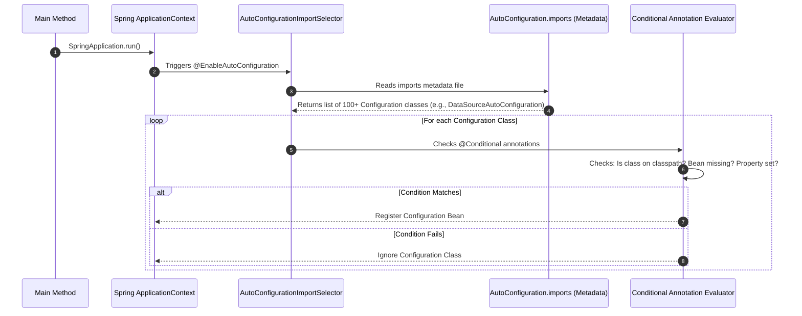

# Spring Boot Auto-Configuration & Custom Starters: The Deep Dive

In interviews, the question *"What happens under the hood when you run a Spring Boot application?"* is the ultimate filter. Everyone knows it "auto-configures" things, but senior engineers (SDE-2/3) must explain the class-loading, conditional annotations, imports metadata, and how to write a custom starter.

Here is the noob-friendly, deeply technical guide to how Spring Boot's bootstrap mechanism actually works.

---

## 💡 The "Noob" Analogy

Imagine building a **Smart Home** (your application).

### Traditional Spring (Manual Setup) 🔌
* You buy a TV, a soundbar, and a streaming stick. 
* You have to manually plug in all the power cords, connect the HDMI cables, match the input settings, and write down a custom remote-control configuration. If you miss one cable (a missing bean or XML config), nothing works.

### Spring Boot (Auto-Configuration) 🪄
* You walk in, plug the devices into the wall, and the **Smart Home Coordinator** (Spring Boot) instantly starts scanning:
  * *"Oh, I see a TV class in the living room. Let me configure the video settings."* (Auto-configuring a Web Server).
  * *"Oh, I see a Soundbar class on the shelf. Let me route the TV audio there automatically."* (Auto-configuring database connection pools).
  * *"Wait, did the homeowner manually define their own custom speaker configuration? Yes? Okay, I will step back and use their settings instead of my defaults."* (Optimistic overriding using `@ConditionalOnMissingBean`).

### A Custom Starter: The "Smart Kitchen Kit" 📦
* You buy a pre-packaged box called `kitchen-coordinator-starter`. 
* The moment you add it to your home inventory, it automatically discovers your smart oven, connects it to your app, and sets up default baking profiles without you writing a single line of connection code.

---

## 🏗️ How `@SpringBootApplication` Works Under the Hood

When you bootstrap your application with `SpringApplication.run(MyApp.class, args)`, you annotate your main class with `@SpringBootApplication`. This is actually a **metaannotation** that wraps three core annotations:

```
                  ┌─────────────────────────────────────────┐
                  │         @SpringBootApplication          │
                  └─────────────────────────────────────────┘
                                       │
                 ┌─────────────────────┼─────────────────────┐
                 ▼                     ▼                     ▼
    ┌─────────────────────────┐  ┌──────────────────────┐  ┌─────────────────────────┐
    │ @SpringBootConfiguration│  │    @ComponentScan    │  │@EnableAutoConfiguration │
    ├─────────────────────────┤  ├──────────────────────┤  ├─────────────────────────┤
    │ Identifies this class   │  │ Scans the package    │  │ The engine: triggers   │
    │ as a source of bean     │  │ of the main class    │  │ Spring Boot's automatic │
    │ definitions (Config).   │  │ for @Component, etc. │  │ configuration imports.  │
    └─────────────────────────┘  └──────────────────────┘  └─────────────────────────┘
```

1. **`@SpringBootConfiguration`**:
   * A wrapper around Spring's standard `@Configuration` annotation. It registers the class as a configuration source in the Application Context.
2. **`@ComponentScan`**:
   * Tells Spring to scan the current package and all sub-packages for beans (`@Component`, `@Service`, `@Repository`, `@RestController`).
   * **Trap**: If you place a controller in a package *above* or *outside* the main class package, Spring won't scan it unless you explicitly define base packages in `@ComponentScan(basePackages = "...")`.
3. **`@EnableAutoConfiguration`**:
   * **The real magic**. This triggers the automatic registration of beans based on what libraries are present on your classpath.

---

## ⚙️ The Bootstrapping and Import Mechanism

How does `@EnableAutoConfiguration` find configuration classes without scanning the entire internet? It uses a strict metadata-driven selection process.

### Step-by-Step Flow:



1. **Triggering the Selector**:
   * `@EnableAutoConfiguration` uses `@Import(AutoConfigurationImportSelector.class)`.
2. **Reading the Metadata file**:
   * **In Spring Boot 3.0+**: The selector looks at `META-INF/spring/org.springframework.boot.autoconfigure.AutoConfiguration.imports` inside all jar files (like `spring-boot-autoconfigure.jar`).
   * **In Spring Boot 2.7 and older**: The selector scanned `META-INF/spring.factories` under the key `org.springframework.boot.autoconfigure.EnableAutoConfiguration`.
   * This file contains a hardcoded list of fully qualified configuration class names (e.g., `org.springframework.boot.autoconfigure.jdbc.DataSourceAutoConfiguration`).
3. **Filtering via Conditional Annotations**:
   * Spring Boot loads all these configuration class names, but it does **not** register them yet. It passes them through the **Conditional Annotation Evaluator**.

---

## 🔍 The `@Conditional` Annotations (Decisions at Runtime)

The core secret to Spring Boot's flexibility is the `@Conditional` family of annotations. These control whether a configuration class or bean is instantiated at runtime.

| Annotation | What it checks | Example Usage |
| :--- | :--- | :--- |
| **`@ConditionalOnClass`** | Is a specific class present on the JVM classpath? | `@ConditionalOnClass(Jedis.class)` -> Only run this config if the Jedis library is imported. |
| **`@ConditionalOnMissingBean`** | Has the user *not* defined their own bean of this type? | `@ConditionalOnMissingBean(ObjectMapper.class)` -> Provide a default JSON mapper *only* if the developer didn't create a custom one. |
| **`@ConditionalOnProperty`** | Is a specific property set in `application.properties`? | `@ConditionalOnProperty(prefix = "payment", name = "mock", havingValue = "true")` |
| **`@ConditionalOnWebApplication`**| Is the application running as a web application? | `@ConditionalOnWebApplication` -> Only spin up Tomcat/Netty if it's a web server. |

### Example Code: How a Default Web Server is Auto-Configured
Here is a simplified look at how Spring Boot auto-configures Tomcat under the hood:

```java
@Configuration(proxyBeanMethods = false)
@ConditionalOnClass({ Servlet.class, Tomcat.class }) // 1. Only run if Tomcat is on the classpath
@ConditionalOnMissingBean(value = ServletWebServerFactory.class, search = SearchStrategy.CURRENT)
public class EmbeddedTomcatAutoConfiguration {

    @Bean
    @ConditionalOnClass(name = "org.apache.catalina.startup.Tomcat")
    public TomcatServletWebServerFactory tomcatServletWebServerFactory() {
        return new TomcatServletWebServerFactory(); // 2. Provide Tomcat factory if no custom factory exists
    }
}
```

---

## 🛠️ How to Create a Custom Spring Boot Starter

A custom starter is useful when you want to package internal library code (like a shared security validator, custom logging filters, or an API gateway connector) for use across multiple microservices.

### Step 1: Create the Project Structure
A standard starter contains two modules (though they can be combined into one for simplicity):
1. **`my-library-autoconfigure`**: Contains the code and configuration classes.
2. **`my-library-spring-boot-starter`**: An empty module containing only a `pom.xml` or `build.gradle` that pulls in the `autoconfigure` module and required third-party dependencies.

---

### Step 2: Write the Auto-Configuration Class
Let's create a custom starter that auto-configures a dummy **Payment Gateway Client**.

```java
package com.example.payment.autoconfigure;

import org.springframework.boot.autoconfigure.condition.ConditionalOnClass;
import org.springframework.boot.autoconfigure.condition.ConditionalOnMissingBean;
import org.springframework.boot.autoconfigure.condition.ConditionalOnProperty;
import org.springframework.boot.context.properties.EnableConfigurationProperties;
import org.springframework.context.annotation.Bean;
import org.springframework.context.annotation.Configuration;

@Configuration
@EnableConfigurationProperties(PaymentProperties.class) // Load configuration properties
@ConditionalOnClass(PaymentClient.class) // Only run if PaymentClient is on classpath
public class PaymentAutoConfiguration {

    private final PaymentProperties properties;

    public PaymentAutoConfiguration(PaymentProperties properties) {
        this.properties = properties;
    }

    @Bean
    @ConditionalOnMissingBean // Allows users to override this bean
    @ConditionalOnProperty(prefix = "payment-gateway", name = "enabled", havingValue = "true", matchIfMissing = true)
    public PaymentClient paymentClient() {
        return new PaymentClient(properties.getApiKey(), properties.getSandboxUrl());
    }
}
```

---

### Step 3: Write the Configuration Properties Class
This allows users to configure the starter via `application.properties`:

```java
package com.example.payment.autoconfigure;

import org.springframework.boot.context.properties.ConfigurationProperties;

@ConfigurationProperties(prefix = "payment-gateway")
public class PaymentProperties {
    private String apiKey;
    private String sandboxUrl = "https://sandbox.api.payment.com"; // Default value
    private boolean enabled = true;

    // Getters and Setters
    public String getApiKey() { return apiKey; }
    public void setApiKey(String apiKey) { this.apiKey = apiKey; }
    public String getSandboxUrl() { return sandboxUrl; }
    public void setSandboxUrl(String sandboxUrl) { this.sandboxUrl = sandboxUrl; }
    public boolean isEnabled() { return enabled; }
    public void setEnabled(boolean enabled) { this.enabled = enabled; }
}
```

---

### Step 4: Register the Configuration Class (Metadata Setup)
For Spring Boot to discover your configuration, you must register it.

Create the file:
`src/main/resources/META-INF/spring/org.springframework.boot.autoconfigure.AutoConfiguration.imports`

Add the fully qualified name of your auto-configuration class to this file:
```properties
com.example.payment.autoconfigure.PaymentAutoConfiguration
```

*(Note: If you are using Spring Boot 2.7 or older, place it in `src/main/resources/META-INF/spring.factories` under `org.springframework.boot.autoconfigure.EnableAutoConfiguration=com.example.payment.autoconfigure.PaymentAutoConfiguration`)*

---

### Step 5: How a Client Uses Your Starter
A developer in another microservice simply adds your starter dependency to their `pom.xml`:

```xml
<dependency>
    <groupId>com.example</groupId>
    <artifactId>my-library-spring-boot-starter</artifactId>
    <version>1.0.0</version>
</dependency>
```

And configures it in their `application.properties`:
```properties
payment-gateway.api-key=secret-key-123
```

Now, they can immediately inject `PaymentClient` into their services without writing any configuration!
```java
@Service
public class CheckoutService {
    @Autowired
    private PaymentClient paymentClient; // Works automatically!
}
```

---

## 🙋‍♂️ Interview Angles & Pitfalls

### Q: What is the purpose of `@ConditionalOnMissingBean`? Why is it crucial for starters?
**A:** `@ConditionalOnMissingBean` tells the Spring Container: *"Only register this bean if the developer has not registered their own bean of this type."* 
This is crucial for starters because it allows developers to easily override default behaviors. For example, if a starter auto-configures a default `RestTemplate` bean, but a specific microservice wants to use a customized `RestTemplate` with custom timeouts, the developer can declare their own `@Bean RestTemplate`. The starter's bean registration will be ignored, preventing duplicate bean exceptions and allowing customization.

### Q: Why did Spring Boot 3.0 move away from `spring.factories` to `AutoConfiguration.imports`?
**A:** Prior to 3.0, `spring.factories` was used for multiple purposes: loading auto-configurations, registering application listeners, custom initializers, etc. This made the file complex to parse and slow down boot-up times.
Moving auto-configuration classes to `AutoConfiguration.imports` separates concern. It is a simple list of classes, allowing Spring Boot to process them faster and support **GraalVM Native Image compilation** optimizations more effectively by making dynamic configuration imports easier to analyze statically.

### Q: What is the difference between `@Configuration(proxyBeanMethods = false)` and `proxyBeanMethods = true` (default)?
**A:** 
* `proxyBeanMethods = true`: Spring wraps the configuration class in a **CGLIB proxy**. If one `@Bean` method calls another `@Bean` method inside the configuration class, the proxy intercepts the call and returns the existing singleton bean rather than instantiating a new one. This ensures singleton scoping but adds startup and runtime overhead.
* `proxyBeanMethods = false`: Spring executes the methods as standard Java methods without proxy interception. This speeds up startup time and reduces memory footprint. Spring Boot uses `proxyBeanMethods = false` for almost all of its built-in auto-configurations because it avoids proxy overhead. (Starters should always use `false` unless bean-to-bean direct invocation is strictly necessary).
