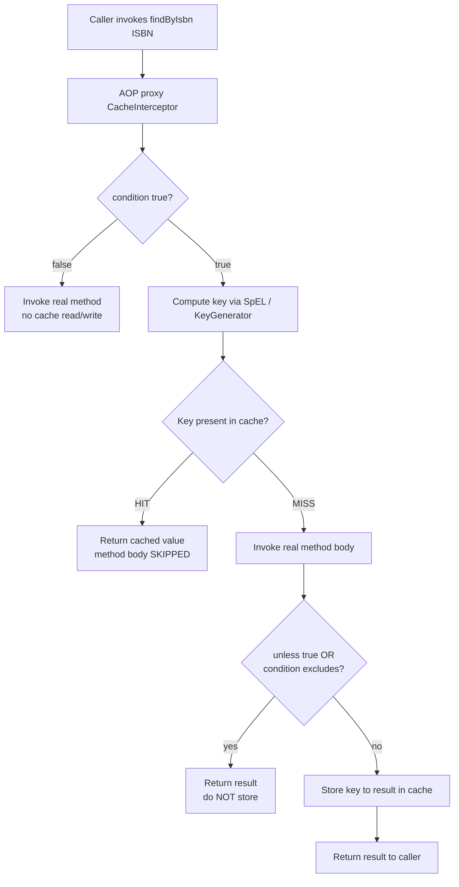

# Spring Boot Caching Abstraction

## 1. What

Spring's caching abstraction (`org.springframework.cache`) is a **provider-agnostic, declarative caching layer** that sits between your application code and whatever cache store you plug in underneath. You annotate methods (`@Cacheable`, `@CachePut`, `@CacheEvict`), and Spring transparently intercepts calls to skip, populate, or invalidate cached results. Crucially, you write the *same* annotations whether the backing store is a `ConcurrentHashMap`, Caffeine, Redis, Ehcache, or Hazelcast — swapping providers is a configuration/dependency change, **not a code change**.

The abstraction has two SPI (Service Provider Interface) types you must know:

| SPI Type | Role |
| --- | --- |
| `org.springframework.cache.CacheManager` | Factory/registry that resolves named caches (e.g. `books`, `users`) |
| `org.springframework.cache.Cache` | A single named cache — a thin wrapper over the provider's native store, exposing `get`, `put`, `evict`, `clear` |

You enable it with `@EnableCaching` on a `@Configuration` class (or the main app class). **This is the single most important structural fact:** `@EnableCaching` registers a `BeanPostProcessor` that wraps your caching-annotated beans in an **AOP proxy**. The caching logic lives entirely in that proxy's interceptor (`CacheInterceptor`) — the same proxy-based mechanism used by `@Transactional` and `@Async`. Every behavioral quirk below (especially the self-invocation pitfall in §3.8) flows from this fact.

> [!IMPORTANT]
> **This is NOT Hibernate's second-level (L2) cache.** They operate at different layers and are frequently confused in interviews:
> - **Spring cache abstraction** — caches the **return value of a method** keyed by its arguments. It knows nothing about entities, the persistence context, or SQL. It's a generic memoization layer for *any* Spring bean method (service, repository, or otherwise).
> - **Hibernate L2 cache** — caches **entities, collections, and query results by ID** inside the ORM, shared across `Session`/`EntityManager` instances. It participates in the persistence lifecycle (dirty checking, flushing, entity identity).
>
> A `@Cacheable` service method that returns a `Book` caches *that serialized object graph under that key*; it does not make Hibernate skip a DB round-trip on `session.get(Book.class, id)`. Use L2 for entity-level DB offloading; use the Spring abstraction for method-result memoization (aggregates, computed results, remote API responses).

---

## 2. Why

- **Offload expensive work** — DB queries, remote HTTP calls, heavy computation. A cache hit turns a 200 ms round-trip into a sub-millisecond map lookup.
- **Declarative, non-invasive** — caching is a cross-cutting concern; annotations keep it out of business logic. No hand-rolled `if (map.containsKey(...))` boilerplate scattered across services.
- **Portability** — the same annotated code runs against an in-JVM Caffeine cache in one service and a distributed Redis cluster in another. Local dev can use the trivial in-memory manager; prod swaps to Redis via one property.
- **Correctness of the cache-aside pattern** — Spring implements **cache-aside** (lazy-loading) semantics correctly and consistently: check cache → on miss invoke method → store result. Doing this by hand invites subtle bugs (caching nulls, race conditions, forgetting eviction on update).

> [!WARNING]
> Caching is a **correctness-vs-freshness trade-off**, not free money. Every cache introduces the possibility of **stale reads** and the hard problem of **invalidation**. Do not cache reflexively. Cache data that is (a) read far more than written, (b) tolerant of some staleness, and (c) expensive to produce. Do **not** blindly cache highly volatile data or per-user-sensitive data (see §3.9).

---

## 3. How

### 3.1 Setup

```xml
<!-- pom.xml -->
<dependency>
    <groupId>org.springframework.boot</groupId>
    <artifactId>spring-boot-starter-cache</artifactId>
</dependency>
<!-- pick a provider -->
<dependency>
    <groupId>com.github.ben-manes.caffeine</groupId>
    <artifactId>caffeine</artifactId>
</dependency>
<!-- or, for distributed: spring-boot-starter-data-redis -->
```

```java
@Configuration
@EnableCaching // registers the CacheInterceptor AOP proxy infrastructure
public class CacheConfig {
    // Spring Boot auto-configures a CacheManager from the classpath + properties.
    // Only define a bean here when you need custom behavior (see 3.6).
}
```

### 3.2 `@Cacheable` — read-through / cache-aside

Caches the method's return value, keyed by its arguments. **On a hit, the method body is never executed** — the cached value is returned directly by the proxy.

```java
@Service
public class BookService {

    @Cacheable(value = "books", key = "#isbn")
    public Book findByIsbn(String isbn) {
        // Only runs on a cache MISS. Simulates an expensive DB / remote call.
        return slowRepositoryLookup(isbn);
    }
}
```

- `value` (alias `cacheNames`) — the logical cache name(s); resolved via the `CacheManager`.
- `key` — a **SpEL** expression. Defaults to the single argument, or a `SimpleKey` composed of all arguments (see §3.7).
- `condition` — SpEL evaluated on the **arguments, BEFORE invocation**. If false, caching is bypassed entirely (method runs, result not cached, cache not consulted).
- `unless` — SpEL evaluated on the **result, AFTER invocation** (result exposed as `#result`). If true, the result is *not stored*.
- `sync = true` — serializes concurrent misses for the same key through a **single loader** (anti-stampede; see §3.9).

```java
@Cacheable(
    value = "books",
    key = "#isbn",
    condition = "#isbn.length() == 13",   // only cache valid ISBN-13s (checked pre-call)
    unless = "#result == null",            // never cache a null/absent result (checked post-call)
    sync = true                            // one thread loads on miss; others wait
)
public Book findByIsbn(String isbn) { ... }
```

> [!IMPORTANT]
> **`condition` vs `unless` — the classic gotcha:**
> - `condition` fires **before** the method runs and only sees the **arguments**. Use it to decide *based on inputs* whether caching applies at all.
> - `unless` fires **after** the method runs and can see `#result`. Use it to *veto storing* specific outputs (e.g. nulls, empty lists).
> - Because `unless` runs post-invocation, it cannot prevent the method from being called — it only prevents the store. `condition = false` bypasses the whole cache lookup + store.

#### 3.2.1 The @Cacheable lookup flow



### 3.3 `@CachePut` — write-through update

**Always executes the method** and then stores the (fresh) return value into the cache. Contrast with `@Cacheable`, which *may skip* the method on a hit. Use `@CachePut` for update operations where you want the cache refreshed with the new state.

```java
@CachePut(value = "books", key = "#book.isbn")
public Book update(Book book) {
    // ALWAYS runs — persists the change...
    Book saved = repository.save(book);
    // ...and the returned value overwrites the cache entry under key #book.isbn.
    return saved;
}
```

> [!WARNING]
> Never put `@Cacheable` and `@CachePut` on the *same method* expecting "cache but also refresh." Their semantics conflict (one may skip the body, the other always runs) and the method would be invoked in ways you don't intend. Pick one per method based on intent: read → `@Cacheable`, write/refresh → `@CachePut`.

### 3.4 `@CacheEvict` — invalidation

Removes entries. Essential for keeping the cache consistent with the source of truth after deletes/updates.

```java
// Evict a single key
@CacheEvict(value = "books", key = "#isbn")
public void delete(String isbn) { repository.deleteByIsbn(isbn); }

// Evict the entire "books" cache
@CacheEvict(value = "books", allEntries = true)
public void reloadCatalog() { ... }

// Evict BEFORE the method runs (default is AFTER, on successful return)
@CacheEvict(value = "books", key = "#isbn", beforeInvocation = true)
public void riskyDelete(String isbn) { ... }
```

- `allEntries = true` — clears the whole named cache (ignores `key`). Cheap for local, but on Redis with a keyspace scan it can be costly.
- `beforeInvocation` — default `false` means eviction happens **only if the method returns without throwing**. Set `true` to evict *regardless* of success — useful when a failure shouldn't leave stale data cached, but risky because you evict even on a rollback.

### 3.5 `@Caching` — combining annotations

When you need multiple cache operations on one method (e.g. evict from two caches, or put + evict), compose them:

```java
@Caching(
    put    = { @CachePut(value = "books",       key = "#book.isbn") },
    evict  = { @CacheEvict(value = "booksByAuthor", key = "#book.author"),
               @CacheEvict(value = "bestsellers",   allEntries = true) }
)
public Book save(Book book) { return repository.save(book); }
```

`@CacheConfig` (class-level) factors out shared attributes like `cacheNames`/`keyGenerator` so you don't repeat `value = "books"` on every method.

### 3.6 `CacheManager` implementations

| Implementation | Scope | Eviction / TTL | When to use |
| --- | --- | --- | --- |
| `ConcurrentMapCacheManager` | In-JVM `ConcurrentHashMap` | **None — unbounded, no TTL** | Default fallback / dev & tests ONLY |
| `CaffeineCacheManager` | In-JVM (per-node) | Size-bound + TTL (expireAfterWrite/Access), W-TinyLFU | Best **local** cache; high-throughput, low-latency |
| `RedisCacheManager` | **Distributed** (out-of-process) | Per-cache TTL, LRU/LFU at server | **Shared** cache across many instances |
| `JCacheCacheManager` / Ehcache / Hazelcast | Varies | Varies | JSR-107 standard / existing infra |

> [!WARNING]
> `ConcurrentMapCacheManager` is the **default** when no other provider is on the classpath. It is **unbounded and has no TTL or eviction** — entries live forever. In production this is a **memory leak / OOM waiting to happen**. Never ship it as your real cache; always configure Caffeine or Redis explicitly.

**Caffeine (local) config via `application.yml`:**

```yaml
spring:
  cache:
    type: caffeine
    cache-names: books,users          # pre-create these caches
    caffeine:
      spec: maximumSize=10000,expireAfterWrite=5m,recordStats
```

For per-cache specs (different TTLs per cache), define a `CaffeineCacheManager` bean and register each cache with its own `Caffeine` builder.

**Redis (distributed) config:**

```yaml
spring:
  cache:
    type: redis
    redis:
      time-to-live: 600000        # 10 min TTL (ms), applied to all entries
      cache-null-values: false    # don't store nulls (see 3.9)
      key-prefix: "app::"
      use-key-prefix: true
```

```java
@Bean
public RedisCacheManager cacheManager(RedisConnectionFactory cf) {
    RedisCacheConfiguration defaults = RedisCacheConfiguration.defaultCacheConfig()
        .entryTtl(Duration.ofMinutes(10))
        .disableCachingNullValues()
        .serializeValuesWith(RedisSerializationContext.SerializationPair
            .fromSerializer(new GenericJackson2JsonRedisSerializer())); // JSON, human-readable

    // Per-cache overrides: "books" lives longer than the default
    Map<String, RedisCacheConfiguration> perCache = Map.of(
        "books", defaults.entryTtl(Duration.ofHours(1)));

    return RedisCacheManager.builder(cf)
        .cacheDefaults(defaults)
        .withInitialCacheConfigurations(perCache)
        .build();
}
```

### 3.7 Key generation

The cache key must uniquely identify a method result.

- **No custom `key`:** Spring uses the default `SimpleKeyGenerator`:
  - 0 args → `SimpleKey.EMPTY`
  - 1 arg → that argument *itself* is the key
  - 2+ args → a `SimpleKey` wrapping all arguments (its `equals`/`hashCode` derive from the args)
- **Custom `key` SpEL:** explicit and preferred for clarity — `key = "#user.id + ':' + #locale"`, `key = "#root.methodName + #p0"`. SpEL exposes `#argName`, `#pN`, `#root.args`, `#root.target`, `#result` (in `unless`/`@CachePut`).
- **Custom `KeyGenerator` bean:** for reusable, non-trivial key logic:

```java
@Component("weightedKeyGen")
public class TenantKeyGenerator implements KeyGenerator {
    @Override
    public Object generate(Object target, Method method, Object... params) {
        return TenantContext.current() + ":" + Arrays.deepToString(params);
    }
}
// usage: @Cacheable(value="books", keyGenerator="weightedKeyGen")
```

> [!IMPORTANT]
> Keys must have **stable, correct `equals()` and `hashCode()`**. If you key by a mutable domain object whose `hashCode` changes after insertion, or which lacks `equals`/`hashCode` (identity-based), lookups will miss or collide silently. Prefer immutable, value-based keys (IDs, strings). For Redis, keys are serialized to strings — `toString()` quality matters too.

### 3.8 THE self-invocation pitfall (proxy-based caching)

Because `@EnableCaching` works through an **AOP proxy**, caching only applies when the call **crosses the proxy boundary** — i.e. an *external* caller invokes the bean. A call from one method of a bean to another method of the **same bean** goes through `this`, **bypassing the proxy**, so `@Cacheable`/`@CacheEvict` on the target is **silently ignored**.

```java
@Service
public class BookService {

    // BROKEN: getAll() calls findByIsbn() via `this` — the proxy is bypassed,
    // so @Cacheable NEVER fires for these internal calls.
    public List<Book> getAll(List<String> isbns) {
        return isbns.stream()
                    .map(this::findByIsbn)   // internal self-call -> no caching!
                    .toList();
    }

    @Cacheable(value = "books", key = "#isbn")
    public Book findByIsbn(String isbn) { return slowLookup(isbn); }
}
```

**Fixes:**

```java
// FIX 1: self-injection of the proxy (Spring injects the proxied reference)
@Service
public class BookService {
    @Autowired @Lazy
    private BookService self;   // the PROXY, not `this`

    public List<Book> getAll(List<String> isbns) {
        return isbns.stream().map(self::findByIsbn).toList(); // crosses proxy -> cached
    }

    @Cacheable(value = "books", key = "#isbn")
    public Book findByIsbn(String isbn) { return slowLookup(isbn); }
}

// FIX 2 (cleaner): move the cached method to a SEPARATE bean.
// getAll() lives in an orchestrator that injects BookLookupService,
// so every findByIsbn() call naturally crosses a proxy boundary.
```

> [!WARNING]
> This is the *exact same trap* as self-invocation of `@Transactional` and `@Async` methods — all three are proxy-driven. If you understand one, you understand all three. See the repo's AOP / Spring proxy note for the underlying mechanics (`@Transactional` self-invocation is documented there). Rule of thumb: **an annotation only "works" when the method is called from another bean.**

### 3.9 Cache patterns & pitfalls

**Pattern Spring implements — cache-aside (lazy):** the application is responsible for reading the cache, loading on miss, and populating it. Spring's annotations *are* cache-aside done declaratively. It does **not** implement write-behind or read-through-with-a-loader in the CDN sense; `@CachePut` is the closest to write-through.

**Cache stampede (thundering herd)** — when a hot key expires, N concurrent requests all miss and all hit the DB simultaneously.
- *Local (Caffeine):* `@Cacheable(sync = true)` — Spring guarantees a **single loader** per key; other threads block and receive the loaded value. Note `sync=true` is mutually exclusive with `unless`/multiple caches and is a *per-node* guarantee only.
- *Distributed (Redis):* `sync=true` does **not** coordinate across JVMs. You need a **distributed lock** (e.g. Redis `SET NX` / Redisson) or request coalescing, plus staggered TTLs / jitter to avoid synchronized expiry.

**Caching `null`** — a `@Cacheable` method returning `null` will, by default, **cache the null** (this is intentional — it prevents repeated lookups for genuinely-absent keys, i.e. negative caching). But if `null` means "not loaded yet / transient error," you've poisoned the cache. Control it:
- `unless = "#result == null"` on the method, or
- Redis: `cache-null-values: false` / `.disableCachingNullValues()`.
Decide deliberately: negative caching (keep nulls, short TTL) vs never-cache-null.

**Serialization gotchas (Redis)** — values cross the process boundary, so they must serialize:
- Default JDK serialization requires `Serializable` and is brittle across class changes.
- Prefer `GenericJackson2JsonRedisSerializer` (JSON, readable, tolerant). It embeds type info (`@class`) — **renaming/moving a cached class or changing its package breaks deserialization** of old entries. Version your caches or flush on incompatible model changes.
- Beware `LocalDateTime`/Java Time needing the JSR-310 module; polymorphic fields and generics can trip type resolution.

**Local vs distributed trade-offs:**

| Dimension | Caffeine (local, in-JVM) | Redis (distributed) |
| --- | --- | --- |
| Latency | Nanoseconds (heap access) | ~ms (network round-trip + serialize) |
| Consistency across nodes | **None** — each node has its own copy; a `@CacheEvict` on node A does NOT clear node B | Shared — one evict is seen by all |
| Capacity | Bounded by heap | Bounded by Redis cluster memory |
| Serialization | None (live objects) | Required (CPU + gotchas above) |
| Failure blast radius | Isolated per node | Shared dependency; needs failover |
| Best for | Hot, small, node-tolerant-of-staleness data | Cross-instance consistency, large/shared datasets |

A common senior answer is a **two-tier (L1/L2) cache**: Caffeine as L1 (fast, per-node) fronting Redis as L2 (shared). Spring doesn't ship this out of the box; it requires a composite `CacheManager` or a dedicated library.

> [!WARNING]
> **Do not blindly cache:**
> - **Per-user / security-sensitive data** without keying by user/tenant — a bad key (`@Cacheable("profile")` with no `key`) can leak one user's data to another. Always include the principal/tenant in the key.
> - **Highly volatile data** (live prices, inventory counts) where staleness is unacceptable — the cache hit ratio won't justify the correctness risk.
> - **Large object graphs on Redis** — serialization cost can exceed the DB call you're trying to avoid.

---

## 4. Interview Angles

- **Q: How does Spring's caching abstraction actually work under the hood?**
  `@EnableCaching` registers a `BeanPostProcessor` that wraps caching-annotated beans in an **AOP proxy** whose `CacheInterceptor` runs the cache-aside logic (resolve `CacheManager` → compute key → check `Cache` → invoke/skip method → store). Your code stays clean; caching is a cross-cutting concern applied via advice. It's provider-agnostic through the `CacheManager`/`Cache` SPI.

- **Q: Difference between Spring's cache abstraction and Hibernate's second-level cache?**
  Different layers. Spring caches **method return values keyed by arguments** for *any* bean — it's generic memoization, ORM-unaware. Hibernate L2 caches **entities/collections/queries by ID inside the persistence layer**, participating in the session lifecycle. Spring cache does not make `EntityManager.find` skip the DB; L2 does. Use L2 for entity DB offloading, Spring cache for aggregate/computed/remote results.

- **Q: `@Cacheable` vs `@CachePut`?**
  `@Cacheable` *may skip* the method body on a hit (read/cache-aside). `@CachePut` **always** executes the method and then updates the cache with the result (write-through refresh). Reads → `@Cacheable`; updates → `@CachePut`. Don't stack both on one method.

- **Q: `condition` vs `unless`?**
  `condition` is evaluated **before** invocation on the **arguments** and gates whether caching applies at all (no lookup, no store if false). `unless` is evaluated **after** invocation and can inspect `#result`, vetoing only the *store* (the method still ran). Classic use: `unless = "#result == null"` to avoid caching nulls.

- **Q: Why doesn't caching work when I call the method from within the same class?**
  Self-invocation. Caching is proxy-based; an internal `this.method()` call bypasses the proxy, so the interceptor never runs. Fixes: self-inject the proxy (`@Autowired @Lazy self`), or extract the cached method into a separate bean. Same root cause as `@Transactional`/`@Async` self-invocation.

- **Q: What's cache stampede and how do you prevent it in Spring?**
  Many concurrent requests miss a just-expired hot key and all hit the backend. Locally: `@Cacheable(sync = true)` forces a single loader per key (per-JVM). Distributed (Redis): `sync=true` doesn't span JVMs — use a distributed lock (Redisson / `SET NX`), request coalescing, and TTL jitter to avoid synchronized expiry.

- **Q: How do you invalidate correctly on updates/deletes?**
  `@CacheEvict(key=...)` on the mutating method (or `@CachePut` to refresh instead of evict). Use `@Caching` to evict from multiple derived caches (e.g. `booksByAuthor`, `bestsellers`). Mind `beforeInvocation` — default evicts only on success; set `true` to evict regardless (careful with rollbacks). Cross-node: local caches won't see each other's evictions — use Redis or a broadcast/invalidation channel.

- **Q: Caffeine vs Redis — when do you pick which?**
  Caffeine = in-JVM, nanosecond latency, no serialization, but **per-node and inconsistent across instances**. Redis = shared/consistent across all nodes, TTL centrally, but network + serialization latency and a shared dependency to make HA. Small hot node-tolerant data → Caffeine; cross-instance consistency or large shared data → Redis; both → two-tier L1/L2.

- **Q: What's wrong with the default `CacheManager`?**
  `ConcurrentMapCacheManager` is unbounded with no TTL/eviction — a memory leak in prod. It's a dev-only fallback. Always configure Caffeine (size + `expireAfterWrite`) or Redis (`entryTtl`) explicitly.

- **Q: Redis serialization pitfalls?**
  Default JDK serialization needs `Serializable` and breaks across class changes. Prefer `GenericJackson2JsonRedisSerializer`, but it embeds `@class` type info — renaming/moving a cached type breaks old entries; register JSR-310 for Java Time. Version caches or flush on incompatible model changes. Disable null caching if nulls are transient.

- **Q: How is the cache key computed by default, and why do `equals`/`hashCode` matter?**
  No args → `SimpleKey.EMPTY`; one arg → the arg itself; multiple → a `SimpleKey` over all args. The key's `equals`/`hashCode` decide hits/misses, so mutable or identity-based keys cause silent misses/collisions. Prefer immutable value keys (IDs/strings) or an explicit SpEL/`KeyGenerator`. Always include user/tenant for per-user data to avoid cross-tenant leaks.
