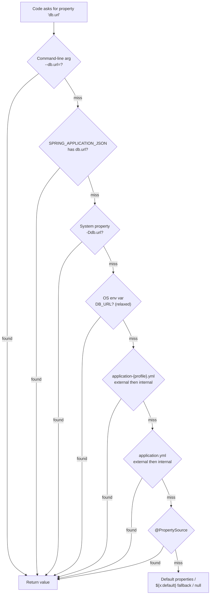

# Externalized Configuration & Profiles

## 1. What

**Externalized configuration** is Spring Boot's mechanism for keeping configuration
*outside* the compiled artifact so the **same immutable JAR** runs unchanged in dev,
staging, and prod — the environment supplies the differences. This is the
[12-factor](https://12factor.net/config) "Config" principle: build once, deploy
everywhere, inject config at runtime.

The engine underneath is the **`Environment`** abstraction (`ConfigurableEnvironment`),
which holds an **ordered list of `PropertySource`s**. A `PropertySource` is just a
named key→value bag (a `Map`, the OS env, a parsed YAML doc, CLI args, …). When any
code — `@Value`, `@ConfigurationProperties`, `environment.getProperty("x")` — asks for
a property, Spring walks the sources **in order and returns the first hit**. Order is
therefore *everything*: it defines precedence.

```java
@Component
class Diagnostics {
    Diagnostics(Environment env) {                 // Environment is auto-injected
        String url = env.getProperty("db.url");    // resolved across all PropertySources
        // enumerate sources highest-precedence-first (debugging trick)
        ((ConfigurableEnvironment) env).getPropertySources()
                .forEach(ps -> System.out.println(ps.getName()));
    }
}
```

**Profiles** are named logical groupings (`dev`, `prod`, `k8s`) that let you activate a
*subset* of beans and property files for a given environment.

---

## 2. Why

| Problem without externalization | What externalized config gives you |
| --- | --- |
| Rebuild per environment; drift between built binaries | One artifact, config injected at deploy time |
| Secrets hard-coded in source / committed to git | Secrets come from env vars / Vault, never the JAR |
| Env switches scattered as `if (prod) {...}` | Declarative `@Profile` beans + per-profile files |
| No type safety; typos silently return `null` | `@ConfigurationProperties` + `@Validated` fail fast at boot |
| Ops can't tune a running deployment | Override any key via env var / CLI arg — no recompile |

> [!IMPORTANT]
> The core promise: **binary immutability**. If the same `app.jar` gives different
> behavior in prod vs staging *only* because of externalized config, you have real
> reproducibility and can promote a tested artifact straight through the pipeline.

---

## 3. How

### 3.1 Where config comes from — and precedence

Spring Boot loads *many* `PropertySource`s at startup and orders them. **Later in the
list = lower precedence; earlier = higher.** A property set in a higher source
**overrides** the same key in a lower one. Abbreviated, highest-wins ordering:

| # | Source | Notes |
| --- | --- | --- |
| 1 | Devtools `~/.config/spring-boot` | only when devtools active |
| 2 | `@TestPropertySource` / test `properties` | tests only |
| 3 | **Command-line arguments** | `--server.port=9000` |
| 4 | **`SPRING_APPLICATION_JSON`** | inline JSON in an env var / sysprop |
| 5 | `ServletConfig` / `ServletContext` init params | web only |
| 6 | JNDI (`java:comp/env`) | legacy app servers |
| 7 | **Java System properties** (`-Dkey=val`) | `System.getProperties()` |
| 8 | **OS environment variables** | relaxed-binding applies |
| 9 | **Profile-specific** `application-{profile}.{properties,yml}` | *external* wins over *internal* |
| 10 | **`application.{properties,yml}`** (non-profile) | *external* wins over *internal* |
| 11 | `@PropertySource` on `@Configuration` | loaded late — cannot override files |
| 12 | `SpringApplication.setDefaultProperties(...)` | lowest — true defaults |

Two orthogonal rules interleave inside 9/10:

- **Profile-specific beats non-profile** — `application-prod.yml` overrides `application.yml`.
- **External beats internal** — a file next to the JAR (`./config/`, `./`) overrides
  the same file packaged *inside* the JAR (`classpath:/`, `classpath:/config/`).



**Config Data files (Boot 2.4+).** The loading of `application.*` and
`application-{profile}.*` is handled by the *Config Data* API. Two things a senior
should know:

- **`spring.config.import`** pulls in extra config *documents* (other files, Vault,
  Consul, K8s ConfigMaps). Imported docs are added **after** the importing document, so
  they do **not** override the file that imported them — the importer wins.

  ```yaml
  spring:
    config:
      import:
        - "optional:file:./secrets.properties"   # 'optional:' => no failure if absent
        - "configtree:/etc/config/"              # each file = one property (K8s pattern)
  ```

- **Document ordering** within a single multi-doc YAML: later documents override
  earlier ones. Location ordering: `spring.config.location` / `spring.config.additional-location`
  control *where* Boot searches (default search set:
  `classpath:/`, `classpath:/config/`, `file:./`, `file:./config/`, `file:./config/*/`).

### 3.2 `@Value` — single-key injection

```java
@Component
class MailClient {
    @Value("${mail.host}")               // fails at startup if missing (no default)
    private String host;

    @Value("${mail.port:25}")            // ':' supplies a default -> 25 if unset
    private int port;

    @Value("${mail.recipients}")         // "a@x.com,b@x.com" -> List<String> (comma split)
    private List<String> recipients;

    @Value("#{systemProperties['user.timezone'] ?: 'UTC'}")  // SpEL expression
    private String tz;

    @Value("#{'${feature.retries}' * 2}")   // SpEL over a placeholder
    private int doubleRetries;
}
```

**Limits of `@Value`:** no **relaxed binding** (the key must match exactly — env-var
form does still resolve because that happens at the `Environment` layer, but there's no
kebab↔camel normalization on your side), no **type-safe validation** of a group, config
is **scattered** across many fields/classes, and no IDE metadata. Good for one-off
values; poor for structured config.

### 3.3 `@ConfigurationProperties` — type-safe group binding

Binds a whole *tree* of properties (a prefix) onto a POJO. Prefer this for anything with
more than a couple of related keys.

```yaml
# application.yml
app:
  mail:
    host: smtp.corp.io
    port: 587
    from-address: no-reply@corp.io        # kebab-case
    retry:
      max-attempts: 3
      backoff: 2s                          # Duration -> parsed to 2 seconds
    recipients:                            # List
      - ops@corp.io
      - sre@corp.io
    headers:                               # Map<String,String>
      X-Env: prod
```

**Constructor binding via a record** (immutable, idiomatic in Boot 3):

```java
@ConfigurationProperties(prefix = "app.mail")
@Validated
public record MailProps(
        @NotBlank String host,
        @Min(1) @Max(65535) int port,
        @Email String fromAddress,               // relaxed: from-address -> fromAddress
        Retry retry,
        List<String> recipients,
        Map<String, String> headers) {

    public record Retry(int maxAttempts, Duration backoff) {}
    // record => constructor binding automatically; no setters, no @ConstructorBinding needed
}
```

> [!NOTE]
> **History:** in Boot 2.2–2.6 immutable/constructor binding required the
> `@ConstructorBinding` annotation *on the type or constructor*. Since **Boot 3.0**, if a
> `@ConfigurationProperties` class (or record) has a **single non-default constructor**,
> constructor binding is inferred — `@ConstructorBinding` is only needed to disambiguate
> when there are multiple constructors, and it is only valid **on a constructor**, not
> the type. For classic **JavaBean/setter binding** you need a no-arg constructor +
> **setters** (a common "why is my field null?" gotcha).

**Enabling** the class — pick one:

```java
// Option A: register a specific properties type
@Configuration
@EnableConfigurationProperties(MailProps.class)
class MailConfig { }

// Option B: scan a whole package (Boot 3, on the main class)
@SpringBootApplication
@ConfigurationPropertiesScan("com.corp.app")   // picks up any @ConfigurationProperties
class Application { }
```

#### Relaxed binding

A single canonical property (`app.mail.from-address`) can be supplied in **many forms**;
Boot normalizes them. Which forms are legal depends on the *source*:

| Form | Example | Allowed in |
| --- | --- | --- |
| Kebab-case (canonical) | `app.mail.from-address` | `.yml` / `.properties` (recommended) |
| Camel-case | `app.mail.fromAddress` | properties, YAML |
| Underscore | `app.mail.from_address` | properties, YAML |
| Upper env-var | `APP_MAIL_FROMADDRESS` | **OS environment variables only** |

> [!IMPORTANT]
> For **environment variables**, replace dots and dashes with `_` and uppercase:
> `app.mail.from-address` → `APP_MAIL_FROMADDRESS`. This is why the classic interview
> answer is "`MY_APP_NAME` binds to `my.app.name`." Relaxed binding is what makes
> containerized/K8s config-via-env-var work seamlessly. Index notation for lists uses
> underscores: `APP_MAIL_RECIPIENTS_0=ops@corp.io`.

#### Validation

Add `@Validated` to the properties class and JSR-380 (Jakarta Bean Validation)
constraints to fields; a violation throws at **startup**, not at first use — fail fast.
Requires a validator on the classpath (`spring-boot-starter-validation`).

### 3.4 `@Value` vs `@ConfigurationProperties`

| Feature | `@Value("${...}")` | `@ConfigurationProperties` |
| --- | --- | --- |
| Relaxed binding | No (exact key) | **Yes** (kebab/camel/underscore/env) |
| Nested objects / trees | No | **Yes** |
| `List` / `Map` / `Duration` / `DataSize` | Limited | **Yes** (rich conversion) |
| Type safety | Weak (per field) | **Strong** (whole POJO) |
| Bean-validation (`@Validated`) | No | **Yes** |
| SpEL (`#{...}`) | **Yes** | No |
| Meta-data / IDE autocomplete | No | **Yes** (with processor) |
| Best for | one or two ad-hoc values | grouped, structured config |

**Recommendation:** default to `@ConfigurationProperties` for any cohesive block of
config; reach for `@Value` only for a single value or when you genuinely need SpEL.

### 3.5 Profiles

```java
@Service
@Profile("prod")                      // bean only created when 'prod' is active
class SesEmailSender implements EmailSender { }

@Service
@Profile("!prod")                     // negation: any profile except prod
class LoggingEmailSender implements EmailSender { }

@Configuration
@Profile({"prod & aws"})              // expression: AND / OR / NOT supported
class AwsProdConfig { }
```

**Activation** — precedence applies here too (CLI > env var > file):

```bash
java -jar app.jar --spring.profiles.active=prod,aws   # CLI
export SPRING_PROFILES_ACTIVE=prod,aws                 # env var (relaxed binding)
```

```yaml
# application.yml
spring:
  profiles:
    active: dev            # active profile(s)
    default: local         # used ONLY when NO active profile is set
    group:                 # profile groups: activating 'prod' pulls in the members
      prod:
        - proddb
        - monitoring
      dev:
        - devdb
```

**Per-profile files:** `application-prod.yml` is loaded *and layered on top of*
`application.yml` when `prod` is active (it doesn't replace it — it overrides matching
keys and adds new ones).

**Multi-document YAML** — one file, several docs separated by `---`, each guarded:

```yaml
# application.yml
spring:
  application:
    name: orders
---
spring:
  config:
    activate:
      on-profile: dev            # this document applies only under 'dev'
server:
  port: 8080
---
spring:
  config:
    activate:
      on-profile: prod
server:
  port: 80
```

> [!WARNING]
> `spring.profiles.active` (and `spring.profiles.group`) **cannot be set inside a
> profile-specific document** or a profile-specific file — activating a profile from
> within an already-profile-activated document is a chicken-and-egg situation and Boot
> throws `InvalidConfigDataPropertyException` at startup. Set active profiles only in
> the *non-profile* portion of config, or (better) externally via env/CLI.

### 3.6 Secrets & sensitive config

> [!WARNING]
> **Never commit secrets** (DB passwords, API keys, tokens) to `application.yml` in git.
> Once pushed, treat them as compromised and rotate.

Options, roughly increasing robustness:

- **Environment variables / CLI** — fine for containers; visible in process listing &
  `/proc`, so acceptable but not ideal for high-security secrets.
- **Cloud secret managers** — AWS Secrets Manager / SSM Parameter Store, GCP Secret
  Manager, Azure Key Vault. Pull at boot (often via `spring.config.import`).
- **HashiCorp Vault** — dynamic, leased, rotatable secrets via `spring-cloud-vault`
  (`spring.config.import: vault://`).
- **Spring Cloud Config Server** — centralized config (often git-backed) with
  `{cipher}`-encrypted values; clients fetch on startup / on `/actuator/refresh`.
- **Kubernetes** — Secrets mounted as env vars or files; `configtree:` import maps a
  mounted directory to properties.

**Don't leak them at runtime:** the actuator `/env` and `/configprops` endpoints
**mask** keys matching `password`, `secret`, `key`, `token`, `credentials`, `vcap_services`,
`uri`, etc. Tune the list:

```yaml
management:
  endpoint:
    env:
      keys-to-sanitize: password,secret,key,token,.*credential.*,my-custom-secret
    configprops:
      show-values: never          # never expose actual @ConfigurationProperties values
  endpoints:
    web:
      exposure:
        include: health,info      # don't expose /env publicly in prod
```

Also avoid logging property maps or the whole `Environment`, and keep debug logging off
for binder classes in prod.

### 3.7 YAML vs properties

```yaml
# YAML: hierarchy + lists, DRY, one file for many profiles (multi-doc)
app:
  mail:
    recipients: [ops@corp.io, sre@corp.io]
```
```properties
# .properties: flat, explicit; every leaf spelled out
app.mail.recipients[0]=ops@corp.io
app.mail.recipients[1]=sre@corp.io
```

| | YAML | Properties |
| --- | --- | --- |
| Hierarchy / nesting | Native, concise | Flat, repetitive prefixes |
| Lists / maps | Clean block/inline syntax | `[0]`, `[1]` indexing |
| Multi-document profiles | `---` separators | Not supported (one file per profile) |
| Merge order if both present | `.properties` **wins** over `.yml` (same location) | — |

> [!WARNING]
> **YAML gotchas:**
> - `enabled: no` / `off` / `yes` / `on` parse as **booleans** (YAML 1.1). If you want
>   the literal string, **quote it**: `country: "NO"` (Norway!), else it becomes `false`.
> - **Tabs are illegal** in YAML — indentation must be spaces, or the file won't parse.
> - Unquoted `:` inside a value, leading zeros, and version strings like `1.0` (a float,
>   not `"1.0"`) are classic surprises — quote when in doubt.
> - `@ConfigurationProperties` does **not** support YAML via `@PropertySource`
>   (`@PropertySource` handles `.properties` only, unless you supply a custom factory).

### 3.8 Config metadata / IDE hints

Add the **configuration processor** and your IDE gets autocomplete, type info, and
Javadoc-sourced descriptions for your `@ConfigurationProperties` keys in `application.yml`:

```xml
<dependency>
    <groupId>org.springframework.boot</groupId>
    <artifactId>spring-boot-configuration-processor</artifactId>
    <optional>true</optional>          <!-- compile-time only, not shipped -->
</dependency>
```

It generates `META-INF/spring-configuration-metadata.json` at compile time from your
properties classes. Add `additional-spring-configuration-metadata.json` to document keys
bound with `@Value` or to add hints/deprecations.

---

## 4. Interview Angles

- **Q: A key is set in `application.yml`, an env var, *and* a `--flag`. Which wins?**
  Command-line arg wins. Precedence high→low: CLI args → `SPRING_APPLICATION_JSON` →
  system props (`-D`) → OS env vars → `application-{profile}.yml` → `application.yml` →
  `@PropertySource` → defaults. "Later source in the `Environment` list = lower
  precedence."

- **Q: Why does env var `MY_APP_NAME` bind to `my.app.name`?**
  **Relaxed binding.** For env vars, Boot maps `_`→`.` and lowercases, so
  `MY_APP_NAME` → `my.app.name` on the `@ConfigurationProperties` side. It's what makes
  12-factor / container config-by-env work without code changes.

- **Q: `@Value` vs `@ConfigurationProperties` — when each?**
  `@Value` for a single value or when you need SpEL; `@ConfigurationProperties` for any
  group — it gives relaxed binding, nesting, `List`/`Map`/`Duration` conversion, type
  safety, and `@Validated`. Prefer the latter for structured config.

- **Q: My `@ConfigurationProperties` fields are all `null`. Why?**
  Either the class isn't registered (`@EnableConfigurationProperties` /
  `@ConfigurationPropertiesScan` missing), or you used JavaBean binding without
  **setters** and without a no-arg constructor, or the prefix/key names don't match.
  With records/constructor binding you don't need setters — but you do need exactly one
  usable constructor.

- **Q: How do profiles get activated and layered?**
  `spring.profiles.active` (via CLI/env/file; `spring.profiles.default` only when none
  active). Active-profile files (`application-prod.yml`) **override** `application.yml`.
  Profile groups (`spring.profiles.group`) let one profile pull in others.

- **Q: Can you set `spring.profiles.active` inside `application-prod.yml`?**
  **No.** You cannot activate a profile from within a profile-specific document/file —
  Boot throws at startup. Set it only in non-profile config or externally.

- **Q: `enabled: no` in YAML isn't working — why?**
  YAML parses `no`/`off`/`yes`/`on` as booleans, so `no` becomes `false`. Quote it to
  keep the string. Same class of bug bites `"NO"` (Norway country code) and unquoted
  version numbers.

- **Q: How do you handle secrets?**
  Never in git. Env vars for simple cases; Vault / cloud secret managers / Spring Cloud
  Config for real secrets. Keep actuator `/env` and `/configprops` masked
  (`keys-to-sanitize`, `show-values: never`) and don't log the `Environment`.

- **Q: What's `spring.config.import` and how does its ordering work?**
  Boot 2.4+ way to pull in extra config documents (files, Vault, K8s config trees).
  Imported documents are added **after** the importing document, so the importer's own
  values still win over the imported ones — the opposite of what many people assume.

- **Q: External vs internal config file precedence?**
  A file *outside* the JAR (`./config/application.yml`) overrides the same-named file
  *packaged inside* the JAR. Combined with profile-specific > non-profile, this gives
  four-way layering you can reason about at deploy time.
