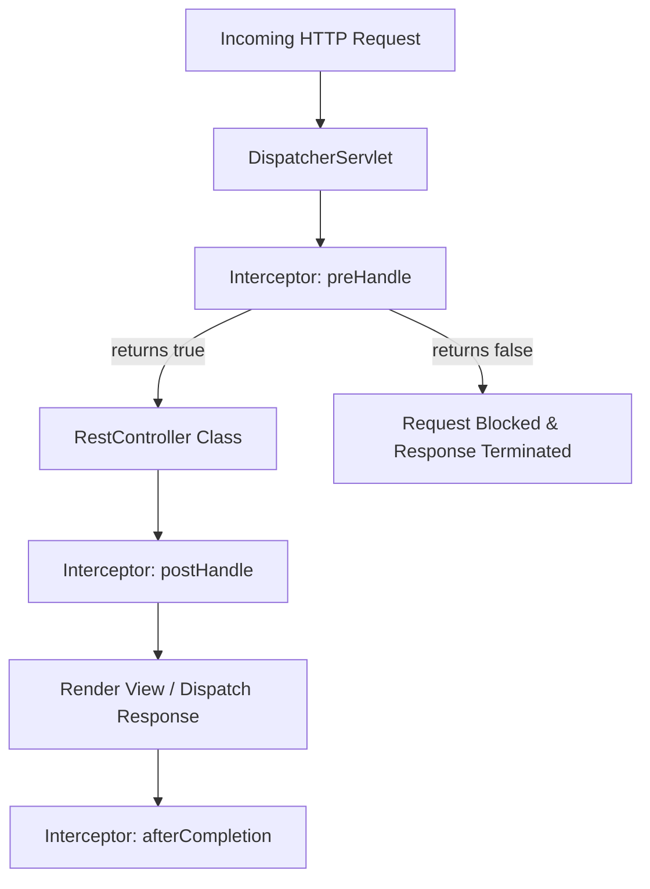

# Spring Boot Custom Interceptors & Annotations Guide

An **Interceptor** is a mediator component in Spring Boot that intercepts execution flows, allowing you to run pre-processing or post-processing logic before or after actual business logic execution. Common use cases include **logging**, **authentication/authorization checks**, **caching**, and **performance monitoring**.

Depending on the context, interception can be handled at two different levels:
1. **HTTP/Request Level**: Intercepting requests before they reach the controller class.
2. **Method/AOP Level**: Intercepting method execution after the request reaches the controller/service class, driven by custom annotations.

---

## 1. HTTP Request Interception (Before Controller Class)

To intercept incoming HTTP requests before they hit specific `@RestController` handlers, Spring provides the `HandlerInterceptor` interface.



### Implementing `HandlerInterceptor`
A custom interceptor implements three main lifecycle hooks:
*   `preHandle()`: Executed *before* the request reaches the Controller. If it returns `true`, the execution chain continues. If it returns `false`, execution halts and the request is blocked.
*   `postHandle()`: Executed *after* the Controller method executes but *before* the view is rendered (or response dispatched). It allows altering the `ModelAndView` (if applicable).
*   `afterCompletion()`: Executed *after* the complete request finishes and the response is dispatched. Used for resource clean-up and exception auditing.

```java
@Component
public class MyCustomInterceptor implements HandlerInterceptor {

    @Override
    public boolean preHandle(HttpServletRequest request, 
                             HttpServletResponse response, 
                             Object handler) throws Exception {
        System.out.println("inside pre handle Method");
        return true; // Return true to proceed; false to block the request
    }

    @Override
    public void postHandle(HttpServletRequest request, 
                           HttpServletResponse response, 
                           Object handler, 
                           @Nullable ModelAndView modelAndView) throws Exception {
        System.out.println("inside post handle method");
    }

    @Override
    public void afterCompletion(HttpServletRequest request, 
                                HttpServletResponse response, 
                                Object handler, 
                                @Nullable Exception ex) throws Exception {
        System.out.println("inside after completion method");
    }
}
```

### Registering the Interceptor in `WebMvcConfigurer`
Register the interceptor with `InterceptorRegistry` to map it to specific URI patterns and exclude paths.

```java
@Configuration
public class AppConfig implements WebMvcConfigurer {

    @Autowired
    private MyCustomInterceptor myCustomInterceptor;

    @Override
    public void addInterceptors(InterceptorRegistry registry) {
        registry.addInterceptor(myCustomInterceptor)
                .addPathPatterns("/api/*") // Apply to all /api/ endpoints
                .excludePathPatterns("/api/updateUser", "/api/deleteUser"); // Skip for these routes
    }
}
```

> [!NOTE]
> **Interception Output Flow when calling `/api/getUser`:**
> ```text
> 2024-08-31T23:01:49.217+05:30 INFO 4417 --- [nio-8080-exec-1] o.s.web.servlet.DispatcherServlet
> inside pre handle Method
> hitting db to get the userdata
> inside post handle method
> inside after completion method
> ```

---

## 2. Method-Level Interception (AOP + Custom Annotations)

If you need to intercept specific service or controller method executions *after* they have been invoked, custom annotations combined with Spring AOP (Aspect-Oriented Programming) aspects are the standard solution.

### Step 1: Defining a Custom Java Annotation
Use the `@interface` keyword to define your custom annotation. 

```java
@Target(ElementType.METHOD)
@Retention(RetentionPolicy.RUNTIME)
public @interface MyCustomAnnotation {
    String name() default "";
}
```

#### Important Meta-Annotations:
1.  **`@Target`**: Defines where the annotation can be applied. Common targets are:
    *   `ElementType.METHOD`: Applied on methods.
    *   `ElementType.FIELD`: Applied on fields/attributes.
    *   `ElementType.PARAMETER`: Applied on method parameters.
    *   `ElementType.CONSTRUCTOR`: Applied on constructors.
    *   `ElementType.TYPE`: Applied on classes, interfaces, or enums.
2.  **`@Retention`**: Specifies how long the annotation should be retained:
    *   `RetentionPolicy.SOURCE`: Discarded by the compiler; does not exist in the `.class` byte code.
    *   `RetentionPolicy.CLASS`: Stored in the `.class` byte code but ignored by the JVM at runtime.
    *   `RetentionPolicy.RUNTIME`: Stored in the `.class` byte code and available to the JVM at runtime (essential for AOP/reflection).

#### Restrictions on Annotation Attributes:
Annotation attributes behave like methods with no parameters or bodies. Their return types are restricted to:
*   Primitives (`int`, `boolean`, `double`, etc.)
*   `String`
*   `Class<?>`
*   Enums
*   Other Annotations
*   Arrays of the above types

*Example of multiple attribute types:*
```java
public @interface MyCustomAnnotation {
    int intKey() default 0;
    String stringKey() default "defaultString";
    Class<?> classTypeKey() default String.class;
    MyCustomEnum enumKey() default MyCustomEnum.ENUM_VAL1;
    String[] stringArrayKey() default {"default1", "default2"};
}
```

### Step 2: Applying the Custom Annotation
Apply the annotation to any target method and supply its parameters:
```java
@Component
public class User {

    @MyCustomAnnotation(name = "user")
    public void getUser() {
        System.out.println("get the user details");
    }
}
```

### Step 3: Intercepting with AOP Aspect
Implement an Aspect class annotated with `@Aspect` and `@Component` to intercept methods tagged with your custom annotation using an `@Around` advice.

```java
@Component
@Aspect
public class MyCustomInterceptor {

    @Around("@annotation(com.conceptandcoding.learningspringboot.CustomInterceptor.MyCustomAnnotation)")
    public Object invoke(ProceedingJoinPoint joinPoint) throws Throwable {
        System.out.println("do something before actual method");
        
        // 1. Retrieve the method signature
        Method method = ((MethodSignature) joinPoint.getSignature()).getMethod();
        
        // 2. Access the annotation properties using Reflection
        if (method.isAnnotationPresent(MyCustomAnnotation.class)) {
            MyCustomAnnotation annotation = method.getAnnotation(MyCustomAnnotation.class);
            System.out.println("name from annotation: " + annotation.name());
        }
        
        // 3. Proceed with actual method execution
        Object result = joinPoint.proceed();
        
        System.out.println("do something after actual method");
        return result;
    }
}
```

> [!NOTE]
> **Interception Output Flow:**
> ```text
> 2024-08-31T17:51:51.344+05:30 INFO 3464 --- [nio-8080-exec-1] o.s.web.servlet.DispatcherServlet
> do something before actual method
> name from annotation: user
> get the user details
> do something after actual method
> ```

---

## 3. Comparison: `HandlerInterceptor` vs. AOP Aspect

| Feature | `HandlerInterceptor` (HTTP Level) | AOP Aspect (Method Level) |
| :--- | :--- | :--- |
| **Primary Scope** | Web requests (HTTP request & response). | Any Spring Bean method execution. |
| **Parameters** | `HttpServletRequest`, `HttpServletResponse`, and `Object handler`. | `ProceedingJoinPoint` (access to arguments, signature, target instance). |
| **Bypass capability** | Can halt execution by returning `false` in `preHandle`. | Can halt/modify execution by selectively calling `joinPoint.proceed()`. |
| **Awareness** | Aware of Spring MVC mapping (`ModelAndView`, servlet exceptions). | Aware of method parameters, return types, and class annotations. |
| **Use Case** | Global auth tokens check, CORS, request tracing, locale resolution. | Method-specific caching, logging parameter values, transaction control. |

---

## 4. Q&A: Interceptors & Annotations Review

<details>
<summary><b>Q1: What happens if preHandle() returns false in HandlerInterceptor?</b></summary>
<br>
<b>Answer:</b> The execution chain is immediately halted. The dispatcher servlet assumes the interceptor has already handled the response (e.g., sent an HTTP 401 Unauthorized), so no further interceptors or controllers are executed.
</details>

<details>
<summary><b>Q2: What is the main difference between RetentionPolicy.CLASS and RetentionPolicy.RUNTIME?</b></summary>
<br>
<b>Answer:</b> 
<ul>
  <li><code>RetentionPolicy.CLASS</code>: The annotation is preserved in the compiled <code>.class</code> file, but is discarded by the JVM loader. It cannot be accessed via reflection at runtime.</li>
  <li><code>RetentionPolicy.RUNTIME</code>: The annotation is preserved in the <code>.class</code> file and loaded into the JVM. It can be read programmatically at runtime using reflection API or Spring AOP pointcuts.</li>
</ul>
</details>

<details>
<summary><b>Q3: Why can't we declare methods with parameters inside a custom Java annotation?</b></summary>
<br>
<b>Answer:</b> Java annotations are metadata constructs. Their methods act strictly as constant attribute declarations (data holders) and cannot contain logic, parameters, or generic parameters. They can only have <code>default</code> values.
</details>

<details>
<summary><b>Q4: Can an AOP Aspect intercept private methods annotated with a custom annotation?</b></summary>
<br>
<b>Answer:</b> No. Spring AOP is proxy-based. Just like <code>@Async</code> or <code>@Transactional</code>, proxy interception works only on <b>public</b> methods called from external beans. Self-invocation or private methods will bypass the aspect.
</details>
