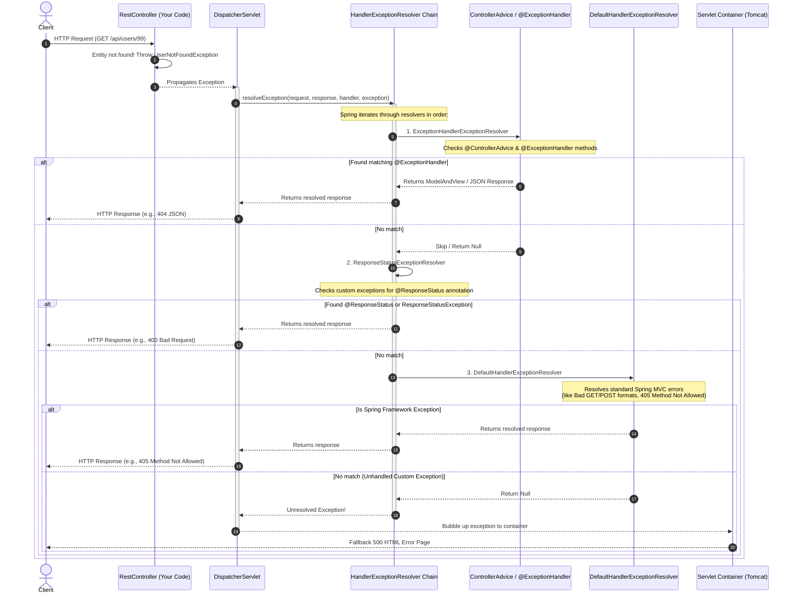
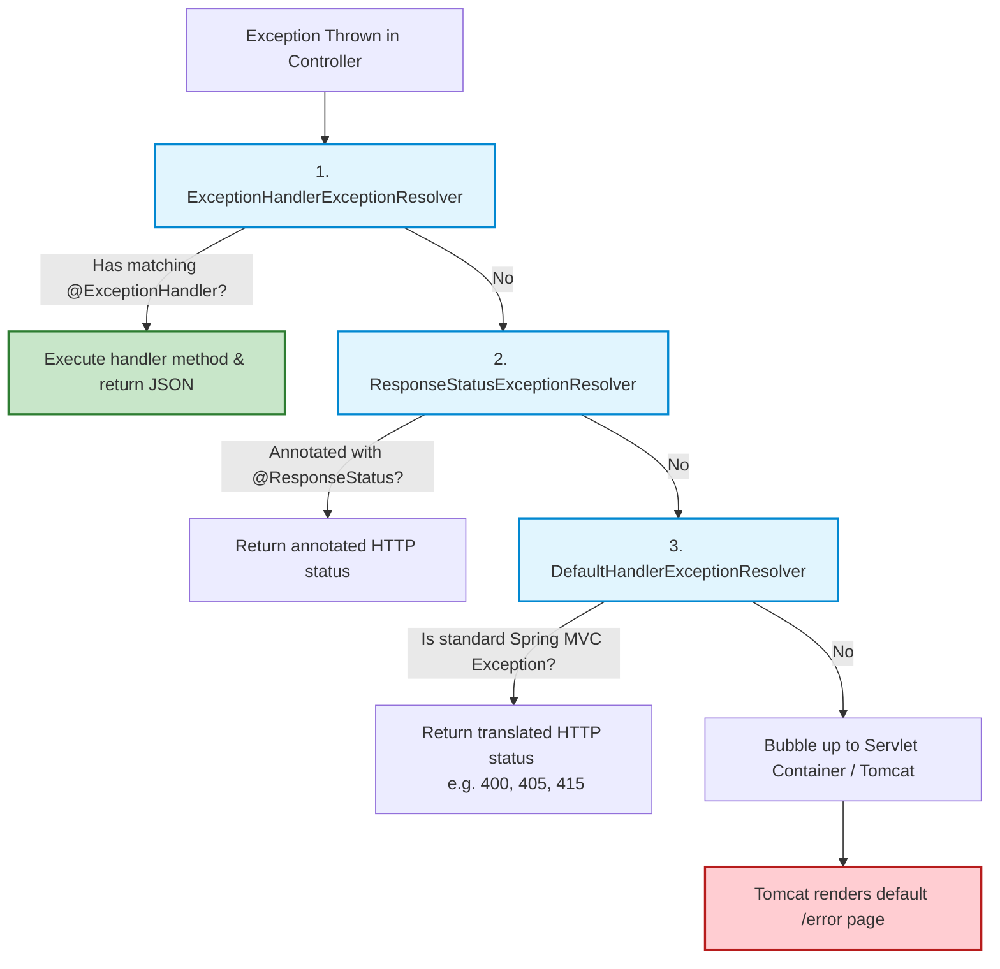

# Spring Boot Exception Handling: The Complete Guide 🛠️

When writing backend APIs, errors are inevitable. A database might be down, a user might request a ID that doesn't exist, or validation checks might fail. 

If we don't handle these exceptions, the servlet container (Tomcat) returns a raw HTML error page with a `500 Internal Server Error` and a stack trace. This is bad for two reasons:
1. **Security Risk:** It exposes internal class names and database details.
2. **Poor Client Experience:** Mobile apps, frontend frameworks (like React/Angular), and public clients cannot parse raw HTML; they require structured JSON responses (like `{ "error": "User not found", "status": 404 }`).

Spring Boot provides a powerful, multi-layered exception handling mechanism to intercept exceptions and translate them into clean, structured HTTP responses.

---

## 1. Class Hierarchy of Exception Handling 🌲

To understand how Spring handles exceptions, we must first look at how Java organizes exceptions, and where Spring-specific exceptions fit.

### Java Core Exception Hierarchy
```
           Throwable (Root class)
               │
      ┌────────┴────────┐
   Error            Exception
                (Must be handled or declared)
                        │
             ┌──────────┴──────────┐
      Checked Exceptions     RuntimeException 
      (e.g., IOException)    (Unchecked Exceptions)
                                   │
                                   ▼
                             NullPointerException
                             IllegalArgumentException
```
* **Error:** Serious problems that a reasonable application should not try to catch (e.g., `OutOfMemoryError`, `StackOverflowError`).
* **Checked Exceptions:** Exceptions that the compiler forces you to handle or declare in your method signature (e.g., `IOException`, `SQLException`).
* **Runtime (Unchecked) Exceptions:** Exceptions that occur at runtime and do not need to be declared in method signatures (e.g., `NullPointerException`, `IndexOutOfBoundsException`).

### Spring MVC Exception Hierarchy
Spring introduces its own runtime hierarchy, mapping low-level servlet or DB exceptions to high-level, vendor-neutral Spring exceptions:

```
                     RuntimeException
                            │
               ┌────────────┴────────────┐
   NestedRuntimeException       ResponseStatusException
   (Spring's base exception)     (Throws specific HTTP status)
               │
     ┌─────────┴─────────┐
Spring Security     DataAccessException
Exceptions          (Spring JDBC/JPA base)
                         │
                 ┌───────┴───────┐
      ConstraintViolation   DataIntegrityViolation
```
* **`NestedRuntimeException`**: Spring's root unchecked exception class, designed to wrap low-level nested exceptions so developers don't have to catch checked exceptions.
* **`ResponseStatusException`**: A special Spring 5 exception used to associate a specific HTTP status code and description directly with an error.

---

## 2. The Exception Resolution Flow 🔄

When your `@RestController` throws an exception, how does Spring capture it? 

Everything in Spring MVC goes through the **`DispatcherServlet`** (the Front Controller). The `DispatcherServlet` delegating exceptions to a chain of **`HandlerExceptionResolver`** implementations.

### Sequence Diagram: Exception Resolution Flow



---

## 3. What is a `HandlerExceptionResolver`? 🔌

A **`HandlerExceptionResolver`** is a contract interface that allows classes to intercept and resolve exceptions thrown during handler (controller) execution.

### The Interface Definition:
```java
public interface HandlerExceptionResolver {
    @Nullable
    ModelAndView resolveException(
            HttpServletRequest request, 
            HttpServletResponse response, 
            @Nullable Object handler, 
            Exception ex);
}
```
If a resolver returns a `ModelAndView` (or writes directly to the response and returns an empty `ModelAndView`), the exception is considered **resolved**, and no further resolvers are called. If it returns `null`, the exception is passed to the next resolver in the chain.

---

## 4. Global Interception: `@ExceptionHandler` and `@ControllerAdvice` 🎯

This is the most popular, clean, and flexible way to handle exceptions globally in Spring Boot applications.

### The Tools:
* **`@ExceptionHandler`**: Annotation put on methods inside a class to declare which exception types they handle. If put inside a regular `@RestController`, it only intercepts exceptions thrown by *that specific controller*.
* **`@ControllerAdvice`**: A component class annotation that intercepts exceptions globally across **all** controllers in the application.
* **`@RestControllerAdvice`**: A combination of `@ControllerAdvice` + `@ResponseBody`. It automatically serializes the returned object into a JSON response (essential for REST APIs).

### Code Demo: Global Exception Handling

#### Step 1: Create a Custom Business Exception
```java
package com.example.exception;

// Unchecked Exception representing business errors
public class UserNotFoundException extends RuntimeException {
    public UserNotFoundException(String message) {
        super(message);
    }
}
```

#### Step 2: Create a Standard Error Response DTO (Structured JSON)
```java
package com.example.dto;

import java.time.LocalDateTime;

public class ErrorResponse {
    private LocalDateTime timestamp;
    private int status;
    private String error;
    private String message;
    private String path;

    public ErrorResponse(int status, String error, String message, String path) {
        this.timestamp = LocalDateTime.now();
        this.status = status;
        this.error = error;
        this.message = message;
        this.path = path;
    }

    // Getters and Setters
}
```

#### Step 3: Create the Global `@RestControllerAdvice`
```java
package com.example.exception;

import com.example.dto.ErrorResponse;
import jakarta.servlet.http.HttpServletRequest;
import org.springframework.http.HttpStatus;
import org.springframework.http.ResponseEntity;
import org.springframework.web.bind.annotation.ExceptionHandler;
import org.springframework.web.bind.annotation.RestControllerAdvice;

@RestControllerAdvice // Global interceptor mapping error objects directly to JSON
public class GlobalExceptionHandler {

    // Handles specifically UserNotFoundException
    @ExceptionHandler(UserNotFoundException.class)
    public ResponseEntity<ErrorResponse> handleUserNotFound(UserNotFoundException ex, HttpServletRequest request) {
        
        ErrorResponse error = new ErrorResponse(
                HttpStatus.NOT_FOUND.value(),
                "Resource Not Found",
                ex.getMessage(),
                request.getRequestURI()
        );
        
        return new ResponseEntity<>(error, HttpStatus.NOT_FOUND);
    }

    // Fallback handler for all other unhandled RuntimeExceptions (NullPointer, etc.)
    @ExceptionHandler(RuntimeException.class)
    public ResponseEntity<ErrorResponse> handleGeneralRuntime(RuntimeException ex, HttpServletRequest request) {
        
        ErrorResponse error = new ErrorResponse(
                HttpStatus.INTERNAL_SERVER_ERROR.value(),
                "Internal Server Error",
                "An unexpected error occurred. Please try again later.",
                request.getRequestURI()
        );
        
        return new ResponseEntity<>(error, HttpStatus.INTERNAL_SERVER_ERROR);
    }
}
```

---

## 5. Custom Statuses: `@ResponseStatus` Annotation 🏷️

If you don't want to write a complex `@RestControllerAdvice` class for simple errors, you can annotate your custom Exception classes directly with `@ResponseStatus`.

### Code Demo: Custom Exception with `@ResponseStatus`
```java
package com.example.exception;

import org.springframework.http.HttpStatus;
import org.springframework.web.bind.annotation.ResponseStatus;

// Tells Spring to automatically return HTTP 404 (Not Found) if this is thrown
@ResponseStatus(value = HttpStatus.NOT_FOUND, reason = "The requested database record does not exist")
public class RecordNotFoundException extends RuntimeException {
    public RecordNotFoundException(String message) {
        super(message);
    }
}
```

### Pro/Con Analysis:
* **Pros:** Very simple, requires zero configuration or handler classes.
* **Cons:** 
  - The JSON error structure is fixed by Spring Boot's default error controller (you cannot customize the payload structure).
  - Tight coupling (you hardcode the HTTP status code directly on the Exception class).

---

## 5.1 Priority & Precedence Rules 🏆

When exceptions occur, Spring follows strict priority rules to determine which handler executes.

### Rule 1: Local Controller-Level Handler wins over Global Handler
If you define an `@ExceptionHandler` inside your local controller class, and you *also* have an `@ExceptionHandler` for the same exception inside a global `@ControllerAdvice`:
* **The local controller handler takes precedence** and intercepts the exception. The global advice is ignored for that controller's exception.

```java
// Inside UserController.java
@ExceptionHandler(CustomException.class)
public ResponseEntity<String> handleLocal(CustomException ex) {
    return new ResponseEntity<>(ex.getMessage() + ": from Controller Local", HttpStatus.BAD_REQUEST);
}
```

### Rule 2: Inheritance Hierarchy Match (Bottom-Up)
Spring always resolves exceptions by traversing the class hierarchy from bottom to top (finding the most specific class match).
* If you throw a `CustomException` (which extends `RuntimeException` which extends `Exception`), and you have handlers for both `CustomException` and `RuntimeException`:
* **Spring will select the `CustomException` handler** because it is the closest exact match.

---

## 5.2 The "Unresolved Custom Exception" Mystery & `DefaultErrorAttributes` 🕵️‍♂️

A common point of confusion for beginners:

### The Scenario:
You define a custom exception containing a status code and a message, and throw it in your controller:
```java
throw new CustomException(HttpStatus.BAD_REQUEST, "UserID is missing");
```
However, when you trigger the endpoint, the response returns **500 Internal Server Error** instead of **400 Bad Request**!

### Why does this happen?
1. Since you didn't register an `@ExceptionHandler` or an `@ResponseStatus` for `CustomException`, Spring's default resolvers do not recognize it.
2. The exception escapes all resolvers (`ExceptionHandlerExceptionResolver`, `ResponseStatusExceptionResolver`, `DefaultHandlerExceptionResolver`), and they all return `null`.
3. The control falls back to Spring Boot's **`DefaultErrorAttributes`** class, which fills the HTTP response with default values. Because the exception was completely unhandled, the server considers it an internal crash and defaults to `500 Internal Server Error`.

---

## 5.3 Letting `DefaultErrorAttributes` build the Response (Void Handlers) 📦

Instead of returning a manual `ResponseEntity<ErrorResponse>` from your `@ExceptionHandler`, you can return `void` and write to the servlet response using `response.sendError()`. 

This instructs Spring to let `DefaultErrorAttributes` build the structured JSON response body automatically, but with your custom status code and message.

### Code Example:
```java
@ExceptionHandler(CustomException.class)
public void handleCustomException(CustomException ex, HttpServletResponse response) throws IOException {
    // Fills response using DefaultErrorAttributes structure but with custom status & message
    response.sendError(HttpStatus.BAD_REQUEST.value(), ex.getMessage());
}
```

### Crucial Configuration:
By default, Spring Boot hides exception messages in the default error JSON payload. To include the message passed to `sendError()`, you **must** add this line to your `application.properties` file:
```properties
server.error.include-message=always
```

---

## 5.4 Warning: Mixing `@ExceptionHandler` and `@ResponseStatus` ⚠️

It is strongly advised **not** to place `@ResponseStatus` and `@ExceptionHandler` on the same method.

### The Conflict:
```java
@ExceptionHandler(CustomException.class)
@ResponseStatus(value = HttpStatus.BAD_REQUEST, reason = "Invalid Request Sent")
public ResponseEntity<Object> handleConflict(CustomException e) {
    return new ResponseEntity<>("Unauthorized", HttpStatus.FORBIDDEN); // 403 Forbidden
}
```
* If you return a `ResponseEntity` with `403 Forbidden` but annotate the method with `@ResponseStatus` setting `400 Bad Request`, Spring's internal request handling engine will experience conflicting status declarations.
* **Best Practice:** Keep them separate. Use `@ResponseStatus` on Exception classes, and `@ExceptionHandler` on handler methods returning `ResponseEntity` or `void`.

---

---

## 6. The Framework Safety Net: `DefaultHandlerExceptionResolver` 🛡️

What happens if a client submits a request using `POST` to a GET-only endpoint, or sends a request with a malformed JSON payload? 

These are **Spring MVC framework exceptions**, not your custom code exceptions. The **`DefaultHandlerExceptionResolver`** is Spring's default safety net registered to catch and translate these specific framework errors into proper HTTP status codes.

### Key Translations Performed:

| Framework Exception Thrown | Translated HTTP Status | Description |
| :--- | :---: | :--- |
| `HttpRequestMethodNotSupportedException` | **`405 Method Not Allowed`** | Client sent POST instead of GET. |
| `HttpMediaTypeNotSupportedException` | **`415 Unsupported Media Type`** | Client sent `text/plain` instead of `application/json`. |
| `MethodArgumentNotValidException` | **`400 Bad Request`** | `@Valid` body validation rules failed. |
| `MissingServletRequestParameterException` | **`400 Bad Request`** | Missing a required `@RequestParam`. |
| `NoHandlerFoundException` | **`404 Not Found`** | No controller mapped to the requested URL. |
| `ConversionNotSupportedException` | **`500 Internal Server Error`** | Failed to convert bean property types. |

### Code Demo: Catching Validation Failures
When `@Valid` validation fails, it throws a `MethodArgumentNotValidException`. By default, `DefaultHandlerExceptionResolver` translates this to a 400 Bad Request. You can customize the response inside your `@RestControllerAdvice` like this:

```java
@ExceptionHandler(MethodArgumentNotValidException.class)
public ResponseEntity<Map<String, String>> handleValidationErrors(MethodArgumentNotValidException ex) {
    Map<String, String> errors = new HashMap<>();
    
    // Extract validation field names and messages
    ex.getBindingResult().getFieldErrors().forEach(error -> 
        errors.put(error.getField(), error.getDefaultMessage())
    );
    
    return new ResponseEntity<>(errors, HttpStatus.BAD_REQUEST);
}
```

---

## 7. Resolution Path Summary 🗺️

Here is the exact decision path Spring takes when resolving *any* exception:



---

## 8. SDE Interview Ready: Deep Dives 🧠

### Q1: What is the difference between `@ControllerAdvice` and `@RestControllerAdvice`?
> **Answer:** `@ControllerAdvice` is the base advice annotation. When handling exceptions, its methods return a String representing a View name (Thymeleaf/JSP template).
> 
> `@RestControllerAdvice` is a meta-annotation that includes `@ControllerAdvice` and `@ResponseBody`. Its methods serialize the returned exception objects directly into JSON/XML payloads, which is standard for RESTful APIs.

### Q2: What happens if multiple `@ExceptionHandler` methods match the same thrown exception?
> **Answer:** Spring resolves exception handlers by finding the **closest inheritance match**.
> 
> *Example:* If you throw a `UserNotFoundException` (which extends `RuntimeException`, which extends `Exception`), and you have handlers for both `UserNotFoundException.class` and `Exception.class`, Spring will choose the `UserNotFoundException` handler because it is the most specific match.

### Q3: Can a Servlet Filter's exception be handled by `@ControllerAdvice`?
> **Answer:** **No.** Filters execute outside the Spring MVC context (before the `DispatcherServlet` is reached). Since `@ControllerAdvice` is processed by Spring MVC's `ExceptionHandlerExceptionResolver`, it cannot intercept exceptions thrown in filters. 
> 
> *Solution:* To handle filter exceptions globally, you must catch them in an early filter (e.g., in a try-catch block wrapping `chain.doFilter`), or configure Tomcat's global `/error` mapping.

### Q4: What is `ResponseStatusException` and when should we use it over `@ResponseStatus`?
> **Answer:** `@ResponseStatus` is static and applied to exception classes (tight coupling). 
> 
> `ResponseStatusException` (Spring 5+) can be instantiated and thrown dynamically inside your controllers. This allows you to throw the same exception type but with different status codes or customized messages on the fly, avoiding subclassing too many custom exceptions.
> 
> ```java
> throw new ResponseStatusException(HttpStatus.NOT_FOUND, "User ID " + id + " not found");
> ```
