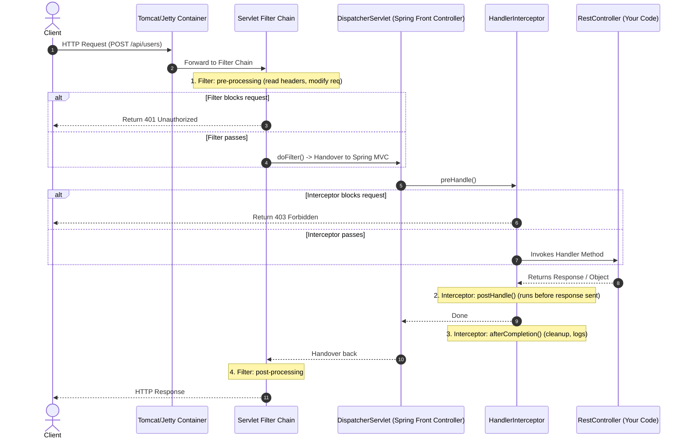

# Spring Boot: Filter vs Interceptor (The Ultimate Guide)

When building web applications with Spring Boot, you often need to run common code for many HTTP requests—such as **logging**, **authentication**, **auditing**, or **performance tracking**. 

To do this, Java and Spring provide two primary tools: **Filters** and **Interceptors**. While they seem to do the same thing (interception), they operate at different levels of the application stack.

---

## 1. The Real-World Analogy 🏢

Imagine a high-security corporate office building:

```
[ Incoming Visitor ]
         │
         ▼
┌──────────────────┐
│  Security Gate   │  ◄── FILTER (Servlet level)
│  (Outer Boundary)│      Checks ID card, searches bags, blocks intruders.
└────────┬─────────┘      Knows nothing about the inside office meetings.
         │
         ▼
┌──────────────────┐
│   Office Lobby   │
│(DispatcherServlet│
└────────┬─────────┘
         │
         ▼
┌──────────────────┐
│Receptionist/Usher│  ◄── INTERCEPTOR (Spring MVC level)
│(Inside Building) │      Escorts visitor to the specific room, checks meeting invite.
└────────┬─────────┘      Knows which employee you are meeting.
         │
         ▼
┌──────────────────┐
│  Meeting Room    │  ◄── CONTROLLER (Your code)
│(Business Logic)  │      The actual discussion happens here.
└──────────────────┘
```

1. **Filter = Outer Security Gate (Servlet level):** 
   - They stand at the very entrance of the building. 
   - They can stop you immediately (e.g., if you don't have an ID badge). 
   - They don't know (or care) which specific room or desk you are visiting inside; they just check security and manage entry.
   
2. **Interceptor = Receptionist / Usher (Spring MVC level):**
   - They are inside the building (after you pass the main gate).
   - They know exactly which employee you are meeting (Controller Method).
   - They can check if you are allowed in that specific room, escort you there, and clean up the room after you leave.

---

## 2. Request Lifecycle & Architecture 🔄

Here is the exact path an HTTP request takes in Spring Boot:



### Key Architectural Takeaway:
* **Filters** belong to the **Servlet Container** (like Apache Tomcat, Jetty). They wrap the Servlet.
* **Interceptors** belong to the **Spring MVC Framework**. They wrap the Spring Controller.

```mermaid
graph TD
    Client[HTTP Client Request] --> ServletContainer[Servlet Container]
    
    subgraph ServletContainer [Servlet Container (e.g., Tomcat, Jetty)]
        Filter1[Filter 1: CorsFilter] --> Filter2[Filter 2: SecurityFilter]
        Filter2 --> DispatcherServlet[DispatcherServlet]
        
        subgraph SpringMvc [Spring MVC Context]
            DispatcherServlet --> Interceptor1[HandlerInterceptor: preHandle]
            Interceptor1 --> Controller[RestController / Controller Handler]
            Controller --> Interceptor2[HandlerInterceptor: postHandle]
            Interceptor2 --> Interceptor3[HandlerInterceptor: afterCompletion]
        end
        
        Interceptor3 --> Filter2Post[Filter 2: Post-process / Cleanup]
        Filter2Post --> Filter1Post[Filter 1: Post-process / Cleanup]
    end
    
    Filter1Post --> Response[HTTP Client Response]

    style ServletContainer fill:#eceff1,stroke:#37474f,stroke-width:2px
    style SpringMvc fill:#e8f5e9,stroke:#2e7d32,stroke-width:2px
    style Controller fill:#c8e6c9,stroke:#2e7d32,stroke-width:2px
    style DispatcherServlet fill:#e1f5fe,stroke:#0288d1,stroke-width:2px
```

---

## 3. What is a Filter? 🛡️

A **Filter** is defined by the Servlet specification. It intercepts HTTP requests before they even reach Spring's dispatcher servlet (`DispatcherServlet`), and handles responses on their way back.

### Specifications:
* **Package:** `jakarta.servlet.Filter` (formerly `javax.servlet.Filter` before Spring Boot 3.0 / Jakarta EE).
* **Core Interface Methods:**
  1. `init(FilterConfig)`: Called once when the filter is created by the container.
  2. `doFilter(ServletRequest, ServletResponse, FilterChain)`: The core interception method. You **must** call `chain.doFilter(request, response)` to pass the request to the next filter or servlet.
  3. `destroy()`: Called once when the filter is being taken out of service.

### Typical Use Cases:
* **Global Authentication:** Spring Security is built entirely on Filters (`SecurityFilterChain`).
* **CORS (Cross-Origin Resource Sharing):** Setting HTTP headers to allow browser requests from other domains.
* **Request Body Caching/Wrapping:** Modifying or caching the request payload (useful for logging request bodies).
* **Gzip Compression:** Compressing responses before sending them to the browser.
* **XSS (Cross-Site Scripting) Prevention:** Sanitizing request parameters.

---

## 4. What is an Interceptor? 🎯

An **Interceptor** is a Spring-specific component. It intercepts requests after they pass through the Filters and the `DispatcherServlet`, but *before* they hit your `@RestController` handler methods.

### Specifications:
* **Package:** `org.springframework.web.servlet.HandlerInterceptor`
* **Core Interface Methods:**
  1. `preHandle(HttpServletRequest, HttpServletResponse, Object handler)`: Runs **before** the controller executes. Returns `true` to continue the request execution chain, or `false` to abort and send the response immediately.
  2. `postHandle(..., ModelAndView)`: Runs **after** the controller executes, but **before** the response is rendered. Allows you to modify the view attributes or response headers. (Not executed if the controller throws an exception).
  3. `afterCompletion(..., Exception ex)`: Runs **after** the request is completely finished and the response has been rendered/sent to the client. This method is guaranteed to run, making it ideal for clean-ups and calculating performance execution time.

### Typical Use Cases:
* **Controller-Level Authorization:** Checking custom annotations (e.g., checking if the user has `@AdminOnly` on the controller method).
* **Performance Monitoring:** Measuring how long a controller method took to run.
* **Spring MVC Integration:** Setting up locale settings, theme checks, or adding common parameters to the model view.
* **Audit Logs / MDC (Mapped Diagnostic Context):** Storing contextual details (like client ID or trace ID) in thread-local storage for logging.

---

## 5. Filter vs Interceptor: Side-by-Side Comparison 📊

| Comparison Dimension | Filter (`Filter`) | Interceptor (`HandlerInterceptor`) |
| :--- | :--- | :--- |
| **Origin & Domain** | **Servlet Standard** (Tomcat, Jetty). Independent of Spring MVC. | **Spring Framework**. Deeply integrated with Spring features. |
| **Execution Point** | **Outside Spring Context**. Runs before and after the `DispatcherServlet`. | **Inside Spring Context**. Runs after `DispatcherServlet` but before Controller. |
| **Awareness of MVC** | **Blind to Spring Controllers**. Only sees raw request details. Doesn't know which method will execute. | **Fully Controller-aware**. The `handler` parameter lets you inspect the target class, method, annotations, and parameters. |
| **Request/Response Wrapping** | **Yes, fully supported**. You can replace the request/response objects with custom wrappers (e.g., `HttpServletRequestWrapper`). | **No**. You cannot wrap or swap the request/response instances. |
| **Exception Handling** | **Bypasses `@ControllerAdvice`**. Since it runs outside Spring, exceptions thrown here must be handled manually or by Tomcat. | **Integrates with Spring's MVC exception resolver**. Exceptions can be caught in `afterCompletion()`. |
| **Dependency Injection** | Works by default in Spring Boot because `@Component` automatically registers them. | Works by default. Registered via a configurations class implementing `WebMvcConfigurer`. |

---

## 6. Implementation Guide: Let's Code! 💻

### Case A: Implementing a Request Log Filter
We will write a filter that logs request URLs and wraps the request using `OncePerRequestFilter` (a Spring wrapper that ensures the filter is executed exactly once per request).

```java
package com.example.notes.filter;

import jakarta.servlet.FilterChain;
import jakarta.servlet.ServletException;
import jakarta.servlet.http.HttpServletRequest;
import jakarta.servlet.http.HttpServletResponse;
import org.slf4j.Logger;
import org.slf4j.LoggerFactory;
import org.springframework.stereotype.Component;
import org.springframework.web.filter.OncePerRequestFilter;

import java.io.IOException;

@Component // Declaring as Component automatically registers it in the Filter Chain in Spring Boot!
public class RequestLoggingFilter extends OncePerRequestFilter {

    private static final Logger log = LoggerFactory.getLogger(RequestLoggingFilter.class);

    @Override
    protected void doFilterInternal(HttpServletRequest request, 
                                    HttpServletResponse response, 
                                    FilterChain filterChain) throws ServletException, IOException {
        
        long startTime = System.currentTimeMillis();
        String path = request.getRequestURI();
        log.info("[FILTER START] Incoming Request: {} {}", request.getMethod(), path);

        try {
            // PASS THE REQUEST TO THE NEXT FILTER OR SERVLET
            filterChain.doFilter(request, response);
        } finally {
            long duration = System.currentTimeMillis() - startTime;
            log.info("[FILTER END] Finished Request: {} in {}ms (Status: {})", 
                    path, duration, response.getStatus());
        }
    }
}
```

---

### Case B: Implementing a Method Performance Interceptor
We will write an interceptor that measures controller execution times and logs which handler method was called.

```java
package com.example.notes.interceptor;

import jakarta.servlet.http.HttpServletRequest;
import jakarta.servlet.http.HttpServletResponse;
import org.slf4j.Logger;
import org.slf4j.LoggerFactory;
import org.springframework.stereotype.Component;
import org.springframework.web.method.HandlerMethod;
import org.springframework.web.servlet.HandlerInterceptor;
import org.springframework.web.servlet.ModelAndView;

@Component
public class PerformanceInterceptor implements HandlerInterceptor {

    private static final Logger log = LoggerFactory.getLogger(PerformanceInterceptor.class);
    
    // Using ThreadLocal to hold the start time thread-safely
    private final ThreadLocal<Long> startTimeThreadLocal = new ThreadLocal<>();

    @Override
    public boolean preHandle(HttpServletRequest request, 
                             HttpServletResponse response, 
                             Object handler) throws Exception {
        
        startTimeThreadLocal.set(System.currentTimeMillis());

        if (handler instanceof HandlerMethod) {
            HandlerMethod handlerMethod = (HandlerMethod) handler;
            log.info("[INTERCEPTOR preHandle] Target Controller: {} -> Method: {}", 
                    handlerMethod.getBeanType().getSimpleName(), 
                    handlerMethod.getMethod().getName());
        }

        return true; // return true to let the request continue to the controller
    }

    @Override
    public void postHandle(HttpServletRequest request, 
                           HttpServletResponse response, 
                           Object handler, 
                           ModelAndView modelAndView) throws Exception {
        log.info("[INTERCEPTOR postHandle] Controller execution completed, preparing response.");
    }

    @Override
    public void afterCompletion(HttpServletRequest request, 
                                HttpServletResponse response, 
                                Object handler, 
                                Exception ex) throws Exception {
        
        long startTime = startTimeThreadLocal.get();
        long executionTime = System.currentTimeMillis() - startTime;
        startTimeThreadLocal.remove(); // CRITICAL: Prevent memory leaks in thread pools!

        log.info("[INTERCEPTOR afterCompletion] Finished handling request. Execution time: {}ms", executionTime);
        
        if (ex != null) {
            log.error("[INTERCEPTOR afterCompletion] Request failed with exception: {}", ex.getMessage());
        }
    }
}
```

#### Registering the Interceptor:
Interceptors are **not** auto-registered by `@Component` alone. You must declare them in your Spring MVC configuration:

```java
package com.example.notes.config;

import com.example.notes.interceptor.PerformanceInterceptor;
import org.springframework.beans.factory.annotation.Autowired;
import org.springframework.context.annotation.Configuration;
import org.springframework.web.servlet.config.annotation.InterceptorRegistry;
import org.springframework.web.servlet.config.annotation.WebMvcConfigurer;

@Configuration
public class WebMvcConfig implements WebMvcConfigurer {

    @Autowired
    private PerformanceInterceptor performanceInterceptor;

    @Override
    public void addInterceptors(InterceptorRegistry registry) {
        registry.addInterceptor(performanceInterceptor)
                .addPathPatterns("/api/**") // Apply interceptor only to paths starting with /api/
                .excludePathPatterns("/api/public/**"); // Skip checking for public routes
    }
}
```

---

## 7. Deep-Dive SDE Interview Questions (Crack the Interview) 🧠

### Q1: Why does Spring Security use Filters instead of Interceptors?
> **Answer:** Security checks must be run as early as possible. If a request is malicious, has expired authentication tokens, or lacks credentials, we do not want it executing parsing logic inside `DispatcherServlet` or utilizing resources inside the Spring MVC engine. Running checks inside servlet filters ensures that unauthorized traffic is rejected right at the gate.

### Q2: What is `OncePerRequestFilter` and why is it preferred over raw `Filter`?
> **Answer:** In Java Servlets, a request can be forwarded using a RequestDispatcher (e.g., `request.getRequestDispatcher("/new-route").forward(...)`). When this happens, a standard servlet filter can be executed **multiple times** for a single HTTP request.
> 
> Spring provides the abstract `OncePerRequestFilter` class to guarantee that the filter's core logic (`doFilterInternal()`) is executed **exactly once** per request, regardless of forwards or redirects. It is the best practice base class for custom filters in Spring.

### Q3: Why is it easy to read/modify the HTTP Request body inside a Filter, but extremely hard inside an Interceptor?
> **Answer:** The HTTP request body (the input stream) in Java can only be read **once**. 
> 
> * **In a Filter:** We catch the request before the `DispatcherServlet` reads it. We can read the body, wrap the raw request in a custom wrapper class (like `ContentCachingRequestWrapper`), and pass that wrapper down the filter chain.
> * **In an Interceptor:** The `DispatcherServlet` has already parsed the request stream to perform parameter binding (e.g., mapping json to a `@RequestBody` DTO using Jackson). Since the stream has already been read, trying to intercept the stream inside `preHandle()` will result in an `IOException: Stream closed`.

### Q4: How are exceptions handled differently between Filters and Interceptors?
> **Answer:** 
> * **Filters:** Because they execute outside the Spring MVC container, any exception thrown inside a Filter **bypasses `@ControllerAdvice`** by default. To return a JSON error from a filter, you must either write directly to the `HttpServletResponse` object, or inject the `HandlerExceptionResolver` bean and delegate the exception processing to it.
> * **Interceptors:** They execute within the Spring context. If an exception occurs in a controller or interceptor `preHandle()`, it is caught by the Spring exception handlers, and the exception object is still passed to the interceptor's `afterCompletion(..., Exception ex)` method for logging or auditing.

### Q5: How do filters and interceptors behave when processing `@Async` method controllers?
> **Answer:** If a controller returns a `Callable` or a `DeferredResult` (executing asynchronously on a separate thread):
> * A Filter will be invoked twice: once for the initial request (which starts the async process) and once again when the async execution completes and dispatches the response.
> * An Interceptor handles this using `AsyncHandlerInterceptor`. It provides a dedicated hook `afterConcurrentHandlingStarted()` to handle when the thread hands off execution, rather than executing standard `postHandle()` and `afterCompletion()` right away.

---

## 8. Summary Decision Matrix (When to use which?) 🏁

| Requirement | Use a Filter | Use an Interceptor |
| :--- | :---: | :---: |
| Modify HTTP headers for CORS | **Yes** | No |
| Check method-level annotations (e.g., `@RateLimit`) | No | **Yes** |
| Run security credentials checks | **Yes** | No |
| Compress request/response payload (Gzip) | **Yes** | No |
| Map execution duration metrics to controller methods | No | **Yes** |
| Access model attributes (`ModelAndView`) | No | **Yes** |
