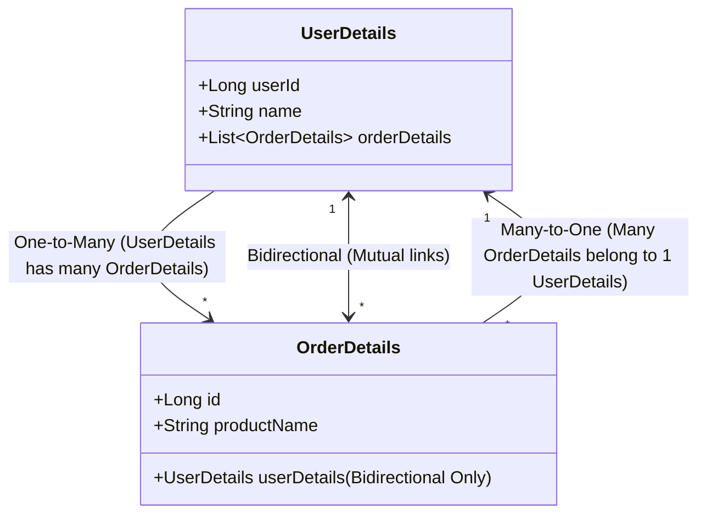

# Spring Boot & JPA: One-to-Many & Many-to-Many Associations (The Deep-Dive Interview Guide) 🔗

This guide covers everything you need to know about `@OneToMany`, `@ManyToOne`, and `@ManyToMany` associations in JPA and Hibernate (based on **JPA Part 7**). We will walk through unidirectional vs. bidirectional mappings, database-level schemas, cascade strategies, orphan removal, loading options, circular reference issues, and top interview questions.

---

## 1. Association Mapping Types Overview 🗺️

In Java, associations are modeled using **Object References** (or collections of references) in class fields. In relational databases, relationships are modeled using **Foreign Keys** and **Join Tables**.



---

## 2. One-to-Many (1:M) Unidirectional

### 💡 Concept
One parent entity holds a collection of child entities, but the child entity has no knowledge of or reference to the parent.
* **Example:** `UserDetails` has a `List<OrderDetails>`, but `OrderDetails` has no `UserDetails` field.

### 🗄️ Database Mapping Behavior

#### Strategy A: Default Mapping (New Join Table)
By default, if you only use `@OneToMany`, JPA assumes a join table is needed to link the two tables because a single parent row cannot hold multiple child IDs.
* **Join Table Name:** `[parent_table_name]_[child_table_name]` (e.g., `user_details_order_details`)
* **Foreign Keys:** Two foreign keys pointing to parent and child tables respectively.

#### Strategy B: Join Column Mapping (Recommended to avoid overhead)
To avoid the join table overhead, annotate the field with `@JoinColumn`. This instructs JPA to store the foreign key in the **Child Table** instead of a join table.

* **Schema Created:**
  * `user_details` (Primary Key: `user_id`, `name`, `phone`)
  * `order_details` (Primary Key: `id`, `product_name`, `user_id_fk` ⬅️ *Foreign Key to `user_details`*)

### 💻 Code Implementation (With `@JoinColumn`)

```java
@Entity
@Table(name = "user_details")
public class UserDetails {
    @Id
    @GeneratedValue(strategy = GenerationType.IDENTITY)
    private Long userId;
    
    private String name;
    private String phone;

    @OneToMany(cascade = CascadeType.ALL)
    @JoinColumn(name = "user_id_fk", referencedColumnName = "userId")
    private List<OrderDetails> orderDetails = new ArrayList<>();
    
    // Constructors, Getters & Setters
}

@Entity
@Table(name = "order_details")
public class OrderDetails {
    @Id
    @GeneratedValue(strategy = GenerationType.IDENTITY)
    private Long id;
    
    private String productName;

    // Constructors, Getters & Setters
}
```

---

## 3. Fetching Strategies: LAZY vs. EAGER ⚡

### A. FetchType.LAZY (Default for `@OneToMany`)
By default, accessing a parent entity does **not** fetch its child entities. The children are only loaded when their collection is explicitly accessed.

#### Hibernate SQL Trace (LAZY):
* **Step 1: Retrieve Parent User**
  ```sql
  select ud1_0.user_id, ud1_0.name, ud1_0.phone 
  from user_details ud1_0 
  where ud1_0.user_id = ?
  ```
* **Step 2: Access Child Orders Collection (Triggers a second query)**
  ```sql
  select od1_0.user_id_fk, od1_0.id, od1_0.product_name 
  from order_details od1_0 
  where od1_0.user_id_fk = ?
  ```
> [!WARNING]
> Accessing lazy-loaded collections outside a transaction boundary will throw a `LazyInitializationException`.

### B. FetchType.EAGER
Retrieve parent and all associated child entities inside a single database query.

#### Hibernate SQL Trace (EAGER):
```sql
select ud1_0.user_id, ud1_0.name, ud1_0.phone, 
       od1_0.user_id_fk, od1_0.id, od1_0.product_name
from user_details ud1_0 
left join order_details od1_0 
  on ud1_0.user_id = od1_0.user_id_fk 
where ud1_0.user_id = ?
```

---

## 4. Cascade Types & Orphan Removal 🌊

### A. Cascade Types
Cascading defines how changes made to the parent entity propagate to children.

* **`CascadeType.PERSIST`**: Saving Parent also saves the Child records.
* **`CascadeType.MERGE`**: Updating Parent updates the modified Child records.
* **`CascadeType.REMOVE`**: Deleting Parent deletes all associated Child records.
* **`CascadeType.ALL`**: Propagates all state-change operations (`PERSIST`, `MERGE`, `REMOVE`, `REFRESH`, `DETACH`).

---

### B. Orphan Removal (`orphanRemoval = true` vs `false`)
Orphan removal controls what happens to child records when they are **removed from the parent collection** (i.e. unlinked in Java).

```java
// Removing the first order from the list
userDetails.getOrderDetails().remove(0);
userRepository.save(userDetails);
```

#### If `orphanRemoval = false` (Default Behavior):
Hibernate unlinks the record in the database by setting the foreign key to `NULL`. The child row **remains in the table** as an orphan.
```sql
update order_details 
set user_id_fk = null 
where user_id_fk = ? and id = ?
```

#### If `orphanRemoval = true`:
Hibernate unlinks the record and then **deletes it entirely** from the database table.
```sql
-- Step 1: Break link
update order_details set user_id_fk = null where user_id_fk = ? and id = ?
-- Step 2: Delete orphaned record
delete from order_details where id = ?
```

---

## 5. One-to-Many (1:M) Bidirectional

### 💡 Concept
Both the Parent and Child entities hold references to each other.
* `UserDetails` has a `List<OrderDetails>`.
* `OrderDetails` has a reference back to `UserDetails`.

### 🔑 Owning Side vs. Inverse Side
To ensure Hibernate doesn't attempt to write the relationship twice (which would result in database integrity errors), we must declare one side as the relationship "Owner".

1. **Owning Side (Child Entity - `@ManyToOne`):**
   * This side contains the actual database Foreign Key column.
   * Annotated with `@ManyToOne` and `@JoinColumn`.
2. **Inverse / Non-Owning Side (Parent Entity - `@OneToMany`):**
   * This side merely maps to the parent reference inside the child.
   * Annotated with `@OneToMany(mappedBy = "userDetails")` where `"userDetails"` matches the field name in the child class.

### 💻 Code Implementation

```java
// Inverse/Non-Owning Side
@Entity
@Table(name = "user_details")
@JsonIdentityInfo(generator = ObjectIdGenerators.PropertyGenerator.class, property = "userId")
public class UserDetails {
    @Id
    @GeneratedValue(strategy = GenerationType.IDENTITY)
    private Long userId;
    
    private String name;
    private String phone;

    @OneToMany(mappedBy = "userDetails", cascade = CascadeType.ALL)
    private List<OrderDetails> orderDetails = new ArrayList<>();

    // CRITICAL: Helper utility method to keep both sides synchronized in memory
    public void addOrder(OrderDetails order) {
        orderDetails.add(order);
        order.setUserDetails(this);
    }
    
    public void removeOrder(OrderDetails order) {
        orderDetails.remove(order);
        order.setUserDetails(null);
    }
}

// Owning Side
@Entity
@Table(name = "order_details")
@JsonIdentityInfo(generator = ObjectIdGenerators.PropertyGenerator.class, property = "id")
public class OrderDetails {
    @Id
    @GeneratedValue(strategy = GenerationType.IDENTITY)
    private Long id;
    
    private String productName;

    @ManyToOne
    @JoinColumn(name = "user_id_owning_fk", referencedColumnName = "userId")
    private UserDetails userDetails;

    // Getters and Setters
}
```

> [!IMPORTANT]
> **Dealing with Infinite JSON Recursion:** 
> When mapping bidirectional relationships, Jackson serialization will loop infinitely (`User` ➡️ `Order` ➡️ `User` ➡️ `Order`...).
> Use **`@JsonIdentityInfo`** (shown above), or annotate one of the fields with `@JsonIgnore` / `@JsonBackReference` to prevent this recursion.

---

## 6. Many-to-One (M:1) Unidirectional

### 💡 Concept
Multiple child entities point to a single parent, but the parent does not hold any collection of the children.
* **Example:** `OrderDetails` points to `UserDetails`, but `UserDetails` has no list of orders.
* Standard default setting in JPA.

### 💻 Code Implementation

```java
@Entity
@Table(name = "order_details")
public class OrderDetails {
    @Id
    @GeneratedValue(strategy = GenerationType.IDENTITY)
    private Long id;
    
    private String productName;

    @ManyToOne(cascade = CascadeType.ALL)
    @JoinColumn(name = "user_id_owing_fk", referencedColumnName = "userId")
    private UserDetails userDetails; // Simple reference, no collection on parent side
}
```

---

## 7. Many-to-Many (M:M) Unidirectional & Bidirectional

### 💡 Concept
Multiple records in Entity A are linked to multiple records in Entity B (e.g., an `OrderDetails` can have many products, and a `ProductDetails` can belong to many orders).
* In relational databases, this **always requires a JOIN TABLE** containing the primary keys of both tables as foreign keys.

---

### 💻 Case A: Many-to-Many Unidirectional
Only the Owning Entity (`OrderDetails`) holds a reference.

```java
@Entity
@Table(name = "order_details")
public class OrderDetails {
    @Id
    @GeneratedValue(strategy = GenerationType.IDENTITY)
    private Long orderNo;

    @ManyToMany(cascade = CascadeType.ALL)
    @JoinTable(
        name = "order_product", // Name of the join table
        joinColumns = @JoinColumn(name = "order_id"), // FK pointing to OrderDetails
        inverseJoinColumns = @JoinColumn(name = "product_id") // FK pointing to ProductDetails
    )
    private List<ProductDetails> productDetails = new ArrayList<>();
}

@Entity
@Table(name = "product_details")
public class ProductDetails {
    @Id
    @GeneratedValue(strategy = GenerationType.IDENTITY)
    private Long productId;
    
    private String name;
    private double price;
}
```

---

### 💻 Case B: Many-to-Many Bidirectional
Both sides refer to each other. One side owns the mapping (`@JoinTable`), and the other side is the inverse side using `mappedBy`.

```java
// Owning Side
@Entity
@Table(name = "order_details")
public class OrderDetails {
    @Id
    @GeneratedValue(strategy = GenerationType.IDENTITY)
    private Long orderNo;

    @ManyToMany(cascade = CascadeType.ALL)
    @JoinTable(
        name = "order_product",
        joinColumns = @JoinColumn(name = "order_id"),
        inverseJoinColumns = @JoinColumn(name = "product_id")
    )
    private List<ProductDetails> productDetails = new ArrayList<>();
}

// Inverse Side
@Entity
@Table(name = "product_details")
public class ProductDetails {
    @Id
    @GeneratedValue(strategy = GenerationType.IDENTITY)
    private Long productId;
    
    private String name;
    private double price;

    @ManyToMany(mappedBy = "productDetails")
    @JsonIgnore // Stop circular reference during JSON serialization
    private List<OrderDetails> orders = new ArrayList<>();
}
```

---

## ❓ Core Interview Q&A on JPA Part 7

#### Q1. What does the `mappedBy` parameter do?
**Ans:** `mappedBy` is configured on the **non-owning (inverse) side** of a bidirectional relationship. It tells JPA/Hibernate that the database table schema configuration (foreign key column) is managed by the opposite entity's field (the owner). This prevents duplicate foreign keys or duplicate join tables from being created.

#### Q2. Can you explain the difference between `orphanRemoval = true` and `CascadeType.REMOVE`?
**Ans:**
* **`CascadeType.REMOVE`**: If you delete the parent entity, all its children are deleted automatically. However, if you simply remove a child entity from the parent's collection (`list.remove(child)`), the child record remains in the database (its foreign key is set to null).
* **`orphanRemoval = true`**: Acts like `CascadeType.REMOVE` upon parent deletion, **but also** triggers an automatic database `DELETE` statement for any child entity that is unlinked or removed from the parent collection.

#### Q3. What is the N+1 Query Problem in `@OneToMany` relationships and how do you resolve it?
**Ans:**
The N+1 query problem occurs when Hibernate executes 1 query to fetch a list of parent entities (size $N$) and then executes $N$ additional queries to fetch the lazy-loaded child collection for each parent.
* **Resolution:**
  1. Use **JPQL Join Fetch**: `select u from UserDetails u join fetch u.orderDetails`.
  2. Use **Entity Graph**: Annotate with `@EntityGraph`.
  3. Use **QueryDSL** or **Criteria API** to perform explicit joins.

#### Q4. Why is it recommended to use helper methods in bidirectional associations?
**Ans:**
In Java, Hibernate does not automatically synchronize both sides of an association in memory. If you add an object to the parent's list, the child object's parent reference remains `null` in memory until the session is flushed or reloaded. Helper utility methods (like `addOrder()`) update both sides of the references simultaneously, preventing state desynchronization issues.
