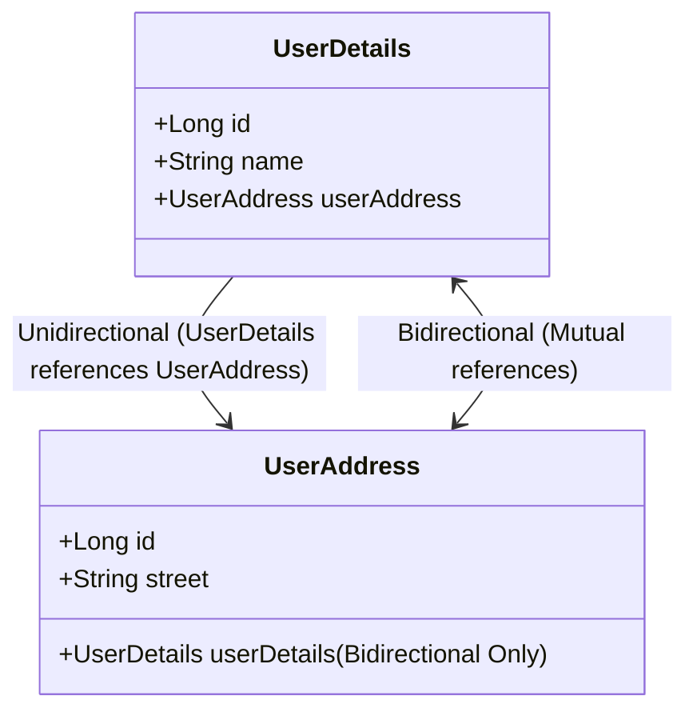

# Spring Boot & JPA: Entity Associations & One-to-One Relationships (The Deep-Dive Interview Guide) 🔗

This guide covers everything you need to know about `@OneToOne` associations in JPA (Java Persistence API) and Hibernate. We'll start from the fundamentals, dissect the database behavior, explore lifecycle cascading, and deep-dive into loading strategies, Jackson serialization issues, and top interview questions.

---

## 1. Association Mapping Types: Unidirectional vs. Bidirectional ↔️

In relational databases, relationships are navigated using **Foreign Keys** in tables. In Java, they are navigated using **Object References** inside classes.



### Unidirectional One-to-One
* **Concept:** Entity A (Parent) contains a reference to Entity B (Child). Entity B has no knowledge of Entity A.
* **Database Representation:** Only the table mapping Entity A has a Foreign Key column pointing to Entity B.
* **Java Implementation:**
  ```java
  @Entity
  @Table(name = "user_details")
  public class UserDetails {
      @Id
      @GeneratedValue(strategy = GenerationType.IDENTITY)
      private Long id;
      private String name;
      private String phone;

      @OneToOne(cascade = CascadeType.ALL)
      @JoinColumn(name = "address_id", referencedColumnName = "id")
      private UserAddress userAddress;
      
      // Constructors, getters, setters
  }

  @Entity
  @Table(name = "user_address")
  public class UserAddress {
      @Id
      @GeneratedValue(strategy = GenerationType.IDENTITY)
      private Long id;
      private String street;
      private String city;
      private String state;
      private String country;
      private String pinCode;

      // Constructors, getters, setters
  }
  ```

---

### Bidirectional One-to-One
* **Concept:** Both Entity A and Entity B contain references to each other.
* **Owner Side (Owning Entity):** The entity that controls the relationship and holds the **Foreign Key** in the database. Here, `UserDetails` is the owning side.
* **Inverse Side (Referencing Entity):** The entity that references the owner but doesn't own the database column. It uses the `mappedBy` attribute to link back to the parent.
* **Database Representation:** The database schema is **exactly the same** as unidirectional. Only the owning side table (`user_details`) contains the foreign key column (`address_id`). No foreign key is created on the child side table (`user_address`).
* **Java Implementation:**
  * **Owning Side (`UserDetails`):**
    ```java
    @Entity
    @Table(name = "user_details")
    public class UserDetails {
        @Id
        @GeneratedValue(strategy = GenerationType.IDENTITY)
        private Long id;
        private String name;
        private String phone;
        
        @OneToOne(cascade = CascadeType.ALL)
        @JoinColumn(name = "address_id", referencedColumnName = "id")
        private UserAddress userAddress;
    }
    ```
  * **Inverse Side (`UserAddress`):**
    ```java
    @Entity
    @Table(name = "user_address")
    public class UserAddress {
        @Id
        @GeneratedValue(strategy = GenerationType.IDENTITY)
        private Long id;
        private String street;
        private String city;
        private String state;
        private String country;
        private String pinCode;
        
        // mappedBy specifies the field name in the owning side (UserDetails) that points to this entity
        @OneToOne(mappedBy = "userAddress", fetch = FetchType.LAZY)
        private UserDetails userDetails;
    }
    ```

---

## 2. Under the Hood: Foreign Key Customization & Composite Keys 🗝️

### Default Foreign Key Naming
By default, Hibernate names the foreign key column as `<field_name>_<primary_key_column_of_target>`.
If you declare `private UserAddress userAddress;`, Hibernate will default the foreign key column in `user_details` to `user_address_id`.

To override this, use `@JoinColumn`:
* `name`: The name of the foreign key column in the owning entity's table (`address_id`).
* `referencedColumnName`: The column in the target entity's table that is being referenced (`id` of `user_address`).

---

### Composite Foreign Key Mappings
If the child table uses a **Composite Key** (using `@EmbeddedId`), you must map it using `@JoinColumns` containing multiple `@JoinColumn` mappings matching the composite key attributes.

#### Step 1: Define the Embeddable Composite Key
```java
@Embeddable
public class UserAddressCK implements Serializable {
    private String street;
    private String pinCode;

    // Must implement equals() and hashCode()!
    public UserAddressCK() {}
    public UserAddressCK(String street, String pinCode) {
        this.street = street;
        this.pinCode = pinCode;
    }
    // Getters, Setters, equals(), hashCode()
}
```

#### Step 2: Use EmbeddedId in the Child Entity
```java
@Entity
@Table(name = "user_address")
public class UserAddress {
    @EmbeddedId
    private UserAddressCK id;
    private String city;
    private String state;
    private String country;
}
```

#### Step 3: Reference the Composite Key in the Parent Entity
```java
@Entity
@Table(name = "user_details")
public class UserDetails {
    @Id
    @GeneratedValue(strategy = GenerationType.IDENTITY)
    private Long id;
    private String name;
    private String phone;

    @OneToOne(cascade = CascadeType.ALL)
    @JoinColumns({
        @JoinColumn(name = "address_street", referencedColumnName = "street"),
        @JoinColumn(name = "address_pin_code", referencedColumnName = "pinCode")
    })
    private UserAddress userAddress;
}
```

---

## 3. Demystifying Cascade Types (`CascadeType`) 🌊

Cascading allows you to propagate entity state transitions from a parent entity to its associated child entities. Without cascading, managing related records manually is tedious and error-prone.

```
       [Parent Operation]
               │
      ┌────────┼────────┐
      ▼        ▼        ▼
   PERSIST   MERGE    REMOVE
      │        │        │
      ▼        ▼        ▼
   [Child]  [Child]  [Child]
   Created  Updated  Deleted
```

| CascadeType | Action | Practical Scenario |
| :--- | :--- | :--- |
| **`PERSIST`** | `entityManager.persist(parent)` saves the child too. | When inserting a new user, automatically save their new address. |
| **`MERGE`** | `entityManager.merge(parent)` updates the child too. | When updating user profile details and their address, update both in one save. |
| **`REMOVE`** | `entityManager.remove(parent)` deletes the child too. | When a user account is deleted, delete their address record to prevent orphans. |
| **`REFRESH`** | `entityManager.refresh(parent)` reloads parent & child from DB. | Bypassing L1 cache to fetch fresh database state for both parent and child. |
| **`DETACH`** | `entityManager.detach(parent)` detaches parent & child. | Evicting the entire entity hierarchy from the Persistence Context (L1 cache). |
| **`ALL`** | Propagates all five transitions. | Standard shortcut for tight lifecycle coupling. |

> [!WARNING]
> **Why `CascadeType.PERSIST` is not enough for Updates:**
> If you build an API endpoint that updates a user (using `userDetailsRepository.save(user)`), Hibernate executes a `merge` under the hood if the user ID already exists. If your mapping only has `CascadeType.PERSIST`, updates to the address fields will be silently ignored because the merge operation does not cascade. You must include `CascadeType.MERGE` (or use `CascadeType.ALL`).

---

### Understanding `REFRESH` and `DETACH` Deeply

#### `CascadeType.REFRESH`
JPA uses the **Persistence Context** (L1 Cache) as an in-memory cache. If something changes directly in the database (e.g., via a background job or DB trigger), the entity inside the active transaction still holds the old stale state.
* Calling `entityManager.refresh(userDetails)` forces Hibernate to query the database and reload the entity state.
* With `CascadeType.REFRESH`, Hibernate also triggers a reload query for the associated `UserAddress` child, ensuring the entire object tree is synchronized with the database.

#### `CascadeType.DETACH`
Detaching moves an entity from the **Managed** state to the **Detached** state.
* Managed entities have "dirty checking" enabled (Hibernate automatically flushes any changes to the database at commit time).
* Calling `entityManager.detach(userDetails)` removes the entity from the L1 cache. Changes to the java object are no longer tracked.
* With `CascadeType.DETACH`, the associated `UserAddress` is also detached, preventing accidental database updates of the child entity.

---

## 4. Fetching Strategies: EAGER vs. LAZY Loading ⚡💤

JPA must determine when to execute SQL joins/selects to load associated child entities.

```mermaid
graph TD
    Parent[Fetch UserDetails]
    Parent --> Eager[EAGER Fetching]
    Parent --> Lazy[LAZY Fetching]
    
    Eager --> |Single SQL Join| SQL1[SELECT * FROM user_details LEFT JOIN user_address ...]
    Lazy --> |Step 1: DB Query Parent| SQL2[SELECT * FROM user_details WHERE id = ?]
    SQL2 --> |Step 2: Generate Proxy| Proxy[userAddress = HibernateProxy]
    Proxy --> |Step 3: Access property userAddress.getStreet()| SQL3[SELECT * FROM user_address WHERE id = ?]
```

### 1. Eager Loading (`FetchType.EAGER`)
* **Behavior:** The child entity is fetched immediately along with the parent.
* **Default For:** `@OneToOne` and `@ManyToOne`.
* **Reasoning:** JPA assumes that since there is only a single child object (1:1), it is highly likely that the application will need it, and fetching it via a join is computationally cheap.

### 2. Lazy Loading (`FetchType.LAZY`)
* **Behavior:** The child entity is not loaded initially. Instead, Hibernate inserts a dynamic **Proxy** object. The database is queried ONLY when you call a getter method on the child entity (e.g. `userDetails.getUserAddress().getStreet()`).
* **Default For:** `@OneToMany` and `@ManyToMany`.
* **Reasoning:** Since collections can contain hundreds of items, fetching them eagerly can cause severe performance bottlenecks.

> [!TIP]
> **Best Practice:** Always default your associations to `FetchType.LAZY`. Eager loading makes queries rigid and causes Hibernate to pull unnecessary data. You can always override lazy fetching dynamically when needed using JPQL `FETCH JOIN`.

---

## 5. Jackson Serialization Pitfalls & Solutions 🛠️

Returning JPA entities directly from REST controllers is a common source of bugs due to how JSON serialization libraries (like Jackson) process object graphs.

### Issue 1: Lazy Loading Serialization Failure (`LazyInitializationException`)
When you request a user with a lazy-loaded address:
1. The service layer fetches `UserDetails` (which contains a lazy-loaded `UserAddress` proxy) and ends the transaction.
2. The controller attempts to serialize the `UserDetails` object into JSON.
3. Jackson iterates through all fields. It encounters the `userAddress` field and tries to serialize it.
4. To serialize it, Jackson must read its properties, which triggers the lazy proxy.
5. Because the transaction has already closed and the `EntityManager` session is dead, Hibernate cannot query the database.
6. Result: **`LazyInitializationException`** or serialization failure.

> [!NOTE]
> **Why does INSERT work but GET fails?**
> During `save()`, the newly inserted entity and its child are actively managed inside the current transaction's Persistence Context (L1 cache). They are fully populated in-memory. When the controller serializes the response from the POST request, the data is already present in-memory, so no database hit is needed, avoiding the exception.

#### Recommended Solution: Data Transfer Objects (DTOs)
Never expose JPA entities directly via APIs. Instead, map your entities to DTOs within the active transaction layer.

```java
public class UserDetailsDTO {
    private Long id;
    private String name;
    private String street; // Flattened address field

    public UserDetailsDTO(UserDetails user) {
        this.id = user.getId();
        this.name = user.getName();
        // Accessing the association within the mapping boundary while session is active
        this.street = user.getUserAddress() != null ? user.getUserAddress().getStreet() : null;
    }
    // Getters and Setters
}
```

---

### Issue 2: Infinite Recursion in Bidirectional Mappings
In a bidirectional relationship, `UserDetails` has a reference to `UserAddress`, and `UserAddress` has a reference to `UserDetails`.
When Jackson serializes them:
`UserDetails` ➡️ `UserAddress` ➡️ `UserDetails` ➡️ `UserAddress` ➡️ ... infinitely.
This results in a `StackOverflowError`.

#### Solution A: `@JsonManagedReference` & `@JsonBackReference`
Use these annotations to define the serialization roles:
* **`@JsonManagedReference`** (Place on Owning Side field): Jackson will serialize this child relation.
* **`@JsonBackReference`** (Place on Inverse Side field): Jackson will **not** serialize this parent relation, breaking the infinite loop.

```java
// Owning Side (Parent)
public class UserDetails {
    @OneToOne(cascade = CascadeType.ALL)
    @JoinColumn(name = "address_id")
    @JsonManagedReference
    private UserAddress userAddress;
}

// Inverse Side (Child)
public class UserAddress {
    @OneToOne(mappedBy = "userAddress")
    @JsonBackReference
    private UserDetails userDetails;
}
```

#### Solution B: `@JsonIdentityInfo`
Use this if you want to serialize the relationship from both sides without loops. It replaces duplicate object serializations with their ID reference.

```java
// On both parent and child:
@Entity
@JsonIdentityInfo(
  generator = ObjectIdGenerators.PropertyGenerator.class,
  property = "id"
)
public class UserDetails {
    @Id @GeneratedValue(strategy = GenerationType.IDENTITY)
    private Long id;
    private String name;

    @OneToOne(cascade = CascadeType.ALL)
    @JoinColumn(name = "address_id")
    private UserAddress userAddress;
}

@Entity
@JsonIdentityInfo(
  generator = ObjectIdGenerators.PropertyGenerator.class,
  property = "id"
)
public class UserAddress {
    @Id @GeneratedValue(strategy = GenerationType.IDENTITY)
    private Long id;
    private String street;

    @OneToOne(mappedBy = "userAddress")
    private UserDetails userDetails;
}
```
* **Output JSON structure:**
  ```json
  {
    "id": 1,
    "name": "Rohit Kumar",
    "userAddress": {
      "id": 101,
      "street": "Baker Street",
      "userDetails": 1  // Serialized as a simple reference ID instead of full object!
    }
  }
  ```

---

## 6. Top Scenario-based Interview Questions & Answers 🧠💬

### Q1. What is the difference between `@OneToOne` unidirectional and bidirectional mapping from both a database perspective and a Java perspective?
* **Database Perspective:** There is **no difference**. In both cases, only the table of the owning side (`user_details`) contains the foreign key column (`address_id`). The child table (`user_address`) does not contain any foreign key columns.
* **Java Perspective:** In unidirectional mapping, only the parent entity has a reference field `userAddress` to the child entity. In bidirectional mapping, both entities contain reference fields pointing to each other, allowing you to traverse the relationship in both directions (e.g. `userAddress.getUserDetails()`).

---

### Q2. What does the `mappedBy` attribute do, and where should it be placed?
* **Role:** The `mappedBy` attribute defines the **inverse (non-owning) side** of a bidirectional relationship. It tells Hibernate: *"I do not own this relationship. Do not create a foreign key column for me in the database. Go look at the field specified in `mappedBy` on the other entity to find the relationship details."*
* **Placement:** It **must** be placed on the inverse side (non-owning side). Placing it on both sides will result in an exception, and omitting it on the inverse side will cause Hibernate to create an unnecessary middle table or redundant foreign keys.

---

### Q3. Why does updating an entity fail to update its associated child entity when only `CascadeType.PERSIST` is configured?
* **Reason:** When you save an existing entity using Spring Data JPA's `repository.save()`, Hibernate checks if the entity has an ID. If it does, Hibernate performs a **merge** operation under the hood, not a **persist** operation.
* Since you have only configured `CascadeType.PERSIST`, the merge operation is not propagated to the child entity. Hibernate updates the parent table, but the changes in the child entity are ignored. To fix this, you must change the cascade configuration to `CascadeType.MERGE` or `CascadeType.ALL`.

---

### Q4. Under what conditions is a `LazyInitializationException` thrown, and how can we prevent it?
* **Condition:** A `LazyInitializationException` is thrown when you try to access a lazy-loaded association (which is represented by a Hibernate dynamic proxy) **outside** of an active Hibernate session or transaction. Typically, this happens when:
  1. The transaction commits and the session is closed in the service layer.
  2. The controller attempts to serialize the entity into JSON, triggering the getter for the proxy.
* **Prevention:**
  1. **DTO Mapping (Best Practice):** Map the entity fields to a flat DTO inside the service layer (while the session is active).
  2. **Fetch Join:** Use a JPQL query with `JOIN FETCH` (e.g. `SELECT u FROM UserDetails u JOIN FETCH u.userAddress WHERE u.id = :id`) to load the lazy relationship in a single query when needed.
  3. **`@EntityGraph`:** Define an Entity Graph to load the association dynamically.
  * *Avoid:* `enable_lazy_load_no_trans = true` in configuration, as it leads to "N+1 select" performance problems.

---

### Q5. Explain the differences between `CascadeType.REFRESH` and `CascadeType.DETACH`.
* **`CascadeType.REFRESH`:** When you call `entityManager.refresh(parent)`, Hibernate re-reads the state of the parent entity from the database, bypassing the first-level cache. If `CascadeType.REFRESH` is active, it propagates this refresh call to the associated child, ensuring the entire parent-child tree matches the current database records.
* **`CascadeType.DETACH`:** When you call `entityManager.detach(parent)`, the parent entity is removed from the Hibernate Persistence Context (L1 cache) and changes to its fields are no longer tracked. If `CascadeType.DETACH` is active, it propagates this detach call to the child, ensuring the child is also untracked.

---

### Q6. How does `@JsonIdentityInfo` solve the infinite loop issue during serialization compared to `@JsonManagedReference` / `@JsonBackReference`?
* **`@JsonManagedReference` / `@JsonBackReference`:** This is a **one-way serialization** approach. The parent field is serialized, but the child's reference back to the parent is completely ignored. You cannot see the parent details if you serialize the child directly.
* **`@JsonIdentityInfo`:** This is a **two-way serialization** approach. Jackson keeps track of serialized objects using a unique identifier. The first time the parent is encountered, it is serialized fully. If it is encountered again down the line, Jackson replaces the object with its ID (e.g., `userDetails: 1`). This allows you to serialize from both ends safely and still preserve structural relationship information in the JSON payload.

---

### Q7. Is `@OneToOne` really Lazy-loaded by default if we specify `fetch = FetchType.LAZY` on a bidirectional mapping?
* **The Catch:** On the **Inverse (non-owning) side** of a bidirectional `@OneToOne` association, lazy loading **does not work** by default, even if you specify `fetch = FetchType.LAZY`. Hibernate will still execute a query to fetch the parent!
* **Why?** Hibernate needs to know whether the reference field is `null` or points to an object (since Java fields must be `null` or a reference). For a `@OneToMany` or `@ManyToMany`, Hibernate can just assign an empty proxy collection. But for a single reference, Hibernate must check the database to see if a record exists with the corresponding foreign key.
* **Solution:** To achieve true lazy loading on the inverse side of a bidirectional `@OneToOne`, you must use build-time bytecode enhancement (instrumentation), use `@MapsId` to share primary keys, or change the mapping to a `@OneToMany` collection with a limit of 1.

---

### Q8. What is `@MapsId` in `@OneToOne` relationships, and why is it highly recommended for database schema efficiency?
* **Concept:** `@MapsId` tells Hibernate to share the primary key of the parent entity with the child entity. Instead of creating a separate auto-incrementing primary key and a separate foreign key on the child, the child table uses the parent's primary key (`id`) as **both its Primary Key and its Foreign Key**.
* **Benefits:**
  1. Reduces database indexing overhead (only one index needed).
  2. Saves storage by removing the redundant `address_id` column.
  3. Ensures true lazy loading on both sides since parent-child primary keys are identical.
* **Implementation:**
  ```java
  @Entity
  public class UserAddress {
      @Id // Not generated!
      private Long id;

      @OneToOne
      @MapsId // Maps this entity's ID to the ID of UserDetails
      @JoinColumn(name = "user_id")
      private UserDetails userDetails;
  }
  ```

---

### Q9. How do you handle composite keys mapping in a `@OneToOne` association?
* First, create an `@Embeddable` class representing the composite key attributes (which must implement `Serializable`, `equals()`, and `hashCode()`).
* In the child entity, annotate the composite key field with `@EmbeddedId`.
* In the parent entity, use the `@JoinColumns` container annotation, containing a separate `@JoinColumn` mapping for each attribute of the composite key, specifying the local column name and the `referencedColumnName` in the child entity.

---

### Q10. Why is DTO projection preferred over returning entities directly from controller layer?
1. **Prevents `LazyInitializationException`:** Accesses required properties inside the transactional boundary.
2. **Security & Data Hiding:** Hides internal fields (like password hashes or system columns) from public APIs.
3. **Decouples Database Schema:** Prevents front-end applications from breaking when database fields are refactored.
4. **Optimized Payloads:** Reduces JSON payload size by transmitting only the fields the client requested.
