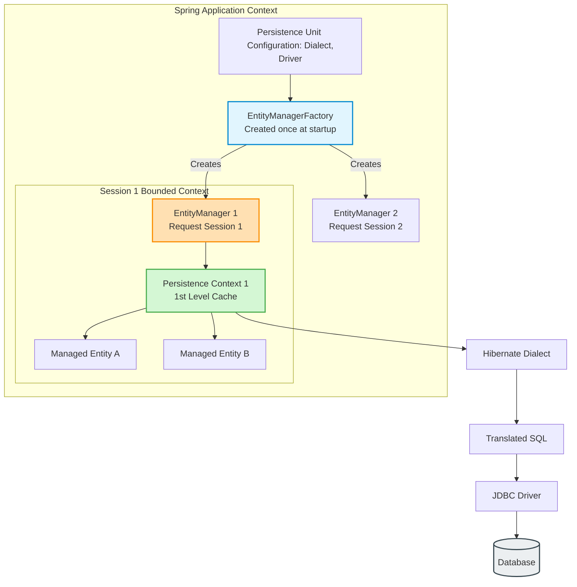
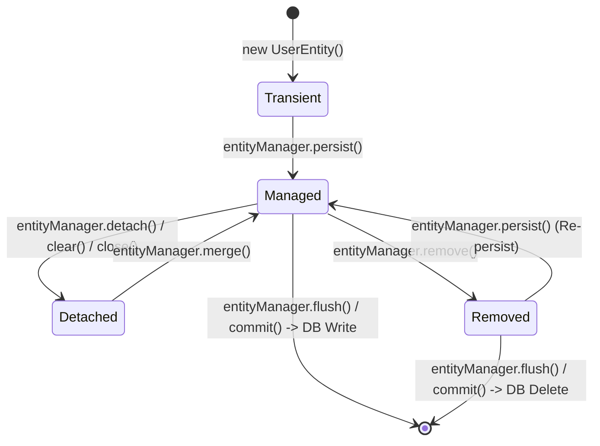
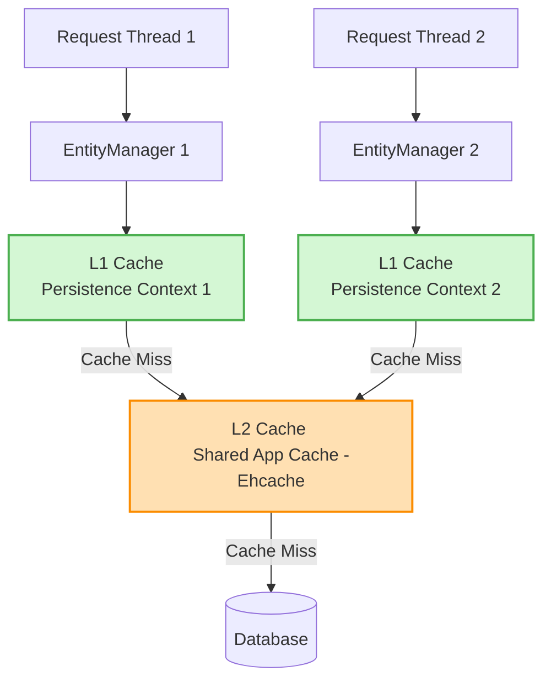

# Spring Boot: JPA & Hibernate Core (The Deep-Dive Guide) 🗄️

JPA (Java Persistence API) is the standard specification for Object-Relational Mapping (ORM) in Java, and **Hibernate** is the default implementation provider used by Spring Boot. 

This guide covers the core concepts of JPA, database schema management, entity lifecycles, caching mechanisms, and primary key generation strategies.

---

## 1. JPA Core Architecture & Components 🏗️

To understand JPA, you must understand how its components link together:



### The 4 Pillars of JPA Architecture:

1. **Persistence Unit (PU):** 
   - A logical grouping of entity classes that share the same configuration (data source connection, dialect, and driver).
   - In Spring Boot, this is auto-configured via `application.properties`. Without Spring Boot, it is configured in `persistence.xml`.
2. **EntityManagerFactory (EMF):**
   - A thread-safe registry object created once during application startup based on the Persistence Unit. 
   - It acts as a factory to spawn `EntityManager` instances.
3. **EntityManager (EM):**
   - An interface representing a database session. It provides CRUD methods (`persist`, `merge`, `find`, `remove`). It is **not thread-safe**; a new instance is created per HTTP request/transaction.
4. **Persistence Context (PC):**
   - A placeholder storage associated 1:1 with an `EntityManager`. It acts as the **First-Level Cache (L1 Cache)**. 
   - Any entity you load or save is kept here before being flushed to the database.

---

## 2. The Entity Lifecycle States 🔄

An entity object moves through four distinct states during its lifecycle:



| Lifecycle State | Description | In Persistence Context? | Exists in DB? |
| :--- | :--- | :---: | :---: |
| **Transient (New)** | Created using `new Entity()`. Not associated with any session. | No | No |
| **Managed (Persistent)** | Associated with active Persistence Context. Spring tracks all its field changes. | **Yes** | Yes (or will be after flush) |
| **Detached** | Was managed, but the session closed, cleared, or it was manually detached. | No | Yes |
| **Removed** | Marked for deletion. Will be deleted from the database on next flush/commit. | **Yes** (marked) | Yes (until flush) |

---

## 3. Transaction Boundaries & `TransactionRequiredException` 🚧

JPA requires an active transaction for any write operations (operations that modify the database).

* **Write Operations Bounded:** `persist()`, `merge()`, and `remove()` **must** be executed within a transaction boundary. If you call them outside a transaction, Spring throws a **`TransactionRequiredException`**.
* **Read Operations Unbounded:** `find()` and JPQL read queries do not require a transaction.

### Manual EntityManager Invocation Example:
```java
@Service
public class UserService {

    @PersistenceContext // Injects the thread-safe proxy EntityManager
    private EntityManager entityManager;

    @Transactional // Starts a transaction context
    public void saveUser(User user) {
        // Without @Transactional, this throws TransactionRequiredException!
        entityManager.persist(user); 
    }
}
```

---

## 4. First-Level (L1) vs. Second-Level (L2) Caching 📦

Caching reduces the number of expensive database queries by storing records in memory.



### 1. First-Level Cache (L1) — Default
* **Scope:** Tied 1:1 to the `EntityManager` (Thread/Session scope).
* **Isolation:** Isolated across different request threads.
* **Mechanism:** Enabled by default. If you query the same user ID twice in a single transaction, the second query fetches from L1 cache instead of hitting the database.

### 2. Second-Level Cache (L2) — Shared
* **Scope:** Tied to the `EntityManagerFactory` (Application scope).
* **Sharing:** Shared across all active user sessions and threads.
* **Requirements:** Disabled by default. Requires Ehcache or Caffeine dependencies.

#### Step 1: Add L2 Caching Dependencies
```xml
<dependency>
    <groupId>org.ehcache</groupId>
    <artifactId>ehcache</artifactId>
</dependency>
<dependency>
    <groupId>org.hibernate.orm</groupId>
    <artifactId>hibernate-jcache</artifactId>
</dependency>
<dependency>
    <groupId>javax.cache</groupId>
    <artifactId>cache-api</artifactId>
</dependency>
```

#### Step 2: Configure L2 Cache in properties
```properties
spring.jpa.properties.hibernate.cache.use_second_level_cache=true
spring.jpa.properties.hibernate.cache.region.factory_class=org.hibernate.cache.jcache.JCacheRegionFactory
spring.jpa.properties.javax.cache.provider=org.ehcache.jsr107.EhcacheCachingProvider
```

#### Step 3: Define ehcache.xml Configuration (in `src/main/resources`)
```xml
<ehcache xmlns:xsi="http://www.w3.org/2001/XMLSchema-instance"
         xsi:noNamespaceSchemaLocation="http://www.ehcache.org/ehcache.xsd">
    
    <cache alias="userCache"
           maxElementsInMemory="100"
           timeToLiveSeconds="60"
           evictionStrategy="LIFO" />
           
</ehcache>
```

---

## 4.1 L2 Cache Concurrency Strategies ⚖️

When enabling L2 caching, you must configure a **Cache Concurrency Strategy** on the Entity class to tell Hibernate how to sync cache data with concurrent DB changes:

```java
@Entity
@Cacheable
@org.hibernate.annotations.Cache(usage = CacheConcurrencyStrategy.READ_WRITE, region = "userCache")
public class UserDetails { ... }
```

| Strategy | When to Use | Mechanism / Locking | Stale Data Risk |
| :--- | :--- | :--- | :---: |
| **`READ_ONLY`** | Static data that never updates (e.g. Countries, Currencies). | No locks. Fast. Updates throw an `UnsupportedOperationException`. | None (data is read-only) |
| **`READ_WRITE`** | Read-heavy data that updates occasionally. | **Exclusive Lock:** On update, cache record is marked "Invalidated" until transaction commits, preventing dirty reads. | None (highly safe) |
| **`NONSTRICT_READ_WRITE`** | Rare updates where slight temp inconsistency is acceptable. | No locks. On update, the cache record is invalidated *after* the transaction commits. | Low-medium (stale reads possible during parallel transactions) |
| **`TRANSACTIONAL`** | Critical data requiring strict JTA atomicity. | Coordinates via 2-Phase Commit (2PC) in JTA. | None |

---

## 5. Schema Management & Entity Mapping 📋

### 5.1 `ddl-auto` Configuration
The property `spring.jpa.hibernate.ddl-auto` controls how Hibernate updates your database tables at startup:
* **`none`:** Do nothing. Database schema is untouched (Mandatory for Production!).
* **`validate`:** Verifies if tables match Entity classes. Throws an exception if there is a mismatch.
* **`update`:** Inspects schema and modifies tables (adds columns/indexes) without deleting existing data.
* **`create`:** Drops existing tables and creates fresh ones at startup.
* **`create-drop`:** Creates schema at startup and drops it on application shutdown (Default for in-memory H2).

### 5.2 Mappings and Table Indexes
Use `@Table` to configure database constraints and indexes directly from Java:

```java
@Entity
@Table(
    name = "USER_DETAILS",
    schema = "ONBOARDING",
    uniqueConstraints = {
        @UniqueConstraint(name = "unique_phone", columnNames = "phone"),
        @UniqueConstraint(name = "composite_name_email", columnNames = {"name", "email"}) // Composite unique
    },
    indexes = {
        @Index(name = "idx_phone", columnList = "phone"),
        @Index(name = "idx_name_email", columnList = "name, email") // Composite index
    }
)
public class UserDetails {
    
    @Id
    @GeneratedValue(strategy = GenerationType.IDENTITY)
    private Long id;

    @Column(name = "full_name", unique = true, nullable = false, length = 255)
    private String name;
    
    private String email;
    private String phone;
}
```

---

## 6. Primary Key Generation Strategies 🔑

When assigning a primary key using `@GeneratedValue`, you can choose between three main strategies:

### 1. `GenerationType.IDENTITY` (Auto-Increment Column)
* **Mechanism:** Database generates the ID using its auto-increment feature (e.g., `AUTO_INCREMENT` in MySQL, `SERIAL` in Postgres).
* **⚠️ Drawback:** **Disables Hibernate Batch Inserts.** 
  - To support batch inserts (saving 100 rows in 1 query), Hibernate needs to know the entity IDs *before* committing. 
  - Since `IDENTITY` requires the record to be physically inserted to retrieve the ID, Hibernate is forced to execute an insert statement immediately for every call to `persist()`, executing 100 separate queries instead of 1 batch.

### 2. `GenerationType.SEQUENCE` (Pre-allocated Sequences)
* **Mechanism:** Uses a database sequence object to fetch unique identifiers.
* **Optimization via `allocationSize`:**
  - You can tell Hibernate to pre-fetch blocks of IDs using `allocationSize`.
  - If `allocationSize = 5`, Hibernate queries the DB sequence once, grabs 5 IDs (e.g. 100 to 104), and allocates them to the next 5 entities in memory. It only hits the DB sequence again on the 6th insert call.
  - **Highly portable and supports Batch Inserts!**

```java
@Id
@GeneratedValue(strategy = GenerationType.SEQUENCE, generator = "user_seq_gen")
@SequenceGenerator(name = "user_seq_gen", sequenceName = "db_user_seq", initialValue = 100, allocationSize = 5)
private Long id;
```

### 3. `GenerationType.TABLE` (Fallback Table)
* **Mechanism:** Uses a separate database table to store and update the next primary key value.
* **⚠️ Drawback:** Extremely slow. Requires SELECT + UPDATE queries on the lock table for every single insert. Avoid in production!

---

## 7. Composite Primary Keys 🗝️

A composite primary key is a combination of two or more columns that uniquely identify a record. JPA provides two ways to map them: `@IdClass` and `@EmbeddedId`.

### Using `@IdClass`
Best when you want to keep the entity structure flat. You create a separate Primary Key (PK) class that mirrors the ID fields in the entity.

```java
@Entity
@Table(name = "USER_DETAILS")
@IdClass(UserDetailsPK.class) // Links the entity to the PK class
public class UserDetails {
    
    @Id
    private String name;
    
    @Id
    private String address;
    
    private String phone;
}

// The PK class must implement Serializable, equals(), and hashCode()
public class UserDetailsPK implements Serializable {
    private String name;
    private String address;
    
    // Constructors, Getters, Setters
    
    @Override
    public boolean equals(Object obj) { /* implementation */ return true; }
    
    @Override
    public int hashCode() { /* implementation */ return 1; }
}
```

---

## 8. SDE-2 Interview Ready: Deep Dives 🧠

### Q1: Why must a Composite Key class override `equals()`, `hashCode()`, and implement `Serializable`?
> **Answer:** 
> 1. **`Serializable`:** Hibernate needs to serialize entities when transferring them over networks or saving state in distributed L2 caches.
> 2. **`equals()` & `hashCode()`:** JPA's L1 cache (Persistence Context) and L2 caches store entities internally in a `HashMap` structure where the primary key acts as the map key. If you use a composite key class without overriding `equals()` and `hashCode()`, Java uses default reference-equality checks. This prevents Hibernate from looking up cached entities correctly, leading to duplicate objects and cache misses.

### Q2: What is the difference between `RESOURCE_LOCAL` and `JTA` transaction types?
> **Answer:** 
> * **`RESOURCE_LOCAL` (Default):** The transaction is bound to a single database connection. The JDBC driver handles transactions using standard `commit()` and `rollback()` calls.
> * **`JTA` (Java Transaction API):** Used in enterprise architectures where a single transaction spans **multiple databases or message brokers** (e.g. database insert + JMS Queue message). It uses a Transaction Manager (like Atomikos) to orchestrate updates atomically using **Two-Phase Commit (2PC)** protocols.

### Q3: What is the difference between `entityManager.persist()` and `entityManager.merge()`?
> **Answer:** 
> * **`persist()`:** Takes a **Transient** entity, puts it in the Persistence Context, and makes it **Managed**. (Throws exception if the entity already has an ID matching a database record).
> * **`merge()`:** Takes a **Detached** entity, copies its state onto a new **Managed** copy of that entity inside the context, and returns the managed instance. The original detached entity object remains detached.
