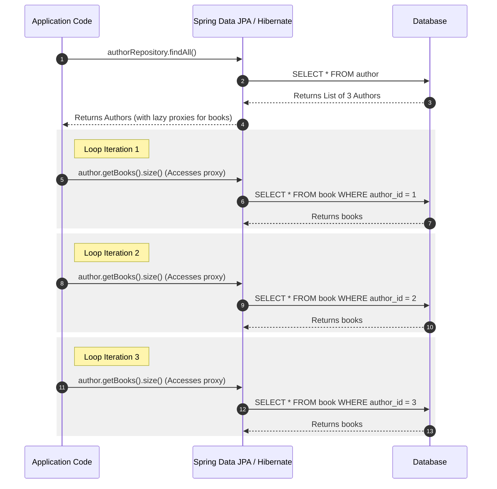
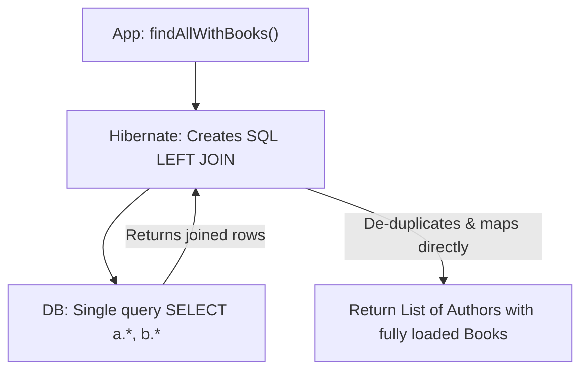
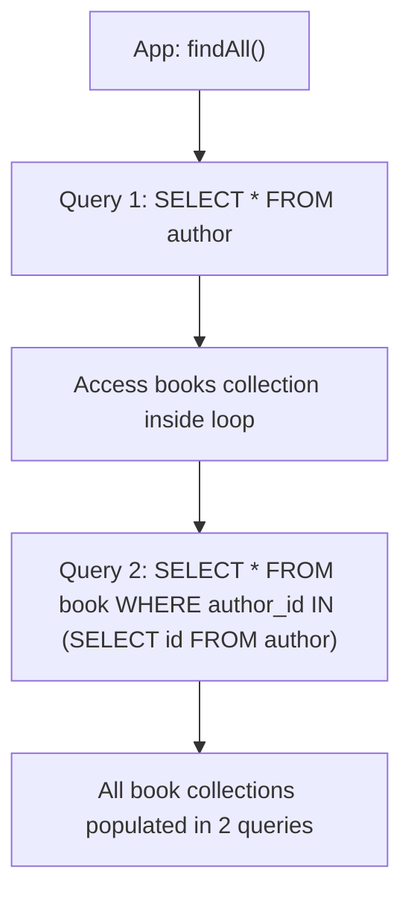

# JPA N+1 Query Problem & Advanced Fetching Strategies

In production systems, database performance issues almost always boil down to SQL execution patterns. The single most common performance killer in Spring Boot applications is the **JPA/Hibernate N+1 Query Problem**. 

Understanding why it happens, how lazy-loading proxies work under the hood, and how to implement the 4 standard SDE-2 solutions is critical for system design and coding interviews.

---

## 💡 The "Noob" Analogy

Imagine you are a school principal, and you want to know the names of all the students in 5 classrooms.

### The N+1 Way (Inefficient) 🏫
1. You make **1 call** to get the list of classrooms: *"Give me the 5 classroom numbers."* (Returns: Room 101, 102, 103, 104, 105).
2. You walk to Room 101 and ask: *"Who are the students here?"* (**Query 1**)
3. You walk to Room 102 and ask: *"Who are the students here?"* (**Query 2**)
4. You walk to Room 103 and ask: *"Who are the students here?"* (**Query 3**)
5. You walk to Room 104 and ask: *"Who are the students here?"* (**Query 4**)
6. You walk to Room 105 and ask: *"Who are the students here?"* (**Query 5**)

You made **1 Initial Query** + **5 Secondary Queries** ($N$ rooms). Total = 6 database round-trips. If you had 1,000 classrooms, you would make 1,001 database queries, slowing the application to a crawl.

### The Join Fetch Way (Efficient) 📝
* You call the main office and say: *"Give me a single sheet listing all 5 classrooms and all the students in them."*
* You get the entire list back in **1 single query** (using a SQL `JOIN` command). Total = 1 database round-trip.

---

## 🏗️ Technical Internals: LAZY vs. EAGER Fetching

JPA provides two strategies to load associated entities:

1. **`FetchType.LAZY` (Default for `@OneToMany`, `@ManyToMany`)**:
   * Hibernate does not load the child entities from the database when it loads the parent.
   * Instead, it injects a **Proxy Object** (using byte-buddy or CGLIB) in place of the child collection. This proxy is empty except for the ID.
   * The database query for the children is executed **only when you access the collection** (e.g., calling `parent.getChildren().size()`).
2. **`FetchType.EAGER` (Default for `@ManyToOne`, `@OneToOne`)**:
   * Hibernate automatically retrieves the associated entities when loading the parent.
   * > [!WARNING]
     > **EAGER is a Production Anti-Pattern**. It leads to massive memory overhead by pulling unnecessary data graphs, and it **does not solve the N+1 problem** (if loaded via JPQL/Criteria API).

---

## ⚙️ How the N+1 Query Problem Happens (The Mechanics)

Suppose an `Author` entity has a `@OneToMany` relationship with `Book`, mapped as `LAZY`.

### The Java Code:
```java
List<Author> authors = authorRepository.findAll(); // 1. Runs 1 query to fetch all authors

for (Author author : authors) {
    // 2. Triggers the proxy. Runs 1 query per loop iteration to fetch the books!
    System.out.println(author.getBooks().size()); 
}
```

### The SQL Traced Behind the Scenes:



Total SQL statements executed: **1 (Initial query) + 3 (N queries) = 4 queries**.

---

## 🛠️ The 4 Ways to Solve the N+1 Query Problem

### Solution 1: JPQL `JOIN FETCH` (Query Level)
You explicitly tell Hibernate to execute an SQL `JOIN` and populate the child entities in the same query.

#### Code:
```java
public interface AuthorRepository extends JpaRepository<Author, Long> {
    @Query("SELECT a FROM Author a LEFT JOIN FETCH a.books")
    List<Author> findAllWithBooks();
}
```

#### SQL Executed (1 Query):
```sql
SELECT a.*, b.* 
FROM author a 
LEFT OUTER JOIN book b ON a.id = b.author_id;
```



* **Pros**: Simple, explicit, and executes exactly 1 query.
* **Cons**: 
  * **Cartesian Product**: If an author has 10 books, the database returns 10 duplicate Author rows (Hibernate handles deduplication in Java, but network transfer payload increases).
  * **MultipleBagFetchException**: You cannot `JOIN FETCH` two collection associations simultaneously (e.g. `books` and `articles`) because the cartesian product will explode.

---

### Solution 2: `@EntityGraph` (Annotation-Driven)
Provided by JPA 2.1, this allows you to dynamically override lazy loading rules for specific repository methods.

#### Code:
```java
public interface AuthorRepository extends JpaRepository<Author, Long> {
    @EntityGraph(attributePaths = {"books"})
    List<Author> findAll(); // Overrides default findAll
}
```
* **Pros**: Clean, declarative, no need to write custom SQL/JPQL queries.
* **Cons**: Cannot resolve complex multi-level nested fetches without verbose configuration.

---

### Solution 3: Hibernate `@Fetch(FetchMode.SUBSELECT)` (Collection-Level)
Instead of joining tables, you instruct Hibernate to load the child collections using a single subselect statement when the first child collection is accessed.

#### Code:
```java
@Entity
public class Author {
    @Id
    private Long id;

    @OneToMany(mappedBy = "author")
    @Fetch(FetchMode.SUBSELECT) // Triggers subselect loading
    private List<Book> books;
}
```

#### SQL Executed (Exactly 2 Queries):
1. **Initial query**:
   ```sql
   SELECT * FROM author;
   ```
2. **First collection access** (e.g., `author.getBooks()`):
   ```sql
   SELECT * FROM book WHERE author_id IN (SELECT id FROM author);
   ```



* **Pros**: Scales perfectly to multiple collections. Solves the `MultipleBagFetchException`.
* **Cons**: Runs the subselect for *all* retrieved parents, even if you only iterate over a subset of them.

---

### Solution 4: DTO Projections (Read-Only Path)
If you only need read-only data for a view/API response, bypass entities entirely. Query the database directly for a DTO (Data Transfer Object).

#### Code:
```java
public record AuthorBookDto(String authorName, String bookTitle) {}

public interface AuthorRepository extends JpaRepository<Author, Long> {
    @Query("SELECT new com.example.dto.AuthorBookDto(a.name, b.title) FROM Author a JOIN a.books b")
    List<AuthorBookDto> findAuthorBookDetails();
}
```
* **Pros**: **The fastest option**. No Hibernate proxy overhead, no L1 cache state management, and retrieves only the exact columns required.
* **Cons**: Read-only. The returned objects are detached from the Persistence Context and cannot be updated/saved back directly.

---

## 🙋‍♂️ Interview Q&A & Pitfalls

### Q: Why does `FetchType.EAGER` still cause the N+1 query problem?
**A:** This is a common trap. When you execute a JPQL query like `SELECT a FROM Author a`, Hibernate parses the query and executes it as is. It runs `SELECT * FROM author`. 
Once the entities are loaded into memory, Hibernate inspects the `Author` mapping and sees `books` is mapped as `EAGER`. To satisfy the eager fetch contract, Hibernate must load the books immediately. Since they were not joined in the original JPQL query, Hibernate executes a secondary `SELECT * FROM book WHERE author_id = ?` query for **each** author. Thus, EAGER fetching silently triggers the N+1 problem.

### Q: What is `MultipleBagFetchException`, and how do you resolve it?
**A:** In Hibernate, a "bag" is an unordered, duplicate-allowing collection (mapped to `java.util.List`). If you try to eager-load or `JOIN FETCH` two bag collections simultaneously (e.g., `author.getBooks()` and `author.getArticles()`), Hibernate throws:
`org.hibernate.loader.MultipleBagFetchException: cannot simultaneously fetch multiple bags`.
It does this to prevent a **Cartesian Product explosion** (matching every book with every article, creating $Books \times Articles$ duplicate rows for a single author).
**Resolution strategies**:
1. **Use `java.util.Set`** instead of `List` for collection types (Hibernate will allow the join, but be cautious of memory footprint).
2. **Fetch one collection via `JOIN FETCH`** and fetch the other using **`@Fetch(FetchMode.SUBSELECT)`** or **`@BatchSize`**.

### Q: When would you use `@BatchSize`?
**A:** `@BatchSize(size = 50)` is placed on a collection. When you loop through parents and access their lazy collections, instead of loading them one-by-one, Hibernate batches the lookup using SQL `IN` operators:
`SELECT * FROM book WHERE author_id IN (1, 2, 3, ... 50);`
This reduces $1 + N$ queries to $1 + (N / BatchSize)$ queries. It is a good middle-ground compromise when you cannot modify JPQL queries directly.
