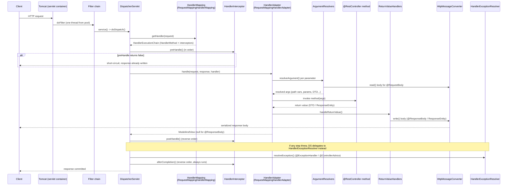

# Spring MVC Request Lifecycle & REST API Design

## 1. What

Spring MVC is the **servlet-stack** web framework at the heart of Spring Boot's `spring-boot-starter-web`. Its architectural centerpiece is the **`DispatcherServlet`** — a single **Front Controller** servlet that intercepts every HTTP request, orchestrates a fixed pipeline of collaborators (handler mapping, argument resolution, invocation, view/message rendering, exception handling), and writes the response. Everything you annotate with `@RestController`, `@GetMapping`, `@RequestBody`, `@ResponseBody`, or `ResponseEntity` is machinery that plugs into slots of this pipeline.

On Spring Boot 3.2.x / Java 17, the namespace is `jakarta.*` (e.g. `jakarta.servlet.Filter`, `jakarta.servlet.http.HttpServletRequest`), the embedded container is Tomcat by default, and Jackson 2 is the default JSON (de)serializer.

Two mental models to hold simultaneously:

- **The Front Controller pattern** — one servlet (`DispatcherServlet`) receives all traffic and delegates to specialized strategy beans, instead of many hand-written servlets each with their own `doGet`/`doPost`.
- **REST as a constraint set over HTTP** — resources are nouns, HTTP methods carry semantics (safety/idempotency), status codes are the primary error channel, and representations are negotiated via `Content-Type`/`Accept`.

## 2. Why

- **Separation of concerns** — routing, deserialization, validation, invocation, serialization, and error handling are each isolated behind an interface (`HandlerMapping`, `HandlerAdapter`, `HandlerMethodArgumentResolver`, `HttpMessageConverter`, `HandlerExceptionResolver`). You override one slice without touching the rest.
- **Convention over configuration** — Boot auto-configures the whole pipeline (`WebMvcAutoConfiguration`). You write controllers; the framework wires the front controller, converters, and default resolvers.
- **Testability** — because the pipeline is bean-based, `@WebMvcTest` + `MockMvc` can drive the full `DispatcherServlet` flow without a real socket.
- **Interview relevance** — "what happens between the browser sending a request and your controller method running?" is a canonical FAANG backend screen question. Knowing the exact ordering (filters → dispatcher → mapping → interceptor.preHandle → adapter → argument resolvers → method → return-value handlers → converters → postHandle → afterCompletion) separates people who *use* Spring from people who *understand* it.
- **API quality** — correct method/status/idempotency semantics are what make an API cacheable, retry-safe, and debuggable at scale. Getting `PUT` vs `PATCH` or `409` vs `422` wrong causes real production incidents (double-charges, broken retries).

## 3. How

### 3.1 The full request lifecycle through DispatcherServlet



Component-by-component responsibilities:

| Component | Interface | Role in the flow |
|---|---|---|
| Servlet container | `jakarta.servlet.Servlet` | Accepts the TCP connection, parses HTTP, assigns **one worker thread** from the Tomcat pool, calls `service()`. |
| Filter chain | `jakarta.servlet.Filter` | Container-level, runs **before and after** `DispatcherServlet`. Cross-cutting on the raw request/response (auth, CORS, gzip, `OncePerRequestFilter`). Can block the request entirely. |
| `DispatcherServlet` | `HttpServlet` | The **Front Controller**. `doDispatch()` orchestrates the entire pipeline below. |
| `HandlerMapping` | `HandlerMapping` | Resolves request → `HandlerExecutionChain` (the `HandlerMethod` + matching interceptors). Primary impl: `RequestMappingHandlerMapping`. |
| `HandlerInterceptor` | `HandlerInterceptor` | Spring-level hooks: `preHandle` (before method), `postHandle` (after method, before view), `afterCompletion` (always, even on exception). Has access to the resolved handler. |
| `HandlerAdapter` | `HandlerAdapter` | Knows *how to invoke* a given handler type. For annotated controllers: `RequestMappingHandlerAdapter`. |
| Argument resolvers | `HandlerMethodArgumentResolver` | Bind each method parameter from the request (`@RequestBody`, `@PathVariable`, etc.). |
| Controller method | your code | Business logic; returns a DTO, `ResponseEntity`, `void`, `String` (view), etc. |
| Return-value handlers | `HandlerMethodReturnValueHandler` | Turn the return value into a response (or `ModelAndView`). |
| `HttpMessageConverter` | `HttpMessageConverter<T>` | (De)serialize body ↔ Java objects based on media type. Default JSON: `MappingJackson2HttpMessageConverter`. |
| `HandlerExceptionResolver` | `HandlerExceptionResolver` | Catches exceptions thrown anywhere in dispatch and maps them to a response. Backs `@ExceptionHandler` / `@ControllerAdvice`. |
| `ViewResolver` | `ViewResolver` | Only for view-based (`@Controller` returning a template name); skipped entirely for `@ResponseBody`. |

> [!IMPORTANT]
> Filters wrap `DispatcherServlet` from the **outside** (they see requests that never match any handler, and requests rejected by security). Interceptors live **inside** `DispatcherServlet` and only fire once a handler is resolved — so they can see *which* `HandlerMethod` will run. This is why Spring Security's core lives in a filter (`FilterChainProxy`), not an interceptor. (See the dedicated filter-vs-interceptor note in this repo.)

### 3.2 How a handler is resolved

At startup, `RequestMappingHandlerMapping.afterPropertiesSet()` scans every `@Controller`/`@RestController` bean, reads the `@RequestMapping` metadata on each method, and builds a registry mapping **`RequestMappingInfo` → `HandlerMethod`**.

A `RequestMappingInfo` is a composite of *conditions*:

| Condition | Source | Example |
|---|---|---|
| Path pattern | `@GetMapping("/orders/{id}")` | `/orders/{id}` |
| HTTP method | `@PostMapping` etc. | `POST` |
| Params | `params = "type=full"` | request must have `?type=full` |
| Headers | `headers = "X-API-Version=2"` | header must match |
| Consumes | `consumes = "application/json"` | matched against request `Content-Type` |
| Produces | `produces = "application/json"` | matched against request `Accept` |

At request time, `getHandler()` finds all `RequestMappingInfo`s whose conditions match, then picks the **most specific** using `RequestMappingInfo.compareTo` (more specific path patterns, then method, then params/headers, then media types win). Ambiguity throws `IllegalStateException`; no match throws `NoHandlerFoundException` (or yields a 404 depending on config). Since Spring 6 / Boot 3, path matching uses `PathPattern` (parsed, faster) by default rather than the old `AntPathMatcher`.

```java
@RestController
@RequestMapping("/api/v1/orders")               // class-level prefix
public class OrderController {

    // RequestMappingInfo: GET /api/v1/orders/{id}, produces application/json
    @GetMapping(value = "/{id}", produces = MediaType.APPLICATION_JSON_VALUE)
    public OrderDto getOne(@PathVariable long id) { ... }

    // More specific than the generic list mapping because of the params condition
    @GetMapping(params = "status")
    public List<OrderDto> byStatus(@RequestParam OrderStatus status) { ... }
}
```

### 3.3 Argument resolvers

`RequestMappingHandlerAdapter` holds an ordered list of `HandlerMethodArgumentResolver`s. For each controller-method parameter it walks the list, and the first resolver whose `supportsParameter()` returns true calls `resolveArgument()` to produce the value.

| Annotation / type | Resolver responsibility | Notes |
|---|---|---|
| `@RequestBody Dto` | Deserialize the request body via an `HttpMessageConverter` chosen by `Content-Type`. | One per method (single body). Add `@Valid` to trigger validation. |
| `@PathVariable` | Extract a URI template variable. | `@PathVariable("id")` if name differs from param. |
| `@RequestParam` | Query-string or form field. | `required`, `defaultValue`; a `Map<String,String>` grabs all. |
| `@RequestHeader` | A single header value. | `@RequestHeader("Authorization")`. |
| `@ModelAttribute` | Bind flat query/form params onto an object (setter/field binding). | Default for non-annotated complex types; **not** JSON. |
| `@RequestPart` | A part of a `multipart/form-data` request (can itself be JSON or a file). | Pairs with `MultipartFile`. |
| `Pageable` (Spring Data) | Build page/size/sort from query params. | Needs `spring-data-web`; resolved by `PageableHandlerMethodArgumentResolver`. |
| `HttpServletRequest`, `@AuthenticationPrincipal`, etc. | Various built-in resolvers. | — |

```java
@PostMapping(consumes = MediaType.MULTIPART_FORM_DATA_VALUE)
public ResponseEntity<Void> upload(
        @PathVariable long orderId,                        // from URI
        @RequestParam(defaultValue = "false") boolean dryRun, // from ?dryRun=
        @RequestHeader("X-Trace-Id") String traceId,       // from header
        @RequestPart @Valid OrderMetadata metadata,        // JSON part, validated
        @RequestPart MultipartFile invoice,                // file part
        @PageableDefault(size = 20) Pageable page) {       // page/size/sort
    // ...
    return ResponseEntity.accepted().build();
}
```

> [!WARNING]
> `@RequestParam` binding for a **complex object** is a common trap: without an annotation Spring treats it as `@ModelAttribute` and binds individual query params via setters — it will **not** parse a JSON body. If you want JSON in, you must use `@RequestBody`.

### 3.4 HttpMessageConverter & content negotiation

`@RequestBody`/`@ResponseBody` do **not** serialize anything themselves — they delegate to `HttpMessageConverter`s. The adapter iterates its converter list and picks the first that `canRead`/`canWrite` the target type for the negotiated media type.

- **Reading** (`@RequestBody`): media type comes from the request `Content-Type`. `application/json` → `MappingJackson2HttpMessageConverter` (Jackson `ObjectMapper`).
- **Writing** (`@ResponseBody`): media type is chosen by **content negotiation** — the request `Accept` header intersected with the `produces` condition and the converters that can write the return type. `ContentNegotiationManager` also supports (disabled-by-default) path-extension / query-param strategies.
- Other converters: `StringHttpMessageConverter`, `ByteArrayHttpMessageConverter`, `Jaxb2RootElementHttpMessageConverter` (XML if on classpath), `ResourceHttpMessageConverter`.

```java
// Content-Type: application/json  -> Jackson reads body into CreateOrderRequest
// Accept: application/json        -> Jackson writes OrderDto back out
@PostMapping(consumes = "application/json", produces = "application/json")
public OrderDto create(@Valid @RequestBody CreateOrderRequest req) {
    return orderService.create(req);   // returned object serialized by converter
}
```

If the client sends an unsupported `Content-Type` you get **415 Unsupported Media Type**; if it demands an `Accept` you cannot produce, **406 Not Acceptable**.

### 3.5 @RestController vs @Controller + @ResponseBody, and @ResponseStatus

```java
@Controller                        // returns view names by default
public class PageController {
    @GetMapping("/home")
    public String home() { return "home"; }   // resolved by ViewResolver -> home.html

    @GetMapping("/api/ping")
    @ResponseBody                              // opt this one method out of view resolution
    public Map<String,String> ping() { return Map.of("status", "ok"); }
}

@RestController                    // == @Controller + @ResponseBody on every method
public class OrderApi {
    @GetMapping("/orders/{id}")
    public OrderDto get(@PathVariable long id) { ... }  // body serialized, no view
}
```

- `@RestController` = `@Controller` + `@ResponseBody` at the class level. Every return value is written to the body via converters; no view resolution.
- `@ResponseStatus(HttpStatus.CREATED)` on a method (or exception class) sets the status without a `ResponseEntity`. It is static — you cannot vary it per invocation, which is exactly why `ResponseEntity` exists.

### 3.6 ResponseEntity — full control of status/headers/body

Use `ResponseEntity<T>` when the **status or headers must vary at runtime** (created-with-Location, conditional 304, no-content deletes, dynamic caching). Use a bare DTO return type when the response is always `200 OK` with a JSON body — it is cleaner.

```java
@PostMapping
public ResponseEntity<OrderDto> create(@Valid @RequestBody CreateOrderRequest req) {
    OrderDto created = service.create(req);
    URI location = ServletUriComponentsBuilder
            .fromCurrentRequest().path("/{id}")
            .buildAndExpand(created.id()).toUri();
    return ResponseEntity.created(location)   // 201 + Location header
            .eTag('"' + created.version() + '"')
            .body(created);
}

@GetMapping("/{id}")
public ResponseEntity<OrderDto> get(@PathVariable long id) {
    return service.find(id)
            .map(ResponseEntity::ok)                 // 200 + body
            .orElseGet(() -> ResponseEntity.notFound().build()); // 404, no body
}

@DeleteMapping("/{id}")
public ResponseEntity<Void> delete(@PathVariable long id) {
    service.delete(id);
    return ResponseEntity.noContent().build();       // 204
}
```

> [!IMPORTANT]
> Boot 3 also offers `ProblemDetail` / `ErrorResponse` (RFC 9457, formerly RFC 7807) as a first-class body type for errors — `application/problem+json` with `type`, `title`, `status`, `detail`, `instance`. Prefer it over ad-hoc error DTOs. (See the dedicated exception-handling note.)

### 3.7 REST API design best practices

**Resource naming** — nouns, plural collections, hierarchy for relationships. Avoid verbs in paths (the HTTP method *is* the verb).

| Bad | Good |
|---|---|
| `GET /getOrder?id=5` | `GET /orders/5` |
| `POST /orders/5/delete` | `DELETE /orders/5` |
| `GET /order/list` | `GET /orders` |
| `POST /createOrderItem` | `POST /orders/5/items` |

**HTTP methods — safety & idempotency:**

| Method | Purpose | Safe (no side effects) | Idempotent (N calls == 1 call) | Typical success |
|---|---|---|---|---|
| GET | Read | Yes | Yes | 200 |
| HEAD | Read headers only | Yes | Yes | 200 |
| POST | Create / non-idempotent action | No | **No** | 201 (or 200/202) |
| PUT | Full replace / create-at-known-URI | No | **Yes** | 200 / 201 / 204 |
| PATCH | Partial update | No | Not necessarily | 200 / 204 |
| DELETE | Remove | No | **Yes** | 204 (200/404 acceptable) |

**Status codes — pick precisely:**

| Code | Meaning | When |
|---|---|---|
| 200 OK | Success with body | GET, successful PUT/PATCH returning state |
| 201 Created | Resource created | POST/PUT that creates; include `Location` |
| 202 Accepted | Async accepted, not yet done | long-running / queued work |
| 204 No Content | Success, empty body | DELETE, PUT with no returned representation |
| 400 Bad Request | Malformed / unparseable | bad JSON, wrong types |
| 401 Unauthorized | Not authenticated | missing/invalid credentials |
| 403 Forbidden | Authenticated but not allowed | authz failure |
| 404 Not Found | Resource absent | unknown id |
| 409 Conflict | State conflict | optimistic-lock version clash, duplicate create |
| 422 Unprocessable Entity | Syntactically valid but semantically invalid | validation failures (`@Valid`) |
| 500 Internal Server Error | Unhandled server fault | bug / unexpected exception |

> [!WARNING]
> `400` vs `422`: `400` means "I couldn't even parse this" (malformed JSON, wrong content-type). `422` means "I parsed it fine, but the values violate business/validation rules." Many teams standardize bean-validation failures on `422`; Spring's default for `MethodArgumentNotValidException` is `400`. Pick one convention and apply it consistently via `@ControllerAdvice`.

**Pagination** — never return unbounded collections. Offset/limit (`?page=0&size=20&sort=createdAt,desc`, resolved into `Pageable`) is simplest; **cursor/keyset** (`?after=<opaque-cursor>&size=20`) is preferred at scale because offset pagination degrades and skips/duplicates rows under concurrent writes. Return total count / next-cursor in the body or headers.

**Versioning:**

| Strategy | Example | Trade-off |
|---|---|---|
| URI | `/api/v1/orders` | Most visible, cache- and browser-friendly, easy to route; "impure" REST. |
| Header | `Accept: application/vnd.acme.v2+json` | Clean URIs, content-negotiation-native; harder to test/debug, cache keys must vary on header. |
| Query param | `/orders?version=2` | Simple; pollutes query space, weak caching. |

URI versioning is the pragmatic default for public APIs.

**HATEOAS** — level 3 of the Richardson Maturity Model: responses embed links to valid next actions (`_links.self`, `_links.cancel`). Spring HATEOAS (`EntityModel`, `Link`, `linkTo`) supports it. Rare in practice for internal microservices, but worth naming in interviews.

**Idempotency keys for POST** — because POST is not idempotent, safe retries need a client-supplied `Idempotency-Key` header. The server stores the key + result; a replay returns the original response instead of creating a duplicate. Essential for payments and any create that a client may retry after a timeout.

```java
@PostMapping("/payments")
public ResponseEntity<PaymentDto> pay(
        @RequestHeader("Idempotency-Key") String key,
        @Valid @RequestBody PaymentRequest req) {
    // If key already processed, return the stored response (same status/body).
    return idempotencyService.execute(key, () -> paymentService.charge(req));
}
```

### 3.8 Exception handling touchpoint

When any stage of `doDispatch` throws, `DispatcherServlet` does not propagate immediately — it asks its ordered `HandlerExceptionResolver`s to produce a response. `ExceptionHandlerExceptionResolver` is the one that backs `@ExceptionHandler` methods (local to a controller or global via `@ControllerAdvice`/`@RestControllerAdvice`). `ResponseStatusExceptionResolver` handles `@ResponseStatus`-annotated exceptions and `ResponseStatusException`. `DefaultHandlerExceptionResolver` maps built-in Spring MVC exceptions (e.g. `HttpMessageNotReadableException` → 400) to sensible statuses. `afterCompletion` interceptors still run afterward.

```java
@RestControllerAdvice
class ApiExceptionHandler {
    @ExceptionHandler(EntityNotFoundException.class)
    ProblemDetail notFound(EntityNotFoundException e) {
        return ProblemDetail.forStatusAndDetail(HttpStatus.NOT_FOUND, e.getMessage());
    }
}
```

(Full treatment — resolver ordering, `ResponseEntityExceptionHandler`, `ProblemDetail` — is in the dedicated exception-handling note.)

### 3.9 Validation & content-negotiation touchpoint

Putting `@Valid` (or `@Validated`) on a `@RequestBody` parameter makes the argument resolver run Jakarta Bean Validation (`jakarta.validation`) after deserialization. A constraint violation throws **`MethodArgumentNotValidException`**, which `DefaultHandlerExceptionResolver` maps to **400** by default (many teams remap to 422 via advice). For `@RequestParam`/`@PathVariable` validated at the method level (`@Validated` on the class), the exception is `ConstraintViolationException` / `HandlerMethodValidationException` (Boot 3.2+).

```java
public record CreateOrderRequest(
        @NotBlank String customerId,
        @Min(1) int quantity,
        @NotNull @Valid AddressDto shipTo) {}   // @Valid cascades into nested object
```

(A dedicated validation note covers custom constraints, groups, and `@ControllerAdvice` mapping.)

### 3.10 Threading model

Spring MVC on the servlet stack is **one thread per request**: Tomcat's connector pool (`server.tomcat.threads.max`, default 200) assigns a worker thread that runs the *entire* dispatch synchronously and blocks on I/O (DB, downstream HTTP) until the response is written. Throughput is bounded by `threads.max` × (1 / avg request time); when all threads are blocked on slow downstreams, new requests queue and eventually time out — a classic thread-pool-exhaustion cascade.

Escape hatches on the servlet stack: return `Callable<T>` / `DeferredResult<T>` / `CompletableFuture<T>` to release the container thread while async work runs, or (Boot 3 + Java 21) enable **virtual threads** (`spring.threads.virtual.enabled=true`) so blocking calls become cheap. This contrasts with **Spring WebFlux**, which runs on a small fixed **event-loop** (Netty) with non-blocking I/O — a handful of threads serve thousands of concurrent connections, at the cost of a fully reactive (`Mono`/`Flux`) programming model and no blocking calls anywhere in the chain. (A dedicated MVC-vs-WebFlux note goes deeper.)

## 4. Interview Angles

- **Q: Walk me through what happens from the moment a request hits the server to the response.** Container assigns a thread → filter chain → `DispatcherServlet.doDispatch` → `HandlerMapping` resolves a `HandlerExecutionChain` → interceptor `preHandle` → `HandlerAdapter` invokes the method, using `HandlerMethodArgumentResolver`s (and `HttpMessageConverter` for `@RequestBody`) to bind params → controller runs → `HandlerMethodReturnValueHandler` + converter serialize the return value → `postHandle` → `afterCompletion`. Exceptions divert to `HandlerExceptionResolver`. Name `RequestMappingHandlerMapping`/`RequestMappingHandlerAdapter` explicitly — that specificity is the signal.

- **Q: What exactly is the DispatcherServlet?** The single **Front Controller** servlet mapped (by default) to `/`. It owns no business logic; it orchestrates strategy beans (mappings, adapters, resolvers, converters, exception resolvers) discovered from the `ApplicationContext`. Boot auto-registers it in `DispatcherServletAutoConfiguration`.

- **Q: How does Spring know which method to call?** `RequestMappingHandlerMapping` builds a `RequestMappingInfo → HandlerMethod` map at startup from `@RequestMapping` metadata. At request time it matches on path/method/params/headers/consumes/produces and picks the most specific; ambiguous matches throw.

- **Q: `@RequestBody` vs `@ModelAttribute` vs `@RequestParam`?** `@RequestBody` deserializes the whole body via an `HttpMessageConverter` (JSON). `@RequestParam` pulls a single query/form value. `@ModelAttribute` (the default for unannotated complex params) binds many flat query/form fields onto an object via setters — it never parses JSON.

- **Q: Who does the JSON (de)serialization?** Not `@RequestBody` itself — `MappingJackson2HttpMessageConverter` (Jackson `ObjectMapper`), selected by content negotiation against `Content-Type` (reading) and `Accept` + `produces` (writing).

- **Q: `@RestController` vs `@Controller`?** `@RestController` = `@Controller` + `@ResponseBody`, so every return value goes through converters to the body with no view resolution.

- **Q: When do you use `ResponseEntity` over returning a DTO?** When status or headers vary at runtime — `201 Created` + `Location`, `204 No Content`, `404`, `304` with ETag, dynamic cache headers. For an always-200 JSON payload, a bare DTO is cleaner.

- **Q: PUT vs PATCH vs POST — which are idempotent?** PUT and DELETE are idempotent (repeat = same end state); POST is not; PATCH is not necessarily. This drives whether clients/proxies may safely retry — POST needs an `Idempotency-Key` to be retry-safe.

- **Q: 400 vs 422 vs 409?** 400 = unparseable/malformed. 422 = parsed but violates validation/business rules. 409 = state conflict (optimistic-lock version clash, duplicate). Be consistent via `@ControllerAdvice`.

- **Q: How do you make a POST safe to retry?** Client sends an `Idempotency-Key`; server persists key→result and returns the stored response on replay instead of re-executing. Critical for payments.

- **Q: Filters vs interceptors — where and why?** Filters are servlet-level and wrap `DispatcherServlet` from outside (see all traffic, run before routing — Spring Security lives here). Interceptors are Spring-level, fire only after a handler is resolved, and can see the target `HandlerMethod` (`preHandle`/`postHandle`/`afterCompletion`).

- **Q: Where does exception handling plug in?** `DispatcherServlet` routes any thrown exception to its `HandlerExceptionResolver` chain; `ExceptionHandlerExceptionResolver` backs `@ExceptionHandler`/`@ControllerAdvice`. `afterCompletion` still runs.

- **Q: What breaks under load in MVC, and how do you fix it?** One-thread-per-request means a slow downstream blocks a Tomcat worker; once the 200-thread pool is exhausted, requests queue and time out. Fixes: async return types (`DeferredResult`/`CompletableFuture`), virtual threads (Java 21), circuit breakers/timeouts, or moving to WebFlux for genuinely high-concurrency I/O-bound workloads.

- **Q: How do you version and paginate a public REST API?** URI versioning (`/api/v1/...`) for visibility and caching; cursor/keyset pagination over offset for scale and consistency under concurrent writes; always bound page size.
