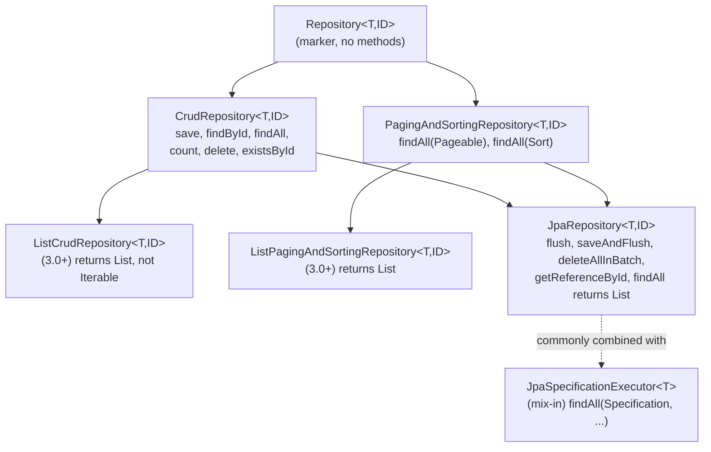
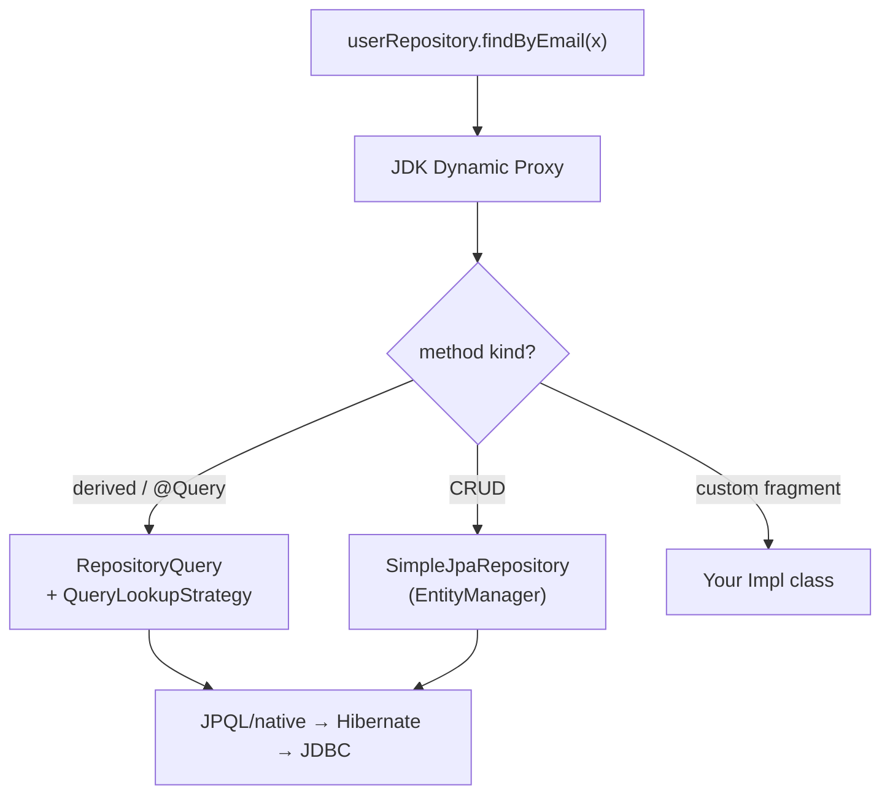
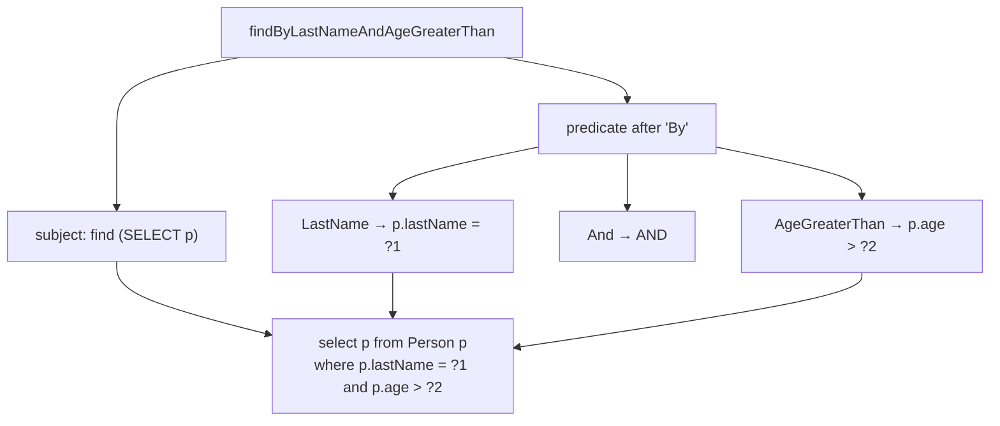

# Spring Data JPA — Repository Abstraction

> Scope note: this file covers the **repository abstraction** — declaring interfaces, derived queries, `@Query`, paging, projections, specifications, `@EntityGraph`, auditing. The **entity/mapping side** (associations, fetch types, N+1, Hibernate first-level cache, flush/dirty-checking internals) lives in the sibling notes in this folder (`jpa entity associations`, `n+1 problem`, `hibernate internals`, `transactions`). This note points to them where they overlap rather than re-explaining them.

---

## 1. What

Spring Data JPA is a layer **on top of** JPA/Hibernate that eliminates boilerplate DAO code. You declare a **Java interface** with method signatures; Spring Data generates the implementation at runtime as a **dynamic proxy**. You never write a `SELECT`, a `session.get()`, or an `EntityManager.createQuery()` for the common cases.

The abstraction is delivered through a small hierarchy of interfaces you extend, plus three ways to specify *what* a method should do:

| Mechanism | You express intent via | Example |
| --- | --- | --- |
| **Derived query methods** | the method *name* | `findByEmailAndActiveTrue` |
| **`@Query`** | an explicit JPQL/native string | `@Query("select u from User u where ...")` |
| **`JpaSpecificationExecutor`** | programmatic `Criteria` predicates | `findAll(spec, pageable)` |

The one backing implementation class for everything is **`SimpleJpaRepository`** — every proxy delegates CRUD to it.

---

## 2. Why

- **Kill DAO boilerplate.** A hand-rolled DAO for one entity is ~150 lines of near-identical CRUD. The interface replaces it with zero implementation lines.
- **Compile-time-ish safety.** Derived method names and `@Query` JPQL are validated **at application startup** (with `bootstrap-mode=default`), so a typo fails fast instead of at 3am in production.
- **Consistency.** Every repository exposes the same `save`/`findById`/`findAll`/`delete`/paging contract, so the team learns one API.
- **Portability of concerns.** Paging, sorting, projections, and dynamic filtering are cross-cutting; the abstraction standardizes them instead of every dev reinventing offset math and DTO copying.
- **Escape hatches everywhere.** When derived queries are not enough → `@Query`. When static queries are not enough → `Specification`/QueryDSL. When you need full control → inject `EntityManager` in a custom fragment. Nothing is a dead end.

> [!IMPORTANT]
> Spring Data JPA is **not** an ORM. It is a *repository* framework that delegates to a JPA provider (Hibernate by default in Boot). All the object-relational mechanics — dirty checking, cascade, lazy loading, the persistence context — belong to Hibernate. See the Hibernate-internals sibling note.

---

## 3. How

### 3.1 The repository interface hierarchy

You get behavior by **extending** an interface. Each level up the chain adds methods.



| Interface | Adds | Return style |
| --- | --- | --- |
| `Repository<T,ID>` | nothing — pure marker so Spring can detect the type | — |
| `CrudRepository<T,ID>` | `save`, `saveAll`, `findById`, `existsById`, `findAll`, `count`, `deleteById`, `delete`, `deleteAll` | `Iterable` |
| `ListCrudRepository<T,ID>` (3.0+) | same as above | **`List`** |
| `PagingAndSortingRepository<T,ID>` | `findAll(Sort)`, `findAll(Pageable)` | `Iterable` / `Page` |
| `ListPagingAndSortingRepository<T,ID>` (3.0+) | same | **`List`** / `Page` |
| `JpaRepository<T,ID>` | `flush`, `saveAndFlush`, `saveAllAndFlush`, `deleteAllInBatch`, `deleteAllByIdInBatch`, `getReferenceById`; JPA-specific batch ops; `findAll`/`saveAll` return `List` | `List` |

> [!IMPORTANT]
> In Spring Data 3.0 (`spring-data-jpa` 3.x, shipped with Boot 3.x), `CrudRepository` still returns `Iterable`. The new **`ListCrudRepository`** / **`ListPagingAndSortingRepository`** exist precisely so you get `List` back without extending the heavier `JpaRepository`. If you want JPA batch methods, extend `JpaRepository` (it also returns `List`). If you want to stay provider-agnostic but still get `List`, extend `ListCrudRepository`.

```java
public interface UserRepository extends JpaRepository<User, Long>,
                                        JpaSpecificationExecutor<User> {
    // no implementation — Spring Data provides it
}
```

### 3.2 How it actually works — the proxy mechanism

You never write a class. At startup:

1. `@EnableJpaRepositories` (auto-configured by `JpaRepositoriesAutoConfiguration` — you don't add it in Boot) scans for interfaces extending `Repository`.
2. For each, a `JpaRepositoryFactoryBean` produces a `RepositoryFactory`.
3. The factory creates a **JDK dynamic proxy** implementing your interface.
4. The proxy's invocation handler routes each call:
   - CRUD methods → the shared **`SimpleJpaRepository<T,ID>`** instance (backed by an injected `EntityManager`).
   - Derived/`@Query` methods → a **`RepositoryQuery`** built from the method metadata (name-parse or annotation).
   - Custom fragment methods → your hand-written implementation class.



> [!IMPORTANT]
> Because everything funnels through `SimpleJpaRepository` with an `EntityManager`, repositories participate in the **current persistence context / transaction**. `save()` is really `EntityManager.persist()` (new) or `merge()` (detached) — see 3.11.

### 3.3 Derived query methods (query from method name)

Spring parses the method name into `subject` (`find`/`read`/`get`/`query`/`count`/`exists`/`delete`) + `By` + a `predicate` of property expressions joined by keywords.

```java
public interface PersonRepository extends JpaRepository<Person, Long> {

    List<Person> findByLastNameAndAgeGreaterThan(String lastName, int age);
    Optional<Person> findByEmailIgnoreCase(String email);
    List<Person> findByLastNameOrderByAgeDesc(String lastName);
    List<Person> findByAgeBetween(int lo, int hi);
    List<Person> findByLastNameLike(String pattern);        // "%son%"
    List<Person> findByCityIn(Collection<String> cities);
    List<Person> findFirst5ByOrderByCreatedAtDesc();        // Top/First N
    List<Person> findDistinctByLastName(String lastName);
    boolean existsByEmail(String email);
    long countByActiveTrue();
    Stream<Person> findByActiveTrue();                       // must close the stream
    Page<Person> findByLastName(String lastName, Pageable pageable);

    @Transactional
    long deleteByLastName(String lastName);                  // returns delete count
}
```

**Decoding a name into JPQL:**



| Method name | Generated JPQL predicate |
| --- | --- |
| `findByEmail` | `p.email = ?1` |
| `findByAgeLessThanEqual` | `p.age <= ?1` |
| `findByNameContaining` | `p.name like %?1%` |
| `findByStartDateAfter` | `p.startDate > ?1` |
| `findByManagerIsNull` | `p.manager is null` |
| `findByActiveTrue` | `p.active = true` |
| `findByAddress_City` (nested) | `p.address.city = ?1` |

Return types supported: `Optional<T>`, `T` (throws if >1), `List<T>`, `Stream<T>`, `Page<T>`, `Slice<T>`, `long`/`int` (counts), `boolean` (`exists`), delete counts.

> [!WARNING]
> Derived method names are the **most fragile** part of the API. `findByCustomerAddressCityAndStatusInAndCreatedAtBetweenOrderByCreatedAtDesc` is unreadable, ambiguous when property names overlap traversal keywords, and impossible to code-review. **Rule of thumb: once a derived name exceeds ~2–3 conditions, switch to `@Query`.** A misspelled *property* (not keyword) — e.g. `findByEmial` — fails at **startup** (good, fast feedback), not at runtime.

### 3.4 `@Query` — explicit JPQL and native SQL

```java
public interface UserRepository extends JpaRepository<User, Long> {

    // JPQL, named parameters
    @Query("select u from User u where u.status = :status and u.age >= :minAge")
    List<User> findActiveAdults(@Param("status") Status status,
                                @Param("minAge") int minAge);

    // JPQL, positional parameters
    @Query("select u from User u where u.email = ?1")
    Optional<User> byEmail(String email);

    // Native SQL
    @Query(value = "select * from users u where u.tenant_id = :t", nativeQuery = true)
    List<User> byTenantNative(@Param("t") long tenantId);

    // Constructor expression → DTO projection (see 3.6)
    @Query("""
           select new com.acme.dto.UserSummary(u.id, u.email, u.age)
           from User u where u.status = :s
           """)
    List<UserSummary> summaries(@Param("s") Status status);
}
```

**Modifying queries** — any `UPDATE`/`DELETE` (or `INSERT` in native) needs `@Modifying`, and a write transaction:

```java
@Modifying(clearAutomatically = true, flushAutomatically = true)
@Query("update User u set u.active = false where u.lastLogin < :cutoff")
@Transactional
int deactivateStale(@Param("cutoff") Instant cutoff);   // returns rows affected
```

| Flag | Effect |
| --- | --- |
| `@Modifying` | tells Spring it's not a `SELECT`; return `int`/`void` (rows affected) |
| `flushAutomatically = true` | flush pending persistence-context changes **before** the query runs |
| `clearAutomatically = true` | clear the L1 cache **after**, so subsequently loaded entities reflect the bulk change |

> [!WARNING]
> Bulk `@Modifying` queries run **directly against the DB** and bypass the persistence context: cascade, `@Version` optimistic locking, entity lifecycle callbacks, and the L1 cache are **not** applied. Entities already loaded in the current context become **stale** unless you set `clearAutomatically = true`. This is the classic "I updated 1000 rows but my loaded entity still shows the old value" bug.

- **JPQL vs native**: JPQL is portable and validated against the entity model at startup; native SQL is DB-specific, not validated by JPA, and returns `Object[]`/entities/DTOs but can't use JPQL features like `join fetch` the same way. Prefer JPQL unless you need vendor SQL (window functions, hints, `INSERT ... SELECT`).
- **Named params (`:x` + `@Param`) vs positional (`?1`)**: named is strongly preferred — refactor-safe and readable. With Java 17 you must compile with `-parameters` to omit `@Param`; otherwise always annotate.

### 3.5 Paging and sorting

```java
Pageable pageable = PageRequest.of(0, 20, Sort.by("createdAt").descending());

Page<User>  page  = userRepository.findByStatus(Status.ACTIVE, pageable);
Slice<User> slice = userRepository.findByStatus(Status.ACTIVE, pageable); // return type Slice
List<User>  list  = userRepository.findByStatus(Status.ACTIVE, pageable); // no metadata

long total       = page.getTotalElements();  // Page only — triggers COUNT query
int  totalPages  = page.getTotalPages();
boolean hasNext  = slice.hasNext();           // Slice: fetches size+1 rows, no COUNT
List<User> rows  = page.getContent();
```

| Return type | Extra query | Gives you | Use when |
| --- | --- | --- | --- |
| `List<T>` | none | rows only | you already know there's no next page / small set |
| `Slice<T>` | none (fetches `size + 1`) | `hasNext()`, content | infinite scroll / "load more" UI |
| `Page<T>` | **extra `COUNT(*)`** | total elements, total pages | classic numbered pagination UI |

> [!WARNING]
> `Page<T>` issues a **second COUNT query** every call — on a large filtered table that count can be as expensive as the data query. Worse, **OFFSET pagination degrades on deep pages**: `LIMIT 20 OFFSET 100000` forces the DB to scan and discard 100k rows. For large datasets use **keyset / seek pagination** — carry the last row's sort key: `where (created_at, id) < (:lastCreatedAt, :lastId) order by created_at desc, id desc limit 20`. It's O(page size) regardless of depth. Spring Data 3.1+ has first-class **`ScrollPosition` / `scroll(...)`** support for keyset scrolling.

```java
// Keyset seek — stable, no OFFSET, no COUNT
@Query("""
       select u from User u
       where u.createdAt < :lastCreatedAt
       order by u.createdAt desc
       """)
List<User> nextPage(@Param("lastCreatedAt") Instant lastCreatedAt, Pageable limit);
// call with PageRequest.of(0, 20)
```

### 3.6 Projections (fetch only what you need)

Projections avoid over-fetching entire entities (and their eager associations) when you only need a few columns.

**Interface-based — closed** (only property getters; Spring optimizes the SELECT to those columns):

```java
public interface UserView {          // closed projection
    Long getId();
    String getEmail();
}
List<UserView> findByStatus(Status status);
```

**Interface-based — open** (`@Value` SpEL; **forces full entity load** because SpEL may touch anything — no column optimization):

```java
public interface UserBadge {         // open projection
    @Value("#{target.firstName + ' ' + target.lastName}")
    String getFullName();
}
```

**Class/DTO-based** (a plain class/record; matched by constructor parameter names):

```java
public record UserSummary(Long id, String email, int age) {}
List<UserSummary> findByAgeGreaterThan(int age);   // or via constructor-expression @Query
```

**Dynamic projection** (caller picks the shape at runtime):

```java
<T> List<T> findByStatus(Status status, Class<T> type);
// repo.findByStatus(ACTIVE, UserView.class) or (ACTIVE, User.class)
```

> [!IMPORTANT]
> Closed interface projections and DTO/constructor projections let Hibernate emit a narrow `SELECT id, email` instead of `SELECT *` — which sidesteps a lot of over-fetching and lazy-association N+1 pain. See the dedicated **N+1** sibling note for the read-model strategy; projections are the query-side half of that story.

### 3.7 Specifications & the Criteria API (dynamic queries)

For queries whose shape depends on runtime input (search filters where each field is optional), neither derived names nor a static `@Query` fit. Extend **`JpaSpecificationExecutor<T>`** and compose `Specification` predicates (built on JPA Criteria).

```java
public class UserSpecs {
    public static Specification<User> hasStatus(Status s) {
        return (root, query, cb) -> s == null ? null : cb.equal(root.get("status"), s);
    }
    public static Specification<User> emailLike(String frag) {
        return (root, query, cb) ->
            frag == null ? null : cb.like(root.get("email"), "%" + frag + "%");
    }
}

// compose only the filters the caller supplied
Specification<User> spec = Specification.where(UserSpecs.hasStatus(status))
                                        .and(UserSpecs.emailLike(emailFragment));

Page<User> result = userRepository.findAll(spec, PageRequest.of(0, 20));
```

`Specification` supports `.and()`, `.or()`, `.not()`; a `null` predicate is skipped, which makes optional filters clean. `JpaSpecificationExecutor` gives `findAll(spec)`, `findAll(spec, Pageable)`, `findAll(spec, Sort)`, `findOne(spec)`, `count(spec)`, `exists(spec)`.

- **Specifications vs QueryDSL**: Specifications are pure JPA (no build-time codegen) and read well for a handful of predicates. **QueryDSL** generates type-safe `Q`-classes (`QUser.user.email.eq(...)`) via an annotation processor — more fluent and refactor-safe for large dynamic query surfaces, at the cost of a build step and generated sources. Reach for QueryDSL when you have many complex dynamic queries; Specifications are fine for moderate filtering.

### 3.8 `@EntityGraph` — fetch associations to defeat N+1

Declaratively tell a repository method which associations to fetch eagerly (a `join fetch` without writing JPQL), overriding the entity's default lazy mapping per query.

```java
public interface OrderRepository extends JpaRepository<Order, Long> {

    @EntityGraph(attributePaths = {"items", "customer"})
    List<Order> findByStatus(Status status);   // items & customer fetched in one go
}
```

This turns what would be 1 + N lazy `SELECT`s into a single (or few) join(s). Depth, `FetchType.LAZY` semantics, `fetch = FetchType.EAGER` pitfalls, `@BatchSize`, and `join fetch` trade-offs are covered in the **N+1** sibling note — `@EntityGraph` is just the repository-level lever for that problem.

### 3.9 Transactions in repositories

- Every method on `SimpleJpaRepository` is **`@Transactional`**; read methods are **`@Transactional(readOnly = true)`** (which sets the Hibernate flush mode to `MANUAL` and hints the JDBC driver / DB it's a read-only tx).
- If **no** transaction is active when you call a repo method, Spring starts one for that single call. This is why a lazy association accessed *after* the method returns throws `LazyInitializationException` — the tx (and persistence context) already closed.
- In real services, define the transaction boundary at the **service layer** with `@Transactional`, so multiple repository calls share one persistence context and commit atomically. The repository-level annotations then simply participate in that outer transaction (default propagation `REQUIRED`).

```java
@Service
class OrderService {
    @Transactional                       // one tx spanning both repo calls
    public void place(Order o) {
        orderRepo.save(o);
        inventoryRepo.decrement(o.getSku(), o.getQty());
    }
}
```

Propagation, isolation, rollback rules, and `readOnly` nuances are in the **transactions** sibling note.

### 3.10 Auditing

Populate created/modified timestamps and users automatically.

```java
@Configuration
@EnableJpaAuditing                       // switches auditing on
class JpaConfig {
    @Bean AuditorAware<String> auditorProvider() {
        return () -> Optional.ofNullable(SecurityContextHolder.getContext())
                             .map(c -> c.getAuthentication())
                             .map(Authentication::getName);
    }
}

@Entity
@EntityListeners(AuditingEntityListener.class)   // required on the entity
class Order {
    @CreatedDate      Instant createdAt;
    @LastModifiedDate Instant updatedAt;
    @CreatedBy        String  createdBy;
    @LastModifiedBy   String  updatedBy;
}
```

`@CreatedBy`/`@LastModifiedBy` resolve through the `AuditorAware` bean. Without `@EntityListeners(AuditingEntityListener.class)` on the entity, the annotations do nothing.

### 3.11 Gotchas

> [!WARNING]
> **`save()` has merge semantics — use the return value.** For a detached/new-with-id entity, `save()` calls `EntityManager.merge()`, which returns a **new managed copy** and does **not** make your argument managed. Mutations to the original after that are invisible. Always continue with the returned instance:
> ```java
> user.setName("x");
> User managed = repo.save(user);   // work with 'managed', not 'user'
> ```

- **`getReferenceById` vs `findById`.** `findById` (→ `EntityManager.find`) hits the DB now and returns `Optional<T>`. `getReferenceById` (→ `getReference`) returns a **lazy proxy without a DB hit** — useful to set a foreign-key association without loading the target (`order.setCustomer(repo.getReferenceById(id))`). But touching any field of the proxy outside a transaction throws `LazyInitializationException`, and a non-existent id surfaces as `EntityNotFoundException` only when dereferenced. (`getReferenceById` replaced the deprecated `getOne`/`getById`.)
- **Derived-name typos fail at startup, JPQL typos too** — with default bootstrap mode, Spring validates named queries and derived-property paths on context init. This fast feedback is a feature; don't switch to `bootstrap-mode=lazy/deferred` blindly, or you lose it.
- **Modifying queries bypass L1 cache** (see 3.4) — set `clearAutomatically`/`flushAutomatically` or manually flush/clear.
- **`Page` count query cost & OFFSET depth** (see 3.5) — prefer `Slice` or keyset when you don't need the total.
- **Open projections force full loads** (see 3.6) — only closed projections/DTOs get the narrow SELECT.
- **`deleteAll()` vs `deleteAllInBatch()`.** `deleteAll()` loads each entity and deletes one-by-one (fires cascade & lifecycle events, N deletes). `deleteAllInBatch()` issues a single `DELETE` — fast, but skips cascade and lifecycle callbacks.

---

## 4. Interview Angles

- **Q: You extend `JpaRepository` but write no implementation — what runs at runtime?** A JDK dynamic proxy created by `JpaRepositoryFactoryBean` at startup. CRUD calls delegate to a single `SimpleJpaRepository<T,ID>` backed by an `EntityManager`; query methods resolve to a `RepositoryQuery` built either from the parsed method name or the `@Query` annotation, chosen by the `QueryLookupStrategy`.

- **Q: Difference between `CrudRepository`, `JpaRepository`, and the new `ListCrudRepository`?** `CrudRepository` is the JPA-agnostic base returning `Iterable`. `JpaRepository` adds JPA-specific methods (`flush`, `saveAndFlush`, `deleteAllInBatch`, `getReferenceById`) and returns `List`. Spring Data 3.0's `ListCrudRepository`/`ListPagingAndSortingRepository` return `List` without pulling in the JPA-specific batch methods — a lighter choice when you want `List` but stay provider-neutral.

- **Q: When do you stop using derived query methods?** When the name exceeds ~2–3 conditions or gets ambiguous — readability and reviewability collapse. Move to `@Query` (JPQL) for anything non-trivial, and to `Specification`/QueryDSL when the query shape is dynamic.

- **Q: `Page` vs `Slice` — cost?** `Page` runs an extra `COUNT(*)` to compute total pages; `Slice` fetches `size + 1` rows to know `hasNext()` with no count. Use `Slice` for infinite scroll, `Page` for numbered pagination — and neither for deep pagination on big tables.

- **Q: Why is OFFSET pagination bad at scale, and what's the fix?** `OFFSET 100000` makes the DB scan and throw away 100k rows every request — O(offset). Keyset/seek pagination carries the last row's sort key in a `WHERE` clause and is O(page size) regardless of depth. Spring Data 3.1+ supports it via `ScrollPosition`/`scroll(...)`.

- **Q: What's dangerous about a `@Modifying` bulk update?** It executes straight against the DB, bypassing the persistence context: no cascade, no `@Version` optimistic-lock check, no entity callbacks, and the L1 cache goes stale. Set `clearAutomatically`/`flushAutomatically`, or flush/clear manually.

- **Q: `save()` returned an object — do I need it?** Yes. `save()` uses `merge()` for detached entities and returns a *new* managed instance; your original argument stays detached. Always use the return value.

- **Q: `findById` vs `getReferenceById`?** `findById` hits the DB immediately and returns `Optional`. `getReferenceById` returns a lazy proxy with no DB round-trip — ideal for setting an FK association — but throws `LazyInitializationException`/`EntityNotFoundException` when dereferenced outside a tx or when the row is missing.

- **Q: Closed vs open interface projection?** Closed (getters only) lets Spring/Hibernate select just those columns — efficient. Open (`@Value` SpEL) may reference arbitrary state, so Hibernate loads the full entity first — no column narrowing.

- **Q: Specifications vs QueryDSL?** Both build dynamic queries. Specifications are plain JPA Criteria, no codegen, readable for a few predicates. QueryDSL generates type-safe `Q`-classes via an annotation processor — more fluent and refactor-safe for large dynamic query surfaces, at the cost of a build step.

- **Q: Are repository methods transactional?** Yes — each `SimpleJpaRepository` method is `@Transactional`, reads are `readOnly = true`. But you should own the boundary at the service layer so multiple repo calls share one persistence context and commit atomically; otherwise each call gets its own short tx and lazy loading fails afterward.

- **Q: How do you fetch associations without N+1 from a repository method?** `@EntityGraph(attributePaths = {...})` on the method — a declarative join-fetch that overrides the mapping's lazy default per query. (Depth/fetch-strategy detail is in the N+1 note.)
