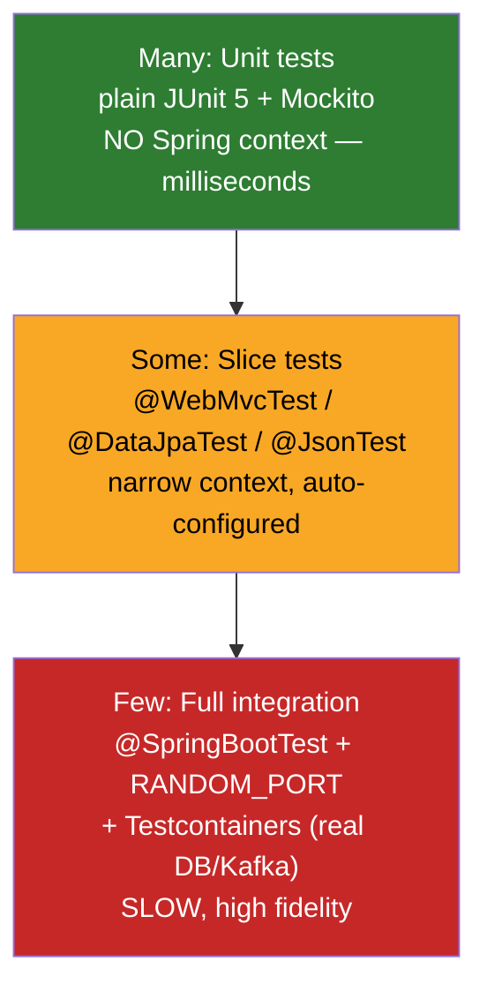
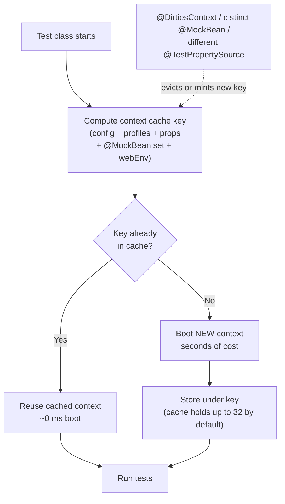

# Testing in Spring Boot

## 1. What

Testing in Spring Boot is a layered discipline: **plain unit tests** exercise a single class with no Spring container, **slice tests** (`@WebMvcTest`, `@DataJpaTest`, …) boot a narrow, auto-configured subset of the `ApplicationContext`, and **integration tests** (`@SpringBootTest`) wire up the whole thing (optionally over a real HTTP port and a real database via Testcontainers). The framework provides `spring-boot-starter-test` (JUnit 5, Mockito, AssertJ, JSONassert, Spring Test) and a rich set of annotations that trade off *fidelity* against *speed*. The central mental model is the **context cache**: booting a Spring context is expensive, so the test framework caches and reuses it across tests keyed by configuration — and knowing what invalidates that key is the difference between a 20-second suite and a 20-minute one.

## 2. Why

- **Correctness of wiring, not just logic** — a unit test proves your algorithm; only a Spring test proves your JPA mappings, transaction boundaries, JSON serialization, and security filters actually work together.
- **Speed is a design constraint** — CI feedback loops die when every test reboots a full context. Interviewers probe whether you know *when* to load a context and *how caching* keeps the suite fast.
- **Slice tests are a senior signal** — reaching for `@SpringBootTest` for a controller test is a junior tell. Knowing `@WebMvcTest` mocks the service layer shows layered thinking.
- **Testcontainers is the modern parity story** — "we test against H2 but run Postgres in prod" is a classic source of production bugs (dialect, JSONB, sequences, locking). Real-container testing is now table stakes at SDE2.
- **Flaky tests are a career tax** — shared mutable state, ordering assumptions, `@DirtiesContext` overuse, and time/async races are the usual culprits, and interviewers love asking you to diagnose them.

## 3. How

### 3.1 The testing pyramid in Spring



The base of the pyramid must be **plain unit tests with no Spring context**. A service class is just a Java object — construct it with mocked collaborators and call methods. Loading a context to test business logic wastes seconds per test and couples your logic tests to framework concerns.

```java
// Pure unit test — no @SpringBootTest, no @WebMvcTest, nothing Spring.
// Runs in single-digit milliseconds because no container boots.
@ExtendWith(MockitoExtension.class)   // JUnit 5 + Mockito, still no Spring
class OrderServiceTest {

    @Mock  InventoryClient inventoryClient;   // collaborator, mocked
    @InjectMocks OrderService orderService;   // real class under test

    @Test
    void placesOrderWhenStockAvailable() {
        given(inventoryClient.stockFor("SKU-1")).willReturn(5);

        Order order = orderService.place("SKU-1", 3);

        assertThat(order.status()).isEqualTo(Status.CONFIRMED);
        verify(inventoryClient).reserve("SKU-1", 3);
    }
}
```

> [!IMPORTANT]
> A test that only needs Mockito should NOT carry `@SpringBootTest`. The single biggest lever on suite speed is keeping the vast majority of tests context-free.

#### Decision flow — which test type?

| Question | Answer → Use |
|---|---|
| Testing pure logic in one class? | Plain JUnit + Mockito |
| Testing controller HTTP/JSON/validation only? | `@WebMvcTest` + `MockMvc` |
| Testing repository queries / JPA mappings? | `@DataJpaTest` |
| Testing JSON (de)serialization only? | `@JsonTest` |
| Testing an outbound REST client? | `@RestClientTest` |
| Need the whole app wired end-to-end? | `@SpringBootTest` |
| Need real DB/broker parity? | `@SpringBootTest` + Testcontainers |

### 3.2 `@SpringBootTest` — the full-context integration test

`@SpringBootTest` searches up the package tree for your `@SpringBootConfiguration` (usually the `@SpringBootApplication` class) and boots the **entire** `ApplicationContext`. The `webEnvironment` attribute controls the servlet layer:

| `webEnvironment` | Server? | Port | Test client | Use when |
|---|---|---|---|---|
| `MOCK` *(default)* | No real server | n/a | `MockMvc` / `WebTestClient` (mock) | Servlet stack wired, no network I/O |
| `RANDOM_PORT` | Real embedded server | random free port | `TestRestTemplate` / `WebTestClient` | Real HTTP, parallel-safe |
| `DEFINED_PORT` | Real embedded server | `server.port` | `TestRestTemplate` | Rarely — fixed port, collision risk |
| `NONE` | No web env at all | n/a | none | Non-web / batch / messaging apps |

```java
@SpringBootTest(webEnvironment = WebEnvironment.RANDOM_PORT)
class OrderApiIntegrationTest {

    @Autowired TestRestTemplate rest;   // auto-configured with the random port baked in

    @Test
    void createsOrderOverRealHttp() {
        ResponseEntity<OrderDto> resp =
            rest.postForEntity("/orders", new OrderRequest("SKU-1", 2), OrderDto.class);

        assertThat(resp.getStatusCode()).isEqualTo(HttpStatus.CREATED);
        assertThat(resp.getBody().status()).isEqualTo("CONFIRMED");
    }
}
```

For WebFlux (or when you prefer the fluent API even on MVC), inject `WebTestClient`:

```java
@Autowired WebTestClient client;
// client.post().uri("/orders").bodyValue(req).exchange()
//       .expectStatus().isCreated()
//       .expectBody().jsonPath("$.status").isEqualTo("CONFIRMED");
```

#### Context caching — the performance heart of the suite

Spring's `TestContext` framework **caches the `ApplicationContext` and reuses it** across every test class that requests the *same configuration*. The cache key is a composite of: the config classes/locations, active profiles, `@TestPropertySource` properties, the `ContextCustomizer` set (which includes `@MockBean` definitions and `webEnvironment`), and more. If two test classes produce the *same key*, the second reuses the already-booted context for free.



What **dirties or fragments** the cache:

- **`@DirtiesContext`** — explicitly closes and evicts the context after the class/method. Use sparingly; each use forces the *next* consumer to reboot.
- **A different `@MockBean`/`@MockitoBean` set** — mock beans are part of the cache key. Two test classes mocking different beans get two different contexts. Standardize your mock set to maximize reuse.
- **Different `@ActiveProfiles`, `@TestPropertySource`, or `properties = {...}`** — each distinct combination is a distinct context.

> [!WARNING]
> Overusing `@MockBean` across many test classes silently multiplies your cached contexts (the default cache holds 32 before it starts evicting LRU). A suite with 60 unique mock-bean combinations thrashes the cache and reboots constantly. Prefer a small number of shared configurations.

### 3.3 Test slices

Slices boot a **minimal, focused** context: only the auto-configuration relevant to one layer, with everything else switched off. This is far faster than `@SpringBootTest` and forces clean layer isolation.

| Slice | Loads / auto-configures | Does NOT load | Test tooling |
|---|---|---|---|
| `@WebMvcTest` | `@Controller`, `@ControllerAdvice`, `Filter`, `WebMvcConfigurer`, Jackson, validation | `@Service`, `@Repository`, `@Component` beans | `MockMvc` |
| `@WebFluxTest` | `@Controller`/router functions, WebFlux infra | service/repo beans | `WebTestClient` |
| `@DataJpaTest` | `@Entity`, repositories, `EntityManager`, `DataSource`, embedded DB | `@Service`, web layer | `TestEntityManager` |
| `@JsonTest` | Jackson/Gson `ObjectMapper`, `@JsonComponent` | everything else | `JacksonTester`, `JsonContent` |
| `@RestClientTest` | `RestTemplateBuilder`/`RestClient`/`WebClient` builders, Jackson | server side, services | `MockRestServiceServer` |
| `@DataMongoTest`, `@JdbcTest`, `@DataRedisTest` | the respective data layer only | other layers | store-specific |

Because a slice omits lower layers, any bean the slice *does* load that depends on an omitted bean must be **mocked** (`@MockitoBean`) — otherwise context startup fails with "no qualifying bean".

### 3.4 `MockMvc` and `@WebMvcTest`

`MockMvc` drives the Spring MVC dispatcher **without a running server or socket** — it invokes the full filter chain, argument resolvers, `@Valid` validation, `HttpMessageConverter`s, and exception handlers in-process. Two ways to build it:

- **Full-context / slice** (`@WebMvcTest` auto-injects a configured `MockMvc`) — exercises your real `@ControllerAdvice`, converters, and filters.
- **Standalone** (`MockMvcBuilders.standaloneSetup(controller).build()`) — pure unit-ish, wires up just one controller with defaults; faster but does *not* pick up your global config, so it can pass while the real app fails.

```java
@WebMvcTest(OrderController.class)   // ONLY the controller layer boots
class OrderControllerTest {

    @Autowired MockMvc mockMvc;

    @MockitoBean OrderService orderService;   // service layer is NOT loaded — mock it

    @Test
    void returns201AndBody() throws Exception {
        given(orderService.place("SKU-1", 2))
            .willReturn(new Order("O-1", "SKU-1", 2, Status.CONFIRMED));

        mockMvc.perform(post("/orders")
                .contentType(MediaType.APPLICATION_JSON)
                .content("""
                    {"sku":"SKU-1","qty":2}
                    """))
            .andExpect(status().isCreated())
            .andExpect(jsonPath("$.id").value("O-1"))
            .andExpect(jsonPath("$.status").value("CONFIRMED"))
            .andDo(print());   // dumps request+response to console — great for debugging
    }

    @Test
    void returns400OnInvalidPayload() throws Exception {
        mockMvc.perform(post("/orders")
                .contentType(MediaType.APPLICATION_JSON)
                .content("""
                    {"sku":"","qty":-1}
                    """))
            .andExpect(status().isBadRequest());   // @Valid + @ControllerAdvice fire
    }
}
```

> [!IMPORTANT]
> `@WebMvcTest` does **not** load `@Service`/`@Repository` beans. If your controller autowires a service, you must declare it as `@MockitoBean` or startup fails. This is by design — it keeps the slice fast and the test focused on HTTP concerns.

### 3.5 Mockito, `@MockBean` → `@MockitoBean`

Two distinct mocking worlds — don't confuse them:

- **`@Mock` (Mockito)** — creates a mock *object*, no Spring involvement. Used in plain unit tests with `@ExtendWith(MockitoExtension.class)`.
- **`@MockBean` / `@MockitoBean` (Spring Boot)** — creates a mock and **replaces the corresponding bean in the `ApplicationContext`**. Requires a Spring test context. This is what you use in slice and integration tests.

> [!WARNING]
> **Naming change (Spring Boot 3.4 / Spring Framework 6.2):** `@MockBean` → `@MockitoBean` and `@SpyBean` → `@MockitoSpyBean`, moved into `org.springframework.test.context.bean.override.mockito`. The old `org.springframework.boot.test.mock.mockito.@MockBean`/`@SpyBean` are **deprecated for removal**. On Spring Boot 3.2 (this repo's baseline) `@MockBean` is still the current API; prefer `@MockitoBean` if/when you move to 3.4+. They behave the same conceptually.

```java
@SpringBootTest
class PricingIntegrationTest {

    @MockitoBean TaxGateway taxGateway;   // real TaxGateway bean is swapped for this mock
    @Autowired  PricingService pricing;   // real bean, but now sees the mock collaborator

    @Test
    void appliesMockedTax() {
        given(taxGateway.rateFor("DE")).willReturn(new BigDecimal("0.19"));

        Money total = pricing.total("DE", Money.of(100));

        assertThat(total).isEqualTo(Money.of(119));
        verify(taxGateway, times(1)).rateFor("DE");
    }

    @Test
    void capturesArgument() {
        ArgumentCaptor<Invoice> captor = ArgumentCaptor.forClass(Invoice.class);
        pricing.finalize("DE", Money.of(100));
        verify(taxGateway).record(captor.capture());     // grab the actual arg passed
        assertThat(captor.getValue().region()).isEqualTo("DE");
    }
}
```

Every distinct `@MockitoBean` configuration **changes the context cache key** — see §3.2. A class that mocks `TaxGateway` and another that mocks `TaxGateway` + `AuditSink` get *different* cached contexts.

### 3.6 `@DataJpaTest` deep dive

`@DataJpaTest` boots only the JPA slice: entities, Spring Data repositories, `EntityManager`, and a `DataSource`. Key behaviors:

- **Transactional + auto-rollback** — each test method runs in a transaction that is **rolled back** at the end, so tests don't pollute each other. (Beware: because everything is one transaction, entities may stay in the persistence-context first-level cache — call `entityManager.flush()`/`clear()` to force real SQL and re-fetch.)
- **Embedded DB by default** — Spring auto-replaces your configured `DataSource` with an in-memory H2/HSQLDB/Derby if present on the classpath.
- **`TestEntityManager`** — a test-friendly wrapper (`persistAndFlush`, `find`) for arranging data without going through the repo under test.

```java
@DataJpaTest   // H2 in-memory by default; rolls back after each test
class OrderRepositoryTest {

    @Autowired TestEntityManager em;
    @Autowired OrderRepository repository;

    @Test
    void findsByStatusDerivedQuery() {
        em.persistAndFlush(new OrderEntity("O-1", Status.CONFIRMED));
        em.persistAndFlush(new OrderEntity("O-2", Status.CANCELLED));

        List<OrderEntity> confirmed = repository.findByStatus(Status.CONFIRMED);

        assertThat(confirmed).extracting(OrderEntity::getId).containsExactly("O-1");
    }

    @Test
    void customJpqlQuery() {   // @Query("select o from OrderEntity o where o.qty > :min")
        em.persistAndFlush(new OrderEntity("O-3", 10));
        assertThat(repository.findLargerThan(5)).hasSize(1);
    }
}
```

**Using the real database** instead of H2 — critical when you use Postgres-specific features (JSONB, arrays, `ON CONFLICT`, sequences, native queries). Disable the embedded-DB replacement:

```java
@DataJpaTest
@AutoConfigureTestDatabase(replace = AutoConfigureTestDatabase.Replace.NONE)  // keep the real DataSource
@Testcontainers
class OrderRepositoryPostgresTest {
    @Container @ServiceConnection
    static PostgreSQLContainer<?> postgres = new PostgreSQLContainer<>("postgres:16");
    // ... same tests, now against real Postgres
}
```

### 3.7 Testcontainers — real dependencies in Docker

**Why:** H2 is not Postgres. Dialect quirks, JSONB, window functions, `SKIP LOCKED`, sequence behavior, and even error codes differ. Testcontainers spins up the *actual* Postgres/Kafka/Redis image in a throwaway Docker container, giving prod parity.

The **modern way (Spring Boot 3.1+)** is `@ServiceConnection`: annotate the container and Spring Boot auto-derives the connection details (JDBC URL, username, password, bootstrap servers) and wires them into the context — **no manual property plumbing**.

```java
@SpringBootTest
@Testcontainers
class OrderFlowContainerTest {

    @Container
    @ServiceConnection   // Spring Boot 3.1+: auto-wires the DataSource from this container
    static PostgreSQLContainer<?> postgres =
        new PostgreSQLContainer<>("postgres:16-alpine");

    @Autowired OrderRepository repository;

    @Test
    void persistsAgainstRealPostgres() {
        repository.save(new OrderEntity("O-1", Status.CONFIRMED));
        assertThat(repository.count()).isEqualTo(1);
    }
}
```

`@ServiceConnection` works out of the box for common containers (Postgres/MySQL/MariaDB, Redis, MongoDB, Kafka, RabbitMQ, Elasticsearch, and more). The `static` container is shared by all tests in the class (started once); combined with context caching, one container can serve a whole suite.

> [!IMPORTANT]
> Make the container `static` so it starts **once per class** (JUnit starts non-static `@Container`s per method — slow). For a container shared across *many* test classes without restart, use the **singleton container pattern**: a static field in a base class started manually in a static block, plus `@DynamicPropertySource` or a shared `@ServiceConnection` factory.

### 3.8 `@DynamicPropertySource` — the pre-3.1 mechanism

Before `@ServiceConnection`, you injected container-provided values (which are only known *after* the container starts, at runtime) into the Spring `Environment` via a static `@DynamicPropertySource` method:

```java
@SpringBootTest
@Testcontainers
class LegacyContainerTest {

    @Container
    static PostgreSQLContainer<?> postgres = new PostgreSQLContainer<>("postgres:16");

    @DynamicPropertySource   // runs after the container starts; values are dynamic
    static void props(DynamicPropertyRegistry registry) {
        registry.add("spring.datasource.url",      postgres::getJdbcUrl);
        registry.add("spring.datasource.username", postgres::getUsername);
        registry.add("spring.datasource.password", postgres::getPassword);
    }
}
```

| | `@ServiceConnection` (3.1+) | `@DynamicPropertySource` (legacy) |
|---|---|---|
| Boilerplate | Zero — just annotate the container | Manual property mapping per field |
| Coverage | Known container types | Any property, any source |
| Readability | High | Verbose, error-prone |
| When to use | Default choice for supported containers | Custom/unsupported services, or non-standard properties |

### 3.9 Transactions, `@Sql`, `@ActiveProfiles`

- **`@Transactional` on a test** — wraps the method in a transaction that **rolls back by default** (via `@Rollback(true)`), keeping the DB clean between tests. `@DataJpaTest` applies this automatically. Use `@Commit` / `@Rollback(false)` to persist. Note: test-level rollback can hide bugs where your code assumes a real commit (e.g. `@TransactionalEventListener(phase = AFTER_COMMIT)` never fires under rollback).
- **`@Sql`** — declaratively run SQL scripts before/after a test to seed or clean data:

```java
@Test
@Sql(scripts = "/seed-orders.sql")                            // runs BEFORE the test
@Sql(scripts = "/clean.sql", executionPhase = AFTER_TEST_METHOD)
void listsSeededOrders() { /* ... */ }
```

- **`@ActiveProfiles("test")`** — activates the `test` profile so `application-test.yml` overrides kick in (e.g. a test datasource, disabled schedulers). Distinct profiles produce distinct cached contexts (§3.2).

### 3.10 Slice vs full context — the trade-off, and flakiness

| Dimension | Slice test | `@SpringBootTest` |
|---|---|---|
| Startup cost | Low (narrow context) | High (whole app) |
| Fidelity | Layer-isolated | End-to-end truth |
| Failure surface | Precise (one layer) | Broad (integration) |
| Mocking burden | High (mock omitted layers) | Low (real beans) |
| Best for | Layer logic, many cases | Wiring, happy-path E2E |

**Common flaky-test causes:**

- **Shared mutable state** between tests (a `static` field, a container row not rolled back, a cached bean). Fix with rollback, `@DirtiesContext` (sparingly), or fresh data per test.
- **Ordering assumptions** — tests must be independent; never rely on execution order.
- **Time and async races** (see §3.11) — `Thread.sleep`-based waits, wall-clock assertions.
- **Random ports / real network** — always use `RANDOM_PORT`, never `DEFINED_PORT`, in CI.
- **Context cache thrash** — too many `@MockBean` permutations forcing reboots and occasionally surfacing bean-lifecycle order bugs.

### 3.11 Async and time

**Async (`@Async`) / eventual results** — never `Thread.sleep`. Poll with **Awaitility** until the condition holds or a timeout fires:

```java
await().atMost(Duration.ofSeconds(5))
       .untilAsserted(() -> verify(emailSender).send(any()));
```

**Time** — never call `Instant.now()` / `LocalDateTime.now()` directly in code you want to test deterministically. Inject a `java.time.Clock` bean and use `clock.instant()`; in tests provide a fixed clock:

```java
// Production config
@Bean Clock clock() { return Clock.systemUTC(); }

// Test — freeze time so assertions are deterministic
@TestConfiguration
static class FixedClockConfig {
    @Bean Clock clock() {
        return Clock.fixed(Instant.parse("2026-07-23T00:00:00Z"), ZoneOffset.UTC);
    }
}
```

## 4. Interview Angles

- **"Why shouldn't a unit test use `@SpringBootTest`?"** — It boots the whole context (seconds), coupling a pure-logic test to framework wiring and destroying suite speed. Unit tests need only Mockito; construct the class with mocked collaborators and run in milliseconds. `@SpringBootTest` is for verifying *wiring*, not *logic*.

- **"How does Spring keep the test suite fast when so many tests need a context?"** — The `TestContext` framework **caches contexts** keyed by configuration (config classes, profiles, properties, mock-bean set, webEnvironment). Tests sharing a key reuse the booted context for free. The skill is maximizing cache hits: standardize configuration, minimize unique `@MockBean` permutations, and avoid gratuitous `@DirtiesContext`.

- **"What exactly invalidates or fragments the context cache?"** — `@DirtiesContext` (evicts), a different `@MockitoBean` set, different `@ActiveProfiles`, different `@TestPropertySource`/`properties`, or different `webEnvironment`. Each distinct key is a separate booted context; the default cache holds 32 before LRU eviction, so many permutations cause thrash.

- **"`@WebMvcTest` vs `@SpringBootTest` for a controller?"** — `@WebMvcTest` loads only the web layer and `MockMvc`, mocking the service via `@MockitoBean` — fast, isolated, tests HTTP/JSON/validation/exception-handling. `@SpringBootTest` wires everything for a true end-to-end check. Use the slice for controller logic breadth; reserve full context for a few E2E paths.

- **"Difference between `MockMvc` and `TestRestTemplate`/`WebTestClient`?"** — `MockMvc` invokes the dispatcher **in-process, no socket** (fast, `webEnvironment=MOCK`). `TestRestTemplate`/`WebTestClient` make **real HTTP calls** against an embedded server on a `RANDOM_PORT` — higher fidelity (real serialization, connectors, filters over the wire), slightly slower.

- **"`@MockBean` vs `@MockitoBean` vs `@Mock`?"** — `@Mock` is plain Mockito, no Spring. `@MockBean` (deprecated in Spring Boot 3.4) and its successor `@MockitoBean` create a mock **and replace the real bean in the context**, requiring a Spring test and affecting the cache key. On Spring Boot 3.2, `@MockBean` is still current; move to `@MockitoBean`/`@MockitoSpyBean` on 3.4+.

- **"Why Testcontainers over H2?"** — Parity. H2's SQL dialect, JSONB/array support, locking (`SKIP LOCKED`), sequences, and error codes differ from Postgres, so H2-green tests can hide prod bugs. Testcontainers runs the real image; `@ServiceConnection` (3.1+) auto-wires the connection so there's near-zero setup cost.

- **"`@ServiceConnection` vs `@DynamicPropertySource`?"** — `@ServiceConnection` (Spring Boot 3.1+) auto-derives and injects connection details for supported containers with zero boilerplate — the modern default. `@DynamicPropertySource` is the older manual approach: a static method that maps runtime container values into the `Environment`; still needed for unsupported services or custom properties.

- **"Does `@DataJpaTest` hit a real database?"** — By default it replaces your `DataSource` with an embedded H2 and rolls back each test. For real-DB parity, add `@AutoConfigureTestDatabase(replace = NONE)` plus a Testcontainers Postgres with `@ServiceConnection`.

- **"How do you test time-dependent or async code without flakiness?"** — Inject a `Clock` bean and freeze it with `Clock.fixed(...)` in tests for deterministic time. For async, poll with **Awaitility** (`await().atMost(...).untilAsserted(...)`) instead of `Thread.sleep`, which is both slow and racy.

- **"A test passes locally but flakes in CI — how do you debug?"** — Suspect shared mutable state (static fields, un-rolled-back rows), ordering dependence, real-clock/`sleep`-based timing, fixed ports colliding, or context-cache-order sensitivity. Isolate by running the single test, enable `@DirtiesContext` temporarily to rule out state leakage, and switch to `RANDOM_PORT` + Awaitility + a fixed `Clock`.

- **"Gotcha: your `AFTER_COMMIT` event listener isn't firing in a test — why?"** — Test methods are transactional and roll back by default, so the transaction never commits and `@TransactionalEventListener(phase = AFTER_COMMIT)` callbacks don't run. Use `@Commit`/`@Rollback(false)` or restructure the test to commit.
