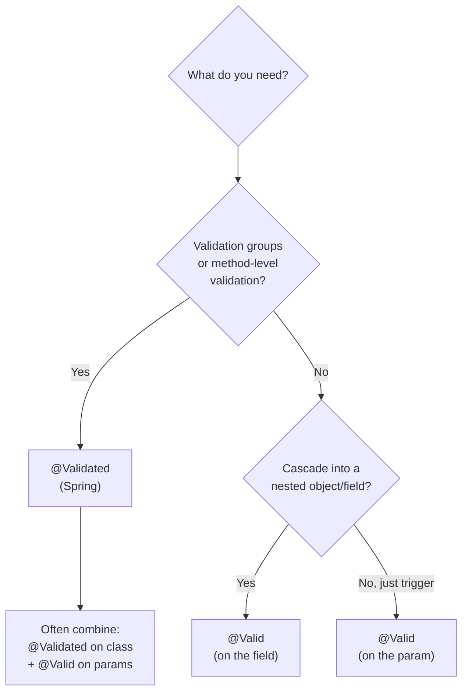

# Bean Validation in Spring Boot

## 1. What

**Bean Validation** is a Java specification (JSR-380, i.e. **Jakarta Bean Validation 3.0**) that lets you attach **declarative constraint metadata** — annotations like `@NotNull`, `@Size`, `@Email` — to fields, method parameters, and return values, and then have a **runtime engine** check that data against those constraints. The spec is just an API (`jakarta.validation.*`); the actual validation logic lives in an implementation. Spring Boot ships **Hibernate Validator**, the reference implementation.

Two moving parts, always:

| Part | Role | Example |
| --- | --- | --- |
| **Constraint metadata** | Declarative annotations describing *what "valid" means* | `@NotBlank String name;` |
| **Validation engine** | Reads metadata + evaluates it against an instance at runtime | Hibernate Validator |

> [!IMPORTANT]
> Since **Spring Boot 2.3+**, Bean Validation is **NOT** transitively pulled in by `spring-boot-starter-web`. You must add `spring-boot-starter-validation` explicitly, or your `@Valid`/`@NotNull` annotations will silently do nothing (compile fine, never fire).

```xml
<dependency>
  <groupId>org.springframework.boot</groupId>
  <artifactId>spring-boot-starter-validation</artifactId>
</dependency>
```

> [!WARNING]
> **Namespace change in Boot 3.** The whole API moved from `javax.validation.*` (Boot 2 / Jakarta EE 8) to `jakarta.validation.*` (Boot 3 / Jakarta EE 9+). Copy-pasting old snippets with `import javax.validation.constraints.NotNull;` will fail to resolve on Boot 3.2. Always `import jakarta.validation.*`.

## 2. Why

- **Separation of concerns.** Input-format rules live *next to the data* (the DTO), not scattered across controllers as `if` checks.
- **Fail fast at the boundary.** Reject malformed requests before they reach the service/DB, returning a clean 400 instead of a 500 or a corrupt row.
- **Declarative & composable.** One annotation replaces boilerplate null/length/regex checks; constraints compose and can be custom-built.
- **Reusable across layers.** The same DTO constraints apply whether the object arrives via REST, a message queue, or is validated programmatically.
- **Consistent error surface.** All violations funnel through a couple of well-known exceptions you can map globally in one `@ControllerAdvice`.

The distinction that senior engineers must hold: Bean Validation is for **syntactic / format validity** (is this a well-formed email? is age between 0 and 150?). It is **not** for business rules (is this email already taken? does the user have budget?). More on that in §3.7.

## 3. How

### 3.1 Built-in constraints

The single most-asked trap is **`@NotNull` vs `@NotEmpty` vs `@NotBlank`**. Memorize this:

| Constraint | Applies to | Rejects `null`? | Rejects empty (`""`, `[]`)? | Rejects whitespace-only (`"  "`)? |
| --- | --- | --- | --- | --- |
| `@NotNull` | any type | yes | no | no |
| `@NotEmpty` | `String`, `Collection`, `Map`, array | yes | yes | no |
| `@NotBlank` | `String` **only** | yes | yes | **yes** |

So `@NotBlank` is the strictest for strings (`"   "` fails), `@NotEmpty` also rejects empty collections, and `@NotNull` only guards against `null`.

Other core constraints:

| Constraint | Meaning / notes |
| --- | --- |
| `@Size(min=, max=)` | Length/size of `String`, `Collection`, `Map`, array |
| `@Min(v)` / `@Max(v)` | Numeric bound (integral types) |
| `@Positive` / `@PositiveOrZero` | > 0 / >= 0 |
| `@Negative` / `@NegativeOrZero` | < 0 / <= 0 |
| `@Email` | Well-formed email (syntactic only — does NOT verify the mailbox exists) |
| `@Pattern(regexp=)` | Matches a regex |
| `@Past` / `@PastOrPresent` | Date/time in the past — works on `LocalDate`, `Instant`, etc. |
| `@Future` / `@FutureOrPresent` | Date/time in the future |
| `@Digits(integer=, fraction=)` | Numeric precision (e.g. money: `@Digits(integer=6, fraction=2)`) |
| `@DecimalMin` / `@DecimalMax` | Bound expressed as a `String` (good for `BigDecimal`) |

```java
import jakarta.validation.constraints.*;
import java.math.BigDecimal;
import java.time.LocalDate;

public record CreateUserRequest(
    @NotBlank @Size(max = 50) String username,   // non-null, non-blank, <=50 chars
    @NotBlank @Email             String email,     // syntactic email check only
    @Min(18) @Max(120)           int age,          // primitive: never null, so no @NotNull
    @PastOrPresent               LocalDate dob,    // cannot be in the future
    @Digits(integer = 6, fraction = 2)
    @PositiveOrZero              BigDecimal balance // up to 999999.99, >= 0
) {}
```

> [!WARNING]
> On **primitives** (`int`, `long`, `boolean`) `@NotNull` is meaningless — a primitive can never be null; it defaults to `0`/`false`. Use the boxed type (`Integer`) if "absent" must be distinguishable from "zero".

### 3.2 Triggering validation on a controller

Two distinct failure paths, driven by *where* the data lives:

```java
@RestController
@RequestMapping("/api/users")
@Validated                       // needed for @RequestParam/@PathVariable validation (§3.10)
public class UserController {

    // (A) Body validation: @Valid on the @RequestBody
    @PostMapping
    public ResponseEntity<Void> create(@Valid @RequestBody CreateUserRequest req) {
        // reached ONLY if req passes all constraints
        return ResponseEntity.status(201).build();
    }

    // (B) Param/path validation: constraint directly on the parameter,
    //     enabled by @Validated on the class
    @GetMapping("/search")
    public List<UserDto> search(
        @RequestParam @Size(min = 2, max = 30) String q,
        @RequestParam @Min(1) @Max(100) int limit) {
        return userService.search(q, limit);
    }
}
```

**The exception each path throws is different — this is the #1 gotcha for error handling:**

| Trigger | On failure Spring throws | Default HTTP status |
| --- | --- | --- |
| `@Valid @RequestBody` (bean) | `MethodArgumentNotValidException` | 400 |
| `@Validated` + constraint on `@RequestParam`/`@PathVariable` | `ConstraintViolationException` | 500 (unless mapped!) |

```mermaid
flowchart TD
    A[HTTP request arrives] --> B{Where is the data?}
    B -->|@RequestBody DTO| C["@Valid on the param"]
    B -->|@RequestParam / @PathVariable| D["@Validated on class<br/>+ constraint on param"]
    C --> E[Argument resolver binds JSON<br/>then invokes validator]
    D --> F[MethodValidationInterceptor<br/>proxy validates args]
    E -->|violation| G[throws MethodArgumentNotValidException]
    F -->|violation| H[throws ConstraintViolationException]
    G --> I["@ControllerAdvice maps to 400 body"]
    H --> I
    E -->|ok| J[controller method body runs]
    F -->|ok| J
```

Handle both in a `@ControllerAdvice` so clients always get a clean 400 (this repo has a dedicated exception-handling note — the validation handlers live there):

```java
@RestControllerAdvice
public class ValidationExceptionHandler {

    // Body DTO failures
    @ExceptionHandler(MethodArgumentNotValidException.class)
    @ResponseStatus(HttpStatus.BAD_REQUEST)
    public Map<String, String> onBodyInvalid(MethodArgumentNotValidException ex) {
        Map<String, String> errors = new HashMap<>();
        for (FieldError fe : ex.getBindingResult().getFieldErrors()) {
            errors.put(fe.getField(), fe.getDefaultMessage());
        }
        return errors;
    }

    // Param/path failures — WITHOUT this handler these surface as 500
    @ExceptionHandler(ConstraintViolationException.class)
    @ResponseStatus(HttpStatus.BAD_REQUEST)
    public Map<String, String> onParamInvalid(ConstraintViolationException ex) {
        Map<String, String> errors = new HashMap<>();
        for (ConstraintViolation<?> v : ex.getConstraintViolations()) {
            errors.put(v.getPropertyPath().toString(), v.getMessage());
        }
        return errors;
    }
}
```

### 3.3 `@Valid` vs `@Validated`

| Aspect | `@Valid` (`jakarta.validation.Valid`) | `@Validated` (`org.springframework.validation.annotation.Validated`) |
| --- | --- | --- |
| Origin | Jakarta standard (spec) | Spring-specific |
| Validation **groups** | Not supported | **Supported** — `@Validated(OnCreate.class)` |
| **Cascades** into nested objects | **Yes** (put it on the field) | No (it is not a cascade marker) |
| Enables **method-level** validation on a bean | No | **Yes** — put at class level to activate the AOP proxy |
| Typical placement | Method params, nested fields | Class level (controllers, services) |

Rule of thumb: use **`@Valid` on the parameter/field** to trigger and cascade; use **`@Validated` at the class level** when you need groups or method-level validation on `@RequestParam`/service methods. They are commonly used *together*.



### 3.4 Nested & cascade validation

Constraints do **not** recurse automatically. To validate a nested object, annotate the *field* with `@Valid`. For collections, annotate the *element type*.

```java
public record OrderRequest(
    @NotNull @Valid Customer customer,        // recurse into Customer's constraints
    @NotEmpty List<@Valid OrderLine> lines,   // validate EACH element
    @Valid Map<@NotBlank String, @Valid Coupon> coupons // keys and values
) {}

public record Customer(@NotBlank String name, @Email String email) {}
public record OrderLine(@NotBlank String sku, @Positive int qty) {}
```

Without the inner `@Valid`, `customer` is checked for `@NotNull` only — its own `@NotBlank`/`@Email` are ignored. Same for list elements: `@NotEmpty` checks the list isn't empty, but `@Valid` on the element type is what validates each `OrderLine`.

### 3.5 Validation groups

Groups let one DTO carry **different rules for different operations** — the classic *create vs update*: `id` must be null on create but required on update.

```java
// Marker interfaces — no methods, just group tags
public interface OnCreate {}
public interface OnUpdate {}

public class ProductRequest {

    @Null(groups = OnCreate.class)       // must be absent when creating
    @NotNull(groups = OnUpdate.class)    // must be present when updating
    private Long id;

    @NotBlank(groups = {OnCreate.class, OnUpdate.class}) // both
    private String name;

    @PositiveOrZero
    private BigDecimal price; // no group => Default group only
    // getters/setters...
}
```

```java
@RestController
@RequestMapping("/products")
public class ProductController {

    @PostMapping                                   // create
    public void create(@Validated(OnCreate.class) @RequestBody ProductRequest r) { }

    @PutMapping("/{id}")                            // update
    public void update(@Validated(OnUpdate.class) @RequestBody ProductRequest r) { }
}
```

> [!WARNING]
> Groups are a **Spring `@Validated`** feature — plain `@Valid` cannot select a group. Also: a constraint with **no** `groups` attribute belongs only to the `Default` group, so `@Validated(OnCreate.class)` will **skip** it. If you want a constraint to run in a custom group, list that group explicitly (or make your group extend `Default`).

### 3.6 Custom constraints

**Single-field custom constraint** — a reusable `@StrongPassword`:

```java
import jakarta.validation.*;
import java.lang.annotation.*;
import static java.lang.annotation.ElementType.*;
import static java.lang.annotation.RetentionPolicy.RUNTIME;

@Documented
@Constraint(validatedBy = StrongPasswordValidator.class)
@Target({FIELD, PARAMETER})
@Retention(RUNTIME)
public @interface StrongPassword {
    String message() default "password must be 8+ chars with upper, lower, digit & symbol";
    Class<?>[] groups() default {};                 // REQUIRED by the spec
    Class<? extends Payload>[] payload() default {}; // REQUIRED by the spec
}
```

```java
public class StrongPasswordValidator
        implements ConstraintValidator<StrongPassword, String> {

    private static final Pattern P = Pattern.compile(
        "^(?=.*[a-z])(?=.*[A-Z])(?=.*\\d)(?=.*[^A-Za-z0-9]).{8,}$");

    @Override
    public boolean isValid(String value, ConstraintValidatorContext ctx) {
        // Let @NotNull handle null; a null value is treated as valid here
        return value == null || P.matcher(value).matches();
    }
}
```

The `message()`, `groups()`, and `payload()` methods are **mandatory** on any constraint annotation — omitting them fails at startup. Convention: return `true` for `null` and delegate nullness to a separate `@NotNull` (keeps constraints single-responsibility).

**Cross-field (class-level) constraint** — e.g. `password == confirmPassword`. The validator targets the *whole object*:

```java
@Documented
@Constraint(validatedBy = PasswordsMatchValidator.class)
@Target(TYPE)                 // class-level
@Retention(RUNTIME)
public @interface PasswordsMatch {
    String message() default "passwords do not match";
    Class<?>[] groups() default {};
    Class<? extends Payload>[] payload() default {};
}

@PasswordsMatch
public class SignupRequest {
    @StrongPassword private String password;
    private String confirmPassword;
    // getters...
}

public class PasswordsMatchValidator
        implements ConstraintValidator<PasswordsMatch, SignupRequest> {
    @Override
    public boolean isValid(SignupRequest r, ConstraintValidatorContext ctx) {
        boolean ok = Objects.equals(r.getPassword(), r.getConfirmPassword());
        if (!ok) {
            // attach the error to a specific field instead of the class
            ctx.disableDefaultConstraintViolation();
            ctx.buildConstraintViolationWithTemplate(ctx.getDefaultConstraintMessageTemplate())
               .addPropertyNode("confirmPassword")
               .addConstraintViolation();
        }
        return ok;
    }
}
```

`ConstraintValidator` beans are Spring-managed, so you can inject dependencies (e.g. a repository) into a custom validator — but see §3.7 before you reach for the DB there.

### 3.7 Where NOT to put validation

Bean Validation covers **format / syntactic** rules only. **Business rules belong in the service layer.**

| Belongs in Bean Validation (DTO) | Belongs in the service layer |
| --- | --- |
| `@Email`, `@Size`, `@Pattern`, `@Positive` | "Is this email already registered?" (uniqueness) |
| null / range / length checks | Cross-aggregate consistency, quota/budget checks |
| password *strength* format | authorization ("can THIS user do it?") |
| within-object cross-field (`password==confirm`) | anything needing a transaction or external call |

> [!IMPORTANT]
> It is tempting to inject a `UserRepository` into a `@UniqueEmail` validator. Avoid it for real business invariants: uniqueness has a **race condition** (two concurrent requests both pass the check, then both insert) that only a **DB unique constraint + transaction** can truly enforce. Bean Validation runs *outside* the transaction and cannot guarantee it. Keep such rules in the service, backed by a DB constraint.

### 3.8 Programmatic validation

When there is no controller boundary — e.g. validating a message-queue payload or a batch record — inject the `Validator` and validate by hand:

```java
@Service
public class ImportService {

    private final Validator validator; // jakarta.validation.Validator

    public ImportService(Validator validator) { // auto-configured by Boot
        this.validator = validator;
    }

    public void process(CreateUserRequest req) {
        Set<ConstraintViolation<CreateUserRequest>> violations = validator.validate(req);
        if (!violations.isEmpty()) {
            // e.g. rethrow as a ConstraintViolationException, or log & skip the record
            throw new ConstraintViolationException(violations);
        }
        // ... persist
    }
}
```

`validator.validate(obj)` returns a `Set<ConstraintViolation>` — **empty means valid**. You can also validate a single property (`validateProperty`) or against groups (`validate(obj, OnCreate.class)`).

### 3.9 Method-level validation on services

`@Validated` on a bean class activates a `MethodValidationPostProcessor` proxy, so constraints on service method params/return values are enforced:

```java
@Service
@Validated   // enables method validation via an AOP proxy
public class PricingService {

    // validated on invocation; failure => ConstraintViolationException
    public BigDecimal quote(@NotBlank String sku, @Positive int qty) { ... }

    @NotNull  // return value is validated too
    public Receipt charge(@Valid PaymentDetails details) { ... }
}
```

> [!WARNING]
> Method validation works via a **Spring AOP proxy**. If you call the method **from within the same class** (a `this.quote(...)` self-invocation), the proxy is bypassed and **no validation runs**. Same limitation as `@Transactional`.

### 3.10 Customizing messages

Externalize messages to `src/main/resources/ValidationMessages.properties` (auto-detected by Hibernate Validator) and reference them with braces:

```java
@Size(max = 50, message = "{user.username.tooLong}")
private String username;
```

```properties
# ValidationMessages.properties
user.username.tooLong=Username must be at most {max} characters
```

`{max}` interpolates the constraint attribute. You can also use `${validatedValue}` for the rejected value.

## 4. Interview Angles

- **Q: What's the exact difference between `@NotNull`, `@NotEmpty`, and `@NotBlank`?**
  `@NotNull` only rejects `null` (any type). `@NotEmpty` rejects null *and* empty for `String`/`Collection`/`Map`/array (`""`, `[]`). `@NotBlank` is `String`-only and additionally rejects whitespace-only (`"   "`). Order of strictness for strings: `@NotBlank` > `@NotEmpty` > `@NotNull`.

- **Q: My `@NotNull` annotations aren't doing anything — why?**
  Most likely `spring-boot-starter-validation` is missing (not bundled with `-web` since Boot 2.3+), OR you forgot `@Valid` on the controller param, OR (on Boot 3) you imported `javax.validation` instead of `jakarta.validation`. Also, on a service method, the class needs `@Validated` and you must call it through the proxy.

- **Q: `@Valid` vs `@Validated` — when do you reach for each?**
  `@Valid` is the Jakarta standard: it triggers validation and, on a field, **cascades** into nested objects. `@Validated` is Spring's: it adds **validation groups** and enables **method-level** validation when placed at class level. Groups and `@RequestParam`/`@PathVariable` validation require `@Validated`; nested-object cascade requires `@Valid`. They're often combined.

- **Q: Why do body validation and query-param validation throw different exceptions?**
  A `@Valid @RequestBody` bean is validated by the argument resolver → `MethodArgumentNotValidException` (already a 400). `@RequestParam`/`@PathVariable` constraints are validated by the method-validation proxy (enabled by `@Validated` on the class) → `ConstraintViolationException`, which defaults to **500** unless you map it to 400 in a `@ControllerAdvice`.

- **Q: How do you enforce different rules for create vs update on the same DTO?**
  Validation groups: define marker interfaces (`OnCreate`, `OnUpdate`), tag constraints with `groups=`, and select the group with `@Validated(OnCreate.class)` on the endpoint. Classic case: `@Null(groups=OnCreate)` + `@NotNull(groups=OnUpdate)` on the `id`. Remember a no-group constraint is only in `Default` and is skipped when you validate a custom group.

- **Q: Walk me through writing a custom constraint.**
  Define the annotation: meta-annotate with `@Constraint(validatedBy=XValidator.class)`, `@Target`, `@Retention(RUNTIME)`, and declare the mandatory `message()`, `groups()`, `payload()`. Implement `ConstraintValidator<Ann, T>` and put the logic in `isValid`. For cross-field checks, target the *class* (`@Target(TYPE)`) and validate the whole object. Validators are Spring beans, so DI works.

- **Q: Should uniqueness (email already exists) be a Bean Validation constraint?**
  No — that's a business rule with a race condition Bean Validation can't close (it runs outside the transaction). Enforce it in the service with a DB unique constraint. Bean Validation is for **format/syntax**; business invariants belong in the service layer.

- **Q: Why doesn't my `@Validated` service method validate when called from another method in the same class?**
  Method validation is proxy-based (Spring AOP). Self-invocation (`this.method()`) bypasses the proxy, so the interceptor never runs — identical to the `@Transactional` self-invocation pitfall. Call through the injected bean reference instead.

- **Q: How do you validate every element of a `List<Item>`?**
  Annotate the element type: `List<@Valid Item>` (and `@NotEmpty`/`@Size` on the list itself for the collection). Nested objects need `@Valid` on the field to cascade — constraints never recurse on their own.

- **Q: How do you validate objects outside of a web request (e.g. Kafka payloads)?**
  Inject `jakarta.validation.Validator`, call `validator.validate(obj)`, and inspect the returned `Set<ConstraintViolation>` (empty = valid). Handle violations however the pipeline needs — throw, dead-letter, or skip.
