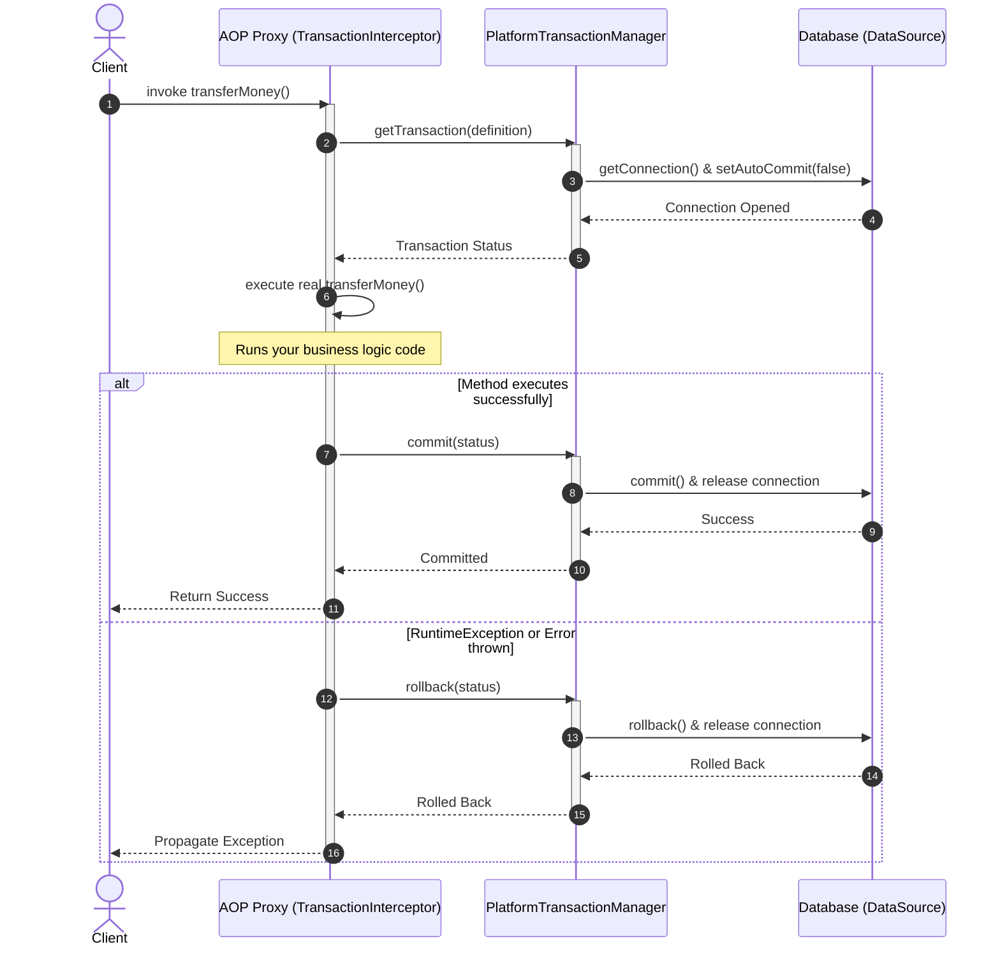
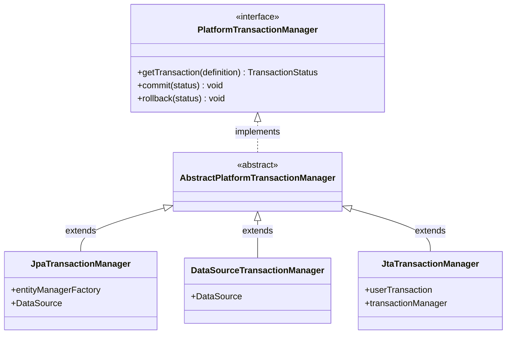
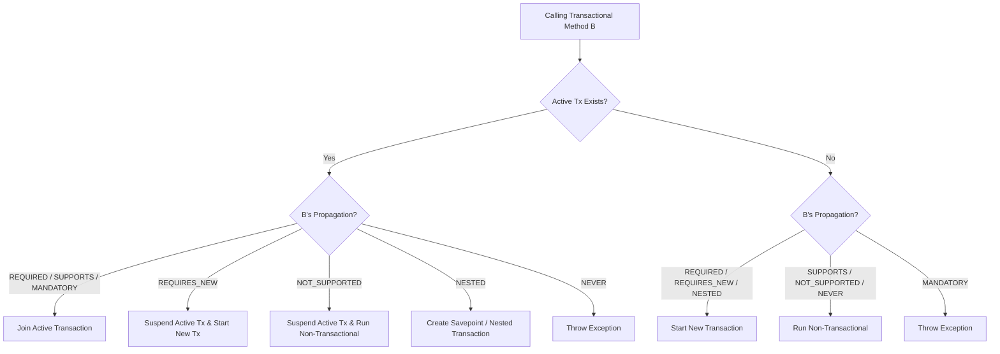

# Spring Transaction Management — A Complete Beginner's Guide 🏦

---

## 1. What is a Transaction?

Imagine you are transferring $100 to your friend's account. This operation has two steps:
1. Deduct $100 from your account.
2. Add $100 to your friend's account.

What happens if Step 1 succeeds, but the system crashes before Step 2? Your money is gone, and your friend never received it! 

To prevent this, we group these steps into a single **Database Transaction**. A transaction guarantees that either **both steps succeed** (Commit), or if anything goes wrong, **both steps fail** and the database goes back to its original state (Rollback).

### The ACID Properties (Quick Recall)
* **Atomicity**: All-or-nothing (either all steps execute, or none do).
* **Consistency**: The database goes from one valid state to another.
* **Isolation**: Concurrent transactions don't mess with each other.
* **Durability**: Once committed, changes are safe (even if the server loses power).

### What is a "Critical Section"?
In programming, a **Critical Section** is a block of code that accesses a shared resource (like a database or a variable) and must not be run by multiple threads at the exact same time. In databases, transactions (along with isolation levels and locking) are how we manage critical sections to prevent data corruption.

---

## 2. Why Use Spring Transaction Management?

Without Spring, managing transactions in JDBC requires a lot of repetitive boilerplate code:
```java
Connection conn = dataSource.getConnection();
try {
    conn.setAutoCommit(false); // Start transaction
    
    // Business Logic
    updateAccountA();
    updateAccountB();
    
    conn.commit(); // Commit transaction
} catch (Exception e) {
    conn.rollback(); // Rollback on error
} finally {
    conn.close();
}
```
Spring solves this by providing **Declarative Transaction Management** via AOP. You just write `@Transactional` on top of your method, and Spring handles all the connection opening, committing, rolling back, and closing behind the scenes!

---

## 3. How It Works (Deep Dive)

### 3.1 How AOP Manages Transactions Under the Hood
Spring Transactions are powered by **Spring AOP**. When you put `@Transactional` on a class or method, Spring wraps your bean in a **Proxy**.



1. **The Proxy Intercepts**: When a method is called, the proxy's `TransactionInterceptor` intercepts it.
2. **Transaction Manager Invoked**: The interceptor asks the `PlatformTransactionManager` to start a transaction.
3. **Connection Opened**: The manager obtains a database connection, binds it to the current thread, and disables auto-commit (`conn.setAutoCommit(false)`).
4. **Execution**: Your real business method executes.
5. **Commit or Rollback**:
   - If the method returns normally $\rightarrow$ The manager commits the transaction.
   - If the method throws a **Runtime Exception** (`RuntimeException` or `Error`) $\rightarrow$ The manager rolls back the transaction. *(Note: Checked exceptions do NOT trigger rollback by default unless configured).*

---

### 3.2 The Transaction Manager Hierarchy
Spring separates *how* a transaction is managed from the actual database tool you use. It does this via the **`PlatformTransactionManager`** interface:



---

### 3.3 Declarative vs. Programmatic Transactions

There are two ways to manage transactions in Spring:

#### 1. Declarative Approach (Recommended)
You use the `@Transactional` annotation. It is clean and metadata-driven.
* **Class-level**: Putting `@Transactional` on a class means **every public method** in that class gets wrapped in a transaction.
* **Method-level**: Putting it on a method applies transactions only to that specific method. (Method-level settings override class-level settings).

#### 2. Programmatic Approach
You write code to manage transactions manually. This is useful when you need fine-grained control (e.g. only 2 lines of a 100-line method need a transaction).
* **Using `TransactionTemplate`**:
  ```java
  @Autowired
  private TransactionTemplate transactionTemplate;

  public void doSomeWork() {
      // Non-transactional code here...
      
      transactionTemplate.execute(status -> {
          // This code runs inside a transaction!
          updateDatabase1();
          updateDatabase2();
          return null; 
      });
      
      // More non-transactional code...
  }
  ```

---

### 3.4 Transaction Propagation (The Rules of Joining)
Propagation defines **how transactions behave when one transactional method calls another**.

Imagine **Method A (Transactional)** calls **Method B (Transactional)**:

| Propagation | Simple Definition | Analogy |
| :--- | :--- | :--- |
| **`REQUIRED`** *(Default)* | B needs a transaction. If A has one, B joins it. Otherwise, B starts a new one. | *"I need a coat. If you have a coat, we will share it. If not, I'll buy one."* |
| **`REQUIRES_NEW`** | B always wants its own fresh transaction. If A has one, A's transaction is **paused** until B finishes. | *"I want my own coat. Even if you offer to share yours, I will go buy a new one."* |
| **`SUPPORTS`** | B doesn't care. If A has a transaction, B joins it. If A doesn't, B runs without one. | *"I'll wear a coat only if you are wearing one. Otherwise, I'm fine without it."* |
| **`NOT_SUPPORTED`** | B must run without a transaction. If A has one, it is **paused** until B finishes. | *"I refuse to wear a coat. If you are wearing one, please take it off while we talk."* |
| **`MANDATORY`** | B must run in a transaction. If A doesn't have one, B throws an exception! | *"I refuse to go out unless you are already wearing a coat. If not, I'll scream (Error)!"* |
| **`NEVER`** | B must run without a transaction. If A has one, B throws an exception! | *"If I see you wearing a coat, I will scream (Error)!"* |
| **`NESTED`** | If A has a transaction, B starts a **nested transaction** (savepoint). B can fail and rollback without rolling back A. | *"I will put a small coat inside your big coat. If mine gets dirty, I'll take mine off, but yours stays clean."* |

#### Propagation Decision Flowchart



---

### 3.5 Database Concurrency Problems (The Read Problems)
When multiple users read and write to the database at the same time, three classic problems occur:

#### 1. Dirty Read
* **Problem**: Transaction A changes a row but **does not commit**. Transaction B reads the changed row. Transaction A then rolls back. Transaction B now has "dirty" data that never actually existed!
* **Example**: Balance is $100 $\rightarrow$ A updates it to $150 (uncommitted) $\rightarrow$ B reads $150 $\rightarrow$ A rolls back to $100. B still thinks it is $150.

#### 2. Non-Repeatable Read
* **Problem**: Transaction A reads a row. Transaction B updates/deletes that row and commits. Transaction A reads the row again and gets a **different value** (or the row is gone).
* **Example**: A reads balance as $100 $\rightarrow$ B updates it to $120 & commits $\rightarrow$ A reads it again and gets $120. Inside the same transaction A, two reads returned different values!

#### 3. Phantom Read
* **Problem**: Transaction A reads a **range of rows** (e.g. *"all users with age > 20"* $\rightarrow$ returns 3 rows). Transaction B inserts a **new user** (age 25) and commits. Transaction A runs the query again and gets 4 rows. The new row is a "phantom".
* **Example**: A counts users as 3 $\rightarrow$ B inserts a user $\rightarrow$ A counts again and gets 4.

---

### 3.6 DB Locking Types
To prevent these concurrency problems, databases lock rows:
- **Shared Lock (S-Lock / Read Lock)**: Multiple transactions can hold a shared lock on a row to read it. While active, **no one can write** to it.
- **Exclusive Lock (X-Lock / Write Lock)**: Only one transaction can hold this lock to update/delete a row. **No one else can read or write** to it.

---

### 3.7 Database Isolation Levels
Isolation levels define **how isolated one transaction is from others**. We trade performance for safety.

| Isolation Level | Dirty Reads | Non-Repeatable Reads | Phantom Reads | Mechanism (Under the Hood) |
| :--- | :---: | :---: | :---: | :--- |
| **`READ_UNCOMMITTED`** | ❌ (Allowed) | ❌ (Allowed) | ❌ (Allowed) | No locks. Fastest, but highly unsafe. |
| **`READ_COMMITTED`** | ✅ (Prevented) | ❌ (Allowed) | ❌ (Allowed) | **Lock-based DBs (e.g. SQL Server):** a short shared read lock is taken and released as soon as the read finishes. **MVCC DBs (Postgres default, Oracle):** each statement reads a fresh committed snapshot — no shared read locks, readers don't block writers. |
| **`REPEATABLE_READ`** | ✅ (Prevented) | ✅ (Prevented) | ❌ (Allowed)* | **Lock-based DBs:** shared read locks held until the transaction finishes. **MVCC DBs (Postgres, Oracle):** the whole transaction reads from a single snapshot taken at its start (so no S-locks; readers still don't block writers). *(Note: MySQL InnoDB, which is MVCC-based, also prevents Phantom Reads here via Next-Key locks.)* |
| **`SERIALIZABLE`** | ✅ (Prevented) | ✅ (Prevented) | ✅ (Prevented) | Lock-based DBs use range locks; Postgres uses Serializable Snapshot Isolation (SSI) which monitors snapshots and aborts conflicting transactions. Effectively serial — slowest. |

> **MVCC vs. locking — the key correction:** The "read lock" descriptions above describe **lock-based** databases. **Postgres (default `READ_COMMITTED`) and Oracle implement isolation via MVCC snapshots, not shared read locks.** Readers see a consistent committed snapshot and take no S-locks, so **readers never block writers and writers never block readers**. Only write/write conflicts on the same row cause blocking.

---

## 4. Code Example

### 1. Declarative Approach (`@Transactional`)
```java
@Service
public class BankService {

    @Autowired
    private AccountRepository accountRepository;

    @Transactional(propagation = Propagation.REQUIRED, isolation = Isolation.READ_COMMITTED)
    public void transferMoney(Long fromId, Long toId, Double amount) {
        Account from = accountRepository.findById(fromId)
            .orElseThrow(() -> new IllegalArgumentException("Account not found"));
        Account to = accountRepository.findById(toId)
            .orElseThrow(() -> new IllegalArgumentException("Account not found"));

        from.debit(amount);
        to.credit(amount);

        accountRepository.save(from);
        accountRepository.save(to);
        // Transaction commits here automatically at the end of the method!
    }
}
```

### 2. Programmatic Approach (`TransactionTemplate`)
```java
@Service
public class AuditService {

    @Autowired
    private TransactionTemplate transactionTemplate;
    @Autowired
    private AuditRepository auditRepository;

    public void logAudit(String message) {
        // Run this specific database insert inside a transaction
        transactionTemplate.execute(status -> {
            AuditLog log = new AuditLog(message);
            auditRepository.save(log);
            return null;
        });
    }
}
```

---

## 4.1 Physical vs. Logical Transactions (The Rollback-Only Trap 🪤)

When multiple Spring Beans share a transaction (e.g., Method A (`REQUIRED`) calls Method B (`REQUIRED`)), they execute inside the same **physical database connection/transaction**. However, Spring tracks each method invocation boundary as a separate **logical transaction**.

### The Trap:
If Method B fails and throws an exception, Spring marks the physical transaction as **`rollbackOnly = true`**. 

Even if Method A catches B's exception in a `try-catch` block and proceeds normally, **the physical transaction is already poisoned**. When Method A finishes and attempts to commit, Spring throws an **`UnexpectedRollbackException`** and rolls back the database.

```mermaid
sequenceDiagram
    autonumber
    actor Client
    participant ServiceA as ServiceA (REQUIRED)
    participant ServiceB as ServiceB (REQUIRED)
    participant TxManager as TransactionManager (Connection)

    Client->>ServiceA: Call methodA()
    ServiceA->>TxManager: Begin physical connection / Tx
    TxManager-->>ServiceA: Active Transaction
    
    ServiceA->>ServiceB: Call methodB()
    Note over ServiceB: Reuses physical transaction (Logical Tx 2)
    ServiceB->>ServiceB: Exception occurs!
    ServiceB->>TxManager: Mark physical Tx as ROLLBACK-ONLY
    ServiceB-->>ServiceA: Propagate Exception
    
    Note over ServiceA: catch(Exception e) <br> Handle exception & try to commit
    ServiceA->>TxManager: Commit physical transaction
    
    TxManager->>TxManager: Check status (rollbackOnly = true)
    TxManager->>TxManager: Rollback physical database connection!
    TxManager-->>ServiceA: Throw UnexpectedRollbackException
    ServiceA-->>Client: Propagate UnexpectedRollbackException

    style TxManager fill:#eceff1,stroke:#37474f,stroke-width:2px
```

### The Fixes:
1. **Change propagation of Method B** to `REQUIRES_NEW` (so B runs in an independent database connection).
2. **Do not catch the exception in A** if you want the whole operation to fail gracefully as a single unit.

---

## 4.2 Read-Only Transaction Optimization (`readOnly = true`) ⚡

For database query-only operations, always annotate methods with `@Transactional(readOnly = true)`. This performs several high-value optimizations under the hood:

1. **Hibernate Flush Mode Optimization:** 
   - Sets the flush mode to `FlushMode.MANUAL`. Since the transaction is read-only, Hibernate bypasses the creation of snapshot copies of entities, disabling dirty checking. This saves significant CPU and JVM memory.
2. **Database Driver Optimization:** 
   - Some JDBC drivers (like Oracle or MySQL) configure the active database session to read-only, allowing the database engine to skip locks or route queries to read-replicas.

```java
@Transactional(readOnly = true)
public List<UserDTO> findAllUsers() {
    return userRepository.findAll().stream().map(UserDTO::new).toList();
}
```

---

## 4.3 Customizing Rollback Rules 🛠️

By default, Spring rolls back transactions only on **Unchecked Exceptions** (`RuntimeException` and `Error`). It commits on **Checked Exceptions** (like `IOException` or `SQLException`).

You can override this default behavior using `rollbackFor` and `noRollbackFor`:

```java
@Transactional(
    rollbackFor = {CustomBusinessException.class, IOException.class}, // Rollback on these too
    noRollbackFor = {EntityNotFoundException.class} // Do NOT rollback on this
)
public void updateUserData() throws CustomBusinessException, IOException {
    // business logic
}
```

---

## 5. Interview Angles (Prepare to be Grilled! 🥩)

### Q1: What happens under the hood when a `@Transactional` method is called?
* **Answer**: Spring uses AOP. It wraps your class in a proxy. When the method is called, the proxy's `TransactionInterceptor` intercepts the call, asks the `PlatformTransactionManager` to open a database connection, sets `autoCommit(false)`, and binds it to the current thread. The real method runs, and the manager commits (or rolls back if a `RuntimeException` occurs).

### Q2: Why does `@Transactional` not rollback for checked exceptions by default?
* **Answer**: Historically, Spring follows the EJB convention: `RuntimeException` and `Error` represent system crashes (unrecoverable, so rollback), whereas Checked Exceptions (like `IOException`, `ParseException`) represent business outcomes that the developer should handle explicitly.
* *How to fix*: Use `@Transactional(rollbackFor = Exception.class)`.

### Q3: What is the difference between `REQUIRES_NEW` and `NESTED` propagation?
* **Answer**: 
  - `REQUIRES_NEW` starts a completely **independent** transaction. If Transaction A is paused and Transaction B (`REQUIRES_NEW`) runs, B's commit/rollback has **no impact** on A's final commit/rollback.
  - `NESTED` creates a **child transaction (savepoint)** within Transaction A. If the child rolls back, it goes back to the savepoint, and A can still commit. However, if A rolls back, **both A and B roll back** because they share the same physical database connection.

### Q4: Explain the "Self-Invocation" problem in Transactions.
* **Answer**: If Method A (non-transactional) calls Method B (transactional) inside the same class, the transaction **will not start**. This is because the call `this.methodB()` bypasses the Spring AOP Proxy wrapper and talks directly to the target object.

### Q5: How does MySQL prevent Phantom Reads at the `REPEATABLE_READ` level?
* **Answer**: Standard SQL allows Phantom Reads at `REPEATABLE_READ`. However, MySQL's InnoDB engine uses a locking mechanism called **Next-Key Locking** (which combines Index-Record locks and Gap locks). This locks the gaps between index records, preventing other transactions from inserting new rows (phantoms) into those gaps.

### Q6: What isolation level prevents Dirty Reads but allows Non-Repeatable Reads? How does it do it?
* **Answer**: `READ_COMMITTED`. It ensures that only committed data is read. On **lock-based** databases it does this by taking a short-term shared lock when reading a row and releasing it *immediately* after the read completes. On **MVCC** databases (Postgres default, Oracle) there are no shared read locks at all — each statement simply reads the latest committed snapshot, so a later read in the same transaction can see another transaction's committed change (a non-repeatable read).
